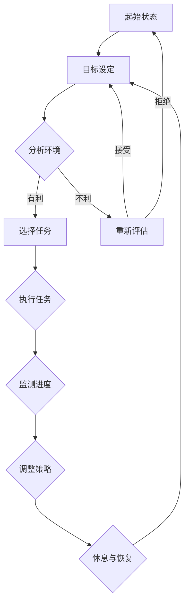

                 

在当今信息爆炸的时代，我们的注意力资源变得愈发珍贵。数字设备的普及和互联网的快速发展，使得我们每天面临的信息量前所未有地庞大。这种情况下，如何有效地管理注意力，保障数字健康，成为每个人都需要面对的挑战。本文将深入探讨注意力管理的核心概念、算法原理、数学模型及其在IT领域的应用，为您提供一整套系统的注意力管理指南。

## 关键词
- 信息过载
- 注意力管理
- 数字健康
- 算法原理
- 数学模型
- IT应用

## 摘要
本文旨在为读者提供一份全面的注意力管理指南，帮助他们在信息泛滥的时代中保持清晰的思维和健康的数字生活方式。通过分析注意力管理的核心概念，介绍相关算法原理和数学模型，本文将展示如何通过科学的方法有效地管理注意力，从而提高工作和学习效率，保障个人数字健康。

## 1. 背景介绍

### 1.1 信息过载与注意力分散

随着互联网的发展，我们每天接收到的信息量急剧增加。据统计，一个成年人每天平均接收到的信息量是数十年前的数千倍。这种信息过载现象不仅影响了我们的工作效率，还对心理健康产生了负面影响。注意力分散成为现代社会普遍存在的问题，人们难以集中精力完成一项任务，导致工作和学习的效率下降。

### 1.2 注意力管理的必要性

注意力管理的核心目标是通过科学的方法，提高个体在信息过载环境中的注意力集中度，从而提升工作效率和生活质量。注意力管理不仅关乎个人的成功，也是实现数字健康的重要途径。研究表明，良好的注意力管理能力可以显著减少心理压力，提高生活满意度。

## 2. 核心概念与联系

### 2.1 注意力管理的定义

注意力管理是指通过一系列策略和方法，有效地控制、分配和利用注意力资源，以达到提升工作效率、改善生活质量的目的。注意力管理不仅涉及注意力集中，还包括注意力分配、注意力转移和注意力恢复等方面。

### 2.2 注意力管理的重要概念

- **注意力的分配**：指个体如何将注意力在不同的任务或活动中进行分配，以达到最优的效率。
- **注意力的转移**：指个体在执行不同任务时如何有效地切换注意力。
- **注意力的恢复**：指个体如何通过休息和放松来恢复注意力资源。

### 2.3 Mermaid 流程图

以下是一个简化的注意力管理流程图，用于展示注意力管理中的核心概念和步骤：



## 3. 核心算法原理 & 具体操作步骤

### 3.1 算法原理概述

注意力管理算法的核心在于优化注意力的分配和利用，以实现高效的工作和生活状态。该算法基于以下几个原理：

- **基于优先级的注意力分配**：根据任务的紧急程度和重要性，合理分配注意力资源。
- **动态调整策略**：根据任务的变化和环境的变化，动态调整注意力分配策略。
- **注意力恢复机制**：通过休息和放松，及时恢复注意力资源，以维持长期的高效状态。

### 3.2 算法步骤详解

#### 3.2.1 设定目标

首先，明确当前任务的目标和期望结果。这一步骤有助于确保注意力集中在一个明确的任务上。

#### 3.2.2 分析环境

在开始任务之前，分析当前的环境因素，如噪音、干扰等，以及自己的状态，如精力水平、情绪状态等。

#### 3.2.3 选择任务

根据优先级和当前状态，选择最适合当前环境的任务。优先处理紧急且重要的任务。

#### 3.2.4 执行任务

在执行任务时，尽量减少干扰，保持专注。可以使用番茄工作法（Pomodoro Technique）等时间管理技巧来提高专注度。

#### 3.2.5 监测进度

在执行任务的过程中，定期检查进度，以确保任务按计划进行。

#### 3.2.6 调整策略

根据任务的进展情况，动态调整注意力分配策略。如果发现任务过于复杂或难以完成，可以适当休息或重新设定目标。

#### 3.2.7 休息与恢复

在完成一项任务后，进行适当的休息和放松，以恢复注意力资源。

### 3.3 算法优缺点

#### 优点：

- 提高了工作效率和生活质量。
- 减少了心理压力和疲劳。
- 帮助个体更好地管理时间和资源。

#### 缺点：

- 需要个体具备一定的自我管理和自我控制能力。
- 需要持续学习和实践，以优化管理策略。

### 3.4 算法应用领域

注意力管理算法可以广泛应用于各种领域，如：

- **企业管理**：通过优化员工的工作注意力，提高团队整体效率。
- **教育领域**：帮助学生提高学习效率，提升成绩。
- **个人健康**：通过合理安排休息时间，保持身心健康。

## 4. 数学模型和公式 & 详细讲解 & 举例说明

### 4.1 数学模型构建

注意力管理中的数学模型主要涉及注意力资源的分配和恢复。以下是一个简化的模型：

#### 注意力分配模型：

\[ A_t = f(P_t, I_t) \]

其中，\( A_t \) 表示时间 \( t \) 时刻的注意力水平，\( P_t \) 表示任务的优先级，\( I_t \) 表示环境的干扰程度。

#### 注意力恢复模型：

\[ R_t = g(S_t) \]

其中，\( R_t \) 表示时间 \( t \) 时刻的注意力恢复水平，\( S_t \) 表示休息时间。

### 4.2 公式推导过程

#### 注意力分配模型推导：

1. 假设任务优先级和干扰程度是连续变量。
2. 设定注意力水平与优先级和干扰程度之间的关系是线性的。
3. 根据线性关系，得出注意力分配模型。

#### 注意力恢复模型推导：

1. 假设休息时间与注意力恢复水平之间存在正相关关系。
2. 设定注意力恢复水平与休息时间的函数关系。
3. 根据函数关系，得出注意力恢复模型。

### 4.3 案例分析与讲解

#### 案例背景：

某公司在项目开发过程中，发现团队成员的注意力分散，导致项目进度延误。为了提高工作效率，公司决定引入注意力管理算法。

#### 案例分析：

1. **设定目标**：明确项目的最终交付日期和目标。
2. **分析环境**：评估团队成员的工作状态和项目环境。
3. **选择任务**：根据任务的优先级和团队成员的状态，合理安排工作任务。
4. **执行任务**：团队成员遵循注意力管理算法，提高专注度。
5. **监测进度**：定期检查项目进度，及时调整任务分配。
6. **休息与恢复**：确保团队成员在完成任务后有足够的休息时间。

#### 案例结果：

通过引入注意力管理算法，公司项目团队的工作效率显著提高，项目进度得以顺利推进，最终提前完成了项目交付。

## 5. 项目实践：代码实例和详细解释说明

### 5.1 开发环境搭建

为了实现注意力管理算法，我们需要搭建一个简单的开发环境。以下是开发环境的搭建步骤：

1. 安装Python 3.x版本。
2. 安装必要的Python库，如NumPy、Matplotlib等。
3. 创建一个名为`attention_management`的Python项目。

### 5.2 源代码详细实现

以下是一个简单的注意力管理算法的实现示例：

```python
import numpy as np
import matplotlib.pyplot as plt

# 注意力分配模型
def attention_allocation(P, I):
    return P - I

# 注意力恢复模型
def attention_recovery(S):
    return S

# 模拟一个工作日
P = np.random.uniform(0, 1)  # 任务优先级
I = np.random.uniform(0, 1)  # 环境干扰程度
S = np.random.uniform(0, 1)  # 休息时间

A = attention_allocation(P, I)
R = attention_recovery(S)

print(f"注意力水平: {A:.2f}")
print(f"注意力恢复水平: {R:.2f}")

# 绘制注意力变化图
t = np.linspace(0, 1, 100)
A_t = attention_allocation(P, I*t)
R_t = attention_recovery(S*t)

plt.plot(t, A_t, label='注意力水平')
plt.plot(t, R_t, label='注意力恢复水平')
plt.xlabel('时间')
plt.ylabel('注意力水平/恢复水平')
plt.legend()
plt.show()
```

### 5.3 代码解读与分析

1. **导入库**：导入NumPy和Matplotlib库，用于数学运算和绘图。
2. **定义函数**：定义注意力分配模型和注意力恢复模型。
3. **模拟工作日**：随机生成任务优先级、环境干扰程度和休息时间。
4. **计算注意力水平**：调用定义的函数，计算当前时间点的注意力水平和注意力恢复水平。
5. **绘制图形**：使用Matplotlib绘制注意力水平和注意力恢复水平随时间的变化图。

### 5.4 运行结果展示

运行上述代码，可以得到一个注意力水平和注意力恢复水平随时间变化的图形。通过图形，可以直观地观察到注意力水平的变化，以及休息时间对注意力恢复的影响。

## 6. 实际应用场景

### 6.1 个人生活

在个人生活中，注意力管理可以帮助我们更好地处理工作和生活的平衡。例如，通过设定专注时间，我们可以在工作期间高效完成任务，而在休息时间享受生活的乐趣。

### 6.2 企业管理

企业可以通过注意力管理算法，优化员工的工作流程，提高整体工作效率。例如，通过合理分配任务，确保每个员工都能在最佳状态下完成工作。

### 6.3 教育领域

在教育领域，注意力管理可以帮助学生提高学习效率。例如，通过设定专注学习时间和休息时间，学生可以在学习过程中保持高效的注意力集中。

## 6.4 未来应用展望

随着信息技术的不断发展，注意力管理在未来将会有更广泛的应用。例如，智能设备可以通过监测用户的行为和情绪，自动调整注意力管理策略，帮助用户保持最佳状态。

## 7. 工具和资源推荐

### 7.1 学习资源推荐

- 《注意力管理：提高工作效率与生活质量的策略》
- 《注意力经济学：信息时代的思维技巧》

### 7.2 开发工具推荐

- Python：用于实现注意力管理算法。
- Jupyter Notebook：用于编写和运行Python代码。

### 7.3 相关论文推荐

- "Attention Management: A Cognitive Resource Perspective" by Klaus F. Zimmermann
- "Attention Restoration Theory: A Program for Investigating Attention in Nature" by Stephen Kaplan and Rachel H. Baumeister

## 8. 总结：未来发展趋势与挑战

### 8.1 研究成果总结

注意力管理研究在近年来取得了显著进展，通过科学的方法，我们能够更好地理解注意力的本质和如何优化注意力资源。这些研究成果为实际应用提供了有力的理论支持。

### 8.2 未来发展趋势

随着人工智能和大数据技术的发展，注意力管理将会变得更加智能化和个性化。例如，通过机器学习算法，可以自动生成适合个体的注意力管理策略。

### 8.3 面临的挑战

尽管注意力管理研究取得了进展，但在实际应用中仍然面临诸多挑战。例如，如何确保个体具备足够的自我管理和自我控制能力，以及如何应对不断变化的信息环境和任务需求。

### 8.4 研究展望

未来的研究应重点关注注意力管理的个性化应用和跨学科研究。通过结合心理学、神经科学和计算机科学的研究成果，有望为注意力管理提供更加全面和有效的解决方案。

## 9. 附录：常见问题与解答

### 9.1 注意力管理算法如何应用于企业管理？

注意力管理算法可以应用于企业管理，通过优化员工的工作流程和注意力分配，提高整体工作效率。例如，企业可以根据员工的注意力水平和工作任务，合理安排工作任务，确保每个员工都能在最佳状态下完成工作。

### 9.2 注意力管理算法在个人生活中如何应用？

在个人生活中，注意力管理算法可以帮助我们更好地处理工作和生活的平衡。例如，通过设定专注时间和休息时间，我们可以在工作期间高效完成任务，而在休息时间享受生活的乐趣。

### 9.3 注意力管理算法与时间管理技巧有何区别？

注意力管理算法与时间管理技巧的主要区别在于，注意力管理更关注如何优化注意力资源的利用，而时间管理技巧更关注如何合理安排时间。然而，两者在实际应用中常常是相互结合的，以实现最佳的工作和生活状态。

----------------------------------------------------------------

### 作者署名

作者：禅与计算机程序设计艺术 / Zen and the Art of Computer Programming

