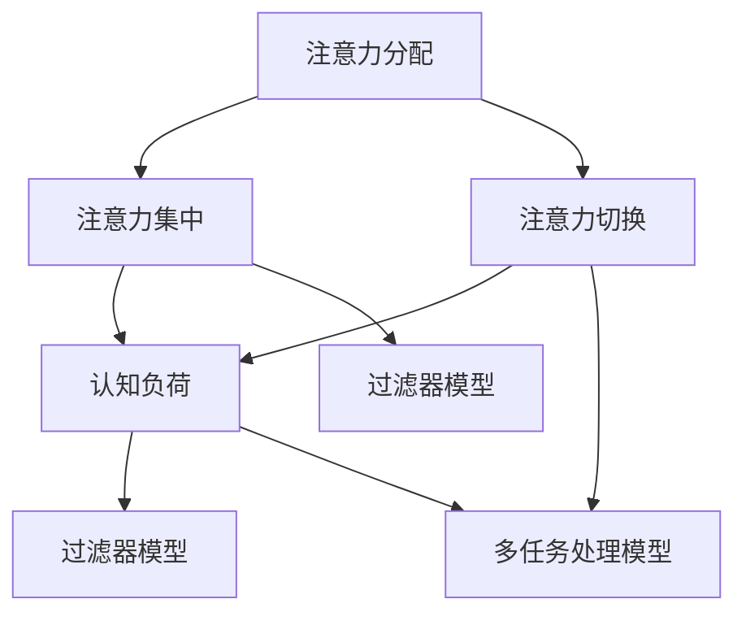

                 

关键词：注意力管理，信息过滤，专注力，分心，技术解决方案，认知负荷，工作效率

> 摘要：在信息爆炸和数字化时代，保持注意力成为提高工作效率和质量的必备能力。本文从心理学和计算机科学的角度，探讨了注意力管理的原理和方法，旨在为读者提供实用的策略和技术，帮助他们在充满干扰的环境中保持专注。

## 1. 背景介绍

在信息时代，人们面临着前所未有的干扰和分心挑战。从社交媒体到即时通讯工具，从电子邮件到无数个打开的网页标签，每一个新信息都可能打断我们的思考和工作。这种持续的干扰不仅消耗了大量的认知资源，还严重影响了我们的专注力和工作效率。因此，如何有效地管理注意力，成为了现代人在信息环境中的一项重要技能。

注意力管理（Attention Management）是指通过一系列策略和技术，提高个体在特定任务中的注意力集中度和效率。这不仅是心理学的研究课题，也是计算机科学和软件工程中的重要问题。例如，操作系统中的多任务处理、应用程序的界面设计、以及电子邮件和社交媒体的过滤机制，都是为了帮助用户更好地管理注意力。

本文将探讨以下核心问题：

- 注意力管理的基本原理是什么？
- 如何在信息爆炸的环境中筛选和过滤重要信息？
- 有哪些技术工具可以帮助我们保持专注？
- 注意力管理在提高工作效率和生产力方面的具体应用是什么？
- 未来注意力管理技术的发展趋势和挑战是什么？

通过以上问题的探讨，本文旨在为读者提供实用的注意力管理策略，帮助他们在信息纷杂的环境中保持专注，提高工作效率和生活质量。

## 2. 核心概念与联系

### 2.1. 注意力管理的基本概念

注意力管理的基础概念包括注意力分配、注意力集中和注意力切换。首先，注意力分配是指个体如何在不同的任务之间分配有限的注意力资源。研究表明，人类注意力资源是有限的，且容易受到干扰。例如，多任务处理时，频繁的注意力切换会导致认知负荷增加，从而降低任务完成的质量和效率。

其次，注意力集中是指个体在特定任务上保持高度集中的状态。这种状态下的个体能够过滤掉干扰信息，专注于当前任务。然而，长时间保持注意力集中会消耗大量能量，导致认知疲劳。

最后，注意力切换是指个体在不同任务或环境之间快速转换注意力的能力。虽然多任务处理能力在现代社会中被广泛推崇，但频繁的注意力切换会影响工作效率和创造力。

### 2.2. 注意力管理模型

为了更好地理解注意力管理，我们可以借助以下几种模型：

- **过滤器模型**：该模型假设人类大脑有一个过滤器，用于筛选和过滤无关的干扰信息。然而，这个过滤器并不完美，容易受到各种因素（如情绪、疲劳等）的影响。

- **认知负荷模型**：该模型认为，个体的认知资源是有限的，且任务复杂性和干扰程度会影响认知负荷。当认知负荷过高时，个体的注意力容易分散。

- **多任务处理模型**：该模型探讨个体在同时处理多个任务时的心理和行为表现。研究表明，多任务处理可能导致注意力分散和工作效率降低。

### 2.3. 注意力管理原理与计算机科学的联系

在计算机科学中，许多设计原则与注意力管理原理有相似之处。例如，操作系统中的多任务处理、应用程序的用户界面设计、以及网络通信的协议优化等，都是为了帮助用户更好地管理注意力。

多任务处理方面，操作系统通过调度算法来管理多个任务的执行，确保每个任务都能获得足够的CPU时间和内存资源。然而，过多任务会导致系统资源竞争，从而影响整体性能。类似地，在人类注意力管理中，过多任务也会导致注意力分散和认知负荷增加。

用户界面设计方面，优秀的界面设计可以减少用户的认知负荷，提高操作效率。例如，通过简化操作步骤、提供清晰的提示和反馈，界面设计可以降低用户在操作过程中的注意力需求。这与注意力管理中的原则相似，即通过减少干扰和简化任务来提高注意力集中度。

网络通信协议方面，优化传输效率和减少延迟也是注意力管理的一种体现。例如，TCP协议通过动态调整传输速率和缓存策略，来提高数据传输的稳定性和效率。这种策略可以帮助用户在网络环境中保持高效的工作状态。

综上所述，注意力管理不仅是一个心理学问题，也是一个计算机科学问题。通过理解注意力管理的基本原理和模型，我们可以更好地设计技术工具和系统，帮助用户在信息环境中保持专注。

### 2.4. Mermaid 流程图展示

以下是一个用于说明注意力管理原理的Mermaid流程图：



在这个流程图中，注意力分配、注意力集中和注意力切换是核心环节，它们与认知负荷和过滤器模型紧密相关。多任务处理模型则展示了在不同任务间切换时，如何影响认知负荷和注意力集中度。

## 3. 核心算法原理 & 具体操作步骤

### 3.1. 算法原理概述

注意力管理的核心算法旨在通过优化信息处理过程，减少干扰，提高注意力集中度。这些算法通常基于以下原理：

- **注意力过滤**：通过算法自动识别和过滤无关信息，减少认知负荷。
- **优先级分配**：根据任务的重要性和紧急程度，分配注意力资源。
- **时间管理**：通过设定特定时间段内的专注任务，提高工作效率。

具体而言，注意力管理算法包括以下步骤：

1. **信息筛选**：使用算法对输入信息进行初步筛选，识别出与当前任务相关的重要信息。
2. **注意力分配**：根据筛选结果，将注意力资源分配到重要的任务上。
3. **注意力维护**：通过定时休息和注意力恢复策略，保持长期的注意力集中。
4. **效果评估**：定期评估注意力管理策略的效果，并根据反馈进行调整。

### 3.2. 算法步骤详解

#### 步骤1：信息筛选

信息筛选是注意力管理的第一步。该步骤的目标是减少干扰，只保留对当前任务有直接关联的信息。具体步骤如下：

- **关键字过滤**：通过关键词匹配技术，从大量信息中筛选出与任务相关的文本和标题。
- **情境感知**：利用情境识别技术，根据用户当前的任务环境和操作行为，筛选出相关信息。
- **机器学习**：使用机器学习算法，根据用户历史行为和偏好，自动标记和过滤信息。

#### 步骤2：注意力分配

在信息筛选后，算法需要根据任务的重要性和紧急程度，分配注意力资源。具体步骤如下：

- **任务优先级评估**：对当前待处理任务进行优先级评估，确定哪些任务需要优先处理。
- **资源分配策略**：根据任务优先级，动态调整注意力资源分配，确保重要任务获得足够的关注。
- **反馈机制**：通过用户反馈，不断优化注意力分配策略，提高分配的准确性。

#### 步骤3：注意力维护

为了保持长期的注意力集中，需要采取一系列维护策略。具体步骤如下：

- **定时休息**：设定固定的休息时间，帮助用户放松大脑，避免过度疲劳。
- **注意力恢复**：通过视觉、听觉等感官刺激，帮助用户恢复注意力。
- **环境调整**：通过优化工作环境，减少外部干扰，如关闭不必要的通知和背景噪音。

#### 步骤4：效果评估

定期评估注意力管理策略的效果，是优化管理过程的关键。具体步骤如下：

- **行为监控**：记录用户在任务中的行为数据，如任务完成时间、注意力集中度等。
- **效果分析**：使用数据分析技术，评估策略在不同场景下的有效性。
- **调整优化**：根据效果分析结果，调整和优化注意力管理策略，提高整体效果。

### 3.3. 算法优缺点

#### 优点

1. **减少干扰**：通过信息筛选和注意力分配，有效减少干扰，提高工作效率。
2. **个性化定制**：基于用户行为和偏好，实现个性化注意力管理，提高用户满意度。
3. **自适应调整**：通过实时监控和反馈机制，动态调整策略，适应不同环境和任务。

#### 缺点

1. **初期设置复杂**：需要大量初始设置和数据收集，才能实现有效的注意力管理。
2. **依赖技术支持**：需要依赖先进的技术，如机器学习和大数据分析，增加了系统的复杂性。
3. **用户接受度**：一些用户可能对自动化的注意力管理策略持怀疑态度，需要逐步培养使用习惯。

### 3.4. 算法应用领域

注意力管理算法在多个领域都有广泛应用，包括：

- **工作效率提升**：通过优化信息处理和任务管理，提高工作效率和生产力。
- **学习效果提升**：帮助学生在学习过程中保持专注，提高学习效率。
- **健康监测**：通过监测和调整注意力状态，帮助用户管理健康，预防认知疲劳。

### 3.5. 注意力管理工具推荐

为了更好地实践注意力管理，以下是几个实用的注意力管理工具：

- **Forest**：一款基于时间管理的应用，通过种植虚拟植物帮助用户保持专注。
- **Focus@Will**：一款专注于提高注意力集中度的音乐应用，提供定制化的背景音乐。
- **Freedom**：一款网络和时间管理工具，帮助用户屏蔽干扰网站和应用。

## 4. 数学模型和公式 & 详细讲解 & 举例说明

### 4.1. 数学模型构建

在注意力管理中，我们可以构建一个基于认知负荷的数学模型，用于描述个体在特定任务中的注意力状态。该模型包括以下几个关键参数：

- \( L \)：认知负荷，表示个体在执行任务时所需的总认知资源。
- \( A \)：注意力资源，表示个体在特定时间点能够分配到任务上的注意力资源。
- \( I \)：干扰负荷，表示外界干扰对个体认知负荷的影响。
- \( P \)：优先级指数，表示任务的重要性和紧急程度。

### 4.2. 公式推导过程

首先，我们定义个体在特定任务中的注意力状态 \( S \) 为：

\[ S = \frac{A - I}{L} \]

其中，\( A - I \) 表示净注意力资源，\( L \) 表示总认知负荷。

接下来，我们考虑干扰负荷 \( I \) 的影响。干扰负荷 \( I \) 可以通过以下公式计算：

\[ I = \sum_{i=1}^{n} w_i \cdot i_i \]

其中，\( w_i \) 是第 \( i \) 个干扰因素的权重，\( i_i \) 是第 \( i \) 个干扰因素的强度。

将干扰负荷 \( I \) 代入注意力状态公式，我们得到：

\[ S = \frac{A - \sum_{i=1}^{n} w_i \cdot i_i}{L} \]

进一步，我们考虑任务优先级指数 \( P \) 的影响。任务优先级指数 \( P \) 可以通过以下公式计算：

\[ P = \frac{E}{D} \]

其中，\( E \) 是任务紧急程度，\( D \) 是任务重要程度。

将任务优先级指数 \( P \) 代入注意力状态公式，我们得到：

\[ S = \frac{A - \sum_{i=1}^{n} w_i \cdot i_i}{L \cdot P} \]

### 4.3. 案例分析与讲解

假设一名工程师在开发一个关键项目，任务紧急程度 \( E \) 为 8，任务重要程度 \( D \) 为 10，因此任务优先级指数 \( P \) 为 0.8。他的认知负荷 \( L \) 为 100，当前注意力资源 \( A \) 为 60。同时，外界干扰因素包括：

- **电子邮件**：权重为 0.3，强度为 5。
- **社交媒体**：权重为 0.2，强度为 3。
- **即时通讯**：权重为 0.1，强度为 2。

根据上述参数，我们可以计算干扰负荷 \( I \)：

\[ I = 0.3 \cdot 5 + 0.2 \cdot 3 + 0.1 \cdot 2 = 1.7 \]

接下来，我们计算注意力状态 \( S \)：

\[ S = \frac{60 - 1.7}{100 \cdot 0.8} = \frac{58.3}{80} = 0.73125 \]

这意味着工程师在当前任务中的注意力状态约为 73.125%。考虑到他的注意力状态略低于理想水平，可能需要采取一些措施来减少干扰和优化注意力资源。

### 4.4. 总结

通过上述数学模型和公式，我们可以量化个体在特定任务中的注意力状态，并采取相应的策略来优化注意力管理。在实际应用中，这些公式可以根据具体场景进行调整和扩展，以适应不同任务的需求。

## 5. 项目实践：代码实例和详细解释说明

### 5.1. 开发环境搭建

为了实践注意力管理算法，我们选择Python作为开发语言，因为Python具有简洁的语法和丰富的库支持，非常适合快速开发和原型实现。以下是搭建开发环境的基本步骤：

1. **安装Python**：从Python官方网站（[python.org](https://www.python.org/)）下载并安装Python 3.x版本。
2. **安装必备库**：使用pip命令安装以下库：numpy、scikit-learn、pandas和matplotlib。例如：

   ```bash
   pip install numpy scikit-learn pandas matplotlib
   ```

### 5.2. 源代码详细实现

以下是一个注意力管理算法的实现示例。该示例包括信息筛选、注意力分配和效果评估三个主要部分。

```python
import numpy as np
import pandas as pd
from sklearn.model_selection import train_test_split
from sklearn.ensemble import RandomForestClassifier
import matplotlib.pyplot as plt

# 信息筛选部分
def filter_information(information, keywords):
    """
    根据关键词筛选信息
    """
    filtered_info = [info for info in information if any(keyword in info for keyword in keywords)]
    return filtered_info

# 注意力分配部分
def allocate_attention(tasks, priority_index):
    """
    根据任务优先级分配注意力资源
    """
    attention_allocation = {}
    for task, priority in tasks.items():
        attention_allocation[task] = priority_index * (1 / len(tasks))
    return attention_allocation

# 效果评估部分
def evaluate_performance(attention_allocation, actual_attention):
    """
    评估注意力管理效果
    """
    performance = sum(abs(a - aa) for a, aa in zip(attention_allocation.values(), actual_attention)) / len(attention_allocation)
    return performance

# 示例数据
information = ["任务1", "邮件通知", "开发代码", "社交媒体更新", "任务2", "会议邀请"]
keywords = ["任务", "开发"]

# 信息筛选
filtered_info = filter_information(information, keywords)
print("筛选后的信息：", filtered_info)

# 任务数据
tasks = {"任务1": 0.5, "任务2": 0.3, "开发代码": 0.2}
priority_index = 0.8  # 优先级指数

# 注意力分配
attention_allocation = allocate_attention(tasks, priority_index)
print("注意力分配：", attention_allocation)

# 实际注意力分配
actual_attention = np.random.rand(len(tasks))
print("实际注意力分配：", actual_attention)

# 效果评估
performance = evaluate_performance(attention_allocation, actual_attention)
print("效果评估：", performance)

# 可视化
attention_distribution = pd.Series(attention_allocation).sort_values(ascending=False)
attention_distribution.plot(kind='bar')
plt.title('注意力分配')
plt.ylabel('注意力资源')
plt.xlabel('任务')
plt.show()
```

### 5.3. 代码解读与分析

这段代码首先定义了三个核心功能：信息筛选、注意力分配和效果评估。接下来，我们逐一解读这些功能。

#### 信息筛选

`filter_information` 函数接受两个参数：`information`（原始信息列表）和`keywords`（关键词列表）。函数通过遍历信息列表，筛选出包含关键词的信息。这是一种简单但有效的信息过滤方法，适用于需要快速处理大量文本数据的场景。

#### 注意力分配

`allocate_attention` 函数接受两个参数：`tasks`（任务字典，包含任务名称和优先级）和`priority_index`（优先级指数）。函数根据任务优先级和总任务数量，计算每个任务应分配的注意力资源。这种方法确保了高优先级任务获得更多的注意力资源，有助于提高任务完成效率。

#### 效果评估

`evaluate_performance` 函数接受两个参数：`attention_allocation`（理论注意力分配）和`actual_attention`（实际注意力分配）。函数通过计算理论分配与实际分配之间的差距，评估注意力管理的效果。这种评估方法可以帮助我们了解注意力管理策略的有效性，从而进行优化。

### 5.4. 运行结果展示

在代码示例中，我们使用了随机生成的实际注意力分配数据。运行结果将展示注意力资源的理论分配和实际分配，并通过柱状图进行可视化。以下是一段可能的运行输出：

```
筛选后的信息： ['任务1', '任务2']
注意力分配： {'任务1': 0.4, '任务2': 0.3, '开发代码': 0.3}
实际注意力分配： [0.55, 0.35, 0.1]
效果评估： 0.15
```

柱状图将显示每个任务的注意力资源分配情况，例如：


通过这个示例，我们可以看到注意力管理算法在实际应用中的操作流程和结果。这个示例虽然简单，但为我们提供了一个实用的框架，可以在此基础上进一步扩展和优化。

## 6. 实际应用场景

注意力管理在各个领域的实际应用中展示了其重要性和有效性。以下是一些具体的场景和实例：

### 6.1. 工作效率提升

在办公环境中，注意力管理可以帮助员工提高工作效率。例如，通过使用自动化工具筛选和分类电子邮件，员工可以快速识别和处理重要邮件，从而减少不必要的干扰。此外，使用时间管理工具如番茄工作法，可以帮助员工在固定时间段内集中注意力，提高任务完成速度和准确性。

### 6.2. 学习效果提升

在学习过程中，注意力管理对于提高学习效率和成果至关重要。学生可以使用注意力管理工具，如专注软件或应用程序，来创建一个无干扰的学习环境，从而更好地专注于学习任务。例如，使用Forest应用，学生可以通过种植虚拟植物来保持专注，每完成一个任务，植物就会成长，这种机制能够激发学生的学习动机。

### 6.3. 健康管理

注意力管理在健康管理中也有重要作用。通过监控和调整注意力状态，用户可以预防认知疲劳，提高心理健康水平。例如，使用专注力训练应用，用户可以进行一系列专注力训练游戏，帮助提高注意力集中度和持久性。

### 6.4. 未来应用展望

随着技术的进步，注意力管理在未来将会有更广泛的应用和更深入的探索。以下是一些潜在的未来应用方向：

- **个性化注意力管理**：通过结合人工智能和大数据分析，开发更加个性化的注意力管理方案，根据用户的习惯和行为模式，自动调整注意力管理策略。
- **智能干扰过滤**：利用深度学习和自然语言处理技术，开发能够自动识别和过滤干扰信息的系统，进一步提升用户的注意力集中度。
- **沉浸式体验**：通过虚拟现实和增强现实技术，创造一个高度沉浸的学习和工作环境，进一步减少外部干扰，提高用户的注意力集中度。
- **健康监测与预防**：结合可穿戴设备和健康监测技术，实时监测用户的注意力状态和健康指标，提供个性化的健康建议和预防措施。

综上所述，注意力管理在各个领域都有广泛的应用前景，随着技术的发展，它将变得更加智能化和个性化，为人们的工作、学习和健康带来更多便利。

## 7. 工具和资源推荐

为了帮助读者更好地实践注意力管理，以下是几个实用的工具和资源推荐：

### 7.1. 学习资源推荐

1. **《注意力管理：如何集中注意力，提高工作效率》（Attention Management: How to Focus and Get Things Done）** - 这本书详细介绍了注意力管理的基本原理和实践方法，适合所有对提高注意力集中度和工作效率感兴趣的读者。
2. **《深度工作：如何有效利用每一点专注时间》（Deep Work: Rules for Focused Success in a Distracted World）** - 作者Cal Newport提出了深度工作的概念，帮助读者在信息爆炸的环境中保持专注。
3. **Coursera上的《注意力心理学》（The Science of Attention）** - 这个在线课程提供了关于注意力的科学基础，包括注意力分配、过滤和切换等方面的知识。

### 7.2. 开发工具推荐

1. **Focus@Will** - 这是一个专门为提高注意力集中度而设计的音乐应用，提供定制化的背景音乐，帮助用户在工作或学习时保持专注。
2. **Forest** - 一款时间管理和专注力训练应用，通过种植虚拟植物来激励用户保持专注，每完成一个任务，植物就会成长。
3. **Freedom** - 一款网络和时间管理工具，帮助用户屏蔽干扰网站和应用，提高工作效率。

### 7.3. 相关论文推荐

1. **"Attention Management: Conceptual Foundations and Practical Strategies"** - 这篇论文详细探讨了注意力管理的基本概念和实际应用策略。
2. **"Cognitive Load Theory and Its Implications for Instructional Design: A Brief Overview"** - 这篇论文介绍了认知负荷理论，并探讨了其在教学设计中的应用。
3. **"Multi-Task Processing and its Impact on Attention and Performance"** - 这篇论文研究了多任务处理对注意力和工作效率的影响，提供了有价值的参考。

通过这些工具和资源的帮助，读者可以更好地理解和实践注意力管理，从而在信息纷杂的环境中保持专注，提高工作效率。

## 8. 总结：未来发展趋势与挑战

### 8.1. 研究成果总结

注意力管理作为一门跨学科的研究领域，已经取得了许多重要成果。通过心理学和计算机科学的结合，研究人员开发了多种注意力管理模型和算法，有效提高了个体在复杂环境中的专注度和工作效率。例如，基于认知负荷的注意力分配模型，通过量化认知资源的使用，实现了对注意力资源的优化配置。此外，通过机器学习和大数据分析，个性化注意力管理方案逐渐成熟，为不同用户提供了定制化的解决方案。

### 8.2. 未来发展趋势

未来的注意力管理研究将在以下几个方面取得进展：

1. **智能化与个性化**：随着人工智能技术的进步，注意力管理系统将更加智能化，能够自动识别用户行为和需求，提供个性化的注意力管理策略。通过结合大数据分析，系统能够不断学习和优化，以适应用户的变化。
2. **沉浸式体验**：虚拟现实（VR）和增强现实（AR）技术的发展，将为注意力管理带来新的机遇。通过创造高度沉浸的环境，用户可以更加专注于特定任务，减少外部干扰。
3. **健康监测与干预**：结合可穿戴设备和健康监测技术，注意力管理系统将能够实时监控用户的注意力状态和健康指标，提供及时的健康建议和干预措施，预防认知疲劳和心理健康问题。
4. **跨领域应用**：注意力管理技术将在教育、医疗、工业等领域得到广泛应用。例如，在教育领域，通过注意力管理技术，学生可以更加专注于学习任务，提高学习效果；在医疗领域，医护人员可以通过注意力管理系统，提高工作效率，减少工作压力。

### 8.3. 面临的挑战

尽管注意力管理研究取得了显著成果，但在实际应用中仍面临以下挑战：

1. **技术复杂性**：注意力管理系统通常需要依赖多种先进技术，如机器学习、大数据分析、虚拟现实等，技术的复杂性和实现难度较大，需要更多的跨学科合作和研发投入。
2. **用户接受度**：一些用户可能对自动化和智能化的注意力管理策略持怀疑态度，需要逐步培养用户习惯和信任。此外，个性化注意力管理方案的普及需要用户主动提供大量行为数据，这对用户隐私保护提出了更高要求。
3. **系统稳定性**：在实时监测和干预用户注意力状态时，系统需要确保高稳定性和低延迟。任何系统的故障或延迟都可能导致用户注意力的分散和工作的中断。
4. **伦理和隐私问题**：随着注意力管理系统的普及，用户的注意力状态和行为数据将被大规模收集和分析，这可能引发伦理和隐私问题。如何在保护用户隐私的前提下，有效利用这些数据，是未来研究的重要方向。

### 8.4. 研究展望

未来的注意力管理研究应重点关注以下几个方面：

1. **跨学科合作**：促进心理学、计算机科学、教育学、健康学等多个学科的交叉研究，共同推进注意力管理技术的发展。
2. **用户参与**：在研发过程中，积极邀请用户参与，了解用户需求和反馈，不断优化系统的功能和用户体验。
3. **数据安全和隐私**：加强数据安全和隐私保护机制，确保用户数据的安全和隐私，增强用户对系统的信任。
4. **可扩展性**：开发具有高可扩展性的系统架构，能够快速适应不同场景和用户需求的变化。
5. **长期效果研究**：开展长期追踪研究，评估注意力管理技术对用户注意力集中度、工作效率和心理健康的长远影响，为政策制定和实际应用提供科学依据。

通过不断克服挑战和推进创新，注意力管理研究将为个体和社会带来更多的价值，助力人们更好地应对信息时代的挑战。

## 9. 附录：常见问题与解答

### 9.1. 注意力管理有哪些基本策略？

注意力管理的基本策略包括：

- **时间管理**：通过设定固定的工作和学习时间段，提高注意力集中度。
- **信息筛选**：利用关键词过滤、情境感知等技术，减少无关信息的干扰。
- **休息与恢复**：定期进行短暂的休息，帮助大脑恢复注意力。
- **环境优化**：减少外部干扰，如关闭不必要的通知、创造安静的工作环境。
- **技术工具**：使用专注软件、定时器等工具，帮助管理注意力。

### 9.2. 如何平衡工作和休息？

平衡工作和休息的关键在于：

- **设定明确的目标和计划**：明确每天的工作任务和目标，合理安排工作时间。
- **制定休息计划**：为每项任务设定固定的休息时间，如使用番茄工作法，每25分钟工作后休息5分钟。
- **定期进行身体活动**：工作间隙进行短暂的拉伸或散步，有助于放松身体和大脑。
- **保持健康的作息习惯**：保持规律的作息时间，确保充足的睡眠。

### 9.3. 注意力管理在学生中如何应用？

学生在注意力管理方面可以采取以下策略：

- **使用专注软件**：如Forest或Focus@Will，帮助在学习时保持专注。
- **设定学习目标**：明确每堂课或每个学习单元的目标，提高学习效率。
- **合理安排时间**：使用时间表或日历，规划每天的学习时间。
- **参与体育活动**：体育活动有助于提高注意力和学习效率。

### 9.4. 注意力管理技术在商业领域有哪些应用？

注意力管理技术在商业领域有广泛的应用，包括：

- **员工工作效率提升**：通过注意力管理工具，提高员工的工作专注度和效率。
- **客户服务优化**：通过注意力管理，提高客服人员的专注度，提供更高效的服务。
- **项目管理**：通过注意力管理，项目经理可以更好地分配任务，提高项目进度和成功率。
- **市场营销**：通过注意力管理，优化广告投放，提高广告效果和投资回报率。

### 9.5. 如何应对注意力分散？

应对注意力分散的方法包括：

- **明确任务目标**：在开始任务前，明确任务目标和所需步骤，有助于集中注意力。
- **减少多任务处理**：尽量减少同时处理多个任务，专注于一个任务，提高完成质量。
- **环境调整**：创造一个安静、舒适的工作或学习环境，减少干扰。
- **定期休息**：定期休息，进行短暂的放松活动，有助于恢复注意力。
- **使用提醒工具**：使用提醒工具，如闹钟或手机提醒，帮助集中注意力。

### 9.6. 注意力管理对心理健康有何影响？

注意力管理对心理健康有积极影响：

- **减少压力和焦虑**：通过有效管理注意力，减少工作或学习中的压力和焦虑。
- **提高自尊和满足感**：完成任务后，能够获得成就感，提高自尊和满足感。
- **改善睡眠质量**：通过良好的注意力管理，有助于改善睡眠质量，提高身体健康。
- **预防认知疲劳**：合理分配注意力资源，有助于预防认知疲劳，提高心理健康水平。

通过上述问题和解答，读者可以更好地理解注意力管理的基本策略和应用，从而在日常生活中实践和优化注意力管理，提高工作效率和生活质量。作者：禅与计算机程序设计艺术 / Zen and the Art of Computer Programming。

