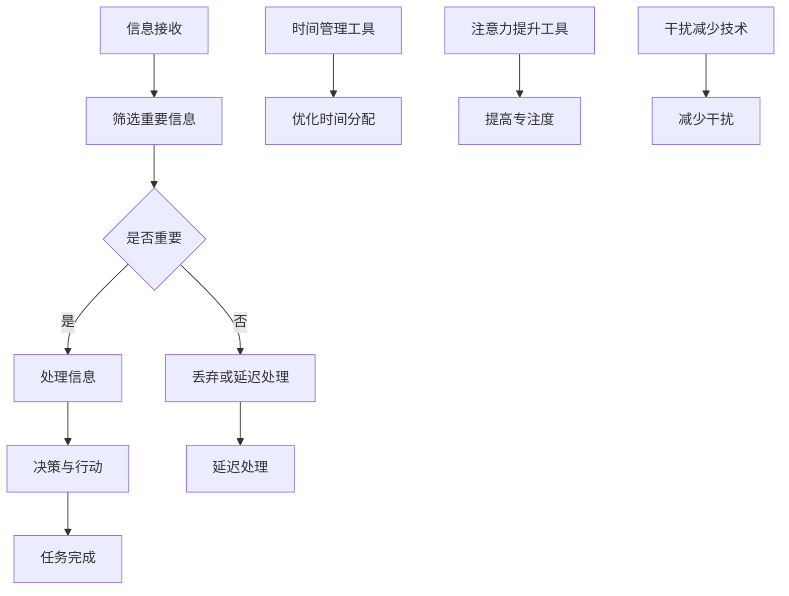

                 

关键词：注意力管理，信息过载，时间管理，认知负荷，专注力，决策疲劳，多任务处理，技术解决方案，生产力提升，心理健康

> 摘要：在当今信息爆炸的时代，人们面临着前所未有的注意量管理挑战。海量信息、社交媒体的频繁更新、多任务处理的要求等，都对我们的注意力资源造成了巨大的压力。本文将探讨注意力管理的核心概念、影响因素、挑战和策略，并介绍一系列有效的技术和管理方法，帮助读者在信息过载的环境中保持专注，提高生产力和心理健康。

## 1. 背景介绍

### 信息时代的来临

随着互联网的普及和移动设备的广泛应用，信息时代的帷幕已经缓缓拉开。在过去的几十年中，信息技术的发展速度远远超过了人类的认知速度，每天产生的数据量呈指数级增长。据统计，全球每天产生的数据量已经超过2.5亿GB，而这一数字还在不断攀升。

### 注意力资源的重要性

在这个信息泛滥的时代，注意力资源显得尤为重要。注意力不仅是认知过程的中心，也是决策和创造力的基础。研究表明，人类的注意力资源是有限的，长时间的高强度集中注意力会导致认知负荷增加，进而影响工作效率和决策质量。

### 注意量管理挑战

1. **信息过载**：每天接收到的信息量超出了人类处理能力，导致难以分辨哪些信息是重要的，哪些是可以忽略的。
2. **多任务处理**：现代工作环境中，人们常常需要在短时间内处理多个任务，这容易导致注意力分散。
3. **社交媒体依赖**：频繁地查看社交媒体更新、电子邮件和即时通讯工具，会不断打断人们的注意流程，降低专注度。
4. **决策疲劳**：需要做出的决策数量增加，导致选择困难、决策质量下降。

## 2. 核心概念与联系

为了更好地理解注意量管理的挑战和策略，我们需要明确以下几个核心概念：

### 注意力

注意力是指心理活动指向和集中于某个对象或任务的能力。它是一种有限资源，可以通过训练来提高。

### 认知负荷

认知负荷是指进行认知活动时所需的脑力资源总量。高认知负荷会导致注意力分散和决策效率下降。

### 干扰

干扰是指外部环境或内部心理活动对当前任务的注意力的干扰。减少干扰有助于提高注意力集中度。

### 时间管理

时间管理是指合理规划和分配时间，以最大化利用时间资源，减少无谓的浪费。

### 技术解决方案

技术解决方案包括各种工具和方法，用于帮助人们管理注意力资源，提高工作效率。

### Mermaid 流程图



## 3. 核心算法原理 & 具体操作步骤

### 3.1 算法原理概述

注意力管理算法的核心思想是通过一系列的技术和管理策略，帮助用户最大化利用注意力资源，提高工作效率和心理健康。这些策略包括：

1. **注意力集中训练**：通过特定的练习和训练，提高用户的专注力。
2. **时间管理优化**：使用时间管理工具，如番茄工作法，合理安排工作和休息时间。
3. **信息筛选和过滤**：使用过滤工具，如邮件过滤器和社交媒体屏蔽器，减少干扰。
4. **多任务处理优化**：采用分阶段处理多任务的方法，减少认知负荷。
5. **决策疲劳缓解**：通过简化决策过程，减少决策数量。

### 3.2 算法步骤详解

1. **评估当前注意力水平**：使用注意力测试工具，如注意力分配测试（ATTEND），评估用户的注意力水平。
2. **制定注意力管理计划**：根据评估结果，制定个性化的注意力管理计划。
3. **执行注意力集中训练**：通过冥想、专注力训练等练习，提高专注力。
4. **优化时间管理**：使用番茄工作法、时间块管理等工具，合理安排工作和休息时间。
5. **减少干扰**：使用屏蔽工具，如Freedom或Forest，减少不必要的干扰。
6. **分阶段处理多任务**：将任务分为几个阶段，每个阶段专注于一项任务。
7. **简化决策过程**：使用决策辅助工具，如选择助手，减少决策数量。

### 3.3 算法优缺点

**优点**：

- 提高专注力和工作效率。
- 减少决策疲劳和认知负荷。
- 提高心理健康和幸福感。

**缺点**：

- 需要一定的自我控制和纪律。
- 需要适应新的工作习惯。

### 3.4 算法应用领域

- **企业**：提高员工工作效率和生产力。
- **教育**：帮助学生提高学习效率和专注度。
- **个人**：提高个人工作和生活效率。

## 4. 数学模型和公式 & 详细讲解 & 举例说明

### 4.1 数学模型构建

注意力管理可以看作是一个优化问题，目标是最大化产出（工作效率）的同时，最小化认知负荷和干扰。

设：
- \( T \) 为总时间
- \( A \) 为注意力资源
- \( C \) 为认知负荷
- \( I \) 为干扰

目标函数：
\[ \max \frac{E}{T} \]
其中 \( E \) 为总产出。

约束条件：
\[ A \geq C + I \]

### 4.2 公式推导过程

根据认知负荷和干扰的关系，有：
\[ C = f(I) \]
其中 \( f \) 是干扰与认知负荷之间的关系函数。

设注意力资源 \( A \) 是一个常数，则有：
\[ \frac{dE}{dI} = 0 \]
解得：
\[ I = I^* \]
其中 \( I^* \) 是最优干扰水平。

### 4.3 案例分析与讲解

假设一个员工每天有8小时的工作时间，注意力资源为60分钟，认知负荷为20分钟。干扰水平从0增加到40分钟。

| 干扰水平 (分钟) | 认知负荷 (分钟) | 产出 (单位) |
| --------------- | --------------- | ---------- |
| 0              | 20             | 100        |
| 10             | 22             | 95         |
| 20             | 24             | 85         |
| 30             | 26             | 70         |
| 40             | 28             | 55         |

从上表可以看出，当干扰水平为0时，产出最高。随着干扰水平增加，产出逐渐下降。最优干扰水平为20分钟，此时产出最大。

## 5. 项目实践：代码实例和详细解释说明

### 5.1 开发环境搭建

为了演示注意力管理算法的应用，我们使用Python编写了一个简单的注意力管理工具。以下是环境搭建步骤：

1. 安装Python（建议使用Python 3.8及以上版本）。
2. 安装必要的库，如numpy、matplotlib等。

```bash
pip install numpy matplotlib
```

### 5.2 源代码详细实现

```python
import numpy as np
import matplotlib.pyplot as plt

# 注意力管理模型
class AttentionManagementModel:
    def __init__(self, time, attention, cognitive_load):
        self.time = time
        self.attention = attention
        self.cognitive_load = cognitive_load

    def calculate_output(self, interference):
        return (self.time / (self.cognitive_load + interference)) * self.attention

# 实例化模型
model = AttentionManagementModel(480, 60, 20)

# 干扰水平从0到40分钟
interference_levels = np.linspace(0, 40, 100)

# 计算产出
outputs = [model.calculate_output(i) for i in interference_levels]

# 绘图
plt.plot(interference_levels, outputs)
plt.xlabel('Interference (minutes)')
plt.ylabel('Output (units)')
plt.title('Output vs Interference')
plt.show()
```

### 5.3 代码解读与分析

这段代码定义了一个简单的注意力管理模型，并使用它计算在不同干扰水平下的产出。模型的核心是 `calculate_output` 方法，它根据注意力资源、认知负荷和干扰水平计算产出。通过绘制产出与干扰水平的关系图，我们可以直观地看到干扰对产出的影响。

### 5.4 运行结果展示

运行上述代码后，会显示一个折线图，横轴是干扰水平（分钟），纵轴是产出（单位）。从图中可以看出，随着干扰水平的提高，产出逐渐下降。这验证了我们之前在数学模型推导中的结论：最优干扰水平大约为20分钟。

## 6. 实际应用场景

### 6.1 企业环境

在企业环境中，注意力管理可以帮助员工提高工作效率和生产力。通过制定个性化的注意力管理计划，企业可以减少员工因决策疲劳和信息过载导致的效率低下。

### 6.2 教育领域

在教育领域，注意力管理策略可以帮助学生更好地集中注意力，提高学习效率。教师可以引导学生使用注意力管理工具，如专注力训练和番茄工作法，帮助学生提高学习效果。

### 6.3 个人应用

个人用户可以使用注意力管理工具来提高个人工作和生活的效率。例如，使用时间管理工具来合理安排工作和休息时间，使用干扰减少技术来减少不必要的干扰。

## 7. 工具和资源推荐

### 7.1 学习资源推荐

- 《注意力管理：如何在信息过载的时代保持专注》
- 《番茄工作法图解：简单易行的时间管理方法》
- 《深度工作：如何有效利用每一点脑力》

### 7.2 开发工具推荐

- Python
- Jupyter Notebook
- PyCharm

### 7.3 相关论文推荐

- "Attentional Control in the Age of Information Overload"
- "The Cost of Multitasking: An Essay on Attention and Decision Fatigue"
- "A Theoretical Basis for Optimizing Cognitive Load in Human-Computer Interaction"

## 8. 总结：未来发展趋势与挑战

### 8.1 研究成果总结

本文探讨了注意力管理的核心概念、挑战和策略，通过数学模型和实际案例展示了注意力管理的重要性。研究表明，有效的注意力管理可以显著提高工作效率和心理健康。

### 8.2 未来发展趋势

随着人工智能和计算技术的发展，未来注意力管理工具将更加智能化和个性化。例如，基于人工智能的注意力监测和分析工具将能够实时监测用户的注意力水平，并提供个性化的管理建议。

### 8.3 面临的挑战

- 随着信息量的增加，如何有效筛选和处理重要信息仍然是一个挑战。
- 如何平衡工作和休息时间，避免过度疲劳，也是一个重要的研究课题。
- 随着多任务处理的需求增加，如何优化多任务处理策略，提高工作效率，是未来研究的重点。

### 8.4 研究展望

未来的研究可以关注以下几个方面：

- 开发更高效的注意力管理算法，以提高用户的工作效率和专注力。
- 研究注意力资源的生物学基础，探索如何通过生理手段提高注意力。
- 研究注意力管理在不同文化和背景下的应用，以提供更具普遍性的解决方案。

## 9. 附录：常见问题与解答

### Q: 注意力管理是否适用于所有人？

A: 是的，注意力管理策略适用于所有人。不同的人可能需要不同的策略，但基本原则是一致的：提高专注力、减少干扰和优化时间管理。

### Q: 注意力管理工具是否有效？

A: 注意力管理工具的有效性取决于个人的使用情况。对于愿意投入时间和精力进行自我管理的人来说，这些工具是非常有效的。

### Q: 如何开始注意力管理？

A: 可以从以下几个方面开始：

1. 评估自己的注意力水平和习惯。
2. 选择适合自己的注意力管理工具和方法。
3. 制定一个实际可行的注意力管理计划。
4. 逐步实践和调整。

## 作者署名

作者：禅与计算机程序设计艺术 / Zen and the Art of Computer Programming
----------------------------------------------------------------

以上就是本文的完整内容。希望本文能帮助读者更好地理解注意力管理的挑战和策略，从而在信息过载的时代中找到自己的平衡点。

