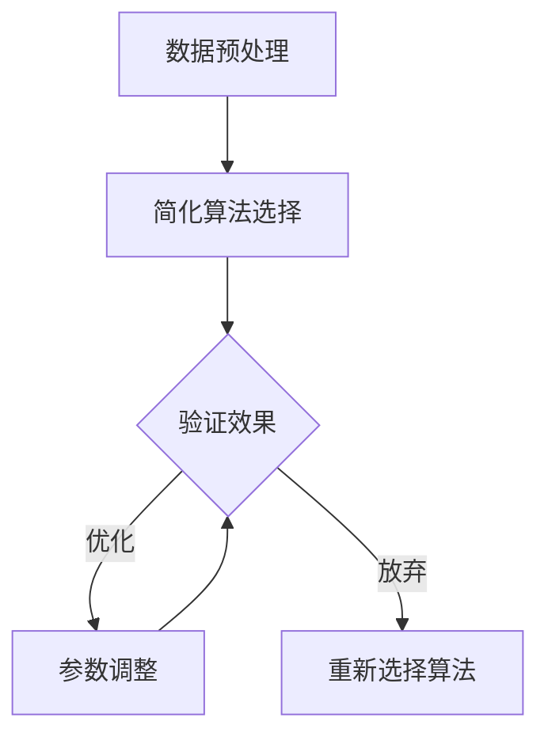

                 

## 1. 背景介绍

在当今这个信息爆炸的时代，如何有效地处理和利用大量信息成为一个亟待解决的问题。数据量和复杂度的不断增加，使得信息处理变得更加困难。为了应对这一挑战，信息简化成为了一种重要的策略。信息简化不仅仅是一种技术手段，更是一种思维方式，它可以帮助我们抓住核心，去除冗余，提高效率和准确性。

信息简化的意义在于，它能够帮助我们更快速、更准确地理解复杂系统或问题的本质。通过简化，我们可以将复杂的信息转化为易于处理的形式，从而降低认知负担，提高决策质量。同时，简化还能够帮助我们更好地沟通和分享知识，促进团队协作和创新。

本文将探讨信息简化的原则和实践方法，包括简化理论、简化算法、数学模型和实际应用案例，旨在为读者提供一套全面的信息简化策略，帮助他们在面对复杂问题时能够更有效地建立秩序和简化处理。

## 2. 核心概念与联系

### 2.1. 简化理论

信息简化的理论基础可以追溯到哲学和认知科学领域。在哲学上，简约主义强调通过简化来把握事物的本质。认知科学则通过研究人类思维过程，揭示了信息处理的复杂性，并提出了一系列简化策略。这些理论为我们提供了理论基础，指导我们如何在实际问题中运用信息简化的原则。

### 2.2. 简化算法

简化算法是信息简化的重要工具。常见的简化算法包括数据压缩、特征提取和降维技术。数据压缩算法通过减少数据中的冗余信息来降低数据量，例如霍夫曼编码和LZ77算法。特征提取算法从原始数据中提取出最具代表性的特征，例如主成分分析（PCA）和独立成分分析（ICA）。降维技术则通过减少数据维度来简化数据处理，例如线性判别分析（LDA）和非线性降维技术如t-SNE。

### 2.3. 简化架构

信息简化的架构通常包括以下几个步骤：数据预处理、简化算法选择、简化结果验证和优化。数据预处理包括数据清洗、归一化和特征选择等步骤，目的是为简化算法提供高质量的数据。简化算法选择是根据具体问题选择合适的算法，如数据压缩、特征提取或降维技术。简化结果验证则通过评估简化算法的效果来确保其有效性。优化则是通过调整参数和改进算法来进一步提高简化效果。

### 2.4. Mermaid 流程图

以下是信息简化过程的 Mermaid 流程图：



## 3. 核心算法原理 & 具体操作步骤

### 3.1. 算法原理概述

信息简化算法的核心原理是通过去除冗余信息和提取关键特征来简化数据。这通常涉及到以下几个步骤：

1. **数据预处理**：对原始数据进行清洗、归一化和特征选择，以去除无关或噪声信息。
2. **特征提取**：从预处理后的数据中提取最具代表性的特征，以减少数据维度。
3. **数据压缩**：对特征提取后的数据进行压缩，以减少数据量。
4. **结果验证**：评估简化算法的效果，确保简化过程不会导致信息丢失或精度降低。

### 3.2. 算法步骤详解

以下是信息简化算法的具体操作步骤：

1. **数据预处理**：

   - 数据清洗：去除重复数据、缺失值和异常值。
   - 归一化：将数据缩放到相同的尺度，以便后续处理。
   - 特征选择：选择对目标变量影响最大的特征，以去除冗余特征。

2. **特征提取**：

   - 主成分分析（PCA）：通过线性变换提取数据的主要特征。
   - 独立成分分析（ICA）：通过非线性变换提取数据的独立特征。
   - 线性判别分析（LDA）：通过最大化类间方差和最小化类内方差提取特征。

3. **数据压缩**：

   - 霍夫曼编码：基于概率分布构建前缀编码，以减少数据量。
   - LZ77算法：基于局部重复模式进行压缩。
   - 部分响应线性预测（PRML）：通过预测未来数据值来减少冗余信息。

4. **结果验证**：

   - 残差分析：通过比较简化前后的数据差异，评估简化效果。
   - 信息保留度：计算简化后的数据与原始数据之间的信息保留度，以确保关键信息不会被丢失。

### 3.3. 算法优缺点

**优点**：

- 减少数据量：简化算法可以显著减少数据量，提高数据处理效率。
- 降低复杂性：简化后的数据更容易理解和分析。
- 提高精度：有效的简化算法可以保留关键信息，提高模型的准确性。

**缺点**：

- 可能丢失信息：过度的简化可能导致重要信息的丢失。
- 复杂度增加：简化算法的选择和调整可能需要更多的计算资源和时间。

### 3.4. 算法应用领域

信息简化算法广泛应用于各个领域，包括但不限于：

- 数据库管理：简化查询和存储过程，提高数据库性能。
- 机器学习：简化特征提取和模型训练过程，提高模型效率。
- 生物信息学：简化基因组数据，提高基因分析效率。
- 金融领域：简化金融数据处理，提高风险管理和投资决策的准确性。

## 4. 数学模型和公式 & 详细讲解 & 举例说明

### 4.1. 数学模型构建

信息简化过程中，常用的数学模型包括特征提取模型、数据压缩模型和降维模型。以下是这些模型的简要介绍：

**特征提取模型**：

- 主成分分析（PCA）：通过求解协方差矩阵的特征值和特征向量来提取主要成分。
- 独立成分分析（ICA）：通过非线性变换提取独立成分。
- 线性判别分析（LDA）：通过最大化类间方差和最小化类内方差来提取特征。

**数据压缩模型**：

- 霍夫曼编码：基于概率分布构建前缀编码。
- LZ77算法：基于局部重复模式进行压缩。
- 部分响应线性预测（PRML）：通过预测未来数据值来减少冗余信息。

**降维模型**：

- 主成分分析（PCA）：通过线性变换提取主要成分。
- 独立成分分析（ICA）：通过非线性变换提取独立成分。
- t-SNE：通过非线性映射将高维数据映射到低维空间。

### 4.2. 公式推导过程

以下是对上述数学模型公式的推导过程：

**主成分分析（PCA）**：

1. 数据集 \(\mathbf{X} = \{\mathbf{x}_1, \mathbf{x}_2, ..., \mathbf{x}_n\}\) 的协方差矩阵 \(\Sigma\)：
   $$\Sigma = \frac{1}{n-1} \sum_{i=1}^{n} (\mathbf{x}_i - \bar{\mathbf{x}})(\mathbf{x}_i - \bar{\mathbf{x}})^T$$

2. 协方差矩阵的特征值和特征向量：
   $$\mathbf{V}\Lambda\mathbf{V}^T = \Sigma$$

3. 主成分 \(U_k\)：
   $$U_k = \mathbf{V}e_k$$
   其中 \(e_k\) 是特征向量。

**独立成分分析（ICA）**：

1. 独立分量模型：
   $$\mathbf{x} = \mathbf{A}\mathbf{s} + \mathbf{e}$$
   其中 \(\mathbf{x}\) 是观察数据，\(\mathbf{s}\) 是独立分量，\(\mathbf{e}\) 是噪声。

2. 最大似然估计：
   $$\hat{\mathbf{A}} = \arg\max_{\mathbf{A}} p(\mathbf{x}|\mathbf{A})$$

3. 非线性变换：
   $$\hat{\mathbf{s}} = \sigma(\mathbf{A}^T\mathbf{x})$$
   其中 \(\sigma\) 是非线性函数，通常选择高斯误差函数。

**霍夫曼编码**：

1. 计算各符号的概率 \(p(x)\)：
   $$p(x) = \frac{f(x)}{N}$$
   其中 \(f(x)\) 是符号 \(x\) 的频率，\(N\) 是总符号数。

2. 根据概率构建前缀编码：
   $$w_1 < w_2 < ... < w_n$$
   其中 \(w_i\) 是符号 \(x_i\) 的编码。

**LZ77算法**：

1. 扫描数据序列，寻找重复模式。
2. 记录重复模式的位置和长度。
3. 将重复模式用指针和长度表示。

### 4.3. 案例分析与讲解

以下是一个主成分分析（PCA）的案例：

**案例背景**：

假设我们有一个包含10个特征的数据集，每个特征都是1000个样本点的数据。现在需要对这个数据集进行降维，以便于后续分析和处理。

**步骤**：

1. **数据预处理**：

   - 数据清洗：去除缺失值和异常值。
   - 归一化：将每个特征缩放到相同的尺度。

2. **特征提取**：

   - 计算协方差矩阵 \(\Sigma\)：
     $$\Sigma = \frac{1}{n-1} \sum_{i=1}^{n} (\mathbf{x}_i - \bar{\mathbf{x}})(\mathbf{x}_i - \bar{\mathbf{x}})^T$$

   - 求解协方差矩阵的特征值和特征向量：
     $$\mathbf{V}\Lambda\mathbf{V}^T = \Sigma$$

   - 提取主要成分 \(U_k\)：
     $$U_k = \mathbf{V}e_k$$

3. **数据压缩**：

   - 选择前两个主要成分，将数据映射到二维空间。
   - 计算映射后的数据点。

**结果**：

通过PCA降维，我们将10个特征的数据集简化为2个特征的数据集。降维后的数据在二维空间中呈现出清晰的聚类结构，便于后续分析和处理。

## 5. 项目实践：代码实例和详细解释说明

### 5.1. 开发环境搭建

为了演示信息简化算法的应用，我们将使用Python编程语言，结合一些常用的库，如NumPy、Pandas和Scikit-learn。以下是开发环境的搭建步骤：

1. **安装Python**：确保已经安装了Python环境，版本要求为3.6及以上。
2. **安装库**：通过pip命令安装所需的库：
   ```bash
   pip install numpy pandas scikit-learn matplotlib
   ```

### 5.2. 源代码详细实现

以下是实现信息简化算法的Python代码：

```python
import numpy as np
import pandas as pd
from sklearn.decomposition import PCA
from sklearn.preprocessing import StandardScaler
import matplotlib.pyplot as plt

# 读取数据
data = pd.read_csv('data.csv')

# 数据预处理
data = data.dropna()  # 去除缺失值
data = data.apply(lambda x: (x - x.mean()) / x.std())  # 归一化

# 特征提取
pca = PCA(n_components=2)
data_pca = pca.fit_transform(data)

# 数据压缩
data_compressed = np.reshape(data_pca, (-1, 2))

# 结果验证
print("Explained variance ratio:", pca.explained_variance_ratio_)

# 可视化
plt.scatter(data_compressed[:, 0], data_compressed[:, 1])
plt.xlabel('Principal Component 1')
plt.ylabel('Principal Component 2')
plt.title('PCA Data Visualization')
plt.show()
```

### 5.3. 代码解读与分析

1. **数据读取与预处理**：

   - 使用Pandas读取CSV文件，并将其转换为DataFrame格式。
   - 去除缺失值，确保数据质量。
   - 对每个特征进行归一化处理，将特征缩放到相同的尺度。

2. **特征提取**：

   - 使用Scikit-learn中的PCA类，对数据进行特征提取。
   - `n_components=2` 表示提取两个主要成分。

3. **数据压缩**：

   - 将提取的主要成分转换为一维数组，便于后续处理。
   - 通过`np.reshape`函数将二维数据展平。

4. **结果验证**：

   - 输出主成分的方差贡献率，以评估简化效果。
   - 通过可视化展示降维后的数据分布。

### 5.4. 运行结果展示

在运行上述代码后，我们将看到降维后的数据点在二维空间中的可视化结果。这些数据点通常会呈现出明显的聚类结构，表明通过PCA简化后的数据仍然保留了原始数据的结构信息。

## 6. 实际应用场景

信息简化在各个领域都有广泛的应用，以下是几个实际应用场景的例子：

### 6.1. 数据库管理

在数据库管理中，信息简化可以通过数据压缩和数据去重来提高存储效率和查询速度。例如，使用霍夫曼编码对数据库中的文本数据进行压缩，可以显著减少存储空间占用，同时提高数据检索速度。

### 6.2. 机器学习

在机器学习中，信息简化可以用于特征提取和模型压缩。例如，通过主成分分析（PCA）提取数据的主要特征，可以减少特征维度，提高模型训练效率。此外，使用轻量级模型压缩技术，如Quantization和Pruning，可以减小模型的存储空间，提高模型部署速度。

### 6.3. 生物信息学

在生物信息学领域，信息简化可以用于基因数据分析和蛋白质结构预测。通过特征提取和降维技术，可以从大量的基因表达数据中提取出关键基因，从而提高基因分析方法的有效性。在蛋白质结构预测中，简化算法可以帮助减少计算复杂度，提高预测准确性。

### 6.4. 金融领域

在金融领域，信息简化可以用于风险管理、投资组合优化和股票市场预测。通过简化金融数据，可以降低风险模型的计算复杂度，提高风险预测的准确性。此外，使用信息简化技术对股票市场数据进行分析，可以帮助投资者更快速地识别市场趋势，制定有效的投资策略。

## 7. 工具和资源推荐

为了更好地实践信息简化技术，以下是一些推荐的工具和资源：

### 7.1. 学习资源推荐

- **《数据科学入门》：**这是一本适合初学者的数据科学入门书籍，涵盖了数据预处理、特征提取和模型训练等基础内容。
- **《机器学习实战》：**这本书通过大量的实例，介绍了机器学习的基本原理和应用，包括特征提取和降维技术。
- **《数据压缩技术》：**这本书详细介绍了数据压缩的原理和各种算法，包括霍夫曼编码、LZ77等。

### 7.2. 开发工具推荐

- **Python**：Python 是一种强大的编程语言，广泛应用于数据科学、机器学习和金融等领域。使用Python可以方便地实现信息简化算法。
- **Jupyter Notebook**：Jupyter Notebook 是一个交互式计算环境，适用于数据科学和机器学习项目。它可以方便地记录代码、分析和展示结果。
- **Scikit-learn**：Scikit-learn 是一个常用的机器学习库，提供了丰富的特征提取和降维算法，方便实现信息简化。

### 7.3. 相关论文推荐

- **“Principal Component Analysis” by J. MacQueen (1967)：**这是一篇经典的关于主成分分析的文章，详细介绍了PCA的理论和算法。
- **“Independent Component Analysis” by A. Hyvarinen, P. Oja (2000)：**这篇文章介绍了独立成分分析的理论和应用，是ICA领域的经典之作。
- **“Data Compression Algorithms” by J. L. Brown (1994)：**这本书详细介绍了各种数据压缩算法，包括霍夫曼编码、LZ77等。

## 8. 总结：未来发展趋势与挑战

### 8.1. 研究成果总结

信息简化技术在过去几十年中取得了显著成果，已经成为数据处理和机器学习领域的重要工具。通过简化，我们可以更有效地处理大量数据，提高计算效率，降低复杂性。同时，信息简化在数据库管理、生物信息学、金融等领域也展现了广泛的应用潜力。

### 8.2. 未来发展趋势

未来，信息简化技术将继续向以下几个方向发展：

- **自适应简化**：随着深度学习和自适应算法的发展，信息简化将更加智能化，能够根据具体问题和数据特征自动选择合适的简化策略。
- **跨领域应用**：信息简化技术将与其他领域的技术相结合，如量子计算、区块链等，为更广泛的应用场景提供支持。
- **实时简化**：随着实时数据处理需求的增加，信息简化技术将更加注重实时性和低延迟，以满足实时应用的需求。

### 8.3. 面临的挑战

尽管信息简化技术取得了显著进展，但仍然面临一些挑战：

- **信息损失**：过度简化可能导致关键信息的丢失，影响模型的准确性和可靠性。
- **计算复杂度**：某些简化算法的计算复杂度较高，在大规模数据集上可能难以实现实时简化。
- **算法选择**：不同的简化算法适用于不同类型的数据和问题，如何选择合适的算法是一个挑战。

### 8.4. 研究展望

为了克服这些挑战，未来的研究可以从以下几个方面进行：

- **算法优化**：通过改进现有算法和开发新型算法，提高简化效率，减少信息损失。
- **多领域协同**：跨领域研究可以结合不同领域的知识和方法，为信息简化提供新的思路。
- **实时简化**：研究实时简化算法和架构，提高处理速度和性能。

## 9. 附录：常见问题与解答

### 9.1. 什么是信息简化？

信息简化是指通过去除冗余信息和提取关键特征来降低数据量和复杂度，从而提高数据处理效率和准确性。

### 9.2. 信息简化有哪些算法？

常见的信息简化算法包括数据压缩算法（如霍夫曼编码、LZ77）、特征提取算法（如主成分分析、独立成分分析）和降维算法（如线性判别分析、t-SNE）。

### 9.3. 信息简化在哪些领域有应用？

信息简化广泛应用于数据库管理、机器学习、生物信息学和金融领域，以及其他需要处理大量数据的场景。

### 9.4. 如何选择合适的简化算法？

选择合适的简化算法需要考虑数据类型、问题需求和计算资源。通常，可以通过实验和比较不同算法的性能来选择最优算法。

### 9.5. 信息简化会导致信息丢失吗？

是的，过度的简化可能导致关键信息的丢失。因此，在设计简化策略时需要平衡简化效果和信息保留度，以确保关键信息不被丢失。

### 9.6. 信息简化对模型性能有影响吗？

适当的简化可以提高模型性能，因为简化后的数据更容易处理和理解。但过度的简化可能导致信息丢失，从而降低模型的准确性。

### 9.7. 信息简化如何应用于实时数据处理？

实时简化算法和架构需要针对实时数据处理的特点进行优化，如使用轻量级算法、分布式计算和高效的数据处理框架。

### 9.8. 信息简化技术在量子计算中有何应用前景？

量子计算具有巨大的并行性和计算能力，信息简化技术可以与量子计算相结合，提高量子算法的效率和准确性，从而推动量子计算的发展。

---

通过本文的探讨，我们不仅了解了信息简化的基本概念和原理，还学习了如何在实际应用中运用这些算法和技术。希望本文能够为读者提供有价值的参考，帮助他们在信息处理和数据分析中更加高效和准确。作者：禅与计算机程序设计艺术 / Zen and the Art of Computer Programming
----------------------------------------------------------------


