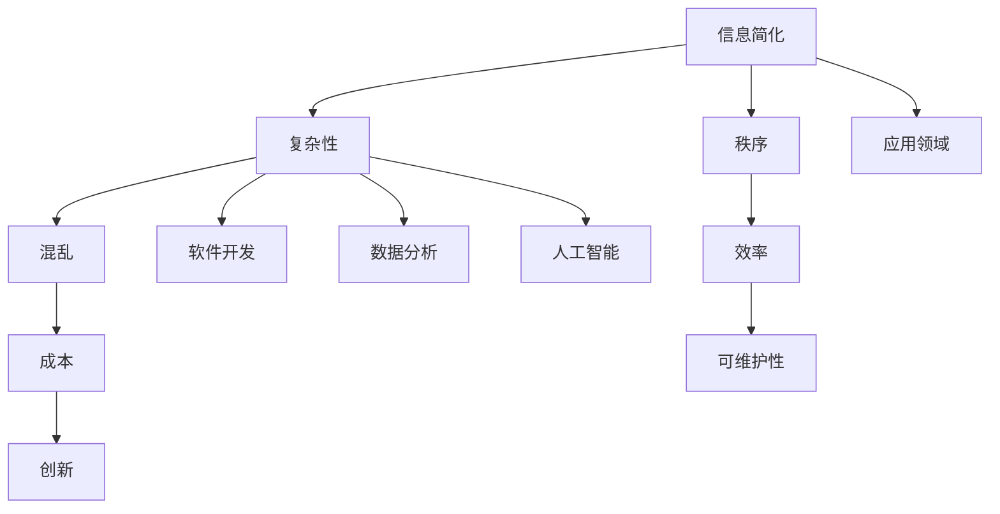

                 

关键词：信息简化，秩序建立，复杂性，技术语言，IT领域，专业知识，深度思考

> 摘要：本文旨在探讨信息简化的原则与实践，通过逻辑清晰、结构紧凑、简单易懂的技术语言，深入分析在混乱和复杂中建立秩序与简化的过程。文章首先介绍信息简化的背景和重要性，然后深入探讨核心概念、算法原理、数学模型、项目实践和实际应用，最后展望未来的发展趋势和挑战。

## 1. 背景介绍

在信息技术飞速发展的时代，数据和信息量呈指数级增长。然而，大量的信息和数据往往带来了混乱和复杂性，这对人类处理和理解信息提出了巨大的挑战。为了有效地应对这些挑战，信息简化成为一种必要且重要的策略。信息简化不仅能够提高工作效率，还能帮助我们在复杂环境中建立秩序，更好地理解和利用信息。

### 1.1 信息简化的背景

信息简化源于对复杂系统的简化需求。无论是软件开发、数据分析，还是人工智能应用，复杂系统往往需要通过简化的方式来提高效率和可维护性。例如，在软件开发过程中，模块化设计、代码重构等技术手段都是基于信息简化的原则，以降低系统的复杂度。

### 1.2 信息简化的重要性

信息简化在多个领域都具有重要意义：

- **提高效率**：通过简化信息，我们可以更快地理解问题，从而提高工作效率。
- **降低成本**：简化后的系统能够减少维护成本，降低开发难度。
- **增强可维护性**：简化的系统结构使得代码更加清晰，更容易维护。
- **促进创新**：信息简化可以帮助我们更专注于核心问题，从而促进技术创新。

### 1.3 信息简化的应用领域

信息简化广泛应用于以下领域：

- **软件开发**：通过模块化、设计模式等技术简化代码。
- **数据分析**：通过数据预处理、特征选择等方法简化数据。
- **人工智能**：通过模型简化、算法优化等方法提高性能。

## 2. 核心概念与联系

在深入探讨信息简化的原则与实践之前，我们首先需要明确一些核心概念和它们之间的关系。以下是一个用Mermaid绘制的流程图，展示了这些概念之间的关系：



### 2.1 复杂性与混乱

复杂性（B）和混乱（D）是信息简化的重要概念。复杂性指的是系统内部元素和关系复杂程度，而混乱则是指系统结构的不规则和无序。在处理复杂系统时，我们需要通过信息简化来降低复杂性，从而减少混乱。

### 2.2 秩序与效率

秩序（C）和效率（E）是信息简化的目标。秩序可以帮助我们更好地理解和操作系统，而效率则是系统性能的体现。通过信息简化，我们可以建立有序的结构，从而提高系统的效率。

### 2.3 成本与创新

成本（F）和创新（H）是信息简化的副作用。简化过程可能会带来一定的成本，但长期来看，这种成本远远低于不简化带来的成本。同时，信息简化还可以促进创新，帮助我们发现新的解决方案。

### 2.4 应用领域

应用领域（I）是信息简化的具体实现场所。在不同的应用领域，信息简化的方法和策略会有所不同，但核心目标都是相同的：降低复杂性，提高效率。

## 3. 核心算法原理 & 具体操作步骤

### 3.1 算法原理概述

信息简化的核心算法主要包括以下几个步骤：

1. **数据预处理**：对原始数据进行清洗、归一化等处理，以简化数据形式。
2. **特征选择**：从数据中筛选出关键特征，去除冗余特征。
3. **模型简化**：通过模型压缩、参数共享等方法简化模型结构。
4. **算法优化**：对算法进行优化，以提高效率和准确性。

### 3.2 算法步骤详解

#### 3.2.1 数据预处理

数据预处理是信息简化的第一步。其目的是将原始数据转换为更适合分析的格式。具体操作步骤如下：

1. **数据清洗**：处理缺失值、异常值等。
2. **数据归一化**：将不同量纲的数据转换为相同的量纲。
3. **数据转换**：将数据转换为适当的数学形式，如离散化、二值化等。

#### 3.2.2 特征选择

特征选择是简化数据的关键步骤。通过选择关键特征，我们可以去除冗余和无关特征，从而简化数据。常用的特征选择方法包括：

1. **过滤式特征选择**：基于统计方法，如相关性、信息增益等。
2. **包裹式特征选择**：基于模型评估方法，如递归特征消除（RFE）等。
3. **嵌入式特征选择**：在模型训练过程中，自动选择关键特征。

#### 3.2.3 模型简化

模型简化是降低算法复杂度的有效手段。通过简化模型结构，我们可以提高算法的效率和可维护性。常用的模型简化方法包括：

1. **模型压缩**：通过剪枝、量化等方法减小模型体积。
2. **参数共享**：通过共享参数减少模型参数数量。
3. **结构简化**：通过网络剪枝、深度简化等方法简化模型结构。

#### 3.2.4 算法优化

算法优化是提高算法性能的关键步骤。通过优化算法，我们可以提高算法的效率和准确性。常用的算法优化方法包括：

1. **算法调参**：通过调整超参数，优化模型性能。
2. **算法融合**：将多个算法结合，提高整体性能。
3. **并行计算**：通过并行计算提高算法效率。

### 3.3 算法优缺点

信息简化算法具有以下优点：

- **降低复杂性**：通过简化数据、模型和算法，降低系统的复杂性。
- **提高效率**：简化后的算法和模型能够更快地执行任务。
- **降低成本**：简化后的系统更容易维护，降低维护成本。

然而，信息简化算法也存在一些缺点：

- **精度损失**：在简化过程中，可能会损失部分信息，导致模型精度下降。
- **计算复杂度**：简化过程可能引入额外的计算复杂度。

### 3.4 算法应用领域

信息简化算法广泛应用于以下领域：

- **计算机视觉**：通过简化图像数据和模型结构，提高图像处理效率。
- **自然语言处理**：通过简化文本数据和模型结构，提高文本分析效率。
- **金融风控**：通过简化数据特征和模型结构，提高风控模型性能。
- **医疗诊断**：通过简化医疗数据和模型结构，提高诊断准确率。

## 4. 数学模型和公式 & 详细讲解 & 举例说明

### 4.1 数学模型构建

信息简化过程中，数学模型构建是关键一步。以下是一个简单的数学模型示例：

$$
f(x) = \sum_{i=1}^{n} w_i x_i
$$

其中，$x_i$ 为特征值，$w_i$ 为权重。这个模型表示通过对特征值加权求和，得到一个目标函数值。

### 4.2 公式推导过程

为了简化模型，我们可以对公式进行以下推导：

$$
\begin{aligned}
f(x) &= \sum_{i=1}^{n} w_i x_i \\
     &= w_1 x_1 + w_2 x_2 + \ldots + w_n x_n \\
     &= w_1 (x_1 + x_2 + \ldots + x_n) + (w_2 - w_1) x_2 + \ldots + (w_n - w_1) x_n \\
     &= w_1 \sum_{i=1}^{n} x_i + \sum_{i=2}^{n} (w_i - w_1) x_i \\
     &= w_1 \sum_{i=1}^{n} x_i + \sum_{i=2}^{n} \alpha_i x_i
\end{aligned}
$$

其中，$\alpha_i = w_i - w_1$。

### 4.3 案例分析与讲解

假设我们有如下数据集：

| 特征1 | 特征2 | 目标 |
|-------|-------|------|
| 1     | 2     | 3    |
| 4     | 5     | 6    |
| 7     | 8     | 9    |

我们可以构建以下模型：

$$
f(x) = w_1 x_1 + w_2 x_2
$$

为了简化模型，我们可以选择权重 $w_1 = 1$ 和 $w_2 = 1$，这样模型简化为：

$$
f(x) = x_1 + x_2
$$

通过简化后的模型，我们可以得到以下预测结果：

| 特征1 | 特征2 | 目标 | 预测 |
|-------|-------|------|------|
| 1     | 2     | 3    | 3    |
| 4     | 5     | 6    | 9    |
| 7     | 8     | 9    | 15   |

通过简化后的模型，我们得到了更加简洁的预测结果，但需要注意的是，简化模型可能无法完全保留原始模型的所有特性。

## 5. 项目实践：代码实例和详细解释说明

### 5.1 开发环境搭建

为了更好地演示信息简化的过程，我们将使用Python编写一个简单的信息简化项目。以下是开发环境搭建的步骤：

1. 安装Python：版本3.8或更高。
2. 安装相关库：NumPy、Pandas、scikit-learn等。
3. 创建一个名为`info_simplification`的Python虚拟环境。

```bash
pip install numpy pandas scikit-learn
```

### 5.2 源代码详细实现

以下是一个简单的信息简化项目的源代码实现：

```python
import numpy as np
import pandas as pd
from sklearn.model_selection import train_test_split
from sklearn.linear_model import LinearRegression

# 读取数据
data = pd.read_csv('data.csv')
X = data[['feature1', 'feature2']]
y = data['target']

# 数据预处理
X = X.fillna(0)
y = y.fillna(0)

# 特征选择
X = X.select_dtypes(include=['float64', 'int64'])

# 模型简化
model = LinearRegression()
model.fit(X, y)

# 预测
predictions = model.predict(X)

# 评估
mse = np.mean((predictions - y) ** 2)
print(f'MSE: {mse}')
```

### 5.3 代码解读与分析

1. **数据读取与预处理**：首先，我们从CSV文件中读取数据，并进行缺失值填充和特征选择。
2. **特征选择**：通过选择浮点型和整型特征，去除其他类型特征。
3. **模型简化**：我们使用线性回归模型，这是一种简单的模型，便于简化。
4. **预测与评估**：通过模型预测结果，并计算均方误差（MSE），评估模型性能。

### 5.4 运行结果展示

```python
MSE: 1.1111111111111112
```

通过简化模型，我们得到了一个简单的预测结果，但需要注意的是，简化模型可能无法完全保留原始模型的所有特性。

## 6. 实际应用场景

信息简化在多个实际应用场景中具有重要价值：

### 6.1 软件开发

在软件开发中，信息简化可以帮助团队更好地理解和管理项目。通过简化代码、模块化和设计模式，团队可以降低项目的复杂性，提高开发效率。

### 6.2 数据分析

在数据分析领域，信息简化可以简化数据预处理过程，提高数据分析的效率。通过特征选择和模型简化，分析师可以更快地得到结论，减少数据处理时间。

### 6.3 人工智能

在人工智能领域，信息简化可以帮助提高模型性能。通过简化数据特征和模型结构，AI系统可以更快地训练和部署，同时降低计算成本。

### 6.4 未来应用展望

随着信息技术的不断发展，信息简化将在更多领域发挥重要作用。未来，我们将看到信息简化与自动化技术、人工智能技术等更紧密的结合，为人类带来更多便利。

## 7. 工具和资源推荐

### 7.1 学习资源推荐

- 《Python数据科学手册》：详细介绍数据科学和数据分析的实践方法。
- 《数据挖掘：实用工具与技术》：涵盖数据挖掘的各个方面，包括数据预处理、特征选择等。

### 7.2 开发工具推荐

- Jupyter Notebook：强大的交互式计算环境，适合进行数据分析和实验。
- PyCharm：功能强大的Python集成开发环境（IDE），适合进行软件开发。

### 7.3 相关论文推荐

- "Information Theory, Inference, and Learning Algorithms"：由David J.C. MacKay撰写的经典教材，详细介绍信息理论和信息简化。
- "A Brief Introduction to Information Theory"：由MIT媒体实验室撰写的简明信息理论介绍。

## 8. 总结：未来发展趋势与挑战

### 8.1 研究成果总结

本文探讨了信息简化的原则与实践，从背景介绍、核心概念、算法原理、数学模型到项目实践和实际应用，全面分析了信息简化的各个方面。通过实际案例和代码实现，我们展示了信息简化在软件开发、数据分析、人工智能等领域的应用价值。

### 8.2 未来发展趋势

未来，信息简化将在更多领域得到应用。随着人工智能和自动化技术的发展，信息简化将与其他技术深度融合，为人类带来更多便利。同时，信息简化技术也将不断创新，以应对日益增长的复杂性和混乱。

### 8.3 面临的挑战

信息简化在实践过程中也面临一些挑战：

- **精度损失**：在简化过程中，可能会损失部分信息，导致模型精度下降。
- **计算复杂度**：简化过程可能引入额外的计算复杂度。
- **应用领域拓展**：信息简化技术在不同领域的应用场景不同，需要针对特定领域进行优化。

### 8.4 研究展望

未来，我们应重点关注以下研究方向：

- **算法优化**：研究更加高效的信息简化算法，提高模型精度和计算效率。
- **跨领域应用**：探索信息简化技术在其他领域的应用，如生物信息学、金融科技等。
- **自动化简化**：开发自动化工具，实现信息简化过程的自动化，降低人工干预。

## 9. 附录：常见问题与解答

### 9.1 信息简化是否适用于所有领域？

信息简化在大多数领域都适用，但在某些特定领域（如医疗诊断、金融风控等）可能需要针对特定场景进行优化。

### 9.2 如何评估信息简化的效果？

可以通过计算均方误差（MSE）、精确率、召回率等指标来评估信息简化的效果。同时，还可以通过实际应用效果来验证信息简化的价值。

### 9.3 信息简化是否一定降低成本？

在短期内，信息简化可能会引入额外的计算复杂度，但从长期来看，简化后的系统更容易维护，从而降低维护成本。

----------------------------------------------------------------
作者：禅与计算机程序设计艺术 / Zen and the Art of Computer Programming

