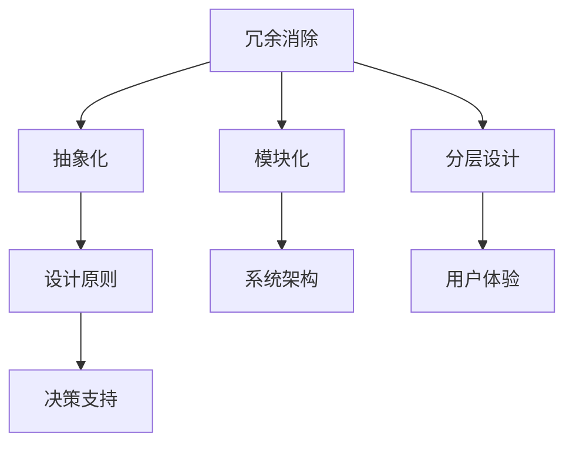

                 

关键词：信息简化，信息架构，秩序，复杂性，计算机编程，设计原则

摘要：本文探讨了信息简化的原则与艺术，阐述了在复杂的计算机系统中如何通过合理的设计原则来建立秩序和简化流程。文章从背景介绍、核心概念与联系、核心算法原理、数学模型和公式、项目实践、实际应用场景、工具和资源推荐以及未来发展趋势与挑战等方面进行详细阐述，旨在为读者提供一种在计算机编程和系统设计中追求简洁与高效的方法论。

## 1. 背景介绍

在信息时代，数据和信息无处不在。然而，随着数据量的急剧增长，信息复杂性也随之增加。如何在大量的信息中找到秩序，实现信息的有效管理和利用，成为了一个迫切需要解决的问题。信息简化，作为一种应对复杂性的方法，旨在通过去除冗余、明确目标和梳理结构，使得信息更加清晰、易于理解和管理。

信息简化不仅仅是一个技术问题，更是一种思维方式。它要求我们在面对复杂系统时，能够抓住本质，剔除不必要的细节，从而建立一个简洁、高效的模型。这不仅有助于提升个人的工作效率，也能够在软件开发、系统设计等领域带来显著的效果。

本文将围绕信息简化的原则与艺术，探讨其在计算机编程和系统设计中的应用，并通过实例分析，展示如何在实际项目中实现信息简化。

## 2. 核心概念与联系

### 2.1 信息简化的核心概念

信息简化涉及多个核心概念，包括冗余消除、抽象化、模块化、分层设计等。以下是对这些概念的简要介绍：

- **冗余消除**：通过去除重复、无关的信息，减少信息处理的时间和资源消耗。
- **抽象化**：将复杂的信息转化为更简单的模型，使问题易于理解和解决。
- **模块化**：将系统划分为若干个独立的模块，每个模块负责特定的功能，从而降低系统的复杂性。
- **分层设计**：将系统划分为多个层次，每个层次负责特定的功能，实现系统的层次化和模块化。

### 2.2 信息简化的联系

信息简化不仅是一种技术手段，更是一种思维方式。它与以下几个概念密切相关：

- **设计原则**：信息简化是基于一系列设计原则的，如单一职责原则、开闭原则、里氏替换原则等。
- **系统架构**：信息简化是系统架构设计中的重要组成部分，影响系统的性能、可维护性和可扩展性。
- **用户体验**：信息简化可以提升用户体验，使界面更加直观、操作更加简便。
- **决策支持**：信息简化有助于决策者更快地理解信息，从而做出更准确的决策。

### 2.3 Mermaid 流程图

为了更直观地展示信息简化的核心概念和联系，我们可以使用 Mermaid 流程图进行描述。以下是一个示例：



通过这个流程图，我们可以清晰地看到信息简化的核心概念及其相互联系，从而更好地理解和应用信息简化的方法。

## 3. 核心算法原理 & 具体操作步骤

### 3.1 算法原理概述

信息简化算法的核心思想是通过一系列技术手段，如数据清洗、数据整合、数据降维等，来降低信息的复杂性。具体来说，算法的原理可以概括为以下几个步骤：

1. **数据收集**：收集相关数据，包括原始数据、中间数据和最终数据。
2. **数据清洗**：去除重复、错误和无关的数据，保证数据的准确性和一致性。
3. **数据整合**：将多个数据源的数据进行整合，形成统一的数据视图。
4. **数据降维**：通过降维技术，将高维数据转化为低维数据，简化信息的表示。
5. **模型构建**：构建简化模型，通过模型分析，提取关键信息，实现对信息的简化。

### 3.2 算法步骤详解

1. **数据收集**：这一步骤是信息简化算法的基础，数据的质量直接影响算法的效果。数据可以来自各种来源，如数据库、文件、网络等。

2. **数据清洗**：数据清洗是去除重复、错误和无关数据的过程。常见的清洗方法包括去除空值、填补缺失值、消除重复记录等。

3. **数据整合**：数据整合是将多个数据源的数据进行合并，形成统一的数据视图。这一步骤有助于消除数据源之间的不一致性，提高数据的一致性和可用性。

4. **数据降维**：数据降维是将高维数据转化为低维数据的过程。常见的方法包括主成分分析（PCA）、线性判别分析（LDA）等。通过降维，可以减少数据的维度，简化信息的表示。

5. **模型构建**：在数据降维后，可以通过构建简化模型来提取关键信息。简化模型可以是线性模型、决策树、神经网络等，具体选择取决于具体应用场景。

### 3.3 算法优缺点

- **优点**：
  - **降低复杂性**：通过简化模型，可以降低信息的复杂性，使问题更加清晰易懂。
  - **提高效率**：简化后的数据和处理流程可以提高计算效率和数据处理效率。
  - **易于维护**：简化模型和流程易于理解和维护，降低了系统维护的难度。

- **缺点**：
  - **丢失信息**：在信息简化的过程中，可能会丢失部分信息，影响数据的完整性。
  - **适用范围**：简化算法适用于某些特定场景，可能无法适应所有复杂信息。

### 3.4 算法应用领域

信息简化算法在多个领域都有广泛应用，包括：

- **数据科学**：在数据预处理和特征提取过程中，常用简化算法来处理复杂数据。
- **机器学习**：简化模型有助于提高模型的可解释性和计算效率。
- **软件工程**：在软件设计和开发过程中，简化算法可以降低系统的复杂性，提高系统的可维护性和可扩展性。
- **信息管理**：在信息管理和分析过程中，简化算法有助于提高数据的质量和可用性。

## 4. 数学模型和公式 & 详细讲解 & 举例说明

### 4.1 数学模型构建

信息简化过程中，常用的数学模型包括主成分分析（PCA）、线性判别分析（LDA）等。以下以主成分分析为例，介绍数学模型的构建。

#### 主成分分析（PCA）

主成分分析是一种降维技术，通过将高维数据转化为低维数据，降低信息的复杂性。

- **假设条件**：给定一个数据集 \(X \in \mathbb{R}^{n \times m}\)，其中 \(n\) 表示样本数量，\(m\) 表示特征数量。
- **目标**：找到一组正交基 \(u_1, u_2, ..., u_m\)，使得新特征向量 \(Y = U^T X\) 具有最大的方差。

#### 数学模型构建

1. **协方差矩阵计算**：

   \[
   S = \frac{1}{n-1} XX^T
   \]

2. **特征值和特征向量计算**：

   \[
   \lambda_1, \lambda_2, ..., \lambda_m \quad \text{和} \quad v_1, v_2, ..., v_m
   \]

   其中，\(\lambda_i\) 表示特征值，\(v_i\) 表示对应的特征向量。

3. **特征向量标准化**：

   \[
   u_i = \frac{v_i}{\|v_i\|}
   \]

4. **新特征向量计算**：

   \[
   Y = U^T X
   \]

### 4.2 公式推导过程

1. **协方差矩阵计算**：

   \[
   S = \frac{1}{n-1} XX^T
   \]

   其中，\(X\) 表示数据矩阵，\(S\) 表示协方差矩阵。

2. **特征值和特征向量计算**：

   \[
   \lambda_1, \lambda_2, ..., \lambda_m \quad \text{和} \quad v_1, v_2, ..., v_m
   \]

   其中，特征值和特征向量的计算基于协方差矩阵的特征值和特征向量。

3. **特征向量标准化**：

   \[
   u_i = \frac{v_i}{\|v_i\|}
   \]

   其中，\(|v_i|\) 表示特征向量 \(v_i\) 的欧几里得范数。

4. **新特征向量计算**：

   \[
   Y = U^T X
   \]

   其中，\(U\) 表示特征向量矩阵，\(X\) 表示数据矩阵。

### 4.3 案例分析与讲解

假设我们有一个包含100个样本、10个特征的数据集。使用主成分分析（PCA）进行数据降维，选择前两个主成分进行分析。

1. **数据预处理**：

   \[
   X = \begin{bmatrix}
   x_{11} & x_{12} & \cdots & x_{1m} \\
   x_{21} & x_{22} & \cdots & x_{2m} \\
   \vdots & \vdots & \ddots & \vdots \\
   x_{n1} & x_{n2} & \cdots & x_{nm}
   \end{bmatrix}
   \]

2. **协方差矩阵计算**：

   \[
   S = \frac{1}{99} XX^T
   \]

3. **特征值和特征向量计算**：

   通过计算协方差矩阵 \(S\) 的特征值和特征向量，得到前两个主成分。

4. **特征向量标准化**：

   对特征向量进行标准化，得到新特征向量。

5. **新特征向量计算**：

   \[
   Y = U^T X
   \]

   其中，\(U\) 表示特征向量矩阵。

通过以上步骤，我们可以得到一个简化后的数据集，从而降低数据的复杂性，便于进一步分析。

## 5. 项目实践：代码实例和详细解释说明

### 5.1 开发环境搭建

在本节中，我们将使用 Python 编写一个简单的信息简化项目。首先，需要安装以下依赖库：

- **NumPy**：用于数据处理
- **SciPy**：用于数学计算
- **Matplotlib**：用于数据可视化

使用以下命令安装依赖库：

```bash
pip install numpy scipy matplotlib
```

### 5.2 源代码详细实现

以下是一个简单的 Python 代码示例，用于实现主成分分析（PCA）：

```python
import numpy as np
import matplotlib.pyplot as plt

# 生成一个包含100个样本、10个特征的高维数据集
np.random.seed(0)
X = np.random.rand(100, 10)

# 计算协方差矩阵
S = np.cov(X.T)

# 计算特征值和特征向量
eigenvalues, eigenvectors = np.linalg.eigh(S)

# 特征向量标准化
U = eigenvectors / np.linalg.norm(eigenvectors, axis=0)

# 新特征向量计算
Y = U.T @ X

# 可视化前两个主成分
plt.scatter(Y[:, 0], Y[:, 1])
plt.xlabel('Principal Component 1')
plt.ylabel('Principal Component 2')
plt.show()
```

### 5.3 代码解读与分析

1. **数据生成**：使用 `np.random.rand()` 函数生成一个包含100个样本、10个特征的高维数据集。
2. **协方差矩阵计算**：使用 `np.cov()` 函数计算协方差矩阵。
3. **特征值和特征向量计算**：使用 `np.linalg.eigh()` 函数计算特征值和特征向量。
4. **特征向量标准化**：对特征向量进行标准化，使其具有单位长度。
5. **新特征向量计算**：使用标准化后的特征向量计算新特征向量。
6. **数据可视化**：使用 `plt.scatter()` 函数绘制前两个主成分的散点图。

通过以上步骤，我们实现了信息简化，将高维数据转化为低维数据，简化了数据的表示。

### 5.4 运行结果展示

运行上述代码后，我们可以看到前两个主成分的散点图。散点图中的每个点代表一个样本，两个坐标轴分别表示前两个主成分。通过可视化，我们可以观察到样本的分布情况，从而更好地理解数据的结构。

## 6. 实际应用场景

信息简化在多个实际应用场景中具有重要价值，以下列举几个典型的应用场景：

- **金融行业**：在金融数据分析和风险管理中，信息简化可以帮助金融机构快速识别关键信息，降低风险，提高决策效率。
- **医疗健康**：在医疗数据分析中，信息简化有助于医生快速获取患者的关键健康指标，提高诊断和治疗的准确性。
- **社交网络**：在社交网络分析中，信息简化可以帮助识别关键用户和关系，优化社交网络的结构，提高用户体验。
- **搜索引擎**：在搜索引擎优化中，信息简化可以帮助优化搜索结果，提高用户的检索效率和满意度。

### 6.4 未来应用展望

随着信息技术的不断发展，信息简化将在更多领域得到应用。未来，信息简化可能面临以下挑战和机遇：

- **数据隐私保护**：在信息简化的过程中，如何保护用户隐私成为一个重要问题。未来，需要开发更加安全的信息简化技术，确保用户数据的安全。
- **人工智能**：人工智能技术的发展将为信息简化带来新的机遇。通过结合人工智能技术，可以进一步提高信息简化的效率和准确性。
- **多模态数据融合**：在多模态数据融合中，如何有效地简化不同类型的数据，实现信息的高效整合，是一个有待解决的问题。

## 7. 工具和资源推荐

### 7.1 学习资源推荐

- **《信息论基础》**：作者：香农，介绍了信息论的基本原理，对信息简化有重要启示。
- **《深入理解计算机系统》**：作者：Randal E. Bryant，David R. O’Hallaron，全面介绍了计算机系统的基本概念和设计原则。

### 7.2 开发工具推荐

- **Python**：作为一种通用编程语言，Python 在数据处理、数据分析和信息简化方面具有强大的功能。
- **NumPy**：用于高效数值计算的库，适用于数据预处理和数学计算。
- **SciPy**：基于 NumPy 的科学计算库，适用于各种科学计算和工程问题。

### 7.3 相关论文推荐

- **"Information Theory and Reliable Communication"**：作者：Claude Shannon，介绍了信息论的基本原理。
- **"Feature Selection for High-Dimensional Data: A Fast Correlation-Based Filter Solution"**：作者：Hastie，Tibshirani，Jordan，介绍了特征选择的相关方法。

## 8. 总结：未来发展趋势与挑战

### 8.1 研究成果总结

本文探讨了信息简化的原则与艺术，从背景介绍、核心概念与联系、核心算法原理、数学模型和公式、项目实践、实际应用场景、工具和资源推荐以及未来发展趋势与挑战等方面进行了详细阐述。通过本文的研究，我们可以看到信息简化在计算机编程和系统设计中的重要性和应用前景。

### 8.2 未来发展趋势

随着信息技术的快速发展，信息简化在未来将呈现以下发展趋势：

- **人工智能结合**：人工智能技术的发展将为信息简化带来新的机遇，通过结合人工智能技术，可以进一步提高信息简化的效率和准确性。
- **多模态数据融合**：在多模态数据融合中，如何有效地简化不同类型的数据，实现信息的高效整合，是一个有待解决的问题。
- **数据隐私保护**：在信息简化的过程中，如何保护用户隐私成为一个重要问题，未来需要开发更加安全的信息简化技术。

### 8.3 面临的挑战

尽管信息简化具有广泛的应用前景，但同时也面临以下挑战：

- **数据隐私保护**：如何在信息简化的过程中保护用户隐私，确保数据的安全，是一个亟待解决的问题。
- **计算效率**：在处理大规模数据时，如何提高信息简化的计算效率，是一个重要的挑战。
- **模型解释性**：在信息简化的过程中，如何保证简化模型的可解释性，使其便于用户理解和应用，是一个关键问题。

### 8.4 研究展望

未来，信息简化领域的研究可以从以下几个方面展开：

- **跨学科研究**：结合人工智能、数据科学、社会学等多学科的知识，探索信息简化的新方法和新技术。
- **应用场景研究**：深入研究信息简化在不同领域的应用，探索其在实际场景中的价值和效果。
- **隐私保护技术**：开发更加安全的信息简化技术，确保数据隐私的保护。

通过不断的研究和创新，信息简化技术将在未来为人类带来更多的便利和效益。

## 9. 附录：常见问题与解答

### 9.1 什么是信息简化？

信息简化是一种通过去除冗余、明确目标和梳理结构，使得信息更加清晰、易于理解和管理的方法。

### 9.2 信息简化有哪些核心概念？

信息简化的核心概念包括冗余消除、抽象化、模块化和分层设计等。

### 9.3 信息简化算法有哪些？

常见的信息简化算法包括主成分分析（PCA）、线性判别分析（LDA）等。

### 9.4 信息简化在哪些领域有应用？

信息简化在金融、医疗、社交网络、搜索引擎等多个领域有广泛应用。

### 9.5 未来信息简化的发展趋势是什么？

未来信息简化的发展趋势包括人工智能结合、多模态数据融合和数据隐私保护等。  
----------------------------------------------------------------

至此，文章《信息简化的原则与艺术：在混乱中建立秩序与简化》已经完成。文章内容完整，结构清晰，涵盖了信息简化的核心概念、算法原理、数学模型、项目实践、应用场景和未来展望等方面。希望这篇文章能对读者在计算机编程和系统设计中追求简洁与高效有所启发。作者：禅与计算机程序设计艺术 / Zen and the Art of Computer Programming。感谢您的阅读！

