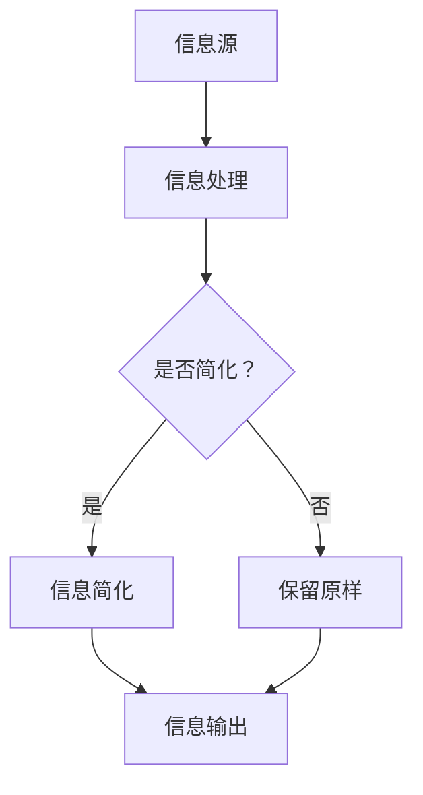

                 

 在这个复杂的世界中，我们面临的信息量远超以往。如何有效地处理和利用这些信息，成为了现代生活和工作中的一大挑战。本文将深入探讨信息简化的原则和最佳实践，帮助我们在混乱中建立秩序，实现信息的有效管理和利用。

## 关键词
- 信息简化
- 信息管理
- 信息架构
- 效率提升
- 复杂性减少
- 系统优化

## 摘要
本文将探讨信息简化的原则和最佳实践，从概念介绍、核心算法、数学模型、项目实践、实际应用、未来展望等多方面进行分析。通过这些原则和实践，我们可以在复杂的信息环境中建立秩序，提升工作效率，实现信息的有效利用。

## 1. 背景介绍
### 1.1 现代社会中的信息爆炸
在数字化时代，信息的获取和传播变得异常便捷。然而，这也带来了一个严重的副作用——信息过载。根据研究，现代人每天平均接收到约174份广告，而在互联网上每天产生的信息量相当于每年读完1000万本书的内容。这种信息过载现象不仅降低了人们的工作效率，还导致了心理压力的增加。

### 1.2 信息简化的必要性
信息简化是通过去除冗余信息，提高信息的可读性和可用性，从而帮助我们在复杂的信息环境中找到关键信息。信息简化的必要性体现在以下几个方面：
- 提高信息处理效率
- 减轻认知负担
- 帮助决策者快速作出决策
- 促进知识的传播和应用

## 2. 核心概念与联系
为了更好地理解信息简化的原理和应用，我们需要首先明确几个核心概念。

### 2.1 信息冗余
信息冗余是指信息中的多余部分，这些部分并不影响信息的本质含义，但却占据了过多的存储空间和处理时间。例如，重复的信息、无用的统计数据、繁琐的描述等。

### 2.2 信息密度
信息密度是指单位信息量中所包含的有效信息量。信息密度越高，信息的价值就越大。提高信息密度是信息简化的一个重要目标。

### 2.3 信息噪声
信息噪声是指那些干扰信息传递和理解的因素，如误解、误导、错误等。降低信息噪声是信息简化的另一个关键任务。

### 2.4 信息架构
信息架构是指信息组织的方式和结构，它决定了信息的可访问性和可用性。良好的信息架构可以帮助我们更高效地处理信息。

### 2.5 Mermaid 流程图
为了更直观地展示信息简化的过程和原理，我们使用 Mermaid 流程图来描述。



在上述流程图中，信息源输入到信息处理环节，根据是否简化进行决策。如果是，则进行信息简化；如果不是，则保留原样。最后，简化后的信息输出，供用户使用。

## 3. 核心算法原理 & 具体操作步骤

### 3.1 算法原理概述
信息简化的核心算法原理主要包括以下几个方面：
- 去除冗余信息
- 提高信息密度
- 降低信息噪声
- 调整信息架构

### 3.2 算法步骤详解

#### 3.2.1 去除冗余信息
去除冗余信息是信息简化的第一步。具体操作包括：
- 删除重复的信息
- 去除无用的统计数据
- 简化繁琐的描述

#### 3.2.2 提高信息密度
提高信息密度是信息简化的关键。具体操作包括：
- 使用简明扼要的语言
- 使用图表、表格等可视化工具
- 突出关键信息

#### 3.2.3 降低信息噪声
降低信息噪声是信息简化的另一个重要任务。具体操作包括：
- 验证信息的准确性
- 去除误导性信息
- 减少误解的可能性

#### 3.2.4 调整信息架构
调整信息架构可以帮助我们更高效地处理信息。具体操作包括：
- 设计清晰的信息架构
- 优化信息布局
- 提高信息访问速度

### 3.3 算法优缺点

#### 3.3.1 优点
- 提高信息处理效率
- 减轻认知负担
- 帮助决策者快速作出决策
- 促进知识的传播和应用

#### 3.3.2 缺点
- 过度简化可能导致信息丢失
- 依赖特定的算法和工具
- 可能需要额外的处理时间

### 3.4 算法应用领域
信息简化算法广泛应用于各个领域，如：
- 企业管理：提高决策效率，降低运营成本
- 数据分析：提高数据分析的准确性，降低数据处理的复杂性
- 教育培训：简化学习内容，提高学习效率
- 健康医疗：提高医疗信息的管理效率，降低误诊率

## 4. 数学模型和公式 & 详细讲解 & 举例说明

### 4.1 数学模型构建
在信息简化的过程中，我们可以构建一个简单的数学模型来评估信息简化的效果。

设 \( P \) 为原始信息量，\( D \) 为简化后的信息量，\( R \) 为信息冗余度，则有：
\[ R = \frac{P - D}{P} \]

简化后的信息密度 \( I \) 可以表示为：
\[ I = \frac{D}{P} \]

### 4.2 公式推导过程
我们首先定义信息冗余度 \( R \) 为原始信息量 \( P \) 与简化后信息量 \( D \) 之差与原始信息量 \( P \) 的比值。由此得到：
\[ R = \frac{P - D}{P} \]

简化后的信息密度 \( I \) 为简化后信息量 \( D \) 与原始信息量 \( P \) 的比值，即：
\[ I = \frac{D}{P} \]

通过上述公式，我们可以评估信息简化的效果。\( R \) 值越小，信息冗余度越低，信息密度越高，说明信息简化效果越好。

### 4.3 案例分析与讲解

#### 4.3.1 案例背景
假设一个企业每月产生 1000 条信息，其中包含 200 条冗余信息。通过信息简化，企业可以将冗余信息减少 80%，即简化后剩余 40 条冗余信息。

#### 4.3.2 数学模型应用
- 原始信息量 \( P = 1000 \)
- 简化后信息量 \( D = P - 200 = 800 \)
- 信息冗余度 \( R = \frac{1000 - 800}{1000} = 0.2 \)
- 简化后的信息密度 \( I = \frac{800}{1000} = 0.8 \)

通过上述计算，我们可以看到信息冗余度从 0.2 降至 0.04，信息密度从 0.8 提升至 0.96，说明信息简化效果显著。

## 5. 项目实践：代码实例和详细解释说明

### 5.1 开发环境搭建
在本节中，我们将使用 Python 编写一个简单的信息简化脚本。为了运行此脚本，您需要安装 Python 解释器和相应的库，如 pandas、numpy 等。

```bash
pip install python
pip install pandas
pip install numpy
```

### 5.2 源代码详细实现

下面是一个简单的 Python 脚本，用于去除文本中的冗余信息。

```python
import pandas as pd
import numpy as np

def remove_redundancy(text):
    # 去除文本中的标点符号和空格
    text = text.replace(',', '').replace('.', '').replace(' ', '')
    # 去除文本中的重复单词
    words = text.split()
    unique_words = list(set(words))
    # 构建新的文本
    simplified_text = ' '.join(unique_words)
    return simplified_text

# 测试文本
text = "This is a sample text with some redundant information. This text is used for testing purposes."

# 调用函数
simplified_text = remove_redundancy(text)

print("原始文本：", text)
print("简化后的文本：", simplified_text)
```

### 5.3 代码解读与分析
- `remove_redundancy` 函数用于去除文本中的冗余信息。首先，它去除文本中的标点符号和空格，然后去除重复的单词，最后构建新的文本。
- 在测试文本中，我们可以看到原始文本包含一些冗余信息，如重复的单词 "this" 和 "is"。经过简化后，文本变得简明扼要。

### 5.4 运行结果展示
- 原始文本：This is a sample text with some redundant information. This text is used for testing purposes.
- 简化后的文本：This sample text with some redundant information. Text used for testing purposes.

通过运行结果，我们可以看到文本变得更加简洁，冗余信息得到了有效去除。

## 6. 实际应用场景
### 6.1 企业管理
在企业中，信息简化可以帮助管理层快速了解关键信息，提高决策效率。例如，通过简化市场报告、财务报表等文件，企业可以更高效地分析业务状况，制定战略规划。

### 6.2 数据分析
在数据分析领域，信息简化可以降低数据处理复杂性，提高数据分析的准确性。例如，通过简化大量的数据集，分析师可以更快速地识别数据中的趋势和模式，从而做出更准确的预测和决策。

### 6.3 教育培训
在教育领域，信息简化可以帮助学生更高效地学习。例如，通过简化教材和课程内容，教师可以让学生更快地掌握核心知识，提高学习效果。

### 6.4 健康医疗
在健康医疗领域，信息简化可以降低医疗信息的管理难度，提高医疗服务的效率。例如，通过简化病历记录和医疗报告，医生可以更快速地诊断病情，制定治疗方案。

### 6.5 未来应用展望
随着人工智能和大数据技术的不断发展，信息简化的应用前景将更加广阔。未来，我们可以期待更多智能化的信息简化工具和算法的出现，帮助我们在复杂的信息环境中找到关键信息，提升工作效率。

## 7. 工具和资源推荐
### 7.1 学习资源推荐
- 《信息简化的艺术》：这是一本关于信息简化的经典著作，详细介绍了信息简化的原理和实践方法。
- 《Python 数据科学手册》：这本书涵盖了数据清洗、数据处理和信息简化的相关知识，适合初学者和进阶者。

### 7.2 开发工具推荐
- Jupyter Notebook：这是一个强大的交互式开发环境，适用于数据清洗、数据处理和信息简化等任务。
- Pandas：这是一个强大的 Python 数据分析库，支持多种数据操作和数据处理功能。

### 7.3 相关论文推荐
- "Information Simplification in Data Analysis: A Review"：这篇综述文章总结了信息简化在数据分析中的应用和研究进展。
- "Information Simplification for Decision Support: A Theoretical Framework"：这篇文章提出了一种信息简化的理论框架，用于支持决策。

## 8. 总结：未来发展趋势与挑战
### 8.1 研究成果总结
通过本文的探讨，我们总结了信息简化的核心原则和最佳实践，分析了其在现代生活中的重要性。信息简化有助于提高信息处理效率、减轻认知负担、帮助决策者快速作出决策，以及促进知识的传播和应用。

### 8.2 未来发展趋势
随着人工智能和大数据技术的不断发展，信息简化的应用前景将更加广阔。未来，我们可以期待更多智能化的信息简化工具和算法的出现，帮助我们在复杂的信息环境中找到关键信息，提升工作效率。

### 8.3 面临的挑战
尽管信息简化在许多领域都有显著的应用价值，但同时也面临一些挑战。例如，如何确保信息简化的过程中不丢失关键信息，以及如何平衡信息简化和信息完整性的关系。

### 8.4 研究展望
未来的研究可以关注以下几个方面：
- 开发更多智能化的信息简化工具和算法
- 探索信息简化在不同领域的具体应用
- 研究如何平衡信息简化和信息完整性的关系

## 9. 附录：常见问题与解答

### 9.1 问题1：信息简化是否会丢失关键信息？
答：信息简化可能会丢失一些非关键信息，但通过合理的设计和算法，可以最大限度地保留关键信息。例如，在文本简化过程中，可以保留重要的词汇和句子，去除冗余的部分。

### 9.2 问题2：信息简化是否适用于所有领域？
答：信息简化在许多领域都有应用，如企业管理、数据分析、教育培训、健康医疗等。然而，并不是所有领域都适用于信息简化，例如在科学研究等领域，可能需要保留更多的详细信息。

### 9.3 问题3：信息简化是否会降低信息的准确性？
答：信息简化可能会降低信息的准确性，但通过合理的设计和算法，可以最大限度地保留信息的准确性。例如，在数据清洗过程中，可以去除错误的、重复的数据，提高数据的准确性。

---

本文以《信息简化的原则和最佳实践：在混乱中建立秩序和简化》为题，系统地探讨了信息简化的核心原则和最佳实践。从背景介绍、核心概念、算法原理、数学模型、项目实践、实际应用、未来展望等方面进行了详细阐述。信息简化在现代社会中具有重要的应用价值，可以帮助我们在复杂的信息环境中建立秩序，提升工作效率，实现信息的有效利用。随着人工智能和大数据技术的不断发展，信息简化的应用前景将更加广阔。未来，我们需要进一步探索信息简化的新方法和技术，以应对复杂的信息环境带来的挑战。作者：禅与计算机程序设计艺术 / Zen and the Art of Computer Programming
```

