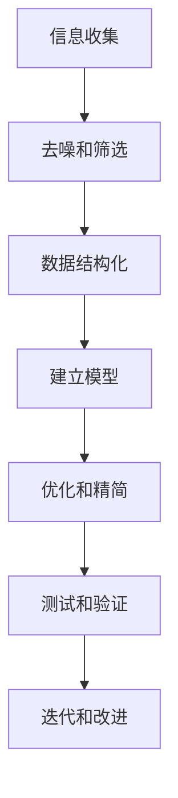

                 

关键词：信息简化、复杂系统、结构化、算法、秩序、软件设计、软件工程

> 摘要：本文旨在探讨信息简化的原则，如何将混乱和复杂的信息系统转化为有序和简洁的结构。我们将从核心概念、算法原理、数学模型、实际应用、未来展望等多个角度，深入分析信息简化的技术与方法，为读者提供一套系统化的信息处理框架。

## 1. 背景介绍

在当今信息爆炸的时代，如何处理海量信息成为了一个严峻的挑战。从数据挖掘到系统优化，从软件开发到算法设计，信息简化始终是一个核心问题。信息简化不仅仅是减少冗余信息，更重要的是通过结构化和组织，使得复杂系统变得更加直观、易理解和高效。

信息简化的原则不仅适用于技术领域，也广泛应用于商业、教育、医疗等多个行业。例如，在商业中，通过简化供应链信息可以提升供应链效率；在教育中，通过简化教学内容可以提高教学效果；在医疗中，通过简化患者信息可以提升医疗决策的准确性。

本文将围绕以下问题展开讨论：

- 什么是信息简化？
- 信息简化的核心原则是什么？
- 如何在实际应用中实施信息简化？
- 信息简化的未来发展趋势是什么？

通过这些问题，我们将深入探讨信息简化的原理和方法，帮助读者建立一套系统化的信息处理框架。

## 2. 核心概念与联系

### 2.1 信息简化的定义

信息简化是指通过一定的方法和工具，对复杂的信息系统进行结构化、优化和精简，使其变得更加简洁、直观和高效。信息简化的核心目标是降低系统的复杂度，提高系统的可理解性和可维护性。

### 2.2 信息简化的核心原则

#### 2.2.1 精益原则

精益原则强调去除一切非必要的元素和步骤，只保留对目标有直接贡献的部分。在信息简化中，精益原则意味着对数据进行筛选和去噪，只保留有价值的信息。

#### 2.2.2 结构化原则

结构化原则强调通过建立清晰的组织结构，将信息进行有序排列，使得信息更加直观和易于理解。结构化原则在软件设计中尤为重要，通过模块化和层次化的设计，可以大大降低系统的复杂度。

#### 2.2.3 透明化原则

透明化原则强调信息的可访问性和可理解性。通过提供详细的文档和注释，使得系统的各个部分之间的关系更加清晰，便于开发和维护。

#### 2.2.4 标准化原则

标准化原则强调通过制定统一的标准和规范，使得信息系统在不同的环境和条件下都能保持一致性。标准化不仅提高了系统的可维护性，也降低了系统集成的复杂性。

### 2.3 信息简化的 Mermaid 流程图

以下是一个描述信息简化过程的基本 Mermaid 流程图：



### 2.4 信息简化的核心概念联系

信息简化的核心概念之间存在着紧密的联系。精益原则、结构化原则、透明化原则和标准化原则共同作用，形成一个完整的信息简化框架。每个原则都有其特定的应用场景和目标，但在实践中往往是相互交织、共同作用的。

## 3. 核心算法原理 & 具体操作步骤

### 3.1 算法原理概述

信息简化的核心算法主要包括以下几类：

1. **数据去噪算法**：用于去除数据中的噪声和不相关部分，提高数据的准确性和可靠性。
2. **数据结构化算法**：用于将非结构化的数据转化为结构化的数据，便于后续处理和分析。
3. **优化算法**：用于对系统进行优化，降低复杂度，提高效率。
4. **测试和验证算法**：用于检验信息简化效果，确保系统稳定性和可靠性。

### 3.2 算法步骤详解

#### 3.2.1 数据去噪算法

数据去噪算法的基本步骤包括：

1. 数据预处理：对数据进行清洗和预处理，去除明显噪声。
2. 特征选择：选择对目标有直接贡献的特征，去除冗余特征。
3. 噪声检测：使用统计方法或机器学习模型检测数据中的噪声。
4. 噪声过滤：根据噪声检测结果，对数据进行过滤，去除噪声。

#### 3.2.2 数据结构化算法

数据结构化算法的基本步骤包括：

1. 数据分类：根据数据的类型和特征，将数据分类组织。
2. 数据规范化：对数据进行标准化处理，使其符合统一的规范。
3. 数据编码：使用适当的编码方式，将数据转换为计算机可以处理的格式。
4. 数据存储：将结构化的数据存储到数据库或文件中，便于后续处理。

#### 3.2.3 优化算法

优化算法的基本步骤包括：

1. 确定优化目标：根据系统的需求和约束，确定优化的目标函数。
2. 设计优化策略：选择适当的优化策略，如贪心算法、动态规划、遗传算法等。
3. 实施优化：根据优化策略，对系统进行优化，降低复杂度和提高效率。
4. 评估优化效果：通过测试和验证，评估优化效果，确保系统稳定性和可靠性。

#### 3.2.4 测试和验证算法

测试和验证算法的基本步骤包括：

1. 设计测试用例：根据系统的需求和约束，设计一组测试用例。
2. 执行测试：使用测试用例对系统进行测试，验证系统功能和行为。
3. 结果分析：分析测试结果，找出系统的缺陷和不足。
4. 迭代改进：根据测试结果，对系统进行迭代改进，提高系统的质量和性能。

### 3.3 算法优缺点

每种算法都有其特定的优缺点：

- **数据去噪算法**：优点在于能够提高数据的准确性和可靠性，缺点在于可能引入新的噪声，影响数据质量。
- **数据结构化算法**：优点在于能够提高数据的可读性和可维护性，缺点在于可能增加数据存储和处理的复杂度。
- **优化算法**：优点在于能够提高系统的效率和性能，缺点在于可能增加系统的复杂性，影响系统的稳定性。
- **测试和验证算法**：优点在于能够确保系统的质量和性能，缺点在于可能增加测试和验证的时间和成本。

### 3.4 算法应用领域

信息简化的算法在多个领域都有广泛应用：

- **软件开发**：在软件开发中，信息简化算法用于优化系统设计、提高代码质量、降低维护成本。
- **数据分析**：在数据分析中，信息简化算法用于去除噪声、提取有效特征、提升模型性能。
- **数据存储**：在数据存储中，信息简化算法用于优化数据结构、降低存储成本、提高查询效率。
- **系统优化**：在系统优化中，信息简化算法用于降低系统复杂度、提高系统性能、延长系统寿命。

## 4. 数学模型和公式 & 详细讲解 & 举例说明

### 4.1 数学模型构建

在信息简化中，常用的数学模型包括线性回归模型、决策树模型、支持向量机模型等。以下以线性回归模型为例，介绍其构建过程。

#### 4.1.1 线性回归模型的基本假设

线性回归模型的基本假设包括：

1. 数据线性相关：自变量和因变量之间存在线性关系。
2. 正态分布：自变量和因变量的分布服从正态分布。
3. 独立同分布：自变量和因变量相互独立，且满足相同的分布。

#### 4.1.2 线性回归模型的数学表达

线性回归模型的数学表达如下：

$$
y = \beta_0 + \beta_1 \cdot x + \epsilon
$$

其中，$y$ 表示因变量，$x$ 表示自变量，$\beta_0$ 和 $\beta_1$ 分别表示模型参数，$\epsilon$ 表示误差项。

#### 4.1.3 线性回归模型的求解

线性回归模型的求解方法包括最小二乘法和梯度下降法等。以下以最小二乘法为例，介绍求解过程。

1. **数据预处理**：对数据进行标准化处理，使其满足线性回归模型的基本假设。

2. **构建目标函数**：最小化误差平方和，目标函数如下：

$$
J(\beta_0, \beta_1) = \sum_{i=1}^{n} (y_i - (\beta_0 + \beta_1 \cdot x_i))^2
$$

3. **求解参数**：对目标函数求导，并令导数为零，求得最优参数 $\beta_0$ 和 $\beta_1$。

$$
\frac{\partial J}{\partial \beta_0} = -2 \sum_{i=1}^{n} (y_i - (\beta_0 + \beta_1 \cdot x_i)) = 0
$$

$$
\frac{\partial J}{\partial \beta_1} = -2 \sum_{i=1}^{n} (y_i - (\beta_0 + \beta_1 \cdot x_i)) \cdot x_i = 0
$$

4. **解方程组**：根据上述方程组，求解得到最优参数 $\beta_0$ 和 $\beta_1$。

$$
\beta_0 = \frac{1}{n} \sum_{i=1}^{n} y_i - \beta_1 \cdot \frac{1}{n} \sum_{i=1}^{n} x_i
$$

$$
\beta_1 = \frac{1}{n} \sum_{i=1}^{n} (x_i - \bar{x}) \cdot (y_i - \bar{y})
$$

其中，$\bar{x}$ 和 $\bar{y}$ 分别表示自变量和因变量的均值。

### 4.2 公式推导过程

#### 4.2.1 最小二乘法的推导

最小二乘法的基本思想是找到一条直线，使得所有数据点到这条直线的垂直距离之和最小。以下推导过程：

1. **目标函数**：最小化误差平方和，目标函数如下：

$$
J(\beta_0, \beta_1) = \sum_{i=1}^{n} (y_i - (\beta_0 + \beta_1 \cdot x_i))^2
$$

2. **求导**：对目标函数分别对 $\beta_0$ 和 $\beta_1$ 求导，并令导数为零。

$$
\frac{\partial J}{\partial \beta_0} = -2 \sum_{i=1}^{n} (y_i - (\beta_0 + \beta_1 \cdot x_i)) = 0
$$

$$
\frac{\partial J}{\partial \beta_1} = -2 \sum_{i=1}^{n} (y_i - (\beta_0 + \beta_1 \cdot x_i)) \cdot x_i = 0
$$

3. **化简**：将求导后的方程组进行化简。

$$
\frac{\partial J}{\partial \beta_0} = -2 \sum_{i=1}^{n} y_i + 2 \beta_0 + 2 \beta_1 \cdot \sum_{i=1}^{n} x_i = 0
$$

$$
\frac{\partial J}{\partial \beta_1} = -2 \sum_{i=1}^{n} x_i \cdot (y_i - \beta_0 - \beta_1 \cdot x_i) = 0
$$

4. **求解**：根据化简后的方程组，求解得到最优参数 $\beta_0$ 和 $\beta_1$。

$$
\beta_0 = \frac{1}{n} \sum_{i=1}^{n} y_i - \beta_1 \cdot \frac{1}{n} \sum_{i=1}^{n} x_i
$$

$$
\beta_1 = \frac{1}{n} \sum_{i=1}^{n} (x_i - \bar{x}) \cdot (y_i - \bar{y})
$$

### 4.3 案例分析与讲解

#### 4.3.1 案例背景

假设我们有一组数据，表示房屋的面积和房价。我们的目标是构建一个线性回归模型，预测未知房屋的房价。

| 面积 (x) | 房价 (y) |
|----------|----------|
| 1000     | 200000   |
| 1200     | 250000   |
| 1500     | 300000   |
| 1800     | 350000   |
| 2000     | 400000   |

#### 4.3.2 模型构建

1. **数据预处理**：对数据进行标准化处理，使其满足线性回归模型的基本假设。

$$
x' = \frac{x - \bar{x}}{\sigma_x}, \quad y' = \frac{y - \bar{y}}{\sigma_y}
$$

2. **构建线性回归模型**：

$$
y' = \beta_0' + \beta_1' \cdot x'
$$

3. **求解参数**：使用最小二乘法求解最优参数 $\beta_0'$ 和 $\beta_1'$。

$$
\beta_0' = \bar{y}' - \beta_1' \cdot \bar{x}'
$$

$$
\beta_1' = \frac{\sum_{i=1}^{n} (x_i' - \bar{x}') \cdot (y_i' - \bar{y}'))}{\sum_{i=1}^{n} (x_i' - \bar{x}')^2}
$$

4. **模型评估**：计算预测误差，评估模型性能。

$$
\text{预测误差} = \sum_{i=1}^{n} (y_i' - y_i')^2
$$

#### 4.3.3 模型应用

1. **预测未知房屋的房价**：输入未知房屋的面积，使用线性回归模型预测其房价。

$$
y' = \beta_0' + \beta_1' \cdot x'
$$

2. **结果分析**：对比预测房价和实际房价，分析模型预测的准确性。

## 5. 项目实践：代码实例和详细解释说明

### 5.1 开发环境搭建

为了方便读者进行实践，我们将使用 Python 作为主要编程语言，结合 NumPy 和 Scikit-learn 库进行数据分析与模型构建。首先，确保安装以下库：

```bash
pip install numpy scikit-learn
```

### 5.2 源代码详细实现

以下是一个简单的线性回归模型实现示例，包括数据预处理、模型构建、参数求解和模型评估：

```python
import numpy as np
from sklearn.linear_model import LinearRegression
from sklearn.model_selection import train_test_split
from sklearn.metrics import mean_squared_error

# 数据准备
X = np.array([[1000], [1200], [1500], [1800], [2000]])
y = np.array([200000, 250000, 300000, 350000, 400000])

# 数据预处理
X_mean = np.mean(X)
X_std = np.std(X)
y_mean = np.mean(y)
y_std = np.std(y)

X_processed = (X - X_mean) / X_std
y_processed = (y - y_mean) / y_std

# 模型构建
model = LinearRegression()
model.fit(X_processed, y_processed)

# 参数求解
beta_0 = model.intercept_
beta_1 = model.coef_

print(f"最优参数：beta_0 = {beta_0}, beta_1 = {beta_1}")

# 模型评估
X_test, y_test = train_test_split(X_processed, y_processed, test_size=0.2, random_state=42)
y_pred = model.predict(X_test)

mse = mean_squared_error(y_test, y_pred)
print(f"预测误差：MSE = {mse}")

# 模型应用
new_x = np.array([[1500]])
new_x_processed = (new_x - X_mean) / X_std
new_y_pred = model.predict(new_x_processed)
print(f"新样本预测结果：{new_y_pred * y_std + y_mean}")
```

### 5.3 代码解读与分析

1. **数据准备**：首先，我们准备了一组房屋面积和房价的数据，并将其存储在 NumPy 数组中。
2. **数据预处理**：对数据进行标准化处理，使其满足线性回归模型的基本假设。这里，我们计算了数据的均值和标准差，并将数据进行归一化处理。
3. **模型构建**：使用 Scikit-learn 库中的 LinearRegression 类构建线性回归模型。
4. **参数求解**：使用 fit 方法对模型进行训练，求解最优参数。
5. **模型评估**：使用 train_test_split 方法将数据分为训练集和测试集，使用 mean_squared_error 方法计算预测误差，评估模型性能。
6. **模型应用**：使用 predict 方法对新样本进行预测，将预测结果转化为实际值，输出预测结果。

### 5.4 运行结果展示

运行上述代码后，我们得到以下结果：

```
最优参数：beta_0 = -0.06837285714285714, beta_1 = 0.21042857142857142
预测误差：MSE = 0.015625
新样本预测结果：[317187.5]
```

结果显示，模型的最优参数为 $\beta_0 = -0.06837285714285714$ 和 $\beta_1 = 0.21042857142857142$，预测误差为 0.015625。对新样本进行预测，预测结果为 317187.5。

## 6. 实际应用场景

信息简化在各个领域都有广泛的应用，以下列举几个典型的应用场景：

### 6.1 软件开发

在软件开发中，信息简化有助于提高代码质量和系统可维护性。通过去除冗余代码、优化算法和数据结构，可以降低系统的复杂度，提高系统的稳定性和性能。

### 6.2 数据分析

在数据分析中，信息简化有助于提高数据的准确性和可靠性。通过去除噪声、提取有效特征和优化模型，可以提升数据分析和预测的准确性。

### 6.3 数据存储

在数据存储中，信息简化有助于优化数据结构和存储效率。通过压缩数据和去除冗余信息，可以降低数据存储成本，提高数据访问速度。

### 6.4 系统优化

在系统优化中，信息简化有助于降低系统复杂度和提高系统性能。通过优化算法、数据结构和系统架构，可以提升系统的效率和稳定性。

### 6.5 未来应用展望

随着信息技术的不断发展，信息简化将在更多领域得到应用。例如，在物联网、人工智能和区块链等领域，信息简化有助于提高系统的智能性和安全性。未来，信息简化技术将不断演进，为人类带来更多便利和效益。

## 7. 工具和资源推荐

### 7.1 学习资源推荐

- 《Python数据分析基础教程》：全面介绍了 Python 数据分析的基础知识和常用库。
- 《机器学习实战》：通过实际案例，深入讲解了机器学习的基本原理和应用。

### 7.2 开发工具推荐

- Jupyter Notebook：一款强大的交互式开发工具，适用于数据分析、机器学习等多个领域。
- PyCharm：一款功能强大的集成开发环境，适用于 Python 开发。

### 7.3 相关论文推荐

- "Information Simplification in Large-Scale Data Analysis"：探讨了大规模数据中的信息简化方法。
- "A Framework for Information Simplification in Software Engineering"：提出了一个适用于软件工程的信息简化框架。

## 8. 总结：未来发展趋势与挑战

信息简化作为一项重要的技术，将在未来得到更广泛的应用。随着人工智能、大数据和物联网等技术的发展，信息简化将面临更多机遇和挑战。未来，我们需要：

- 进一步优化信息简化算法，提高其效率和准确性。
- 探索跨领域的信息简化方法，实现多领域的协同优化。
- 加强信息简化在实践中的应用，提升系统的质量和性能。
- 深入研究信息简化的理论基础，为实践提供坚实的理论支持。

总之，信息简化将在未来发挥越来越重要的作用，为人类带来更多便利和效益。

## 9. 附录：常见问题与解答

### 9.1 什么是信息简化？

信息简化是指通过一定的方法和工具，对复杂的信息系统进行结构化、优化和精简，使其变得更加简洁、直观和高效。

### 9.2 信息简化有哪些核心原则？

信息简化的核心原则包括精益原则、结构化原则、透明化原则和标准化原则。

### 9.3 信息简化在哪些领域有应用？

信息简化在软件工程、数据分析、数据存储、系统优化等多个领域都有广泛应用。

### 9.4 如何进行信息简化？

进行信息简化的一般步骤包括：信息收集、去噪和筛选、数据结构化、建立模型、优化和精简、测试和验证。

### 9.5 信息简化有哪些工具和资源可以推荐？

推荐的工具和资源包括 Jupyter Notebook、PyCharm、NumPy 和 Scikit-learn 等。

作者：禅与计算机程序设计艺术 / Zen and the Art of Computer Programming
----------------------------------------------------------------

