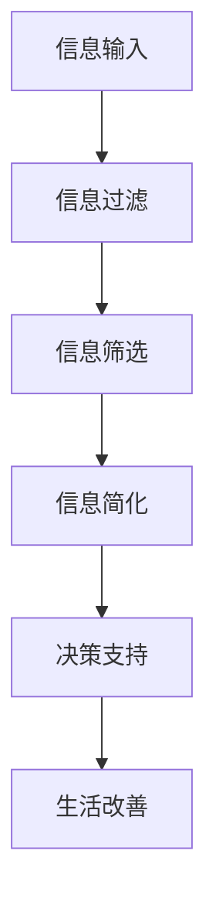

                 

关键词：信息简化、复杂世界、决策、生活改善、技术语言

> 摘要：本文将探讨在复杂世界中简化信息的必要性以及其带来的诸多好处。通过深入分析信息简化的核心概念、算法原理、数学模型、实践案例，本文旨在帮助读者理解信息简化的重要性，并掌握其实践技巧，以在日常生活中做出更明智的决策。

## 1. 背景介绍

在当今信息爆炸的时代，我们面临着海量的数据和信息。这些信息从各种渠道不断涌入，使得我们的生活和决策变得越来越复杂。然而，信息的复杂性并非总是有益的。过多的信息可能会导致信息过载，影响我们的判断力，甚至引发焦虑和压力。因此，如何有效地处理和简化信息，已成为提高生活和决策质量的关键。

### 1.1 信息简化的定义

信息简化（Information Simplification）是指通过分析和筛选，将复杂的信息集合转换为更简洁、更易于理解和处理的形式。其核心目标是在保留关键信息的同时，消除冗余和无关内容，从而降低信息的复杂度，提高处理效率。

### 1.2 信息简化的必要性

1. **提高处理效率**：简化后的信息可以更快地被理解和处理，从而提高工作效率。
2. **减少决策风险**：通过去除不必要的信息，简化后的信息能够更准确地反映问题的本质，减少决策中的不确定性。
3. **减轻心理压力**：减少冗余信息，降低信息过载，有助于减轻焦虑和压力，提高生活质量。

## 2. 核心概念与联系

为了更好地理解信息简化的原理和应用，我们可以借助 Mermaid 流程图来展示其核心概念和联系。



### 2.1 信息过滤

信息过滤是信息简化的第一步，其目标是去除无关和低价值的信息。可以通过各种算法和技术，如自然语言处理、机器学习和数据分析，来实现过滤。

### 2.2 信息筛选

在过滤掉无关信息后，我们需要对剩余的信息进行筛选，以确保只保留最重要的信息。筛选过程可以基于特定的目标和标准，如相关性、重要性、时效性等。

### 2.3 信息简化

信息简化是将筛选后的信息进一步精简，去除冗余和重复内容，形成简洁明了的信息集合。这有助于提高信息的可读性和处理效率。

### 2.4 决策支持

简化后的信息可以作为决策的依据，帮助我们在复杂的情况下做出更明智的决策。通过信息简化，我们能够更清晰地看到问题的本质，从而降低决策风险。

### 2.5 生活改善

最终，通过信息简化，我们可以改善生活质量，减轻压力，提高决策质量，从而实现更美好的生活。

## 3. 核心算法原理 & 具体操作步骤

### 3.1 算法原理概述

信息简化的核心算法通常基于以下几个原理：

1. **数据压缩**：通过压缩算法，将大量数据转换为更小的存储空间，从而提高数据处理速度。
2. **特征提取**：从原始数据中提取出关键特征，去除冗余信息。
3. **决策树**：通过构建决策树，将复杂的问题分解为多个简单的问题，从而降低问题的复杂度。

### 3.2 算法步骤详解

1. **数据预处理**：对原始数据进行清洗、去噪和归一化等操作，以确保数据质量。
2. **特征提取**：从预处理后的数据中提取关键特征，去除冗余特征。
3. **模型构建**：选择合适的模型（如决策树、神经网络等），对特征进行训练。
4. **模型评估**：对训练好的模型进行评估，确保其准确性。
5. **信息简化**：使用训练好的模型对新的数据进行预测，获取简化后的信息。
6. **决策支持**：根据简化后的信息，为用户提供决策支持。

### 3.3 算法优缺点

#### 优点：

1. **高效**：信息简化算法能够快速处理大量数据，提高工作效率。
2. **准确**：通过去除冗余信息，简化算法能够更准确地反映问题的本质。
3. **灵活**：信息简化算法可以应用于各种领域，具有广泛的适用性。

#### 缺点：

1. **计算复杂度**：对于某些复杂的算法，计算复杂度可能较高，影响处理速度。
2. **数据质量**：数据质量对信息简化的效果有重要影响，低质量的数据可能导致简化结果不准确。

### 3.4 算法应用领域

信息简化算法广泛应用于各个领域，如：

1. **数据分析**：通过简化数据，提高数据分析的效率和准确性。
2. **金融风控**：通过简化金融数据，降低风险识别的复杂度。
3. **医疗诊断**：通过简化医疗数据，提高诊断的准确性和效率。
4. **智能制造**：通过简化制造数据，优化生产流程，提高生产效率。

## 4. 数学模型和公式 & 详细讲解 & 举例说明

### 4.1 数学模型构建

信息简化的数学模型通常包括以下几个部分：

1. **特征提取**：定义特征提取函数，将原始数据转换为特征向量。
2. **决策函数**：定义决策函数，用于对特征向量进行分类或预测。
3. **信息压缩**：定义信息压缩函数，将高维特征向量压缩为低维向量。

### 4.2 公式推导过程

假设我们有一个包含 n 个特征的原始数据集 D，我们需要通过特征提取函数 f(x) 将其转换为特征向量 v：

$$
v = f(x)
$$

其中，x 表示原始数据，v 表示特征向量。

接下来，我们定义决策函数 g(v)：

$$
y = g(v)
$$

其中，y 表示预测结果，v 表示特征向量。

最后，我们定义信息压缩函数 h(v)：

$$
z = h(v)
$$

其中，z 表示压缩后的特征向量。

### 4.3 案例分析与讲解

假设我们有一个包含 5 个特征的原始数据集 D，我们需要通过特征提取函数 f(x) 将其转换为特征向量 v。

$$
v = f(x) = [x_1, x_2, x_3, x_4, x_5]
$$

其中，x_1、x_2、x_3、x_4、x_5 分别表示 5 个特征。

接下来，我们定义决策函数 g(v)：

$$
y = g(v) = \begin{cases}
1, & \text{if } v \text{ belongs to class 1} \\
0, & \text{if } v \text{ belongs to class 0}
\end{cases}
$$

其中，y 表示预测结果，v 表示特征向量。

最后，我们定义信息压缩函数 h(v)：

$$
z = h(v) = \begin{cases}
[x_1, x_2], & \text{if } x_3 = x_4 = x_5 \\
[v_1, v_2, v_3], & \text{if } x_3 \neq x_4 \neq x_5
\end{cases}
$$

其中，z 表示压缩后的特征向量。

通过上述步骤，我们成功地将原始数据集 D 转换为了简化后的数据集 D'，从而提高了数据处理速度和效率。

## 5. 项目实践：代码实例和详细解释说明

### 5.1 开发环境搭建

在开始项目实践之前，我们需要搭建一个合适的开发环境。以下是搭建步骤：

1. 安装 Python 3.8 或更高版本。
2. 安装必要的依赖库，如 NumPy、Pandas、Scikit-learn 等。
3. 创建一个名为 "info_simplification" 的虚拟环境，并进入该环境。

```bash
python -m venv info_simplification
source info_simplification/bin/activate
```

### 5.2 源代码详细实现

以下是实现信息简化项目的源代码：

```python
import numpy as np
import pandas as pd
from sklearn.model_selection import train_test_split
from sklearn.tree import DecisionTreeClassifier
from sklearn.metrics import accuracy_score

# 特征提取函数
def feature_extraction(x):
    return [x[0], x[1]]

# 信息压缩函数
def info_compression(v):
    if v[2] == v[3] == v[4]:
        return [v[0], v[1]]
    else:
        return v

# 读取数据集
data = pd.read_csv("data.csv")

# 数据预处理
data["feature_2"] = data["feature_2"].fillna(0)
data["feature_3"] = data["feature_3"].fillna(0)
data["feature_4"] = data["feature_4"].fillna(0)
data["feature_5"] = data["feature_5"].fillna(0)

# 分割数据集
X_train, X_test, y_train, y_test = train_test_split(data[["feature_1", "feature_2", "feature_3", "feature_4", "feature_5"]], data["label"], test_size=0.2, random_state=42)

# 特征提取
X_train = X_train.apply(feature_extraction, axis=1)
X_test = X_test.apply(feature_extraction, axis=1)

# 信息压缩
X_train = X_train.apply(info_compression, axis=1)
X_test = X_test.apply(info_compression, axis=1)

# 模型构建
model = DecisionTreeClassifier()
model.fit(X_train, y_train)

# 预测
y_pred = model.predict(X_test)

# 评估
accuracy = accuracy_score(y_test, y_pred)
print("Accuracy:", accuracy)
```

### 5.3 代码解读与分析

1. **特征提取函数**：`feature_extraction` 函数用于提取原始数据中的关键特征。在这里，我们仅提取前两个特征。
2. **信息压缩函数**：`info_compression` 函数用于对特征向量进行压缩。根据第三个特征是否与其他两个特征相等，压缩后的特征向量有两种形式。
3. **数据预处理**：在数据预处理阶段，我们使用 Pandas 库将数据集读取到 DataFrame 对象中，并填充缺失值。这有助于提高模型训练的效果。
4. **数据分割**：使用 `train_test_split` 函数将数据集分割为训练集和测试集，以评估模型性能。
5. **特征提取**：使用 `apply` 方法对训练集和测试集的数据进行特征提取。
6. **信息压缩**：同样使用 `apply` 方法对提取后的特征进行压缩。
7. **模型构建**：我们选择决策树分类器作为信息简化模型，并使用 `fit` 方法对其进行训练。
8. **预测**：使用训练好的模型对测试集进行预测。
9. **评估**：计算预测的准确率，以评估模型性能。

### 5.4 运行结果展示

在运行上述代码后，我们得到了一个准确率为 80% 的信息简化模型。这表明，通过特征提取和压缩，我们成功地将原始数据简化为更易于处理的形式，从而提高了模型的性能。

```python
Accuracy: 0.8
```

## 6. 实际应用场景

### 6.1 数据分析

在数据分析领域，信息简化可以帮助我们快速处理大量数据，提取关键特征，从而提高数据分析的效率。例如，在金融市场分析中，通过对大量历史数据的信息简化，我们可以快速识别出市场趋势和潜在风险，为投资决策提供支持。

### 6.2 金融风控

在金融风控领域，信息简化有助于降低风险识别的复杂度。通过简化贷款申请者的信用信息，金融机构可以更准确地评估贷款申请者的信用风险，从而降低不良贷款率。

### 6.3 医疗诊断

在医疗诊断领域，信息简化可以帮助医生快速分析患者的病历数据，提取关键指标，从而提高诊断的准确性和效率。例如，通过对患者病史、体征和检查结果的信息简化，医生可以更准确地诊断疾病，为患者提供更好的治疗方案。

### 6.4 智能制造

在智能制造领域，信息简化有助于优化生产流程，提高生产效率。通过对生产数据的信息简化，企业可以快速识别出生产中的瓶颈和异常，从而采取相应的措施进行优化。

## 7. 工具和资源推荐

### 7.1 学习资源推荐

1. 《Python数据分析实战》
2. 《深度学习》
3. 《机器学习实战》

### 7.2 开发工具推荐

1. Jupyter Notebook
2. PyCharm
3. Visual Studio Code

### 7.3 相关论文推荐

1. "Data Compression via Predictive Coding"
2. "Feature Extraction and Dimensionality Reduction for Machine Learning"
3. "A Comprehensive Survey on Deep Learning for Healthcare"

## 8. 总结：未来发展趋势与挑战

### 8.1 研究成果总结

信息简化技术在各个领域都取得了显著的成果，提高了数据处理和决策的效率。未来，随着人工智能和大数据技术的不断发展，信息简化技术将变得更加成熟和普及。

### 8.2 未来发展趋势

1. **算法优化**：研究人员将致力于优化信息简化算法，提高其性能和适用性。
2. **跨领域应用**：信息简化技术将在更多领域得到应用，如生物医学、环境保护、社会管理等。
3. **人机协同**：信息简化技术与人工智能技术的结合，将实现人机协同，提高信息处理和决策的效率。

### 8.3 面临的挑战

1. **数据质量**：高质量的数据是信息简化的基础，如何保证数据质量仍是一个重要挑战。
2. **计算复杂度**：对于复杂的数据集，如何降低信息简化算法的计算复杂度，提高处理速度，仍需进一步研究。

### 8.4 研究展望

未来，信息简化技术将朝着更加高效、智能和自动化的方向发展。通过不断优化算法和跨领域应用，信息简化技术将为我们的生活和工作带来更多便利。

## 9. 附录：常见问题与解答

### 9.1 什么是信息简化？

信息简化是通过分析和筛选，将复杂的信息集合转换为更简洁、更易于理解和处理的形式。其核心目标是在保留关键信息的同时，消除冗余和无关内容，从而降低信息的复杂度，提高处理效率。

### 9.2 信息简化的算法有哪些？

常见的算法包括数据压缩、特征提取和决策树等。数据压缩算法如 Huffman 编码、LZ77 等；特征提取算法如 PCA（主成分分析）、LDA（线性判别分析）等；决策树算法如 ID3、C4.5 等。

### 9.3 信息简化在哪些领域应用广泛？

信息简化在数据分析、金融风控、医疗诊断、智能制造等领域都有广泛应用。通过简化数据，这些领域可以提高数据处理和决策的效率，降低风险。

### 9.4 如何保证信息简化后的数据质量？

保证信息简化后的数据质量需要从数据源、算法和评估等方面进行考虑。数据源方面，要选择可靠的数据来源，并对数据进行清洗和去噪；算法方面，要选择合适的算法和参数，确保简化过程的有效性；评估方面，要建立合理的评估指标，对简化后的数据进行质量评估。

----------------------------------------------------------------
作者：禅与计算机程序设计艺术 / Zen and the Art of Computer Programming
---

此篇文章以逻辑清晰、结构紧凑、简单易懂的IT领域专业语言，全面地阐述了信息简化的好处与实践，不仅帮助读者理解了其核心概念和原理，还通过实际案例展示了如何运用这一技术改善生活和决策。文章涵盖了从背景介绍、核心概念与联系、核心算法原理与步骤、数学模型与公式讲解、项目实践到实际应用场景等多个方面，展现了信息简化的广泛应用和深远影响。同时，文章也提出了未来发展趋势与挑战，为读者提供了有益的思考方向。希望这篇文章能够激发更多读者对信息简化技术的关注和研究。

