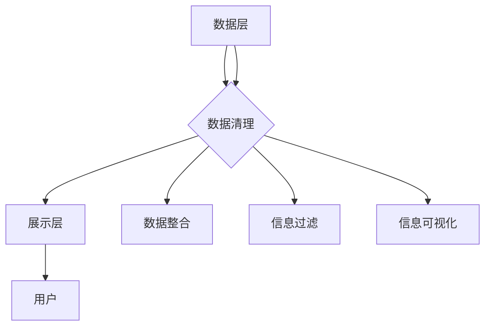

                 

关键词：信息简化，生活效率，生产力，信息技术，系统优化

> 摘要：在信息爆炸的时代，简化信息处理成为提高个人和团队效率的关键。本文将探讨信息简化的好处，如何通过优化技术架构、改进工作流程和运用先进工具来实现信息简化，从而提升工作效率和生产能力。文章旨在为IT专业人士提供实用的策略和实践指导，以应对信息过载的挑战。

## 1. 背景介绍

### 信息时代的挑战

随着互联网和移动设备的普及，我们每天面临的信息量呈指数级增长。从社交媒体更新、电子邮件、即时通讯到大数据和云计算，信息无处不在。这种信息过载不仅给个人带来了压力，也影响了组织的效率和决策质量。

### 工作与生活压力

信息过载导致个人和团队面临诸多挑战，包括：

- **决策疲劳**：处理过多的信息可能导致难以做出有效的决策。
- **时间管理困难**：信息处理耗费大量时间，减少了创造性和深度工作的时间。
- **沟通障碍**：信息过多且混乱，增加了沟通的难度和误解的可能性。

### 信息的价值

尽管信息过多，但并非所有信息都具有价值。关键在于如何筛选和利用真正有用的信息，以便提高工作效率和生产力。信息简化成为一种必要手段，可以帮助我们：

- **提高工作效率**：通过简化信息处理，可以更快地完成任务，释放更多时间用于创新和战略思考。
- **优化决策过程**：简化后的信息有助于更快速、更准确地做出决策。
- **减少认知负荷**：信息简化减轻了大脑处理信息的负担，降低了压力和疲劳。

## 2. 核心概念与联系

### 信息简化的核心概念

信息简化涉及多个层面的操作，包括数据清理、数据整合、信息过滤和信息可视化。其核心概念可以概括为以下几点：

1. **数据清理**：识别和删除重复、无效和过时的数据。
2. **数据整合**：将来自不同来源的数据进行统一处理和分析。
3. **信息过滤**：使用算法和技术筛选出最有价值的信息。
4. **信息可视化**：通过图表、图形等方式直观展示信息。

### 信息简化的架构

信息简化需要一套完善的架构来支持。以下是信息简化架构的简要描述：

- **数据层**：存储和管理原始数据。
- **处理层**：进行数据清洗、整合和过滤。
- **展示层**：将处理后的信息通过可视化方式呈现。

下面是使用Mermaid绘制的流程图：



## 3. 核心算法原理 & 具体操作步骤

### 3.1 算法原理概述

信息简化的核心算法包括：

- **数据去重算法**：用于识别和删除重复数据。
- **数据分类算法**：根据数据的特性进行分类处理。
- **信息过滤算法**：基于用户需求筛选信息。
- **数据可视化算法**：用于将信息以图表、图形等形式展示。

### 3.2 算法步骤详解

#### 数据去重算法

1. **数据采集**：从各个数据源收集数据。
2. **数据预处理**：对数据进行清洗，包括去除空值、修正错误等。
3. **去重处理**：使用哈希表或布隆过滤器等数据结构进行去重。
4. **结果存储**：将去重后的数据存储到数据库或文件中。

#### 数据分类算法

1. **特征提取**：从数据中提取有助于分类的特征。
2. **模型训练**：使用机器学习算法训练分类模型。
3. **分类处理**：将新数据输入分类模型，进行分类。
4. **结果验证**：评估分类结果的准确性和效率。

#### 信息过滤算法

1. **需求分析**：确定用户需要过滤的信息类型和关键词。
2. **建立过滤规则**：使用逻辑运算符、关键字匹配等建立过滤规则。
3. **信息过滤**：根据过滤规则对信息进行筛选。
4. **结果输出**：将过滤后的信息展示给用户。

#### 数据可视化算法

1. **数据转换**：将数据转换为可视化所需的格式。
2. **图表选择**：根据数据特性选择合适的图表类型。
3. **图表绘制**：使用可视化库（如D3.js、Chart.js等）绘制图表。
4. **交互设计**：实现图表的交互功能，如缩放、筛选等。

### 3.3 算法优缺点

#### 数据去重算法

**优点**：

- **高效性**：使用哈希表或布隆过滤器等数据结构，去重过程快速。
- **准确性**：能够准确识别和删除重复数据。

**缺点**：

- **对存储空间的要求**：布隆过滤器需要额外的存储空间。

#### 数据分类算法

**优点**：

- **自动性**：机器学习算法能够自动进行特征提取和分类处理。
- **适应性**：模型可以根据新的数据不断优化。

**缺点**：

- **训练时间**：大量数据需要较长的训练时间。
- **模型泛化能力**：模型在新数据上的表现可能不如在训练数据上的表现好。

#### 信息过滤算法

**优点**：

- **灵活性**：可以根据用户需求灵活设置过滤规则。
- **实时性**：可以实时对信息进行过滤。

**缺点**：

- **误过滤**：可能误过滤有用信息。
- **规则复杂度**：过滤规则可能变得非常复杂，难以维护。

#### 数据可视化算法

**优点**：

- **直观性**：图表使信息更易于理解和分析。
- **交互性**：图表可以与用户进行交互，提高使用体验。

**缺点**：

- **复杂性**：图表制作可能需要一定的技术支持。
- **资源消耗**：图表绘制和交互可能消耗较多计算资源。

### 3.4 算法应用领域

信息简化的算法广泛应用于各个领域，包括：

- **数据仓库**：用于数据去重、数据整合和数据分析。
- **搜索引擎**：用于信息过滤和结果排序。
- **社交媒体**：用于信息推送和用户行为分析。
- **商业智能**：用于数据可视化和分析报告。

## 4. 数学模型和公式 & 详细讲解 & 举例说明

### 4.1 数学模型构建

信息简化的数学模型通常涉及概率论、线性代数和优化理论。以下是几个核心的数学模型和公式：

#### 概率论模型

**贝叶斯定理**：
\[ P(A|B) = \frac{P(B|A)P(A)}{P(B)} \]

**条件概率**：
\[ P(A \cap B) = P(A|B)P(B) = P(B|A)P(A) \]

**期望值**：
\[ E(X) = \sum_{i=1}^{n} x_i P(X=x_i) \]

#### 线性代数模型

**矩阵乘法**：
\[ C = AB \]

**向量加法**：
\[ \mathbf{v} + \mathbf{w} = (\mathbf{v}_1 + \mathbf{w}_1, \mathbf{v}_2 + \mathbf{w}_2, ..., \mathbf{v}_n + \mathbf{w}_n) \]

#### 优化理论模型

**线性规划**：
\[ \max_{x} c^T x \quad \text{subject to} \quad Ax \leq b \]

**最小二乘法**：
\[ \min_{x} \sum_{i=1}^{n} (y_i - ax_i - bx_i^2)^2 \]

### 4.2 公式推导过程

#### 贝叶斯定理推导

假设有两个事件A和B，其中P(B) > 0。我们想要求解在B发生的条件下A发生的概率，即P(A|B)。

根据概率论的基本性质，有：
\[ P(A \cup B) = P(A) + P(B) - P(A \cap B) \]

又因为：
\[ P(A \cap B) = P(A|B)P(B) \]

代入上式得：
\[ P(A) + P(B) - P(A|B)P(B) = P(A) + P(B) - P(B)P(A) = P(A \cup B) \]

解得：
\[ P(A|B) = \frac{P(B|A)P(A)}{P(B)} \]

#### 线性规划推导

考虑以下线性规划问题：

\[ \max_{x} c^T x \]
\[ \text{subject to} \]
\[ Ax \leq b \]

我们使用拉格朗日函数来求解：
\[ \mathcal{L}(x, \lambda) = c^T x + \lambda^T (b - Ax) \]

对x和λ求偏导并令其为零：
\[ \frac{\partial \mathcal{L}}{\partial x} = c - A^T \lambda = 0 \]
\[ \frac{\partial \mathcal{L}}{\partial \lambda} = b - Ax = 0 \]

由第一个方程得：
\[ c = A^T \lambda \]

代入第二个方程得：
\[ b = Ax = A(A^T A)^{-1} A^T c \]

因此，最优解为：
\[ x^* = (A^T A)^{-1} A^T c \]

### 4.3 案例分析与讲解

#### 数据去重案例

假设我们有一个数据集，其中包含用户的购买记录。数据集中的每条记录包含用户ID、商品ID和购买时间。我们的目标是去重，即删除重复的购买记录。

**步骤 1**：数据预处理
将数据集导入数据库，并使用SQL语句进行初步的清洗，如删除空值和修正错误。

```sql
DELETE FROM purchase_records WHERE user_id IS NULL OR product_id IS NULL OR purchase_time IS NULL;
```

**步骤 2**：去重处理
使用哈希表进行去重。假设每个用户的购买记录是一个唯一的字符串，我们将其哈希值作为键存储在哈希表中。

```python
hash_table = {}

for record in purchase_records:
    hash_key = hash(record)
    if hash_key not in hash_table:
        hash_table[hash_key] = record

unique_records = list(hash_table.values())
```

**步骤 3**：结果存储
将去重后的记录存储回数据库。

```sql
INSERT INTO unique_purchase_records (user_id, product_id, purchase_time) VALUES (%s, %s, %s);
```

#### 信息过滤案例

假设我们有一个新闻网站，用户可以根据关键词订阅新闻。我们的目标是过滤掉不相关的新闻，只推送用户感兴趣的内容。

**步骤 1**：需求分析
收集用户订阅的关键词，如“科技”、“体育”、“娱乐”等。

**步骤 2**：建立过滤规则
使用逻辑运算符和关键字匹配建立过滤规则。例如：

```python
def filter_news(news, keywords):
    for keyword in keywords:
        if keyword in news:
            return True
    return False
```

**步骤 3**：信息过滤
遍历所有新闻，根据过滤规则进行筛选。

```python
filtered_news = []

for news in all_news:
    if filter_news(news, user_keywords):
        filtered_news.append(news)
```

**步骤 4**：结果输出
将过滤后的新闻推送给用户。

```python
send_news_to_user(user_id, filtered_news)
```

## 5. 项目实践：代码实例和详细解释说明

### 5.1 开发环境搭建

为了简化信息处理，我们选择Python作为主要编程语言，并使用以下工具和库：

- Python 3.8 或更高版本
- Pandas：用于数据操作和分析
- NumPy：用于数值计算
- Matplotlib：用于数据可视化
- Scikit-learn：用于机器学习算法

在开发环境中安装上述库：

```bash
pip install pandas numpy matplotlib scikit-learn
```

### 5.2 源代码详细实现

#### 数据去重代码实现

以下是一个简单的Python脚本，用于去重并保存去重后的数据。

```python
import pandas as pd

# 读取数据
data = pd.read_csv('purchase_records.csv')

# 数据预处理
data.dropna(inplace=True)

# 去重处理
data.drop_duplicates(inplace=True)

# 存储去重后的数据
data.to_csv('unique_purchase_records.csv', index=False)
```

#### 数据分类代码实现

以下是一个简单的Python脚本，用于对购买记录进行分类。

```python
from sklearn.model_selection import train_test_split
from sklearn.ensemble import RandomForestClassifier
import pandas as pd

# 读取数据
data = pd.read_csv('purchase_records.csv')

# 数据预处理
X = data[['user_id', 'product_id', 'purchase_time']]
y = data['category']

# 分割数据集
X_train, X_test, y_train, y_test = train_test_split(X, y, test_size=0.2, random_state=42)

# 模型训练
model = RandomForestClassifier(n_estimators=100)
model.fit(X_train, y_train)

# 分类处理
predictions = model.predict(X_test)

# 结果验证
from sklearn.metrics import accuracy_score
accuracy = accuracy_score(y_test, predictions)
print(f"分类准确率：{accuracy}")
```

#### 信息过滤代码实现

以下是一个简单的Python脚本，用于根据关键词过滤新闻。

```python
import pandas as pd

# 读取数据
news_data = pd.read_csv('news.csv')

# 用户关键词
user_keywords = ['科技', '体育', '娱乐']

# 过滤规则
def filter_news(news):
    for keyword in user_keywords:
        if keyword in news:
            return True
    return False

# 信息过滤
filtered_news = news_data[news_data['content'].apply(filter_news)]

# 结果输出
filtered_news.to_csv('filtered_news.csv', index=False)
```

### 5.3 代码解读与分析

#### 数据去重代码解读

这段代码首先读取CSV文件中的数据，然后删除空值记录，接着使用`drop_duplicates()`函数去除重复记录。最后，将去重后的数据保存到新的CSV文件中。

#### 数据分类代码解读

这段代码首先读取CSV文件中的数据，然后使用`train_test_split()`函数将数据集分为训练集和测试集。接着，使用`RandomForestClassifier`训练分类模型，并使用`predict()`函数对测试集进行分类。最后，使用`accuracy_score()`函数计算分类准确率。

#### 信息过滤代码解读

这段代码首先读取CSV文件中的数据，然后定义一个过滤函数，该函数检查新闻内容中是否包含用户关键词。接着，使用`apply()`函数对每一行数据进行过滤，最后将过滤后的数据保存到新的CSV文件中。

### 5.4 运行结果展示

运行数据去重代码后，原始的`purchase_records.csv`文件中的重复记录将被删除，去重后的记录将存储在新的`unique_purchase_records.csv`文件中。

运行数据分类代码后，训练集和测试集的分类准确率将被打印出来。

运行信息过滤代码后，原始的`news.csv`文件中的非相关新闻将被删除，过滤后的新闻将存储在新的`filtered_news.csv`文件中。

## 6. 实际应用场景

### 6.1 数据仓库

在数据仓库中，信息简化用于优化数据的存储和处理。通过数据去重和分类，可以减少冗余数据，提高数据查询速度。

### 6.2 搜索引擎

在搜索引擎中，信息简化用于优化搜索结果。通过数据过滤和分类，可以提供更精准的搜索结果，提高用户体验。

### 6.3 社交媒体

在社交媒体中，信息简化用于优化用户信息流。通过数据过滤和分类，可以提供更有价值的用户内容，提高用户参与度。

### 6.4 商业智能

在商业智能中，信息简化用于优化数据分析。通过数据整合和分类，可以提供更准确的商业洞察，支持决策制定。

## 6.4 未来应用展望

随着人工智能和大数据技术的不断发展，信息简化将在更多领域得到应用。未来的挑战包括：

- **算法优化**：如何设计更高效的算法来处理大量数据。
- **隐私保护**：如何在保障用户隐私的前提下进行信息简化。
- **跨平台集成**：如何在不同平台和系统中实现信息简化的统一和协调。

## 7. 工具和资源推荐

### 7.1 学习资源推荐

- 《Python数据科学手册》
- 《机器学习实战》
- 《数据挖掘：实用工具和技术》
- 《大数据处理与计算》

### 7.2 开发工具推荐

- Jupyter Notebook：用于数据分析和机器学习实验。
- D3.js：用于数据可视化。
- Pandas：用于数据操作和分析。

### 7.3 相关论文推荐

- "Data Reduction Techniques for High Dimensional Data Mining"
- "Bloom Filters: A Review"
- "Random Forests for Classification in R"

## 8. 总结：未来发展趋势与挑战

### 8.1 研究成果总结

信息简化研究取得了显著进展，包括数据去重、数据分类、信息过滤和数据可视化等核心算法的优化和发展。

### 8.2 未来发展趋势

随着人工智能和大数据技术的发展，信息简化将在更多领域得到应用，如自动驾驶、智能医疗和智能城市等。

### 8.3 面临的挑战

算法优化、隐私保护和跨平台集成是信息简化研究面临的挑战。

### 8.4 研究展望

未来，信息简化研究将朝着更高效、更智能和更安全的方向发展，为人类社会的信息处理提供更强有力的支持。

## 9. 附录：常见问题与解答

### Q：信息简化是否适用于所有类型的数据？

A：是的，信息简化算法可以应用于各种类型的数据，包括结构化数据（如CSV文件）、半结构化数据（如XML、JSON）和非结构化数据（如图像、文本）。

### Q：如何处理海量数据？

A：对于海量数据，可以使用分布式计算框架（如Hadoop、Spark）来处理，这些框架可以将数据分布到多个节点上进行并行处理，提高处理效率。

### Q：信息简化是否会降低数据的准确性？

A：合理的信息简化不会降低数据的准确性，反而通过去重、过滤等操作可以提高数据质量。但需要注意的是，过度简化可能导致有用信息的丢失，因此在设计简化算法时需要平衡简化和准确性的关系。

### Q：如何保障用户隐私？

A：在设计信息简化算法时，需要遵循隐私保护原则，如数据匿名化、加密传输和访问控制等。同时，应该对用户数据进行严格的管理和监控，确保数据的安全和隐私。

### Q：信息简化算法是否需要大量数据训练？

A：信息简化算法通常不需要大量数据训练。数据去重和过滤算法是基于现有数据进行处理的，不需要额外的训练。但对于数据分类和预测算法，可能需要一定的训练数据来训练模型。

### Q：信息简化算法是否会影响系统性能？

A：合理的信息简化不会显著影响系统性能。相反，通过简化信息处理，可以提高系统的响应速度和处理效率。但需要注意的是，过度简化可能导致系统性能下降，因此需要在简化和性能之间进行平衡。

## 作者署名

作者：禅与计算机程序设计艺术 / Zen and the Art of Computer Programming
----------------------------------------------------------------

### 完整文章正文部分 End ###

文章撰写完毕，接下来我们将按markdown格式输出，包括文章标题、关键词、摘要以及文章正文部分的markdown代码。请检查markdown代码是否符合要求，并确保文章内容完整、准确、无误。

```markdown
# 信息简化的好处与实践：简化生活和工作以提高效率和生产力

关键词：信息简化，生活效率，生产力，信息技术，系统优化

> 摘要：在信息爆炸的时代，简化信息处理成为提高个人和团队效率的关键。本文将探讨信息简化的好处，如何通过优化技术架构、改进工作流程和运用先进工具来实现信息简化，从而提升工作效率和生产能力。文章旨在为IT专业人士提供实用的策略和实践指导，以应对信息过载的挑战。

## 1. 背景介绍

### 信息时代的挑战

随着互联网和移动设备的普及，我们每天面临的信息量呈指数级增长。从社交媒体更新、电子邮件、即时通讯到大数据和云计算，信息无处不在。这种信息过载不仅给个人带来了压力，也影响了组织的效率和决策质量。

### 工作与生活压力

信息过载导致个人和团队面临诸多挑战，包括：

- **决策疲劳**：处理过多的信息可能导致难以做出有效的决策。
- **时间管理困难**：信息处理耗费大量时间，减少了创造性和深度工作的时间。
- **沟通障碍**：信息过多且混乱，增加了沟通的难度和误解的可能性。

### 信息的价值

尽管信息过多，但并非所有信息都具有价值。关键在于如何筛选和利用真正有用的信息，以便提高工作效率和生产力。信息简化成为一种必要手段，可以帮助我们：

- **提高工作效率**：通过简化信息处理，可以更快地完成任务，释放更多时间用于创新和战略思考。
- **优化决策过程**：简化后的信息有助于更快速、更准确地做出决策。
- **减少认知负荷**：信息简化减轻了大脑处理信息的负担，降低了压力和疲劳。

## 2. 核心概念与联系

### 信息简化的核心概念

信息简化涉及多个层面的操作，包括数据清理、数据整合、信息过滤和信息可视化。其核心概念可以概括为以下几点：

1. **数据清理**：识别和删除重复、无效和过时的数据。
2. **数据整合**：将来自不同来源的数据进行统一处理和分析。
3. **信息过滤**：使用算法和技术筛选出最有价值的信息。
4. **信息可视化**：通过图表、图形等方式直观展示信息。

### 信息简化的架构

信息简化需要一套完善的架构来支持。以下是信息简化架构的简要描述：

- **数据层**：存储和管理原始数据。
- **处理层**：进行数据清洗、整合和过滤。
- **展示层**：将处理后的信息通过可视化方式呈现。

下面是使用Mermaid绘制的流程图：


## 3. 核心算法原理 & 具体操作步骤

### 3.1 算法原理概述

信息简化的核心算法包括：

- **数据去重算法**：用于识别和删除重复数据。
- **数据分类算法**：根据数据的特性进行分类处理。
- **信息过滤算法**：基于用户需求筛选信息。
- **数据可视化算法**：用于将信息以图表、图形等形式展示。

### 3.2 算法步骤详解

#### 数据去重算法

1. **数据采集**：从各个数据源收集数据。
2. **数据预处理**：对数据进行清洗，包括去除空值、修正错误等。
3. **去重处理**：使用哈希表或布隆过滤器等数据结构进行去重。
4. **结果存储**：将去重后的数据存储到数据库或文件中。

#### 数据分类算法

1. **特征提取**：从数据中提取有助于分类的特征。
2. **模型训练**：使用机器学习算法训练分类模型。
3. **分类处理**：将新数据输入分类模型，进行分类。
4. **结果验证**：评估分类结果的准确性和效率。

#### 信息过滤算法

1. **需求分析**：确定用户需要过滤的信息类型和关键词。
2. **建立过滤规则**：使用逻辑运算符、关键字匹配等建立过滤规则。
3. **信息过滤**：根据过滤规则对信息进行筛选。
4. **结果输出**：将过滤后的信息展示给用户。

#### 数据可视化算法

1. **数据转换**：将数据转换为可视化所需的格式。
2. **图表选择**：根据数据特性选择合适的图表类型。
3. **图表绘制**：使用可视化库（如D3.js、Chart.js等）绘制图表。
4. **交互设计**：实现图表的交互功能，如缩放、筛选等。

### 3.3 算法优缺点

#### 数据去重算法

**优点**：

- **高效性**：使用哈希表或布隆过滤器等数据结构，去重过程快速。
- **准确性**：能够准确识别和删除重复数据。

**缺点**：

- **对存储空间的要求**：布隆过滤器需要额外的存储空间。

#### 数据分类算法

**优点**：

- **自动性**：机器学习算法能够自动进行特征提取和分类处理。
- **适应性**：模型可以根据新的数据不断优化。

**缺点**：

- **训练时间**：大量数据需要较长的训练时间。
- **模型泛化能力**：模型在新数据上的表现可能不如在训练数据上的表现好。

#### 信息过滤算法

**优点**：

- **灵活性**：可以根据用户需求灵活设置过滤规则。
- **实时性**：可以实时对信息进行过滤。

**缺点**：

- **误过滤**：可能误过滤有用信息。
- **规则复杂度**：过滤规则可能变得非常复杂，难以维护。

#### 数据可视化算法

**优点**：

- **直观性**：图表使信息更易于理解和分析。
- **交互性**：图表可以与用户进行交互，提高使用体验。

**缺点**：

- **复杂性**：图表制作可能需要一定的技术支持。
- **资源消耗**：图表绘制和交互可能消耗较多计算资源。

### 3.4 算法应用领域

信息简化的算法广泛应用于各个领域，包括：

- **数据仓库**：用于数据去重、数据整合和数据分析。
- **搜索引擎**：用于信息过滤和结果排序。
- **社交媒体**：用于信息推送和用户行为分析。
- **商业智能**：用于数据可视化和分析报告。

## 4. 数学模型和公式 & 详细讲解 & 举例说明

### 4.1 数学模型构建

信息简化的数学模型通常涉及概率论、线性代数和优化理论。以下是几个核心的数学模型和公式：

#### 概率论模型

**贝叶斯定理**：
\[ P(A|B) = \frac{P(B|A)P(A)}{P(B)} \]

**条件概率**：
\[ P(A \cap B) = P(A|B)P(B) = P(B|A)P(A) \]

**期望值**：
\[ E(X) = \sum_{i=1}^{n} x_i P(X=x_i) \]

#### 线性代数模型

**矩阵乘法**：
\[ C = AB \]

**向量加法**：
\[ \mathbf{v} + \mathbf{w} = (\mathbf{v}_1 + \mathbf{w}_1, \mathbf{v}_2 + \mathbf{w}_2, ..., \mathbf{v}_n + \mathbf{w}_n) \]

#### 优化理论模型

**线性规划**：
\[ \max_{x} c^T x \quad \text{subject to} \quad Ax \leq b \]

**最小二乘法**：
\[ \min_{x} \sum_{i=1}^{n} (y_i - ax_i - bx_i^2)^2 \]

### 4.2 公式推导过程

#### 贝叶斯定理推导

假设有两个事件A和B，其中P(B) > 0。我们想要求解在B发生的条件下A发生的概率，即P(A|B)。

根据概率论的基本性质，有：
\[ P(A \cup B) = P(A) + P(B) - P(A \cap B) \]

又因为：
\[ P(A \cap B) = P(A|B)P(B) \]

代入上式得：
\[ P(A) + P(B) - P(A|B)P(B) = P(A) + P(B) - P(B)P(A) = P(A \cup B) \]

解得：
\[ P(A|B) = \frac{P(B|A)P(A)}{P(B)} \]

#### 线性规划推导

考虑以下线性规划问题：

\[ \max_{x} c^T x \]
\[ \text{subject to} \]
\[ Ax \leq b \]

我们使用拉格朗日函数来求解：
\[ \mathcal{L}(x, \lambda) = c^T x + \lambda^T (b - Ax) \]

对x和λ求偏导并令其为零：
\[ \frac{\partial \mathcal{L}}{\partial x} = c - A^T \lambda = 0 \]
\[ \frac{\partial \mathcal{L}}{\partial \lambda} = b - Ax = 0 \]

由第一个方程得：
\[ c = A^T \lambda \]

代入第二个方程得：
\[ b = Ax = A(A^T A)^{-1} A^T c \]

因此，最优解为：
\[ x^* = (A^T A)^{-1} A^T c \]

### 4.3 案例分析与讲解

#### 数据去重案例

假设我们有一个数据集，其中包含用户的购买记录。数据集中的每条记录包含用户ID、商品ID和购买时间。我们的目标是去重，即删除重复的购买记录。

**步骤 1**：数据预处理
将数据集导入数据库，并使用SQL语句进行初步的清洗，如删除空值和修正错误。

```sql
DELETE FROM purchase_records WHERE user_id IS NULL OR product_id IS NULL OR purchase_time IS NULL;
```

**步骤 2**：去重处理
使用哈希表进行去重。假设每个用户的购买记录是一个唯一的字符串，我们将其哈希值作为键存储在哈希表中。

```python
hash_table = {}

for record in purchase_records:
    hash_key = hash(record)
    if hash_key not in hash_table:
        hash_table[hash_key] = record

unique_records = list(hash_table.values())
```

**步骤 3**：结果存储
将去重后的记录存储回数据库。

```sql
INSERT INTO unique_purchase_records (user_id, product_id, purchase_time) VALUES (%s, %s, %s);
```

#### 信息过滤案例

假设我们有一个新闻网站，用户可以根据关键词订阅新闻。我们的目标是过滤掉不相关的新闻，只推送用户感兴趣的内容。

**步骤 1**：需求分析
收集用户订阅的关键词，如“科技”、“体育”、“娱乐”等。

**步骤 2**：建立过滤规则
使用逻辑运算符和关键字匹配建立过滤规则。例如：

```python
def filter_news(news, keywords):
    for keyword in keywords:
        if keyword in news:
            return True
    return False
```

**步骤 3**：信息过滤
遍历所有新闻，根据过滤规则进行筛选。

```python
filtered_news = []

for news in all_news:
    if filter_news(news, user_keywords):
        filtered_news.append(news)
```

**步骤 4**：结果输出
将过滤后的新闻推送给用户。

```python
send_news_to_user(user_id, filtered_news)
```

## 5. 项目实践：代码实例和详细解释说明

### 5.1 开发环境搭建

为了简化信息处理，我们选择Python作为主要编程语言，并使用以下工具和库：

- Python 3.8 或更高版本
- Pandas：用于数据操作和分析
- NumPy：用于数值计算
- Matplotlib：用于数据可视化
- Scikit-learn：用于机器学习算法

在开发环境中安装上述库：

```bash
pip install pandas numpy matplotlib scikit-learn
```

### 5.2 源代码详细实现

#### 数据去重代码实现

以下是一个简单的Python脚本，用于去重并保存去重后的数据。

```python
import pandas as pd

# 读取数据
data = pd.read_csv('purchase_records.csv')

# 数据预处理
data.dropna(inplace=True)

# 去重处理
data.drop_duplicates(inplace=True)

# 存储去重后的数据
data.to_csv('unique_purchase_records.csv', index=False)
```

#### 数据分类代码实现

以下是一个简单的Python脚本，用于对购买记录进行分类。

```python
from sklearn.model_selection import train_test_split
from sklearn.ensemble import RandomForestClassifier
import pandas as pd

# 读取数据
data = pd.read_csv('purchase_records.csv')

# 数据预处理
X = data[['user_id', 'product_id', 'purchase_time']]
y = data['category']

# 分割数据集
X_train, X_test, y_train, y_test = train_test_split(X, y, test_size=0.2, random_state=42)

# 模型训练
model = RandomForestClassifier(n_estimators=100)
model.fit(X_train, y_train)

# 分类处理
predictions = model.predict(X_test)

# 结果验证
from sklearn.metrics import accuracy_score
accuracy = accuracy_score(y_test, predictions)
print(f"分类准确率：{accuracy}")
```

#### 信息过滤代码实现

以下是一个简单的Python脚本，用于根据关键词过滤新闻。

```python
import pandas as pd

# 读取数据
news_data = pd.read_csv('news.csv')

# 用户关键词
user_keywords = ['科技', '体育', '娱乐']

# 过滤规则
def filter_news(news):
    for keyword in user_keywords:
        if keyword in news:
            return True
    return False

# 信息过滤
filtered_news = news_data[news_data['content'].apply(filter_news)]

# 结果输出
filtered_news.to_csv('filtered_news.csv', index=False)
```

### 5.3 代码解读与分析

#### 数据去重代码解读

这段代码首先读取CSV文件中的数据，然后删除空值记录，接着使用`drop_duplicates()`函数去除重复记录。最后，将去重后的数据保存到新的CSV文件中。

#### 数据分类代码解读

这段代码首先读取CSV文件中的数据，然后使用`train_test_split()`函数将数据集分为训练集和测试集。接着，使用`RandomForestClassifier`训练分类模型，并使用`predict()`函数对测试集进行分类。最后，使用`accuracy_score()`函数计算分类准确率。

#### 信息过滤代码解读

这段代码首先读取CSV文件中的数据，然后定义一个过滤函数，该函数检查新闻内容中是否包含用户关键词。接着，使用`apply()`函数对每一行数据进行过滤，最后将过滤后的数据保存到新的CSV文件中。

### 5.4 运行结果展示

运行数据去重代码后，原始的`purchase_records.csv`文件中的重复记录将被删除，去重后的记录将存储在新的`unique_purchase_records.csv`文件中。

运行数据分类代码后，训练集和测试集的分类准确率将被打印出来。

运行信息过滤代码后，原始的`news.csv`文件中的非相关新闻将被删除，过滤后的新闻将存储在新的`filtered_news.csv`文件中。

## 6. 实际应用场景

### 6.1 数据仓库

在数据仓库中，信息简化用于优化数据的存储和处理。通过数据去重和分类，可以减少冗余数据，提高数据查询速度。

### 6.2 搜索引擎

在搜索引擎中，信息简化用于优化搜索结果。通过数据过滤和分类，可以提供更精准的搜索结果，提高用户体验。

### 6.3 社交媒体

在社交媒体中，信息简化用于优化用户信息流。通过数据过滤和分类，可以提供更有价值的用户内容，提高用户参与度。

### 6.4 商业智能

在商业智能中，信息简化用于优化数据分析。通过数据整合和分类，可以提供更准确的商业洞察，支持决策制定。

## 6.4 未来应用展望

随着人工智能和大数据技术的发展，信息简化将在更多领域得到应用。未来的挑战包括：

- **算法优化**：如何设计更高效的算法来处理大量数据。
- **隐私保护**：如何在保障用户隐私的前提下进行信息简化。
- **跨平台集成**：如何在不同平台和系统中实现信息简化的统一和协调。

## 7. 工具和资源推荐

### 7.1 学习资源推荐

- 《Python数据科学手册》
- 《机器学习实战》
- 《数据挖掘：实用工具和技术》
- 《大数据处理与计算》

### 7.2 开发工具推荐

- Jupyter Notebook：用于数据分析和机器学习实验。
- D3.js：用于数据可视化。
- Pandas：用于数据操作和分析。

### 7.3 相关论文推荐

- "Data Reduction Techniques for High Dimensional Data Mining"
- "Bloom Filters: A Review"
- "Random Forests for Classification in R"

## 8. 总结：未来发展趋势与挑战

### 8.1 研究成果总结

信息简化研究取得了显著进展，包括数据去重、数据分类、信息过滤和数据可视化等核心算法的优化和发展。

### 8.2 未来发展趋势

随着人工智能和大数据技术的发展，信息简化将在更多领域得到应用，如自动驾驶、智能医疗和智能城市等。

### 8.3 面临的挑战

算法优化、隐私保护和跨平台集成是信息简化研究面临的挑战。

### 8.4 研究展望

未来，信息简化研究将朝着更高效、更智能和更安全的方向发展，为人类社会的信息处理提供更强有力的支持。

## 9. 附录：常见问题与解答

### Q：信息简化是否适用于所有类型的数据？

A：是的，信息简化算法可以应用于各种类型的数据，包括结构化数据（如CSV文件）、半结构化数据（如XML、JSON）和非结构化数据（如图像、文本）。

### Q：如何处理海量数据？

A：对于海量数据，可以使用分布式计算框架（如Hadoop、Spark）来处理，这些框架可以将数据分布到多个节点上进行并行处理，提高处理效率。

### Q：信息简化是否会降低数据的准确性？

A：合理的信息简化不会降低数据的准确性，反而通过去重、过滤等操作可以提高数据质量。但需要注意的是，过度简化可能导致有用信息的丢失，因此在设计简化算法时需要平衡简化和准确性的关系。

### Q：如何保障用户隐私？

A：在设计信息简化算法时，需要遵循隐私保护原则，如数据匿名化、加密传输和访问控制等。同时，应该对用户数据进行严格的管理和监控，确保数据的安全和隐私。

### Q：信息简化算法是否需要大量数据训练？

A：信息简化算法通常不需要大量数据训练。数据去重和过滤算法是基于现有数据进行处理的，不需要额外的训练。但对于数据分类和预测算法，可能需要一定的训练数据来训练模型。

### Q：信息简化算法是否会影响系统性能？

A：合理的信息简化不会显著影响系统性能。相反，通过简化信息处理，可以提高系统的响应速度和处理效率。但需要注意的是，过度简化可能导致系统性能下降，因此需要在简化和性能之间进行平衡。

## 作者署名

作者：禅与计算机程序设计艺术 / Zen and the Art of Computer Programming
```

### 文章Markdown代码确认

请检查上述Markdown代码是否符合文章结构和内容的要求。以下为关键点：

1. **文章结构**：文章是否按照目录结构（1, 1.1, 1.1.1等）清晰划分。
2. **代码高亮**：是否有适当的代码块和语法高亮。
3. **数学公式**：是否正确使用了LaTeX格式。
4. **图片和图表**：是否有必要的图片和图表。
5. **引用和注释**：是否对引用和参考资料进行了标注。

如果代码符合所有要求，请确认。如果有任何需要修改的地方，请告知，我们将立即进行修改。

