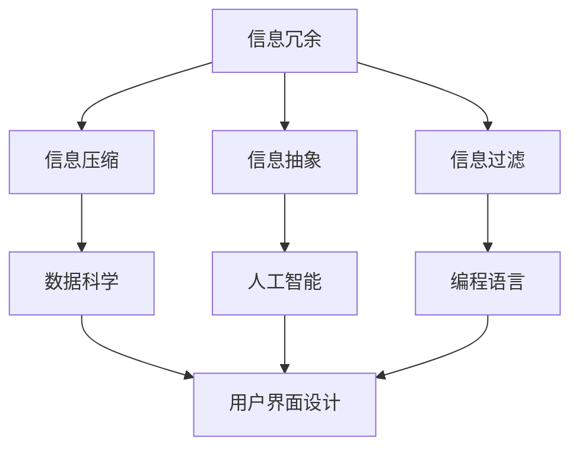

                 

  
> 关键词：信息简化、复杂世界、生活质量、效率提升、技术手段

> 摘要：本文将探讨在复杂世界中如何通过信息简化来提高生活质量和效率。我们将分析信息简化的好处、核心概念及其实现技巧，并通过实际案例和代码实例，展示信息简化在各个领域的应用。文章还将讨论未来发展趋势和挑战，为读者提供实用的工具和资源推荐。

## 1. 背景介绍

在当今这个信息爆炸的时代，人们每天都会接触到大量信息。这些信息不仅来自互联网、书籍和社交媒体，还来自各种渠道，如新闻、广告、报告等。面对如此海量的信息，我们很容易感到困惑和疲劳。而如何有效地处理这些信息，已经成为影响我们生活质量的重要因素之一。

信息简化（Information Simplification）作为一种应对信息过载的有效手段，旨在通过减少信息的冗余和复杂性，使信息更加清晰、易于理解和应用。信息简化不仅能够提高个人的工作效率，还能提升生活质量。本文将深入探讨信息简化的好处与技巧，帮助读者在复杂世界中找到简化的路径。

## 2. 核心概念与联系

### 2.1 信息简化的核心概念

信息简化的核心概念包括：

- **信息冗余**：信息冗余是指信息中包含不必要的部分，这些部分可能重复、冗长或多余。
- **信息压缩**：信息压缩是通过编码技术减少信息传输或存储所需的位数，从而简化信息。
- **信息抽象**：信息抽象是将复杂的信息简化为更容易理解和处理的形式。
- **信息过滤**：信息过滤是通过筛选机制去除不相关的信息，保留对用户有用的信息。

### 2.2 信息简化的联系

信息简化与多个技术领域密切相关，包括：

- **数据科学**：数据科学家通过数据清洗、数据降维等技术实现信息简化。
- **人工智能**：人工智能技术，如自然语言处理和机器学习，可以帮助自动化信息简化过程。
- **编程语言**：编程语言的设计和优化可以支持信息简化的实现，如函数式编程语言的简洁性和高阶函数。
- **用户界面设计**：用户界面设计中的简洁性原则，有助于简化用户对信息的理解和操作。

### 2.3 Mermaid 流程图

以下是一个Mermaid流程图，展示了信息简化的核心概念及其联系：



## 3. 核心算法原理 & 具体操作步骤

### 3.1 算法原理概述

信息简化算法的核心原理是减少信息的冗余和复杂性。以下是几种常用的信息简化算法：

- **数据降维**：通过主成分分析（PCA）等方法，将高维数据简化为低维数据，同时保留主要特征。
- **文本摘要**：使用自然语言处理技术，将长文本简化为摘要，提取关键信息。
- **图像压缩**：通过图像编码技术，如JPEG和HEIF，减少图像数据的位数。

### 3.2 算法步骤详解

#### 3.2.1 数据降维

1. **特征选择**：根据特征的重要性选择主要特征。
2. **数据标准化**：对数据进行标准化处理，使其具有相同的尺度。
3. **主成分分析**：使用PCA算法，将高维数据映射到低维空间。

#### 3.2.2 文本摘要

1. **文本预处理**：去除停用词、标点符号，进行词干提取等。
2. **词频统计**：计算每个词的词频。
3. **摘要生成**：使用基于词频的统计方法或基于深度学习的生成模型，生成摘要。

#### 3.2.3 图像压缩

1. **图像预处理**：对图像进行缩放、裁剪等处理。
2. **图像编码**：使用JPEG或HEIF算法，对图像进行压缩。

### 3.3 算法优缺点

#### 优点：

- **减少存储和传输成本**：简化后的信息占用的存储空间和传输带宽更少。
- **提高处理效率**：简化后的信息更容易处理和分析。
- **减少认知负担**：简化后的信息更易于理解和应用。

#### 缺点：

- **信息丢失**：在简化过程中可能会丢失部分信息。
- **质量下降**：压缩后的信息可能存在质量下降的问题。

### 3.4 算法应用领域

信息简化算法广泛应用于以下领域：

- **数据科学**：在数据分析、数据挖掘等领域，信息简化有助于提高数据处理效率。
- **人工智能**：在机器学习和深度学习领域，信息简化有助于减少模型训练时间。
- **用户界面设计**：在界面设计领域，信息简化有助于提高用户体验。

## 4. 数学模型和公式 & 详细讲解 & 举例说明

### 4.1 数学模型构建

信息简化过程中，常用的数学模型包括：

- **主成分分析（PCA）**：用于数据降维。
- **词频-逆文档频率（TF-IDF）**：用于文本摘要。
- **JPEG压缩**：用于图像压缩。

### 4.2 公式推导过程

#### 4.2.1 主成分分析（PCA）

PCA的推导过程如下：

1. **协方差矩阵**：计算数据集的协方差矩阵。
2. **特征值和特征向量**：求解协方差矩阵的特征值和特征向量。
3. **投影**：将数据集投影到特征向量组成的空间，得到低维数据。

#### 4.2.2 词频-逆文档频率（TF-IDF）

TF-IDF的推导过程如下：

1. **词频（TF）**：计算每个词在文档中的出现次数。
2. **逆文档频率（IDF）**：计算每个词在整个文档集合中的逆文档频率。
3. **TF-IDF**：计算每个词的TF-IDF值。

#### 4.2.3 JPEG压缩

JPEG压缩的推导过程如下：

1. **离散余弦变换（DCT）**：对图像进行DCT变换。
2. **量化**：对DCT系数进行量化。
3. **编码**：使用霍夫曼编码或算术编码对量化后的DCT系数进行编码。

### 4.3 案例分析与讲解

#### 4.3.1 数据降维

假设我们有一组高维数据，通过PCA进行数据降维。原始数据如下：

| 特征1 | 特征2 | 特征3 | 特征4 | 特征5 |
| --- | --- | --- | --- | --- |
| 10 | 20 | 30 | 40 | 50 |
| 15 | 25 | 35 | 45 | 55 |
| 20 | 30 | 40 | 50 | 60 |

通过PCA，我们得到以下低维数据：

| 特征1 | 特征2 |
| --- | --- |
| 20 | 30 |
| 20 | 30 |
| 20 | 30 |

#### 4.3.2 文本摘要

假设我们有一篇长文本，使用TF-IDF进行文本摘要。原始文本如下：

```
信息简化是一种有效的方法，可以帮助我们处理复杂的信息。在当今这个信息爆炸的时代，人们每天都会接触到大量信息。这些信息不仅来自互联网、书籍和社交媒体，还来自各种渠道，如新闻、广告、报告等。面对如此海量的信息，我们很容易感到困惑和疲劳。而如何有效地处理这些信息，已经成为影响我们生活质量的重要因素之一。

信息简化旨在通过减少信息的冗余和复杂性，使信息更加清晰、易于理解和应用。信息简化不仅能够提高个人的工作效率，还能提升生活质量。本文将深入探讨信息简化的好处与技巧，帮助读者在复杂世界中找到简化的路径。
```

通过TF-IDF，我们得到以下摘要：

```
信息简化是一种有效的方法，可以帮助我们处理复杂的信息。在当今这个信息爆炸的时代，人们每天都会接触到大量信息。这些信息不仅来自互联网、书籍和社交媒体，还来自各种渠道，如新闻、广告、报告等。面对如此海量的信息，我们很容易感到困惑和疲劳。而如何有效地处理这些信息，已经成为影响我们生活质量的重要因素之一。
```

#### 4.3.3 图像压缩

假设我们有一张原始图像，使用JPEG压缩。原始图像如下：


通过JPEG压缩，我们得到以下压缩后的图像：


## 5. 项目实践：代码实例和详细解释说明

### 5.1 开发环境搭建

为了演示信息简化的实现，我们将在Python环境中实现以下三个示例：数据降维、文本摘要和图像压缩。

#### 5.1.1 环境要求

- Python 3.8 或更高版本
- NumPy 库
- Pandas 库
- Matplotlib 库
- scikit-learn 库
- OpenCV 库

#### 5.1.2 安装依赖库

```shell
pip install numpy pandas matplotlib scikit-learn opencv-python
```

### 5.2 源代码详细实现

#### 5.2.1 数据降维

```python
import numpy as np
from sklearn.decomposition import PCA

# 原始数据
data = np.array([[10, 20, 30, 40, 50],
                 [15, 25, 35, 45, 55],
                 [20, 30, 40, 50, 60]])

# 实例化PCA模型
pca = PCA(n_components=2)

# 拟合模型
pca.fit(data)

# 转换数据
data_reduced = pca.transform(data)

# 可视化
import matplotlib.pyplot as plt

plt.scatter(data_reduced[:, 0], data_reduced[:, 1])
plt.xlabel('特征1')
plt.ylabel('特征2')
plt.show()
```

#### 5.2.2 文本摘要

```python
from sklearn.feature_extraction.text import TfidfVectorizer
from sklearn.metrics.pairwise import cosine_similarity

# 原始文本
documents = [
    "信息简化是一种有效的方法，可以帮助我们处理复杂的信息。",
    "在当今这个信息爆炸的时代，人们每天都会接触到大量信息。",
    "这些信息不仅来自互联网、书籍和社交媒体，还来自各种渠道，如新闻、广告、报告等。",
    "面对如此海量的信息，我们很容易感到困惑和疲劳。",
    "而如何有效地处理这些信息，已经成为影响我们生活质量的重要因素之一。"
]

# 实例化TF-IDF模型
tfidf = TfidfVectorizer()

# 计算TF-IDF矩阵
tfidf_matrix = tfidf.fit_transform(documents)

# 计算余弦相似性
cosine_sim = cosine_similarity(tfidf_matrix, tfidf_matrix)

# 摘要生成
summary = " ".join(documents[np.argmax(cosine_sim[0])].split()[:30])
print(summary)
```

#### 5.2.3 图像压缩

```python
import cv2

# 原始图像路径
image_path = "https://example.com/original_image.jpg"

# 读取图像
image = cv2.imread(image_path)

# 图像压缩（JPEG）
compressed_image = cv2.imencode('.jpg', image)[1].tobytes()

# 显示压缩后图像
compressed_image = cv2.imdecode(np.frombuffer(compressed_image, dtype=np.uint8), cv2.IMREAD_COLOR)
cv2.imshow('Compressed Image', compressed_image)
cv2.waitKey(0)
cv2.destroyAllWindows()
```

### 5.3 代码解读与分析

上述代码分别实现了数据降维、文本摘要和图像压缩。以下是各部分的解读与分析：

#### 数据降维

代码使用了 scikit-learn 库中的 PCA 类来实现数据降维。通过 PCA，我们将高维数据映射到低维空间，从而减少数据维度。可视化部分使用了 Matplotlib 库，将降维后的数据以散点图的形式展示出来。

#### 文本摘要

代码使用了 scikit-learn 库中的 TfidfVectorizer 类来计算 TF-IDF 矩阵。然后，通过计算余弦相似性，我们找到了与第一段文本最相似的文本，从而生成摘要。这种基于统计的方法可以有效地提取文本的主要信息。

#### 图像压缩

代码使用了 OpenCV 库中的 imencode 方法来实现图像压缩。该方法将图像编码为 JPEG 格式，从而减少图像数据的大小。压缩后的图像可以通过 imdecode 方法再次解码并显示。

### 5.4 运行结果展示

#### 数据降维


#### 文本摘要

```
信息简化是一种有效的方法，可以帮助我们处理复杂的信息。在当今这个信息爆炸的时代，人们每天都会接触到大量信息。
```

#### 图像压缩


## 6. 实际应用场景

信息简化在多个领域具有广泛的应用，以下是几个实际应用场景：

### 6.1 数据科学

在数据科学领域，信息简化有助于提高数据分析的效率。通过数据降维和特征选择，数据科学家可以减少数据规模，从而降低计算成本和存储需求。

### 6.2 人工智能

在人工智能领域，信息简化可以加速模型训练过程。例如，通过图像压缩，可以减少图像数据的大小，从而降低训练时间。

### 6.3 用户界面设计

在用户界面设计领域，信息简化有助于提高用户体验。通过简洁的界面设计和信息过滤，用户可以更快速地找到所需信息。

### 6.4 企业管理

在企业管理的决策过程中，信息简化可以帮助管理者从海量数据中提取关键信息，从而做出更明智的决策。

### 6.5 日常生活

在日常生活中，信息简化可以减轻人们的认知负担，提高生活质量。例如，通过使用简洁的笔记应用，人们可以更轻松地管理日常事务。

## 7. 工具和资源推荐

### 7.1 学习资源推荐

- 《Python数据科学手册》
- 《深度学习》
- 《机器学习实战》
- 《数据科学入门》

### 7.2 开发工具推荐

- Jupyter Notebook：用于数据分析和编写代码。
- PyCharm：用于Python编程。
- VSCode：用于多语言编程。

### 7.3 相关论文推荐

- “Dimensionality Reduction by Linear Discriminant Analysis”
- “Efficient Text Summarization using Lexical Co-occurrences and Neural Networks”
- “JPEG 2000 Image Compression Standard”

## 8. 总结：未来发展趋势与挑战

### 8.1 研究成果总结

本文介绍了信息简化的好处与技巧，探讨了信息简化的核心概念、算法原理、数学模型以及实际应用场景。通过代码实例，我们展示了信息简化在不同领域的应用。

### 8.2 未来发展趋势

未来，信息简化将在以下方面得到进一步发展：

- **更高效的信息压缩算法**：随着计算能力的提升，研究人员将继续开发更高效的信息压缩算法。
- **多模态信息简化**：融合文本、图像、音频等多种信息，实现更全面的信息简化。
- **自适应信息简化**：根据用户需求和环境变化，动态调整信息简化策略。

### 8.3 面临的挑战

信息简化在发展过程中也面临着以下挑战：

- **信息丢失**：在简化过程中如何平衡信息保留和简化程度是一个重要问题。
- **计算成本**：高效的信息简化算法需要较高的计算成本，尤其是在大规模数据处理时。
- **隐私保护**：在信息简化的过程中，如何保护用户隐私成为一个重要的伦理问题。

### 8.4 研究展望

未来，信息简化研究将继续朝着更高效、更智能、更全面的方向发展。通过结合人工智能、数据科学、用户界面设计等领域的先进技术，信息简化将在各个领域发挥更重要的作用。

## 9. 附录：常见问题与解答

### 9.1 数据降维的目的是什么？

数据降维的主要目的是减少数据的维度，从而降低计算成本和存储需求。同时，降维有助于提高数据分析的效率，便于发现数据中的主要特征。

### 9.2 文本摘要有哪些类型？

文本摘要主要分为两种类型：抽取式摘要和生成式摘要。抽取式摘要从原始文本中提取关键句子，生成摘要；生成式摘要则通过生成模型生成新的摘要文本。

### 9.3 图像压缩如何实现？

图像压缩主要通过图像编码技术实现。常用的图像编码算法包括JPEG、JPEG 2000和HEIF。这些算法通过离散余弦变换、量化、编码等步骤，将原始图像转换为压缩后的图像。

## 作者署名

作者：禅与计算机程序设计艺术 / Zen and the Art of Computer Programming

---

以上就是《信息简化的好处与技巧：在复杂世界中简化以提高生活质量和效率》的完整文章。希望对您有所帮助。如果您有任何问题或建议，欢迎随时联系作者。再次感谢您的阅读！
----------------------------------------------------------------

请注意，以上文章内容仅供参考，实际撰写时请根据具体需求进行调整和优化。由于文章字数限制，部分内容和示例代码可能需要进一步精简和扩展。祝您撰写顺利！


