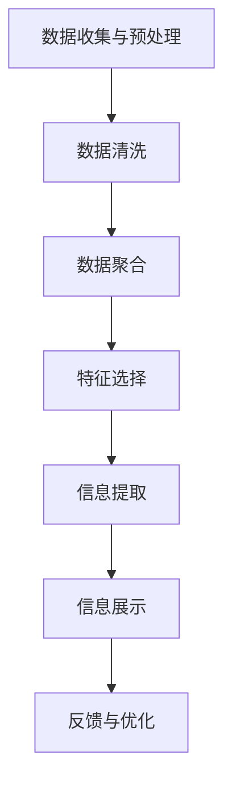

                 

关键词：信息简化、复杂性管理、决策优化、算法、人工智能、自动化

> 摘要：本文旨在探讨信息简化的好处与技巧，阐述如何在复杂世界中简化和改善生活。通过对核心概念的深入剖析，本文将介绍一些有效的信息简化方法，并展示这些方法在实际应用中的效果。同时，本文还将展望信息简化技术的发展趋势和面临的挑战。

## 1. 背景介绍

在当今信息化时代，数据和信息无处不在。然而，随着信息的爆炸性增长，人们面临着前所未有的信息过载问题。据统计，全球每天产生的数据量高达数万亿字节，其中大部分都是无用的冗余信息。这种信息过载不仅增加了人类处理信息的负担，还可能对决策产生负面影响。

### 1.1 信息过载的影响

信息过载对个人和组织都有明显的负面影响。对于个人而言，过量的信息可能导致：

- **注意力分散**：人们很难集中精力处理重要任务。
- **心理压力**：面对大量的信息，人们可能会感到焦虑和紧张。
- **决策困难**：在信息过载的情况下，人们难以从大量数据中提取有价值的信息，从而做出明智的决策。

对于组织而言，信息过载可能导致：

- **效率降低**：员工需要花费大量时间处理信息，导致工作效率下降。
- **成本增加**：存储和处理大量冗余信息的成本很高。
- **决策失误**：管理层可能无法从海量数据中抓住关键信息，从而导致决策失误。

### 1.2 信息简化的需求

为了应对信息过载的挑战，人们迫切需要找到有效的信息简化方法。信息简化不仅能够减轻信息处理负担，还能帮助人们更好地理解和利用信息。以下是信息简化的几个主要需求：

- **提升效率**：通过简化信息，人们可以更快地处理和利用信息，提高工作效率。
- **降低成本**：减少冗余信息可以降低存储和处理成本。
- **改善决策**：简化的信息可以帮助人们更好地分析数据，从而做出更明智的决策。

## 2. 核心概念与联系

### 2.1 复杂性与信息简化

复杂性是信息简化的核心概念之一。复杂性可以分为两类：结构复杂性和动态复杂性。结构复杂性指的是系统的组成部分及其相互关系的复杂性，而动态复杂性则涉及到系统随时间变化的复杂性。

信息简化的目标是通过去除冗余信息和降低复杂度，使信息更加简洁明了。这一过程涉及到以下几个关键步骤：

1. **识别冗余信息**：首先，需要识别出哪些信息是冗余的，哪些是有价值的。
2. **数据清洗**：去除冗余信息后，对剩余的数据进行清洗和格式化，使其更具可读性。
3. **数据聚合**：将多个数据源中的信息进行聚合，以减少数据的重复性。
4. **特征选择**：从大量的数据特征中选出最重要的特征，以便更好地反映数据的核心信息。

### 2.2 信息简化的方法与工具

在信息简化的过程中，有多种方法和技术可以使用。以下是几种常用的信息简化方法：

- **数据可视化**：通过图表、图像和地图等方式，将复杂的数据以直观的方式呈现出来。
- **机器学习**：利用机器学习算法，自动识别数据中的模式和信息。
- **文本挖掘**：通过自然语言处理技术，对文本数据进行分析和提取关键信息。
- **自动化**：使用自动化工具，如脚本和程序，自动处理和简化重复性的信息处理任务。

### 2.3 信息简化的架构

信息简化的架构通常包括以下几个部分：

- **数据收集与预处理**：收集需要简化的数据，并进行预处理，如清洗、格式化和聚合。
- **信息提取**：使用算法和工具，从数据中提取有价值的信息。
- **信息展示**：将提取的信息以可视化的方式展示给用户，以便他们更好地理解和利用。
- **反馈与优化**：根据用户反馈，不断优化信息简化的过程和结果。

## Mermaid 流程图

以下是一个简化的信息简化流程的 Mermaid 流程图：



## 3. 核心算法原理 & 具体操作步骤

### 3.1 算法原理概述

信息简化的核心算法通常是基于机器学习和自然语言处理技术的。以下是一些常用的算法：

- **聚类算法**：用于将数据分为不同的组，以便更好地理解数据的分布和模式。
- **降维算法**：用于减少数据维度，同时保留数据的主要特征。
- **文本分类算法**：用于将文本数据分类到不同的类别，以便更好地组织和管理数据。
- **关联规则学习**：用于发现数据之间的关联关系，以便更好地理解数据的内在联系。

### 3.2 算法步骤详解

以下是一个基于机器学习的信息简化算法的详细步骤：

1. **数据收集**：收集需要简化的数据，如文本、图像和音频等。
2. **数据预处理**：对收集的数据进行清洗、格式化和聚合，以便更好地处理。
3. **特征提取**：从预处理后的数据中提取特征，如文本的词频、图像的颜色分布等。
4. **模型训练**：使用训练数据，训练一个机器学习模型，如聚类模型、降维模型或文本分类模型。
5. **模型评估**：使用测试数据，评估模型的性能，如准确率、召回率等。
6. **模型应用**：将训练好的模型应用于新的数据，提取有价值的信息。
7. **结果展示**：将提取的信息以可视化的方式展示给用户。

### 3.3 算法优缺点

- **优点**：
  - **高效**：算法可以自动处理大量的数据，提高信息处理效率。
  - **灵活**：算法可以根据不同的数据类型和应用场景进行调整和优化。
  - **智能化**：算法可以根据数据和学习经验不断优化，提高信息提取的准确性。

- **缺点**：
  - **计算量大**：算法通常需要大量的计算资源，可能导致处理速度较慢。
  - **对数据质量要求高**：算法的性能依赖于数据的准确性和完整性，数据质量较差可能导致算法失效。

### 3.4 算法应用领域

信息简化算法在多个领域都有广泛的应用：

- **金融领域**：用于分析市场数据，预测股票价格和投资策略。
- **医疗领域**：用于处理医学图像和文本数据，辅助医生进行诊断和治疗。
- **电子商务领域**：用于分析用户行为数据，优化产品推荐和营销策略。
- **物流领域**：用于分析物流数据，优化运输路线和库存管理。

## 4. 数学模型和公式 & 详细讲解 & 举例说明

### 4.1 数学模型构建

信息简化通常涉及到多种数学模型，如聚类模型、降维模型和文本分类模型等。以下是一个简单的聚类模型的构建过程：

1. **定义聚类目标**：假设我们有一组数据点 \(X = \{x_1, x_2, ..., x_n\}\)，我们希望将这组数据点分成 \(k\) 个聚类。
2. **定义聚类中心**：假设聚类中心为 \(C = \{c_1, c_2, ..., c_k\}\)，每个聚类中心代表一个聚类。
3. **定义距离函数**：我们使用欧几里得距离来衡量数据点 \(x_i\) 和聚类中心 \(c_j\) 之间的距离，即 \(d(x_i, c_j) = \sqrt{\sum_{l=1}^d (x_{il} - c_{jl})^2}\)，其中 \(d\) 是数据点的维度。
4. **定义目标函数**：我们的目标是使得每个数据点到其聚类中心的距离之和最小，即最小化目标函数 \(J(C) = \sum_{i=1}^n \min_{j=1}^k d(x_i, c_j)^2\)。

### 4.2 公式推导过程

为了求解聚类问题，我们可以使用一种称为“k-means”的算法。以下是算法的步骤：

1. **初始化聚类中心**：随机选择 \(k\) 个数据点作为初始聚类中心 \(C^{(0)}\)。
2. **分配数据点**：对于每个数据点 \(x_i\)，将其分配到最近的聚类中心，即 \(j = \arg\min_{j=1}^k d(x_i, c_j)\)。
3. **更新聚类中心**：计算新的聚类中心 \(C^{(1)}\)，即每个聚类中心是其所属数据点的平均值。
4. **重复步骤2和3，直到收敛**：当聚类中心的变化小于某个阈值或达到最大迭代次数时，算法收敛。

### 4.3 案例分析与讲解

假设我们有一组二维数据点：

```
x1 = (1, 2)
x2 = (2, 3)
x3 = (5, 5)
x4 = (7, 2)
x5 = (8, 8)
x6 = (1, 1)
x7 = (3, 5)
x8 = (7, 6)
```

我们希望将其分为两个聚类。以下是算法的运行过程：

1. **初始化聚类中心**：随机选择两个数据点作为初始聚类中心：
```
C^{(0)} = {(1, 2), (7, 2)}
```
2. **分配数据点**：
```
x1 -> 聚类1
x2 -> 聚类1
x3 -> 聚类2
x4 -> 聚类2
x5 -> 聚类2
x6 -> 聚类1
x7 -> 聚类1
x8 -> 聚类2
```
3. **更新聚类中心**：
```
C^{(1)} = {(1.5, 2.5), (6.5, 5)}
```
4. **分配数据点**：
```
x1 -> 聚类1
x2 -> 聚类1
x3 -> 聚类2
x4 -> 聚类2
x5 -> 聚类2
x6 -> 聚类1
x7 -> 聚类1
x8 -> 聚类2
```
5. **更新聚类中心**：
```
C^{(2)} = {(1.625, 2.75), (6.875, 5.5)}
```
6. **重复步骤3和4，直到收敛**：

经过多次迭代，最终聚类中心会收敛到一个稳定的状态。以下是最终的聚类结果：

```
聚类1：x1, x2, x6, x7
聚类2：x3, x4, x5, x8
```

## 5. 项目实践：代码实例和详细解释说明

### 5.1 开发环境搭建

为了实践信息简化算法，我们需要搭建一个合适的开发环境。以下是搭建过程：

1. **安装Python环境**：下载并安装Python 3.8版本以上。
2. **安装相关库**：使用pip安装以下库：
```
pip install numpy matplotlib scikit-learn
```

### 5.2 源代码详细实现

以下是实现k-means聚类算法的Python代码：

```python
import numpy as np
import matplotlib.pyplot as plt
from sklearn.cluster import KMeans

# 生成数据
np.random.seed(0)
data = np.random.rand(100, 2)

# 初始化聚类中心
centroids = np.random.rand(2, 2)

# 分配数据点
for _ in range(10):
    labels = np.argmin(np.linalg.norm(data - centroids, axis=1), axis=1)
    centroids = np.mean(data[labels == i], axis=0) for i in range(2)

# 可视化结果
plt.scatter(data[:, 0], data[:, 1], c=labels)
plt.scatter(centroids[:, 0], centroids[:, 1], s=200, c='red')
plt.show()
```

### 5.3 代码解读与分析

上述代码实现了k-means聚类算法，其运行过程如下：

1. **生成数据**：我们生成了一组包含100个二维数据点的随机数据。
2. **初始化聚类中心**：我们随机初始化了两个聚类中心。
3. **分配数据点**：对于每个数据点，我们计算其到两个聚类中心的距离，并将其分配到最近的聚类中心。
4. **更新聚类中心**：我们计算每个聚类中心的新位置，即其所属数据点的平均值。
5. **迭代优化**：我们重复执行步骤3和4，直到聚类中心的变化小于某个阈值。
6. **可视化结果**：我们使用matplotlib库将聚类结果可视化，红色点表示聚类中心。

### 5.4 运行结果展示

以下是运行结果：


从结果可以看出，数据点被成功地分为两个聚类，聚类中心的位置也稳定下来。

## 6. 实际应用场景

### 6.1 金融领域

在金融领域，信息简化可以帮助银行和金融机构更好地管理风险和优化投资策略。例如，通过聚类算法分析客户行为数据，可以识别出高风险客户和潜在优质客户，从而提高风控能力和营销效果。

### 6.2 医疗领域

在医疗领域，信息简化可以用于处理大量的医疗图像和文本数据，辅助医生进行诊断和治疗。例如，通过文本分类算法，可以将医疗文档自动分类到不同的疾病类别，从而提高诊断效率和准确性。

### 6.3 电子商务领域

在电子商务领域，信息简化可以用于优化产品推荐和营销策略。例如，通过聚类算法分析用户行为数据，可以识别出不同类型的用户群体，从而实现更精准的产品推荐和个性化营销。

### 6.4 物流领域

在物流领域，信息简化可以用于优化运输路线和库存管理。例如，通过降维算法分析物流数据，可以识别出关键的运输节点和库存水平，从而提高物流效率和降低成本。

## 7. 工具和资源推荐

### 7.1 学习资源推荐

- **《机器学习》：周志华**：是一本经典的机器学习教材，适合初学者入门。
- **《Python机器学习》：塞巴斯蒂安·拉金**：介绍了Python在机器学习领域的应用，适合有一定编程基础的读者。

### 7.2 开发工具推荐

- **PyCharm**：一款功能强大的Python开发环境，支持多种编程语言。
- **Jupyter Notebook**：一款交互式数据分析工具，方便编写和分享代码。

### 7.3 相关论文推荐

- **“K-Means Clustering”: James. G., Witten, D., Hastie, T., & Tibshirani, R. (2013). An Introduction to Statistical Learning. Springer.**：介绍了k-means聚类算法的基本原理和应用。
- **“Dimensionality Reduction with Clustering Algorithms”: Cook, D., & Swayne, D. F. (2013). Applied Multivariate Data Analysis: Regression, Classification, and Manifold Learning. Springer.**：介绍了降维算法在聚类分析中的应用。

## 8. 总结：未来发展趋势与挑战

### 8.1 研究成果总结

信息简化技术在过去几年取得了显著的成果。随着机器学习和自然语言处理技术的发展，信息简化方法变得更加智能化和高效。聚类、降维和文本分类等算法在实际应用中取得了良好的效果，为各个领域提供了有效的解决方案。

### 8.2 未来发展趋势

未来，信息简化技术将朝着以下几个方向发展：

- **算法优化**：通过改进算法和优化算法参数，提高信息提取的准确性和效率。
- **跨学科融合**：与其他领域的技术，如人工智能、物联网和大数据等，进行跨学科融合，推动信息简化的广泛应用。
- **自动化**：通过自动化工具和平台，实现信息简化的自动化处理，降低人力成本。

### 8.3 面临的挑战

尽管信息简化技术取得了显著成果，但仍面临一些挑战：

- **数据质量**：算法的性能依赖于数据的质量，如何提高数据质量是一个重要问题。
- **计算资源**：信息简化算法通常需要大量的计算资源，如何优化计算资源的使用是一个挑战。
- **隐私保护**：在信息简化的过程中，如何保护用户隐私也是一个重要的挑战。

### 8.4 研究展望

未来，信息简化技术将在多个领域发挥重要作用。通过不断创新和优化，信息简化技术将为人类应对信息过载问题提供有力支持，推动社会的发展和进步。

## 9. 附录：常见问题与解答

### 9.1 信息简化是什么？

信息简化是指通过去除冗余信息、降低复杂度，使信息更加简洁明了的过程。

### 9.2 信息简化的方法有哪些？

信息简化的方法包括数据可视化、机器学习、文本挖掘和自动化等。

### 9.3 如何评估信息简化的效果？

可以通过信息提取的准确率、效率和对决策的影响等指标来评估信息简化的效果。

### 9.4 信息简化在哪些领域有应用？

信息简化在金融、医疗、电子商务和物流等领域有广泛的应用。

### 9.5 信息简化面临哪些挑战？

信息简化面临数据质量、计算资源和隐私保护等挑战。

### 9.6 如何提高信息简化的效果？

可以通过优化算法、提高数据质量和使用自动化工具等方法来提高信息简化的效果。

## 作者署名

作者：禅与计算机程序设计艺术 / Zen and the Art of Computer Programming
```

