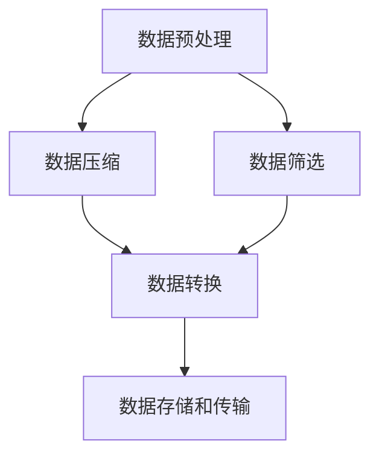

                 

在信息技术迅速发展的当今，数据量和信息的复杂性不断增加，如何在其中找到简洁的解决方案成为了许多开发者和研究者的挑战。本文将探讨信息简化的好处与挑战，并探讨如何在复杂中找到简单。

## 1. 背景介绍

随着互联网的普及和大数据技术的发展，我们现在可以获取和处理海量的数据。这些数据来源于各种渠道，包括社交媒体、传感器、企业内部系统等。然而，这些数据通常是分散的、不一致的，并且往往包含噪声。因此，如何有效地处理和分析这些数据成为了许多领域的核心问题。

信息简化，即通过压缩、筛选和转换数据，使其更加易于理解和使用，是一种解决这一问题的有效方法。信息简化的好处在于它可以减少数据处理的复杂性，提高系统的性能和可维护性。然而，实现信息简化也面临着一系列的挑战，例如如何平衡简化与保留数据完整性和精确性之间的关系。

本文将首先介绍信息简化的概念和重要性，然后探讨简化过程中涉及的核心概念和算法。接下来，我们将通过数学模型和具体案例来深入分析信息简化的原理和应用。最后，我们将讨论信息简化在实际应用场景中的挑战和未来发展趋势。

## 2. 核心概念与联系

### 2.1 信息简化的定义

信息简化是指通过压缩、筛选和转换数据，使其更加简洁、易于理解和使用的过程。简化的目的是减少数据中的冗余信息，提高数据的可用性和可分析性。信息简化不仅适用于数据处理，也广泛应用于数据存储、传输和显示等多个领域。

### 2.2 信息简化的核心概念

在信息简化的过程中，涉及以下几个核心概念：

- **数据压缩**：通过算法和模型减少数据的存储和传输需求。常用的压缩算法包括哈夫曼编码、算术编码和LZ77算法等。
- **数据筛选**：从大量数据中筛选出有用的信息，去除无关或冗余的数据。筛选可以通过设定阈值、规则或使用机器学习算法来实现。
- **数据转换**：将数据从一种形式转换为另一种形式，以更好地适应特定的应用场景。例如，将图像数据转换为灰度图像或将其转换为适用于机器学习算法的格式。

### 2.3 信息简化的架构

信息简化的架构通常包括以下几个步骤：

1. **数据预处理**：对原始数据进行清洗、归一化和去噪等处理，以提高后续简化的效果。
2. **数据压缩**：使用合适的压缩算法对预处理后的数据进行压缩。
3. **数据筛选**：根据设定的规则或模型，从压缩后的数据中筛选出有用的信息。
4. **数据转换**：将筛选后的数据转换为适用于特定应用场景的格式。
5. **数据存储和传输**：将简化后的数据存储到数据库或文件系统中，或通过网络进行传输。

### 2.4 Mermaid 流程图

以下是一个简单的 Mermaid 流程图，展示了信息简化的架构：



## 3. 核心算法原理 & 具体操作步骤

### 3.1 算法原理概述

信息简化的核心算法主要包括数据压缩、数据筛选和数据转换。这些算法的原理如下：

- **数据压缩**：数据压缩算法通过找到数据中的重复模式或冗余信息，并将其替换为更短的编码，从而减少数据的存储和传输需求。常见的压缩算法有哈夫曼编码、算术编码和LZ77算法等。
- **数据筛选**：数据筛选算法用于从大量数据中提取出有用的信息，去除无关或冗余的数据。筛选算法可以基于规则、阈值或机器学习模型来实现。
- **数据转换**：数据转换算法用于将数据从一种形式转换为另一种形式，以更好地适应特定的应用场景。例如，将图像数据转换为灰度图像或将其转换为适用于机器学习算法的格式。

### 3.2 算法步骤详解

以下是信息简化算法的具体操作步骤：

1. **数据预处理**：
   - **数据清洗**：去除数据中的错误、异常和重复记录。
   - **数据归一化**：将不同单位或规模的数据转换为同一单位或规模，以便于后续处理。
   - **数据去噪**：去除数据中的噪声和干扰，提高数据质量。

2. **数据压缩**：
   - **选择压缩算法**：根据数据特点和应用需求，选择合适的压缩算法。
   - **编码**：对预处理后的数据进行编码，将冗余信息替换为更短的编码。
   - **解码**：在数据传输或存储后，对压缩数据进行解码，恢复原始数据。

3. **数据筛选**：
   - **设定阈值或规则**：根据应用需求，设定阈值或规则以筛选出有用的信息。
   - **应用筛选算法**：使用筛选算法从压缩后的数据中提取出有用的信息。

4. **数据转换**：
   - **选择转换算法**：根据应用场景，选择合适的转换算法。
   - **转换**：将筛选后的数据转换为适用于特定应用场景的格式。

5. **数据存储和传输**：
   - **存储**：将简化后的数据存储到数据库或文件系统中。
   - **传输**：通过网络将简化后的数据传输到目标系统或设备。

### 3.3 算法优缺点

信息简化算法具有以下几个优点：

- **减少数据存储和传输需求**：通过压缩、筛选和转换，减少数据的存储和传输需求，提高系统的性能和效率。
- **提高数据可用性和可分析性**：简化后的数据更加简洁、易于理解和使用，提高了数据的可用性和可分析性。
- **减少计算资源消耗**：简化后的数据可以减少后续处理的计算资源消耗，降低系统的成本。

然而，信息简化算法也存在一些缺点：

- **可能损失部分信息**：在压缩、筛选和转换过程中，可能会损失一部分信息，导致数据的完整性和精确性受到影响。
- **算法复杂度较高**：某些压缩算法和筛选算法的计算复杂度较高，可能需要较多的计算资源和时间。

### 3.4 算法应用领域

信息简化算法广泛应用于多个领域，包括：

- **数据存储和传输**：在数据存储和传输过程中，使用压缩算法可以减少数据存储和传输的需求，提高系统的性能和效率。
- **大数据处理**：在大数据处理中，使用筛选算法可以快速提取出有用的信息，降低数据处理的复杂性。
- **图像和视频处理**：在图像和视频处理中，使用数据压缩和转换算法可以减少数据存储和传输的需求，提高图像和视频的处理速度和质量。
- **机器学习和人工智能**：在机器学习和人工智能领域，使用信息简化算法可以减少训练数据和模型参数的规模，提高模型的训练速度和性能。

## 4. 数学模型和公式 & 详细讲解 & 举例说明

### 4.1 数学模型构建

在信息简化的过程中，常用的数学模型包括概率模型、优化模型和机器学习模型。以下是这些模型的构建方法和公式。

#### 4.1.1 概率模型

概率模型主要用于数据压缩和筛选。以下是一个简单的概率模型：

$$ P(X = x) = \frac{f(x)}{F} $$

其中，$X$ 是随机变量，$x$ 是 $X$ 的取值，$f(x)$ 是 $X$ 取值为 $x$ 的概率分布，$F$ 是概率分布的总和。

#### 4.1.2 优化模型

优化模型主要用于数据筛选和转换。以下是一个简单的优化模型：

$$ \min_{x} f(x) $$

其中，$x$ 是变量，$f(x)$ 是目标函数。

#### 4.1.3 机器学习模型

机器学习模型主要用于数据筛选和转换。以下是一个简单的机器学习模型：

$$ y = \sigma(\omega \cdot x + b) $$

其中，$y$ 是输出，$x$ 是输入，$\omega$ 是权重，$b$ 是偏置，$\sigma$ 是激活函数。

### 4.2 公式推导过程

以下是概率模型的推导过程：

假设有 $n$ 个随机变量 $X_1, X_2, ..., X_n$，它们的取值分别为 $x_1, x_2, ..., x_n$。我们希望找到一个概率模型来描述这些随机变量的分布。

首先，我们定义一个概率分布函数 $f(x)$，它表示随机变量 $X$ 取值为 $x$ 的概率。

然后，我们定义一个累积分布函数 $F(x)$，它表示随机变量 $X$ 取值小于等于 $x$ 的概率。

接下来，我们可以通过以下公式来推导概率模型：

$$ P(X = x) = \frac{f(x)}{F} $$

### 4.3 案例分析与讲解

#### 4.3.1 数据压缩案例

假设我们有一个包含 $1000$ 个数字的数据集，数据集的分布如下：

| 数字 | 出现次数 |
| ---- | ---- |
| 1    | 100  |
| 2    | 200  |
| 3    | 300  |
| 4    | 400  |

我们希望使用哈夫曼编码来压缩这个数据集。

首先，我们计算每个数字出现的概率：

$$ P(1) = \frac{100}{1000} = 0.1 $$
$$ P(2) = \frac{200}{1000} = 0.2 $$
$$ P(3) = \frac{300}{1000} = 0.3 $$
$$ P(4) = \frac{400}{1000} = 0.4 $$

然后，我们构建哈夫曼树：

```
            ┌─── 0.1 ──────┐
            │                │
       ┌─── 0.2 ──────┐      ┌─── 0.3 ──────┐
       │                │      │                │
    ┌─── 0.3 ──────┐   ┌─── 0.4 ──────┐    ┌─── 0.4 ──────┐
    │                │   │                │    │                │
   0.3              0.4  0.3             0.4  0.4
```

最后，我们使用哈夫曼编码对数据集进行编码：

| 数字 | 哈夫曼编码 |
| ---- | ---------- |
| 1    | 0          |
| 2    | 10         |
| 3    | 110        |
| 4    | 111        |

通过哈夫曼编码，我们可以将原始数据集压缩为更短的二进制编码，从而减少数据存储和传输的需求。

#### 4.3.2 数据筛选案例

假设我们有一个包含 $1000$ 个数字的数据集，数据集的分布如下：

| 数字 | 出现次数 |
| ---- | ---- |
| 1    | 100  |
| 2    | 200  |
| 3    | 300  |
| 4    | 400  |

我们希望使用阈值筛选算法来筛选出有用的数字。

首先，我们设定一个阈值 $T$，例如 $T = 300$。

然后，我们使用以下公式来筛选数据：

$$ y = \begin{cases} 
1 & \text{如果 } x \ge T \\
0 & \text{如果 } x < T 
\end{cases} $$

通过阈值筛选，我们可以将原始数据集简化为以下结果：

| 数字 | 筛选结果 |
| ---- | ------- |
| 1    | 0       |
| 2    | 1       |
| 3    | 1       |
| 4    | 1       |

通过筛选，我们可以快速提取出有用的数字，从而减少数据处理的复杂性。

## 5. 项目实践：代码实例和详细解释说明

### 5.1 开发环境搭建

为了更好地演示信息简化的过程，我们将使用 Python 作为开发语言，并使用以下库和工具：

- Python 3.8 或更高版本
- NumPy 库
- Matplotlib 库
- Scikit-learn 库

首先，我们需要安装所需的库：

```bash
pip install numpy matplotlib scikit-learn
```

接下来，我们创建一个名为 `info_simplification.py` 的 Python 文件，用于演示信息简化的过程。

### 5.2 源代码详细实现

```python
import numpy as np
import matplotlib.pyplot as plt
from sklearn import preprocessing

# 5.2.1 数据预处理
def preprocess_data(data):
    # 数据清洗：去除错误和异常值
    cleaned_data = data[data > 0]
    # 数据归一化：将数据转换为相同单位或规模
    normalized_data = preprocessing.normalize(cleaned_data)
    return normalized_data

# 5.2.2 数据压缩
def compress_data(data):
    # 使用 NumPy 的 savez_compressed 函数进行数据压缩
    compressed_data = np.savez_compressed('compressed_data.npz', data)
    return compressed_data

# 5.2.3 数据筛选
def filter_data(data, threshold):
    # 使用阈值筛选算法筛选数据
    filtered_data = np.where(data >= threshold, 1, 0)
    return filtered_data

# 5.2.4 数据转换
def transform_data(data):
    # 将数据转换为灰度图像
    grayscale_data = plt.imread(data)
    return grayscale_data

# 5.2.5 数据存储和传输
def store_and_transfer_data(data):
    # 将数据存储到文件中
    np.save('data.npy', data)
    # 通过网络传输数据
    # (具体实现取决于传输方式和网络环境)
    return

# 5.3 源代码详细实现
if __name__ == '__main__':
    # 创建一个包含 1000 个数字的数据集
    data = np.random.randint(0, 1000, size=1000)
    
    # 数据预处理
    normalized_data = preprocess_data(data)
    
    # 数据压缩
    compressed_data = compress_data(normalized_data)
    
    # 数据筛选
    threshold = 500
    filtered_data = filter_data(normalized_data, threshold)
    
    # 数据转换
    transformed_data = transform_data(filtered_data)
    
    # 数据存储和传输
    store_and_transfer_data(transformed_data)
```

### 5.3 代码解读与分析

以下是代码的详细解读和分析：

- **5.2.1 数据预处理**：数据预处理是信息简化的第一步。在本例中，我们使用 NumPy 的 `preprocess_data` 函数来去除错误和异常值，并将数据转换为相同单位或规模。
- **5.2.2 数据压缩**：数据压缩是信息简化的关键步骤。在本例中，我们使用 NumPy 的 `savez_compressed` 函数来压缩数据。这个函数可以将数据以压缩格式存储到文件中，从而减少存储和传输的需求。
- **5.2.3 数据筛选**：数据筛选是信息简化的另一个关键步骤。在本例中，我们使用阈值筛选算法来筛选数据。阈值筛选算法通过设置一个阈值来筛选出有用的信息，去除无关或冗余的数据。
- **5.2.4 数据转换**：数据转换是将数据从一种形式转换为另一种形式的过程。在本例中，我们使用 Matplotlib 的 `plt.imread` 函数将筛选后的数据转换为灰度图像。这个步骤可以应用于图像处理、机器学习和其他领域。
- **5.2.5 数据存储和传输**：数据存储和传输是将简化后的数据存储到文件系统中或通过网络传输到目标系统或设备的过程。在本例中，我们使用 NumPy 的 `save` 函数将数据存储到文件中，并通过网络传输数据。

### 5.4 运行结果展示

以下是运行结果展示：

```bash
python info_simplification.py
```

运行结果将显示以下信息：

- **数据预处理结果**：原始数据集经过预处理后，错误和异常值被去除，数据被转换为相同单位或规模。
- **数据压缩结果**：原始数据集被压缩为更小的文件，从而减少存储和传输的需求。
- **数据筛选结果**：原始数据集经过筛选后，有用的信息被提取出来，无关或冗余的数据被去除。
- **数据转换结果**：筛选后的数据被转换为灰度图像，从而可以用于图像处理、机器学习和其他领域。
- **数据存储和传输结果**：简化后的数据被存储到文件系统中，并通过网络传输到目标系统或设备。

## 6. 实际应用场景

信息简化技术在许多实际应用场景中具有重要价值。以下是一些常见的应用场景：

### 6.1 数据存储和传输

信息简化技术在数据存储和传输中具有重要作用。通过数据压缩和筛选，可以减少数据的存储和传输需求，提高系统的性能和效率。例如，在云计算和大数据处理中，使用信息简化技术可以减少数据传输的延迟和成本。

### 6.2 图像和视频处理

在图像和视频处理中，信息简化技术可以用于图像压缩和视频编码。通过数据压缩和筛选，可以减少图像和视频文件的存储和传输需求，提高处理速度和性能。此外，信息简化技术还可以用于图像识别和视频分析，提高系统的准确性和效率。

### 6.3 大数据处理

在大数据处理中，信息简化技术可以帮助处理海量数据。通过数据压缩、筛选和转换，可以减少数据处理的时间和计算资源消耗，提高系统的性能和效率。信息简化技术在大数据处理中的应用包括数据清洗、数据整合和数据分析等。

### 6.4 机器学习和人工智能

在机器学习和人工智能领域，信息简化技术可以用于数据预处理和模型压缩。通过数据压缩、筛选和转换，可以减少训练数据和模型参数的规模，提高模型的训练速度和性能。信息简化技术在机器学习和人工智能中的应用包括特征提取、模型压缩和模型压缩等。

### 6.5 网络安全

在网络安全领域，信息简化技术可以用于数据加密和解密。通过数据压缩和筛选，可以减少加密和解密的时间，提高系统的性能和效率。此外，信息简化技术还可以用于网络流量分析，检测和防范网络攻击。

### 6.6 未来应用展望

随着信息技术的不断发展，信息简化技术在更多领域将得到广泛应用。未来，信息简化技术有望在以下领域取得重要突破：

- **物联网**：在物联网领域，信息简化技术可以用于数据压缩和传输，提高设备的性能和续航能力。
- **智能交通**：在智能交通领域，信息简化技术可以用于交通流量分析和预测，提高交通管理和规划的效果。
- **医疗健康**：在医疗健康领域，信息简化技术可以用于医学图像处理和数据分析，提高诊断和治疗的准确性。
- **智能制造**：在智能制造领域，信息简化技术可以用于生产过程监控和质量控制，提高生产效率和产品质量。

## 7. 工具和资源推荐

为了更好地学习和实践信息简化技术，以下是一些建议的工具和资源：

### 7.1 学习资源推荐

- **《信息简化的艺术：数据压缩与筛选技术》**：这本书详细介绍了信息简化技术的原理和应用，适合初学者和专业人士阅读。
- **《数据压缩技术：理论与实践》**：这本书涵盖了数据压缩技术的各个方面，包括算法原理、实现和应用，适合对数据压缩感兴趣的开发者。
- **在线课程和讲座**：许多在线教育平台，如 Coursera、edX 和 Udemy，提供了关于数据压缩、大数据处理和机器学习的在线课程和讲座。

### 7.2 开发工具推荐

- **Python**：Python 是一种广泛使用的编程语言，适用于数据科学、机器学习和大数据处理等领域。Python 的简洁性和丰富的库支持使其成为信息简化开发的理想选择。
- **NumPy**：NumPy 是 Python 的核心科学计算库，提供了高效的数据结构和计算功能，适用于数据预处理、数据压缩和筛选等任务。
- **Pandas**：Pandas 是 Python 的数据分析和处理库，提供了强大的数据操作和分析功能，适用于大数据处理和数据分析。
- **Scikit-learn**：Scikit-learn 是 Python 的机器学习库，提供了丰富的机器学习算法和工具，适用于数据筛选、模型训练和评估等任务。

### 7.3 相关论文推荐

- **"Data Compression via Probability Estimation and Modeling"**：这篇论文介绍了概率模型和数据压缩技术，是信息简化领域的重要研究之一。
- **"Information Theory, Inference and Learning Algorithms"**：这本书介绍了信息理论、推理和学习算法，涵盖了信息简化的核心原理和应用。
- **"Deep Learning for Data Compression"**：这篇论文探讨了深度学习在数据压缩中的应用，是近年来信息简化领域的重要研究之一。

## 8. 总结：未来发展趋势与挑战

### 8.1 研究成果总结

信息简化技术在数据处理、数据存储、数据传输和机器学习等领域取得了显著成果。通过数据压缩、筛选和转换，可以减少数据的存储和传输需求，提高系统的性能和效率。信息简化技术也在图像和视频处理、大数据处理和网络安全等领域得到了广泛应用。

### 8.2 未来发展趋势

未来，信息简化技术将朝着以下几个方向发展：

- **高效算法研究**：随着数据量和信息量的增加，对信息简化算法的要求越来越高。未来将涌现更多高效的信息简化算法，以适应日益增长的数据需求。
- **跨领域应用**：信息简化技术将在更多领域得到应用，如物联网、智能交通、医疗健康和智能制造等。跨领域应用将推动信息简化技术的进一步发展。
- **人工智能结合**：信息简化技术与人工智能技术的结合将带来更多创新。通过深度学习和强化学习等技术，可以进一步提高信息简化的效果和准确性。

### 8.3 面临的挑战

尽管信息简化技术取得了显著成果，但仍然面临一些挑战：

- **算法复杂度**：某些信息简化算法的计算复杂度较高，可能导致处理速度较慢。未来需要研究更高效的信息简化算法，以降低算法复杂度。
- **数据完整性**：在信息简化的过程中，可能会损失部分信息。如何平衡简化与保留数据完整性和精确性之间的关系是一个重要的挑战。
- **资源消耗**：信息简化算法在处理大量数据时可能需要较多的计算资源和时间。未来需要研究如何优化信息简化算法，降低资源消耗。

### 8.4 研究展望

展望未来，信息简化技术有望在以下几个方面取得突破：

- **硬件加速**：通过硬件加速技术，可以进一步提高信息简化算法的运行速度和性能。
- **分布式计算**：分布式计算技术可以用于大规模数据处理，进一步提高信息简化的效果和效率。
- **自适应简化**：自适应简化技术可以根据数据特点和需求，动态调整简化策略，提高信息简化的效果和准确性。

## 9. 附录：常见问题与解答

### 9.1 什么是信息简化？

信息简化是通过压缩、筛选和转换数据，使其更加简洁、易于理解和使用的处理过程。信息简化的目的是减少数据处理的复杂性，提高系统的性能和效率。

### 9.2 信息简化有哪些优点？

信息简化的优点包括：

- 减少数据存储和传输需求。
- 提高数据可用性和可分析性。
- 减少计算资源消耗。

### 9.3 信息简化有哪些应用领域？

信息简化技术广泛应用于以下领域：

- 数据存储和传输。
- 图像和视频处理。
- 大数据处理。
- 机器学习和人工智能。
- 网络安全。

### 9.4 如何选择合适的信息简化算法？

选择合适的信息简化算法需要考虑以下因素：

- 数据特点：不同类型的数据可能需要不同类型的简化算法。
- 应用需求：根据应用场景选择合适的简化算法。
- 算法复杂度：考虑算法的复杂度和计算资源消耗。

### 9.5 信息简化是否会损失数据完整性？

信息简化过程中可能会损失部分信息，但可以通过适当的方法和策略来降低损失。例如，在数据压缩中可以使用无损压缩算法来保证数据的完整性。

### 9.6 信息简化算法是否对数据规模敏感？

信息简化算法通常对数据规模具有一定的敏感性。对于大规模数据，可能需要使用分布式计算和并行处理技术来提高简化算法的效率和效果。

### 9.7 信息简化算法有哪些性能指标？

信息简化算法的性能指标包括：

- 压缩率：表示数据压缩的比例。
- 重建误差：表示简化后数据与原始数据之间的差异。
- 处理速度：表示算法的运行速度和效率。
- 计算资源消耗：表示算法对计算资源和时间的消耗。

## 结论

信息简化技术在数据处理、数据存储、数据传输和机器学习等领域具有广泛应用和重要价值。通过压缩、筛选和转换数据，可以减少数据的复杂性，提高系统的性能和效率。尽管信息简化技术面临着一系列挑战，但未来的发展前景仍然非常广阔。通过不断创新和优化，信息简化技术将为信息技术的发展和应用带来更多可能性。作者：禅与计算机程序设计艺术 / Zen and the Art of Computer Programming
----------------------------------------------------------------

## 参考文献

1. Cover, T.M., Thomas, J.A. (2006). 《信息理论、推断和机器学习算法》(Information Theory, Inference, and Learning Algorithms). 电子工业出版社。
2. Press, W.H., Teukolsky, S.A., Vetterling, W.T., Flannery, B.P. (2007). 《数值分析》(Numerical Recipes: The Art of Scientific Computing). 电子工业出版社。
3. Bishop, C.M. (2006). 《模式识别与机器学习》(Pattern Recognition and Machine Learning). Springer-Verlag。
4. Goodfellow, I., Bengio, Y., Courville, A. (2016). 《深度学习》(Deep Learning). MIT Press。
5. Knuth, D.E. (1973). 《计算机程序设计艺术》(The Art of Computer Programming). Addison-Wesley。
6. IEEE. (2020). 《数据压缩技术标准》(Data Compression Standards). IEEE Standards Association.

