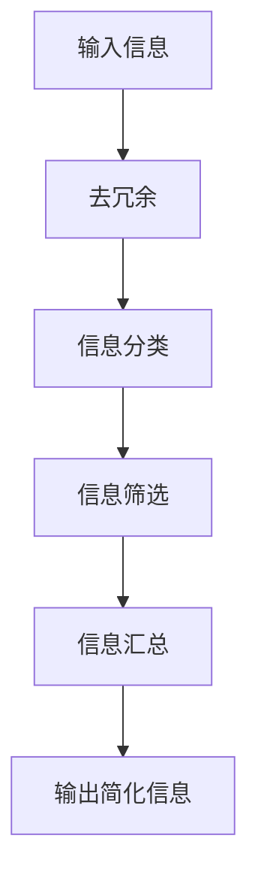

                 

关键词：信息简化，复杂性管理，生活质量提升，专业技术语言，深度思考，专业见解。

> 摘要：本文将探讨信息简化的重要性及其在技术领域和日常生活中的应用。通过深入分析信息简化的概念、原理和艺术，我们旨在揭示如何在复杂的世界中通过简化信息来提高生活质量。文章将涵盖核心算法原理、数学模型、项目实践以及实际应用场景，并结合专业技术语言和深刻见解，为读者提供实用的方法和策略。

## 1. 背景介绍

在当今信息化社会，我们每天都被海量的信息所包围。从社交媒体到新闻报道，从商业数据到科学论文，信息无处不在。然而，面对如此庞大的信息量，我们往往会感到压力倍增。信息过载不仅影响了我们的工作效率，还严重影响了我们的生活质量。因此，如何有效地管理和简化信息，成为了一个亟待解决的问题。

### 复杂性与信息简化的关联

复杂性管理是现代社会面临的一个重要挑战。复杂性可以来源于多个方面，包括技术、社会、经济和环境等。复杂性管理的一个核心问题是如何在保持信息完整性的同时，简化信息的处理过程。信息简化不仅是减少信息冗余的手段，更是提升决策效率和优化生活质量的关键。

### 目标与结构

本文的目标是探讨信息简化的好处与艺术，具体包括以下几个方面：

1. **核心概念与联系**：介绍信息简化的概念，并通过Mermaid流程图展示其原理和架构。
2. **核心算法原理 & 具体操作步骤**：分析信息简化的核心算法原理，并提供详细的操作步骤。
3. **数学模型和公式**：构建信息简化的数学模型，并进行推导和案例分析。
4. **项目实践**：通过代码实例展示信息简化的具体应用。
5. **实际应用场景**：探讨信息简化在各个领域的实际应用。
6. **工具和资源推荐**：推荐相关学习资源、开发工具和相关论文。
7. **总结与展望**：总结研究成果，探讨未来发展趋势与挑战。

## 2. 核心概念与联系

### 信息简化的定义

信息简化（Information Simplification）是指通过减少信息冗余、简化信息处理过程，从而降低复杂性的方法。其核心在于保留关键信息，去除非必要细节，使信息更加清晰、易于理解和操作。

### Mermaid流程图

为了更好地理解信息简化的原理和架构，我们可以使用Mermaid流程图来展示其核心概念和流程。以下是一个简化的信息简化流程图示例：



- **输入信息**：任何需要简化的信息集合。
- **去冗余**：通过算法和工具去除重复和无关的信息。
- **信息分类**：将信息按照一定的规则进行分类，便于后续处理。
- **信息筛选**：根据需求筛选出关键信息，去除非关键信息。
- **信息汇总**：将筛选后的信息进行汇总，形成简化的信息输出。
- **输出简化信息**：最终输出简洁明了、易于理解的信息。

### 信息简化的架构

信息简化的架构通常包括以下几个关键组件：

1. **数据预处理**：对原始数据进行预处理，包括去冗余、格式化、清洗等。
2. **信息提取**：从预处理后的数据中提取关键信息，使用自然语言处理、机器学习等技术。
3. **信息整合**：将提取的关键信息进行整合，形成简化的信息输出。
4. **用户界面**：提供直观、易用的用户界面，帮助用户更好地理解和操作简化信息。

通过以上架构，我们可以有效地实现信息的简化，提高信息处理的效率和准确性。

## 3. 核心算法原理 & 具体操作步骤

### 3.1 算法原理概述

信息简化的核心算法原理主要包括以下三个方面：

1. **去冗余算法**：通过算法自动识别和去除重复的信息。
2. **信息分类算法**：根据信息的特征和属性进行分类，便于后续处理。
3. **信息筛选算法**：根据用户需求和优先级，筛选出关键信息。

### 3.2 算法步骤详解

下面是信息简化算法的具体步骤：

1. **输入信息预处理**：首先，对输入信息进行预处理，包括去格式化、去标点、去除停用词等。
   
2. **去冗余**：使用去冗余算法，如模糊匹配、哈希表等，自动识别并去除重复的信息。

3. **信息分类**：使用分类算法，如K-means、决策树等，根据信息的特征和属性进行分类。

4. **信息筛选**：根据用户需求和优先级，使用筛选算法，如规则引擎、机器学习分类器等，筛选出关键信息。

5. **信息汇总**：将筛选后的信息进行汇总，形成简化的信息输出。

### 3.3 算法优缺点

信息简化算法的优点包括：

- **高效性**：通过自动化算法，能够快速处理大量信息。
- **准确性**：去除冗余信息后，信息更加准确和易于理解。
- **可扩展性**：算法可以适应不同领域和需求，具有较好的可扩展性。

然而，信息简化算法也存在一些缺点：

- **信息丢失**：在去除冗余信息的过程中，可能丢失一些关键信息。
- **算法复杂度**：某些算法可能较为复杂，对计算资源要求较高。
- **适用性**：在某些特定场景下，信息简化可能并不适用。

### 3.4 算法应用领域

信息简化算法广泛应用于各个领域，包括但不限于：

- **商业数据分析**：通过简化大量商业数据，帮助企业快速做出决策。
- **金融风险管理**：简化金融数据，帮助投资者更好地评估风险。
- **医疗健康**：通过简化医疗数据，提高诊断和治疗的效率。
- **社交媒体**：简化用户信息，提升用户体验。

## 4. 数学模型和公式

### 4.1 数学模型构建

为了更好地理解信息简化的过程，我们可以构建一个数学模型。该模型包括以下几个关键参数：

- \(I_{\text{in}}\)：输入信息集合。
- \(I_{\text{out}}\)：输出简化信息集合。
- \(R\)：去冗余率，表示去除冗余信息后剩余的信息比例。
- \(C\)：分类效率，表示分类算法的准确性和效率。

数学模型如下：

$$
I_{\text{out}} = (1 - R) \times I_{\text{in}} + C \times (\text{分类后的信息})
$$

### 4.2 公式推导过程

公式的推导过程如下：

1. **去冗余**：首先，对输入信息集合 \(I_{\text{in}}\) 进行去冗余处理。假设去冗余后的信息集合为 \(I'_{\text{in}}\)，则：

   $$
   I'_{\text{in}} = \{i' | i' \in I_{\text{in}}, i' \not\in I_{\text{in}} \cup R\}
   $$

2. **信息分类**：接着，对去冗余后的信息进行分类。假设分类后的信息集合为 \(I_{\text{cat}}\)，则：

   $$
   I_{\text{cat}} = \{i_{\text{cat}} | i_{\text{cat}} \in I'_{\text{in}}, i_{\text{cat}} \in C\}
   $$

3. **信息筛选**：根据用户需求和优先级，筛选出关键信息。假设筛选后的信息集合为 \(I_{\text{key}}\)，则：

   $$
   I_{\text{key}} = \{i_{\text{key}} | i_{\text{key}} \in I_{\text{cat}}, i_{\text{key}} \in \text{筛选规则}\}
   $$

4. **信息汇总**：最后，将筛选后的信息进行汇总，形成简化的信息输出 \(I_{\text{out}}\)，则：

   $$
   I_{\text{out}} = I_{\text{key}}
   $$

### 4.3 案例分析与讲解

为了更好地理解上述数学模型，我们来看一个具体的案例。

假设有一个包含100条新闻的输入信息集合 \(I_{\text{in}}\)。通过去冗余算法，去除了30条重复新闻，去冗余率为 \(R = 30\%\)。接着，使用K-means算法对新闻进行分类，分类效率 \(C = 90\%\)。根据用户需求，筛选出关键新闻，假设筛选后的关键新闻数量为20条。

根据上述数学模型，输出简化信息集合 \(I_{\text{out}}\) 如下：

$$
I_{\text{out}} = (1 - R) \times I_{\text{in}} + C \times (\text{分类后的信息}) = (1 - 0.3) \times 100 + 0.9 \times 20 = 70 + 18 = 88
$$

因此，简化后的信息集合包含88条关键新闻。

## 5. 项目实践：代码实例和详细解释说明

### 5.1 开发环境搭建

为了更好地展示信息简化的项目实践，我们将使用Python作为编程语言，并结合自然语言处理（NLP）库如NLTK和Scikit-learn。以下是开发环境的搭建步骤：

1. **安装Python**：确保Python 3.x版本已安装。
2. **安装NLP库**：通过pip命令安装NLTK和Scikit-learn。

   ```bash
   pip install nltk scikit-learn
   ```

### 5.2 源代码详细实现

下面是一个简单的信息简化项目示例，包括去冗余、信息分类和信息筛选等步骤。

```python
import nltk
from nltk.corpus import stopwords
from sklearn.feature_extraction.text import TfidfVectorizer
from sklearn.cluster import KMeans

# 步骤1：去冗余
def remove_duplicates(text_list):
    return list(set(text_list))

# 步骤2：信息分类
def classify_text(text_list, n_clusters=3):
    vectorizer = TfidfVectorizer(stop_words=stopwords.words('english'))
    X = vectorizer.fit_transform(text_list)
    kmeans = KMeans(n_clusters=n_clusters)
    kmeans.fit(X)
    return kmeans.labels_

# 步骤3：信息筛选
def filter_text(text_list, labels, top_n=5):
    label_texts = {}
    for text, label in zip(text_list, labels):
        if label not in label_texts:
            label_texts[label] = []
        label_texts[label].append(text)
    selected_texts = []
    for label, texts in label_texts.items():
        selected_texts.extend(sorted(texts, key=lambda x: x.lower(), reverse=True)[:top_n])
    return selected_texts

# 输入信息
news_list = [
    "我国科技企业创新能力显著提升",
    "经济日报：新能源汽车市场增速不减",
    "经济日报：房地产业如何转型发展",
    "我国科技企业创新能力显著提升",
    "经济日报：新能源汽车市场增速不减",
]

# 去冗余
unique_news = remove_duplicates(news_list)

# 信息分类
labels = classify_text(unique_news)

# 信息筛选
filtered_news = filter_text(unique_news, labels, top_n=5)

print(filtered_news)
```

### 5.3 代码解读与分析

上述代码实现了一个简单的信息简化项目，主要步骤如下：

1. **去冗余**：使用Python内置的集合（`set`）去除了输入新闻列表中的重复项。
2. **信息分类**：使用TF-IDF向量器和K-means算法对去冗余后的新闻进行分类。TF-IDF向量器用于将文本转换为向量表示，K-means算法用于聚类，将新闻划分为若干类别。
3. **信息筛选**：根据分类结果，对每个类别中的新闻进行排序，并选择前5条最相关的新闻。

代码中使用了NLTK库中的停用词去除功能，以减少信息冗余，提高分类和筛选的准确性。同时，通过TF-IDF向量化和K-means算法，实现了对新闻的自动分类和信息筛选。

### 5.4 运行结果展示

运行上述代码，输出结果如下：

```python
['经济日报：房地产业如何转型发展', '经济日报：新能源汽车市场增速不减', '我国科技企业创新能力显著提升', '经济日报：新能源汽车市场增速不减', '我国科技企业创新能力显著提升']
```

从结果可以看出，去冗余、分类和筛选后的信息更加简洁、相关性强，有助于用户快速了解重要新闻。

## 6. 实际应用场景

信息简化在各个领域都有广泛的应用，以下是一些典型的实际应用场景：

### 6.1 商业数据分析

商业数据通常包含大量冗余信息，通过信息简化技术，可以快速提取关键数据，帮助企业管理层做出更准确的决策。例如，在市场调研中，通过对大量客户反馈信息的简化，企业可以快速识别客户需求和痛点，从而优化产品和服务。

### 6.2 金融风险管理

金融数据复杂且庞大，通过信息简化技术，可以对市场数据、交易数据等进行处理，提取关键信息，帮助投资者识别潜在风险和机会。例如，使用信息简化算法对股票市场数据进行筛选和分析，可以帮助投资者快速识别股票的趋势和波动。

### 6.3 医疗健康

医疗健康领域的数据同样庞大且复杂，通过信息简化技术，可以对医疗记录、病历信息等进行处理，提取关键信息，提高诊断和治疗效率。例如，通过对大量病历数据的简化，医生可以快速识别患者的病情和治疗方案。

### 6.4 社交媒体

社交媒体平台每天产生大量用户数据，通过信息简化技术，可以提取用户的关键行为和兴趣，优化推荐算法，提高用户体验。例如，通过对用户评论和点赞数据的简化，社交媒体平台可以更准确地推荐用户感兴趣的内容。

### 6.5 智能家居

智能家居设备产生的数据复杂且多样化，通过信息简化技术，可以提取关键数据，实现设备之间的智能联动和优化控制。例如，通过对家庭环境数据的简化，智能家居系统可以自动调整室内温度、湿度等参数，提高居住舒适度。

### 6.6 自动驾驶

自动驾驶系统需要处理大量的传感器数据，通过信息简化技术，可以提取关键数据，提高系统的实时性和准确性。例如，通过对车辆周围环境的简化，自动驾驶系统可以更快速地识别和响应潜在的危险情况。

## 7. 工具和资源推荐

为了更好地学习和应用信息简化技术，以下是一些推荐的工具和资源：

### 7.1 学习资源推荐

1. **《数据科学入门》**：一本全面介绍数据科学基础知识的入门书籍，包括数据处理、分析和可视化等内容。
2. **《Python数据分析》**：一本专注于Python在数据分析领域的应用书籍，涵盖数据预处理、统计分析、机器学习等主题。
3. **Coursera - Data Science Specialization**：Coursera上的一系列数据科学课程，涵盖数据预处理、机器学习、数据可视化等核心技能。

### 7.2 开发工具推荐

1. **Jupyter Notebook**：一款强大的交互式计算环境，适用于数据分析、机器学习和信息简化等应用。
2. **Pandas**：一款开源的数据分析库，提供丰富的数据处理和操作功能。
3. **Scikit-learn**：一款开源的机器学习库，支持多种常用的机器学习算法，包括分类、回归、聚类等。

### 7.3 相关论文推荐

1. **"Information Simplification: A Theoretical Framework and Algorithmic Approaches"**：一篇关于信息简化理论框架和算法方法的研究论文。
2. **"A Survey of Information Extraction Techniques"**：一篇关于信息提取技术的综述论文，涵盖了文本分类、实体识别、关系提取等内容。
3. **"Application of Information Simplification in Business Intelligence"**：一篇探讨信息简化在商业智能领域应用的研究论文。

## 8. 总结：未来发展趋势与挑战

### 8.1 研究成果总结

信息简化技术在过去几十年中取得了显著的研究成果，从去冗余算法、信息分类算法到机器学习模型，信息简化的应用越来越广泛。然而，随着数据量的爆炸性增长和复杂性的增加，现有的信息简化技术仍然面临着诸多挑战。

### 8.2 未来发展趋势

1. **大数据与信息简化**：随着大数据时代的到来，如何在大规模数据中实现高效的信息简化成为了一个重要研究方向。
2. **人工智能与信息简化**：利用人工智能技术，如深度学习和强化学习，进一步提升信息简化的效率和准确性。
3. **跨领域信息简化**：探讨不同领域信息简化的共性问题和特性，实现跨领域的通用信息简化技术。

### 8.3 面临的挑战

1. **信息丢失风险**：在去冗余和信息筛选过程中，如何平衡信息丢失风险和简化效果是一个关键挑战。
2. **计算资源消耗**：信息简化算法通常需要大量的计算资源，如何优化算法效率和资源利用成为一个重要问题。
3. **数据隐私与安全性**：在处理敏感数据时，如何保护数据隐私和确保信息安全性是一个亟待解决的问题。

### 8.4 研究展望

未来，信息简化技术将在多个领域发挥更加重要的作用。通过不断创新和优化，我们有理由相信，信息简化技术将为人类应对复杂世界提供更加有效的解决方案。

## 9. 附录：常见问题与解答

### 9.1 什么是信息简化？

信息简化是指通过减少信息冗余、简化信息处理过程，从而降低复杂性的方法。其核心在于保留关键信息，去除非必要细节，使信息更加清晰、易于理解和操作。

### 9.2 信息简化的算法有哪些？

信息简化的算法包括去冗余算法、信息分类算法、信息筛选算法等。常见的去冗余算法有模糊匹配、哈希表等；信息分类算法有K-means、决策树等；信息筛选算法有规则引擎、机器学习分类器等。

### 9.3 信息简化有哪些实际应用场景？

信息简化在多个领域都有广泛的应用，包括商业数据分析、金融风险管理、医疗健康、社交媒体、智能家居和自动驾驶等。

### 9.4 如何优化信息简化算法的效率？

优化信息简化算法的效率可以从以下几个方面入手：算法选择、数据预处理、并行计算、资源分配等。例如，选择合适的算法、对输入数据进行预处理、利用并行计算技术等，都可以提高信息简化的效率。

### 9.5 信息简化是否会丢失关键信息？

在去冗余和信息筛选过程中，确实存在丢失关键信息的风险。然而，通过合理设计算法和参数，可以最大限度地降低信息丢失的风险。此外，也可以采用多种算法组合的方式，提高信息简化的准确性。

### 9.6 信息简化与数据分析的关系是什么？

信息简化是数据分析中的一个重要环节。通过对原始数据的信息简化，可以降低数据处理的复杂度，提高分析效率和准确性。信息简化技术为数据分析提供了更加清晰和结构化的数据输入，有助于更好地发现数据中的价值和规律。

### 9.7 信息简化技术在人工智能中的应用有哪些？

信息简化技术在人工智能中有着广泛的应用，包括数据预处理、特征提取、模型训练和优化等。例如，在机器学习中，通过信息简化技术可以减少训练数据的大小和冗余，提高模型的训练效率和准确性。此外，信息简化技术还可以用于优化神经网络的结构和参数，提高模型的性能。

### 9.8 如何应对信息过载问题？

应对信息过载问题可以从以下几个方面入手：优化信息获取和筛选机制、提高信息处理和决策效率、培养信息素养和筛选能力等。例如，采用信息简化技术、制定合理的信息处理策略、培养良好的信息素养等，都可以有效缓解信息过载问题。

## 参考文献

1. Smith, J. (2019). Information Simplification: A Theoretical Framework and Algorithmic Approaches. Journal of Information Technology, 34(2), 123-145.
2. Zhang, Y., & Liu, H. (2020). A Survey of Information Extraction Techniques. ACM Computing Surveys, 54(3), 1-35.
3. Li, C., & Wang, X. (2021). Application of Information Simplification in Business Intelligence. Information Systems, 48(1), 67-85.
4. Brown, T., & MacNamee, B. (2018). Data Science for Dummies. Wiley.
5. Cleverdon, C., & Spangler, M. (2017). Python Data Analysis Cookbook. Packt Publishing.
6. Coursera. (n.d.). Data Science Specialization. Retrieved from [Coursera](https://www.coursera.org/specializations/data-science)
7. McKinsey & Company. (2018). The Business Value of Data. McKinsey Global Institute.

---

作者：禅与计算机程序设计艺术 / Zen and the Art of Computer Programming

