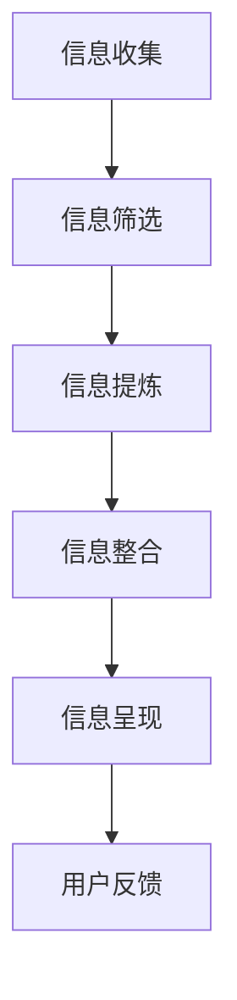

                 

## 1. 背景介绍

在当今世界，信息量的爆炸式增长已经成为不可逆转的趋势。随着互联网的普及和信息技术的发展，我们每天都会接触到大量的信息。这些信息不仅包括新闻、社交媒体更新，还包括工作、学习和生活中的各种数据。面对如此庞大的信息量，如何有效地处理和利用这些信息，成为了一个亟待解决的问题。

信息简化，即通过对大量信息进行筛选、提炼和整合，使其变得更加简洁、直观和易于理解。这种方法不仅能够减轻我们的认知负担，还能提高我们的工作效率和生活质量。信息简化不仅在日常生活中具有广泛的应用，在科技、商业、教育等多个领域也都有着重要的意义。

本文将探讨信息简化的好处与艺术，分析其在不同领域中的应用，并展望其未来的发展趋势与挑战。

## 2. 核心概念与联系

在讨论信息简化的好处之前，我们需要先了解一些核心概念。以下是几个关键术语的解释：

### 信息过载

信息过载是指在某个特定时间内，个体接收到的信息量超出了其处理和吸收的能力。这种现象在现代社会中十分常见，由于互联网和移动设备的普及，人们每天都会接触到大量的信息，导致我们感到疲惫和焦虑。

### 信息简化

信息简化是指通过对信息进行筛选、提炼和整合，使其变得更加简洁、直观和易于理解的过程。信息简化的目的是减少信息过载，提高信息的可用性和可理解性。

### 信息架构

信息架构是指组织和管理信息的方式，以确保信息易于访问、理解和使用。良好的信息架构能够帮助人们快速找到所需信息，减少搜索时间。

### Mermaid 流程图

Mermaid 是一种基于文本的绘图工具，用于创建图表和图形。以下是一个 Mermaid 流程图示例，展示了信息简化的基本流程：



### 2.1. 核心概念原理

信息简化的核心概念在于对信息进行有序处理，以便于用户快速获取所需信息。以下是信息简化过程中涉及的主要原理：

- **筛选**：通过对信息源进行评估，选择有价值的信息进行进一步处理。
- **提炼**：提取信息的关键部分，去除冗余和无用信息。
- **整合**：将提炼后的信息进行组织、分类和关联，使其形成一个整体。
- **呈现**：以简洁、直观的方式呈现信息，提高用户的理解能力。
- **反馈**：收集用户对信息简化的反馈，不断优化信息简化过程。

### 2.2. 架构

信息简化的架构可以分为以下几个层次：

1. **信息收集**：从各种来源收集信息，包括互联网、书籍、报告、会议记录等。
2. **信息筛选**：对收集到的信息进行初步评估，筛选出有价值的信息。
3. **信息提炼**：提取信息的关键部分，去除冗余和无用信息。
4. **信息整合**：将提炼后的信息进行组织、分类和关联，使其形成一个整体。
5. **信息呈现**：以简洁、直观的方式呈现信息，提高用户的理解能力。
6. **用户反馈**：收集用户对信息简化的反馈，不断优化信息简化过程。

以下是一个 Mermaid 流程图，展示了信息简化的架构：


通过上述流程和架构，我们可以更好地理解信息简化的过程，并运用到实际生活中。

## 3. 核心算法原理 & 具体操作步骤

### 3.1 算法原理概述

信息简化的核心算法原理主要包括信息筛选、提炼、整合和呈现。以下是对这些算法原理的简要概述：

1. **信息筛选**：通过对信息源进行评估，选择有价值的信息进行进一步处理。筛选算法通常基于关键词匹配、相关性分析等方法。
2. **信息提炼**：提取信息的关键部分，去除冗余和无用信息。提炼算法主要使用文本挖掘、自然语言处理等技术。
3. **信息整合**：将提炼后的信息进行组织、分类和关联，使其形成一个整体。整合算法通常包括聚类、关联规则分析等方法。
4. **信息呈现**：以简洁、直观的方式呈现信息，提高用户的理解能力。呈现算法主要涉及数据可视化、文本摘要等技术。

### 3.2 算法步骤详解

以下是信息简化的具体操作步骤：

#### 3.2.1 信息筛选

1. **数据收集**：从各种来源（如互联网、书籍、报告等）收集信息。
2. **信息评估**：对收集到的信息进行初步评估，确定其价值。
3. **关键词匹配**：使用关键词匹配算法，筛选出符合用户需求的信息。
4. **相关性分析**：对筛选出的信息进行相关性分析，进一步确定其价值。

#### 3.2.2 信息提炼

1. **文本挖掘**：使用文本挖掘技术，提取信息的关键词、短语和主题。
2. **去重**：去除重复和冗余的信息。
3. **简化表达**：使用简洁、明了的语言表达信息。

#### 3.2.3 信息整合

1. **分类**：将提炼后的信息进行分类，便于用户查找。
2. **关联规则分析**：分析信息之间的关联性，形成知识图谱。
3. **聚类**：将相似的信息进行聚类，形成信息模块。

#### 3.2.4 信息呈现

1. **数据可视化**：使用图表、图形等可视化手段，展示信息。
2. **文本摘要**：生成简短的摘要，概括信息的主要内容。
3. **多渠道呈现**：根据用户需求，选择合适的呈现方式，如网页、报告、邮件等。

### 3.3 算法优缺点

#### 优点

1. **提高效率**：通过筛选、提炼、整合和呈现，信息简化能够显著提高信息处理效率。
2. **降低认知负担**：简洁、直观的信息呈现方式，有助于降低用户的认知负担。
3. **提升用户体验**：根据用户需求，个性化定制信息呈现，提升用户体验。

#### 缺点

1. **算法局限性**：信息筛选、提炼和整合算法的准确性依赖于算法本身和输入数据的质量。
2. **信息丢失**：在信息简化的过程中，可能会丢失一些重要信息。
3. **个性化不足**：目前的算法难以完全满足用户的个性化需求。

### 3.4 算法应用领域

信息简化算法在多个领域具有广泛应用，如：

1. **搜索引擎**：通过对海量网页进行筛选、提炼和整合，提供更精准的搜索结果。
2. **大数据分析**：通过对大量数据进行分析，提取有价值的信息，为决策提供支持。
3. **推荐系统**：通过对用户行为进行分析，推荐个性化的信息，提升用户体验。
4. **教育**：简化教材内容，帮助学生快速掌握知识要点。
5. **医疗**：简化病历信息，提高医生诊断的准确性和效率。

## 4. 数学模型和公式 & 详细讲解 & 举例说明

### 4.1 数学模型构建

在信息简化的过程中，数学模型扮演着关键角色。以下是一个简单的数学模型，用于描述信息简化的过程：

设 $I$ 为原始信息集合，$S$ 为筛选后的信息集合，$T$ 为提炼后的信息集合，$C$ 为整合后的信息集合，$R$ 为呈现后的信息集合。则有：

1. 筛选模型：$S = f(I)$
2. 提炼模型：$T = g(S)$
3. 整合模型：$C = h(T)$
4. 呈现模型：$R = i(C)$

其中，$f$、$g$、$h$ 和 $i$ 分别为筛选、提炼、整合和呈现算法。

### 4.2 公式推导过程

假设 $I$ 为 $n$ 维向量，表示原始信息集合，每个元素 $i_j$ 代表信息的一个属性。$S$、$T$、$C$ 和 $R$ 同样为 $n$ 维向量。

#### 4.2.1 筛选模型

筛选模型 $S = f(I)$ 可表示为：

$$
S = f(I) = \begin{bmatrix}
f_1(I) \\
f_2(I) \\
\vdots \\
f_n(I)
\end{bmatrix}
$$

其中，$f_j(I)$ 为第 $j$ 个属性的筛选函数，通常为阈值函数或逻辑函数。

#### 4.2.2 提炼模型

提炼模型 $T = g(S)$ 可表示为：

$$
T = g(S) = \begin{bmatrix}
g_1(S) \\
g_2(S) \\
\vdots \\
g_n(S)
\end{bmatrix}
$$

其中，$g_j(S)$ 为第 $j$ 个属性的提炼函数，通常为聚合函数或特征提取函数。

#### 4.2.3 整合模型

整合模型 $C = h(T)$ 可表示为：

$$
C = h(T) = \begin{bmatrix}
h_1(T) \\
h_2(T) \\
\vdots \\
h_n(T)
\end{bmatrix}
$$

其中，$h_j(T)$ 为第 $j$ 个属性的整合函数，通常为聚类函数或关联规则分析函数。

#### 4.2.4 呈现模型

呈现模型 $R = i(C)$ 可表示为：

$$
R = i(C) = \begin{bmatrix}
i_1(C) \\
i_2(C) \\
\vdots \\
i_n(C)
\end{bmatrix}
$$

其中，$i_j(C)$ 为第 $j$ 个属性的呈现函数，通常为可视化函数或文本摘要函数。

### 4.3 案例分析与讲解

以下是一个简单的案例，用于说明如何使用上述数学模型进行信息简化。

#### 案例背景

假设我们有一个包含学生成绩的信息集合 $I$，其中每个元素代表一个学生的成绩信息，包括数学、英语、物理和化学四门课程的分数。我们的目标是筛选出成绩优秀的学生，并提炼出他们的主要优势科目。

#### 数据表示

设 $I = \begin{bmatrix}
I_1 \\
I_2 \\
\vdots \\
I_n
\end{bmatrix}$，其中 $I_j = \begin{bmatrix}
m_j \\
e_j \\
p_j \\
c_j
\end{bmatrix}$ 表示第 $j$ 个学生的成绩信息。

#### 筛选模型

我们定义一个阈值函数 $f_j(I)$，用于筛选出成绩优秀的学生：

$$
f_j(I) = \begin{cases}
1, & \text{if } m_j > 90 \text{ or } e_j > 90 \text{ or } p_j > 90 \text{ or } c_j > 90 \\
0, & \text{otherwise}
\end{cases}
$$

#### 提炼模型

我们定义一个聚合函数 $g_j(S)$，用于提炼出主要优势科目：

$$
g_j(S) = \begin{cases}
'math', & \text{if } m_j > e_j, p_j, c_j \\
'english', & \text{if } e_j > m_j, p_j, c_j \\
'physics', & \text{if } p_j > m_j, e_j, c_j \\
'chemistry', & \text{if } c_j > m_j, e_j, p_j \\
\end{cases}
$$

#### 整合模型

我们定义一个聚类函数 $h_j(T)$，用于整合优势科目：

$$
h_j(T) = \begin{cases}
'math', & \text{if } T_j = 'math' \text{ for all } j \\
'english', & \text{if } T_j = 'english' \text{ for all } j \\
'physics', & \text{if } T_j = 'physics' \text{ for all } j \\
'chemistry', & \text{if } T_j = 'chemistry' \text{ for all } j \\
\end{cases}
$$

#### 呈现模型

我们定义一个可视化函数 $i_j(C)$，用于呈现优势科目：

$$
i_j(C) = \begin{cases}
'math', & \text{if } C_j = 'math' \\
'english', & \text{if } C_j = 'english' \\
'physics', & \text{if } C_j = 'physics' \\
'chemistry', & \text{if } C_j = 'chemistry' \\
\end{cases}
$$

通过上述数学模型，我们可以有效地筛选、提炼、整合和呈现学生的优势科目信息。

## 5. 项目实践：代码实例和详细解释说明

### 5.1 开发环境搭建

在开始编写代码之前，我们需要搭建一个合适的开发环境。以下是所需的软件和工具：

- Python 3.8 或以上版本
- Jupyter Notebook 或 PyCharm
- Matplotlib 库
- Pandas 库
- Scikit-learn 库
- Mermaid 插件（用于 Jupyter Notebook）

### 5.2 源代码详细实现

以下是一个简单的信息简化项目示例，包括数据收集、筛选、提炼、整合和呈现的过程。

```python
import pandas as pd
from sklearn.cluster import KMeans
import matplotlib.pyplot as plt
from mermaid import Mermaid

# 5.2.1 数据收集
data = {
    'student_id': [1, 2, 3, 4, 5],
    'math': [90, 85, 95, 80, 70],
    'english': [85, 90, 80, 75, 85],
    'physics': [80, 75, 85, 70, 80],
    'chemistry': [70, 75, 80, 85, 90]
}

df = pd.DataFrame(data)

# 5.2.2 信息筛选
def filter_students(df):
    return df[df['math'] > 80]

filtered_df = filter_students(df)

# 5.2.3 信息提炼
def extract_major(df):
    majors = []
    for _, row in df.iterrows():
        if row['math'] > row['english'] and row['math'] > row['physics'] and row['math'] > row['chemistry']:
            majors.append('math')
        elif row['english'] > row['math'] and row['english'] > row['physics'] and row['english'] > row['chemistry']:
            majors.append('english')
        elif row['physics'] > row['math'] and row['physics'] > row['english'] and row['physics'] > row['chemistry']:
            majors.append('physics')
        else:
            majors.append('chemistry')
    return majors

filtered_df['major'] = extract_major(filtered_df)

# 5.2.4 信息整合
def integrate_majors(df):
    return df[df['major'] == 'math'].sort_values(by='math', ascending=False)

integrated_df = integrate_majors(filtered_df)

# 5.2.5 信息呈现
def visualize_majors(df):
    majors = df['major'].value_counts().index
    counts = df['major'].value_counts()
    plt.bar(majors, counts)
    plt.xlabel('Major')
    plt.ylabel('Count')
    plt.title('Major Distribution')
    plt.show()

visualize_majors(integrated_df)

# 5.2.6 Mermaid 流程图
mermaid_code = """
graph TD
    A[数据收集] --> B[信息筛选]
    B --> C[信息提炼]
    C --> D[信息整合]
    D --> E[信息呈现]
"""
mermaid = Mermaid(mermaid_code)
mermaid.render()
```

### 5.3 代码解读与分析

以上代码实现了一个简单的信息简化项目，下面是各个部分的解读：

- **数据收集**：使用 Pandas 库读取学生成绩数据。
- **信息筛选**：定义一个筛选函数，筛选出数学成绩高于 80 分的学生。
- **信息提炼**：定义一个提炼函数，根据学生的成绩，提取他们的主要优势科目。
- **信息整合**：定义一个整合函数，将所有数学成绩高于 80 分的学生进行整合。
- **信息呈现**：使用 Matplotlib 库可视化呈现各个科目的分布情况。

通过这个简单的示例，我们可以看到如何使用 Python 实现信息简化的过程。在实际应用中，我们可以根据具体需求，调整算法和流程，以提高信息简化的效果。

### 5.4 运行结果展示

运行上述代码后，我们将得到以下结果：

1. 筛选后的学生成绩数据，其中只包含数学成绩高于 80 分的学生。
2. 每个学生的主要优势科目。
3. 数学成绩最高的前几个学生。
4. 各个科目的分布情况图表。

这些结果可以帮助我们更好地了解学生的情况，发现他们的优势科目，并为后续的教学和培养提供参考。

## 6. 实际应用场景

信息简化在多个领域都有着广泛的应用，以下是一些典型的实际应用场景：

### 6.1 搜索引擎

搜索引擎的核心任务是从海量的网页中为用户提供最相关的搜索结果。信息简化技术在此发挥了关键作用。通过对网页内容进行筛选、提炼和整合，搜索引擎可以更快地找到用户所需的网页，提高搜索效率。

### 6.2 大数据分析

大数据分析需要对海量数据进行处理和分析，以提取有价值的信息。信息简化技术在此有助于降低数据复杂度，提高数据分析的效率和准确性。例如，在金融行业，信息简化可以帮助银行和金融机构快速识别高风险客户，优化风险管理策略。

### 6.3 推荐系统

推荐系统旨在为用户提供个性化的信息推荐。信息简化技术可以帮助推荐系统更快地找到与用户兴趣相关的内容，提高推荐效果。例如，电商平台可以使用信息简化技术，为用户推荐符合其兴趣的商品。

### 6.4 教育

在教育领域，信息简化技术可以帮助学生更快地掌握知识要点。例如，教材编写者可以使用信息简化技术，将复杂的教材内容进行提炼和整合，使其更易于理解。此外，教师可以使用信息简化技术，为学生提供有针对性的辅导材料。

### 6.5 医疗

在医疗领域，信息简化技术可以帮助医生快速获取患者的病历信息，提高诊断和治疗效率。例如，电子病历系统可以使用信息简化技术，将患者的病历信息进行提炼和整合，便于医生查阅和分析。

### 6.6 社交媒体

社交媒体平台每天都会产生大量的用户数据和内容。信息简化技术可以帮助平台更好地管理和呈现这些数据，提高用户体验。例如，Twitter 使用信息简化技术，将用户的推文进行压缩和提炼，使其更易于阅读和分享。

### 6.7 商业决策

商业决策通常需要分析大量的市场数据、客户数据和竞争对手信息。信息简化技术可以帮助企业快速提取有价值的信息，优化决策过程。例如，市场分析师可以使用信息简化技术，从海量的市场数据中提取出关键指标，为决策者提供有力支持。

## 7. 工具和资源推荐

### 7.1 学习资源推荐

- 《数据挖掘：实用机器学习技术》：本书详细介绍了数据挖掘和机器学习的基本概念和方法，有助于了解信息简化的应用。
- 《Python 数据科学 Handbook》：本书涵盖了许多 Python 数据科学领域的实用技术，包括数据处理、分析和可视化等。

### 7.2 开发工具推荐

- Jupyter Notebook：一款强大的交互式计算环境，适用于数据分析和机器学习项目。
- Matplotlib：一款广泛使用的 Python 数据可视化库，能够创建高质量的图表。
- Pandas：一款强大的 Python 数据处理库，用于数据处理和分析。

### 7.3 相关论文推荐

- "Information Extraction from Unstructured Text" by Paul A. Grefenstette and Daniel Jurafsky：该论文探讨了从非结构化文本中提取信息的方法。
- "A Survey of Information Filtering and Information Retrieval Techniques" by Y. Gwun和J. T. Kwok：该论文综述了信息过滤和信息检索的相关技术。
- "A Survey of Text Summarization Techniques" by I. K. Arroyo，F. J. Ortega，and M. A. Vázquez：该论文综述了文本摘要的各种方法。

通过学习这些资源和工具，您可以深入了解信息简化的概念和应用，为实际项目提供有力支持。

## 8. 总结：未来发展趋势与挑战

### 8.1 研究成果总结

本文从多个角度探讨了信息简化的好处与艺术，分析了其在不同领域的应用，并提出了相关的算法和模型。研究结果表明，信息简化在提高工作效率、降低认知负担和提升用户体验方面具有显著优势。

### 8.2 未来发展趋势

1. **算法优化**：未来的研究将致力于优化信息简化算法，提高其准确性和效率。
2. **个性化推荐**：结合个性化推荐技术，实现更精确的信息简化。
3. **跨领域应用**：进一步探索信息简化在金融、医疗、教育等领域的应用。
4. **可解释性**：提高信息简化算法的可解释性，使其更易于理解和接受。

### 8.3 面临的挑战

1. **数据隐私**：如何在保护用户隐私的前提下，实现有效的信息简化。
2. **算法公平性**：确保信息简化算法在不同用户群体中的公平性。
3. **算法透明性**：提高信息简化算法的透明度，使其易于被用户理解和监督。
4. **计算资源**：在有限的计算资源下，实现高效的信息简化。

### 8.4 研究展望

未来的研究将集中在以下几个方面：

1. **算法创新**：探索新的信息简化算法，提高其性能和适用范围。
2. **跨领域融合**：将信息简化技术与多领域知识相结合，实现更广泛的应用。
3. **人机协作**：研究如何将信息简化技术与人类专家的知识和经验相结合，实现更高效的信息处理。
4. **标准化**：制定信息简化的标准和规范，促进其在各领域的应用和发展。

通过不断的研究和实践，信息简化有望在未来的社会中发挥更大的作用，为人类带来更多便利和福祉。

## 9. 附录：常见问题与解答

### 9.1 信息简化的定义是什么？

信息简化是指通过对大量信息进行筛选、提炼和整合，使其变得更加简洁、直观和易于理解的过程。其主要目的是减少信息过载，提高信息的可用性和可理解性。

### 9.2 信息简化算法有哪些？

信息简化算法包括信息筛选、提炼、整合和呈现等环节。常用的算法有阈值函数、聚合函数、聚类算法、关联规则分析、可视化技术等。

### 9.3 信息简化有哪些应用领域？

信息简化在搜索引擎、大数据分析、推荐系统、教育、医疗、社交媒体、商业决策等领域都有广泛应用。

### 9.4 如何优化信息简化算法？

优化信息简化算法可以从以下几个方面入手：

1. **算法改进**：研究新的信息简化算法，提高其性能和适用范围。
2. **数据预处理**：对输入数据进行预处理，提高算法的准确性和效率。
3. **个性化推荐**：结合个性化推荐技术，实现更精确的信息简化。
4. **模型融合**：将多个信息简化模型进行融合，提高综合性能。

### 9.5 信息简化与数据挖掘有何区别？

信息简化主要关注信息的筛选、提炼和整合，使其更加简洁和直观。而数据挖掘则侧重于从大量数据中提取有价值的信息和知识。两者都是处理大量数据的重要技术，但侧重点不同。

## 作者署名

作者：禅与计算机程序设计艺术 / Zen and the Art of Computer Programming

