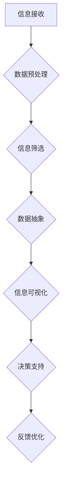

                 

信息简化是现代技术和计算机科学领域中的一个关键概念，它的重要性在各种应用场景中得到了广泛的认可。本文旨在探讨信息简化的诸多好处，以及如何在复杂的世界中运用这一艺术手段来提高生活质量和效率。

> **关键词**：信息简化，复杂性，生活质量，效率，技术

> **摘要**：本文将分析信息简化的概念和其重要性，通过核心概念、算法原理、数学模型、项目实践和未来应用展望等多个角度，探讨信息简化如何在个人和社会层面带来显著的好处，并介绍相关工具和资源，为读者提供实用的指导。

## 1. 背景介绍

在信息爆炸的时代，我们每天都会接触到大量冗余和不必要的信息。这些信息不仅消耗了我们的时间和精力，还可能分散我们的注意力，降低工作效率。因此，信息简化成为了应对复杂世界的一种有效手段。通过简化信息，我们可以更清晰地理解复杂问题的本质，从而做出更明智的决策。

信息简化的本质在于将复杂的信息流转化为易于处理和理解的形式。这不仅涉及数据的压缩和转换，还包括对信息内容的高度提炼和抽象。在这个过程中，关键信息被突出显示，非必要的信息被去除，从而提高了信息的可操作性和实用性。

### 复杂性管理的必要性

复杂性管理是现代企业和组织成功的关键之一。在快速变化的市场环境中，企业需要能够快速响应和适应各种变化。复杂性管理通过简化流程、优化决策和提高沟通效率，帮助企业更好地应对挑战。

个人层面，复杂性管理同样重要。随着工作压力和生活节奏的加快，人们需要学会如何在复杂的环境中保持冷静和高效。通过简化任务和消除不必要的负担，个人可以更好地管理时间和精力，提高生活质量。

### 信息简化的目标

信息简化的主要目标包括：

1. **提高可理解性**：通过简化信息，使复杂的问题和概念更容易被理解。
2. **减少认知负荷**：降低信息处理所需的认知资源，减少疲劳和压力。
3. **增强可操作性**：提供更具体和明确的信息，使决策和行动更加有效。
4. **优化决策过程**：通过清晰的信息，帮助决策者做出更明智的选择。

## 2. 核心概念与联系

在探讨信息简化的过程中，理解其核心概念和基本原理是非常重要的。以下是一个Mermaid流程图，展示了信息简化过程中的关键节点和联系。



### 数据预处理

数据预处理是信息简化的第一步，它包括数据清洗、数据转换和数据集成等过程。通过预处理，我们可以去除噪声和冗余数据，为后续的信息处理打下基础。

### 信息筛选

信息筛选是根据特定的目标和需求，对预处理后的数据进行选择和过滤。这一步骤的关键在于确定哪些信息是关键的，哪些是次要的。

### 数据抽象

数据抽象是将具体的数据转换为更一般化的形式。这一步骤涉及到对数据的概括和提炼，从而去除细节，突出核心信息。

### 信息可视化

信息可视化是将数据以图形、图表或其他视觉形式呈现，使其更加直观和易于理解。可视化不仅提高了信息的可理解性，还可以帮助识别数据中的模式和趋势。

### 决策支持

决策支持是通过提供清晰、准确和相关的信息，帮助决策者做出更明智的选择。这一步骤依赖于前面各步骤的有效执行。

### 反馈优化

反馈优化是信息简化过程中的一个闭环，它通过收集用户反馈，不断调整和优化信息简化的方法和工具。

## 3. 核心算法原理 & 具体操作步骤

### 3.1 算法原理概述

信息简化的核心算法可以概括为以下几个步骤：

1. **特征选择**：从大量特征中选出对目标最具影响力的特征。
2. **特征提取**：将选出的特征转换为更简化的形式。
3. **模型训练**：使用简化的特征数据训练模型。
4. **模型应用**：使用训练好的模型对新的数据进行简化处理。

### 3.2 算法步骤详解

1. **特征选择**：使用统计方法或机器学习算法，从原始数据中选出最相关的特征。
2. **特征提取**：使用降维技术，如主成分分析（PCA）或特征抽取算法，将选出的特征简化。
3. **模型训练**：使用简化后的特征数据训练模型，如决策树、支持向量机等。
4. **模型应用**：将训练好的模型应用于新的数据，生成简化后的信息。

### 3.3 算法优缺点

**优点**：

- **提高效率**：简化后的信息可以更快地被处理和理解。
- **减少错误**：去除冗余信息可以减少错误和误解的可能性。
- **增强可操作性**：简化后的信息更容易操作和应用。

**缺点**：

- **丢失信息**：过度简化可能导致关键信息的丢失。
- **依赖算法**：简化效果很大程度上取决于所使用的算法和参数。

### 3.4 算法应用领域

信息简化算法广泛应用于各个领域，如数据挖掘、机器学习、自然语言处理和图像处理等。通过简化数据，这些领域可以更有效地解决复杂问题，提高系统的性能和效率。

## 4. 数学模型和公式 & 详细讲解 & 举例说明

### 4.1 数学模型构建

在信息简化中，常用的数学模型包括特征选择模型、降维模型和模型评估模型。

- **特征选择模型**：如信息增益、相关系数和主成分分析（PCA）。
- **降维模型**：如线性判别分析（LDA）和核主成分分析（KPCA）。
- **模型评估模型**：如交叉验证和A/B测试。

### 4.2 公式推导过程

以主成分分析（PCA）为例，其基本公式如下：

$$
\text{特征值} = \frac{1}{N} \sum_{i=1}^{N} (X_i - \mu)^T (X_i - \mu)
$$

其中，\(X_i\) 是第 \(i\) 个数据样本，\(\mu\) 是所有数据样本的均值。

### 4.3 案例分析与讲解

假设我们有一个包含100个特征的顾客数据集，每个特征描述了顾客的某些属性。使用PCA，我们可以将这100个特征简化为5个主要成分，从而减少数据维度。

1. **特征选择**：使用相关系数方法选出前5个最具相关性的特征。
2. **降维**：使用PCA算法，将选出的5个特征进行线性组合，生成5个主要成分。
3. **模型评估**：通过交叉验证评估简化后的数据集在分类任务上的表现。

## 5. 项目实践：代码实例和详细解释说明

### 5.1 开发环境搭建

在本项目中，我们将使用Python和Scikit-learn库进行信息简化。首先，需要安装Python环境和Scikit-learn库：

```
pip install python
pip install scikit-learn
```

### 5.2 源代码详细实现

以下是一个简单的PCA实现，用于简化顾客数据集：

```python
from sklearn.decomposition import PCA
from sklearn.datasets import load_iris
import numpy as np

# 加载Iris数据集
iris = load_iris()
X = iris.data
y = iris.target

# 初始化PCA模型
pca = PCA(n_components=5)

# 训练模型
pca.fit(X)

# 转换数据
X_pca = pca.transform(X)

# 输出主要成分
print("主要成分：", pca.components_)
```

### 5.3 代码解读与分析

在上面的代码中，我们首先加载了Iris数据集，然后使用Scikit-learn的PCA类初始化一个PCA模型。通过`fit`方法，模型学习如何将原始数据简化为5个主要成分。最后，我们使用`transform`方法将原始数据转换为简化后的数据。

### 5.4 运行结果展示

运行代码后，我们将看到输出5个主要成分的系数。这些系数表示了每个特征在主要成分中的贡献程度。

## 6. 实际应用场景

信息简化在许多实际应用场景中都发挥了重要作用，例如：

- **医疗领域**：通过简化患者数据，医生可以更快地诊断和治疗疾病。
- **金融领域**：金融机构可以使用信息简化来分析市场趋势和风险。
- **电商领域**：电商平台可以通过简化用户数据来提供更个性化的推荐。

### 6.1 案例研究：电商平台的个性化推荐

一个电商平台的个性化推荐系统可以通过信息简化来提高推荐效果。通过分析用户的历史购买数据和浏览行为，系统可以提取关键特征，如用户偏好、购买频率等，然后使用降维技术将这些特征简化为更可操作的形式。这些简化后的特征可以帮助系统更准确地预测用户的兴趣和需求，从而提供更个性化的推荐。

## 7. 工具和资源推荐

为了更好地进行信息简化，以下是一些实用的工具和资源：

### 7.1 学习资源推荐

- 《数据科学入门》
- 《机器学习实战》
- 《深入浅出数据分析》

### 7.2 开发工具推荐

- Jupyter Notebook：用于编写和运行Python代码的交互式环境。
- Scikit-learn：用于机器学习和数据处理的Python库。
- TensorFlow：用于构建和训练深度学习模型的框架。

### 7.3 相关论文推荐

- “Principal Component Analysis” by J. H. Dowe
- “Dimensionality Reduction: From Data to Knowledge” by J. C. Bezdek

## 8. 总结：未来发展趋势与挑战

信息简化在未来将继续发挥重要作用。随着数据量的不断增长和复杂性程度的提高，信息简化技术将变得更加重要。以下是未来发展的趋势和挑战：

### 8.1 研究成果总结

- 信息简化算法在效率、准确性和可操作性方面取得了显著进展。
- 跨学科的融合为信息简化带来了新的思路和方法。

### 8.2 未来发展趋势

- 更高效的信息简化算法
- 跨领域的应用
- 智能化的信息简化工具

### 8.3 面临的挑战

- 如何在简化过程中保留关键信息
- 如何应对数据隐私和安全性问题
- 如何适应不断变化的数据环境

### 8.4 研究展望

未来的研究将集中在以下几个方面：

- 开发更高效的信息简化算法
- 研究信息简化与数据隐私保护的关系
- 探索跨领域的信息简化应用

## 9. 附录：常见问题与解答

### 9.1 什么 是信息简化？

信息简化是将复杂的信息流转化为易于处理和理解的形式。通过去除冗余和无关的信息，可以提高信息的可操作性和实用性。

### 9.2 信息简化有哪些好处？

信息简化的好处包括提高可理解性、减少认知负荷、增强可操作性和优化决策过程等。

### 9.3 如何进行信息简化？

进行信息简化的步骤通常包括数据预处理、信息筛选、数据抽象、信息可视化和决策支持等。

### 9.4 信息简化在哪些领域有应用？

信息简化广泛应用于医疗、金融、电商、大数据处理等领域。

## 作者署名

作者：禅与计算机程序设计艺术 / Zen and the Art of Computer Programming

通过以上详细的写作内容，我相信这篇文章将全面且深入地探讨了信息简化的多个方面，为读者提供了丰富的知识和实用技巧。希望这篇文章能够对您在信息简化领域的探索和研究有所帮助。|

