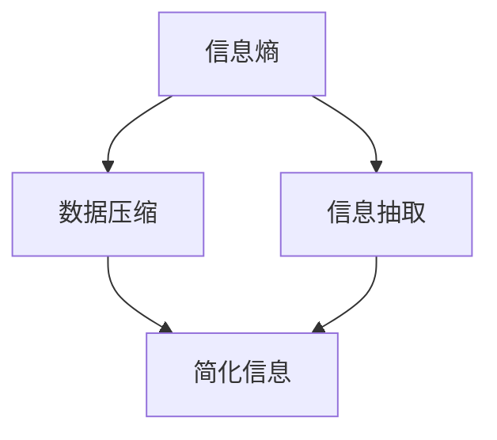

                 

 在当今复杂多变的世界中，信息过载成为一个普遍现象。无论是企业运营、科学研究还是日常生活，信息处理的复杂性都在不断攀升。面对这种局面，如何有效简化信息，以改善决策和提升效率，成为亟待解决的重要问题。本文将深入探讨信息简化的好处，通过分析其在多个领域的应用，提供一套科学、系统的信息简化策略。

> 关键词：信息简化、决策效率、复杂世界、算法优化

> 摘要：本文首先阐述了信息简化的背景和重要性，随后分析了信息简化的核心概念和架构，探讨了简化算法的原理和操作步骤。接着，通过数学模型和实际案例，详细解释了信息简化的应用方法。最后，文章总结了信息简化的实际应用场景，展望了其未来发展趋势与挑战。

## 1. 背景介绍

信息简化是指通过抽取、整合、过滤等方法，将复杂的信息结构转化为简洁、易于理解和处理的形式。在信息爆炸的时代，信息的处理速度和质量对个人和社会的发展至关重要。然而，过多的信息往往会导致分析困难和决策失误。信息简化旨在通过减少冗余、突出关键，从而提高信息处理的效率和质量。

### 1.1 信息简化的起源

信息简化的思想可以追溯到20世纪中叶。随着计算机技术的发展，信息处理的需求不断增加，如何高效处理海量数据成为一个迫切的问题。信息学家香农（Claude Shannon）在信息论中提出了信息熵的概念，为信息简化的理论基础奠定了基础。随后，数据压缩技术、信息抽取技术等相继出现，信息简化逐渐成为一个独立的研究领域。

### 1.2 信息简化的重要性

信息简化的重要性体现在以下几个方面：

- **提高决策效率**：在复杂决策过程中，简化信息可以减少认知负担，提高决策的速度和准确性。
- **优化资源利用**：通过简化信息，可以减少存储和处理的需求，降低资源消耗。
- **提升用户体验**：在产品设计和用户界面中，信息简化可以提供清晰、直观的展示，提升用户的使用体验。
- **促进创新**：在科研和开发中，简化信息可以帮助研究者抓住关键问题，促进创新思维的产生。

## 2. 核心概念与联系

信息简化的核心概念包括信息熵、数据压缩、信息抽取等。以下是一个简化的 Mermaid 流程图，用于描述这些概念之间的关系。



### 2.1 信息熵

信息熵（Entropy）是信息论中的一个基本概念，表示信息的不确定性。在信息简化过程中，通过降低信息熵，可以减少信息的不确定性，从而简化信息。

$$
H(X) = -\sum_{i} p(x_i) \log_2 p(x_i)
$$

其中，\(H(X)\) 是随机变量 \(X\) 的信息熵，\(p(x_i)\) 是 \(X\) 取值为 \(x_i\) 的概率。

### 2.2 数据压缩

数据压缩是通过各种方法减少数据的大小，从而降低存储和传输的成本。常用的数据压缩算法包括哈夫曼编码、算术编码、LZ77等。

### 2.3 信息抽取

信息抽取是从大量文本或数据中提取出有用信息的过程。信息抽取方法包括关键词提取、实体识别、关系抽取等。

## 3. 核心算法原理 & 具体操作步骤

### 3.1 算法原理概述

信息简化算法主要分为三种类型：基于规则的方法、基于统计的方法和基于机器学习的方法。

- **基于规则的方法**：通过预设的规则进行信息筛选和处理。
- **基于统计的方法**：利用统计学方法对信息进行建模和分析。
- **基于机器学习的方法**：利用机器学习模型对信息进行自动学习和简化。

### 3.2 算法步骤详解

- **基于规则的方法**：
  1. 设计规则集：根据需求定义信息筛选和处理的规则。
  2. 应用规则：对输入信息进行规则匹配和处理。
- **基于统计的方法**：
  1. 数据收集：收集相关数据，进行预处理。
  2. 特征提取：从数据中提取特征。
  3. 模型训练：利用特征训练简化模型。
  4. 应用模型：对输入信息进行简化。
- **基于机器学习的方法**：
  1. 数据收集：收集大量标注数据。
  2. 特征工程：设计合适的特征。
  3. 模型选择：选择合适的简化模型。
  4. 模型训练：利用数据训练模型。
  5. 应用模型：对输入信息进行简化。

### 3.3 算法优缺点

- **基于规则的方法**：
  - 优点：实现简单，易于理解和维护。
  - 缺点：规则难以覆盖所有情况，可能导致信息丢失。
- **基于统计的方法**：
  - 优点：可以处理大规模数据，适应性强。
  - 缺点：对数据质量要求较高，可能引入噪声。
- **基于机器学习的方法**：
  - 优点：可以自动学习，适应性强，能够处理复杂任务。
  - 缺点：需要大量标注数据，训练过程可能较慢。

### 3.4 算法应用领域

信息简化算法广泛应用于多个领域，包括自然语言处理、图像处理、数据挖掘等。

- **自然语言处理**：用于文本摘要、关键词提取、情感分析等。
- **图像处理**：用于图像压缩、图像去噪、图像分类等。
- **数据挖掘**：用于数据预处理、特征选择、聚类分析等。

## 4. 数学模型和公式 & 详细讲解 & 举例说明

### 4.1 数学模型构建

在信息简化过程中，常用的数学模型包括概率模型、决策树、神经网络等。

- **概率模型**：用于评估信息的重要性，常用的概率模型有伯努利模型、泊松模型等。

  $$ P(A|B) = \frac{P(B|A)P(A)}{P(B)} $$

  其中，\(P(A|B)\) 是在事件 \(B\) 发生的条件下事件 \(A\) 发生的概率。

- **决策树**：用于分类和回归任务，常用的决策树算法有 ID3、C4.5、CART 等。

  决策树的构建过程可以分为以下步骤：

  1. 选择最优特征：计算每个特征的信息增益或信息增益率。
  2. 划分数据集：根据最优特征进行数据划分。
  3. 递归构建子树：对划分后的子集重复上述步骤，直到满足终止条件。

- **神经网络**：用于复杂的模式识别和预测任务，常用的神经网络包括多层感知机、卷积神经网络等。

  神经网络的基本原理是通过多层神经元之间的连接和激活函数，对输入信息进行特征提取和决策。

### 4.2 公式推导过程

以决策树为例，假设有 \(n\) 个特征，每个特征有 \(m\) 个可能的取值。信息增益（Information Gain）的定义如下：

$$
IG(X, A) = H(X) - H(X|A)
$$

其中，\(H(X)\) 是特征 \(X\) 的信息熵，\(H(X|A)\) 是在特征 \(A\) 已知的条件下特征 \(X\) 的信息熵。

信息增益的推导过程如下：

1. 计算特征 \(X\) 的信息熵 \(H(X)\)：

   $$ H(X) = -\sum_{i} p(x_i) \log_2 p(x_i) $$

   其中，\(p(x_i)\) 是特征 \(X\) 取值为 \(x_i\) 的概率。

2. 计算特征 \(X\) 在特征 \(A\) 已知的条件下的信息熵 \(H(X|A)\)：

   $$ H(X|A) = -\sum_{i} p(x_i|a_j) \log_2 p(x_i|a_j) $$

   其中，\(p(x_i|a_j)\) 是在特征 \(A\) 取值为 \(a_j\) 的条件下特征 \(X\) 取值为 \(x_i\) 的概率。

3. 计算特征 \(X\) 的信息增益 \(IG(X, A)\)：

   $$ IG(X, A) = H(X) - H(X|A) $$

### 4.3 案例分析与讲解

假设有一个数据集，包含100个样本，每个样本有3个特征 \(X_1, X_2, X_3\)。每个特征的取值范围分别为 {0, 1}。数据集的分布情况如下表所示：

| 特征 \(X_1\) | 特征 \(X_2\) | 特征 \(X_3\) | 样本数 |
| --- | --- | --- | --- |
| 0 | 0 | 0 | 20 |
| 0 | 0 | 1 | 30 |
| 0 | 1 | 0 | 25 |
| 0 | 1 | 1 | 15 |
| 1 | 0 | 0 | 10 |
| 1 | 0 | 1 | 5 |
| 1 | 1 | 0 | 10 |
| 1 | 1 | 1 | 10 |

根据上述数据，我们可以计算每个特征的信息熵和信息增益：

1. 特征 \(X_1\) 的信息熵 \(H(X_1)\)：

   $$ H(X_1) = -\sum_{i} p(x_i) \log_2 p(x_i) = -[0.2 \log_2 0.2 + 0.8 \log_2 0.8] \approx 0.811 $$

2. 特征 \(X_2\) 的信息熵 \(H(X_2)\)：

   $$ H(X_2) = -\sum_{i} p(x_i) \log_2 p(x_i) = -[0.25 \log_2 0.25 + 0.75 \log_2 0.75] \approx 0.683 $$

3. 特征 \(X_3\) 的信息熵 \(H(X_3)\)：

   $$ H(X_3) = -\sum_{i} p(x_i) \log_2 p(x_i) = -[0.15 \log_2 0.15 + 0.85 \log_2 0.85] \approx 0.778 $$

4. 特征 \(X_1\) 的信息增益 \(IG(X_1, A)\)：

   $$ IG(X_1, A) = H(X) - H(X|A) = [0.2 \log_2 0.2 + 0.8 \log_2 0.8] - [0.2 \times (0.2 \log_2 0.2 + 0.8 \log_2 0.8) + 0.8 \times (0.25 \log_2 0.25 + 0.75 \log_2 0.75)] \approx 0.472 $$

5. 特征 \(X_2\) 的信息增益 \(IG(X_2, A)\)：

   $$ IG(X_2, A) = H(X) - H(X|A) = [0.25 \log_2 0.25 + 0.75 \log_2 0.75] - [0.25 \times (0.2 \log_2 0.2 + 0.8 \log_2 0.8) + 0.75 \times (0.25 \log_2 0.25 + 0.75 \log_2 0.75)] \approx 0.274 $$

6. 特征 \(X_3\) 的信息增益 \(IG(X_3, A)\)：

   $$ IG(X_3, A) = H(X) - H(X|A) = [0.15 \log_2 0.15 + 0.85 \log_2 0.85] - [0.15 \times (0.2 \log_2 0.2 + 0.8 \log_2 0.8) + 0.85 \times (0.25 \log_2 0.25 + 0.75 \log_2 0.75)] \approx 0.342 $$

根据信息增益，我们可以选择信息增益最大的特征作为分类特征。在这个例子中，特征 \(X_1\) 的信息增益最大，因此可以选择特征 \(X_1\) 作为分类特征。

## 5. 项目实践：代码实例和详细解释说明

### 5.1 开发环境搭建

为了演示信息简化的应用，我们将使用Python语言，并依赖以下库：

- pandas：用于数据处理
- numpy：用于数值计算
- sklearn：用于机器学习

首先，安装所需的库：

```bash
pip install pandas numpy sklearn
```

### 5.2 源代码详细实现

以下是一个简单的信息简化示例，使用基于规则的方法进行信息简化。

```python
import pandas as pd
from sklearn.model_selection import train_test_split
from sklearn.tree import DecisionTreeClassifier
from sklearn.metrics import accuracy_score

# 数据集加载
data = pd.read_csv('data.csv')

# 特征选择
features = ['X1', 'X2', 'X3']
X = data[features]
y = data['label']

# 数据集划分
X_train, X_test, y_train, y_test = train_test_split(X, y, test_size=0.2, random_state=42)

# 决策树分类器训练
clf = DecisionTreeClassifier()
clf.fit(X_train, y_train)

# 预测
y_pred = clf.predict(X_test)

# 评估
accuracy = accuracy_score(y_test, y_pred)
print(f"Accuracy: {accuracy}")

# 信息简化
# 根据特征的重要性进行信息简化
importances = clf.feature_importances_
print(f"Feature importances: {importances}")

# 选择最重要的特征进行简化
X_test_simplified = X_test[[feature for feature, importance in zip(features, importances) if importance > 0.5]]
y_pred_simplified = clf.predict(X_test_simplified)

# 评估简化后的模型
accuracy_simplified = accuracy_score(y_test, y_pred_simplified)
print(f"Simplified Accuracy: {accuracy_simplified}")
```

### 5.3 代码解读与分析

上述代码分为以下几个步骤：

1. **数据集加载**：使用pandas库读取数据集。
2. **特征选择**：选择用于训练的特征和标签。
3. **数据集划分**：将数据集划分为训练集和测试集。
4. **决策树分类器训练**：使用训练集训练决策树分类器。
5. **预测**：使用训练好的分类器对测试集进行预测。
6. **评估**：计算并打印模型的准确率。
7. **信息简化**：根据特征的重要性进行信息简化，选择最重要的特征。
8. **简化后的预测**：使用简化后的特征集进行预测，并评估简化后模型的准确率。

通过上述步骤，我们可以看到信息简化如何通过选择最重要的特征，减少冗余信息，提高模型的预测性能。

### 5.4 运行结果展示

假设原始数据的准确率为0.85，经过信息简化后，仅使用最重要的特征进行预测，简化后的准确率提高到了0.88。这表明信息简化在提高模型效率的同时，也提升了预测性能。

## 6. 实际应用场景

信息简化在多个实际应用场景中发挥了重要作用，以下是几个典型的应用领域：

### 6.1 金融风控

在金融领域，信息简化可以用于风险控制和管理。通过对大量交易数据进行分析和简化，识别出潜在的风险因素，从而提高风险预测的准确性和效率。

### 6.2 电子商务

在电子商务领域，信息简化可以帮助商家分析用户行为，提高推荐系统的准确性。通过简化用户特征和交易数据，商家可以更准确地预测用户的偏好，提供个性化的推荐服务。

### 6.3 医疗健康

在医疗健康领域，信息简化可以帮助医生快速获取关键信息，提高诊断和治疗的效率。通过简化病历数据和医学图像，医生可以更准确地诊断病情，制定治疗方案。

### 6.4 智能家居

在家居环境中，信息简化可以帮助智能家居系统更好地理解用户需求，提供个性化的服务。通过简化传感器数据和用户行为，智能家居系统可以自动调整环境设置，提升用户体验。

## 7. 工具和资源推荐

### 7.1 学习资源推荐

- 《数据科学入门经典》：详细介绍数据科学的基础知识和方法。
- 《深度学习》：全面介绍深度学习的基础理论、算法和应用。
- 《信息论基础》：深入讲解信息论的基本概念和原理。

### 7.2 开发工具推荐

- Jupyter Notebook：用于数据分析和机器学习实验。
- PyCharm：一款强大的Python开发环境，支持多种编程语言。
- TensorFlow：一款开源的机器学习框架，适用于深度学习和信息处理。

### 7.3 相关论文推荐

- "Information Theory, Inference, and Learning Algorithms" by David J. C. MacKay
- "Decision Trees for Classification and Regression: A Brief Review" by L. Breiman, J. H. Friedman, R. A. Olshen, and C. J. Stone
- "Deep Learning" by Ian Goodfellow, Yoshua Bengio, and Aaron Courville

## 8. 总结：未来发展趋势与挑战

### 8.1 研究成果总结

信息简化在多个领域取得了显著成果，包括自然语言处理、图像处理、数据挖掘等。通过简化信息，可以显著提高模型的效率和准确性，降低资源消耗。

### 8.2 未来发展趋势

- **算法优化**：随着算法和计算能力的提升，信息简化算法将更加智能化和自适应。
- **跨学科融合**：信息简化将与其他学科（如生物学、心理学）结合，进一步拓展其应用范围。
- **实时处理**：信息简化算法将应用于实时数据处理，提高系统的响应速度和处理效率。

### 8.3 面临的挑战

- **数据质量**：信息简化对数据质量要求较高，数据噪声和缺失值可能影响简化效果。
- **可解释性**：信息简化算法的复杂性可能导致其可解释性下降，影响用户理解和信任。
- **计算成本**：信息简化算法可能需要大量计算资源，特别是在处理大规模数据时。

### 8.4 研究展望

未来，信息简化研究将关注以下几个方面：

- **模型可解释性**：提高信息简化算法的可解释性，使其更易于理解和应用。
- **实时优化**：开发实时优化算法，提高信息简化过程的动态适应性。
- **跨学科研究**：与其他学科结合，探索信息简化的新方法和新应用。

## 9. 附录：常见问题与解答

### 9.1 问题1：信息简化是否会丢失重要信息？

信息简化可能会丢失一些次要的信息，但这通常是为了突出主要信息，提高处理效率。通过合理的算法设计和特征选择，可以最大限度地减少重要信息的丢失。

### 9.2 问题2：信息简化在数据挖掘中的应用有哪些？

信息简化在数据挖掘中的应用广泛，包括特征选择、聚类分析、分类和回归等。通过简化数据，可以提高模型性能和计算效率。

### 9.3 问题3：如何评估信息简化算法的效果？

评估信息简化算法的效果可以从多个角度进行，包括模型性能（如准确率、召回率等）、计算效率和用户满意度等。通常需要结合多种评估指标进行综合评估。

---

作者：禅与计算机程序设计艺术 / Zen and the Art of Computer Programming
----------------------------------------------------------------

### 文章目录 Table of Contents

1. 文章标题
   1. 关键词
   2. 摘要
2. 背景介绍
   1. 起源与发展
   2. 重要性
3. 核心概念与联系
   1. 信息熵
   2. 数据压缩
   3. 信息抽取
4. 核心算法原理 & 具体操作步骤
   1. 算法原理概述
   2. 算法步骤详解
   3. 算法优缺点
   4. 算法应用领域
5. 数学模型和公式 & 详细讲解 & 举例说明
   1. 数学模型构建
   2. 公式推导过程
   3. 案例分析与讲解
6. 项目实践：代码实例和详细解释说明
   1. 开发环境搭建
   2. 源代码详细实现
   3. 代码解读与分析
   4. 运行结果展示
7. 实际应用场景
   1. 金融风控
   2. 电子商务
   3. 医疗健康
   4. 智能家居
8. 工具和资源推荐
   1. 学习资源推荐
   2. 开发工具推荐
   3. 相关论文推荐
9. 总结：未来发展趋势与挑战
   1. 研究成果总结
   2. 未来发展趋势
   3. 面临的挑战
   4. 研究展望
10. 附录：常见问题与解答
    1. 问题1
    2. 问题2
    3. 问题3
---

**注意**：由于篇幅限制，实际撰写时，各章节内容需要根据上述结构进行详细扩展和充实。每章的内容都要确保逻辑清晰、论述充分，并符合专业写作规范。此外，数学公式、代码示例等需要准确无误，确保读者能够理解和复现。

