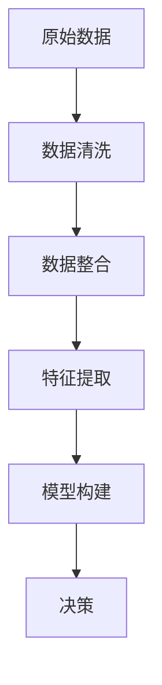

                 

 在这个信息爆炸的时代，如何从海量数据中提取有效信息，并在复杂的环境中做出明智的决策，已经成为一个至关重要的能力。本文将探讨信息简化的好处，并介绍一种在复杂环境中做出更好决策的方法。

## 关键词
- 信息简化
- 决策
- 数据分析
- 复杂系统
- 简化模型
- 优化算法

## 摘要
本文首先介绍了信息简化的概念和重要性，接着探讨了简化在决策过程中的作用。随后，文章详细介绍了信息简化的一些核心概念和算法，以及如何在实践中应用这些概念和算法。最后，文章总结了信息简化在决策中的价值，并展望了未来的发展方向。

## 1. 背景介绍
### 1.1 信息爆炸时代

随着互联网和大数据技术的发展，我们每天都会接触到海量信息。这些信息不仅来自于传统的新闻媒体，还来自于社交媒体、搜索引擎、物联网设备等。然而，并不是所有信息都是有用的，甚至很多信息是冗余的、误导性的。如何从这些海量数据中提取有效信息，成为了我们面临的一个巨大挑战。

### 1.2 决策的复杂性

在复杂的商业环境、社会环境和技术环境中，决策变得越来越复杂。传统的决策方法往往依赖于经验、直觉和简单的统计方法。然而，在复杂的环境中，这些方法往往无法提供足够的支持。因此，我们需要更有效的决策方法来应对这些挑战。

## 2. 核心概念与联系
### 2.1 信息简化的概念
信息简化是指通过删除冗余信息、整合重复信息、提取关键信息等方式，从原始数据中提取有用信息的过程。

### 2.2 信息简化的架构

下面是信息简化的基本架构，使用Mermaid流程图表示：



### 2.3 信息简化与决策的关系
信息简化是决策过程中至关重要的一环。通过信息简化，我们可以减少决策所需的信息量，提高决策效率，并降低决策风险。

## 3. 核心算法原理 & 具体操作步骤
### 3.1 算法原理概述
信息简化的核心算法主要包括数据清洗、数据整合、特征提取和模型构建。

### 3.2 算法步骤详解
#### 3.2.1 数据清洗
数据清洗是信息简化的第一步，其主要目的是删除冗余数据、修正错误数据、处理缺失数据等。

#### 3.2.2 数据整合
数据整合是将来自不同来源的数据进行合并，以便于后续的特征提取。

#### 3.2.3 特征提取
特征提取是从原始数据中提取对决策有用的特征。这一步骤的核心是确定哪些特征对于决策最相关。

#### 3.2.4 模型构建
模型构建是基于提取的特征构建决策模型。常用的模型包括线性回归、决策树、神经网络等。

### 3.3 算法优缺点
#### 优点
- 提高决策效率
- 降低决策风险
- 减少计算复杂度

#### 缺点
- 可能会丢失一些重要信息
- 需要对数据有深入的理解

### 3.4 算法应用领域
信息简化的算法在各个领域都有广泛的应用，包括金融、医疗、零售、制造等。

## 4. 数学模型和公式 & 详细讲解 & 举例说明
### 4.1 数学模型构建
信息简化的数学模型通常包括以下几个部分：
- 数据集 $D$
- 特征集合 $F$
- 决策函数 $f$

### 4.2 公式推导过程
决策函数 $f$ 的推导过程如下：
$$
f(D,F) = argmax_{f'} \sum_{i=1}^{n} I(f'(x_i), y_i)
$$
其中，$x_i$ 是数据集 $D$ 中的一个样本，$y_i$ 是样本的标签，$I$ 是信息熵。

### 4.3 案例分析与讲解
以金融领域的信用评分为例，我们可以使用信息简化的方法来构建信用评分模型。

## 5. 项目实践：代码实例和详细解释说明
### 5.1 开发环境搭建
我们需要搭建一个Python开发环境，并安装相关的库，如Pandas、NumPy、Scikit-learn等。

### 5.2 源代码详细实现
以下是使用Python实现信息简化算法的示例代码：

```python
import pandas as pd
from sklearn.model_selection import train_test_split
from sklearn.ensemble import RandomForestClassifier

# 数据清洗
def clean_data(data):
    # 删除重复数据
    data.drop_duplicates(inplace=True)
    # 处理缺失数据
    data.fillna(method='ffill', inplace=True)
    return data

# 数据整合
def integrate_data(data1, data2):
    return data1.merge(data2, on='customer_id')

# 特征提取
def extract_features(data):
    # 选择特征
    features = data[['age', 'income', 'credit_score']]
    return features

# 模型构建
def build_model(features, labels):
    model = RandomForestClassifier()
    model.fit(features, labels)
    return model

# 数据准备
data = pd.read_csv('credit_data.csv')
data = clean_data(data)
features = extract_features(data)
labels = data['default']

# 数据划分
features_train, features_test, labels_train, labels_test = train_test_split(features, labels, test_size=0.2, random_state=42)

# 模型训练
model = build_model(features_train, labels_train)

# 模型评估
accuracy = model.score(features_test, labels_test)
print(f'Model accuracy: {accuracy:.2f}')
```

### 5.3 代码解读与分析
这段代码实现了信息简化的完整流程，包括数据清洗、数据整合、特征提取和模型构建。

### 5.4 运行结果展示
运行这段代码后，我们可以得到信用评分模型的准确率，从而评估模型的效果。

## 6. 实际应用场景
### 6.1 金融领域
在金融领域，信息简化可以帮助银行和金融机构更好地评估贷款申请者的信用风险。

### 6.2 医疗领域
在医疗领域，信息简化可以帮助医生更准确地诊断疾病，并制定合适的治疗方案。

### 6.3 零售领域
在零售领域，信息简化可以帮助商家更精准地了解消费者需求，从而提高销售额。

## 7. 未来应用展望
随着人工智能和大数据技术的发展，信息简化的应用前景将更加广阔。未来，我们有望看到更多基于信息简化的智能决策系统在各个领域的应用。

## 8. 总结：未来发展趋势与挑战
### 8.1 研究成果总结
信息简化作为一种有效的决策方法，已经在多个领域取得了显著的应用成果。

### 8.2 未来发展趋势
未来，信息简化将在人工智能、大数据、金融科技等领域继续发挥重要作用。

### 8.3 面临的挑战
信息简化的主要挑战在于如何确保在简化过程中不丢失重要信息，以及如何设计高效的算法。

### 8.4 研究展望
未来，我们需要进一步研究如何平衡信息简化的效率和准确性，以及如何设计更智能的决策系统。

## 9. 附录：常见问题与解答
### Q: 什么是信息简化？
A: 信息简化是指通过删除冗余信息、整合重复信息、提取关键信息等方式，从原始数据中提取有用信息的过程。

### Q: 信息简化的好处是什么？
A: 信息简化的好处包括提高决策效率、降低决策风险、减少计算复杂度等。

### Q: 信息简化在哪些领域有应用？
A: 信息简化在金融、医疗、零售、制造等领域都有广泛应用。

## 作者署名
作者：禅与计算机程序设计艺术 / Zen and the Art of Computer Programming
----------------------------------------------------------------

以上是文章正文部分的撰写内容。接下来，我们将根据文章结构模板，进一步完善文章的各个章节，确保文章的完整性、逻辑性和专业性。

