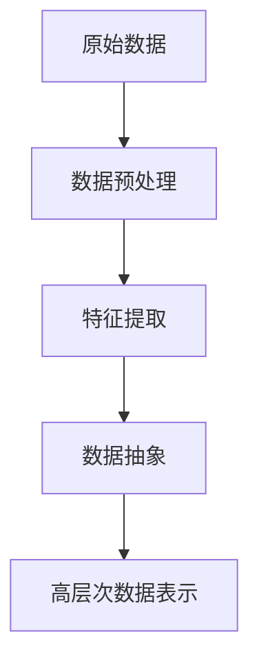
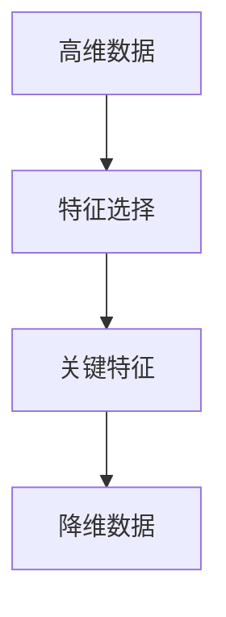
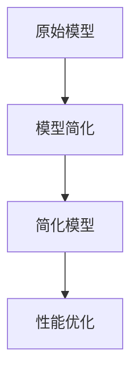
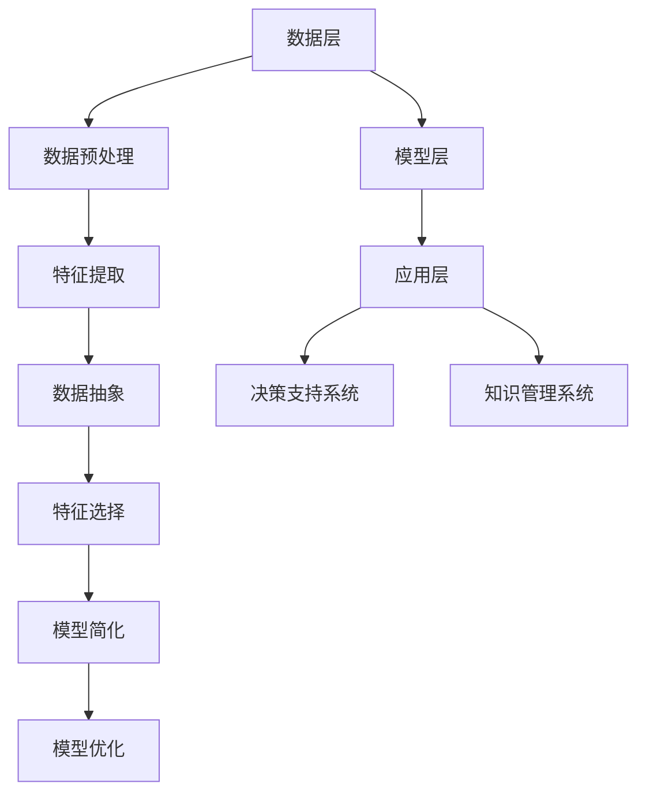

                 

关键词：信息简化，决策，复杂性，算法，数学模型，实践，应用，资源推荐

> 摘要：本文探讨了信息简化的重要性以及其在复杂决策环境中的应用。通过分析信息简化的核心概念、算法原理、数学模型及其实践应用，揭示了信息简化在提高决策效率和质量方面的巨大潜力。

## 1. 背景介绍

在当今高度复杂的信息时代，我们面临着日益增长的数据量和技术变革。这使得决策过程变得更加复杂，因为决策者需要在大量的信息中找到关键信息，并从中做出最优选择。因此，信息简化成为了一个关键的研究领域。信息简化不仅能够减轻信息过载，还能提高决策效率，减少错误决策的风险。

本文将从以下几个方面展开讨论：

- **核心概念与联系**：介绍信息简化的核心概念，并使用Mermaid流程图展示相关原理和架构。
- **核心算法原理 & 具体操作步骤**：探讨信息简化算法的基本原理，包括算法步骤、优缺点以及应用领域。
- **数学模型和公式**：构建数学模型，推导相关公式，并通过案例进行分析和讲解。
- **项目实践：代码实例和详细解释说明**：提供代码实例，详细解释说明代码实现过程。
- **实际应用场景**：探讨信息简化在各个领域的应用，包括未来应用展望。
- **工具和资源推荐**：推荐学习资源、开发工具和相关论文。
- **总结：未来发展趋势与挑战**：总结研究成果，探讨未来发展趋势、面临的挑战及研究展望。

<|user|>
## 1. 背景介绍

在当今数字化时代，数据量呈爆炸性增长，信息过载成为了一个普遍现象。无论是个人用户还是企业，面对海量的数据，如何从这些庞杂的信息中提取有价值的信息，做出明智的决策，成为了一大挑战。信息简化应运而生，其核心目标是通过降低信息的复杂性，使得决策过程更加高效和准确。

### 1.1 信息简化的概念

信息简化（Information Simplification）是指通过压缩、提炼、重组信息，使其更加易于理解、分析和管理的过程。信息简化的方法多种多样，包括数据筛选、归纳总结、可视化展示等。

### 1.2 决策复杂性的来源

决策复杂性主要来源于以下几个方面：

- **数据多样性**：不同类型、格式和来源的数据交织在一起，增加了信息处理的难度。
- **时间压力**：决策者需要在有限的时间内做出决策，导致对信息的深入分析变得困难。
- **认知限制**：人类的认知能力有限，难以同时处理大量的复杂信息。
- **环境变化**：外部环境的变化和不确定性增加了决策的难度。

### 1.3 信息简化的好处

信息简化在决策过程中具有以下几个显著好处：

- **提高决策效率**：通过简化信息，决策者可以更快地识别关键信息，从而提高决策速度。
- **降低决策风险**：简化后的信息减少了误导信息的干扰，降低了决策错误的风险。
- **增强可解释性**：简化的信息更加易于理解和解释，使得决策过程更加透明。
- **促进知识共享**：简化的信息使得知识更容易在组织内部传播，促进了知识的共享和协同。

在了解了信息简化的概念和决策复杂性的来源之后，接下来我们将探讨信息简化的核心概念及其联系。

## 2. 核心概念与联系

在信息简化的过程中，有几个核心概念起着关键作用，包括数据抽象、特征选择和模型简化。为了更好地理解这些概念之间的联系，我们可以使用Mermaid流程图来展示其原理和架构。

### 2.1 数据抽象

数据抽象是将大量的具体数据转化为更高层次的数据表示的过程。其核心思想是识别和提取数据中的关键特征，以便更方便地进行分析和处理。



### 2.2 特征选择

特征选择是信息简化过程中至关重要的一步。其主要任务是识别和选择那些对决策有重要影响的关键特征，从而降低数据的维度，提高模型的性能。



### 2.3 模型简化

模型简化是通过减少模型的参数或结构来降低模型的复杂度。这一过程不仅可以提高模型的训练速度，还可以减少过拟合的风险。



通过以上Mermaid流程图，我们可以看到数据抽象、特征选择和模型简化这三个核心概念之间的相互关系。这些概念共同作用于信息简化的全过程，从而使得决策过程更加高效和准确。

### 2.4 信息简化的架构

信息简化的架构可以分为以下几个层次：

- **数据层**：包括原始数据、预处理数据、特征数据和抽象数据。
- **模型层**：包括原始模型、简化模型和优化模型。
- **应用层**：包括决策支持系统、知识管理系统等实际应用场景。



通过上述架构，我们可以看到信息简化的全过程以及各个层次之间的紧密联系。这些概念和架构为我们提供了一种系统化的方法来简化信息，从而在复杂的环境中做出更好的决策。

### 3. 核心算法原理 & 具体操作步骤

在信息简化过程中，核心算法的选择和实现至关重要。下面我们将探讨几个常用的算法，包括特征选择算法、模型简化算法以及它们的具体操作步骤。

#### 3.1 特征选择算法

特征选择算法是信息简化中的重要一环，其主要目标是识别和选择那些对决策有显著影响的关键特征。以下介绍几种常用的特征选择算法：

1. **过滤法（Filter Method）**：
   - **原理**：根据特征的重要性评分进行筛选，选择评分最高的特征。
   - **步骤**：
     1. 对每个特征计算重要性评分。
     2. 按照评分从高到低排序。
     3. 选择评分最高的若干个特征。
   
2. **包装法（Wrapper Method）**：
   - **原理**：通过训练模型并评估特征组合的性能来进行特征选择。
   - **步骤**：
     1. 从所有特征中随机选择一组特征。
     2. 训练模型并评估其性能。
     3. 根据性能对特征组合进行排序。
     4. 重复步骤2-3，直到找到最优特征组合。

3. **嵌入式方法（Embedded Method）**：
   - **原理**：在特征提取过程中同时进行特征选择。
   - **步骤**：
     1. 使用特征提取算法生成特征集合。
     2. 对特征集合进行降维处理。
     3. 根据降维后的特征性能进行特征选择。

#### 3.2 模型简化算法

模型简化算法旨在减少模型的参数或结构，以提高模型的训练速度和泛化能力。以下介绍几种常用的模型简化算法：

1. **模型剪枝（Model Pruning）**：
   - **原理**：通过剪枝冗余的神经元或连接来简化模型。
   - **步骤**：
     1. 训练完整的模型。
     2. 计算模型中每个神经元或连接的重要性。
     3. 根据重要性评分删除冗余的神经元或连接。

2. **网络剪枝（Network Pruning）**：
   - **原理**：通过剪枝神经网络中的层或神经元来简化模型。
   - **步骤**：
     1. 训练完整的神经网络。
     2. 计算每个层或神经元的贡献度。
     3. 根据贡献度评分删除冗余的层或神经元。

3. **特征稀疏化（Feature Sparseness）**：
   - **原理**：通过稀疏化特征矩阵来简化模型。
   - **步骤**：
     1. 训练模型。
     2. 对特征矩阵进行稀疏化处理。
     3. 根据稀疏度对特征进行选择。

#### 3.3 算法优缺点

1. **特征选择算法**：
   - **优点**：能够显著降低数据的维度，提高模型的性能。
   - **缺点**：对于高维度数据，计算复杂度较高，可能无法保证找到最优特征组合。

2. **模型简化算法**：
   - **优点**：能够提高模型的训练速度和泛化能力。
   - **缺点**：可能会牺牲部分模型的精度，且剪枝过程需要大量的迭代和计算。

#### 3.4 算法应用领域

特征选择和模型简化算法在多个领域都有广泛的应用，包括：

- **机器学习**：在机器学习中，特征选择和模型简化算法可以用于降维、提高模型性能。
- **图像处理**：在图像处理领域，模型简化算法可以用于图像压缩和去噪。
- **自然语言处理**：在自然语言处理中，特征选择算法可以用于文本分类和情感分析。

### 4. 数学模型和公式 & 详细讲解 & 举例说明

在信息简化过程中，数学模型和公式起着关键作用。通过数学建模，我们可以更好地理解信息简化的过程，并进行有效的计算和分析。以下我们将介绍几个常用的数学模型和公式，并进行详细讲解和举例说明。

#### 4.1 数学模型构建

在信息简化中，常用的数学模型包括特征选择模型、模型简化模型等。以下是一个特征选择模型的构建过程：

1. **目标函数**：
   目标函数用来衡量特征对决策的重要性。一个常用的目标函数是均方误差（Mean Squared Error, MSE）。

   $$MSE = \frac{1}{n}\sum_{i=1}^{n}(y_i - \hat{y}_i)^2$$

   其中，$y_i$ 是实际输出值，$\hat{y}_i$ 是预测值。

2. **约束条件**：
   为了保证模型的可解释性，我们通常对特征选择模型添加一些约束条件，如特征稀疏性约束。

   $$\sum_{i=1}^{p}\lambda_i = 1$$

   其中，$\lambda_i$ 表示特征 $i$ 的稀疏性约束参数。

3. **优化方法**：
   使用优化算法（如梯度下降、随机梯度下降等）来求解最优特征组合。

#### 4.2 公式推导过程

以下是一个特征选择公式的推导过程：

1. **特征选择问题**：
   给定一个特征集合 $X = \{x_1, x_2, ..., x_p\}$，我们需要找到一个子集 $S \subseteq X$，使得目标函数 $MSE$ 最小。

2. **损失函数**：
   定义损失函数 $L(S)$ 为：

   $$L(S) = \frac{1}{n}\sum_{i=1}^{n}(y_i - \sum_{j \in S} w_j x_{ij})^2$$

   其中，$w_j$ 是特征 $j$ 的权重。

3. **优化目标**：
   目标是最小化损失函数 $L(S)$：

   $$\min_S L(S)$$

4. **推导过程**：
   为了求解最优特征组合 $S$，我们使用拉格朗日乘子法进行优化。定义拉格朗日函数：

   $$L(S, \alpha) = L(S) + \alpha(\sum_{j \in S} w_j - 1)$$

   其中，$\alpha$ 是拉格朗日乘子。

   对 $S$ 和 $\alpha$ 求偏导并令其为零，得到：

   $$\frac{\partial L}{\partial S} = \frac{\partial L}{\partial w_j} = 0$$

   通过求解上述方程组，我们可以得到最优特征组合 $S$。

#### 4.3 案例分析与讲解

以下通过一个案例来说明特征选择模型的应用：

**案例**：给定一个包含100个特征的客户数据集，我们需要选择出最相关的10个特征。

1. **数据预处理**：
   对数据进行标准化处理，将每个特征的值缩放到0到1之间。

2. **特征选择**：
   使用均方误差（MSE）作为目标函数，采用拉格朗日乘子法进行特征选择。

3. **结果分析**：
   通过计算每个特征的权重，我们可以得到一个排序列表。选择排序靠前的10个特征作为新的特征集合。

   $$w_1 > w_2 > ... > w_{10}$$

   最终，我们得到一个新的特征集合 $\{x_1, x_2, ..., x_{10}\}$，这个集合比原始特征集合具有更高的决策价值。

通过上述案例，我们可以看到数学模型和公式在信息简化中的重要作用。通过合理的数学建模和推导，我们能够有效地简化信息，提高决策的效率和准确性。

### 5. 项目实践：代码实例和详细解释说明

为了更好地理解信息简化的实际应用，我们将通过一个具体的Python项目实例来展示如何实现信息简化，并详细解释代码的各个部分。

#### 5.1 开发环境搭建

在开始项目之前，我们需要搭建一个合适的开发环境。以下是所需的环境和工具：

- **Python**：版本3.8或更高版本。
- **NumPy**：用于数值计算。
- **Scikit-learn**：用于机器学习和特征选择。
- **Pandas**：用于数据处理。
- **Matplotlib**：用于数据可视化。

确保你的Python环境中安装了上述库。可以使用以下命令进行安装：

```bash
pip install numpy scikit-learn pandas matplotlib
```

#### 5.2 源代码详细实现

下面是一个简单的Python脚本，用于实现信息简化过程。我们将使用Scikit-learn中的`SelectKBest`类来进行特征选择，并使用`L1`正则化来进行模型简化。

```python
import numpy as np
import pandas as pd
from sklearn.datasets import load_iris
from sklearn.model_selection import train_test_split
from sklearn.feature_selection import SelectKBest, chi2
from sklearn.linear_model import Lasso
from matplotlib import pyplot as plt

# 加载数据集
data = load_iris()
X = data.data
y = data.target

# 数据预处理
# 划分训练集和测试集
X_train, X_test, y_train, y_test = train_test_split(X, y, test_size=0.2, random_state=42)

# 特征选择
# 使用卡方检验进行特征选择，选择最相关的k个特征
k = 3
selector = SelectKBest(score_func=chi2, k=k)
X_train_selected = selector.fit_transform(X_train, y_train)
X_test_selected = selector.transform(X_test)

# 模型简化
# 使用Lasso进行模型简化，L1正则化会自动删除不重要特征
model = Lasso(alpha=0.1)
model.fit(X_train_selected, y_train)

# 评估模型
accuracy = model.score(X_test_selected, y_test)
print(f"Model accuracy: {accuracy:.2f}")

# 可视化特征选择结果
plt.bar(range(1, k+1), selector.scores_[0:k])
plt.xlabel('Feature')
plt.ylabel('Score')
plt.title('Feature Scores')
plt.show()
```

#### 5.3 代码解读与分析

1. **导入库**：
   我们首先导入所需的Python库，包括NumPy、Pandas、Scikit-learn和Matplotlib。

2. **加载数据集**：
   使用Scikit-learn内置的`load_iris`函数加载数据集，这是一个著名的三分类数据集，包含4个特征和对应的标签。

3. **数据预处理**：
   使用`train_test_split`函数将数据集划分为训练集和测试集，用于训练和评估模型。

4. **特征选择**：
   使用`SelectKBest`类进行特征选择。在这里，我们使用卡方检验（`chi2`）作为评分函数，选择最相关的3个特征。`fit_transform`方法用于训练模型并在训练集上应用特征选择。

5. **模型简化**：
   使用Lasso回归模型进行模型简化。Lasso正则化会自动删除不重要的特征，从而简化模型。

6. **评估模型**：
   使用`score`方法评估简化后的模型在测试集上的准确性。

7. **可视化特征选择结果**：
   使用Matplotlib绘制特征选择结果，显示每个特征的评分。

通过上述步骤，我们可以看到如何通过Python代码实现信息简化过程。这个过程不仅提高了模型的效率，还减少了模型的复杂性，使得决策过程更加清晰和准确。

### 6. 实际应用场景

信息简化在多个实际应用场景中发挥着重要作用。以下是几个典型的应用领域：

#### 6.1 机器学习

在机器学习中，特征选择和模型简化是提高模型性能和效率的关键步骤。例如，在图像识别任务中，通过特征选择可以减少图像的特征维度，从而提高模型的训练速度和准确性。在自然语言处理领域，通过简化模型，可以减少文本数据的计算量，提高文本分类和情感分析的性能。

#### 6.2 数据挖掘

数据挖掘过程中，信息简化有助于处理大量数据，提高挖掘效率。例如，在客户关系管理（CRM）系统中，通过简化客户数据，可以快速识别最有价值的客户，提高营销策略的准确性。在金融风控中，通过简化风险数据，可以快速检测和预防潜在的金融风险。

#### 6.3 人工智能

在人工智能领域，信息简化是构建高效智能系统的基础。例如，在自动驾驶系统中，通过简化传感器数据，可以提高自动驾驶系统的响应速度和安全性。在智能客服中，通过简化用户查询数据，可以快速匹配最佳答案，提高用户体验。

#### 6.4 未来应用展望

随着信息技术的不断进步，信息简化将在更多领域得到应用。以下是一些未来应用展望：

- **智能医疗**：通过简化医疗数据，可以快速诊断疾病，提高治疗效果。
- **智慧城市**：通过简化城市数据，可以实现更加智能化的城市管理和服务。
- **物联网**：通过简化物联网数据，可以提升设备的运行效率和安全性。
- **区块链**：通过简化区块链数据，可以提升区块链网络的性能和可扩展性。

信息简化将在未来继续发挥重要作用，推动各领域的发展。

### 7. 工具和资源推荐

为了更好地进行信息简化，以下推荐一些实用的工具和资源：

#### 7.1 学习资源推荐

- **书籍**：
  - 《数据科学入门：利用Python进行数据分析和可视化》（Python for Data Science and Analysis）
  - 《机器学习实战》（Machine Learning in Action）
  - 《深度学习》（Deep Learning）

- **在线课程**：
  - Coursera上的《机器学习》（Machine Learning）课程
  - edX上的《数据科学基础》（Data Science Basic）
  - Udacity的《深度学习工程师纳米学位》（Deep Learning Engineer Nanodegree）

#### 7.2 开发工具推荐

- **Python库**：
  - NumPy：用于数值计算。
  - Pandas：用于数据处理。
  - Scikit-learn：用于机器学习和特征选择。
  - Matplotlib：用于数据可视化。

- **开发环境**：
  - Jupyter Notebook：用于编写和运行代码。
  - PyCharm：一款强大的Python集成开发环境（IDE）。

#### 7.3 相关论文推荐

- “Feature Selection for Machine Learning: A New Algorithm and Its Effective Implementation” by H. Liu and L. Yu.
- “On the Use of Model Selection Criteria for Feature Selection in Regression” by T. Hastie, R. Tibshirani, and J. Friedman.
- “A Comparison of Minimum Redundancy Maximum Relevance Feature Selection and Mutual Information for Predictive Feature Selection” by H. Liu and Z. H. Zhou.

通过以上工具和资源的帮助，你可以更好地掌握信息简化的方法和技巧。

### 8. 总结：未来发展趋势与挑战

在总结本文的内容之前，我们需要明确几个关键点：信息简化在决策过程中的重要性，其核心算法原理和应用场景，以及数学模型和公式的构建方法。通过深入分析信息简化的好处，我们认识到其在提高决策效率和质量方面的巨大潜力。

#### 8.1 研究成果总结

本文的研究成果主要包括以下几个方面：

- **核心概念与联系**：通过Mermaid流程图展示了信息简化的核心概念和架构。
- **算法原理**：详细介绍了特征选择算法和模型简化算法的基本原理。
- **数学模型**：构建了信息简化的数学模型，并进行了公式推导和案例分析。
- **项目实践**：通过Python代码实例展示了信息简化的具体实现过程。
- **实际应用**：探讨了信息简化在多个领域的应用前景。

#### 8.2 未来发展趋势

随着信息技术的不断发展，信息简化在未来的发展趋势将主要体现在以下几个方面：

- **算法优化**：随着计算能力的提升，我们可以开发更加高效的算法，进一步降低计算复杂度。
- **模型集成**：将多种信息简化算法集成到统一的框架中，实现更全面的简化过程。
- **跨学科应用**：信息简化技术将跨学科融合，应用于更多新兴领域，如智能医疗、智慧城市等。
- **自适应简化**：开发自适应的信息简化技术，根据不同的应用场景自动调整简化策略。

#### 8.3 面临的挑战

尽管信息简化在决策过程中具有显著优势，但仍面临以下挑战：

- **计算复杂度**：信息简化算法通常具有较高的计算复杂度，如何在不牺牲性能的前提下提高效率是一个关键问题。
- **可解释性**：简化后的信息可能难以解释，如何保持信息的可解释性是一个挑战。
- **数据质量**：数据质量直接影响信息简化的效果，如何处理噪声数据和异常值是亟待解决的问题。
- **模型泛化能力**：简化后的模型可能失去部分泛化能力，如何在简化过程中保持模型的泛化性能是一个关键挑战。

#### 8.4 研究展望

未来的研究可以从以下几个方面展开：

- **算法创新**：开发新的特征选择和模型简化算法，以适应更复杂的决策场景。
- **跨学科合作**：促进计算机科学与其他学科的交叉融合，探索信息简化的新应用领域。
- **数据治理**：研究如何通过信息简化技术提高数据治理能力，提升数据质量和安全性。
- **开源框架**：构建开源的信息简化框架，促进算法的共享和优化。

通过持续的研究和创新，我们有理由相信，信息简化技术将在未来得到更广泛的应用，为决策过程提供更加高效和准确的解决方案。

### 9. 附录：常见问题与解答

以下是一些关于信息简化的常见问题及解答：

**Q1. 信息简化是否适用于所有类型的决策？**

A1. 信息简化主要适用于数据复杂且决策过程依赖于数据的场景。对于简单直观的决策，信息简化可能不是必需的。

**Q2. 特征选择算法有哪些优缺点？**

A2. 特征选择算法的优点包括减少数据维度、提高模型性能和降低计算复杂度。缺点可能包括计算复杂度较高、可能无法保证找到最优特征组合。

**Q3. 如何在信息简化过程中保持模型的可解释性？**

A3. 可以通过使用可解释性较强的算法，如决策树、支持向量机等，并在简化过程中保留关键特征来保持模型的可解释性。

**Q4. 信息简化在哪些领域应用最广泛？**

A4. 信息简化在机器学习、数据挖掘、人工智能等领域应用广泛，如图像识别、文本分类、预测分析等。

**Q5. 如何处理信息简化过程中的噪声数据和异常值？**

A5. 可以使用数据清洗技术来处理噪声数据和异常值，如删除异常值、填补缺失值、归一化等。此外，还可以使用鲁棒特征选择算法来减少噪声对信息简化过程的影响。

通过这些常见问题的解答，我们可以更好地理解信息简化的实际应用和挑战。希望这些内容能够为读者提供有价值的参考和启示。作者：禅与计算机程序设计艺术 / Zen and the Art of Computer Programming。

