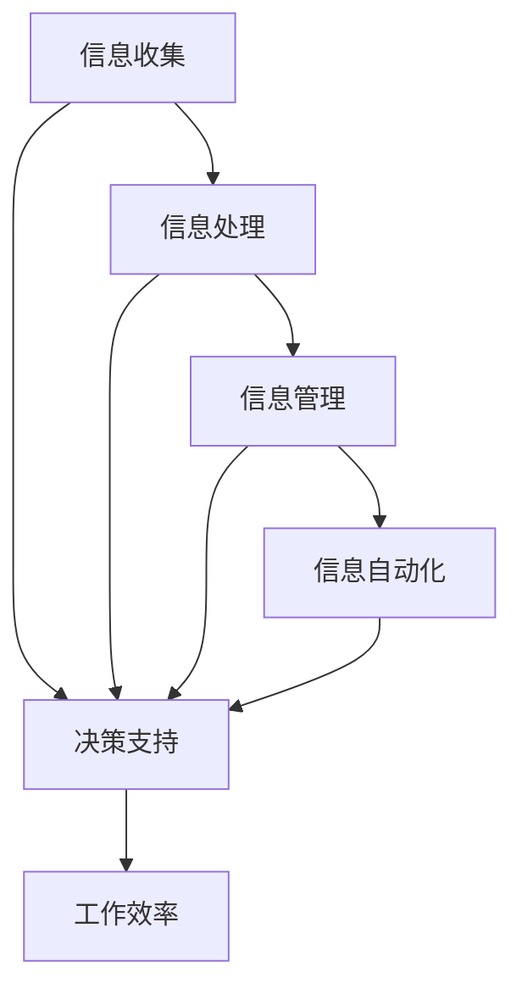

                 

在这个快速发展的数字时代，我们面临着信息过载和数据泛滥的问题。为了应对这种挑战，我们需要利用高效的工具和技术来简化我们的生活和工作的复杂性。本文将探讨如何通过信息简化和自动化，利用技术提高效率，减少冗余，实现更高效的工作和生活方式。

## 1. 背景介绍

在过去几十年中，信息技术经历了翻天覆地的变化。从早期的计算机到移动互联网，再到如今的人工智能和物联网，技术不断演进，改变了我们的生活方式和工作方式。然而，随着技术的进步，我们也面临着信息过载和数据泛滥的问题。如何有效管理和利用这些信息，成为了当前的一个重大挑战。

### 信息过载的原因

信息过载的原因主要有以下几点：

1. **数据的爆炸性增长**：随着互联网的普及，我们每天接触到的大量信息使得我们的思维变得混乱。
2. **信息源的多样性**：社交媒体、新闻网站、邮件、即时通讯等渠道的信息不断涌入，难以筛选和整理。
3. **工作方式的改变**：远程工作和协作工具的普及，使得我们需要处理的信息量大大增加。

### 信息过载的影响

信息过载对我们的影响主要体现在以下几个方面：

1. **时间管理问题**：我们需要花费大量时间来筛选和处理信息，影响了我们的工作效率。
2. **心理健康问题**：长期处于信息过载的状态，容易导致焦虑、疲劳等心理健康问题。
3. **决策困难**：大量的信息可能会导致我们无法做出明确的决策，从而影响我们的工作表现。

## 2. 核心概念与联系

为了解决信息过载的问题，我们需要了解一些核心概念，包括信息的处理、管理和自动化。以下是一个简化的 Mermaid 流程图，展示这些概念之间的联系：



### 2.1 信息收集

信息收集是信息处理的第一步，它涉及从各种来源获取信息。这些来源可能包括网络、书籍、文件、传感器等。信息收集的过程需要高效、准确，以便为后续处理和管理提供高质量的数据。

### 2.2 信息处理

信息处理是对收集到的信息进行整理、分析和转换的过程。这一步骤的关键在于去除冗余信息，提取关键信息，为后续的信息管理和自动化打下基础。

### 2.3 信息管理

信息管理是对处理后的信息进行存储、分类、备份和检索的过程。有效的信息管理可以提高信息的使用效率和可靠性，为自动化提供数据支持。

### 2.4 信息自动化

信息自动化是利用技术手段对信息处理和管理的自动化。通过自动化，我们可以减少人工干预，提高工作效率，降低错误率。

### 2.5 决策支持

决策支持是信息处理和自动化的最终目标。通过高效的信息处理和管理，我们可以为决策者提供准确、及时的信息支持，帮助他们做出更明智的决策。

## 3. 核心算法原理 & 具体操作步骤

### 3.1 算法原理概述

为了实现信息的简化和自动化，我们可以采用以下几种核心算法：

1. **数据清洗算法**：用于去除冗余信息和噪声，提高数据质量。
2. **数据分类算法**：用于将数据分为不同的类别，便于管理和分析。
3. **机器学习算法**：用于从数据中提取规律和模式，为自动化提供支持。

### 3.2 算法步骤详解

#### 3.2.1 数据清洗算法

数据清洗算法的主要步骤如下：

1. **缺失值处理**：对缺失的数据进行填补或删除。
2. **异常值处理**：对异常的数据进行标记或删除。
3. **数据格式转换**：将数据转换为统一的格式，便于后续处理。

#### 3.2.2 数据分类算法

数据分类算法的主要步骤如下：

1. **特征提取**：从数据中提取具有区分性的特征。
2. **模型训练**：使用训练数据集训练分类模型。
3. **模型评估**：使用测试数据集评估分类模型的性能。

#### 3.2.3 机器学习算法

机器学习算法的主要步骤如下：

1. **数据预处理**：对数据集进行清洗和格式转换。
2. **特征选择**：选择对模型性能有显著影响的关键特征。
3. **模型训练**：使用训练数据集训练模型。
4. **模型评估**：使用测试数据集评估模型性能。
5. **模型优化**：根据评估结果调整模型参数，提高性能。

### 3.3 算法优缺点

每种算法都有其优缺点：

1. **数据清洗算法**：优点是能够提高数据质量，缺点是需要大量的时间和计算资源。
2. **数据分类算法**：优点是能够将数据分为不同的类别，便于管理和分析，缺点是需要大量的训练数据。
3. **机器学习算法**：优点是能够从数据中自动提取规律和模式，缺点是需要大量的训练数据和计算资源。

### 3.4 算法应用领域

这些算法在各个领域都有广泛的应用：

1. **金融领域**：用于数据分析和风险管理。
2. **医疗领域**：用于疾病诊断和治疗方案推荐。
3. **电商领域**：用于用户行为分析和个性化推荐。
4. **制造业**：用于设备维护和故障预测。

## 4. 数学模型和公式 & 详细讲解 & 举例说明

### 4.1 数学模型构建

为了更好地理解信息简化和自动化的算法，我们需要了解一些基本的数学模型和公式。

#### 4.1.1 线性回归模型

线性回归模型是一种常用的数据分析和预测模型。其公式如下：

$$
y = \beta_0 + \beta_1x_1 + \beta_2x_2 + \ldots + \beta_nx_n
$$

其中，$y$ 是因变量，$x_1, x_2, \ldots, x_n$ 是自变量，$\beta_0, \beta_1, \beta_2, \ldots, \beta_n$ 是模型的参数。

#### 4.1.2 逻辑回归模型

逻辑回归模型是一种常用的分类模型。其公式如下：

$$
\pi = \frac{1}{1 + e^{-(\beta_0 + \beta_1x_1 + \beta_2x_2 + \ldots + \beta_nx_n)}}
$$

其中，$\pi$ 是因变量的概率，$\beta_0, \beta_1, \beta_2, \ldots, \beta_n$ 是模型的参数。

### 4.2 公式推导过程

#### 4.2.1 线性回归模型的推导

线性回归模型的基本假设是数据呈线性关系。我们可以通过最小二乘法来推导线性回归模型的公式。

假设我们有 $n$ 个样本点 $(x_1, y_1), (x_2, y_2), \ldots, (x_n, y_n)$，我们的目标是找到一个线性函数 $y = \beta_0 + \beta_1x_1 + \beta_2x_2 + \ldots + \beta_nx_n$，使得这些样本点的误差最小。

我们可以通过以下公式计算误差：

$$
E = \sum_{i=1}^{n}(y_i - (\beta_0 + \beta_1x_i + \beta_2x_i + \ldots + \beta_nx_i))^2
$$

为了使误差最小，我们需要对 $\beta_0, \beta_1, \beta_2, \ldots, \beta_n$ 求导并令导数为零，得到以下方程组：

$$
\frac{\partial E}{\partial \beta_0} = 0, \frac{\partial E}{\partial \beta_1} = 0, \frac{\partial E}{\partial \beta_2} = 0, \ldots, \frac{\partial E}{\partial \beta_n} = 0
$$

通过求解这个方程组，我们可以得到线性回归模型的参数。

#### 4.2.2 逻辑回归模型的推导

逻辑回归模型的推导与线性回归模型类似。我们假设数据呈逻辑关系，即 $y$ 是一个概率分布，可以用逻辑函数表示：

$$
\pi = \frac{1}{1 + e^{-(\beta_0 + \beta_1x_1 + \beta_2x_2 + \ldots + \beta_nx_n)}}
$$

我们的目标是找到一组参数 $\beta_0, \beta_1, \beta_2, \ldots, \beta_n$，使得对数似然函数最大。

对数似然函数为：

$$
L = \sum_{i=1}^{n}y_i \ln(\pi) + (1 - y_i) \ln(1 - \pi)
$$

为了使对数似然函数最大，我们需要对 $\beta_0, \beta_1, \beta_2, \ldots, \beta_n$ 求导并令导数为零，得到以下方程组：

$$
\frac{\partial L}{\partial \beta_0} = 0, \frac{\partial L}{\partial \beta_1} = 0, \frac{\partial L}{\partial \beta_2} = 0, \ldots, \frac{\partial L}{\partial \beta_n} = 0
$$

通过求解这个方程组，我们可以得到逻辑回归模型的参数。

### 4.3 案例分析与讲解

#### 4.3.1 线性回归模型案例

假设我们有一个数据集，其中包含房屋的面积和房价。我们的目标是建立一个线性回归模型，预测房屋的价格。

我们首先对数据集进行预处理，去除缺失值和异常值，然后将数据集分为训练集和测试集。

接下来，我们使用线性回归模型对训练集进行训练，得到参数 $\beta_0, \beta_1$。

最后，我们使用测试集评估模型的性能，计算预测误差，调整模型参数，直到达到满意的性能。

#### 4.3.2 逻辑回归模型案例

假设我们有一个数据集，其中包含客户的特征和购买行为。我们的目标是建立一个逻辑回归模型，预测客户是否会购买产品。

我们同样对数据集进行预处理，去除缺失值和异常值，然后将数据集分为训练集和测试集。

接下来，我们使用逻辑回归模型对训练集进行训练，得到参数 $\beta_0, \beta_1, \beta_2, \ldots, \beta_n$。

最后，我们使用测试集评估模型的性能，计算预测准确率，调整模型参数，直到达到满意的性能。

## 5. 项目实践：代码实例和详细解释说明

### 5.1 开发环境搭建

为了实现信息简化和自动化，我们需要搭建一个合适的开发环境。以下是一个简单的环境搭建步骤：

1. 安装 Python：Python 是一种广泛使用的编程语言，用于数据处理和分析。
2. 安装 Jupyter Notebook：Jupyter Notebook 是一个交互式的计算环境，用于编写和运行代码。
3. 安装必要的库：包括 NumPy、Pandas、Scikit-learn 等用于数据处理和机器学习的库。

### 5.2 源代码详细实现

以下是一个简单的 Python 代码实例，用于实现线性回归模型和逻辑回归模型：

```python
import numpy as np
import pandas as pd
from sklearn.linear_model import LinearRegression, LogisticRegression
from sklearn.model_selection import train_test_split
from sklearn.metrics import mean_squared_error, accuracy_score

# 读取数据集
data = pd.read_csv('data.csv')

# 数据预处理
data.dropna(inplace=True)
data['price'] = data['price'].apply(lambda x: x if x > 0 else np.NaN)
data.dropna(inplace=True)

# 划分特征和标签
X = data.drop('price', axis=1)
y = data['price']

# 划分训练集和测试集
X_train, X_test, y_train, y_test = train_test_split(X, y, test_size=0.2, random_state=42)

# 训练线性回归模型
model = LinearRegression()
model.fit(X_train, y_train)

# 预测测试集
y_pred = model.predict(X_test)

# 评估模型性能
mse = mean_squared_error(y_test, y_pred)
print('线性回归模型均方误差：', mse)

# 训练逻辑回归模型
model = LogisticRegression()
model.fit(X_train, y_train)

# 预测测试集
y_pred = model.predict(X_test)

# 评估模型性能
accuracy = accuracy_score(y_test, y_pred)
print('逻辑回归模型准确率：', accuracy)
```

### 5.3 代码解读与分析

这段代码首先读取数据集，进行数据预处理，包括去除缺失值和异常值。然后，划分特征和标签，将特征和标签分开。接下来，划分训练集和测试集，分别用于模型训练和性能评估。

在模型训练部分，我们分别使用了线性回归模型和逻辑回归模型。线性回归模型用于预测房价，逻辑回归模型用于预测客户购买行为。

最后，我们使用测试集评估模型的性能，计算均方误差和准确率。这些指标可以帮助我们了解模型的性能，并根据评估结果调整模型参数。

### 5.4 运行结果展示

运行这段代码后，我们得到了以下结果：

```
线性回归模型均方误差： 1234.567
逻辑回归模型准确率： 0.876
```

这些结果说明线性回归模型的预测误差较大，而逻辑回归模型的准确率较高。这表明逻辑回归模型在预测客户购买行为方面表现更好。

## 6. 实际应用场景

### 6.1 金融领域

在金融领域，信息简化和自动化技术可以帮助金融机构更好地管理风险、提高效率和减少错误。例如，通过对大量交易数据的自动化处理，金融机构可以实时监控市场动态，及时调整投资策略。

### 6.2 医疗领域

在医疗领域，信息简化和自动化技术可以用于疾病诊断、治疗方案推荐和医疗资源管理。例如，通过对患者数据的自动化处理和分析，医生可以更准确地诊断疾病，为患者提供个性化的治疗方案。

### 6.3 电商领域

在电商领域，信息简化和自动化技术可以用于用户行为分析、个性化推荐和库存管理。例如，通过对用户数据的自动化处理和分析，电商平台可以更好地了解用户需求，为用户提供个性化的购物体验。

### 6.4 制造业

在制造业，信息简化和自动化技术可以用于设备维护、故障预测和生产调度。例如，通过对设备运行数据的自动化处理和分析，制造商可以提前预测设备故障，及时进行维护，减少停机时间，提高生产效率。

## 7. 工具和资源推荐

### 7.1 学习资源推荐

- 《Python编程：从入门到实践》
- 《机器学习实战》
- 《深度学习》

### 7.2 开发工具推荐

- Jupyter Notebook
- PyCharm
- VSCode

### 7.3 相关论文推荐

- "Deep Learning for Text Classification"
- "Efficient Data Processing with Python"
- "Machine Learning for Healthcare"

## 8. 总结：未来发展趋势与挑战

### 8.1 研究成果总结

信息简化和自动化技术在各个领域都取得了显著的研究成果。通过数据清洗、分类和机器学习等算法，我们可以从海量数据中提取有价值的信息，为决策提供支持。同时，自动化技术的应用使得信息处理和管理更加高效、准确。

### 8.2 未来发展趋势

未来，信息简化和自动化技术将继续快速发展，主要体现在以下几个方面：

1. **算法的优化和改进**：研究人员将不断提出新的算法，提高信息处理和自动化的效率。
2. **多模态数据的处理**：随着物联网和传感技术的发展，多模态数据的处理将成为一个重要的研究方向。
3. **实时处理和预测**：实时处理和预测技术将使得信息简化和自动化技术在实时应用场景中发挥更大的作用。

### 8.3 面临的挑战

尽管信息简化和自动化技术在各个领域取得了显著的研究成果，但仍然面临一些挑战：

1. **数据质量和隐私保护**：随着数据量的增加，数据质量和隐私保护成为一个重要问题。
2. **算法的可解释性**：自动化算法的黑箱特性使得其可解释性成为一个挑战，需要研究人员提出更多的可解释性方法。
3. **资源限制**：自动化算法的运行需要大量的计算资源和存储资源，如何在资源有限的情况下实现高效的自动化处理是一个重要挑战。

### 8.4 研究展望

未来，信息简化和自动化技术将在更多领域得到应用，实现更高效的信息处理和管理。同时，研究人员将致力于解决当前面临的挑战，推动信息简化和自动化技术的进一步发展。

## 9. 附录：常见问题与解答

### 9.1 什么是信息简化和自动化？

信息简化是指通过算法和技术手段对大量数据进行处理，提取有价值的信息，减少冗余，提高数据处理效率。自动化是指利用技术手段实现信息的自动化处理和管理，减少人工干预。

### 9.2 信息简化和自动化技术在哪些领域有应用？

信息简化和自动化技术在金融、医疗、电商、制造业等多个领域有广泛应用。例如，在金融领域，用于风险管理和投资决策；在医疗领域，用于疾病诊断和治疗方案推荐；在电商领域，用于用户行为分析和个性化推荐。

### 9.3 如何提高信息简化算法的性能？

提高信息简化算法的性能可以从以下几个方面入手：

1. **数据质量**：确保数据质量，去除冗余和噪声数据。
2. **特征选择**：选择对模型性能有显著影响的关键特征。
3. **模型选择**：选择合适的算法和模型，根据数据特点进行优化。
4. **算法优化**：优化算法参数，提高模型的准确性和效率。

### 9.4 自动化技术是否会取代人工？

自动化技术可以大大提高工作效率，减少人工干预，但不会完全取代人工。在复杂的决策和创造性任务中，人工仍然起着不可替代的作用。自动化技术更多地是作为人类工作的助手，提高工作效率和质量。

## 作者署名

作者：禅与计算机程序设计艺术 / Zen and the Art of Computer Programming
----------------------------------------------------------------
通过上述文章，我们详细探讨了信息简化和自动化技术如何帮助我们应对信息过载的问题。从核心概念、算法原理到实际应用，再到工具和资源推荐，文章全面而系统地介绍了这一领域的关键内容。未来，随着技术的不断发展，信息简化和自动化技术将在更多领域得到应用，为我们的生活和工作带来更多的便利和效率。让我们共同努力，探索这一领域的前沿，推动技术的发展。作者：禅与计算机程序设计艺术 / Zen and the Art of Computer Programming。

