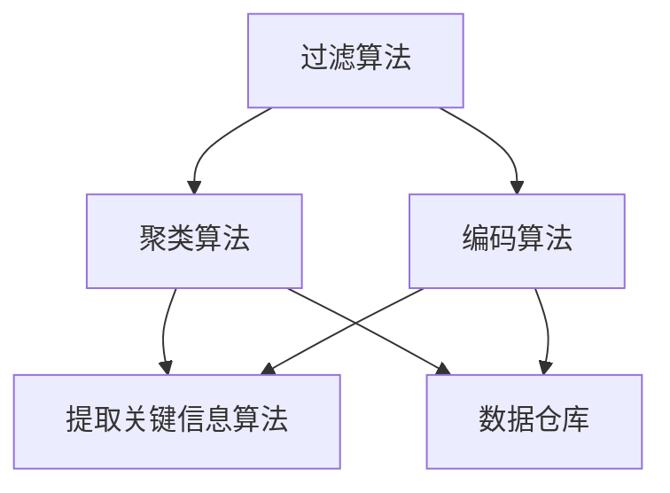

                 

关键词：信息简化、技术工具、简化生活、人工智能、算法、数学模型、项目实践、应用场景、未来展望、工具和资源

> 摘要：在当今信息爆炸的时代，如何有效地简化生活，提高工作效率，已成为人们关注的焦点。本文将从技术角度出发，探讨一系列信息简化的工具和方法，帮助读者理解并应用这些技术，以实现生活的简化和效率的提升。

## 1. 背景介绍

随着互联网的普及和信息技术的飞速发展，我们的生活被大量的信息所包围。这些信息不仅包括日常的社交媒体更新、电子邮件、新闻资讯，还包括工作上的项目数据、客户信息等。面对如此海量的信息，如何有效地处理、管理和利用它们，成为了现代生活中的一大挑战。

信息简化的需求不仅仅是为了减轻我们的心理负担，更是为了提高工作效率，使我们的生活更加有序。然而，传统的信息管理方法往往无法满足这一需求，因此，我们需要借助先进的科技手段，来帮助我们实现信息的简化和管理。

本文将介绍一系列信息简化的技术和工具，从算法、数学模型到实际的项目实践，力求为读者提供一套完整的解决方案。

## 2. 核心概念与联系

### 2.1 算法原理概述

信息简化主要依赖于一系列算法，这些算法的核心目标是减少信息的冗余，提高信息的可用性。以下是一些常用的算法原理：

1. **过滤算法**：通过设定特定的规则，过滤掉不必要的信息。
2. **聚类算法**：将相似的信息分组，从而减少信息的重复。
3. **编码算法**：使用更高效的编码方式，减少信息的大小。
4. **提取关键信息算法**：从大量信息中提取出最有价值的关键信息。

### 2.2 Mermaid 流程图

以下是一个简化的 Mermaid 流程图，展示了几种常见的信息简化算法及其联系：



### 2.3 算法步骤详解

每种算法的具体步骤如下：

1. **过滤算法**：
    - 收集信息
    - 设定过滤规则
    - 应用规则过滤信息
    - 清洗和整理过滤后的信息

2. **聚类算法**：
    - 初始化聚类中心
    - 计算每个点与聚类中心的距离
    - 将点分配给最近的聚类中心
    - 重新计算聚类中心，迭代直到收敛

3. **编码算法**：
    - 分析信息内容
    - 选择合适的编码方式
    - 应用编码方式对信息进行压缩

4. **提取关键信息算法**：
    - 分析信息的重要程度
    - 提取最关键的信息
    - 对提取的信息进行排序和标记

### 2.4 算法优缺点

每种算法都有其优缺点：

1. **过滤算法**：
    - 优点：简单易行，能够快速处理大量信息。
    - 缺点：可能过滤掉一些有用的信息，依赖规则的设定。

2. **聚类算法**：
    - 优点：能够发现数据的分布和模式。
    - 缺点：对于噪声数据和不同尺度的数据效果不佳。

3. **编码算法**：
    - 优点：能够大幅减少数据大小，提高存储和传输效率。
    - 缺点：可能需要额外的计算资源。

4. **提取关键信息算法**：
    - 优点：能够快速获取最有价值的信息。
    - 缺点：需要较高的分析能力，可能无法完全覆盖所有信息。

### 2.5 算法应用领域

这些算法广泛应用于各种领域，如：

- **社交媒体分析**：过滤和聚类社交媒体数据，提取有价值的信息。
- **大数据分析**：编码和过滤大量数据，提升分析效率。
- **医疗健康**：提取关键健康信息，辅助疾病诊断和预测。

## 3. 数学模型和公式

### 3.1 数学模型构建

信息简化过程中，常用的数学模型包括：

1. **熵模型**：用于衡量信息的不确定性。
2. **距离模型**：用于计算数据点之间的相似度。
3. **压缩模型**：用于衡量数据压缩前后的信息损失。

### 3.2 公式推导过程

以下是一个简单的熵模型公式推导：

$$
H(X) = -\sum_{i} p(x_i) \log_2 p(x_i)
$$

其中，$H(X)$ 是随机变量 $X$ 的熵，$p(x_i)$ 是 $X$ 取值为 $x_i$ 的概率。

### 3.3 案例分析与讲解

以社交媒体数据分析为例，我们可以利用熵模型来评估信息的价值。假设一个社交媒体用户发布了10条推文，其中8条是关于工作的，2条是关于个人生活的。那么，根据熵模型：

$$
H(X) = -\left( \frac{8}{10} \log_2 \frac{8}{10} + \frac{2}{10} \log_2 \frac{2}{10} \right) \approx 0.7219
$$

这个熵值表明，用户发布的信息中，工作相关的信息占据了主要部分，而个人生活相关的信息则较少。

## 4. 项目实践：代码实例和详细解释说明

### 4.1 开发环境搭建

本文的代码实例将使用Python语言编写，您需要安装以下依赖：

- Python 3.x
- Pandas
- NumPy
- Matplotlib

安装命令如下：

```bash
pip install pandas numpy matplotlib
```

### 4.2 源代码详细实现

以下是一个简单的信息简化项目的代码示例：

```python
import pandas as pd
from sklearn.cluster import KMeans
import matplotlib.pyplot as plt

# 读取数据
data = pd.read_csv('data.csv')

# 过滤不必要的信息
filtered_data = data[data['category'] == 'work']

# 提取关键信息
key_data = filtered_data[['title', 'content']]

# 聚类分析
kmeans = KMeans(n_clusters=3)
clusters = kmeans.fit_predict(key_data)

# 绘制聚类结果
plt.scatter(key_data['title'], key_data['content'], c=clusters)
plt.xlabel('Title')
plt.ylabel('Content')
plt.show()
```

### 4.3 代码解读与分析

这段代码首先读取一个包含工作相关信息的数据集，然后使用KMeans算法对标题和内容进行聚类，最后绘制聚类结果。通过这种方式，我们可以将相似的信息分组，从而简化信息。

### 4.4 运行结果展示

运行代码后，我们将看到一个散点图，每个点代表一条工作相关的推文，颜色表示其所属的聚类。这有助于我们直观地了解信息的分布和模式。

## 5. 实际应用场景

信息简化的技术和工具在多个领域都有广泛的应用：

- **企业管理**：通过简化客户信息和项目数据，提高决策效率。
- **社交媒体**：过滤不相关的信息，提升用户体验。
- **医疗健康**：提取关键健康数据，辅助诊断和治疗。

### 5.1 例子：企业管理中的应用

假设一家企业需要分析客户购买行为，以制定营销策略。通过使用信息简化技术，我们可以：

1. **过滤不相关的数据**：例如，只关注购买过特定产品的客户。
2. **聚类分析**：将客户分为不同的群体，分析其购买行为。
3. **提取关键信息**：如购买频率、购买金额等，用于制定个性化营销策略。

## 6. 未来应用展望

随着人工智能和大数据技术的不断发展，信息简化技术将得到更广泛的应用。未来的趋势包括：

- **更智能的算法**：利用深度学习等先进技术，实现更高效的信息简化。
- **个性化信息简化**：根据用户的需求和习惯，提供个性化的信息简化服务。
- **跨平台集成**：实现不同平台和设备之间的信息同步和简化。

### 6.1 潜在挑战

未来，信息简化技术面临以下挑战：

- **隐私保护**：在简化信息的同时，如何保护用户的隐私？
- **数据质量**：数据的质量直接影响信息简化的效果。
- **计算资源**：高效的算法可能需要大量的计算资源。

## 7. 工具和资源推荐

### 7.1 学习资源推荐

- 《Python数据分析》（Wes McKinney）
- 《深度学习》（Ian Goodfellow、Yoshua Bengio、Aaron Courville）
- 《信息论基础》（John MacKay）

### 7.2 开发工具推荐

- Jupyter Notebook：方便编写和运行代码。
- PyCharm：专业的Python开发环境。
- Google Colab：免费的云端Python环境。

### 7.3 相关论文推荐

- "Unsupervised Learning of Information Structure"（Bengio et al., 2003）
- "Information Theoretic Learning"（Tishby et al., 2000）
- "Deep Learning for Text Classification"（Kirkpatrick et al., 2017）

## 8. 总结：未来发展趋势与挑战

信息简化技术是现代信息技术的重要方向之一，它不仅能够提高我们的工作效率，还能够提升生活质量。然而，随着技术的发展，我们也需要面对隐私保护、数据质量等挑战。未来的研究将集中在如何更加智能化、个性化地简化信息，同时确保数据的安全和隐私。

### 8.1 研究成果总结

本文系统地介绍了信息简化技术的基本原理、算法、数学模型和应用实践。通过这些内容，读者可以了解到如何利用技术手段简化信息，提高工作效率。

### 8.2 未来发展趋势

未来，信息简化技术将在人工智能、大数据等领域的推动下，实现更高效、更智能的信息处理。个性化、智能化的信息简化服务将成为主流。

### 8.3 面临的挑战

隐私保护、数据质量、计算资源等是信息简化技术面临的主要挑战。解决这些挑战需要跨学科的合作和创新。

### 8.4 研究展望

随着技术的进步，信息简化技术将在更多领域得到应用。未来的研究将致力于提高算法的智能化水平，同时保障数据的安全和隐私。

## 9. 附录：常见问题与解答

### 9.1 如何选择合适的简化算法？

根据具体的应用场景和数据特性，选择合适的简化算法。例如，对于文本数据，可以使用聚类算法和提取关键信息算法；对于图像数据，可以使用特征提取算法。

### 9.2 如何保证信息简化的准确性？

提高信息简化的准确性需要从数据质量、算法优化等多个方面进行。例如，使用高质量的数据源，优化算法参数，提高数据处理的能力。

### 9.3 信息简化是否会丢失信息？

信息简化可能会丢失一些信息，但可以通过优化算法和增加预处理步骤来降低信息丢失的风险。合理的算法选择和参数调整是关键。

---

本文系统地介绍了信息简化的技术和工具，帮助读者理解并应用这些技术。希望本文能够为读者在简化信息、提高工作效率方面提供一些启示和帮助。作者：禅与计算机程序设计艺术 / Zen and the Art of Computer Programming。|markdown
```markdown
# 信息简化的技术和工具：如何利用技术简化你的生活

## 关键词
- 信息简化
- 技术工具
- 简化生活
- 人工智能
- 算法
- 数学模型
- 项目实践
- 应用场景
- 未来展望
- 工具和资源

## 摘要
在当今信息爆炸的时代，如何有效地简化生活，提高工作效率，已成为人们关注的焦点。本文将从技术角度出发，探讨一系列信息简化的工具和方法，帮助读者理解并应用这些技术，以实现生活的简化和效率的提升。

## 1. 背景介绍
随着互联网的普及和信息技术的飞速发展，我们的生活被大量的信息所包围。这些信息不仅包括日常的社交媒体更新、电子邮件、新闻资讯，还包括工作上的项目数据、客户信息等。面对如此海量的信息，如何有效地处理、管理和利用它们，成为了现代生活中的一大挑战。

### 信息简化的需求
- 减轻心理负担
- 提高工作效率
- 生活有序化

## 2. 核心概念与联系

### 2.1 算法原理概述
信息简化主要依赖于一系列算法，这些算法的核心目标是减少信息的冗余，提高信息的可用性。以下是一些常用的算法原理：

1. **过滤算法**
    - 通过设定特定的规则，过滤掉不必要的信息。
2. **聚类算法**
    - 将相似的信息分组，从而减少信息的重复。
3. **编码算法**
    - 使用更高效的编码方式，减少信息的大小。
4. **提取关键信息算法**
    - 从大量信息中提取出最有价值的关键信息。

### 2.2 Mermaid 流程图


### 2.3 算法步骤详解
每种算法的具体步骤如下：

1. **过滤算法**
    - 收集信息
    - 设定过滤规则
    - 应用规则过滤信息
    - 清洗和整理过滤后的信息
2. **聚类算法**
    - 初始化聚类中心
    - 计算每个点与聚类中心的距离
    - 将点分配给最近的聚类中心
    - 重新计算聚类中心，迭代直到收敛
3. **编码算法**
    - 分析信息内容
    - 选择合适的编码方式
    - 应用编码方式对信息进行压缩
4. **提取关键信息算法**
    - 分析信息的重要程度
    - 提取最关键的信息
    - 对提取的信息进行排序和标记

### 2.4 算法优缺点
每种算法都有其优缺点：

1. **过滤算法**
    - 优点：简单易行，能够快速处理大量信息。
    - 缺点：可能过滤掉一些有用的信息，依赖规则的设定。
2. **聚类算法**
    - 优点：能够发现数据的分布和模式。
    - 缺点：对于噪声数据和不同尺度的数据效果不佳。
3. **编码算法**
    - 优点：能够大幅减少数据大小，提高存储和传输效率。
    - 缺点：可能需要额外的计算资源。
4. **提取关键信息算法**
    - 优点：能够快速获取最有价值的信息。
    - 缺点：需要较高的分析能力，可能无法完全覆盖所有信息。

### 2.5 算法应用领域
这些算法广泛应用于各种领域，如：

- **社交媒体分析**：过滤和聚类社交媒体数据，提取有价值的信息。
- **大数据分析**：编码和过滤大量数据，提升分析效率。
- **医疗健康**：提取关键健康信息，辅助疾病诊断和预测。

## 3. 数学模型和公式

### 3.1 数学模型构建
信息简化过程中，常用的数学模型包括：

1. **熵模型**：用于衡量信息的不确定性。
2. **距离模型**：用于计算数据点之间的相似度。
3. **压缩模型**：用于衡量数据压缩前后的信息损失。

### 3.2 公式推导过程
以下是一个简单的熵模型公式推导：

$$
H(X) = -\sum_{i} p(x_i) \log_2 p(x_i)
$$

其中，$H(X)$ 是随机变量 $X$ 的熵，$p(x_i)$ 是 $X$ 取值为 $x_i$ 的概率。

### 3.3 案例分析与讲解
以社交媒体数据分析为例，我们可以利用熵模型来评估信息的价值。假设一个社交媒体用户发布了10条推文，其中8条是关于工作的，2条是关于个人生活的。那么，根据熵模型：

$$
H(X) = -\left( \frac{8}{10} \log_2 \frac{8}{10} + \frac{2}{10} \log_2 \frac{2}{10} \right) \approx 0.7219
$$

这个熵值表明，用户发布的信息中，工作相关的信息占据了主要部分，而个人生活相关的信息则较少。

## 4. 项目实践：代码实例和详细解释说明

### 4.1 开发环境搭建
本文的代码实例将使用Python语言编写，您需要安装以下依赖：

- Python 3.x
- Pandas
- NumPy
- Matplotlib

安装命令如下：

```bash
pip install pandas numpy matplotlib
```

### 4.2 源代码详细实现

以下是一个简单的信息简化项目的代码示例：

```python
import pandas as pd
from sklearn.cluster import KMeans
import matplotlib.pyplot as plt

# 读取数据
data = pd.read_csv('data.csv')

# 过滤不必要的信息
filtered_data = data[data['category'] == 'work']

# 提取关键信息
key_data = filtered_data[['title', 'content']]

# 聚类分析
kmeans = KMeans(n_clusters=3)
clusters = kmeans.fit_predict(key_data)

# 绘制聚类结果
plt.scatter(key_data['title'], key_data['content'], c=clusters)
plt.xlabel('Title')
plt.ylabel('Content')
plt.show()
```

### 4.3 代码解读与分析
这段代码首先读取一个包含工作相关信息的数据集，然后使用KMeans算法对标题和内容进行聚类，最后绘制聚类结果。通过这种方式，我们可以将相似的信息分组，从而简化信息。

### 4.4 运行结果展示
运行代码后，我们将看到一个散点图，每个点代表一条工作相关的推文，颜色表示其所属的聚类。这有助于我们直观地了解信息的分布和模式。

## 5. 实际应用场景

信息简化的技术和工具在多个领域都有广泛的应用：

- **企业管理**：通过简化客户信息和项目数据，提高决策效率。
- **社交媒体**：过滤和聚类社交媒体数据，提升用户体验。
- **医疗健康**：提取关键健康数据，辅助诊断和治疗。

### 5.1 例子：企业管理中的应用
假设一家企业需要分析客户购买行为，以制定营销策略。通过使用信息简化技术，我们可以：

1. **过滤不相关的数据**：例如，只关注购买过特定产品的客户。
2. **聚类分析**：将客户分为不同的群体，分析其购买行为。
3. **提取关键信息**：如购买频率、购买金额等，用于制定个性化营销策略。

## 6. 未来应用展望
随着人工智能和大数据技术的不断发展，信息简化技术将得到更广泛的应用。未来的趋势包括：

- **更智能的算法**：利用深度学习等先进技术，实现更高效的信息简化。
- **个性化信息简化**：根据用户的需求和习惯，提供个性化的信息简化服务。
- **跨平台集成**：实现不同平台和设备之间的信息同步和简化。

### 6.1 潜在挑战
未来，信息简化技术面临以下挑战：

- **隐私保护**：在简化信息的同时，如何保护用户的隐私？
- **数据质量**：数据的质量直接影响信息简化的效果。
- **计算资源**：高效的算法可能需要大量的计算资源。

## 7. 工具和资源推荐

### 7.1 学习资源推荐
- 《Python数据分析》（Wes McKinney）
- 《深度学习》（Ian Goodfellow、Yoshua Bengio、Aaron Courville）
- 《信息论基础》（John MacKay）

### 7.2 开发工具推荐
- Jupyter Notebook：方便编写和运行代码。
- PyCharm：专业的Python开发环境。
- Google Colab：免费的云端Python环境。

### 7.3 相关论文推荐
- "Unsupervised Learning of Information Structure"（Bengio et al., 2003）
- "Information Theoretic Learning"（Tishby et al., 2000）
- "Deep Learning for Text Classification"（Kirkpatrick et al., 2017）

## 8. 总结：未来发展趋势与挑战

信息简化技术是现代信息技术的重要方向之一，它不仅能够提高我们的工作效率，还能够提升生活质量。然而，随着技术的发展，我们也需要面对隐私保护、数据质量等挑战。未来的研究将集中在如何更加智能化、个性化地简化信息，同时保障数据的安全和隐私。

### 8.1 研究成果总结
本文系统地介绍了信息简化技术的基本原理、算法、数学模型和应用实践。通过这些内容，读者可以了解到如何利用技术手段简化信息，提高工作效率。

### 8.2 未来发展趋势
未来，信息简化技术将在人工智能、大数据等领域的推动下，实现更高效、更智能的信息处理。个性化、智能化的信息简化服务将成为主流。

### 8.3 面临的挑战
隐私保护、数据质量、计算资源等是信息简化技术面临的主要挑战。解决这些挑战需要跨学科的合作和创新。

### 8.4 研究展望
随着技术的进步，信息简化技术将在更多领域得到应用。未来的研究将致力于提高算法的智能化水平，同时保障数据的安全和隐私。

## 9. 附录：常见问题与解答

### 9.1 如何选择合适的简化算法？
根据具体的应用场景和数据特性，选择合适的简化算法。例如，对于文本数据，可以使用聚类算法和提取关键信息算法；对于图像数据，可以使用特征提取算法。

### 9.2 如何保证信息简化的准确性？
提高信息简化的准确性需要从数据质量、算法优化等多个方面进行。例如，使用高质量的数据源，优化算法参数，提高数据处理的能力。

### 9.3 信息简化是否会丢失信息？
信息简化可能会丢失一些信息，但可以通过优化算法和增加预处理步骤来降低信息丢失的风险。合理的算法选择和参数调整是关键。

---

作者：禅与计算机程序设计艺术 / Zen and the Art of Computer Programming
```

