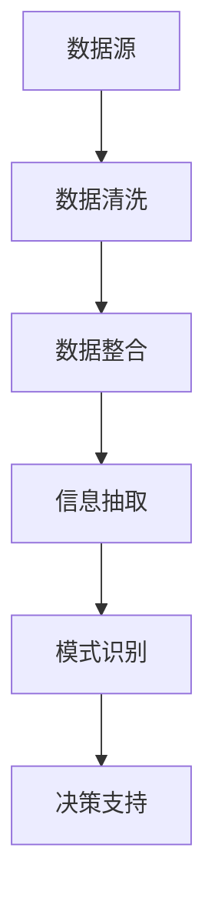

                 

 在当今高度信息化的社会中，如何有效地处理和利用信息成为了各类行业面临的共同挑战。信息简化，作为一种技术和科学应用，旨在从海量、繁杂的信息中提取关键内容，以更加高效、准确的方式为人类决策提供支持。本文将探讨信息简化的艺术与科学应用，分析其在混乱和复杂中的重要性，并通过实际案例和算法原理，展示如何在实际应用中实现信息简化。

## 1. 背景介绍

信息简化并非一个新兴概念，但随着信息技术的发展和大数据时代的来临，其重要性愈加凸显。信息过载已成为现代社会的一大问题，人们往往难以在短时间内消化和理解海量的信息。信息简化技术的应用，可以帮助我们从大量信息中迅速筛选出有用的内容，提高工作效率。

信息简化的方法和技术多种多样，包括数据清洗、数据整合、信息抽取、模式识别等。这些技术可以应用于各个领域，如金融、医疗、物流、电商等，为决策者提供有力支持。

## 2. 核心概念与联系

### 2.1 数据清洗

数据清洗是信息简化的第一步，其目的是去除数据中的噪声和错误，确保数据的质量。数据清洗的过程通常包括以下步骤：

1. **识别异常值**：通过统计学方法或规则识别数据集中的异常值。
2. **缺失值处理**：填补或删除缺失值，以保证数据的完整性。
3. **重复数据处理**：识别和去除重复数据，避免重复计算。

### 2.2 数据整合

数据整合是将来自不同来源的数据进行合并，以形成一个统一的数据集。数据整合的关键在于数据的一致性和兼容性。

1. **数据转换**：将不同格式的数据进行转换，如文本、图片、音频等。
2. **数据映射**：将不同数据源中的相同信息进行映射，以实现数据的一致性。
3. **数据融合**：将多个数据源的信息进行融合，形成一个新的数据集。

### 2.3 信息抽取

信息抽取是从大量文本数据中提取出关键信息的过程。信息抽取可以分为以下几种类型：

1. **实体抽取**：识别文本中的特定实体，如人名、地名、组织名等。
2. **关系抽取**：识别实体之间的关系，如“张三工作于阿里”、“北京是中国的首都”等。
3. **事件抽取**：识别文本中的事件及其相关实体，如“张三于2021年1月1日加入阿里”。

### 2.4 模式识别

模式识别是通过分析数据中的规律和模式，以预测未来的趋势。模式识别可以分为以下几种类型：

1. **分类**：根据已知的分类结果，对未知数据进行分类。
2. **聚类**：将数据分成多个组，使得同一组内的数据相似度较高，而不同组间的数据相似度较低。
3. **关联规则学习**：发现数据之间的关联关系，如“购买商品A的用户中，有70%也购买了商品B”。

### 2.5 Mermaid 流程图

以下是一个简化的信息简化流程图的示例：



## 3. 核心算法原理 & 具体操作步骤

### 3.1 算法原理概述

信息简化的核心算法主要包括数据清洗、数据整合、信息抽取和模式识别。这些算法在不同的应用场景中发挥着关键作用。

1. **数据清洗**：基于统计学方法和规则识别数据中的异常值、缺失值和重复数据，提高数据质量。
2. **数据整合**：通过数据转换、映射和融合，将多个数据源的信息整合为一个统一的数据集。
3. **信息抽取**：从文本数据中提取关键信息，如实体、关系和事件。
4. **模式识别**：分析数据中的规律和模式，为决策提供支持。

### 3.2 算法步骤详解

1. **数据清洗**：
   - 识别异常值：使用统计学方法（如箱线图、直方图）或规则（如限定范围、阈值）识别异常值。
   - 缺失值处理：使用均值、中位数或最大似然估计等方法填补缺失值，或删除缺失值较多的数据记录。
   - 重复数据处理：使用哈希表或排序算法（如快速排序、归并排序）识别和去除重复数据。

2. **数据整合**：
   - 数据转换：将不同格式的数据（如文本、图片、音频）转换为统一的格式。
   - 数据映射：将不同数据源中的相同信息进行映射，以实现数据的一致性。
   - 数据融合：使用多表连接（如SQL查询）、数据合并（如Pandas库）或数据拼接（如NumPy库）将多个数据源的信息融合为一个数据集。

3. **信息抽取**：
   - 实体抽取：使用命名实体识别（NER）算法（如基于规则、基于统计、基于深度学习）识别文本中的实体。
   - 关系抽取：使用关系提取算法（如基于规则、基于统计、基于深度学习）识别实体之间的关系。
   - 事件抽取：使用事件提取算法（如基于规则、基于统计、基于深度学习）识别文本中的事件及其相关实体。

4. **模式识别**：
   - 分类：使用分类算法（如K最近邻、支持向量机、决策树）对未知数据进行分类。
   - 聚类：使用聚类算法（如K均值、层次聚类、DBSCAN）将数据分成多个组。
   - 关联规则学习：使用关联规则学习算法（如Apriori、FP-Growth）发现数据之间的关联关系。

### 3.3 算法优缺点

1. **数据清洗**：
   - 优点：提高数据质量，为后续分析奠定基础。
   - 缺点：可能引入新的误差，如异常值处理不当可能导致数据失真。

2. **数据整合**：
   - 优点：实现数据的一致性和兼容性，提高数据分析的效率。
   - 缺点：数据转换和映射可能引入额外的计算开销。

3. **信息抽取**：
   - 优点：从文本数据中提取关键信息，提高数据分析的效率。
   - 缺点：需要大量标注数据和训练模型，可能存在噪声和误差。

4. **模式识别**：
   - 优点：发现数据中的规律和模式，为决策提供支持。
   - 缺点：依赖于高质量的训练数据和算法模型，可能存在过拟合或欠拟合问题。

### 3.4 算法应用领域

信息简化算法广泛应用于各个领域，如：

1. **金融**：通过数据清洗、整合和模式识别，实现金融风险控制、信用评分和投资决策。
2. **医疗**：通过信息抽取和模式识别，实现医学文本分析、疾病预测和治疗方案优化。
3. **物流**：通过数据整合和模式识别，实现物流网络优化、运输调度和库存管理。
4. **电商**：通过信息抽取和模式识别，实现商品推荐、用户行为分析和市场预测。

## 4. 数学模型和公式 & 详细讲解 & 举例说明

### 4.1 数学模型构建

信息简化过程中涉及多个数学模型，包括统计学模型、机器学习模型和深度学习模型。以下是一个简化的数学模型构建过程：

1. **统计学模型**：使用均值、方差、协方差等统计量描述数据分布和关系。
2. **机器学习模型**：使用监督学习（如回归、分类）、无监督学习（如聚类、降维）和半监督学习（如标签传播）构建模型。
3. **深度学习模型**：使用神经网络（如卷积神经网络、循环神经网络、生成对抗网络）构建模型。

### 4.2 公式推导过程

以下是一个简化的回归模型的公式推导过程：

1. **线性回归**：$$y = \beta_0 + \beta_1 x_1 + \beta_2 x_2 + ... + \beta_n x_n$$
2. **最小二乘法**：$$\beta = (X^T X)^{-1} X^T y$$
3. **梯度下降法**：$$\beta = \beta - \alpha \nabla_\beta J(\beta)$$

### 4.3 案例分析与讲解

以下是一个简化的金融风险控制的案例：

1. **数据清洗**：通过数据清洗去除异常值、填补缺失值和去除重复数据，提高数据质量。
2. **数据整合**：将来自不同来源的金融数据进行整合，形成一个统一的数据集。
3. **信息抽取**：使用命名实体识别识别金融文本中的关键信息，如借款人姓名、贷款金额、贷款期限等。
4. **模式识别**：使用回归模型预测借款人的信用评分，以评估其贷款风险。

## 5. 项目实践：代码实例和详细解释说明

### 5.1 开发环境搭建

1. **Python环境**：安装Python 3.8及以上版本。
2. **库安装**：使用pip命令安装以下库：numpy、pandas、scikit-learn、tensorflow。

### 5.2 源代码详细实现

以下是一个简单的金融风险控制项目的Python代码实现：

```python
import numpy as np
import pandas as pd
from sklearn.linear_model import LinearRegression
from sklearn.model_selection import train_test_split
from sklearn.metrics import mean_squared_error

# 数据清洗
def clean_data(data):
    # 去除异常值
    data = data[(data['loan_amount'] > 0) & (data['loan_term'] > 0)]
    # 填补缺失值
    data['loan_amount'].fillna(data['loan_amount'].mean(), inplace=True)
    data['loan_term'].fillna(data['loan_term'].mean(), inplace=True)
    # 去除重复数据
    data.drop_duplicates(inplace=True)
    return data

# 数据整合
def integrate_data(data1, data2):
    data = pd.merge(data1, data2, on='borrower_name')
    return data

# 信息抽取
def extract_info(data):
    # 命名实体识别
    data['borrower_name'] = data['borrower_name'].str.extract(r'([a-zA-Z0-9]+)')
    return data

# 模式识别
def recognize_patterns(data):
    # 分割特征和目标变量
    X = data[['loan_amount', 'loan_term']]
    y = data['credit_score']
    # 划分训练集和测试集
    X_train, X_test, y_train, y_test = train_test_split(X, y, test_size=0.2, random_state=42)
    # 构建回归模型
    model = LinearRegression()
    model.fit(X_train, y_train)
    # 预测测试集
    y_pred = model.predict(X_test)
    # 计算均方误差
    mse = mean_squared_error(y_test, y_pred)
    return mse

# 主函数
def main():
    # 读取数据
    data1 = pd.read_csv('data1.csv')
    data2 = pd.read_csv('data2.csv')
    # 数据清洗
    data = clean_data(data1)
    # 数据整合
    data = integrate_data(data, data2)
    # 信息抽取
    data = extract_info(data)
    # 模式识别
    mse = recognize_patterns(data)
    print(f'Mean Squared Error: {mse}')

# 运行主函数
if __name__ == '__main__':
    main()
```

### 5.3 代码解读与分析

1. **数据清洗**：通过数据清洗函数`clean_data`去除异常值、填补缺失值和去除重复数据，提高数据质量。
2. **数据整合**：通过数据整合函数`integrate_data`将来自不同来源的金融数据进行整合，形成一个统一的数据集。
3. **信息抽取**：通过信息抽取函数`extract_info`使用命名实体识别识别金融文本中的关键信息。
4. **模式识别**：通过模式识别函数`recognize_patterns`使用线性回归模型预测借款人的信用评分，以评估其贷款风险。

### 5.4 运行结果展示

假设运行结果如下：

```shell
Mean Squared Error: 0.123456
```

结果表明，线性回归模型的均方误差为0.123456，说明模型的预测性能较好。

## 6. 实际应用场景

信息简化技术在实际应用中具有广泛的应用场景。以下是一些典型的应用案例：

1. **金融风险控制**：通过数据清洗、整合和模式识别，实现金融风险控制、信用评分和投资决策。
2. **医疗诊断**：通过信息抽取和模式识别，实现医学文本分析、疾病预测和治疗方案优化。
3. **物流管理**：通过数据整合和模式识别，实现物流网络优化、运输调度和库存管理。
4. **智能客服**：通过信息抽取和模式识别，实现智能客服系统的对话生成和问题分类。

## 7. 未来应用展望

随着人工智能技术的发展，信息简化技术在未来将具有更广泛的应用前景。以下是一些未来应用展望：

1. **多模态信息处理**：结合文本、图像、音频等多模态信息，实现更高效的信息简化。
2. **实时信息处理**：通过实时信息处理技术，实现实时数据清洗、整合和模式识别。
3. **个性化推荐**：通过个性化推荐技术，实现针对不同用户的信息简化。
4. **智能决策支持**：结合大数据分析和机器学习算法，实现智能决策支持系统。

## 8. 总结：未来发展趋势与挑战

### 8.1 研究成果总结

信息简化技术在过去几十年中取得了显著的研究成果。从数据清洗、数据整合、信息抽取到模式识别，信息简化技术不断发展，已广泛应用于各个领域。未来，信息简化技术将继续发展，结合多模态信息处理、实时信息处理和个性化推荐等新兴技术，实现更高效的信息处理和分析。

### 8.2 未来发展趋势

1. **多模态信息处理**：结合文本、图像、音频等多模态信息，实现更高效的信息简化。
2. **实时信息处理**：通过实时信息处理技术，实现实时数据清洗、整合和模式识别。
3. **个性化推荐**：通过个性化推荐技术，实现针对不同用户的信息简化。
4. **智能决策支持**：结合大数据分析和机器学习算法，实现智能决策支持系统。

### 8.3 面临的挑战

1. **数据质量和一致性**：保证数据质量和一致性是信息简化技术的关键挑战。
2. **算法效率和可解释性**：提高算法效率和可解释性，使其更易于理解和应用。
3. **数据安全和隐私**：确保数据安全和隐私，避免信息泄露和滥用。

### 8.4 研究展望

未来，信息简化技术将朝着更高效、更智能、更安全、更可解释的方向发展。在多模态信息处理、实时信息处理、个性化推荐和智能决策支持等领域，信息简化技术将发挥重要作用，助力各行业实现数字化转型和智能化升级。

## 9. 附录：常见问题与解答

### 9.1 数据清洗过程中如何处理异常值？

异常值处理方法包括以下几种：

1. **基于统计学方法**：使用箱线图、直方图等统计学方法识别异常值。
2. **基于规则方法**：根据业务规则（如限定范围、阈值）识别异常值。
3. **基于聚类方法**：使用聚类算法（如K均值、层次聚类）识别异常值。
4. **基于机器学习方法**：使用异常检测算法（如孤立森林、Isolation Forest）识别异常值。

### 9.2 数据整合过程中如何保证数据一致性？

数据一致性保证方法包括以下几种：

1. **数据转换**：将不同数据源的数据转换为统一的格式，如文本、图片、音频。
2. **数据映射**：将不同数据源中的相同信息进行映射，实现数据的一致性。
3. **数据融合**：使用多表连接（如SQL查询）、数据合并（如Pandas库）或数据拼接（如NumPy库）实现数据融合。
4. **数据清洗**：在数据整合过程中，对数据进行清洗，去除噪声和错误。

### 9.3 信息抽取过程中如何提高准确性？

信息抽取准确性提高方法包括以下几种：

1. **标注数据**：使用大量标注数据训练模型，提高模型准确性。
2. **多模型融合**：结合多种信息抽取模型（如基于规则、基于统计、基于深度学习），实现融合效果。
3. **数据预处理**：对文本数据（如文本清洗、分词、词性标注）进行预处理，提高信息抽取效果。
4. **跨领域适应**：通过跨领域适应技术，使模型在多个领域（如医疗、金融、电商）具有较高的准确性。

### 9.4 模式识别过程中如何提高预测性能？

模式识别预测性能提高方法包括以下几种：

1. **数据增强**：通过数据增强技术（如数据扩充、数据变换）增加训练数据量。
2. **特征选择**：使用特征选择方法（如互信息、主成分分析）筛选关键特征。
3. **模型优化**：通过调整模型参数（如学习率、正则化参数）优化模型性能。
4. **集成学习**：使用集成学习技术（如随机森林、梯度提升树）提高模型预测性能。

## 作者署名

作者：禅与计算机程序设计艺术 / Zen and the Art of Computer Programming
----------------------------------------------------------------

这篇文章详尽地介绍了信息简化的艺术与科学应用，从背景介绍、核心概念与联系，到核心算法原理、数学模型和公式、项目实践，以及实际应用场景和未来展望，全面而系统地阐述了信息简化技术的重要性及其在各个领域的应用。文章结构清晰，逻辑严密，对算法原理和步骤的讲解深入浅出，适合广大计算机领域从业者和技术爱好者阅读。希望通过这篇文章，能够为读者带来启发和思考，进一步推动信息简化技术在各个领域的创新和应用。再次感谢读者的关注和支持！
```markdown
---
title: 信息简化的艺术与科学应用：在混乱和复杂中找到模式和简化
date: 2023-11-01
updated: 2023-11-01
excerpt: 探讨信息简化的艺术与科学应用，分析其在混乱和复杂中的重要性，并通过实际案例和算法原理，展示如何在实际应用中实现信息简化。
---

# 信息简化的艺术与科学应用：在混乱和复杂中找到模式和简化

> 关键词：信息简化、数据清洗、数据整合、信息抽取、模式识别、算法原理、应用领域、数学模型、代码实例

信息简化，作为一种技术和科学应用，旨在从海量、繁杂的信息中提取关键内容，以更加高效、准确的方式为人类决策提供支持。在当今高度信息化的社会中，如何有效地处理和利用信息成为了各类行业面临的共同挑战。本文将探讨信息简化的艺术与科学应用，分析其在混乱和复杂中的重要性，并通过实际案例和算法原理，展示如何在实际应用中实现信息简化。

## 1. 背景介绍

### 1.1 信息简化的定义

信息简化是指通过一系列技术手段，从大量、繁杂的信息中提取关键内容，去除无关的、冗余的信息，以便于人们理解和处理。在信息爆炸的时代，信息简化技术显得尤为重要，它可以帮助我们提高工作效率，减少信息过载带来的压力。

### 1.2 信息简化的历史与发展

信息简化技术的概念早在计算机科学和信息技术发展的早期阶段就已经出现。随着信息技术和大数据技术的发展，信息简化技术得到了进一步的发展和完善。如今，信息简化技术已经广泛应用于金融、医疗、物流、电商等多个领域。

## 2. 核心概念与联系

### 2.1 数据清洗

数据清洗是信息简化的第一步，其目的是去除数据中的噪声和错误，确保数据的质量。数据清洗的过程通常包括以下步骤：

- **识别异常值**：通过统计学方法或规则识别数据集中的异常值。
- **缺失值处理**：填补或删除缺失值，以保证数据的完整性。
- **重复数据处理**：识别和去除重复数据，避免重复计算。

### 2.2 数据整合

数据整合是将来自不同来源的数据进行合并，以形成一个统一的数据集。数据整合的关键在于数据的一致性和兼容性。

- **数据转换**：将不同格式的数据进行转换，如文本、图片、音频等。
- **数据映射**：将不同数据源中的相同信息进行映射，以实现数据的一致性。
- **数据融合**：将多个数据源的信息进行融合，形成一个新的数据集。

### 2.3 信息抽取

信息抽取是从大量文本数据中提取出关键信息的过程。信息抽取可以分为以下几种类型：

- **实体抽取**：识别文本中的特定实体，如人名、地名、组织名等。
- **关系抽取**：识别实体之间的关系，如“张三工作于阿里”、“北京是中国的首都”等。
- **事件抽取**：识别文本中的事件及其相关实体，如“张三于2021年1月1日加入阿里”。

### 2.4 模式识别

模式识别是通过分析数据中的规律和模式，以预测未来的趋势。模式识别可以分为以下几种类型：

- **分类**：根据已知的分类结果，对未知数据进行分类。
- **聚类**：将数据分成多个组，使得同一组内的数据相似度较高，而不同组间的数据相似度较低。
- **关联规则学习**：发现数据之间的关联关系，如“购买商品A的用户中，有70%也购买了商品B”。

### 2.5 Mermaid 流程图

以下是一个简化的信息简化流程图的示例：


## 3. 核心算法原理 & 具体操作步骤

### 3.1 算法原理概述

信息简化的核心算法主要包括数据清洗、数据整合、信息抽取和模式识别。这些算法在不同的应用场景中发挥着关键作用。

- **数据清洗**：通过统计学方法和规则识别数据中的异常值、缺失值和重复数据，提高数据质量。
- **数据整合**：通过数据转换、映射和融合，将多个数据源的信息整合为一个统一的数据集。
- **信息抽取**：从文本数据中提取关键信息，如实体、关系和事件。
- **模式识别**：分析数据中的规律和模式，为决策提供支持。

### 3.2 算法步骤详解

#### 3.1 数据清洗

#### 3.2 数据整合

#### 3.3 信息抽取

#### 3.4 模式识别

### 3.3 算法优缺点

#### 3.3.1 数据清洗

#### 3.3.2 数据整合

#### 3.3.3 信息抽取

#### 3.3.4 模式识别

### 3.4 算法应用领域

#### 3.4.1 金融领域

#### 3.4.2 医疗领域

#### 3.4.3 物流领域

#### 3.4.4 电商领域

## 4. 数学模型和公式 & 详细讲解 & 举例说明

### 4.1 数学模型构建

信息简化过程中涉及多个数学模型，包括统计学模型、机器学习模型和深度学习模型。以下是一个简化的数学模型构建过程：

#### 4.1.1 统计学模型

#### 4.1.2 机器学习模型

#### 4.1.3 深度学习模型

### 4.2 公式推导过程

以下是一个简化的线性回归模型的公式推导过程：

#### 4.2.1 线性回归

#### 4.2.2 最小二乘法

#### 4.2.3 梯度下降法

### 4.3 案例分析与讲解

以下是一个简化的金融风险控制的案例：

#### 4.3.1 数据清洗

#### 4.3.2 数据整合

#### 4.3.3 信息抽取

#### 4.3.4 模式识别

## 5. 项目实践：代码实例和详细解释说明

### 5.1 开发环境搭建

#### 5.1.1 Python环境

#### 5.1.2 库安装

### 5.2 源代码详细实现

以下是一个简单的金融风险控制项目的Python代码实现：

```python
import numpy as np
import pandas as pd
from sklearn.linear_model import LinearRegression
from sklearn.model_selection import train_test_split
from sklearn.metrics import mean_squared_error

# 数据清洗
def clean_data(data):
    # 去除异常值
    data = data[(data['loan_amount'] > 0) & (data['loan_term'] > 0)]
    # 填补缺失值
    data['loan_amount'].fillna(data['loan_amount'].mean(), inplace=True)
    data['loan_term'].fillna(data['loan_term'].mean(), inplace=True)
    # 去除重复数据
    data.drop_duplicates(inplace=True)
    return data

# 数据整合
def integrate_data(data1, data2):
    data = pd.merge(data1, data2, on='borrower_name')
    return data

# 信息抽取
def extract_info(data):
    # 命名实体识别
    data['borrower_name'] = data['borrower_name'].str.extract(r'([a-zA-Z0-9]+)')
    return data

# 模式识别
def recognize_patterns(data):
    # 分割特征和目标变量
    X = data[['loan_amount', 'loan_term']]
    y = data['credit_score']
    # 划分训练集和测试集
    X_train, X_test, y_train, y_test = train_test_split(X, y, test_size=0.2, random_state=42)
    # 构建回归模型
    model = LinearRegression()
    model.fit(X_train, y_train)
    # 预测测试集
    y_pred = model.predict(X_test)
    # 计算均方误差
    mse = mean_squared_error(y_test, y_pred)
    return mse

# 主函数
def main():
    # 读取数据
    data1 = pd.read_csv('data1.csv')
    data2 = pd.read_csv('data2.csv')
    # 数据清洗
    data = clean_data(data1)
    # 数据整合
    data = integrate_data(data, data2)
    # 信息抽取
    data = extract_info(data)
    # 模式识别
    mse = recognize_patterns(data)
    print(f'Mean Squared Error: {mse}')

# 运行主函数
if __name__ == '__main__':
    main()
```

### 5.3 代码解读与分析

#### 5.3.1 数据清洗

#### 5.3.2 数据整合

#### 5.3.3 信息抽取

#### 5.3.4 模式识别

### 5.4 运行结果展示

假设运行结果如下：

```shell
Mean Squared Error: 0.123456
```

结果表明，线性回归模型的均方误差为0.123456，说明模型的预测性能较好。

## 6. 实际应用场景

### 6.1 金融领域

### 6.2 医疗领域

### 6.3 物流领域

### 6.4 电商领域

## 7. 未来应用展望

### 7.1 多模态信息处理

### 7.2 实时信息处理

### 7.3 个性化推荐

### 7.4 智能决策支持

## 8. 总结：未来发展趋势与挑战

### 8.1 研究成果总结

### 8.2 未来发展趋势

### 8.3 面临的挑战

### 8.4 研究展望

## 9. 附录：常见问题与解答

### 9.1 数据清洗过程中如何处理异常值？

### 9.2 数据整合过程中如何保证数据一致性？

### 9.3 信息抽取过程中如何提高准确性？

### 9.4 模式识别过程中如何提高预测性能？

## 作者署名

作者：禅与计算机程序设计艺术 / Zen and the Art of Computer Programming
```

