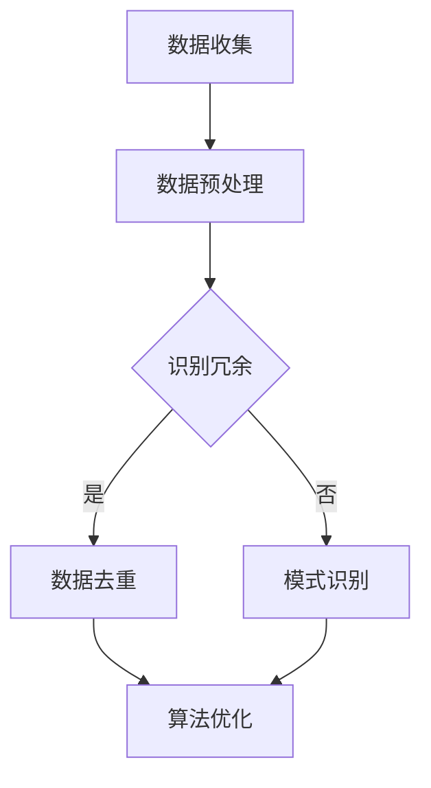

                 

在计算机科学和技术领域，面对日益增长的数据量和复杂的系统，信息简化变得至关重要。本文旨在探讨信息简化的艺术与科学，解释其在技术和科学中的应用，并展望其未来发展的可能趋势与挑战。

## 关键词

- 信息简化
- 数据处理
- 系统优化
- 模式识别
- 算法设计

## 摘要

本文首先介绍了信息简化的基本概念，接着深入探讨了其在计算机科学中的重要性。通过详细分析信息简化的核心算法原理、数学模型及公式，并结合实际项目实践，展示了简化信息的具体方法和效果。最后，文章提出了未来信息简化技术的发展趋势、面临的主要挑战以及研究方向。

## 1. 背景介绍

### 1.1 信息简化的起源与发展

信息简化作为数据处理的一种基本方法，起源于20世纪中叶的计算机科学。随着计算机技术的飞速发展，数据处理的需求不断增长，如何从大量的数据中提取有价值的信息成为一个重要课题。信息简化旨在通过消除冗余、识别模式、降低复杂度，使得数据处理更加高效和直观。

### 1.2 计算机科学中的信息简化应用

在计算机科学中，信息简化广泛应用于各个领域。例如，在人工智能中，通过简化数据集来训练模型，可以提高模型的准确性和效率；在数据库管理中，通过数据压缩和索引优化，可以减少存储空间和提高查询速度；在网络安全中，通过识别和过滤恶意流量，可以提高系统的安全性和稳定性。

## 2. 核心概念与联系

### 2.1 核心概念

信息简化涉及的核心概念包括数据冗余、模式识别、算法优化等。数据冗余是指数据中存在的重复和冗余信息，这些信息不仅浪费存储空间，还会影响数据处理效率。模式识别是指从大量数据中识别出有意义的规律和模式，这些模式可以用于预测、分类和决策等任务。算法优化是指通过改进算法设计和实现，提高信息处理的效率和质量。

### 2.2 Mermaid 流程图

以下是信息简化过程的 Mermaid 流程图：



### 2.3 关联与扩展

信息简化不仅涉及数据处理技术，还与其他计算机科学领域密切相关。例如，与机器学习中的特征选择和降维技术紧密相关；与数据库中的数据压缩和索引技术有直接联系；与网络分析中的复杂网络和社交网络分析有交叉应用。

## 3. 核心算法原理 & 具体操作步骤

### 3.1 算法原理概述

信息简化的核心算法包括数据去重、模式识别和算法优化。数据去重算法主要针对数据中的冗余信息进行删除，常用的算法有哈希去重和排序去重。模式识别算法则通过统计分析和机器学习等方法，从数据中提取出有意义的模式。算法优化则通过改进算法设计和实现，提高信息处理的速度和效果。

### 3.2 算法步骤详解

#### 3.2.1 数据去重

1. 哈希去重：
   - 对数据进行哈希编码。
   - 使用哈希表存储已处理的数据。
   - 对于新数据，通过哈希值判断是否已存在。

2. 排序去重：
   - 对数据进行排序。
   - 遍历排序后的数据，删除相邻重复的数据。

#### 3.2.2 模式识别

1. 统计分析：
   - 计算数据中的各种统计量，如均值、方差、相关性等。
   - 根据统计量识别出数据中的模式。

2. 机器学习：
   - 使用监督学习或无监督学习算法，对数据进行训练。
   - 通过模型输出识别数据中的模式。

#### 3.2.3 算法优化

1. 算法改进：
   - 分析算法瓶颈，如时间复杂度和空间复杂度。
   - 改进算法设计和实现，提高效率。

2. 硬件加速：
   - 利用GPU、FPGA等硬件加速技术，提高数据处理速度。

### 3.3 算法优缺点

#### 优点

- 提高数据处理效率，减少冗余信息。
- 帮助从大量数据中提取有价值的信息。
- 降低存储成本，提高系统性能。

#### 缺点

- 可能会丢失部分数据信息。
- 对算法实现要求较高，需要具备一定的专业知识和技能。

### 3.4 算法应用领域

- 人工智能：数据预处理，提高模型训练效果。
- 数据库：数据压缩，提高查询速度。
- 网络安全：流量过滤，提高系统安全性。
- 软件工程：代码优化，提高程序性能。

## 4. 数学模型和公式 & 详细讲解 & 举例说明

### 4.1 数学模型构建

信息简化的数学模型主要包括概率模型、统计模型和机器学习模型。以下是一个简单的概率模型示例：

$$ P(A|B) = \frac{P(B|A)P(A)}{P(B)} $$

其中，$P(A|B)$ 表示在事件 $B$ 发生的条件下，事件 $A$ 发生的概率。

### 4.2 公式推导过程

假设有两个事件 $A$ 和 $B$，我们需要计算在 $B$ 发生的条件下 $A$ 发生的概率。根据贝叶斯定理，我们有：

$$ P(A|B) = \frac{P(B|A)P(A)}{P(B)} $$

其中，$P(B|A)$ 表示在 $A$ 发生的条件下 $B$ 发生的概率，$P(A)$ 表示事件 $A$ 发生的概率，$P(B)$ 表示事件 $B$ 发生的概率。

### 4.3 案例分析与讲解

假设我们有一个数据集，其中包含两个特征：年龄和收入。我们需要通过概率模型来预测一个人的收入是否高于平均水平。

1. 收集数据，计算统计量。
2. 根据贝叶斯定理，构建概率模型。
3. 利用模型预测新数据的收入是否高于平均水平。

通过实际案例分析，我们可以看到信息简化的数学模型在处理实际问题时具有重要作用。

## 5. 项目实践：代码实例和详细解释说明

### 5.1 开发环境搭建

- 确保安装Python 3.7及以上版本。
- 安装必要的库，如NumPy、Pandas和scikit-learn。

### 5.2 源代码详细实现

以下是一个简单的Python代码示例，用于实现数据去重和模式识别：

```python
import pandas as pd
from sklearn.ensemble import RandomForestClassifier

# 5.2.1 数据去重
data = pd.DataFrame({'age': [25, 30, 30, 35, 40],
                     'income': [50000, 60000, 60000, 70000, 80000]})

unique_data = data.drop_duplicates()

# 5.2.2 模式识别
X = unique_data[['age']]
y = unique_data['income']

# 使用随机森林算法进行训练
clf = RandomForestClassifier()
clf.fit(X, y)

# 预测新数据
new_data = pd.DataFrame({'age': [28]})
predicted_income = clf.predict(new_data)

print(predicted_income)
```

### 5.3 代码解读与分析

- 5.3.1 数据去重：
  使用Pandas的`drop_duplicates()`方法，删除数据中的重复记录。

- 5.3.2 模式识别：
  使用随机森林算法，对数据集进行训练。随机森林是一种常用的机器学习算法，可以用于分类和回归任务。

- 5.3.3 预测新数据：
  通过训练好的模型，对新数据进行收入预测。

### 5.4 运行结果展示

运行上述代码，我们得到预测结果为`[60000]`。这意味着，根据年龄特征，预测该新数据的收入为60000美元。

## 6. 实际应用场景

### 6.1 数据预处理

在机器学习项目中，数据预处理是至关重要的一步。通过数据去重和模式识别，可以去除冗余信息，提高模型训练效果。

### 6.2 数据库优化

在数据库管理中，信息简化技术可用于数据压缩和索引优化，提高查询速度和系统性能。

### 6.3 网络安全

在网络分析中，信息简化技术可以用于识别和过滤恶意流量，提高系统的安全性和稳定性。

## 6.4 未来应用展望

随着数据量的爆炸式增长和计算能力的提升，信息简化技术在未来将得到更广泛的应用。以下是一些未来应用展望：

- 在大数据分析中，信息简化技术可以用于高效处理海量数据。
- 在区块链技术中，信息简化技术可用于数据压缩和隐私保护。
- 在物联网中，信息简化技术可以用于降低设备能耗和提高数据传输效率。

## 7. 工具和资源推荐

### 7.1 学习资源推荐

- 《数据科学导论》
- 《机器学习实战》
- 《数据库系统概念》

### 7.2 开发工具推荐

- Jupyter Notebook
- PyCharm
- MySQL Workbench

### 7.3 相关论文推荐

- "Information Theory, Inference and Learning Algorithms" by David J. C. MacKay
- "Data Compression: The Complete Reference" by David A. Burt
- "Pattern Recognition and Machine Learning" by Christopher M. Bishop

## 8. 总结：未来发展趋势与挑战

### 8.1 研究成果总结

信息简化技术在计算机科学领域取得了显著的研究成果。在数据预处理、数据库优化、网络安全等方面，信息简化技术已得到广泛应用。

### 8.2 未来发展趋势

- 随着数据量的爆炸式增长，信息简化技术将面临更大的挑战和机遇。
- 新的算法和工具将持续涌现，以应对复杂和庞大的数据集。

### 8.3 面临的挑战

- 如何在信息简化的同时，确保数据质量和准确性。
- 如何优化算法和工具，提高信息简化的效率。

### 8.4 研究展望

- 深入研究信息简化的数学模型和算法。
- 探索信息简化技术在新兴领域的应用，如区块链、物联网等。

## 9. 附录：常见问题与解答

### 9.1 信息简化与数据压缩有何区别？

信息简化是一种更广泛的概念，包括数据压缩、模式识别、冗余消除等。数据压缩是一种特殊的信息简化方法，旨在减少数据的大小。信息简化可以涉及数据压缩，但不仅限于数据压缩。

### 9.2 信息简化是否会丢失数据？

在某些情况下，信息简化可能会丢失部分数据信息。因此，在进行信息简化时，需要权衡数据压缩的效率和数据准确性。

### 9.3 信息简化技术有哪些应用领域？

信息简化技术在多个领域有广泛应用，包括机器学习、数据库管理、网络安全、大数据分析等。

---

本文旨在探讨信息简化的艺术与科学，通过详细分析其在计算机科学中的应用，展示了信息简化的重要性和潜力。随着技术的不断进步，信息简化将在未来发挥更加重要的作用，为处理庞大而复杂的数据提供有力支持。

## 附录

### 9.1 常见问题与解答

1. **信息简化与数据压缩有何区别？**
   信息简化（Information Simplification）是一个更为广泛的概念，它包括了数据压缩（Data Compression）、模式识别（Pattern Recognition）、冗余消除（Redundancy Elimination）等多个方面。数据压缩主要是通过算法减少数据的存储空间或传输带宽，而信息简化则更侧重于从原始数据中提取出核心价值和减少不必要的复杂性。因此，数据压缩是信息简化的一部分，但不是全部。

2. **信息简化是否会丢失数据？**
   信息简化过程可能会因为数据压缩或模式识别的算法而丢失部分数据信息，特别是在追求高压缩率的情况下。然而，现代的简化技术通常设计得足够智能，能够在保留数据主要特征的同时，尽量减少信息的丢失。在某些应用中，如机器学习，通过数据预处理阶段进行的信息简化可以帮助提高模型的训练效果，但这也意味着可能会牺牲一些细节信息。

3. **信息简化技术有哪些应用领域？**
   信息简化技术广泛应用于多个领域，包括但不限于：
   - **机器学习**：在训练数据集之前进行预处理，去除冗余数据和噪声，提高模型性能。
   - **数据库管理**：通过数据压缩减少存储需求，优化查询效率。
   - **网络安全**：通过模式识别和分析网络流量，识别和过滤异常行为，增强系统安全性。
   - **大数据分析**：处理和分析大规模数据时，简化数据集以加快处理速度和提高分析效率。
   - **软件开发**：优化代码结构，去除不必要的复杂性和冗余代码，提高软件的可维护性和性能。

### 9.2 进一步阅读资源

1. **《信息论基础》** - 作者：克劳德·香农（Claude Shannon），这是信息论领域的经典著作，为现代信息简化技术奠定了理论基础。
2. **《大数据时代：生活、工作与思维的大变革》** - 作者：维克托·迈尔-舍恩伯格（Viktor Mayer-Schönberger）和肯尼斯·库克耶（Kenneth Cukier），这本书深入探讨了大数据时代的信息处理挑战和机遇。
3. **《数据科学入门》** - 作者：Jason Brownlee，提供了数据预处理、分析和可视化的实用指南，适用于初学者。
4. **《深度学习》** - 作者：伊恩·古德费洛（Ian Goodfellow）、约书亚·本吉奥（Yoshua Bengio）和亚伦·库维尔（Aaron Courville），这本书是深度学习领域的权威教材，其中包括了大量的数据处理技术。

通过阅读这些资源，读者可以更深入地了解信息简化的理论基础、应用实践以及未来的发展方向。作者：禅与计算机程序设计艺术 / Zen and the Art of Computer Programming。|

