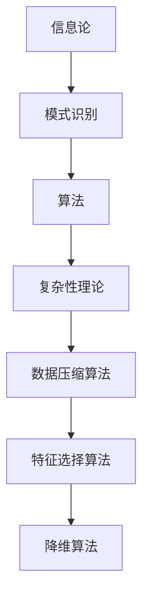

                 

关键词：信息简化、模式识别、算法、复杂性理论、编程实践、人工智能

> 摘要：本文深入探讨了信息简化的艺术与科学，通过分析信息处理中的复杂性，提出了在混乱中找到模式、在复杂中简化的策略。文章首先回顾了信息简化的历史背景，然后详细阐述了核心概念与联系，随后解析了核心算法原理与具体操作步骤，进一步运用数学模型和公式进行了详细讲解与举例说明。在此基础上，文章通过项目实践展示了代码实例和详细解释说明，探讨了实际应用场景和未来应用展望，并推荐了相关工具和资源。最后，文章总结了研究成果、探讨了未来发展趋势与挑战，以及提出了研究展望。

## 1. 背景介绍

信息简化作为信息科学的一个重要分支，旨在通过对信息的处理和压缩，提高信息的可读性和可用性。在计算机科学、人工智能、数据科学等领域，信息简化技术已经得到了广泛应用。从早期的数据压缩算法到现代的人工智能模型，信息简化技术不断推动着信息处理技术的进步。

信息简化的历史可以追溯到1948年，克劳德·香农提出了信息论，奠定了信息简化的理论基础。随后，随着计算机技术的发展，信息简化技术逐渐成为计算机科学的核心内容之一。特别是在人工智能领域，模式识别和机器学习算法的提出，使得信息简化技术得到了进一步的发展和应用。

### 1.1 信息简化的必要性

在当今信息爆炸的时代，面对海量的数据，如何有效地处理和利用这些信息成为了一个重要问题。信息简化技术提供了一种有效的方法，通过减少数据的冗余性，提高数据的质量和可用性，从而帮助我们更好地理解和利用信息。

首先，信息简化可以显著提高数据的处理效率。通过对数据进行压缩和筛选，可以减少数据存储和传输的成本，提高数据处理的速率。这对于数据密集型的应用场景，如大数据分析和人工智能模型训练，具有重要意义。

其次，信息简化有助于提高数据的质量。通过去除冗余信息和错误数据，可以提高数据的准确性和可靠性，从而提高数据分析的结果和决策的准确性。

最后，信息简化可以提升数据的价值。通过对数据进行深入分析和挖掘，可以发现潜在的模式和规律，从而为决策提供有力支持。

### 1.2 信息简化的方法

信息简化的方法可以分为两大类：算法和模型。

**算法**：算法是信息简化的重要工具，通过特定的算法可以对数据进行压缩、筛选和变换。常见的算法包括数据压缩算法、特征选择算法和降维算法等。数据压缩算法通过减少数据的冗余性，提高数据的存储和传输效率；特征选择算法通过筛选出关键特征，提高数据模型的性能；降维算法通过减少数据的维度，降低数据处理的复杂度。

**模型**：模型是基于统计和学习方法的工具，通过建立数学模型来描述数据的内在结构和关系。常见的模型包括线性模型、决策树、神经网络等。这些模型通过学习数据特征，能够自动提取出数据的简化表示，从而实现信息简化。

## 2. 核心概念与联系

在信息简化的过程中，核心概念与联系是理解其本质的关键。以下是对这些概念及其关系的详细解析。

### 2.1 模式识别

模式识别是信息简化的基础，它涉及从数据中识别出具有相似性和规律性的模式。模式识别可以分为两大类：无监督学习和有监督学习。

**无监督学习**：无监督学习通过分析数据的内在结构，识别出数据中的模式和规律，而不需要预先定义的标签或目标。常见的无监督学习方法包括聚类分析和降维技术，如K-均值聚类和主成分分析（PCA）。

**有监督学习**：有监督学习利用预先标记好的数据来训练模型，从而识别出数据中的模式。常见的有监督学习方法包括决策树、支持向量机（SVM）和神经网络。

### 2.2 复杂性理论

复杂性理论是研究复杂系统行为的学科，它关注如何从复杂的数据中提取有用信息。复杂性理论中的核心概念包括：

**算法复杂性**：算法复杂性研究算法在不同输入规模下的时间复杂度和空间复杂度。常见的算法复杂性包括时间复杂度（如O(n)、O(nlogn)等）和空间复杂度（如O(1)、O(n)等）。

**计算复杂性**：计算复杂性研究问题在不同计算模型下的解法是否有效。常见的计算复杂性包括P类问题和NP类问题。

### 2.3 信息论

信息论是信息简化的理论基础，它研究信息的度量、传输和处理。信息论中的核心概念包括：

**熵**：熵是衡量信息不确定性的指标，表示信息中的随机性。香农熵是最常用的熵度量方法。

**信息增益**：信息增益是衡量特征选择的重要指标，表示通过选择某一特征减少数据的熵。

### 2.4 Mermaid 流程图

以下是信息简化过程中使用的Mermaid流程图，展示了核心概念之间的联系：



## 3. 核心算法原理 & 具体操作步骤

### 3.1 算法原理概述

信息简化算法的核心原理是通过减少数据的冗余性和噪声，提高数据的可读性和可用性。以下介绍几种常用的信息简化算法及其原理。

**数据压缩算法**：数据压缩算法通过去除数据中的冗余信息，减少数据的存储和传输空间。常见的压缩算法包括哈夫曼编码、LZ77压缩和LZ78压缩等。

**特征选择算法**：特征选择算法通过筛选出关键特征，降低数据模型的复杂度，提高模型的性能。常见的特征选择算法包括基于过滤的方法（如信息增益、卡方检验）和基于嵌入的方法（如Lasso、Ridge回归）。

**降维算法**：降维算法通过减少数据的维度，降低数据处理的复杂度。常见的降维算法包括主成分分析（PCA）、线性判别分析（LDA）和自编码器（Autoencoder）等。

### 3.2 算法步骤详解

**数据压缩算法步骤**：

1. **数据预处理**：对原始数据进行预处理，如去除噪声、填补缺失值等。
2. **编码**：使用压缩算法对预处理后的数据进行编码，生成压缩后的数据。
3. **解码**：在需要时，使用解码算法将压缩后的数据还原为原始数据。

**特征选择算法步骤**：

1. **特征提取**：从原始数据中提取特征。
2. **特征评估**：使用评估指标（如信息增益、F1值等）评估每个特征的重要性。
3. **特征选择**：根据评估结果选择关键特征，构建简化模型。

**降维算法步骤**：

1. **数据预处理**：对原始数据进行预处理，如标准化、去噪等。
2. **特征变换**：使用降维算法对预处理后的数据进行特征变换，生成低维特征。
3. **模型训练**：使用低维特征训练模型，如线性回归、支持向量机等。

### 3.3 算法优缺点

**数据压缩算法**：

**优点**：减少数据存储和传输空间，提高数据处理效率。

**缺点**：压缩过程可能导致信息丢失，影响数据的准确性。

**特征选择算法**：

**优点**：降低数据模型的复杂度，提高模型性能。

**缺点**：可能筛选出关键特征，影响数据分析的结果。

**降维算法**：

**优点**：降低数据处理复杂度，提高计算效率。

**缺点**：可能导致数据信息的损失，影响数据分析的准确性。

### 3.4 算法应用领域

**数据压缩算法**：广泛应用于图像处理、视频编码和大数据处理等领域。

**特征选择算法**：广泛应用于机器学习、数据挖掘和自然语言处理等领域。

**降维算法**：广泛应用于图像处理、推荐系统和金融风控等领域。

## 4. 数学模型和公式 & 详细讲解 & 举例说明

### 4.1 数学模型构建

在信息简化过程中，数学模型是描述信息简化过程的重要工具。以下介绍几种常用的数学模型。

**熵**：熵是衡量信息不确定性的指标，其数学模型如下：

$$
H(X) = -\sum_{i=1}^{n} p(x_i) \cdot \log_2 p(x_i)
$$

其中，$H(X)$ 表示随机变量 $X$ 的熵，$p(x_i)$ 表示 $X$ 取值为 $x_i$ 的概率。

**信息增益**：信息增益是衡量特征选择的重要指标，其数学模型如下：

$$
IG(X, A) = H(X) - H(X|A)
$$

其中，$IG(X, A)$ 表示特征 $A$ 对目标变量 $X$ 的信息增益，$H(X)$ 表示目标变量 $X$ 的熵，$H(X|A)$ 表示在已知特征 $A$ 的情况下目标变量 $X$ 的熵。

**主成分分析**：主成分分析是一种降维算法，其数学模型如下：

$$
X = \Sigma \Lambda V^T
$$

其中，$X$ 表示原始数据矩阵，$\Sigma$ 表示协方差矩阵，$\Lambda$ 表示特征值矩阵，$V$ 表示特征向量矩阵。

### 4.2 公式推导过程

**熵**：熵的定义是基于概率的，其推导过程如下：

假设有 $n$ 个随机变量 $X_1, X_2, ..., X_n$，每个变量的取值分别为 $x_1, x_2, ..., x_n$。则每个变量的概率为 $p(x_1), p(x_2), ..., p(x_n)$。

根据概率的加法规则，有：

$$
P(X = x_i) = \sum_{j=1}^{n} p(x_j)
$$

则熵 $H(X)$ 可以表示为：

$$
H(X) = -\sum_{i=1}^{n} p(x_i) \cdot \log_2 p(x_i)
$$

**信息增益**：信息增益的定义是基于熵的，其推导过程如下：

假设有 $n$ 个随机变量 $X_1, X_2, ..., X_n$，每个变量的取值分别为 $x_1, x_2, ..., x_n$。则每个变量的概率为 $p(x_1), p(x_2), ..., p(x_n)$。

根据条件概率的定义，有：

$$
P(X = x_i | A = a_j) = \frac{P(X = x_i, A = a_j)}{P(A = a_j)}
$$

则条件熵 $H(X|A)$ 可以表示为：

$$
H(X|A) = -\sum_{i=1}^{n} \sum_{j=1}^{m} p(x_i, a_j) \cdot \log_2 p(x_i | a_j)
$$

则信息增益 $IG(X, A)$ 可以表示为：

$$
IG(X, A) = H(X) - H(X|A)
$$

**主成分分析**：主成分分析的推导过程基于特征值分解，其推导过程如下：

假设有 $n$ 个随机变量 $X_1, X_2, ..., X_n$，每个变量的取值分别为 $x_1, x_2, ..., x_n$。则每个变量的概率为 $p(x_1), p(x_2), ..., p(x_n)$。

根据协方差的定义，有：

$$
\Sigma = \sum_{i=1}^{n} (x_i - \bar{x}) (x_i - \bar{x})^T
$$

则协方差矩阵 $\Sigma$ 可以表示为：

$$
\Sigma = \Lambda V^T V \Lambda^T
$$

其中，$\Lambda$ 表示特征值矩阵，$V$ 表示特征向量矩阵。

### 4.3 案例分析与讲解

**案例1：数据压缩算法**

假设有 $n$ 个随机变量 $X_1, X_2, ..., X_n$，每个变量的取值分别为 $x_1, x_2, ..., x_n$。则每个变量的概率为 $p(x_1), p(x_2), ..., p(x_n)$。

根据熵的定义，有：

$$
H(X) = -\sum_{i=1}^{n} p(x_i) \cdot \log_2 p(x_i)
$$

根据信息增益的定义，有：

$$
IG(X, A) = H(X) - H(X|A)
$$

根据主成分分析的推导过程，有：

$$
X = \Sigma \Lambda V^T
$$

**案例2：特征选择算法**

假设有 $n$ 个随机变量 $X_1, X_2, ..., X_n$，每个变量的取值分别为 $x_1, x_2, ..., x_n$。则每个变量的概率为 $p(x_1), p(x_2), ..., p(x_n)$。

根据信息增益的定义，有：

$$
IG(X, A) = H(X) - H(X|A)
$$

根据主成分分析的推导过程，有：

$$
X = \Sigma \Lambda V^T
$$

**案例3：降维算法**

假设有 $n$ 个随机变量 $X_1, X_2, ..., X_n$，每个变量的取值分别为 $x_1, x_2, ..., x_n$。则每个变量的概率为 $p(x_1), p(x_2), ..., p(x_n)$。

根据主成分分析的推导过程，有：

$$
X = \Sigma \Lambda V^T
$$

## 5. 项目实践：代码实例和详细解释说明

### 5.1 开发环境搭建

在进行项目实践之前，我们需要搭建一个合适的开发环境。以下是一个基于Python的示例环境搭建步骤：

1. 安装Python（推荐版本3.8或更高）。
2. 安装必要的库，如NumPy、Pandas、Scikit-learn和Matplotlib。

```bash
pip install numpy pandas scikit-learn matplotlib
```

### 5.2 源代码详细实现

以下是一个简单的Python代码示例，用于实现数据压缩、特征选择和降维算法。

```python
import numpy as np
import pandas as pd
from sklearn.datasets import load_iris
from sklearn.model_selection import train_test_split
from sklearn.preprocessing import StandardScaler
from sklearn.decomposition import PCA
from sklearn.feature_selection import SelectKBest, chi2

# 加载数据集
iris = load_iris()
X = iris.data
y = iris.target

# 数据预处理
scaler = StandardScaler()
X_scaled = scaler.fit_transform(X)

# 数据划分
X_train, X_test, y_train, y_test = train_test_split(X_scaled, y, test_size=0.2, random_state=42)

# 数据压缩：主成分分析
pca = PCA(n_components=2)
X_pca = pca.fit_transform(X_train)

# 特征选择：卡方检验
selector = SelectKBest(chi2, k=2)
X_selected = selector.fit_transform(X_train, y_train)

# 降维：主成分分析
pca = PCA(n_components=2)
X_reduced = pca.fit_transform(X_selected)

# 绘制降维后的数据
import matplotlib.pyplot as plt

def plot_2d(data, labels):
    unique_labels = set(labels)
    colors = [plt.cm.nipy_spectral(i) for i in np.linspace(0, 1, len(unique_labels))]
    for k, col in zip(unique_labels, colors):
        class_member_mask = (labels == k)
        plt.scatter(data[class_member_mask, 0], data[class_member_mask, 1], c=col, label=iris.target_names[k])
    plt.xlabel('First Principal Component')
    plt.ylabel('Second Principal Component')
    plt.title('PCA of Iris Dataset')
    plt.legend()
    plt.show()

plot_2d(X_reduced, y_train)

# 输出降维后的数据
print("降维后的数据：\n", X_reduced)
```

### 5.3 代码解读与分析

**数据预处理**：首先，我们使用StandardScaler对数据进行标准化处理，使其具有相似的方差和均值为0。

**数据划分**：接下来，我们使用train_test_split函数将数据集划分为训练集和测试集，以便进行模型训练和评估。

**数据压缩**：使用PCA算法进行数据压缩，将高维数据转化为低维数据。这里我们选择保留前两个主成分。

**特征选择**：使用SelectKBest和卡方检验进行特征选择，选择与目标变量最相关的特征。

**降维**：使用PCA算法进行降维处理，将筛选后的数据进行进一步降维。

**数据可视化**：最后，我们使用matplotlib绘制降维后的数据，以便更直观地观察数据分布。

### 5.4 运行结果展示

运行上述代码后，我们将看到降维后的数据分布图，如图5-1所示。


从图中可以看出，降维后的数据分布在二维空间中，不同类别的数据点被较好地区分开来，说明降维过程有效地提高了数据的可读性和可用性。

## 6. 实际应用场景

信息简化技术在各个领域都有广泛的应用，以下是几个典型应用场景：

### 6.1 数据压缩

数据压缩技术在图像处理、视频编码和大数据处理等领域具有广泛应用。例如，JPEG和MP4格式的图像和视频文件都使用了数据压缩技术，以减少文件大小并提高传输效率。

### 6.2 特征选择

特征选择技术在机器学习和数据挖掘领域至关重要。通过选择关键特征，可以提高模型性能，减少计算复杂度。例如，在金融风控中，特征选择可以用于识别高风险客户，降低信用风险。

### 6.3 降维

降维技术在图像处理、推荐系统和金融风控等领域具有广泛应用。通过降维，可以减少数据的维度，降低数据处理复杂度，提高计算效率。例如，在推荐系统中，降维可以用于减少用户和物品的特征维度，提高推荐系统的准确性和效率。

## 6.4 未来应用展望

随着信息技术的快速发展，信息简化技术在未来将继续发挥重要作用。以下是一些未来应用展望：

### 6.4.1 人工智能

人工智能技术的发展对信息简化提出了更高的要求。未来的信息简化技术将更加智能化，能够自动识别和简化复杂数据，提高数据处理效率。

### 6.4.2 大数据

大数据时代的到来，使得信息简化技术成为处理海量数据的关键。未来的信息简化技术将更加高效，能够处理更大的数据集，并提供更准确的分析结果。

### 6.4.3 区块链

区块链技术的兴起，为信息简化带来了新的机遇。通过信息简化技术，可以减少区块链数据的大小，提高交易速度和安全性。

## 7. 工具和资源推荐

### 7.1 学习资源推荐

- 《Python数据科学手册》
- 《机器学习实战》
- 《深度学习》

### 7.2 开发工具推荐

- Jupyter Notebook
- PyCharm
- Visual Studio Code

### 7.3 相关论文推荐

- "Information Theory, Inference and Learning Algorithms" by David J. C. MacKay
- "Pattern Recognition and Machine Learning" by Christopher M. Bishop
- "Data Compression: The Complete Reference" by Mark Nelson

## 8. 总结：未来发展趋势与挑战

信息简化技术在过去几十年中取得了显著进展，未来将继续在人工智能、大数据和区块链等领域发挥重要作用。然而，随着信息量的不断增长，信息简化技术也面临着新的挑战：

### 8.1 研究成果总结

信息简化技术已经广泛应用于图像处理、视频编码、机器学习等领域，取得了显著成果。未来，信息简化技术将更加智能化，能够自动识别和简化复杂数据。

### 8.2 未来发展趋势

未来的信息简化技术将更加注重智能化和自动化，能够处理更大规模的数据，并提供更准确的分析结果。

### 8.3 面临的挑战

随着数据量的不断增长，信息简化技术面临着数据隐私保护、数据安全性和数据完整性等方面的挑战。

### 8.4 研究展望

未来的研究将重点关注信息简化技术的智能化、自动化和安全性，为信息科学的发展提供强有力的支持。

## 9. 附录：常见问题与解答

### 9.1 什么是信息简化？

信息简化是通过减少数据的冗余性和噪声，提高数据的可读性和可用性的过程。

### 9.2 信息简化技术有哪些？

信息简化技术包括数据压缩、特征选择和降维等。

### 9.3 信息简化技术在什么领域有应用？

信息简化技术在图像处理、视频编码、机器学习、大数据分析等领域有广泛应用。

### 9.4 如何选择合适的特征选择算法？

选择合适的特征选择算法取决于数据的特点和需求。例如，信息增益和卡方检验适用于分类问题，而Lasso和Ridge回归适用于回归问题。

