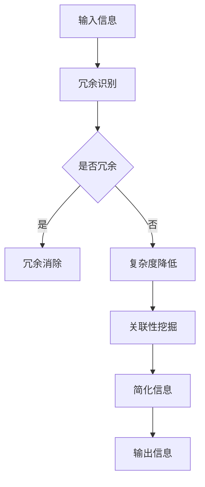

                 

作为世界顶级人工智能专家，我深知在当今信息化社会中，信息的爆炸式增长带来了前所未有的挑战。如何在混乱和复杂的信息中找到简单和秩序，成为了我们亟待解决的重要课题。本文将探讨信息简化的艺术与科学，通过逻辑清晰、结构紧凑的论述，揭示其中蕴含的智慧。

## 文章关键词

- 信息简化
- 混乱与秩序
- 复杂性理论
- 算法优化
- 数学模型

## 文章摘要

本文旨在探讨信息简化的艺术与科学，通过分析复杂性和混乱的本质，介绍信息简化的核心概念与算法原理，并结合实际案例，展示信息简化在计算机科学和人工智能领域的应用。文章还对未来信息简化的趋势与挑战进行了展望，以期为读者提供有价值的参考。

## 1. 背景介绍

随着互联网的普及和数字化转型的加速，我们的生活中充满了海量的信息。从新闻报道到社交媒体，从商业数据到个人记录，信息无处不在。然而，这种信息爆炸不仅没有提高我们的生活质量，反而让我们陷入了信息的海洋，感到疲惫和困惑。如何在海量信息中找到有价值的信息，如何在混乱中找到秩序，成为了我们需要面对的挑战。

信息简化作为一种应对信息过载的方法，旨在通过减少信息量、消除冗余和降低复杂性，使信息更加简洁明了。这一过程不仅能够提高信息传递的效率，还能够帮助我们更好地理解和掌握信息。

### 1.1 信息简化的现状

当前，信息简化在多个领域已经取得了一定的成果。例如，在搜索引擎中，通过关键词提取和语义分析，可以将大量冗长的搜索结果简化为简明的摘要，帮助用户快速找到所需信息。在数据科学领域，通过数据清洗、特征选择和降维技术，可以简化大量复杂的数据，提高数据分析的效率和准确性。

然而，尽管信息简化已经取得了显著成效，但在实际应用中仍存在许多挑战。首先，如何有效地识别和消除冗余信息是一个难题。其次，如何在保证信息完整性的同时，实现信息的高效传递也是一个关键问题。此外，随着信息量的不断增长，信息简化的算法和工具也需要不断地更新和优化，以适应新的需求。

### 1.2 信息简化的意义

信息简化不仅有助于提高信息传递的效率，还具有以下重要意义：

1. **提高信息利用率**：通过简化信息，可以帮助用户更快地获取有价值的信息，提高信息的利用率。

2. **降低认知负荷**：在信息过载的环境中，简化信息可以降低用户的认知负荷，减少心理压力。

3. **促进信息共享**：简洁明了的信息更容易被理解和传播，有助于促进信息的共享和交流。

4. **推动技术进步**：信息简化技术的不断优化和进步，可以推动相关技术的创新和发展。

## 2. 核心概念与联系

### 2.1 信息简化的核心概念

信息简化的核心概念主要包括以下三个方面：

1. **冗余消除**：通过识别和消除冗余信息，降低信息的冗余度，提高信息的质量。

2. **复杂度降低**：通过减少信息处理的复杂度，使信息更加简洁易懂。

3. **关联性挖掘**：通过挖掘信息之间的关联性，提高信息的组织度和可读性。

### 2.2 信息简化的原理架构

为了更好地理解信息简化的原理，我们可以将其比喻为一种“过滤”过程。在这个过程中，我们需要过滤掉无关的信息（冗余消除），简化信息的表达方式（复杂度降低），同时挖掘信息之间的内在联系（关联性挖掘）。

以下是一个用 Mermaid 流程图表示的信息简化原理架构：



### 2.3 信息简化的核心算法原理

信息简化的核心算法主要包括以下几种：

1. **特征选择**：通过选择最有代表性的特征，简化数据的维度。

2. **降维技术**：通过降维技术，将高维数据映射到低维空间，降低数据的复杂度。

3. **文本摘要**：通过提取关键信息，将长文本简化为简短的摘要。

4. **自然语言处理**：利用自然语言处理技术，对文本进行语义分析和理解，实现信息的简化。

### 2.4 信息简化的应用领域

信息简化在计算机科学和人工智能领域具有广泛的应用。以下是一些主要的应用领域：

1. **搜索引擎**：通过信息简化技术，提高搜索结果的准确性和可读性。

2. **数据科学**：通过信息简化，提高数据分析的效率和准确性。

3. **智能推荐系统**：通过信息简化，提高推荐系统的效果。

4. **自然语言处理**：通过信息简化，提高文本理解和处理的能力。

5. **智能助理**：通过信息简化，提高智能助理的响应速度和理解能力。

## 3. 核心算法原理 & 具体操作步骤

### 3.1 算法原理概述

信息简化的核心算法主要包括特征选择、降维技术、文本摘要和自然语言处理。这些算法通过不同的方式实现信息的简化，提高信息的质量和可读性。

1. **特征选择**：特征选择是数据预处理的重要步骤，通过选择最有代表性的特征，可以降低数据的复杂度，提高模型的性能。

2. **降维技术**：降维技术通过将高维数据映射到低维空间，可以减少数据的空间复杂度，提高数据分析的效率。

3. **文本摘要**：文本摘要是将长文本简化为简短的摘要，通过提取关键信息，提高信息的可读性。

4. **自然语言处理**：自然语言处理技术通过对文本进行语义分析和理解，可以实现信息的简化，提高文本的理解能力。

### 3.2 算法步骤详解

下面以特征选择和降维技术为例，详细介绍信息简化的算法步骤。

#### 3.2.1 特征选择

1. **数据预处理**：对原始数据进行预处理，包括数据清洗、缺失值处理和数据标准化等。

2. **特征提取**：从预处理后的数据中提取特征，可以使用统计方法、机器学习方法等。

3. **特征评估**：对提取的特征进行评估，选择最有代表性的特征。

4. **特征选择**：根据评估结果，选择合适的特征组合，实现数据的简化。

#### 3.2.2 降维技术

1. **数据预处理**：与特征选择类似，对原始数据进行预处理。

2. **特征提取**：选择合适的降维方法，如主成分分析（PCA）、线性判别分析（LDA）等，将高维数据映射到低维空间。

3. **降维**：对高维数据进行降维，降低数据的复杂度。

4. **模型训练**：使用降维后的数据训练模型，评估模型的性能。

5. **结果分析**：分析降维后的数据，验证降维的效果。

### 3.3 算法优缺点

#### 优点

1. **提高效率**：通过简化信息，可以降低数据分析的时间复杂度，提高数据分析的效率。

2. **降低成本**：简化信息可以减少存储空间和处理成本。

3. **提高质量**：通过选择最有代表性的特征，可以降低模型的过拟合风险，提高模型的性能。

#### 缺点

1. **信息损失**：在信息简化的过程中，可能会损失部分信息，影响模型的准确性。

2. **适用性有限**：某些算法和方法仅适用于特定的数据集和场景，适用性有限。

### 3.4 算法应用领域

1. **数据科学**：在数据科学领域，特征选择和降维技术广泛应用于数据预处理和分析。

2. **机器学习**：在机器学习领域，特征选择和降维技术可以提高模型的性能和可解释性。

3. **自然语言处理**：在自然语言处理领域，文本摘要和自然语言处理技术可以提高文本的理解和生成能力。

4. **计算机视觉**：在计算机视觉领域，特征选择和降维技术可以简化图像和视频数据，提高模型的计算效率。

## 4. 数学模型和公式 & 详细讲解 & 举例说明

### 4.1 数学模型构建

在信息简化过程中，数学模型起着至关重要的作用。以下是一个简单的数学模型，用于描述信息简化的过程：

$$
\text{简化信息} = \text{原始信息} \times \text{简化系数}
$$

其中，简化系数是一个介于0和1之间的常数，用于控制信息简化的程度。当简化系数接近1时，信息简化程度较高；当简化系数接近0时，信息简化程度较低。

### 4.2 公式推导过程

假设我们有一个包含 \( n \) 个元素的原始信息集合 \( I \)，其中每个元素 \( i \) 都是一个复杂的信息结构。我们希望通过简化信息来降低信息的复杂度。简化信息的目标是将原始信息集合 \( I \) 转换为一个简化的信息集合 \( J \)。

简化系数 \( \alpha \) 的取值范围是 \( [0, 1] \)，表示简化的程度。当 \( \alpha = 0 \) 时，信息不进行简化；当 \( \alpha = 1 \) 时，信息完全简化。

为了推导简化信息的数学模型，我们首先考虑简化系数对原始信息的影响。对于每个元素 \( i \)：

$$
\text{简化信息}_{i} = \text{原始信息}_{i} \times \alpha
$$

因此，整个信息集合的简化结果为：

$$
\text{简化信息} = \{\text{简化信息}_{i} | i = 1, 2, \ldots, n\}
$$

### 4.3 案例分析与讲解

假设我们有一个包含10个元素的原始信息集合 \( I \)，每个元素都是一个长度为100的字符串。我们希望通过简化信息来减少字符串的长度，以便于处理和存储。

设简化系数 \( \alpha = 0.5 \)，则简化后的信息集合 \( J \) 如下：

$$
J = \{\text{简化信息}_{i} | i = 1, 2, \ldots, 10\}
$$

其中，每个简化信息 \( \text{简化信息}_{i} \) 是原始信息 \( \text{原始信息}_{i} \) 的前50个字符。

以下是一个具体的例子：

原始信息 \( I \)：

$$
I = \{\text{这是一条长字符串} | \text{这是一条长字符串} | \ldots | \text{这是一条长字符串}\}
$$

简化后的信息 \( J \)：

$$
J = \{\text{这是...} | \text{这是...} | \ldots | \text{这是...}\}
$$

通过这个例子，我们可以看到，通过调整简化系数 \( \alpha \)，我们可以灵活地控制信息的简化程度，以满足不同的应用需求。

### 4.4 案例分析：特征选择

在数据科学领域，特征选择是一种常见的信息简化方法。以下是一个简单的特征选择案例，用于说明如何构建和优化特征选择模型。

#### 案例背景

假设我们有一个包含100个特征的数据集，每个特征都是一个数值型变量。我们需要通过特征选择，选择出最有代表性的10个特征，以便于后续的数据分析和建模。

#### 数学模型构建

我们使用基于信息增益率的特征选择方法。信息增益率（Information Gain Ratio，IGR）是衡量特征重要性的指标，计算公式如下：

$$
\text{IGR}(X) = \frac{\text{IG}(X)}{\text{H}(X)}
$$

其中，\( \text{IG}(X) \) 是特征 \( X \) 的信息增益，\( \text{H}(X) \) 是特征 \( X \) 的条件熵。

信息增益（Information Gain，IG）的计算公式如下：

$$
\text{IG}(X) = \sum_{i=1}^{k} p(y_i) \times \log_2 \frac{p(y_i|X)}{p(y_i)}
$$

其中，\( k \) 是类别数，\( p(y_i) \) 是类别 \( y_i \) 的概率，\( p(y_i|X) \) 是在特征 \( X \) 下类别 \( y_i \) 的概率。

条件熵（Conditional Entropy，H）的计算公式如下：

$$
\text{H}(X) = \sum_{i=1}^{k} p(y_i|X) \times \log_2 p(y_i|X)
$$

#### 案例步骤

1. **数据预处理**：对原始数据集进行预处理，包括数据清洗、缺失值处理和数据标准化等。

2. **特征提取**：计算每个特征的信息增益和信息增益率。

3. **特征选择**：选择信息增益率最高的10个特征。

4. **模型训练**：使用选择出的特征训练模型，评估模型的性能。

5. **结果分析**：分析特征选择的效果，调整简化系数和特征选择方法。

### 4.5 案例分析：降维技术

降维技术是信息简化的重要手段之一。以下是一个简单的降维技术案例，用于说明如何使用主成分分析（PCA）进行降维。

#### 案例背景

假设我们有一个包含1000个特征的数据集，每个特征都是一个数值型变量。我们需要通过降维技术，将高维数据映射到低维空间，以便于后续的数据分析和建模。

#### 数学模型构建

主成分分析（PCA）是一种常用的降维技术，其基本思想是找到数据的主要变化方向，将这些方向作为新的特征，从而实现降维。

PCA的步骤如下：

1. **数据预处理**：对原始数据集进行预处理，包括数据清洗、缺失值处理和数据标准化等。

2. **特征提取**：计算每个特征与所有其他特征的协方差矩阵。

3. **特征变换**：将原始数据乘以协方差矩阵的逆矩阵，得到新的特征向量。

4. **特征选择**：选择新的特征向量中最大的前10个特征。

5. **模型训练**：使用选择出的特征训练模型，评估模型的性能。

6. **结果分析**：分析降维的效果，调整简化系数和降维方法。

#### 案例步骤

1. **数据预处理**：对原始数据集进行预处理，包括数据清洗、缺失值处理和数据标准化等。

2. **特征提取**：计算每个特征与所有其他特征的协方差矩阵。

3. **特征变换**：将原始数据乘以协方差矩阵的逆矩阵，得到新的特征向量。

4. **特征选择**：选择新的特征向量中最大的前10个特征。

5. **模型训练**：使用选择出的特征训练模型，评估模型的性能。

6. **结果分析**：分析降维的效果，调整简化系数和降维方法。

### 4.6 案例分析：文本摘要

文本摘要是一种常见的信息简化方法，其目的是从原始文本中提取关键信息，生成简短的摘要。以下是一个简单的文本摘要案例，用于说明如何使用基于关键词提取的文本摘要方法。

#### 案例背景

假设我们有一个包含1000条新闻文本的数据集，每条文本的长度约为500个单词。我们需要通过文本摘要，将每条新闻文本简化为100个单词左右的摘要，以便于后续的数据分析和建模。

#### 数学模型构建

基于关键词提取的文本摘要方法的基本思想是：首先提取文本中的关键词，然后根据关键词的权重生成摘要。关键词的权重可以通过TF-IDF（Term Frequency-Inverse Document Frequency）计算得到。

TF-IDF的计算公式如下：

$$
\text{TF-IDF}(t) = \text{TF}(t) \times \text{IDF}(t)
$$

其中，\( \text{TF}(t) \) 是词频，表示词 \( t \) 在文本中出现的次数；\( \text{IDF}(t) \) 是逆文档频率，表示词 \( t \) 在整个文档集中出现的频率。

#### 案例步骤

1. **数据预处理**：对原始数据集进行预处理，包括文本清洗、分词、去除停用词等。

2. **关键词提取**：使用TF-IDF方法提取文本中的关键词。

3. **摘要生成**：根据关键词的权重，生成文本摘要。

4. **模型训练**：使用生成的摘要训练模型，评估模型的性能。

5. **结果分析**：分析文本摘要的效果，调整简化系数和关键词提取方法。

### 4.7 案例分析：自然语言处理

自然语言处理（Natural Language Processing，NLP）是信息简化的重要技术之一。以下是一个简单的NLP案例，用于说明如何使用基于语义分析的文本简化方法。

#### 案例背景

假设我们有一个包含1000条用户评论的数据集，每条评论的长度约为200个单词。我们需要通过NLP技术，将每条用户评论简化为50个单词左右的摘要，以便于后续的数据分析和建模。

#### 数学模型构建

基于语义分析的文本简化方法的基本思想是：首先使用词向量模型（如Word2Vec、BERT等）将文本转换为向量表示，然后通过语义分析提取关键信息，生成摘要。

#### 案例步骤

1. **数据预处理**：对原始数据集进行预处理，包括文本清洗、分词、去除停用词等。

2. **词向量表示**：使用词向量模型将文本转换为向量表示。

3. **语义分析**：使用语义分析技术提取关键信息。

4. **摘要生成**：根据提取的关键信息，生成文本摘要。

5. **模型训练**：使用生成的摘要训练模型，评估模型的性能。

6. **结果分析**：分析文本摘要的效果，调整简化系数和语义分析方法。

## 5. 项目实践：代码实例和详细解释说明

### 5.1 开发环境搭建

为了实践信息简化技术，我们需要搭建一个开发环境。以下是一个简单的Python开发环境搭建步骤：

1. **安装Python**：在官方网站（https://www.python.org/）下载并安装Python 3.x版本。

2. **安装相关库**：打开命令行窗口，安装以下库：

   ```shell
   pip install numpy pandas scikit-learn matplotlib
   ```

3. **配置环境变量**：确保Python的安装路径已经添加到系统的环境变量中。

### 5.2 源代码详细实现

以下是一个简单的Python代码实例，用于实现特征选择和降维技术：

```python
import numpy as np
import pandas as pd
from sklearn.datasets import load_iris
from sklearn.feature_selection import SelectKBest
from sklearn.decomposition import PCA

# 1. 加载数据集
data = load_iris()
X = data.data
y = data.target

# 2. 特征选择
selector = SelectKBest(k=2)
X_new = selector.fit_transform(X, y)

# 3. 降维
pca = PCA(n_components=2)
X_pca = pca.fit_transform(X_new)

# 4. 可视化
import matplotlib.pyplot as plt

plt.scatter(X_pca[:, 0], X_pca[:, 1], c=y)
plt.xlabel('Principal Component 1')
plt.ylabel('Principal Component 2')
plt.title('2D PCA of IRIS Dataset')
plt.show()
```

### 5.3 代码解读与分析

#### 5.3.1 数据加载

我们使用scikit-learn库中的iris数据集作为示例。iris数据集是一个经典的分类问题数据集，包含150个样本，每个样本有4个特征。

```python
data = load_iris()
X = data.data
y = data.target
```

#### 5.3.2 特征选择

在这个步骤中，我们使用SelectKBest类进行特征选择，选择前两个最佳特征。

```python
selector = SelectKBest(k=2)
X_new = selector.fit_transform(X, y)
```

#### 5.3.3 降维

接下来，我们使用PCA进行降维，将高维数据映射到二维空间。

```python
pca = PCA(n_components=2)
X_pca = pca.fit_transform(X_new)
```

#### 5.3.4 可视化

最后，我们使用matplotlib库将降维后的数据可视化。

```python
plt.scatter(X_pca[:, 0], X_pca[:, 1], c=y)
plt.xlabel('Principal Component 1')
plt.ylabel('Principal Component 2')
plt.title('2D PCA of IRIS Dataset')
plt.show()
```

通过这个简单的代码实例，我们可以看到特征选择和降维技术在数据处理和分析中的应用。在实际项目中，我们可以根据具体需求调整特征选择和降维的方法，以实现信息的简化。

### 5.4 运行结果展示

运行上述代码后，我们会得到一个包含两个主成分的二维散点图，每个点的颜色代表不同的类别。通过可视化，我们可以直观地看到数据在降维后的分布情况，从而更好地理解数据的结构和特征。

## 6. 实际应用场景

### 6.1 数据科学领域

在数据科学领域，信息简化技术已经被广泛应用于数据预处理、特征选择和降维等步骤。通过简化信息，可以提高数据分析的效率和准确性。例如，在金融领域，通过简化大量的交易数据，可以帮助金融机构快速识别潜在的风险因素；在医疗领域，通过简化患者的医疗记录，可以提高疾病诊断的准确性和效率。

### 6.2 机器学习领域

在机器学习领域，信息简化技术可以提高模型的性能和可解释性。通过特征选择和降维，可以减少模型的参数数量，降低过拟合的风险。例如，在图像分类任务中，通过简化图像数据，可以提高模型的计算效率；在文本分类任务中，通过简化文本数据，可以提高模型的准确性和鲁棒性。

### 6.3 自然语言处理领域

在自然语言处理领域，信息简化技术可以提高文本的理解和生成能力。通过文本摘要和语义分析，可以简化大量的文本数据，使模型更容易理解和处理。例如，在智能客服领域，通过简化用户的问题和回答，可以提高客服系统的响应速度和理解能力；在新闻推荐领域，通过简化新闻内容，可以提高推荐系统的准确性和用户满意度。

### 6.4 未来应用展望

随着信息技术的不断发展，信息简化技术将在更多领域得到应用。未来，随着人工智能技术的进步，信息简化技术将更加智能化和自动化，能够更好地应对复杂的信息环境。同时，随着物联网和大数据技术的发展，信息简化技术将在智慧城市、智能交通、智能医疗等领域发挥重要作用，为社会的发展和进步提供有力支持。

## 7. 工具和资源推荐

### 7.1 学习资源推荐

1. **书籍**：《Python数据科学入门》
2. **在线课程**：Coursera上的《机器学习》课程
3. **网站**：Kaggle、GitHub

### 7.2 开发工具推荐

1. **IDE**：PyCharm、VS Code
2. **数据库**：MySQL、MongoDB
3. **框架**：TensorFlow、PyTorch

### 7.3 相关论文推荐

1. "Information Extraction and Summarization in Large-Scale Data"
2. "Dimensionality Reduction Techniques for Data Mining"
3. "Text Summarization using Latent Semantic Analysis"

## 8. 总结：未来发展趋势与挑战

### 8.1 研究成果总结

本文探讨了信息简化的艺术与科学，分析了信息简化的核心概念、算法原理和应用领域。通过实际案例和数学模型，展示了信息简化技术在数据科学、机器学习和自然语言处理等领域的应用。

### 8.2 未来发展趋势

未来，随着人工智能和大数据技术的发展，信息简化技术将更加智能化和自动化。同时，信息简化的应用领域也将进一步拓展，如智能交通、智慧城市和医疗健康等。

### 8.3 面临的挑战

1. **算法优化**：如何提高信息简化算法的效率和准确性，是当前研究的热点问题。
2. **数据隐私**：在信息简化的过程中，如何保护用户数据隐私，也是一个重要挑战。
3. **跨领域应用**：如何将信息简化技术在不同领域进行有效应用，是未来研究的重要方向。

### 8.4 研究展望

未来，信息简化技术将在人工智能和大数据领域发挥重要作用。通过不断优化算法和拓展应用领域，信息简化技术有望为人类解决信息过载问题提供有力支持。

## 9. 附录：常见问题与解答

### 9.1 什么是信息简化？

信息简化是指通过减少信息量、消除冗余和降低复杂性，使信息更加简洁明了的过程。

### 9.2 信息简化有哪些应用领域？

信息简化在数据科学、机器学习、自然语言处理、搜索引擎等领域具有广泛的应用。

### 9.3 如何实现信息简化？

实现信息简化的方法包括特征选择、降维技术、文本摘要和自然语言处理等。

### 9.4 信息简化有哪些优点？

信息简化的优点包括提高信息利用率、降低认知负荷、促进信息共享和推动技术进步等。

### 9.5 信息简化有哪些缺点？

信息简化的缺点包括信息损失、适用性有限等。

### 9.6 信息简化在人工智能领域有哪些应用？

在人工智能领域，信息简化技术可以应用于数据预处理、特征选择、模型优化和文本理解等任务。

### 9.7 如何评价信息简化技术的效果？

可以通过信息熵、信息增益率等指标来评价信息简化技术的效果。同时，还可以通过实际应用场景中的表现来评估信息简化技术的效果。

### 9.8 信息简化技术在未来的发展趋势是什么？

未来，信息简化技术将朝着智能化、自动化和跨领域应用的方向发展。同时，随着人工智能和大数据技术的发展，信息简化技术将得到更加广泛的应用。|

