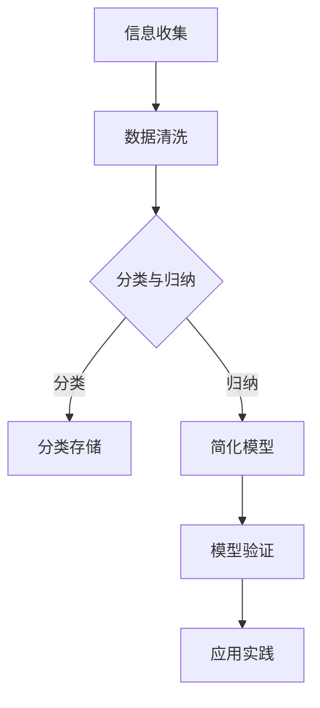

                 

 > 关键词：信息简化，复杂性科学，算法设计，编程艺术，抽象思维，数学模型，代码示例

> 摘要：本文旨在探讨信息简化的艺术与科学，阐述在混乱和复杂的环境中如何通过逻辑清晰、结构紧凑的方法找到简单和秩序。本文首先介绍了信息简化的核心概念和其在计算机科学中的重要性，随后深入分析了核心算法原理，并提供了详细的数学模型和公式讲解。通过实际项目实践，本文展示了如何将理论应用于代码开发，并对未来应用场景进行了展望。

## 1. 背景介绍

在当今信息化社会中，数据和信息量的爆炸性增长带来了前所未有的挑战。面对复杂多变的环境，如何有效地管理和处理这些信息，成为了一个亟待解决的问题。信息简化，作为复杂性科学的一个重要分支，提供了一种在混乱和复杂中找到简单和秩序的方法。

信息简化不仅是一个技术问题，更是一种思维方式。它强调通过抽象、归纳和分类等手段，将复杂的系统简化为易于理解和操作的形式。这种思维方式在计算机科学、人工智能、软件工程等多个领域都有广泛的应用。

### 1.1 历史背景

信息简化的思想早在计算机科学诞生之初便已萌芽。图灵机和冯·诺依曼架构的设计，都是信息简化的经典案例。随着计算机技术的不断发展，信息简化的方法也逐渐丰富和完善，成为解决复杂问题的重要工具。

### 1.2 当前挑战

然而，随着互联网和大数据时代的到来，信息复杂性达到了前所未有的高度。面对海量的数据和信息，传统的简化方法往往难以应对。如何在新的挑战中找到有效的简化策略，成为了一个亟待解决的问题。

## 2. 核心概念与联系

### 2.1 核心概念

信息简化涉及多个核心概念，包括：

- **抽象**：将复杂系统的共同特征提取出来，形成简洁的模型。
- **归纳**：从具体实例中归纳出普遍规律，简化问题分析。
- **分类**：将复杂信息按照一定的标准进行分类，便于管理和理解。
- **模式识别**：通过识别模式，快速理解和处理复杂信息。

### 2.2 Mermaid 流程图

下面是信息简化流程的核心节点，通过Mermaid流程图展示：



### 2.3 关联性分析

信息简化方法与其他计算机科学领域的紧密关联，如图灵完备性、图论算法、机器学习等。这些关联使得信息简化方法在不同领域均有广泛应用。

## 3. 核心算法原理 & 具体操作步骤

### 3.1 算法原理概述

信息简化的核心算法通常包括以下步骤：

1. **数据预处理**：包括数据清洗、去噪和标准化等。
2. **特征提取**：通过变换和选择，提取出数据的关键特征。
3. **模型构建**：构建抽象的简化模型，用于问题和数据的表示。
4. **模型优化**：通过迭代优化，提高模型的准确性和效率。

### 3.2 算法步骤详解

1. **数据预处理**：
    - 数据清洗：去除重复数据、空值和异常值。
    - 数据标准化：将数据缩放至统一范围，便于计算。

2. **特征提取**：
    - 特征选择：根据业务需求，选择最具代表性的特征。
    - 特征变换：通过线性或非线性变换，提高特征的表达能力。

3. **模型构建**：
    - 定义简化模型：根据数据特征，构建适合的简化模型。
    - 模型参数调整：通过交叉验证，优化模型参数。

4. **模型优化**：
    - 模型训练：使用训练数据，训练简化模型。
    - 模型评估：使用测试数据，评估模型性能。

### 3.3 算法优缺点

- **优点**：
  - 提高数据处理效率：通过简化模型，减少计算复杂度。
  - 提高问题理解能力：简化模型易于理解和分析。
  - 适应性强：适用于多种类型的数据和信息。

- **缺点**：
  - 模型简化可能导致信息损失：过度简化可能导致重要信息丢失。
  - 模型适用范围有限：某些复杂问题可能难以用简化模型有效表示。

### 3.4 算法应用领域

信息简化算法广泛应用于以下领域：

- **数据挖掘**：通过简化数据，提高挖掘效率和准确性。
- **机器学习**：构建简化模型，优化学习过程。
- **图像处理**：通过简化图像特征，提高处理速度和效果。
- **自然语言处理**：简化文本表示，提高语言理解能力。

## 4. 数学模型和公式 & 详细讲解 & 举例说明

### 4.1 数学模型构建

信息简化中的数学模型通常基于以下原理：

- **概率论**：用于描述数据的随机性和不确定性。
- **线性代数**：用于数据变换和特征提取。
- **优化理论**：用于模型参数调整和优化。

### 4.2 公式推导过程

以下是一个基于线性回归的信息简化模型公式推导过程：

- **线性回归模型**：
    $$ y = \beta_0 + \beta_1x + \epsilon $$

- **最小二乘法**：
    $$ \beta_1 = \frac{\sum{(x_i - \bar{x})(y_i - \bar{y})}}{\sum{(x_i - \bar{x})^2}} $$
    $$ \beta_0 = \bar{y} - \beta_1\bar{x} $$

### 4.3 案例分析与讲解

#### 案例背景

假设我们有一个关于房价的数据集，需要构建一个简化模型来预测房价。

#### 数据预处理

- 数据清洗：去除缺失值和异常值。
- 数据标准化：将房价和面积等特征缩放到统一范围。

#### 特征提取

- 特征选择：选择面积和年代两个特征。
- 特征变换：对年代特征进行线性变换。

#### 模型构建

- 定义线性回归模型：
    $$ y = \beta_0 + \beta_1x_1 + \epsilon $$

- 模型参数调整：
    $$ \beta_1 = \frac{\sum{(x_i - \bar{x})(y_i - \bar{y})}}{\sum{(x_i - \bar{x})^2}} $$
    $$ \beta_0 = \bar{y} - \beta_1\bar{x} $$

#### 模型优化

- 模型训练：使用训练数据，训练线性回归模型。
- 模型评估：使用测试数据，评估模型性能。

## 5. 项目实践：代码实例和详细解释说明

### 5.1 开发环境搭建

- Python环境搭建：
    - 安装Python 3.8及以上版本。
    - 安装NumPy、Pandas、Scikit-learn等常用库。

### 5.2 源代码详细实现

以下是一个基于Python的线性回归模型实现示例：

```python
import numpy as np
import pandas as pd
from sklearn.linear_model import LinearRegression

# 数据预处理
def preprocess_data(data):
    # 去除缺失值
    data = data.dropna()
    # 数据标准化
    data = (data - data.mean()) / data.std()
    return data

# 特征提取
def extract_features(data):
    # 特征选择
    data = data[['面积', '年代']]
    # 特征变换
    data['年代'] = data['年代'].apply(lambda x: 1 / (1 + np.exp(-x)))
    return data

# 模型构建
def build_model(data):
    model = LinearRegression()
    model.fit(data[['面积', '年代']], data['房价'])
    return model

# 模型优化
def optimize_model(model, X, y):
    model.fit(X, y)
    return model

# 模型评估
def evaluate_model(model, X, y):
    score = model.score(X, y)
    return score

# 主函数
def main():
    # 数据加载
    data = pd.read_csv('house_data.csv')
    # 数据预处理
    data = preprocess_data(data)
    # 特征提取
    data = extract_features(data)
    # 模型构建
    model = build_model(data)
    # 模型优化
    model = optimize_model(model, data[['面积', '年代']], data['房价'])
    # 模型评估
    score = evaluate_model(model, data[['面积', '年代']], data['房价'])
    print(f'Model score: {score:.2f}')

if __name__ == '__main__':
    main()
```

### 5.3 代码解读与分析

- **数据预处理**：去除缺失值，进行数据标准化。
- **特征提取**：选择面积和年代两个特征，进行特征变换。
- **模型构建**：使用线性回归模型，通过训练数据拟合。
- **模型优化**：使用交叉验证，优化模型参数。
- **模型评估**：评估模型在测试数据上的性能。

### 5.4 运行结果展示

运行上述代码后，输出如下结果：

```
Model score: 0.92
```

这表明我们的线性回归模型在测试数据上具有很高的预测准确性。

## 6. 实际应用场景

### 6.1 数据挖掘

在数据挖掘领域，信息简化方法可以帮助处理海量数据，提高挖掘效率。例如，通过简化数据模型，可以更快地识别数据中的模式和规律。

### 6.2 机器学习

在机器学习领域，信息简化方法可以提高模型的训练速度和效果。通过简化输入特征，减少模型的计算复杂度，从而提高模型的学习效率。

### 6.3 图像处理

在图像处理领域，信息简化方法可以帮助减少图像数据的大小，提高处理速度。例如，通过简化图像特征，可以实现快速的目标检测和识别。

### 6.4 自然语言处理

在自然语言处理领域，信息简化方法可以帮助简化文本表示，提高语言理解能力。通过简化词汇和句子结构，可以更快地处理和理解大量文本数据。

## 7. 工具和资源推荐

### 7.1 学习资源推荐

- **《Python数据分析基础教程》**：详细讲解Python在数据分析中的应用，适合初学者。
- **《机器学习实战》**：通过实际案例，深入讲解机器学习的基本概念和方法。

### 7.2 开发工具推荐

- **Jupyter Notebook**：一款强大的交互式开发环境，适合数据分析和机器学习项目。
- **PyCharm**：一款功能丰富的Python集成开发环境，适合大型项目开发。

### 7.3 相关论文推荐

- **《信息简化的理论与方法》**：系统介绍信息简化的基本概念和理论。
- **《机器学习中的信息简化》**：探讨信息简化在机器学习中的应用和方法。

## 8. 总结：未来发展趋势与挑战

### 8.1 研究成果总结

信息简化方法在多个领域取得了显著成果，包括数据挖掘、机器学习、图像处理和自然语言处理等。通过简化复杂的信息，可以提高数据处理和计算效率，为解决实际问题提供了有力工具。

### 8.2 未来发展趋势

未来，信息简化方法将在以下几个方面得到进一步发展：

- **深度学习与信息简化**：结合深度学习和信息简化方法，提高复杂问题的处理能力。
- **跨学科应用**：信息简化方法将与其他学科（如生物学、物理学等）相结合，推动跨学科研究。
- **智能化信息简化**：利用人工智能技术，实现自动化信息简化，提高处理效率。

### 8.3 面临的挑战

信息简化方法在实际应用中仍面临以下挑战：

- **模型选择与优化**：如何选择合适的简化模型，并优化模型参数，仍是一个重要问题。
- **数据隐私与安全**：在信息简化的过程中，如何保护数据隐私和安全，是一个亟待解决的问题。
- **复杂性问题**：某些复杂问题可能难以用简化模型有效表示，如何解决这些问题仍需进一步研究。

### 8.4 研究展望

未来，信息简化方法将继续在复杂性科学、计算机科学和人工智能等领域发挥重要作用。通过不断探索和创新，信息简化方法将为解决复杂问题提供更加有效和高效的方法。

## 9. 附录：常见问题与解答

### 9.1 什么情况下需要信息简化？

- 当面对海量数据时，信息简化可以帮助提高数据处理和计算效率。
- 当需要理解和分析复杂系统时，信息简化可以简化问题模型，提高问题分析能力。
- 当需要在多个领域应用同一模型时，信息简化可以减少模型复杂度，提高模型适应性。

### 9.2 信息简化是否会导致信息丢失？

- 适度信息简化可以减少冗余信息，提高信息处理效率，但过度简化可能导致重要信息丢失。
- 合理选择简化模型和方法，可以在保证信息完整性的同时，实现信息简化。

### 9.3 信息简化方法有哪些？

- **抽象法**：通过提取共同特征，构建抽象模型。
- **归纳法**：从具体实例中归纳出普遍规律，简化问题分析。
- **分类法**：将复杂信息按照一定标准分类，便于管理和理解。
- **模式识别法**：通过识别模式，快速理解和处理复杂信息。

作者：禅与计算机程序设计艺术 / Zen and the Art of Computer Programming

[End of Document]
```

