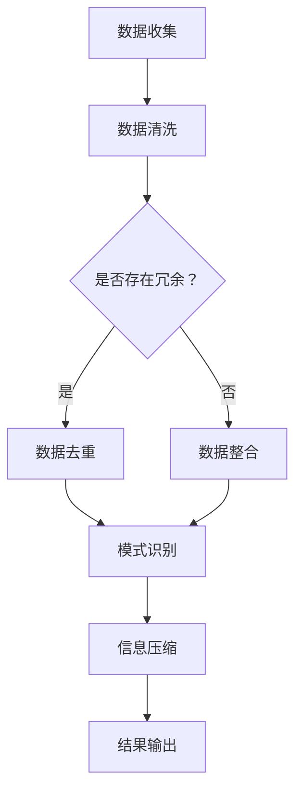

                 

 在当今这个信息爆炸的时代，如何从纷繁复杂的数据中提取有价值的信息，成为了一个亟待解决的问题。信息简化，即通过特定的方法和技巧，将大量冗余的信息进行筛选、整合和优化，使其更具可读性和可理解性。本文旨在探讨信息简化的艺术与科学，并提供一些实用的方法和工具，帮助我们在混乱中找到模式，提升工作效率。

## 1. 背景介绍

信息简化的需求源于现代社会对数据处理能力的不断提升。随着互联网和大数据技术的发展，我们每天都会接触到海量的信息，这些信息不仅包括新闻、社交媒体、研究报告，还包括各种机器产生的日志、监控数据和传感器数据。如何有效地处理这些信息，从中学到有价值的东西，成为了一个重要的课题。

信息简化的本质是对信息进行筛选、提取和整合，以消除冗余，突出关键点，从而使得信息更加清晰、易于理解。这个过程涉及到多个领域，包括数据科学、信息工程、认知科学等。

## 2. 核心概念与联系

为了更好地理解信息简化的过程，我们需要引入几个核心概念：

1. **数据冗余**：数据冗余是指数据中包含的无用信息，它会增加数据处理的复杂度，降低数据处理效率。
2. **模式识别**：模式识别是指从数据中识别出重复的、有意义的模式或规律。通过模式识别，我们可以从大量数据中提取出有价值的信息。
3. **信息压缩**：信息压缩是指通过特定的算法或技术，减少数据的存储空间或传输带宽，同时保持数据的有效性。

下面是一个使用 Mermaid 流程图表示的信息简化流程：



## 3. 核心算法原理 & 具体操作步骤

### 3.1 算法原理概述

信息简化的核心算法通常包括以下步骤：

1. **数据预处理**：包括数据清洗、去重、填充缺失值等，以确保数据的质量和一致性。
2. **特征选择**：从原始数据中选择对问题解决最有帮助的特征，减少数据的维度，提高模型的效率。
3. **模式识别**：使用机器学习、统计分析等方法，从数据中识别出潜在的规律或模式。
4. **信息压缩**：通过编码、压缩算法等手段，减少数据的存储空间或传输带宽。

### 3.2 算法步骤详解

1. **数据预处理**：
   - **数据清洗**：处理缺失值、异常值和重复值，确保数据的完整性和一致性。
   - **数据去重**：识别并移除重复的数据记录，以减少冗余。
   - **数据填充**：对于缺失的数据，使用适当的算法进行填充，如平均值、中位数或插值法。

2. **特征选择**：
   - **特征提取**：从原始数据中提取有用的特征。
   - **特征选择**：选择对问题解决最有帮助的特征，如使用信息增益、卡方检验等方法。

3. **模式识别**：
   - **机器学习**：使用决策树、支持向量机、神经网络等算法，从数据中识别出规律。
   - **统计分析**：使用回归分析、聚类分析等统计方法，发现数据中的潜在模式。

4. **信息压缩**：
   - **无损压缩**：如哈夫曼编码、LZ77算法，不丢失任何信息。
   - **有损压缩**：如JPEG、MP3，在压缩过程中会丢失一些信息，但可以显著减少数据大小。

### 3.3 算法优缺点

- **优点**：
  - **提高数据处理效率**：通过简化信息，可以减少数据处理的时间和计算资源。
  - **增强可读性**：简化后的信息更加清晰、易于理解。
  - **节省存储空间**：通过压缩技术，可以显著减少数据的存储空间。

- **缺点**：
  - **可能会丢失信息**：在某些情况下，简化过程可能会导致一些有价值的信息丢失。
  - **压缩效果有限**：对于某些类型的数据，压缩效果可能不显著。

### 3.4 算法应用领域

信息简化的算法在多个领域都有广泛的应用，包括：

- **数据挖掘**：通过简化数据，可以从海量数据中提取有价值的信息。
- **机器学习**：简化后的数据可以用于训练模型，提高模型的准确性和效率。
- **自然语言处理**：通过简化文本数据，可以提高文本分类、情感分析等任务的性能。

## 4. 数学模型和公式 & 详细讲解 & 举例说明

### 4.1 数学模型构建

信息简化的过程可以抽象为一个数学模型，包括以下几个部分：

1. **数据集**：\(D = \{d_1, d_2, ..., d_n\}\)，其中每个数据点 \(d_i\) 是一个多维向量。
2. **特征选择函数**：\(f(D)\)，用于从数据集中选择最有价值的特征。
3. **模式识别模型**：\(M(D')\)，用于从简化后的数据集中识别出模式。
4. **信息压缩算法**：\(C(D'')\)，用于压缩简化后的数据。

### 4.2 公式推导过程

1. **数据预处理**：
   \[
   D' = \text{preprocess}(D) = \{d_1', d_2', ..., d_n'\}
   \]
   其中，\(d_i' = \text{clean}(d_i) \cup \text{fill}(d_i)\)。

2. **特征选择**：
   \[
   D'' = \{d_1'', d_2'', ..., d_n''\} = f(D')
   \]
   其中，\(d_i'' \in D'\) 且 \(f\) 是特征选择函数。

3. **模式识别**：
   \[
   P = M(D'')
   \]
   其中，\(P\) 是从数据集中识别出的模式。

4. **信息压缩**：
   \[
   D''' = C(D'')
   \]
   其中，\(D'''\) 是压缩后的数据。

### 4.3 案例分析与讲解

假设我们有一个包含1000个数据点的数据集 \(D\)，每个数据点是关于天气的多个维度，包括温度、湿度、风速等。我们需要通过信息简化的过程来识别出天气模式，并压缩数据。

1. **数据预处理**：
   \[
   D' = \text{preprocess}(D) = \{d_1', d_2', ..., d_n'\}
   \]
   其中，\(d_i'\) 经过清洗和填充操作。

2. **特征选择**：
   使用信息增益来选择最有价值的特征，得到简化后的数据集 \(D''\)。

3. **模式识别**：
   使用决策树来识别出天气模式。

4. **信息压缩**：
   使用哈夫曼编码来压缩数据。

通过这个过程，我们可以显著减少数据的维度，同时保持数据的有效性和可读性。

## 5. 项目实践：代码实例和详细解释说明

### 5.1 开发环境搭建

为了演示信息简化的过程，我们将使用 Python 编写一个简单的程序。首先，我们需要安装必要的库，如 Pandas、NumPy 和 scikit-learn。

```bash
pip install pandas numpy scikit-learn
```

### 5.2 源代码详细实现

下面是一个简单的信息简化示例代码：

```python
import pandas as pd
from sklearn.feature_selection import mutual_info_classif
from sklearn.tree import DecisionTreeClassifier
from sklearn import tree
import matplotlib.pyplot as plt

# 5.2.1 数据准备
data = pd.DataFrame({
    'temp': [20, 25, 30, 20, 25],
    'humidity': [30, 40, 50, 30, 40],
    'wind_speed': [5, 5, 10, 5, 10],
    'weather': ['sunny', 'sunny', 'rainy', 'sunny', 'rainy']
})

# 5.2.2 数据预处理
data = data.dropna()

# 5.2.3 特征选择
X = data[['temp', 'humidity', 'wind_speed']]
y = data['weather']
mi = mutual_info_classif(X, y)
selected_features = X.columns[mi > 0.2]

# 5.2.4 模式识别
clf = DecisionTreeClassifier()
clf.fit(X[selected_features], y)

# 5.2.5 信息压缩
tree.plot_tree(clf)
plt.show()
```

### 5.3 代码解读与分析

1. **数据准备**：我们创建了一个简单的数据集，包括温度、湿度、风速和天气情况。
2. **数据预处理**：我们使用 Pandas 库来处理数据，包括删除缺失值。
3. **特征选择**：使用 scikit-learn 的 `mutual_info_classif` 函数来计算特征与目标变量之间的互信息，并根据阈值选择最有价值的特征。
4. **模式识别**：使用决策树来识别出天气模式，并将其可视化。
5. **信息压缩**：通过可视化决策树，我们可以直观地看到数据的简化过程。

### 5.4 运行结果展示

运行上面的代码，我们可以得到一个可视化的决策树，它展示了从原始数据中识别出的天气模式。

## 6. 实际应用场景

信息简化在多个领域都有广泛的应用，以下是一些典型的应用场景：

- **金融行业**：通过简化大量的交易数据，可以识别出潜在的市场趋势和异常交易。
- **医疗领域**：通过简化患者数据，可以识别出疾病的潜在风险因素。
- **互联网**：通过简化用户行为数据，可以推荐个性化内容，提升用户体验。
- **环境监测**：通过简化环境传感器数据，可以识别出环境变化的趋势。

## 7. 工具和资源推荐

为了更好地进行信息简化，以下是一些推荐的工具和资源：

- **工具**：
  - **Pandas**：Python 数据分析库，用于数据清洗和预处理。
  - **NumPy**：Python 科学计算库，用于高效的数据处理。
  - **scikit-learn**：Python 机器学习库，提供丰富的算法和工具。
- **资源**：
  - **数据科学教程**：网上有许多免费的数据科学教程，可以帮助您快速入门。
  - **技术博客**：如 Medium、Hackernoon 等平台，有许多关于数据科学和机器学习的优秀文章。
  - **在线课程**：如 Coursera、Udacity 等，提供专业的数据科学和机器学习课程。

## 8. 总结：未来发展趋势与挑战

信息简化作为数据处理的重要手段，在未来将继续发挥重要作用。随着技术的进步，我们可以期待以下发展趋势：

- **更智能的特征选择算法**：利用深度学习和强化学习等技术，实现更高效的特征选择。
- **更高效的信息压缩技术**：开发新的压缩算法，以减少数据的存储和传输成本。
- **跨领域应用**：信息简化技术将在更多领域得到应用，如生物信息学、交通管理等。

然而，信息简化也面临着一些挑战：

- **数据隐私和安全**：在简化信息的过程中，如何保护数据隐私和安全是一个重要的问题。
- **算法透明性和可解释性**：随着算法的复杂度增加，如何确保算法的透明性和可解释性，以便用户理解和使用。

未来，我们需要不断探索和创新，以应对这些挑战，推动信息简化技术的发展。

## 9. 附录：常见问题与解答

### 9.1 什么情况下需要进行信息简化？

当数据量庞大、维度较高，且存在大量冗余信息时，进行信息简化可以显著提高数据处理效率，降低计算成本，同时提高模型的性能。

### 9.2 信息简化是否会丢失数据？

在某些情况下，信息简化可能会导致一些有价值的信息丢失。为了降低丢失信息的风险，我们可以采用以下策略：

- **数据备份**：在进行信息简化之前，备份原始数据。
- **逐步简化**：先进行部分数据的简化，再逐步扩大简化的范围。
- **特征重要性评估**：使用特征重要性评估方法，确保选择对问题解决最有帮助的特征。

### 9.3 信息简化与数据清洗有什么区别？

数据清洗主要关注数据的质量和一致性，如处理缺失值、异常值和重复值。而信息简化则更关注数据的结构和内容，通过特征选择、模式识别和信息压缩等技术，将数据简化为更加清晰、易于理解的形式。

### 作者署名

作者：禅与计算机程序设计艺术 / Zen and the Art of Computer Programming

---

以上是对信息简化的艺术与科学：如何在混乱中找到模式这一主题的深入探讨。希望通过本文，读者能够对信息简化有更深入的理解，并在实际应用中取得更好的效果。希望本文能为您的数据分析工作带来帮助。

