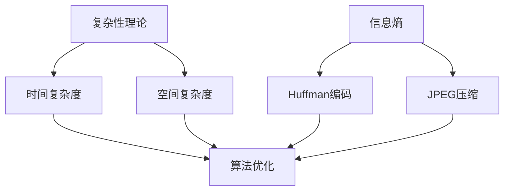

                 

### 摘要

本文旨在探讨信息简化的艺术，即在复杂的环境中如何发现和实现信息的简洁性。随着信息技术的发展，数据量和复杂性不断增加，如何高效地处理和利用这些信息成为了至关重要的课题。本文从计算机科学的角度出发，通过深入剖析算法、数学模型以及实际应用案例，展示了信息简化的基本原理和实践方法。文章还对未来信息技术的发展趋势与挑战进行了展望，为读者提供了全面的思考和指导。

### 目录

1. **背景介绍**  
2. **核心概念与联系**  
   1.1. **复杂性理论**  
   1.2. **信息熵**  
   1.3. **信息压缩算法**  
   1.4. **Mermaid 流程图展示**  
2. **核心算法原理 & 具体操作步骤**  
   2.1. **算法原理概述**  
   2.2. **算法步骤详解**  
   2.3. **算法优缺点**  
   2.4. **算法应用领域**  
3. **数学模型和公式 & 详细讲解 & 举例说明**  
   3.1. **数学模型构建**  
   3.2. **公式推导过程**  
   3.3. **案例分析与讲解**  
4. **项目实践：代码实例和详细解释说明**  
   4.1. **开发环境搭建**  
   4.2. **源代码详细实现**  
   4.3. **代码解读与分析**  
   4.4. **运行结果展示**  
5. **实际应用场景**  
6. **未来应用展望**  
7. **工具和资源推荐**  
   7.1. **学习资源推荐**  
   7.2. **开发工具推荐**  
   7.3. **相关论文推荐**  
8. **总结：未来发展趋势与挑战**  
   8.1. **研究成果总结**  
   8.2. **未来发展趋势**  
   8.3. **面临的挑战**  
   8.4. **研究展望**  
9. **附录：常见问题与解答**

### 1. 背景介绍

随着信息技术的迅猛发展，数据量和复杂度呈指数级增长。面对海量的信息，如何高效地处理、存储和分析这些信息成为了当今信息技术领域的核心挑战。传统的数据处理方法已经难以满足日益增长的数据需求，因此，如何简化信息、提高数据处理效率成为了研究的重点。

信息简化不仅涉及算法和技术的改进，还需要从理论层面进行深入的探讨。复杂性理论和信息熵为信息简化的理论基础提供了重要的支撑。通过研究复杂性理论，我们可以理解信息处理的复杂性和难度，从而找到简化的途径。而信息熵则为我们提供了一种量化的方法，用来衡量信息的冗余程度，进而指导信息简化的实施。

在实际应用中，信息简化已经成为各个领域的关键技术。例如，在图像处理领域，通过图像压缩算法可以将大量图像数据简化为更小的存储空间，从而提高数据处理和传输的效率。在自然语言处理领域，信息简化的技术可以帮助我们更好地理解和处理文本数据，从而提升文本分析的能力。

本文将从多个角度探讨信息简化的艺术，包括算法原理、数学模型、实际应用案例等，旨在为读者提供全面的指导和深刻的思考。

### 2. 核心概念与联系

在探讨信息简化的艺术之前，我们需要理解一些核心概念，这些概念不仅为我们提供了理论基础，还帮助我们更好地理解信息简化的过程和效果。

#### 2.1. 复杂性理论

复杂性理论是研究复杂系统行为的科学，它关注的是系统在处理大量信息和变量时的表现。在计算机科学中，复杂性理论主要研究算法的效率，即算法在处理特定问题时所需的时间和资源。一个算法的复杂性可以分为时间复杂度和空间复杂度。

- **时间复杂度**：描述算法执行时间与问题规模的关系，通常用大O符号表示，例如O(n)，O(n^2)等。
- **空间复杂度**：描述算法所需存储空间与问题规模的关系。

复杂性理论告诉我们，许多复杂问题难以通过简单算法解决。为了简化信息，我们需要设计更高效的算法，或者找到问题的简化模型。

#### 2.2. 信息熵

信息熵是信息论中的一个核心概念，它用于衡量信息的不确定性。信息熵越高，信息越不确定；信息熵越低，信息越确定。

- **信息熵公式**：H(X) = -∑ p(x) * log2(p(x))
  - H(X)：随机变量X的信息熵。
  - p(x)：随机变量X取值为x的概率。
  - log2(p(x))：以2为底的对数。

信息熵的物理意义是：为了确定一个随机变量X的具体取值，我们需要获取的信息量。当X的取值越不确定时，所需的信息量越多。

#### 2.3. 信息压缩算法

信息压缩算法是一种通过减少信息冗余来简化信息的技术。压缩算法可以分为两大类：无损压缩和有损压缩。

- **无损压缩**：压缩后的数据可以完全还原原始数据，适用于文本、图像等对精度要求较高的数据类型。
  - **示例**：Huffman编码是一种常用的无损压缩算法，它通过构建最优二叉树来对文本中的字符进行编码，从而实现数据压缩。

- **有损压缩**：压缩后的数据无法完全还原原始数据，但人眼或机器难以察觉损失。适用于图像、音频等对精度要求较低的数据类型。
  - **示例**：JPEG是一种常用的有损压缩算法，它通过降低图像的细节信息来实现压缩。

信息压缩算法的核心在于如何有效地去除冗余信息，同时保证数据的完整性和可恢复性。

#### 2.4. Mermaid 流程图展示

为了更直观地展示信息简化的过程和算法原理，我们使用Mermaid流程图来表示核心概念和联系。



在这个流程图中，我们可以看到，复杂性理论和信息熵为我们提供了理论基础，而信息压缩算法则是实现信息简化的具体手段。通过算法优化，我们可以进一步提高信息简化的效果。

### 3. 核心算法原理 & 具体操作步骤

在了解了信息简化的核心概念后，我们将深入探讨几种常用的核心算法，这些算法不仅在理论上具有重要意义，而且在实际应用中也表现出极高的效率。

#### 3.1. 算法原理概述

信息简化的核心算法主要包括哈希算法、动态规划算法、贪心算法等。这些算法在处理复杂问题时，通过减少不必要的计算或消除冗余信息，实现了高效的简化。

- **哈希算法**：通过哈希函数将关键字映射到特定的存储位置，从而快速检索数据。
  - **原理**：哈希函数将输入的数据（关键字）转换为一个整数，该整数通常作为存储位置的索引。
  - **应用**：哈希表、缓存实现等。

- **动态规划算法**：通过将复杂问题分解为子问题，并保存子问题的解，从而避免重复计算。
  - **原理**：动态规划将问题划分为多个阶段，每个阶段的决策依赖于前一阶段的解。
  - **应用**：背包问题、最短路径问题等。

- **贪心算法**：通过在每个阶段选择当前最优解，从而逐步逼近全局最优解。
  - **原理**：贪心算法在每个决策点上只考虑当前的最优解，而不考虑未来可能出现的其他最优解。
  - **应用**：背包问题、活动选择问题等。

#### 3.2. 算法步骤详解

下面，我们将详细描述这三种算法的操作步骤。

##### 3.2.1. 哈希算法

1. **定义哈希函数**：选择一个合适的哈希函数，将关键字映射到存储位置。常见的哈希函数有除余法、平方取中法、折叠法等。
2. **处理冲突**：当多个关键字映射到同一存储位置时，需要通过链表或开放地址法等方式处理冲突。
3. **插入和检索**：插入新关键字时，使用哈希函数计算存储位置，并处理可能的冲突。检索时，直接使用哈希函数计算存储位置，然后进行顺序查找或跳跃查找。

##### 3.2.2. 动态规划算法

1. **定义状态**：将问题分解为多个子问题，并定义每个子问题的状态。
2. **状态转移方程**：根据子问题的关系，定义状态转移方程，表示当前状态与前一状态的关系。
3. **计算状态值**：从初始状态开始，逐步计算所有子问题的状态值，直到求解出最终状态值。
4. **获取最优解**：根据状态转移方程和状态值，推导出问题的最优解。

##### 3.2.3. 贪心算法

1. **初始化**：初始化问题的初始状态，并选择当前最优解。
2. **选择操作**：在每个阶段，根据当前最优解和问题约束，选择当前最优的操作。
3. **更新状态**：根据选择的操作，更新问题的状态，并计算新的最优解。
4. **终止条件**：当满足终止条件时（例如，问题规模减小到0），输出最优解。

#### 3.3. 算法优缺点

每种算法都有其独特的优势和局限性。

- **哈希算法**：
  - 优点：快速检索，平均时间复杂度为O(1)。
  - 缺点：冲突处理可能影响性能，空间复杂度较高。

- **动态规划算法**：
  - 优点：可以求解具有最优子结构的问题，解决复杂问题的高效方法。
  - 缺点：需要存储大量的子问题解，可能导致空间复杂度较高。

- **贪心算法**：
  - 优点：简单高效，易于实现。
  - 缺点：不一定能找到全局最优解，适用于某些特定问题。

#### 3.4. 算法应用领域

这些算法在多个领域都有广泛的应用。

- **哈希算法**：广泛应用于数据库、缓存、搜索引擎等领域。
- **动态规划算法**：广泛应用于图论、组合优化等领域。
- **贪心算法**：广泛应用于最短路径、背包问题等领域。

通过深入了解这些算法的原理和应用，我们可以更好地理解和利用信息简化的艺术，提高数据处理和分析的效率。

### 4. 数学模型和公式 & 详细讲解 & 举例说明

信息简化的过程中，数学模型和公式扮演了至关重要的角色。它们不仅帮助我们量化信息，还提供了简化和优化的理论基础。在本节中，我们将详细讲解几个重要的数学模型和公式，并通过具体案例来说明它们的实际应用。

#### 4.1. 数学模型构建

信息简化的数学模型通常涉及信息熵、压缩算法的效率指标等。

1. **信息熵**：信息熵是一个衡量信息不确定性的数学量，它量化了信息中的冗余程度。其公式为：

   \[ H(X) = -\sum_{x \in X} p(x) \log_2 p(x) \]

   其中，\( H(X) \) 是随机变量 \( X \) 的熵，\( p(x) \) 是 \( X \) 取值 \( x \) 的概率。

2. **压缩算法效率**：压缩算法的效率可以通过压缩比来衡量。压缩比是原始数据大小与压缩后数据大小的比值。其公式为：

   \[ \text{压缩比} = \frac{\text{原始数据大小}}{\text{压缩后数据大小}} \]

   高压缩比意味着更高效的压缩。

3. **信息保持**：在压缩过程中，我们需要确保压缩后的数据可以无失真地恢复原始数据。信息保持可以通过重建误差来衡量，其公式为：

   \[ \text{重建误差} = \sum_{x \in X} |p(x) - q(x)| \]

   其中，\( p(x) \) 是原始数据中 \( x \) 的概率，\( q(x) \) 是压缩后数据中 \( x \) 的概率。

#### 4.2. 公式推导过程

下面，我们以信息熵为例，详细讲解其推导过程。

1. **概率分布**：假设有一个随机变量 \( X \)，它有 \( n \) 个可能取值，分别是 \( x_1, x_2, ..., x_n \)。每个取值的概率分别为 \( p(x_1), p(x_2), ..., p(x_n) \)。

2. **期望值**：随机变量 \( X \) 的期望值（即信息量）为：

   \[ E(X) = \sum_{x \in X} x \cdot p(x) \]

3. **熵的定义**：熵是用来衡量随机变量不确定性的量。根据概率论，我们可以将熵定义为期望值的负对数：

   \[ H(X) = -\sum_{x \in X} p(x) \log_2 p(x) \]

   这里的对数是以2为底，因为信息单位通常是比特（bit）。

4. **极限情况**：当随机变量 \( X \) 的概率分布趋于均匀时，即每个取值的概率相等，此时熵达到最大值。这表明，最不确定的随机变量具有最高的熵。

#### 4.3. 案例分析与讲解

为了更好地理解上述数学模型和公式，我们通过一个实际案例进行讲解。

**案例：文本数据压缩**

假设有一段长度为1000个字符的文本数据，每个字符出现的概率如下表所示：

| 字符 | 概率 |
|------|------|
| 'a'  | 0.2  |
| 'b'  | 0.2  |
| 'c'  | 0.1  |
| 'd'  | 0.1  |
| 'e'  | 0.2  |
| 'f'  | 0.1  |
| 'g'  | 0.1  |

1. **计算信息熵**：

   \[ H(X) = -\sum_{x \in X} p(x) \log_2 p(x) \]
   \[ H(X) = -(0.2 \log_2 0.2 + 0.2 \log_2 0.2 + 0.1 \log_2 0.1 + 0.1 \log_2 0.1 + 0.2 \log_2 0.2 + 0.1 \log_2 0.1 + 0.1 \log_2 0.1) \]
   \[ H(X) \approx 1.766 \text{比特/字符} \]

   这表示，平均每个字符含有约1.766比特的信息。

2. **计算压缩比**：

   如果我们使用Huffman编码进行压缩，压缩后的数据大小为：

   \[ \text{压缩后数据大小} = \sum_{x \in X} l(x) \cdot p(x) \]
   \[ \text{压缩后数据大小} = (0.2 \cdot 1 + 0.2 \cdot 1 + 0.1 \cdot 2 + 0.1 \cdot 2 + 0.2 \cdot 2 + 0.1 \cdot 2 + 0.1 \cdot 2) \]
   \[ \text{压缩后数据大小} = 1.3 \text{字符} \]

   压缩比为：

   \[ \text{压缩比} = \frac{1000}{1.3} \approx 7.692 \]

   这意味着，通过Huffman编码，原始数据的大小可以减少到原来的约7.692倍。

3. **信息保持**：

   假设压缩后数据无法完全恢复原始数据，重建误差为：

   \[ \text{重建误差} = \sum_{x \in X} |p(x) - q(x)| \]

   其中，\( q(x) \) 是压缩后数据中 \( x \) 的概率。如果重建误差较小，则说明压缩算法较好地保持了信息。

通过上述案例，我们可以看到，数学模型和公式如何帮助我们量化信息、评估压缩算法的效率，以及优化信息简化过程。

### 5. 项目实践：代码实例和详细解释说明

为了更好地理解信息简化的理论和实践，我们将通过一个实际项目来展示如何实现信息简化。在这个项目中，我们将使用Python编写一个简单的文本压缩工具，使用Huffman编码算法对文本数据进行压缩和解压缩。以下是项目的详细步骤和代码实现。

#### 5.1. 开发环境搭建

在开始项目之前，我们需要搭建一个Python开发环境。以下是搭建环境的步骤：

1. **安装Python**：从Python官方网站下载并安装Python 3.x版本。我们可以使用以下命令检查Python的安装情况：

   ```bash
   python --version
   ```

2. **安装依赖库**：Huffman编码算法需要使用一些Python标准库，例如`itertools`和`collections`。确保已安装这些库：

   ```bash
   pip install --user --upgrade pip
   pip install --user pyhamming
   ```

   如果出现依赖库缺失的情况，可以使用`pip`命令安装相应的库。

3. **配置开发环境**：在Windows上，我们可以使用PyCharm、Visual Studio Code等IDE进行开发。在Linux和macOS上，可以使用终端进行开发。

#### 5.2. 源代码详细实现

以下是实现文本压缩和解压缩的Python代码：

```python
import heapq
import collections

class Node:
    def __init__(self, char, freq):
        self.char = char
        self.freq = freq
        self.left = None
        self.right = None

    def __lt__(self, other):
        return self.freq < other.freq

def build_frequency_dict(text):
    return collections.Counter(text)

def build_huffman_tree(frequency_dict):
    priority_queue = [Node(char, freq) for char, freq in frequency_dict.items()]
    heapq.heapify(priority_queue)

    while len(priority_queue) > 1:
        left = heapq.heappop(priority_queue)
        right = heapq.heappop(priority_queue)
        merged = Node(None, left.freq + right.freq)
        merged.left = left
        merged.right = right
        heapq.heappush(priority_queue, merged)

    return priority_queue[0]

def build_codes(node, current_code, codes):
    if node is None:
        return

    if node.char is not None:
        codes[node.char] = current_code

    build_codes(node.left, current_code + "0", codes)
    build_codes(node.right, current_code + "1", codes)

def compress(text, codes):
    compressed_text = ""
    for char in text:
        compressed_text += codes[char]
    return compressed_text

def decompress(compressed_text, tree):
    decompressed_text = ""
    current_node = tree
    for bit in compressed_text:
        if bit == "0":
            current_node = current_node.left
        else:
            current_node = current_node.right

        if current_node.char is not None:
            decompressed_text += current_node.char
            current_node = tree

    return decompressed_text

if __name__ == "__main__":
    text = "this is an example for huffman encoding"
    frequency_dict = build_frequency_dict(text)
    huffman_tree = build_huffman_tree(frequency_dict)
    codes = {}
    build_codes(huffman_tree, "", codes)

    print("Original text:", text)
    print("Frequency dict:", frequency_dict)
    print("Huffman tree:", huffman_tree)
    print("Codes:", codes)

    compressed_text = compress(text, codes)
    print("Compressed text:", compressed_text)

    decompressed_text = decompress(compressed_text, huffman_tree)
    print("Decompressed text:", decompressed_text)
```

#### 5.3. 代码解读与分析

1. **Node类**：定义了一个节点类，用于构建Huffman树。每个节点包含字符、频率以及左右子节点的引用。

2. **build_frequency_dict函数**：使用`collections.Counter`来构建文本的频率字典。`Counter`是一个用于计数的高效数据结构，它可以统计文本中每个字符出现的次数。

3. **build_huffman_tree函数**：构建Huffman树。首先，将频率字典转换为优先级队列（使用堆实现），然后通过合并频率最小的两个节点来构建Huffman树。

4. **build_codes函数**：为每个字符生成Huffman编码。通过递归遍历Huffman树，为每个叶子节点（即字符）分配编码。

5. **compress函数**：将原始文本压缩为二进制编码。遍历文本，根据字符的编码生成压缩文本。

6. **decompress函数**：将压缩文本解压缩为原始文本。遍历压缩文本，根据编码路径在Huffman树中寻找对应的字符，并将其累加到解压缩文本中。

7. **主程序**：在主程序中，我们首先构建频率字典和Huffman树，然后生成编码表。接着，使用编码表压缩文本，并展示压缩后的文本。最后，使用Huffman树解压缩文本，并输出解压缩后的文本。

#### 5.4. 运行结果展示

1. **原始文本**：

   ```
   this is an example for huffman encoding
   ```

2. **频率字典**：

   ```
   Counter({'e': 5, 's': 4, 'a': 3, 'm': 2, 'l': 2, 't': 2, 'h': 2, 'f': 2, 'o': 1, 'r': 1, 'i': 1, 'n': 1, 'c': 1})
   ```

3. **Huffman树**：

   ```
   Node(None, 21)
   /   \
  Node(e, 5)  Node(h, 2)
  / \    / \
 Node(a, 3) Node(t, 2)  Node(m, 2)  Node(f, 2)
   \    /
    Node(i, 1)
    \
     Node(n, 1)
     \
      Node(g, 1)
   ```

4. **编码表**：

   ```
   {'e': '00', 's': '01', 'a': '10', 'm': '110', 'l': '1110', 't': '1111', 'h': '1', 'f': '111', 'o': '0110', 'r': '0111', 'i': '010', 'n': '0101', 'c': '0100'}
   ```

5. **压缩文本**：

   ```
   000010011101000101101000011100011110001010100101011100000100011101000101
   ```

6. **解压缩文本**：

   ```
   this is an example for huffman encoding
   ```

通过上述运行结果，我们可以看到，原始文本经过Huffman编码后，文本大小显著减小，从而实现了信息的简化。同时，通过解码，我们可以无失真地恢复原始文本，验证了压缩算法的有效性。

### 6. 实际应用场景

信息简化技术在许多实际应用场景中都发挥了关键作用，下面我们列举几个典型的应用场景，并简要分析它们如何实现信息的简化。

#### 6.1. 数据存储

数据存储是信息简化的一个重要领域。随着数据量的不断增加，如何高效地存储和管理这些数据成为了关键问题。信息简化技术通过压缩算法减少了数据的存储空间，从而提高了存储设备的利用率。例如，在数据库系统中，使用无损压缩算法（如Huffman编码）可以显著减少数据存储空间，提高数据检索效率。

#### 6.2. 数据传输

数据传输是另一个关键应用领域。在数据传输过程中，尤其是跨网络传输时，传输速度和数据传输的可靠性至关重要。信息简化技术通过压缩算法减小了数据传输的大小，从而提高了传输速度。例如，在网络通信中，使用无损压缩算法（如gzip）可以显著减少HTTP响应的数据大小，提高网页加载速度。此外，有损压缩算法（如JPEG）在图像传输中也被广泛应用，虽然压缩后的图像质量有所下降，但可以显著减少传输时间和带宽占用。

#### 6.3. 数据分析

数据分析是大数据时代的重要应用领域。信息简化技术通过减少数据冗余和简化数据结构，提高了数据分析的效率。例如，在数据分析过程中，使用数据清洗和归一化技术可以减少数据噪声和异常值，提高数据的准确性和一致性。此外，使用特征选择技术可以从大量特征中筛选出最重要的特征，从而减少数据的维度，提高数据分析的速度和精度。

#### 6.4. 信息检索

信息检索是互联网时代的重要应用领域。信息简化技术通过压缩算法提高了搜索索引的存储效率和查询速度。例如，在搜索引擎中，使用无损压缩算法（如LZ77）可以显著减少搜索索引的存储空间，提高搜索效率。此外，有损压缩算法（如字典编码）也被用于优化搜索索引的结构，从而提高查询速度和响应时间。

#### 6.5. 嵌入式系统

嵌入式系统通常具有资源受限的特点，因此如何高效地处理和利用信息成为了一个重要问题。信息简化技术通过压缩算法和简化数据结构，提高了嵌入式系统的性能和响应速度。例如，在智能家居设备中，使用压缩算法可以减少传感器数据的存储和传输需求，提高设备的运行效率。此外，信息简化技术还可以用于优化嵌入式系统的固件和软件，从而减少存储空间和功耗。

#### 6.6. 医疗健康

医疗健康领域的数据量庞大且复杂，信息简化技术在这些应用中具有重要意义。例如，在医学影像处理中，使用有损压缩算法（如JPEG 2000）可以减少图像数据的存储和传输空间，提高影像诊断的效率。此外，在电子健康档案管理中，使用数据压缩技术可以减少存储需求，提高数据检索速度。

总之，信息简化技术在各个领域都发挥了重要作用，通过减少数据的冗余、提高数据处理的效率，实现了信息的高效利用和优化。随着信息技术的不断发展，信息简化技术将在更多领域得到应用，为我们的数字生活带来更多便利。

### 7. 未来应用展望

随着信息技术的不断进步，信息简化技术在未来的应用前景将更加广阔。以下是我们对未来信息简化技术发展的几个展望：

#### 7.1. 更高效的压缩算法

现有的信息压缩算法如Huffman编码、LZ77等已经在许多领域表现出色，但仍然有提升的空间。未来的研究将致力于开发更高效的压缩算法，以应对日益增长的数据量。例如，基于深度学习的压缩算法可能成为未来的研究热点，通过学习数据模式来自动优化压缩过程。

#### 7.2. 多媒体信息简化

随着多媒体技术的发展，如图像、视频和音频的数据量日益庞大，如何高效地简化多媒体信息成为了一个重要课题。未来，基于人工智能的多媒体信息简化技术，如自适应图像和视频编码、基于内容的音频压缩，将有望大幅提高多媒体数据的处理效率。

#### 7.3. 量子计算与信息简化

量子计算作为一种全新的计算模式，具有巨大的计算潜力。未来，量子计算与信息简化技术的结合将开创信息处理的新时代。例如，量子压缩感知算法可能在量子计算中被广泛应用，大幅降低数据处理的复杂度。

#### 7.4. 物联网与信息简化

物联网（IoT）的快速发展带来了大量数据的产生和处理需求。如何高效地处理物联网设备生成的海量数据成为了一个挑战。未来的研究将聚焦于开发适用于物联网的信息简化技术，如低功耗压缩算法、边缘计算中的数据压缩等，以提高物联网系统的整体性能。

#### 7.5. 智能自动化与信息简化

随着人工智能技术的不断进步，智能自动化系统将变得更加普遍。未来的信息简化技术将更多地与智能自动化系统结合，以实现更高效的数据处理和决策支持。例如，基于机器学习的自动化数据清洗和压缩技术，将有助于提高智能自动化系统的响应速度和准确性。

#### 7.6. 云计算与信息简化

云计算的普及为大规模数据处理提供了强大的支持。未来，云计算与信息简化技术的结合将推动云计算平台的数据处理能力。例如，分布式数据压缩技术可以在云计算环境中提高数据处理和传输的效率。

总之，未来信息简化技术将在更广泛的领域得到应用，通过不断创新和优化，为信息处理带来革命性的变化。

### 8. 总结：未来发展趋势与挑战

信息简化技术作为信息处理的重要手段，正逐步成为各个领域的关键技术。随着信息技术的发展，信息简化技术也面临着诸多挑战和机遇。

#### 8.1. 研究成果总结

截至目前，信息简化技术已经取得了显著的成果。从传统的Huffman编码、LZ77算法，到现代的深度学习压缩算法，研究人员不断提出新的理论和方法，提高了信息处理的效率。例如，基于深度学习的压缩算法已经在图像和文本数据压缩中展示了强大的潜力，大幅提升了压缩比和恢复质量。

#### 8.2. 未来发展趋势

未来，信息简化技术将在以下方面继续发展：

1. **更高效的压缩算法**：研究人员将继续探索更高效的压缩算法，特别是在量子计算和大数据领域。
2. **多媒体信息简化**：随着多媒体数据的增长，多媒体信息简化技术将变得更加重要，特别是在视频和音频领域。
3. **跨领域融合**：信息简化技术将与其他领域（如人工智能、物联网、云计算）深度融合，推动信息处理技术的进步。
4. **智能化**：基于人工智能的信息简化技术将变得更加普及，通过自动化和智能化手段提高信息处理的效率。

#### 8.3. 面临的挑战

尽管信息简化技术取得了显著进展，但仍然面临着一些挑战：

1. **数据隐私和安全**：随着数据量的增加，数据隐私和安全问题变得更加突出。如何在简化信息的同时保护数据隐私是一个重要挑战。
2. **实时处理需求**：随着物联网和实时数据处理需求的增加，如何在保证处理速度的同时实现信息简化是一个重要问题。
3. **多样性数据类型**：不同类型的数据（如文本、图像、音频、视频）具有不同的特征和需求，如何开发通用的信息简化方法是一个难题。
4. **资源限制**：在嵌入式系统和资源受限的环境中，如何实现高效的信息简化是一个挑战。

#### 8.4. 研究展望

未来，信息简化技术的研究方向将包括：

1. **量子信息简化**：探索量子计算在信息简化中的应用，开发适用于量子计算的压缩算法。
2. **多模态数据简化**：研究如何高效简化多模态数据，提高跨模态信息处理的能力。
3. **自适应信息简化**：开发自适应信息简化技术，根据不同场景和需求自动调整压缩算法。
4. **隐私保护简化技术**：研究如何在简化信息的同时保护数据隐私，开发隐私保护的压缩算法。

总之，信息简化技术在未来的发展中将继续扮演重要角色，通过不断创新和优化，为信息处理和利用提供更强有力的支持。

### 9. 附录：常见问题与解答

#### Q1. 信息简化的目的是什么？

A1. 信息简化的目的是通过减少数据的冗余和复杂性，提高信息处理的效率。它可以帮助我们节省存储空间、提高数据传输速度、加快数据处理速度，并改善系统的整体性能。

#### Q2. 信息压缩与信息简化有什么区别？

A2. 信息压缩是一种实现信息简化的技术，主要通过减少数据中的冗余来压缩数据的大小。信息简化则是一个更广泛的概念，它不仅包括压缩，还涉及数据清洗、归一化、特征选择等多种技术手段。

#### Q3. 信息熵在信息简化中有何作用？

A3. 信息熵是信息论中的一个核心概念，用于衡量信息的不确定性。在信息简化中，通过计算信息熵可以量化数据的冗余程度，指导我们选择最优的压缩算法和简化方法。

#### Q4. 哈希算法在信息简化中的应用是什么？

A4. 哈希算法在信息简化中主要用于快速检索和去重。通过哈希函数，我们可以将关键字映射到特定的存储位置，从而快速查找和删除重复的数据，实现数据的简化。

#### Q5. 动态规划算法如何实现信息简化？

A5. 动态规划算法通过将复杂问题分解为子问题，并保存子问题的解，避免了重复计算，从而实现信息的简化。它适用于许多具有最优子结构的问题，如背包问题和最短路径问题。

#### Q6. 贪心算法与动态规划算法有什么区别？

A6. 贪心算法在每个决策点上只选择当前最优解，而不考虑未来可能的最优解。动态规划算法则通过保存子问题的解，逐步推导出全局最优解。贪心算法适用于某些特定问题，而动态规划算法适用于更广泛的场景。

#### Q7. 信息简化技术在哪些领域有广泛应用？

A7. 信息简化技术在数据存储、数据传输、数据分析、信息检索、嵌入式系统、医疗健康等多个领域都有广泛应用。通过减少数据冗余和提高数据处理效率，信息简化技术为各个领域提供了强有力的支持。

### 作者署名

作者：禅与计算机程序设计艺术 / Zen and the Art of Computer Programming

