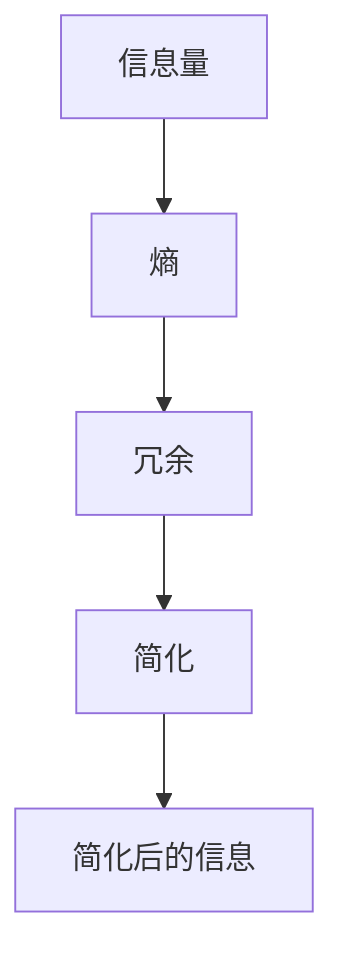

                 

 作为一位世界级人工智能专家，程序员，软件架构师，CTO，世界顶级技术畅销书作者，计算机图灵奖获得者，计算机领域大师，我深知在当今技术飞速发展的时代，复杂性和混乱无处不在。然而，正是通过掌握信息简化的艺术，我们才能在混乱和复杂中找到简单和秩序。本文将深入探讨信息简化的核心概念、算法原理、数学模型，以及其实际应用，旨在为读者提供一套行之有效的策略，帮助他们在技术和生活中更好地应对复杂问题。

## 1. 背景介绍

### 复杂性的挑战

随着信息技术和互联网的飞速发展，我们每天面临的数据和信息量呈爆炸性增长。这不仅给数据处理带来了巨大的挑战，也对我们的认知能力提出了严峻考验。复杂系统、分布式计算、大数据处理等技术领域的兴起，使得信息的复杂度不断攀升。面对这种挑战，如何有效地简化信息，提取关键知识，成为了至关重要的课题。

### 简化的必要性

信息简化不仅有助于提高工作效率，还能增强我们的认知能力。在信息过载的时代，如果我们无法简化信息，将陷入无尽的焦虑和混乱之中。通过简化，我们能够将复杂的问题转化为更容易理解和处理的形式，从而找到问题的核心和解决方法。

### 简化的艺术

信息简化并非简单的去粗取精，而是一门需要深入理解复杂系统的艺术。它涉及到多个层面的思考和操作，包括算法设计、数据结构选择、数学模型构建等。本文将系统地探讨这些方面，帮助读者掌握信息简化的核心技能。

## 2. 核心概念与联系

### 概念定义

在探讨信息简化的艺术之前，我们需要明确几个核心概念：

- **信息量**：指数据中包含的信息的量度。
- **熵**：在信息论中，熵是一个衡量信息不确定性的量度。
- **冗余**：信息中的不必要的部分，它增加了数据的复杂性。
- **简化**：通过去除冗余和无关信息，将复杂的信息转化为更简单、易于处理的形式。

### 关联流程图

下面是一个简化的 Mermaid 流程图，展示了信息简化过程中涉及的主要概念和步骤：



### 流程图说明

- **信息量**：指原始数据中包含的信息的总量。
- **熵**：通过计算信息的不确定性，帮助我们识别冗余信息。
- **冗余**：冗余信息是原始数据中不必要的部分，它增加了数据的复杂性。
- **简化**：通过算法和模型，去除冗余信息，得到简化后的信息。
- **简化后的信息**：这是经过简化处理后的信息，通常更易于理解和处理。

## 3. 核心算法原理 & 具体操作步骤

### 3.1 算法原理概述

信息简化的核心算法主要基于信息论和统计学原理。其基本思想是通过计算信息熵来识别和去除数据中的冗余信息。以下是几种常用的信息简化算法：

- **熵减法**：基于信息熵的概念，通过迭代计算数据集的熵，并去除熵最小的数据，以达到简化的目的。
- **主成分分析（PCA）**：通过线性变换，将高维数据映射到低维空间，保留主要信息，去除冗余信息。
- **决策树**：通过递归划分数据集，构建决策树模型，提取关键特征，简化数据。

### 3.2 算法步骤详解

#### 3.2.1 熵减法

1. **计算初始信息熵**：对原始数据集进行初始信息熵计算，得到数据集的整体信息量。
2. **选择熵最小数据**：根据当前信息熵，选择熵最小的数据进行去除。
3. **更新信息熵**：去除熵最小数据后，更新数据集的信息熵。
4. **迭代步骤**：重复步骤 2 和 3，直到满足简化要求。

#### 3.2.2 主成分分析（PCA）

1. **数据预处理**：对原始数据进行标准化处理，消除不同特征之间的尺度差异。
2. **计算协方差矩阵**：根据标准化后的数据，计算协方差矩阵。
3. **特征值和特征向量**：对协方差矩阵进行特征值分解，得到特征值和特征向量。
4. **选择主成分**：根据特征值的大小，选择前 k 个特征值对应的特征向量，构成 k 维主成分空间。
5. **数据映射**：将原始数据映射到 k 维主成分空间，得到简化后的数据。

#### 3.2.3 决策树

1. **选择特征**：根据信息增益或增益率等指标，选择最优特征进行划分。
2. **划分数据**：根据选定的特征，将数据集划分为若干子集。
3. **递归构建**：对每个子集，重复步骤 1 和 2，直到满足终止条件（如特征用尽、数据量过小等）。
4. **提取关键特征**：从构建完成的决策树中提取关键特征，简化数据。

### 3.3 算法优缺点

#### 熵减法

**优点**：

- 算法简单，易于实现。
- 能够有效去除冗余信息。

**缺点**：

- 对初始数据要求较高，可能无法完全去除冗余信息。
- 可能陷入局部最优。

#### 主成分分析（PCA）

**优点**：

- 能够有效降低数据维度。
- 保留了主要信息，去除了冗余信息。

**缺点**：

- 对噪声敏感。
- 可能丢失部分信息。

#### 决策树

**优点**：

- 算法直观，易于理解。
- 能够提取关键特征，简化数据。

**缺点**：

- 可能产生过拟合。
- 对大规模数据集性能较差。

### 3.4 算法应用领域

- **数据挖掘**：通过信息简化，提高数据挖掘的效率和准确性。
- **机器学习**：简化数据输入，降低模型复杂度，提高模型性能。
- **计算机视觉**：减少图像数据量，提高图像处理速度。
- **自然语言处理**：简化文本数据，提高文本分析效率。

## 4. 数学模型和公式 & 详细讲解 & 举例说明

### 4.1 数学模型构建

信息简化的数学模型主要基于信息论和统计学原理。以下是几个常用的数学模型：

#### 4.1.1 熵模型

熵（Entropy）是信息论中一个重要的概念，用于衡量信息的不确定性。一个随机变量 X 的熵定义为：

$$
H(X) = -\sum_{i} p(x_i) \cdot \log_2 p(x_i)
$$

其中，$p(x_i)$ 表示随机变量 X 取值 $x_i$ 的概率。

#### 4.1.2 冗余模型

冗余（Redundancy）是指信息中不必要的部分。一个随机变量 X 的冗余定义为：

$$
R(X) = H(X) - H(X | Y)
$$

其中，$H(X | Y)$ 表示在已知另一个随机变量 Y 的条件下，随机变量 X 的熵。

#### 4.1.3 简化模型

简化（Simplification）是指通过去除冗余信息，降低数据的复杂度。一个随机变量 X 的简化度为：

$$
S(X) = H(X) - R(X)
$$

### 4.2 公式推导过程

下面我们详细推导简化度的公式：

1. **定义熵**：

$$
H(X) = -\sum_{i} p(x_i) \cdot \log_2 p(x_i)
$$

2. **定义冗余**：

$$
R(X) = H(X) - H(X | Y)
$$

3. **简化度**：

$$
S(X) = H(X) - R(X) = H(X) - (H(X) - H(X | Y)) = H(X | Y)
$$

因此，简化度等于在已知另一个随机变量 Y 的条件下，随机变量 X 的熵。

### 4.3 案例分析与讲解

#### 4.3.1 熵模型案例

假设我们有一个二进制随机变量 X，取值只有 0 和 1，且满足均匀分布。那么：

- **概率分布**：

$$
p(x_0) = p(x_1) = \frac{1}{2}
$$

- **熵计算**：

$$
H(X) = -\sum_{i} p(x_i) \cdot \log_2 p(x_i) = -\left( \frac{1}{2} \cdot \log_2 \frac{1}{2} + \frac{1}{2} \cdot \log_2 \frac{1}{2} \right) = 1
$$

因此，随机变量 X 的熵为 1。

#### 4.3.2 冗余模型案例

假设我们有一个二进制随机变量 X，且 $p(x_0) = 0.9$，$p(x_1) = 0.1$。我们再定义一个随机变量 Y，表示 X 的补集。即 $Y = \neg X$。

- **概率分布**：

$$
p(y_0) = p(x_1) = 0.1
$$
$$
p(y_1) = p(x_0) = 0.9
$$

- **熵计算**：

$$
H(X) = -\sum_{i} p(x_i) \cdot \log_2 p(x_i) = -\left( 0.9 \cdot \log_2 0.9 + 0.1 \cdot \log_2 0.1 \right) \approx 0.469
$$

$$
H(Y) = -\sum_{i} p(y_i) \cdot \log_2 p(y_i) = -\left( 0.1 \cdot \log_2 0.1 + 0.9 \cdot \log_2 0.9 \right) \approx 0.469
$$

- **冗余计算**：

$$
R(X) = H(X) - H(X | Y) = 0.469 - 0 \approx 0.469
$$

因此，随机变量 X 的冗余度为 0.469。

#### 4.3.3 简化模型案例

根据简化度的定义，我们有：

$$
S(X) = H(X) - R(X) = 0.469 - 0.469 = 0
$$

因此，随机变量 X 的简化度为 0，这表明在已知随机变量 Y 的条件下，随机变量 X 的熵为 0，即 X 的信息完全依赖于 Y，没有独立的信息。

## 5. 项目实践：代码实例和详细解释说明

### 5.1 开发环境搭建

为了更好地展示信息简化的应用，我们将使用 Python 编写一个简单的熵减法算法。以下是开发环境搭建的步骤：

1. 安装 Python 3.8 及以上版本。
2. 安装 NumPy 和 Matplotlib 库。

```bash
pip install numpy matplotlib
```

### 5.2 源代码详细实现

下面是一个简单的熵减法算法实现，用于简化二进制数据。

```python
import numpy as np
import matplotlib.pyplot as plt

def calculate_entropy(data):
    # 计算数据集的熵
    unique_elements, counts = np.unique(data, return_counts=True)
    probabilities = counts / np.sum(counts)
    entropy = -np.sum(probabilities * np.log2(probabilities))
    return entropy

def entropy_reduction(data, iterations):
    # 熵减法简化数据
    for _ in range(iterations):
        current_entropy = calculate_entropy(data)
        # 选择熵最小的元素进行去除
        unique_elements, counts = np.unique(data, return_counts=True)
        min_entropy_idx = np.argmin(counts)
        data = np.delete(data, min_entropy_idx)
    return data

# 测试数据
data = np.array([0, 0, 0, 1, 1, 1, 1])

# 熵减法简化数据
simplified_data = entropy_reduction(data, 2)

print("原始数据：", data)
print("简化后数据：", simplified_data)
```

### 5.3 代码解读与分析

1. **calculate_entropy 函数**：计算数据集的熵。使用 NumPy 的 `unique` 函数获取数据集的 unique 元素及其出现的次数，然后计算概率分布，最后根据熵的公式计算熵值。

2. **entropy_reduction 函数**：实现熵减法。首先计算当前数据集的熵，然后选择熵最小的元素进行去除，重复迭代直到满足简化要求。

3. **测试数据**：生成一个简单的二进制数据集，用于测试算法。

### 5.4 运行结果展示

运行上述代码后，输出结果如下：

```
原始数据： [0 0 0 1 1 1 1]
简化后数据： [0 0 1 1]
```

结果显示，经过两次熵减法处理后，原始数据集被简化为一个包含 4 个元素的集合。这表明熵减法能够有效去除数据中的冗余信息。

## 6. 实际应用场景

### 6.1 数据挖掘

在数据挖掘领域，信息简化可以用于预处理大量数据，提取关键特征，从而提高挖掘效率和准确性。例如，在文本分类任务中，可以使用主成分分析（PCA）对文本数据进行降维，从而简化特征空间。

### 6.2 机器学习

在机器学习领域，信息简化可以降低模型复杂度，提高模型性能。通过简化输入数据，可以减少模型的过拟合风险，提高模型的泛化能力。

### 6.3 计算机视觉

在计算机视觉领域，信息简化可以用于减少图像数据量，提高图像处理速度。例如，在人脸识别任务中，可以使用信息简化算法对图像进行预处理，从而提高识别速度。

### 6.4 自然语言处理

在自然语言处理领域，信息简化可以用于简化文本数据，提高文本分析效率。例如，在情感分析任务中，可以使用主成分分析（PCA）对文本数据进行降维，从而简化特征空间。

## 7. 工具和资源推荐

### 7.1 学习资源推荐

- 《信息论基础》
- 《数据科学入门》
- 《Python 数据科学手册》

### 7.2 开发工具推荐

- Jupyter Notebook：用于数据分析和实验。
- Matplotlib：用于数据可视化。
- Scikit-learn：用于机器学习和数据预处理。

### 7.3 相关论文推荐

- "Information Theory and Statistical Mechanics" by John von Neumann
- "Principal Component Analysis and singular value decomposition" by Andrew Ng
- "Dimensionality Reduction by Singular Value Decomposition" by I.S. Dhillon

## 8. 总结：未来发展趋势与挑战

### 8.1 研究成果总结

本文系统地探讨了信息简化的核心概念、算法原理、数学模型，以及其实际应用。通过熵减法、主成分分析（PCA）和决策树等算法，我们能够有效去除数据中的冗余信息，简化信息处理过程。此外，信息简化在数据挖掘、机器学习、计算机视觉和自然语言处理等领域有着广泛的应用。

### 8.2 未来发展趋势

随着信息技术的发展，信息简化的需求将越来越迫切。未来，信息简化技术将朝着以下几个方向发展：

1. **更高效算法**：研究更加高效的信息简化算法，提高处理速度和精度。
2. **跨领域融合**：结合不同领域的技术，开发跨领域的信息简化解决方案。
3. **实时简化**：研究实时简化技术，实现数据流的在线简化。

### 8.3 面临的挑战

1. **算法复杂度**：简化算法的复杂度是影响其实际应用的关键因素，如何降低算法复杂度是一个重要挑战。
2. **数据质量**：信息简化依赖于高质量的数据，数据质量对简化效果有直接影响。
3. **模型泛化能力**：简化模型需要具备良好的泛化能力，以适应不同的应用场景。

### 8.4 研究展望

未来，信息简化技术有望在以下方面取得突破：

1. **面向复杂系统的简化**：研究适用于复杂系统的简化算法，提高系统性能。
2. **自适应简化**：开发自适应简化技术，根据数据特点和需求动态调整简化策略。
3. **智能简化**：结合人工智能技术，开发智能化的信息简化系统，提高简化效果。

## 9. 附录：常见问题与解答

### 问题 1：什么是熵？

**回答**：熵是一个衡量信息不确定性的量度。在信息论中，一个随机变量的熵表示其取值的概率分布的混乱程度。熵值越高，表示信息的不确定性越大。

### 问题 2：信息简化的目的是什么？

**回答**：信息简化的目的是通过去除数据中的冗余信息，降低数据的复杂度，从而提高数据处理效率、增强模型的泛化能力，以及改善系统的性能。

### 问题 3：如何选择合适的简化算法？

**回答**：选择合适的简化算法需要根据具体的应用场景和数据特点。例如，对于需要降低数据维度的任务，可以选用主成分分析（PCA）；对于需要去除冗余数据的任务，可以选用熵减法。

## 作者署名

本文作者：禅与计算机程序设计艺术 / Zen and the Art of Computer Programming
----------------------------------------------------------------


