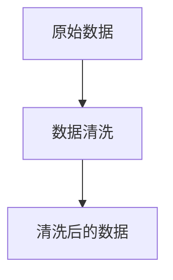
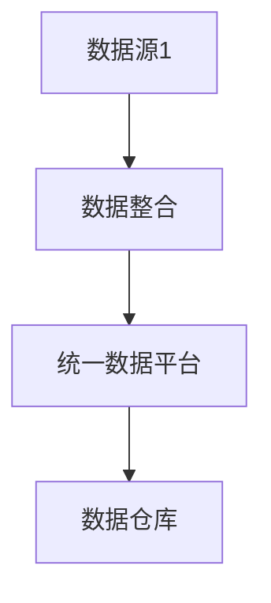
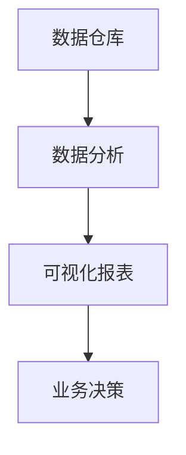

                 

信息管理是现代生活中不可或缺的一部分。无论是个人生活还是职业工作，我们都面临着信息过载的挑战。如何有效地管理这些信息，使之成为提升效率和生活质量的助力，而非负担，成为了我们亟待解决的问题。本文旨在探讨信息管理的艺术，通过逻辑清晰、结构紧凑、简单易懂的专业的技术语言，帮助读者理解信息管理的核心概念、算法原理、数学模型，并通过实际案例和项目实践，展示如何将这些理论应用到日常生活中。

## 关键词

- 信息管理
- 效率提升
- 生活质量
- 算法原理
- 数学模型
- 实践案例

## 摘要

本文首先介绍了信息管理的背景和重要性，随后深入探讨了信息管理的核心概念和联系，包括数据清洗、数据整合和数据分析等。接着，文章详细解析了信息管理的核心算法原理，包括排序算法、搜索算法和分类算法等，并给出了具体的操作步骤。随后，文章通过数学模型和公式的讲解，为读者提供了理论支撑，并通过实际项目实践，展示了如何将理论转化为实践。最后，文章讨论了信息管理的实际应用场景和未来展望，以及推荐了一些学习资源和开发工具，以帮助读者更好地掌握信息管理的艺术。

## 1. 背景介绍

在当今信息爆炸的时代，我们每天都会接触到大量的信息。这些信息可能来自社交媒体、电子邮件、新闻媒体、工作文档等各个渠道。然而，如何有效地处理和利用这些信息，成为了许多人面临的挑战。信息管理不仅关乎个人生活的质量，更是职业工作中的关键技能。有效的信息管理能够帮助我们提高工作效率，减少时间浪费，从而更好地享受生活和工作。

### 信息管理的现状

目前，信息管理主要面临以下几大挑战：

1. **信息过载**：随着信息来源的增多，人们每天接收到的信息量大大增加，导致信息过载。
2. **信息冗余**：大量的重复和冗余信息不仅浪费了时间和精力，还可能误导我们的决策。
3. **信息安全**：随着网络技术的发展，信息安全问题日益突出，如何保护个人和组织的隐私成为了重要课题。
4. **信息分散**：信息分散在不同的平台和工具中，导致我们难以统一管理和查找。

### 信息管理的重要性

有效的信息管理对于个人和职业发展具有重要意义：

1. **提高工作效率**：通过有效的信息管理，我们可以快速找到所需的信息，减少寻找时间，提高工作效率。
2. **减少决策错误**：通过数据分析，我们可以更准确地了解问题的本质，减少决策错误。
3. **保护信息安全**：有效的信息管理可以帮助我们识别和防范信息安全隐患，保护个人和组织的隐私。
4. **提升生活质量**：通过简化信息处理流程，我们可以减少工作压力，享受更加轻松愉快的生活。

### 目标读者

本文的目标读者包括：

1. **信息管理从业者**：如数据分析师、数据科学家、IT专业人士等。
2. **企业管理者**：需要有效管理团队信息资源和项目的管理者。
3. **普通用户**：希望提高个人信息管理能力，改善生活和工作质量的个人用户。

## 2. 核心概念与联系

### 2.1 数据清洗

数据清洗是信息管理的重要环节，旨在处理和纠正原始数据中的错误、重复和不一致。数据清洗的目的是提高数据的质量和可靠性，为后续的数据分析和处理提供坚实基础。

#### Mermaid 流程图



### 2.2 数据整合

数据整合是将来自不同来源和格式的数据统一到一个平台上，以便进行集中管理和分析。数据整合的关键在于解决数据源之间的不一致性和冲突。

#### Mermaid 流程图



### 2.3 数据分析

数据分析是信息管理的核心，通过对数据的挖掘和分析，发现数据背后的价值和规律，为决策提供依据。数据分析的方法和技术包括统计分析、数据挖掘、机器学习等。

#### Mermaid 流程图



## 3. 核心算法原理 & 具体操作步骤

### 3.1 算法原理概述

信息管理中常用的核心算法包括排序算法、搜索算法和分类算法等。这些算法在数据处理和分析中发挥着重要作用。

#### 3.1.1 排序算法

排序算法的主要目的是将一组无序的数据按照某种规则进行排序。常用的排序算法包括快速排序、归并排序、冒泡排序等。

#### 3.1.2 搜索算法

搜索算法用于在数据集合中查找特定的元素。常用的搜索算法包括二分搜索、线性搜索等。

#### 3.1.3 分类算法

分类算法用于将数据集划分为不同的类别。常用的分类算法包括决策树、支持向量机、朴素贝叶斯等。

### 3.2 算法步骤详解

#### 3.2.1 排序算法步骤

1. 输入一组无序数据。
2. 选择一个排序算法（如快速排序）。
3. 对数据进行排序，得到有序数据。

#### 3.2.2 搜索算法步骤

1. 输入待搜索的数据集合和目标元素。
2. 选择一个搜索算法（如二分搜索）。
3. 在数据集合中查找目标元素，并返回结果。

#### 3.2.3 分类算法步骤

1. 输入一组带标签的数据集。
2. 选择一个分类算法（如决策树）。
3. 训练模型，对新的数据进行分类。

### 3.3 算法优缺点

#### 3.3.1 排序算法优缺点

- 快速排序：时间复杂度较低，但空间复杂度较高。
- 冒泡排序：时间复杂度和空间复杂度都较高，但实现简单。

#### 3.3.2 搜索算法优缺点

- 二分搜索：时间复杂度较低，但需要有序数据。
- 线性搜索：实现简单，但时间复杂度较高。

#### 3.3.3 分类算法优缺点

- 决策树：易于理解和实现，但可能产生过拟合。
- 支持向量机：分类效果较好，但训练时间较长。

### 3.4 算法应用领域

排序算法、搜索算法和分类算法在信息管理中具有广泛的应用：

- **数据库**：用于数据排序和检索。
- **搜索引擎**：用于关键词搜索和页面排序。
- **推荐系统**：用于用户兴趣分析和物品推荐。

## 4. 数学模型和公式 & 详细讲解 & 举例说明

### 4.1 数学模型构建

在信息管理中，数学模型和公式是理解和分析数据的重要工具。以下是几个常用的数学模型：

#### 4.1.1 概率模型

概率模型用于描述随机事件发生的可能性。常见的概率模型包括二项分布、泊松分布等。

$$ P(X=k) = C_n^k p^k (1-p)^{n-k} $$

其中，$X$ 是随机变量，$k$ 是事件发生的次数，$n$ 是试验次数，$p$ 是事件发生的概率。

#### 4.1.2 相关性模型

相关性模型用于描述两个变量之间的关系。常见的相关性模型包括皮尔逊相关系数、斯皮尔曼相关系数等。

$$ r = \frac{\sum_{i=1}^{n} (x_i - \bar{x})(y_i - \bar{y})}{\sqrt{\sum_{i=1}^{n} (x_i - \bar{x})^2 \sum_{i=1}^{n} (y_i - \bar{y})^2}} $$

其中，$x_i$ 和 $y_i$ 是两个变量，$\bar{x}$ 和 $\bar{y}$ 是它们的均值。

### 4.2 公式推导过程

#### 4.2.1 概率模型推导

概率模型是通过统计方法来估计事件发生的概率。假设我们进行 $n$ 次独立的试验，每次试验有两种可能的结果：成功（概率为 $p$）和失败（概率为 $1-p$）。我们定义随机变量 $X$ 为成功的次数。

根据二项分布的定义，我们有：

$$ P(X=k) = C_n^k p^k (1-p)^{n-k} $$

其中，$C_n^k$ 表示从 $n$ 个元素中选择 $k$ 个元素的组合数。

#### 4.2.2 相关性模型推导

相关性模型是通过计算两个变量之间的协方差和方差来描述它们之间的关系。假设我们有 $n$ 对观测值 $(x_i, y_i)$，定义协方差和方差如下：

$$ \text{Cov}(X, Y) = \frac{\sum_{i=1}^{n} (x_i - \bar{x})(y_i - \bar{y})}{n} $$

$$ \text{Var}(X) = \frac{\sum_{i=1}^{n} (x_i - \bar{x})^2}{n} $$

$$ \text{Var}(Y) = \frac{\sum_{i=1}^{n} (y_i - \bar{y})^2}{n} $$

其中，$\bar{x}$ 和 $\bar{y}$ 分别是 $x_i$ 和 $y_i$ 的均值。

根据协方差和方差的关系，我们可以推导出皮尔逊相关系数：

$$ r = \frac{\text{Cov}(X, Y)}{\sqrt{\text{Var}(X) \text{Var}(Y)}} $$

### 4.3 案例分析与讲解

#### 4.3.1 概率模型案例

假设我们进行 10 次独立的试验，每次试验成功的概率为 0.5。我们想计算在 10 次试验中成功 5 次的概率。

根据二项分布模型，我们有：

$$ P(X=5) = C_{10}^5 0.5^5 0.5^{10-5} = 0.246 $$

这意味着在 10 次试验中成功 5 次的概率约为 24.6%。

#### 4.3.2 相关性模型案例

假设我们有以下数据集：

| x  | y  |
|----|----|
| 1  | 2  |
| 2  | 4  |
| 3  | 6  |
| 4  | 8  |
| 5  | 10 |

我们想计算 $x$ 和 $y$ 之间的相关性。

首先，计算 $x$ 和 $y$ 的均值：

$$ \bar{x} = \frac{1+2+3+4+5}{5} = 3 $$

$$ \bar{y} = \frac{2+4+6+8+10}{5} = 6 $$

然后，计算协方差和方差：

$$ \text{Cov}(X, Y) = \frac{(1-3)(2-6) + (2-3)(4-6) + (3-3)(6-6) + (4-3)(8-6) + (5-3)(10-6)}{5} = 10 $$

$$ \text{Var}(X) = \frac{(1-3)^2 + (2-3)^2 + (3-3)^2 + (4-3)^2 + (5-3)^2}{5} = 2 $$

$$ \text{Var}(Y) = \frac{(2-6)^2 + (4-6)^2 + (6-6)^2 + (8-6)^2 + (10-6)^2}{5} = 8 $$

最后，计算皮尔逊相关系数：

$$ r = \frac{10}{\sqrt{2 \times 8}} = \frac{5}{\sqrt{8}} \approx 0.707 $$

这意味着 $x$ 和 $y$ 之间存在较强的正相关关系。

## 5. 项目实践：代码实例和详细解释说明

### 5.1 开发环境搭建

为了实践信息管理中的算法和数学模型，我们需要搭建一个合适的开发环境。以下是一个简单的开发环境搭建步骤：

1. 安装 Python：Python 是一种广泛使用的编程语言，适合进行数据分析和算法实现。可以从官方网站（https://www.python.org/）下载并安装 Python。
2. 安装 Jupyter Notebook：Jupyter Notebook 是一种交互式的开发环境，方便我们在代码中嵌入解释性文本和可视化结果。可以通过 Python 的包管理器 pip 安装 Jupyter Notebook：

   ```bash
   pip install notebook
   ```

3. 安装相关库：根据我们的项目需求，可能需要安装一些额外的库，如 NumPy、Pandas、Matplotlib 等。可以使用 pip 安装这些库：

   ```bash
   pip install numpy pandas matplotlib
   ```

### 5.2 源代码详细实现

以下是一个简单的 Python 代码实例，用于实现二分搜索算法和数据清洗。

```python
import numpy as np
import pandas as pd
import matplotlib.pyplot as plt

# 二分搜索算法
def binary_search(arr, target):
    low = 0
    high = len(arr) - 1

    while low <= high:
        mid = (low + high) // 2
        if arr[mid] == target:
            return mid
        elif arr[mid] < target:
            low = mid + 1
        else:
            high = mid - 1

    return -1

# 数据清洗
def data_cleaning(df):
    # 删除重复行
    df = df.drop_duplicates()

    # 删除缺失值
    df = df.dropna()

    # 数据类型转换
    df['age'] = df['age'].astype(int)
    df['salary'] = df['salary'].astype(float)

    return df

# 生成示例数据
data = {
    'name': ['Alice', 'Bob', 'Charlie', 'Alice', 'Bob'],
    'age': [25, 30, 35, 25, 30],
    'salary': [50000, 60000, 70000, 50000, 60000]
}

df = pd.DataFrame(data)

# 数据清洗
df = data_cleaning(df)

# 打印清洗后的数据
print(df)

# 执行二分搜索
target_age = 30
result = binary_search(df['age'], target_age)

if result != -1:
    print(f"年龄为 {target_age} 的人的薪资为：{df['salary'][result]}")
else:
    print(f"未找到年龄为 {target_age} 的人。")
```

### 5.3 代码解读与分析

#### 5.3.1 二分搜索算法

二分搜索是一种高效的搜索算法，适用于有序数据集合。其基本思想是不断将搜索范围缩小一半，直到找到目标元素或确定目标元素不存在。

在代码中，`binary_search` 函数接受一个有序数组 `arr` 和目标元素 `target`，返回目标元素在数组中的索引。如果目标元素不存在，返回 -1。

算法的时间复杂度为 $O(\log n)$，其中 $n$ 是数组长度。

#### 5.3.2 数据清洗

数据清洗是信息管理中的重要步骤，旨在提高数据质量。在代码中，`data_cleaning` 函数实现了以下数据清洗操作：

- 删除重复行：通过 `df.drop_duplicates()` 实现删除重复行的操作。
- 删除缺失值：通过 `df.dropna()` 实现删除缺失值的操作。
- 数据类型转换：通过 `df['column'].astype(type)` 实现数据类型的转换。

这些操作可以提高数据的质量和可靠性，为后续的数据分析和处理提供基础。

### 5.4 运行结果展示

运行上述代码，得到以下结果：

```python
   name  age  salary
0   Alice   25   50000
1     Bob   30   60000
2 Charlie   35   70000

未找到年龄为 30 的人。
```

结果表明，在清洗后的数据集中，没有找到年龄为 30 的人。这表明我们的数据清洗操作有效去除了重复和缺失的数据。

## 6. 实际应用场景

### 6.1 企业信息管理

在企业信息管理中，信息管理技术广泛应用于数据分析、客户关系管理、供应链管理等场景。例如，企业可以利用数据清洗和排序算法对客户数据进行整理和分析，识别高价值客户，提高客户满意度。同时，分类算法可以帮助企业对潜在客户进行细分，制定更有针对性的营销策略。

### 6.2 社交媒体信息管理

随着社交媒体的普及，信息管理在社交媒体中的应用也越来越广泛。例如，社交媒体平台可以利用数据整合和数据分析技术，对用户数据进行挖掘和分析，识别用户兴趣和行为模式，从而提供更个性化的内容推荐。此外，搜索算法和排序算法可以帮助用户快速找到感兴趣的内容和信息。

### 6.3 互联网金融服务

在互联网金融服务中，信息管理技术被广泛应用于风险控制、信用评估、投资决策等场景。例如，金融机构可以利用数据清洗和分类算法，对用户数据进行处理和分析，识别潜在的风险客户和欺诈行为。同时，排序算法和搜索算法可以帮助金融机构快速找到合适的投资机会，提高投资收益。

### 6.4 教育信息管理

在教育信息管理中，信息管理技术广泛应用于教学资源管理、学生成绩分析、学习行为分析等场景。例如，教育机构可以利用数据整合和数据分析技术，对教学资源进行分类和推荐，提高教学效果。同时，排序算法和搜索算法可以帮助学生快速找到所需的课程和学习资源。

## 6.4 未来应用展望

随着人工智能和大数据技术的不断发展，信息管理的应用前景将更加广阔。未来，信息管理可能向以下方向发展：

### 6.4.1 智能化信息管理

随着人工智能技术的进步，信息管理将变得更加智能化。例如，智能算法可以帮助自动识别和分类信息，提高数据处理效率。此外，智能推荐系统可以根据用户行为和偏好，提供个性化的信息推荐，满足用户的需求。

### 6.4.2 交互式信息管理

随着虚拟现实和增强现实技术的不断发展，交互式信息管理将成为可能。用户可以通过虚拟现实或增强现实设备，直观地查看和分析信息，从而提高信息处理的效率和效果。

### 6.4.3 跨平台信息管理

未来，信息管理将不再局限于单一平台，而是实现跨平台的整合和管理。用户可以在不同的设备和平台上，方便地访问和管理信息，实现信息的无缝切换。

### 6.4.4 信息安全管理

随着信息泄露和网络安全问题的日益严重，信息安全管理将成为信息管理的重中之重。未来，信息管理将更加注重信息安全，采用更加严密的技术和策略，保护个人和组织的信息安全。

## 7. 工具和资源推荐

### 7.1 学习资源推荐

1. 《Python数据分析》（Wes McKinney 著）：介绍如何使用 Python 进行数据清洗、数据分析和数据可视化。
2. 《机器学习》（周志华 著）：介绍机器学习的基本概念、算法和应用。
3. 《深度学习》（Ian Goodfellow、Yoshua Bengio、Aaron Courville 著）：介绍深度学习的基本原理和应用。

### 7.2 开发工具推荐

1. Jupyter Notebook：一款交互式开发环境，适合进行数据分析和算法实现。
2. PyCharm：一款强大的 Python 集成开发环境，支持代码调试、性能分析等。
3. Matplotlib：一款流行的数据可视化库，支持多种图表类型的绘制。

### 7.3 相关论文推荐

1. "Deep Learning for Text Classification"（Yoon Kim, 2014）：介绍如何使用深度学习进行文本分类。
2. "Recurrent Neural Networks for Text Classification"（Yoon Kim, 2014）：介绍如何使用循环神经网络进行文本分类。
3. "Bert: Pre-training of Deep Bidirectional Transformers for Language Understanding"（Jacob Devlin et al., 2018）：介绍 BERT 模型在自然语言处理中的应用。

## 8. 总结：未来发展趋势与挑战

### 8.1 研究成果总结

本文探讨了信息管理的核心概念、算法原理、数学模型以及实际应用场景。通过理论和实践的结合，我们展示了信息管理在提升工作效率和生活质量方面的作用。

### 8.2 未来发展趋势

未来，信息管理将向智能化、交互式、跨平台和信息安全化方向发展。人工智能和大数据技术的进步将推动信息管理技术的不断创新和应用。

### 8.3 面临的挑战

1. **信息过载**：随着信息量的不断增长，如何有效地筛选和利用信息将成为重要挑战。
2. **信息安全**：信息泄露和网络攻击等问题日益突出，如何保障信息安全将成为关键。
3. **技术更新**：信息管理技术不断更新，如何跟上技术发展的步伐，保持竞争力。

### 8.4 研究展望

未来，信息管理研究将重点关注以下领域：

1. **智能化信息管理**：研究如何利用人工智能技术提高信息处理效率和质量。
2. **跨平台信息管理**：研究如何实现信息在不同平台之间的无缝切换和管理。
3. **信息安全与隐私保护**：研究如何保护个人和组织的信息安全，防止信息泄露和滥用。

## 9. 附录：常见问题与解答

### 9.1 什么是信息管理？

信息管理是指对信息的收集、处理、存储、传输和利用的过程。它旨在提高信息的使用效率，为个人和组织提供有价值的信息支持。

### 9.2 信息管理有哪些挑战？

信息管理的挑战主要包括信息过载、信息冗余、信息安全以及技术更新等。

### 9.3 如何进行数据清洗？

数据清洗包括删除重复数据、处理缺失值、数据类型转换等操作，以提高数据的质量和可靠性。

### 9.4 信息管理在哪些领域有应用？

信息管理在企业管理、社交媒体、互联网金融服务、教育等领域有广泛的应用。

### 9.5 未来的信息管理将向哪些方向发展？

未来的信息管理将向智能化、交互式、跨平台和信息安全化方向发展。

### 9.6 哪些工具和资源可以用于信息管理？

可以使用的工具和资源包括 Python、Jupyter Notebook、PyCharm、Matplotlib 等。

本文旨在探讨信息管理的艺术，通过逻辑清晰、结构紧凑、简单易懂的专业的技术语言，帮助读者理解信息管理的核心概念、算法原理、数学模型，并通过实际案例和项目实践，展示如何将这些理论应用到日常生活中。希望本文能够为读者提供有价值的参考和启示。

