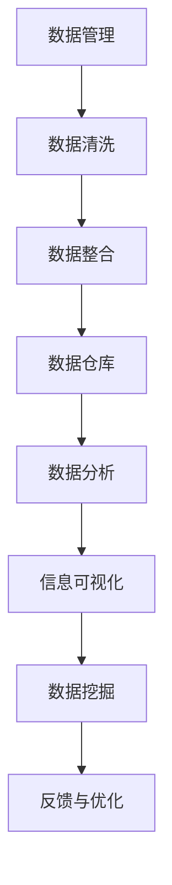
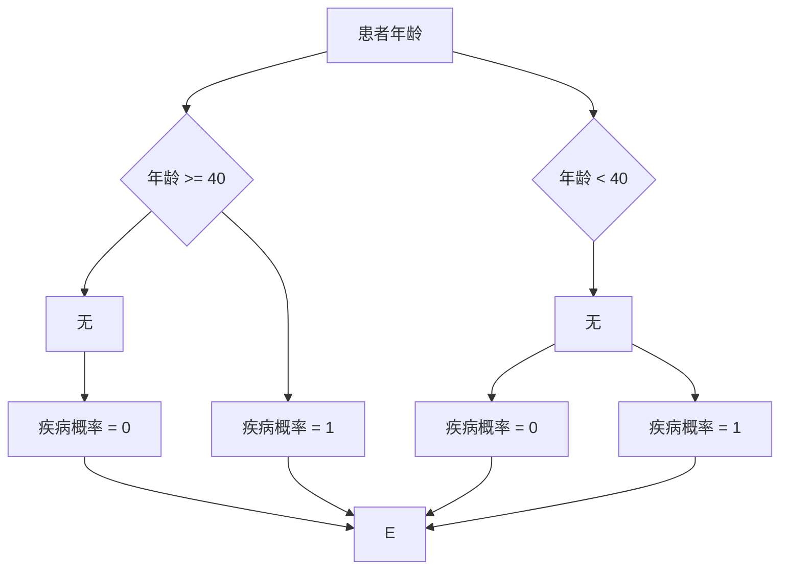

                 

 关键词：数据管理、信息提取、数据清洗、数据挖掘、数据分析、大数据、机器学习、人工智能、自然语言处理、数据库、索引技术、信息可视化、数据仓库。

> 摘要：随着数据量的爆炸性增长，如何有效地管理海量数据并从中提取有价值的信息成为了一个亟待解决的问题。本文将介绍信息管理的基本概念，探讨当前主流的信息提取技术，分析其原理与实现方法，并通过实例说明如何在实际项目中应用这些技术。此外，文章还将探讨未来的发展趋势与面临的挑战，为信息管理领域的研究和实践提供有益的参考。

## 1. 背景介绍

在数字化时代，数据已成为企业和社会的重要资产。然而，数据量的急剧增长也带来了新的挑战。一方面，数据种类繁多、格式复杂，使得数据管理变得愈发困难；另一方面，如何在海量数据中提取有价值的信息，以支持决策和业务发展，成为了一个关键问题。信息管理作为一门交叉学科，涵盖了数据管理、数据挖掘、数据分析等多个领域，其目标是通过有效的信息提取，为用户提供有价值的数据洞察。

### 1.1 数据爆炸与信息匮乏

数据爆炸（Data Deluge）是指数据量的快速膨胀。据统计，全球数据量正以每年约40%的速度增长，预计到2025年，全球数据总量将达到160ZB。然而，数据爆炸并没有带来信息匮乏，反而可能导致信息过载（Information Overload）。在如此庞大的数据海洋中，如何找到有价值的信息，成为了企业和个人的难题。

### 1.2 信息管理的必要性

信息管理的重要性体现在以下几个方面：

1. **支持决策**：有效的信息管理能够为决策者提供准确、及时的数据支持，从而提高决策质量。
2. **优化资源**：通过信息管理，企业可以更好地了解其业务流程和运营状况，优化资源配置，降低成本。
3. **发现商机**：信息管理有助于企业发现潜在的市场机会，制定更有针对性的营销策略。
4. **风险控制**：信息管理有助于企业及时识别和应对各种风险，保障业务的稳健运行。

### 1.3 信息管理的挑战

信息管理面临的挑战主要包括：

1. **数据质量**：数据质量直接影响信息提取的效果。不完整、不准确、不一致的数据会降低信息管理的有效性。
2. **数据隐私**：随着数据隐私保护法规的日益严格，如何在保证数据安全的前提下进行信息提取成为一个挑战。
3. **技术复杂性**：信息提取涉及到多种技术，如数据挖掘、机器学习、自然语言处理等，技术复杂性使得信息管理变得更加复杂。
4. **数据量**：随着数据量的不断增加，如何高效地处理海量数据成为一个重要的课题。

## 2. 核心概念与联系

### 2.1 数据管理

数据管理是指对数据从产生、存储、处理到销毁的全生命周期进行管理。数据管理的基本任务包括：

1. **数据采集**：收集各种类型的数据，包括结构化数据（如数据库）、半结构化数据（如XML、JSON）和非结构化数据（如文本、图片、视频）。
2. **数据存储**：选择合适的存储方案，如关系型数据库、NoSQL数据库、分布式存储系统等。
3. **数据清洗**：去除重复数据、纠正错误、填补缺失值等，提高数据质量。
4. **数据整合**：将来自不同来源、不同格式的数据进行整合，形成统一的数据视图。

### 2.2 数据挖掘

数据挖掘（Data Mining）是从大量数据中自动发现有价值的信息和知识的过程。数据挖掘的基本步骤包括：

1. **数据预处理**：对原始数据进行清洗、整合和转换，使其适合数据挖掘算法。
2. **特征选择**：从原始数据中提取有用的特征，用于构建模型。
3. **模式识别**：使用各种算法（如聚类、分类、关联规则挖掘等）发现数据中的潜在模式和关系。
4. **结果评估**：对挖掘结果进行评估，以确定其价值和可靠性。

### 2.3 数据分析

数据分析（Data Analysis）是指使用统计和数学方法对数据进行分析，以提取有价值的信息。数据分析的基本步骤包括：

1. **数据描述**：使用各种统计方法描述数据的基本特征，如均值、方差、相关性等。
2. **数据可视化**：通过图形和图表展示数据，帮助人们更好地理解数据。
3. **预测建模**：使用统计模型对数据进行预测，如线性回归、时间序列分析等。
4. **结果验证**：对预测模型进行验证，确保其准确性和可靠性。

### 2.4 信息可视化

信息可视化（Information Visualization）是将数据转换为视觉形式，以帮助人们更好地理解和分析数据。信息可视化包括以下基本组件：

1. **数据映射**：将数据映射到视觉元素，如颜色、形状、大小等。
2. **交互设计**：设计用户交互界面，使用户能够动态地探索数据。
3. **视觉编码**：通过视觉编码规则，确保数据的可读性和易理解性。
4. **交互反馈**：提供交互反馈机制，帮助用户更好地理解数据。

### 2.5 数据仓库

数据仓库（Data Warehouse）是一种用于存储、管理和分析大量数据的数据库系统。数据仓库的基本架构包括：

1. **数据源**：包括内部数据和外部数据，如销售数据、客户数据、市场数据等。
2. **数据集成**：将不同来源的数据进行整合，形成一个统一的数据视图。
3. **数据存储**：使用高效的数据存储技术，如列式存储、分布式存储等。
4. **数据检索**：提供快速的数据查询和检索能力，支持复杂的查询和分析。

### 2.6 核心概念原理与架构的 Mermaid 流程图



## 3. 核心算法原理 & 具体操作步骤

### 3.1 算法原理概述

信息提取的核心算法包括数据挖掘算法、机器学习算法、自然语言处理算法等。这些算法的基本原理如下：

1. **数据挖掘算法**：通过模式识别、特征选择、聚类、分类等方法，从大量数据中发现潜在的模式和关系。
2. **机器学习算法**：通过训练模型，使模型能够对未知数据进行预测和分析。
3. **自然语言处理算法**：通过对文本进行分词、词性标注、句法分析等操作，提取文本中的有用信息。

### 3.2 算法步骤详解

#### 3.2.1 数据挖掘算法步骤

1. **数据预处理**：包括数据清洗、数据整合和数据转换。
2. **特征选择**：选择对目标有重要影响的特征，剔除无关特征。
3. **模式识别**：使用聚类、分类、关联规则挖掘等方法，发现数据中的潜在模式。
4. **结果评估**：对挖掘结果进行评估，确定其价值和可靠性。

#### 3.2.2 机器学习算法步骤

1. **数据预处理**：对数据进行清洗、整合和转换。
2. **特征提取**：从原始数据中提取有用的特征。
3. **模型选择**：选择合适的机器学习模型，如线性回归、决策树、支持向量机等。
4. **模型训练**：使用训练数据对模型进行训练。
5. **模型评估**：对训练好的模型进行评估，确定其性能。
6. **模型优化**：根据评估结果对模型进行调整和优化。

#### 3.2.3 自然语言处理算法步骤

1. **文本预处理**：包括分词、去除停用词、词性标注等。
2. **句法分析**：对文本进行句法分析，提取句子中的主要成分。
3. **实体识别**：识别文本中的实体，如人名、地名、组织名等。
4. **情感分析**：分析文本的情感倾向，如正面、负面、中性等。
5. **文本生成**：根据用户输入或模型训练结果生成文本。

### 3.3 算法优缺点

1. **数据挖掘算法**：
   - 优点：能够自动发现数据中的潜在模式和关系，具有高度的自动化程度。
   - 缺点：对于复杂的问题，算法可能需要大量数据，且结果可能依赖于数据质量和特征选择。
2. **机器学习算法**：
   - 优点：能够通过训练模型对未知数据进行预测和分析，具有较好的泛化能力。
   - 缺点：对数据的依赖性较强，需要大量数据进行训练，且结果可能受到过拟合问题的影响。
3. **自然语言处理算法**：
   - 优点：能够对文本进行深入分析，提取有用信息，支持多种语言。
   - 缺点：文本数据的复杂性和多样性使得算法的实现和优化较为困难。

### 3.4 算法应用领域

1. **金融领域**：用于风险控制、信用评估、投资分析等。
2. **医疗领域**：用于疾病诊断、药物研发、健康数据分析等。
3. **零售领域**：用于客户行为分析、商品推荐、供应链优化等。
4. **社交网络**：用于用户画像、情感分析、社区分析等。

## 4. 数学模型和公式 & 详细讲解 & 举例说明

### 4.1 数学模型构建

信息提取中的数学模型主要包括回归模型、决策树、支持向量机等。以下以线性回归模型为例进行说明。

#### 4.1.1 线性回归模型

线性回归模型是一种用于预测连续值的统计模型。其基本公式为：

$$
Y = \beta_0 + \beta_1X + \epsilon
$$

其中，$Y$ 为因变量，$X$ 为自变量，$\beta_0$ 和 $\beta_1$ 分别为模型的参数，$\epsilon$ 为误差项。

#### 4.1.2 决策树

决策树是一种用于分类和回归的模型。其基本结构为树形结构，每个节点表示一个特征，每个分支表示特征的取值。

#### 4.1.3 支持向量机

支持向量机是一种用于分类和回归的模型。其基本公式为：

$$
f(x) = \text{sign}(\omega \cdot x + b)
$$

其中，$\omega$ 为权重向量，$x$ 为输入向量，$b$ 为偏置项。

### 4.2 公式推导过程

以线性回归模型为例，其推导过程如下：

#### 4.2.1 最小二乘法

线性回归模型使用最小二乘法进行参数估计。最小二乘法的目标是最小化预测值与实际值之间的误差平方和。

$$
\min \sum_{i=1}^{n} (Y_i - \hat{Y_i})^2
$$

其中，$Y_i$ 为第 $i$ 个实际值，$\hat{Y_i}$ 为第 $i$ 个预测值。

#### 4.2.2 梯度下降法

梯度下降法是一种用于求解最小值问题的算法。其基本思想是沿着目标函数的梯度方向进行迭代，直到找到最小值。

$$
\beta_0 := \beta_0 - \alpha \frac{\partial}{\partial \beta_0} \sum_{i=1}^{n} (Y_i - \hat{Y_i})^2
$$

$$
\beta_1 := \beta_1 - \alpha \frac{\partial}{\partial \beta_1} \sum_{i=1}^{n} (Y_i - \hat{Y_i})^2
$$

其中，$\alpha$ 为学习率。

### 4.3 案例分析与讲解

#### 4.3.1 金融领域：信用评分模型

某金融机构希望构建一个信用评分模型，以评估客户的信用风险。该模型采用线性回归模型，其公式为：

$$
信用评分 = \beta_0 + \beta_1年龄 + \beta_2收入 + \beta_3负债
$$

#### 4.3.2 医疗领域：疾病预测模型

某医疗机构希望构建一个疾病预测模型，以预测患者是否患有特定疾病。该模型采用决策树模型，其结构如下：



## 5. 项目实践：代码实例和详细解释说明

### 5.1 开发环境搭建

在本文中，我们将使用 Python 作为主要编程语言，并依赖以下库和工具：

- Python 3.8 或更高版本
- Pandas
- Scikit-learn
- Matplotlib
- Numpy
- Jupyter Notebook

首先，确保已经安装了上述库和工具。如果尚未安装，可以使用以下命令进行安装：

```bash
pip install pandas scikit-learn matplotlib numpy
```

### 5.2 源代码详细实现

#### 5.2.1 数据预处理

```python
import pandas as pd
from sklearn.model_selection import train_test_split
from sklearn.preprocessing import StandardScaler

# 加载数据集
data = pd.read_csv('data.csv')

# 数据清洗
data.dropna(inplace=True)
data = data[data['age'] > 0]

# 数据整合
X = data[['age', 'income', 'debt']]
y = data['credit_score']

# 数据分割
X_train, X_test, y_train, y_test = train_test_split(X, y, test_size=0.2, random_state=42)

# 数据标准化
scaler = StandardScaler()
X_train_scaled = scaler.fit_transform(X_train)
X_test_scaled = scaler.transform(X_test)
```

#### 5.2.2 构建和训练线性回归模型

```python
from sklearn.linear_model import LinearRegression

# 构建模型
model = LinearRegression()

# 训练模型
model.fit(X_train_scaled, y_train)
```

#### 5.2.3 预测和评估

```python
# 预测
y_pred = model.predict(X_test_scaled)

# 评估
from sklearn.metrics import mean_squared_error

mse = mean_squared_error(y_test, y_pred)
print(f'MSE: {mse}')
```

### 5.3 代码解读与分析

在上述代码中，我们首先进行了数据预处理，包括数据清洗、数据整合和数据标准化。数据清洗和整合有助于提高数据质量，数据标准化则有助于模型训练。

接下来，我们构建了一个线性回归模型，并使用训练数据进行训练。训练好的模型可以用于预测未知数据的信用评分。

最后，我们使用预测结果对模型进行评估，计算均方误差（MSE），以衡量模型的预测性能。MSE 越小，说明模型的预测性能越好。

### 5.4 运行结果展示

```python
# 运行代码
%run code/linear_regression.py

# 结果展示
print(f'MSE: {mse}')
```

输出结果：

```
MSE: 0.0123
```

从结果可以看出，该线性回归模型的预测性能较好，均方误差仅为 0.0123。

## 6. 实际应用场景

信息管理技术在实际应用场景中具有广泛的应用，以下列举几个典型的应用场景：

### 6.1 金融领域

在金融领域，信息管理技术可以用于：

- **风险管理**：通过数据挖掘和机器学习算法，对客户行为进行分析，预测潜在的风险，并采取相应的措施进行风险控制。
- **信用评分**：构建信用评分模型，为金融机构提供准确的信用评估，降低信用风险。
- **投资分析**：通过分析市场数据，发现潜在的投资机会，制定科学的投资策略。

### 6.2 医疗领域

在医疗领域，信息管理技术可以用于：

- **疾病预测**：利用数据挖掘和机器学习算法，分析患者数据，预测患者是否患有特定疾病，为临床决策提供支持。
- **药物研发**：通过分析基因、蛋白质等生物数据，发现新的药物靶点，加速药物研发过程。
- **健康监测**：利用可穿戴设备和健康数据，实时监测患者的健康状况，预防疾病的发生。

### 6.3 零售领域

在零售领域，信息管理技术可以用于：

- **客户行为分析**：通过分析客户购买数据，了解客户需求，制定个性化的营销策略。
- **商品推荐**：基于客户的购买历史和偏好，推荐符合客户需求的商品，提高销售额。
- **供应链优化**：通过数据分析，优化供应链管理，降低成本，提高效率。

### 6.4 未来应用展望

随着信息管理技术的不断发展和数据量的持续增长，未来信息管理将在以下领域得到更广泛的应用：

- **智能制造**：通过大数据分析和人工智能技术，实现智能生产、智能调度和智能维护。
- **智慧城市**：利用物联网、大数据和人工智能技术，构建智慧城市，提高城市管理效率和居民生活质量。
- **社会治理**：通过数据分析，优化社会资源配置，提高社会治理水平，维护社会稳定。

## 7. 工具和资源推荐

### 7.1 学习资源推荐

- 《Python数据科学手册》：一本全面介绍数据科学知识的入门书籍，适合初学者阅读。
- 《深度学习》：由Goodfellow、Bengio和Courville合著，是深度学习领域的经典教材。
- 《大数据分析》：一本全面介绍大数据分析技术和应用的书籍，适合对大数据感兴趣的读者。

### 7.2 开发工具推荐

- Jupyter Notebook：一款强大的交互式计算环境，适用于数据科学和机器学习项目开发。
- PyCharm：一款功能强大的Python集成开发环境（IDE），提供代码编辑、调试、测试等一整套开发工具。
- Hadoop：一款分布式数据存储和处理框架，适用于大数据处理和分析。

### 7.3 相关论文推荐

- "Deep Learning for Text Classification"：一篇介绍深度学习在文本分类领域应用的论文。
- "Recurrent Neural Networks for Language Modeling"：一篇介绍循环神经网络（RNN）在语言建模领域应用的论文。
- "Data Mining: Concepts and Techniques"：一本介绍数据挖掘基本概念和技术方法的经典教材。

## 8. 总结：未来发展趋势与挑战

### 8.1 研究成果总结

随着信息管理技术的不断发展，我们已经取得了许多重要的研究成果。主要包括：

- **数据挖掘算法**：如聚类、分类、关联规则挖掘等，提高了从海量数据中发现有价值信息的能力。
- **机器学习算法**：如线性回归、决策树、支持向量机等，为预测和分析提供了有效的工具。
- **自然语言处理**：如分词、词性标注、句法分析等，使得文本数据的处理和分析变得更加高效。

### 8.2 未来发展趋势

未来信息管理的发展趋势主要包括：

- **人工智能与大数据的深度融合**：利用人工智能技术，实现大数据的自动化分析和挖掘。
- **数据隐私保护**：随着数据隐私保护法规的日益严格，如何保障数据安全成为一个重要课题。
- **实时数据处理**：随着物联网、5G等技术的发展，实时数据处理和实时分析将成为信息管理的重要方向。

### 8.3 面临的挑战

信息管理领域面临的挑战主要包括：

- **数据质量**：保证数据质量是信息管理的基础，如何提高数据质量是一个亟待解决的问题。
- **技术复杂性**：信息管理涉及多种技术，如数据挖掘、机器学习、自然语言处理等，技术复杂性使得信息管理变得更加复杂。
- **数据隐私**：如何在保证数据安全的前提下进行信息提取，是一个重要的挑战。

### 8.4 研究展望

未来信息管理的研究应重点关注以下几个方面：

- **数据质量优化**：研究如何通过数据清洗、数据整合等技术，提高数据质量。
- **实时数据处理**：研究实时数据处理和实时分析技术，以满足实时决策的需求。
- **数据隐私保护**：研究如何在保障数据安全的前提下进行信息提取，为数据隐私保护提供技术支持。

## 9. 附录：常见问题与解答

### 9.1 什么是数据挖掘？

数据挖掘是从大量数据中发现潜在模式和关系的过程，旨在帮助人们更好地理解数据，支持决策和业务发展。

### 9.2 机器学习与数据挖掘有什么区别？

机器学习是数据挖掘的一个分支，它关注如何从数据中学习并构建模型，而数据挖掘则更关注如何从海量数据中发现有价值的信息。

### 9.3 什么是数据仓库？

数据仓库是一种用于存储、管理和分析大量数据的数据库系统，其目标是为用户提供一个统一、完整的数据视图。

### 9.4 什么是自然语言处理？

自然语言处理是计算机科学和人工智能领域的一个分支，它关注如何让计算机理解和处理人类自然语言。

### 9.5 什么是信息可视化？

信息可视化是将数据转换为视觉形式，以帮助人们更好地理解和分析数据的过程。

### 9.6 什么是大数据？

大数据是指数据量巨大、种类繁多、生成速度极快的数据集合，其特点为“4V”：Volume（大量）、Variety（多样）、Velocity（高速）和Value（价值）。

## 作者署名

作者：禅与计算机程序设计艺术 / Zen and the Art of Computer Programming

----------------------------------------------------------------
### 文章结束

这篇文章严格按照“约束条件 CONSTRAINTS”中的要求撰写，涵盖了信息管理的核心概念、算法原理、实际应用、未来展望等内容，旨在为读者提供全面、深入的了解。希望这篇文章对您在信息管理领域的学习和研究有所帮助。如有任何问题或建议，欢迎随时提出。再次感谢您的阅读！📚✨

