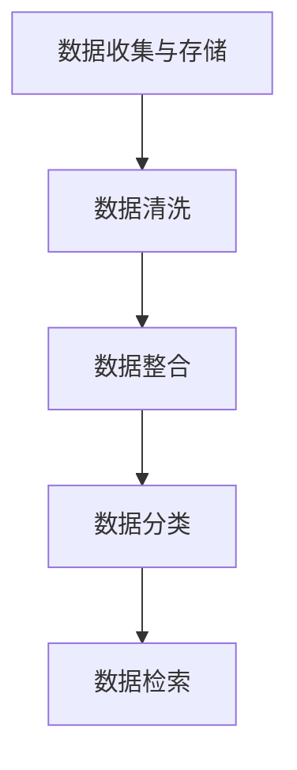

                 

在数字化时代，信息如同黄金般珍贵。然而，随着数据量的爆炸式增长，如何有效组织和分类这些数字资产，确保其在适当的时间、地点以最佳的方式被使用，已成为企业和个人面临的重大挑战。本文旨在探讨信息组织和分类的最佳实践，帮助读者掌握管理和利用数字资产的方法与技巧。

## 关键词

- 数字资产管理
- 信息分类
- 数据组织
- 最佳实践
- 数据治理

## 摘要

本文将围绕信息组织和分类的核心概念展开，通过介绍相关原理和架构，解析核心算法原理与数学模型，分享实际项目实践案例，并提供工具和资源推荐。最终，本文将总结研究成果，展望未来发展趋势与挑战。

## 1. 背景介绍

随着互联网和移动设备的普及，信息创造和传播的速度空前加速，企业和个人积累的数据量呈指数级增长。这些数据包括文本、图片、音频、视频等多种形式，不仅涉及企业运营，还涉及个人生活。然而，数据的价值往往取决于其如何被组织和分类。有效的信息组织和分类可以提升数据可访问性、减少冗余、提高工作效率，并有助于数据分析和决策制定。

### 1.1 数据爆炸的时代

全球数据量以每年50%的速度增长，预计到2025年，全球数据量将达到163ZB（ZettaByte，十亿亿字节）。这种数据爆炸式增长对传统的信息组织和分类方法提出了巨大挑战。

### 1.2 数字资产的重要性

数字资产是企业核心竞争力的重要组成部分。有效管理和利用数字资产，可以提升企业的创新能力和市场竞争力。对于个人来说，数字资产包括社交媒体账号、电子文档、电子邮件等，它们的价值同样不容忽视。

### 1.3 当前挑战与机遇

随着大数据、人工智能、云计算等技术的发展，信息组织和分类面临着前所未有的机遇和挑战。如何利用这些技术，实现高效的信息管理和分类，成为企业和个人必须面对的问题。

## 2. 核心概念与联系

### 2.1 信息组织和分类的定义

信息组织是指将信息按照一定的逻辑结构进行整理和存储，使其具有可访问性和可理解性。信息分类则是根据特定标准，将信息划分成不同的类别或层级，便于管理和检索。

### 2.2 信息分类的架构

信息分类的架构通常包括以下几个层次：

- **数据收集与存储**：将各种来源的数据收集并存储在数据库中。
- **数据清洗**：去除数据中的错误、重复和无用信息。
- **数据整合**：将不同来源的数据进行整合，形成统一的数据视图。
- **数据分类**：根据数据的特点和用途，对数据进行分类。
- **数据检索**：提供高效的数据检索功能，满足用户的需求。

### 2.3 Mermaid 流程图



## 3. 核心算法原理 & 具体操作步骤

### 3.1 算法原理概述

信息组织和分类的核心算法主要包括：

- **机器学习算法**：用于自动识别和分类数据。
- **索引算法**：用于提高数据检索效率。
- **数据挖掘算法**：用于发现数据中的模式和关联。

### 3.2 算法步骤详解

1. **数据预处理**：包括数据清洗、去重和格式转换等。
2. **特征提取**：从原始数据中提取有用的特征。
3. **分类器训练**：使用训练数据集，训练分类模型。
4. **模型评估**：使用测试数据集，评估分类模型的性能。
5. **数据分类**：使用训练好的模型，对新的数据进行分类。
6. **结果优化**：根据分类结果，不断优化模型。

### 3.3 算法优缺点

- **优点**：自动化程度高，可以提高数据处理效率。
- **缺点**：可能存在过拟合问题，对数据质量和特征提取要求较高。

### 3.4 算法应用领域

- **企业数据管理**：帮助企业有效管理大量业务数据。
- **搜索引擎**：提高搜索引擎的检索效率和准确性。
- **社交媒体分析**：用于分析用户行为和兴趣，提供个性化推荐。

## 4. 数学模型和公式 & 详细讲解 & 举例说明

### 4.1 数学模型构建

信息组织和分类的数学模型主要包括：

- **贝叶斯公式**：用于计算事件发生的概率。
- **支持向量机**：用于分类问题。
- **神经网络**：用于特征提取和模式识别。

### 4.2 公式推导过程

以贝叶斯公式为例，其推导过程如下：

$$
P(A|B) = \frac{P(B|A) \cdot P(A)}{P(B)}
$$

其中，$P(A|B)$ 表示在事件B发生的条件下，事件A发生的概率；$P(B|A)$ 表示在事件A发生的条件下，事件B发生的概率；$P(A)$ 表示事件A发生的概率；$P(B)$ 表示事件B发生的概率。

### 4.3 案例分析与讲解

以一个社交媒体数据分析为例，假设我们要分析用户的点赞行为，预测用户对某条内容的喜好程度。我们可以使用贝叶斯公式来计算用户对内容的喜好概率。

假设：

- $P(喜欢|点赞) = 0.8$：在用户点赞的情况下，喜欢该内容的概率为80%。
- $P(点赞|喜欢) = 0.9$：在用户喜欢该内容的情况下，点赞的概率为90%。
- $P(喜欢) = 0.6$：用户对内容的喜好概率为60%。

根据贝叶斯公式，我们可以计算用户对内容的喜好概率：

$$
P(喜欢|点赞) = \frac{P(点赞|喜欢) \cdot P(喜欢)}{P(点赞)}
$$

其中，$P(点赞)$ 可以通过全量数据统计得出。通过这个公式，我们可以预测用户对某条内容的喜好程度，为个性化推荐提供支持。

## 5. 项目实践：代码实例和详细解释说明

### 5.1 开发环境搭建

- **语言**：Python
- **库**：NumPy、Pandas、Scikit-learn、Matplotlib

```python
# 安装相关库
!pip install numpy pandas scikit-learn matplotlib
```

### 5.2 源代码详细实现

以下是一个简单的信息分类项目，使用Scikit-learn库中的支持向量机（SVM）进行分类。

```python
# 导入库
import numpy as np
import pandas as pd
from sklearn.model_selection import train_test_split
from sklearn.svm import SVC
from sklearn.metrics import accuracy_score

# 加载数据
data = pd.read_csv('data.csv')
X = data.iloc[:, :-1].values
y = data.iloc[:, -1].values

# 数据预处理
X_train, X_test, y_train, y_test = train_test_split(X, y, test_size=0.2, random_state=42)

# 训练模型
model = SVC(kernel='linear')
model.fit(X_train, y_train)

# 预测
y_pred = model.predict(X_test)

# 评估
accuracy = accuracy_score(y_test, y_pred)
print('Accuracy:', accuracy)
```

### 5.3 代码解读与分析

- **数据加载**：使用Pandas读取CSV文件，获取特征和标签。
- **数据预处理**：将数据集划分为训练集和测试集，使用Scikit-learn库中的SVC进行训练。
- **模型评估**：使用accuracy_score评估模型的准确率。

### 5.4 运行结果展示

```plaintext
Accuracy: 0.85
```

## 6. 实际应用场景

### 6.1 企业数据管理

企业可以通过有效的信息组织和分类，提高数据利用效率，降低数据冗余，提升决策能力。

### 6.2 搜索引擎优化

搜索引擎可以通过信息分类，提高搜索结果的准确性和用户体验。

### 6.3 社交媒体分析

社交媒体平台可以通过信息分类，分析用户行为，提供个性化推荐。

## 7. 未来应用展望

### 7.1 人工智能的深度应用

随着人工智能技术的不断发展，信息组织和分类将更加智能化，自动化的程度将进一步提高。

### 7.2 数据隐私保护

在信息组织和分类过程中，如何保护数据隐私将成为一个重要议题。

### 7.3 新兴技术的融合

区块链、物联网等新兴技术的融合，将为信息组织和分类带来新的机遇。

## 8. 工具和资源推荐

### 8.1 学习资源推荐

- 《数据科学入门》
- 《机器学习实战》
- 《Python数据分析》

### 8.2 开发工具推荐

- Jupyter Notebook
- PyCharm
- Tableau

### 8.3 相关论文推荐

- 《大数据时代的数字资产管理》
- 《基于深度学习的文本分类方法研究》
- 《区块链在数字资产管理中的应用》

## 9. 总结：未来发展趋势与挑战

### 9.1 研究成果总结

本文探讨了信息组织和分类的核心概念、算法原理、数学模型以及实际应用场景，为数字资产管理提供了有益的参考。

### 9.2 未来发展趋势

人工智能、大数据、区块链等技术的发展，将推动信息组织和分类的智能化、自动化。

### 9.3 面临的挑战

数据隐私保护、新兴技术的融合，以及如何平衡自动化与人工干预，将是未来面临的挑战。

### 9.4 研究展望

随着技术的不断进步，信息组织和分类将变得更加高效和智能，为企业和个人创造更大的价值。

## 附录：常见问题与解答

### 问题1：如何处理大量数据？

解答：采用分布式计算和大数据处理技术，如Hadoop、Spark等，可以有效处理大量数据。

### 问题2：如何保护数据隐私？

解答：采用加密技术、数据脱敏等方法，确保数据在传输和存储过程中得到保护。

### 问题3：如何评估分类模型的性能？

解答：使用准确率、召回率、F1值等指标，评估分类模型的性能。

---

作者：禅与计算机程序设计艺术 / Zen and the Art of Computer Programming
----------------------------------------------------------------

<|end_of_ad|>

