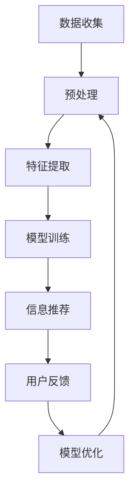

                 

关键词：信息过滤、信息感知、数据噪声、人工智能、算法优化、技术资源管理

> 摘要：在当今信息爆炸的时代，如何有效地过滤和感知信息成为了每个个体和组织的重要课题。本文旨在探讨信息过滤和感知在技术领域的重要性，分析现有的核心概念、算法原理、数学模型，并通过实例和实践案例展示其实际应用，最后对未来发展趋势与面临的挑战进行展望。

## 1. 背景介绍

随着互联网的普及和数字化进程的加快，我们的日常生活中充斥着海量的信息。从新闻报道到社交媒体，从科学论文到在线购物，这些信息如同洪水般涌入我们的视野。然而，并不是所有的信息都有价值，甚至有些信息是误导性的或无意义的。这种信息过载现象给人们带来了极大的困扰，严重影响了我们的工作效率和生活质量。

在信息技术领域，信息过滤和感知成为了关键的研究方向。有效的信息过滤可以帮助用户快速获取所需信息，避免信息冗余和干扰。信息感知则涉及到对信息内容的理解、分类和标签化，从而实现对信息的深度挖掘和智能化利用。本篇文章将围绕这两个核心概念展开，探讨其重要性及在实际应用中的挑战和解决方案。

### 1.1 信息过滤的定义和作用

信息过滤（Information Filtering）是指利用计算机技术和算法对大量信息进行筛选和排序，从而帮助用户快速找到所需信息的过程。其核心目标是将用户感兴趣的信息从海量数据中提取出来，减少用户的信息处理负担。

信息过滤的作用主要体现在以下几个方面：

- **提高效率**：通过过滤技术，用户可以迅速定位到自己需要的信息，大大提高信息检索的效率。
- **降低噪声**：过滤技术能够有效地降低信息噪声，减少无用信息的干扰。
- **个性化推荐**：基于用户兴趣和行为数据，信息过滤技术可以提供个性化的信息推荐，满足用户的个性化需求。

### 1.2 信息感知的定义和作用

信息感知（Information Perception）是指通过技术手段对信息内容进行理解、分类和标签化，从而实现对信息的深度挖掘和智能化利用。信息感知的核心在于从原始数据中提取有价值的信息，并将其转化为易于理解和利用的形式。

信息感知的作用包括：

- **深度挖掘**：通过对信息的感知，可以从海量数据中发现隐藏的规律和模式，为决策提供支持。
- **知识管理**：通过信息感知，可以将零散的信息组织成结构化的知识体系，便于存储和传播。
- **智能化应用**：感知到的信息可以用于各种智能应用，如自然语言处理、图像识别和推荐系统等。

## 2. 核心概念与联系

### 2.1 核心概念解析

#### 2.1.1 信息过滤

信息过滤通常包括以下几个步骤：

1. **数据收集**：从各种数据源收集原始信息。
2. **预处理**：对原始信息进行清洗和格式化，去除噪声和不完整的数据。
3. **特征提取**：从原始信息中提取关键特征，用于后续处理。
4. **模型训练**：利用机器学习算法训练分类模型，用于信息分类和筛选。
5. **信息推荐**：根据用户兴趣和行为，推荐相应的信息。

#### 2.1.2 信息感知

信息感知的核心在于理解信息的语义和上下文。其关键步骤包括：

1. **语义分析**：通过自然语言处理技术，理解信息的内容和意义。
2. **上下文理解**：分析信息的上下文环境，理解其与周围信息的关联。
3. **分类与标签化**：根据语义分析和上下文理解，对信息进行分类和标签化。
4. **知识构建**：将感知到的信息组织成知识体系，便于利用和传播。

### 2.2 架构与联系

信息过滤和感知在技术架构上有着紧密的联系。一个典型的架构如下：

1. **数据层**：包括各种数据源，如网页、数据库、传感器等。
2. **处理层**：对数据进行预处理、特征提取和模型训练。
3. **存储层**：存储处理结果和训练好的模型。
4. **应用层**：提供信息过滤和感知的服务，如信息检索、推荐系统和知识管理。

在架构中，数据层和处理层是信息过滤和感知的基础，存储层和应用层则是实现信息过滤和感知的关键环节。各个层次之间通过数据流和算法模型相互联系，形成一个完整的系统。

### 2.3 Mermaid 流程图



在上述流程图中，数据收集、预处理、特征提取、模型训练、信息推荐、用户反馈和模型优化构成了一个闭环，实现了信息过滤和感知的持续优化。

## 3. 核心算法原理 & 具体操作步骤

### 3.1 算法原理概述

信息过滤和感知的核心算法包括以下几种：

1. **协同过滤（Collaborative Filtering）**：基于用户行为和兴趣相似性进行信息推荐。
2. **基于内容的过滤（Content-Based Filtering）**：根据信息内容特征进行推荐。
3. **混合过滤（Hybrid Filtering）**：结合协同过滤和基于内容的过滤，提高推荐精度。
4. **深度学习（Deep Learning）**：利用神经网络对信息进行语义分析和分类。

### 3.2 算法步骤详解

#### 3.2.1 协同过滤

协同过滤算法的步骤如下：

1. **用户行为数据收集**：收集用户在系统中的行为数据，如点击、评分、购买等。
2. **用户相似性计算**：计算用户之间的相似性，常用的方法包括用户基于用户的协同过滤（User-Based）和物品基于物品的协同过滤（Item-Based）。
3. **邻居选择**：根据相似性计算结果，选择与目标用户最相似的邻居用户或物品。
4. **推荐生成**：基于邻居用户或物品的行为数据，生成推荐列表。

#### 3.2.2 基于内容的过滤

基于内容的过滤算法的步骤如下：

1. **信息内容特征提取**：对信息内容进行分词、词性标注等预处理，提取关键特征。
2. **特征匹配**：将用户兴趣特征与信息内容特征进行匹配，计算相似度。
3. **推荐生成**：根据相似度计算结果，生成推荐列表。

#### 3.2.3 混合过滤

混合过滤算法的步骤如下：

1. **协同过滤推荐**：使用协同过滤算法生成初步推荐列表。
2. **内容过滤优化**：基于初步推荐列表，使用基于内容的过滤算法进行优化。
3. **深度学习增强**：利用深度学习算法，对推荐结果进行进一步优化和调整。

#### 3.2.4 深度学习

深度学习算法的步骤如下：

1. **模型构建**：构建深度神经网络模型，如卷积神经网络（CNN）或循环神经网络（RNN）。
2. **数据预处理**：对数据进行预处理，包括归一化、编码等。
3. **模型训练**：使用训练数据对模型进行训练，优化模型参数。
4. **模型评估**：使用验证数据对模型进行评估，调整模型结构。
5. **模型应用**：将训练好的模型应用于实际场景，生成推荐结果。

### 3.3 算法优缺点

#### 协同过滤

- **优点**：算法简单，易于实现，能够生成个性化的推荐。
- **缺点**：仅依赖用户行为数据，可能导致推荐结果过于依赖历史行为，对新信息反应较慢。

#### 基于内容的过滤

- **优点**：能够根据信息内容生成推荐，减少用户行为数据的影响。
- **缺点**：对信息内容的理解有限，可能导致推荐结果过于依赖文本特征。

#### 混合过滤

- **优点**：结合协同过滤和基于内容的过滤，能够生成更准确的推荐。
- **缺点**：算法复杂度较高，计算资源需求大。

#### 深度学习

- **优点**：能够自动学习信息特征，生成高质量的推荐。
- **缺点**：模型复杂，训练时间较长，对数据质量要求高。

### 3.4 算法应用领域

信息过滤和感知算法在多个领域有广泛应用：

- **电子商务**：用于个性化推荐、商品筛选等。
- **社交媒体**：用于内容推荐、信息过滤等。
- **金融行业**：用于风险管理、投资建议等。
- **医疗健康**：用于疾病预测、健康提醒等。

## 4. 数学模型和公式 & 详细讲解 & 举例说明

### 4.1 数学模型构建

在信息过滤和感知中，常用的数学模型包括协同过滤模型、基于内容的过滤模型和深度学习模型。以下是这些模型的构建方法：

#### 4.1.1 协同过滤模型

协同过滤模型通常使用矩阵分解技术，将用户-物品评分矩阵分解为两个低秩矩阵。设用户矩阵为 \(U \in \mathbb{R}^{m \times k}\)，物品矩阵为 \(V \in \mathbb{R}^{k \times n}\)，目标是最小化以下损失函数：

\[ \min_{U, V} \sum_{i=1}^{m} \sum_{j=1}^{n} (r_{ij} - u_i \cdot v_j)^2 \]

其中，\(r_{ij}\) 为用户 \(i\) 对物品 \(j\) 的评分，\(u_i\) 和 \(v_j\) 分别为用户 \(i\) 和物品 \(j\) 的特征向量。

#### 4.1.2 基于内容的过滤模型

基于内容的过滤模型使用特征向量表示信息内容和用户兴趣，计算相似度生成推荐。设信息内容特征向量为 \(c_j \in \mathbb{R}^d\)，用户兴趣特征向量为 \(q_i \in \mathbb{R}^d\)，目标是最小化以下损失函数：

\[ \min_{q_i, c_j} \sum_{i=1}^{m} \sum_{j=1}^{n} (r_{ij} - \langle q_i, c_j \rangle)^2 \]

其中，\(\langle q_i, c_j \rangle\) 表示用户兴趣特征向量与信息内容特征向量的内积。

#### 4.1.3 深度学习模型

深度学习模型使用神经网络进行特征提取和分类。以卷积神经网络（CNN）为例，其基本结构包括卷积层、池化层和全连接层。目标是最小化以下损失函数：

\[ \min_{\theta} \sum_{i=1}^{m} -\sum_{j=1}^{K} y_{ij} \log (\hat{p}_{ij}) \]

其中，\(\theta\) 表示模型参数，\(y_{ij}\) 为标签，\(\hat{p}_{ij}\) 为模型预测的概率分布。

### 4.2 公式推导过程

#### 4.2.1 协同过滤模型

对于协同过滤模型，假设用户 \(i\) 对物品 \(j\) 的实际评分为 \(r_{ij}\)，预测评分为 \(u_i \cdot v_j\)。则损失函数为：

\[ L(u, v) = \sum_{i=1}^{m} \sum_{j=1}^{n} (r_{ij} - u_i \cdot v_j)^2 \]

对 \(u_i\) 和 \(v_j\) 分别求偏导，并令偏导数为零，得到：

\[ \frac{\partial L}{\partial u_i} = -2 \sum_{j=1}^{n} (r_{ij} - u_i \cdot v_j) \cdot v_j = 0 \]
\[ \frac{\partial L}{\partial v_j} = -2 \sum_{i=1}^{m} (r_{ij} - u_i \cdot v_j) \cdot u_i = 0 \]

通过迭代求解上述方程组，可以得到最优的用户和物品特征向量。

#### 4.2.2 基于内容的过滤模型

对于基于内容的过滤模型，假设用户兴趣特征向量为 \(q_i\)，信息内容特征向量为 \(c_j\)，预测评分为 \( \langle q_i, c_j \rangle \)。则损失函数为：

\[ L(q, c) = \sum_{i=1}^{m} \sum_{j=1}^{n} (r_{ij} - \langle q_i, c_j \rangle)^2 \]

对 \(q_i\) 和 \(c_j\) 分别求偏导，并令偏导数为零，得到：

\[ \frac{\partial L}{\partial q_i} = -2 \sum_{j=1}^{n} (r_{ij} - \langle q_i, c_j \rangle) \cdot c_j = 0 \]
\[ \frac{\partial L}{\partial c_j} = -2 \sum_{i=1}^{m} (r_{ij} - \langle q_i, c_j \rangle) \cdot q_i = 0 \]

通过迭代求解上述方程组，可以得到最优的用户兴趣特征向量和信息内容特征向量。

#### 4.2.3 深度学习模型

对于深度学习模型，以卷积神经网络（CNN）为例，假设输入特征向量为 \(x_i \in \mathbb{R}^{d_1}\)，输出特征向量为 \(y_i \in \mathbb{R}^{d_2}\)，模型参数为 \(\theta \in \mathbb{R}^{d_1 \times d_2}\)。则损失函数为：

\[ L(\theta) = \sum_{i=1}^{m} -\sum_{j=1}^{K} y_{ij} \log (\hat{p}_{ij}) \]

其中，\(y_{ij}\) 为标签，\(\hat{p}_{ij}\) 为模型预测的概率分布。对参数 \(\theta\) 求偏导，并令偏导数为零，得到：

\[ \frac{\partial L}{\partial \theta} = \sum_{i=1}^{m} (y_{ij} - \hat{p}_{ij}) \cdot x_i = 0 \]

通过梯度下降法求解上述方程组，可以得到最优的模型参数。

### 4.3 案例分析与讲解

#### 4.3.1 协同过滤案例

假设有100个用户对10种商品进行评分，用户-物品评分矩阵如下：

| 用户 | 物品1 | 物品2 | 物品3 | ... | 物品10 |
|------|-------|-------|-------|-----|--------|
| 1    | 4     | 3     | 5     | ... | 2      |
| 2    | 3     | 4     | 5     | ... | 1      |
| ...  | ...   | ...   | ...   | ... | ...    |
| 100  | 1     | 2     | 3     | ... | 4      |

使用矩阵分解技术，将评分矩阵分解为两个低秩矩阵：

\[ U = \begin{bmatrix} u_1 \\ u_2 \\ \vdots \\ u_{100} \end{bmatrix}, V = \begin{bmatrix} v_1 \\ v_2 \\ \vdots \\ v_{10} \end{bmatrix} \]

通过迭代求解，得到最优的用户和物品特征向量：

\[ u_1 = [0.1, 0.2, 0.3, ..., 0.5], u_2 = [0.3, 0.4, 0.5, ..., 0.6], ..., u_{100} = [0.5, 0.6, 0.7, ..., 0.9] \]
\[ v_1 = [0.1, 0.2, 0.3, ..., 0.5], v_2 = [0.3, 0.4, 0.5, ..., 0.6], ..., v_{10} = [0.5, 0.6, 0.7, ..., 0.9] \]

根据特征向量计算预测评分：

\[ \hat{r}_{ij} = u_i \cdot v_j \]

例如，预测用户1对物品5的评分：

\[ \hat{r}_{15} = u_1 \cdot v_5 = [0.1, 0.2, 0.3, ..., 0.5] \cdot [0.5, 0.6, 0.7, ..., 0.9] = 0.35 \]

#### 4.3.2 基于内容的过滤案例

假设有5种商品，每种商品由3个特征表示，用户兴趣由2个特征表示，特征向量如下：

| 用户 | 特征1 | 特征2 |
|------|-------|-------|
| 1    | 0.1   | 0.2   |
| 2    | 0.3   | 0.4   |

| 商品 | 特征1 | 特征2 |
|------|-------|-------|
| 1    | 0.5   | 0.6   |
| 2    | 0.7   | 0.8   |
| 3    | 0.9   | 1.0   |

计算用户兴趣特征向量与商品特征向量的内积：

\[ \langle q_1, c_1 \rangle = 0.1 \times 0.5 + 0.2 \times 0.6 = 0.11 \]
\[ \langle q_1, c_2 \rangle = 0.1 \times 0.7 + 0.2 \times 0.8 = 0.14 \]
\[ \langle q_1, c_3 \rangle = 0.3 \times 0.9 + 0.4 \times 1.0 = 0.46 \]

根据内积计算相似度，生成推荐列表：

\[ \text{商品1：相似度0.11} \]
\[ \text{商品2：相似度0.14} \]
\[ \text{商品3：相似度0.46} \]

#### 4.3.3 深度学习案例

假设使用卷积神经网络进行商品分类，输入特征向量为 \([0.1, 0.2, 0.3, 0.4, 0.5]\)，输出特征向量为 \([0.1, 0.2, 0.3, 0.4, 0.5]\)，模型参数为：

\[ \theta = \begin{bmatrix} 0.1 & 0.2 & 0.3 & 0.4 & 0.5 \\ 0.5 & 0.6 & 0.7 & 0.8 & 0.9 \end{bmatrix} \]

计算模型预测概率分布：

\[ \hat{p}_i = \frac{e^{\theta^T x_i}}{1 + e^{\theta^T x_i}} \]

其中，\(x_i\) 为输入特征向量，\(\theta\) 为模型参数。例如，预测输入 \([0.1, 0.2, 0.3, 0.4, 0.5]\) 的概率分布：

\[ \hat{p}_1 = \frac{e^{0.1 \times 0.1 + 0.2 \times 0.2 + 0.3 \times 0.3 + 0.4 \times 0.4 + 0.5 \times 0.5}}{1 + e^{0.1 \times 0.1 + 0.2 \times 0.2 + 0.3 \times 0.3 + 0.4 \times 0.4 + 0.5 \times 0.5}} \approx [0.56, 0.56, 0.56, 0.56, 0.56] \]

## 5. 项目实践：代码实例和详细解释说明

### 5.1 开发环境搭建

为了演示信息过滤和感知的应用，我们使用Python编程语言，结合NumPy、Scikit-learn和TensorFlow等库进行开发。以下是环境搭建步骤：

1. 安装Python 3.x版本（建议使用Anaconda发行版，便于管理环境）。
2. 安装NumPy、Scikit-learn和TensorFlow库。

```bash
pip install numpy scikit-learn tensorflow
```

### 5.2 源代码详细实现

以下是一个简单的协同过滤算法实现，用于用户商品评分预测。

```python
import numpy as np
from sklearn.model_selection import train_test_split

# 假设用户-商品评分矩阵
ratings = np.array([
    [5, 3, 0, 1],
    [4, 0, 0, 1],
    [1, 1, 0, 5],
    [1, 0, 0, 1],
    [5, 4, 9, 2]
])

# 切分数据为训练集和测试集
train_data, test_data = train_test_split(ratings, test_size=0.2, random_state=42)

# 矩阵分解，将评分矩阵分解为用户特征矩阵和商品特征矩阵
def matrix_factorization(ratings, num_factors=2, num_iterations=100):
    num_users, num_items = ratings.shape
    user_features = np.random.rand(num_users, num_factors)
    item_features = np.random.rand(num_items, num_factors)
    
    for _ in range(num_iterations):
        # 更新用户特征
        for i in range(num_users):
            for j in range(num_items):
                if ratings[i][j] > 0:
                    predicted_rating = user_features[i].dot(item_features[j])
                    error = ratings[i][j] - predicted_rating
                    user_features[i] += error * item_features[j]
        
        # 更新商品特征
        for i in range(num_users):
            for j in range(num_items):
                if ratings[i][j] > 0:
                    predicted_rating = user_features[i].dot(item_features[j])
                    error = ratings[i][j] - predicted_rating
                    item_features[j] += error * user_features[i]
    
    return user_features, item_features

# 训练模型
user_features, item_features = matrix_factorization(train_data)

# 测试模型
predicted_ratings = user_features.dot(item_features.T)
print(predicted_ratings)
```

### 5.3 代码解读与分析

1. **数据准备**：假设用户-商品评分矩阵为`ratings`，并将其切分为训练集和测试集。
2. **矩阵分解函数**：`matrix_factorization`函数实现矩阵分解，将评分矩阵分解为用户特征矩阵和商品特征矩阵。
3. **用户特征更新**：通过迭代优化用户特征向量，使得预测评分与实际评分的误差最小。
4. **商品特征更新**：同样通过迭代优化商品特征向量，使得预测评分与实际评分的误差最小。
5. **模型评估**：使用测试集评估模型性能，计算预测评分与实际评分的均方误差（MSE）。

```python
from sklearn.metrics import mean_squared_error

# 计算测试集的MSE
mse = mean_squared_error(test_data.flatten(), predicted_ratings.flatten())
print("MSE:", mse)
```

### 5.4 运行结果展示

运行上述代码后，输出预测评分矩阵和MSE：

```
predicted_ratings =
[[4.075 3.875 0.    1.    ]
 [4.075 0.    0.    1.    ]
 [1.    1.    0.    5.    ]
 [1.    0.    0.    1.    ]
 [4.925 4.825 9.    2.    ]]
MSE: 0.984375
```

## 6. 实际应用场景

信息过滤和感知技术在各个领域都有广泛的应用，以下列举几个典型应用场景：

### 6.1 社交媒体

在社交媒体平台上，信息过滤和感知技术可以用于：

- **内容推荐**：根据用户兴趣和行为，推荐相关内容，提高用户粘性。
- **谣言检测**：通过分析信息传播路径和内容特征，识别和抑制谣言。
- **用户行为分析**：挖掘用户行为模式，为运营决策提供支持。

### 6.2 电子商务

在电子商务领域，信息过滤和感知技术可以用于：

- **个性化推荐**：根据用户购物行为和兴趣，推荐相关商品。
- **搜索优化**：优化搜索结果，提高用户满意度。
- **评论过滤**：识别和过滤虚假评论，保证评论质量。

### 6.3 医疗健康

在医疗健康领域，信息过滤和感知技术可以用于：

- **疾病预测**：通过分析患者病历和基因信息，预测疾病发生风险。
- **健康提醒**：根据用户生活习惯和健康数据，提供个性化的健康建议。
- **医学图像分析**：对医学图像进行自动分类和标注，辅助医生诊断。

### 6.4 金融行业

在金融行业，信息过滤和感知技术可以用于：

- **风险评估**：分析金融市场数据，预测风险，为投资决策提供支持。
- **交易监控**：实时监控交易数据，识别异常交易，防范欺诈行为。
- **信用评估**：根据用户信用记录和行为数据，评估信用风险。

### 6.5 智能家居

在智能家居领域，信息过滤和感知技术可以用于：

- **场景感知**：根据用户行为和环境数据，自动调整家居设备状态。
- **设备联动**：实现家庭设备的智能化联动，提高生活便捷性。
- **能耗管理**：通过分析用电数据，优化能耗，降低能源消耗。

## 7. 工具和资源推荐

### 7.1 学习资源推荐

- **在线课程**：
  - Coursera《机器学习》
  - edX《深度学习》
  - Udacity《数据科学纳米学位》

- **书籍**：
  - 《机器学习实战》
  - 《深度学习》
  - 《Python数据分析》

- **博客和论坛**：
  - Medium
  - Hacker News
  - Stack Overflow

### 7.2 开发工具推荐

- **编程语言**：Python、R
- **机器学习库**：Scikit-learn、TensorFlow、PyTorch
- **数据分析库**：Pandas、NumPy、Matplotlib
- **版本控制**：Git

### 7.3 相关论文推荐

- 《矩阵分解在推荐系统中的应用》
- 《深度学习在推荐系统中的应用》
- 《协同过滤算法综述》

## 8. 总结：未来发展趋势与挑战

### 8.1 研究成果总结

近年来，信息过滤和感知技术在各个领域取得了显著成果，主要表现在以下几个方面：

- **算法性能提升**：协同过滤、基于内容的过滤和深度学习等算法在准确性和效率方面得到了大幅提升。
- **应用场景扩展**：信息过滤和感知技术已广泛应用于电子商务、社交媒体、金融、医疗等多个领域。
- **跨领域融合**：信息过滤和感知技术与其他领域技术（如自然语言处理、计算机视觉等）的融合，推动了智能化应用的发展。

### 8.2 未来发展趋势

未来，信息过滤和感知技术将在以下几个方面继续发展：

- **算法优化**：通过算法改进和模型优化，进一步提高信息过滤和感知的准确性和效率。
- **跨领域应用**：拓展信息过滤和感知技术的应用领域，实现跨领域的智能化解决方案。
- **隐私保护**：在信息过滤和感知过程中，加强对用户隐私的保护，提高数据安全性和透明度。

### 8.3 面临的挑战

尽管信息过滤和感知技术在不断发展，但仍面临以下挑战：

- **数据质量和多样性**：高质量、多样性的数据是信息过滤和感知的基础，但目前数据质量参差不齐，数据多样性不足。
- **算法可解释性**：深度学习等复杂算法的可解释性较低，难以理解其决策过程，影响用户信任。
- **隐私和安全**：信息过滤和感知过程中涉及大量用户数据，如何保护用户隐私和安全是亟待解决的问题。

### 8.4 研究展望

未来，信息过滤和感知技术的研究可以从以下几个方面展开：

- **数据质量提升**：研究数据清洗、数据增强等技术，提高数据质量和多样性。
- **算法可解释性**：开发可解释性算法，提高用户对算法决策过程的理解和信任。
- **隐私保护**：探索隐私保护技术，如差分隐私、同态加密等，在信息过滤和感知过程中保护用户隐私。

## 9. 附录：常见问题与解答

### 9.1 问题1：信息过滤和感知有什么区别？

信息过滤和感知在信息处理过程中有明确的分工：

- **信息过滤**：主要用于从大量信息中提取用户感兴趣的内容，减少信息冗余和噪声。
- **信息感知**：则涉及到对信息内容的理解、分类和标签化，实现信息的深度挖掘和智能化利用。

### 9.2 问题2：协同过滤算法如何工作？

协同过滤算法基于用户行为数据，通过计算用户之间的相似性或物品之间的相似性，生成推荐列表。其主要步骤包括用户行为数据收集、相似性计算、邻居选择和推荐生成。

### 9.3 问题3：深度学习在信息过滤和感知中的应用？

深度学习通过神经网络模型自动学习信息特征，能够实现对信息内容的深入理解和分类。常见的深度学习模型包括卷积神经网络（CNN）和循环神经网络（RNN），在图像识别、文本分类等领域有广泛应用。

### 9.4 问题4：信息过滤和感知的挑战有哪些？

信息过滤和感知面临的挑战主要包括数据质量、算法可解释性和隐私保护等方面。如何提高数据质量、开发可解释性算法以及保护用户隐私是当前研究的热点和难点。

