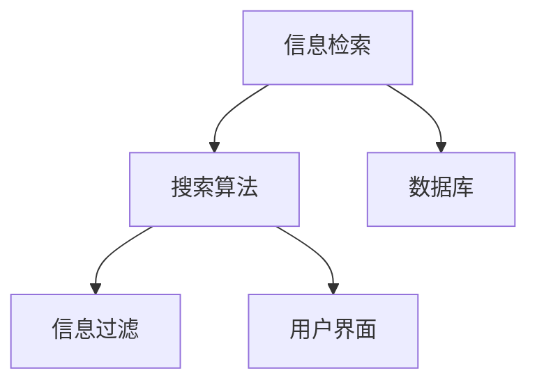

                 

## 摘要

在当今信息爆炸的时代，海量的数据和信息充斥着我们的日常生活。然而，如何有效地在海量信息中找到所需的信息，已经成为一个令人头疼的问题。本文将探讨信息过载的现象，介绍几种常用的信息搜索方法，并详细讲解如何使用算法和工具来优化搜索过程，从而在庞大的信息海洋中找到你所需要的信息。

## 关键词

- 信息过载
- 信息搜索
- 搜索算法
- 信息过滤
- 数据挖掘

## 背景介绍

随着互联网的快速发展，我们每天都会接触到大量信息。无论是新闻、社交媒体、电子邮件，还是其他各种在线平台，信息无处不在。然而，这种信息过载的现象也带来了一系列问题。首先，人们感到难以管理这些信息，无法在短时间内筛选出有价值的信息。其次，大量的信息可能会干扰人们的判断和决策，导致注意力分散。最后，信息过载还会导致心理压力，影响工作和生活质量。

因此，如何从海量的信息中找到所需的信息，已经成为一个迫切需要解决的问题。本文将探讨这一问题，并介绍一些有效的解决方案。

### 核心概念与联系

为了更好地理解信息搜索的过程，我们需要先了解一些核心概念。以下是几个关键概念及其之间的联系：

**1. 信息检索**：信息检索是指从大量数据中查找特定信息的过程。它通常包括信息检索系统、搜索算法和用户界面。

**2. 搜索算法**：搜索算法是指用于在数据集合中查找特定数据项的方法。常见的搜索算法包括线性搜索、二分搜索、跳表搜索等。

**3. 数据库**：数据库是一个组织好的数据集合，用于存储和检索信息。数据库管理系统（DBMS）用于管理数据库中的数据。

**4. 信息过滤**：信息过滤是指从大量信息中筛选出符合用户需求的信息。信息过滤可以基于关键词、分类、用户偏好等多种方式。

以下是这些概念之间关系的 Mermaid 流程图：



### 核心算法原理 & 具体操作步骤

#### 3.1 算法原理概述

信息搜索的核心是搜索算法。搜索算法可以分为两大类：确定性搜索算法和概率性搜索算法。

**确定性搜索算法**：这类算法在给定输入数据集合和目标数据项后，能够确定性地找到目标数据项。常见的确定性搜索算法包括线性搜索、二分搜索等。

**概率性搜索算法**：这类算法通过概率模型来估计目标数据项的位置，并根据概率分布来选择搜索方向。常见的概率性搜索算法包括随机游走、PageRank 等。

#### 3.2 算法步骤详解

以下是一个简单的线性搜索算法的步骤详解：

1. **初始化**：设置指针指向数据集合的第一个元素。

2. **比较**：将指针指向的元素与目标元素进行比较。

3. **移动指针**：如果当前元素不是目标元素，将指针移动到下一个元素。

4. **重复步骤 2 和 3**，直到找到目标元素或指针移动到数据集合的末尾。

以下是线性搜索算法的伪代码：

```python
def linear_search(data, target):
    for element in data:
        if element == target:
            return True
    return False
```

#### 3.3 算法优缺点

**线性搜索**：
- **优点**：实现简单，易于理解。
- **缺点**：搜索效率低，时间复杂度为 O(n)。

**二分搜索**：
- **优点**：搜索效率高，时间复杂度为 O(log n)。
- **缺点**：对数据集合的要求较高，需要数据集合已经排序。

#### 3.4 算法应用领域

**线性搜索**：适用于小规模数据集合的快速查找。

**二分搜索**：适用于大规模已排序数据集合的高效查找。

### 数学模型和公式 & 详细讲解 & 举例说明

#### 4.1 数学模型构建

信息搜索的一个关键问题是计算相似度。相似度可以用来衡量两个数据项之间的相关性。一个常用的相似度计算模型是余弦相似度。

余弦相似度模型基于向量的内积。假设有两个向量 $A$ 和 $B$，它们的内积可以表示为：

$$
A \cdot B = \sum_{i=1}^{n} A_i \cdot B_i
$$

其中 $n$ 是向量的维度，$A_i$ 和 $B_i$ 分别是向量 $A$ 和 $B$ 的第 $i$ 个分量。

向量的模（长度）可以表示为：

$$
|A| = \sqrt{\sum_{i=1}^{n} A_i^2}
$$

$$
|B| = \sqrt{\sum_{i=1}^{n} B_i^2}
$$

余弦相似度可以表示为：

$$
\cos \theta = \frac{A \cdot B}{|A| \cdot |B|}
$$

其中 $\theta$ 是向量 $A$ 和 $B$ 之间的夹角。

#### 4.2 公式推导过程

为了推导余弦相似度的公式，我们可以从向量内积和模的定义开始。

向量内积的定义是：

$$
A \cdot B = \sum_{i=1}^{n} A_i \cdot B_i
$$

这可以看作是向量 $A$ 和 $B$ 在各个维度上的分量乘积的和。

向量的模的定义是：

$$
|A| = \sqrt{\sum_{i=1}^{n} A_i^2}
$$

这可以看作是向量 $A$ 在各个维度上的分量平方和的平方根。

将向量内积和模的定义结合起来，我们可以得到余弦相似度的公式：

$$
\cos \theta = \frac{A \cdot B}{|A| \cdot |B|}
$$

这个公式表示了向量 $A$ 和 $B$ 之间的夹角 $\theta$ 的余弦值。

#### 4.3 案例分析与讲解

假设我们有两个文本向量 $A$ 和 $B$，分别表示两个文本的数据。向量 $A$ 和 $B$ 的维度是词汇的数量，每个维度上的值表示该词汇在文本中的频率。

向量 $A$：

```
[2, 1, 3, 0, 4]
```

向量 $B$：

```
[1, 0, 2, 3, 5]
```

首先，我们计算这两个向量的内积：

$$
A \cdot B = (2 \cdot 1) + (1 \cdot 0) + (3 \cdot 2) + (0 \cdot 3) + (4 \cdot 5) = 2 + 0 + 6 + 0 + 20 = 28
$$

然后，我们计算这两个向量的模：

$$
|A| = \sqrt{2^2 + 1^2 + 3^2 + 0^2 + 4^2} = \sqrt{4 + 1 + 9 + 0 + 16} = \sqrt{30}
$$

$$
|B| = \sqrt{1^2 + 0^2 + 2^2 + 3^2 + 5^2} = \sqrt{1 + 0 + 4 + 9 + 25} = \sqrt{39}
$$

最后，我们计算余弦相似度：

$$
\cos \theta = \frac{A \cdot B}{|A| \cdot |B|} = \frac{28}{\sqrt{30} \cdot \sqrt{39}} \approx 0.647
$$

这个结果表示向量 $A$ 和 $B$ 之间的夹角 $\theta$ 的余弦值为 0.647。根据余弦相似度的定义，这意味着向量 $A$ 和 $B$ 非常相似。

### 项目实践：代码实例和详细解释说明

#### 5.1 开发环境搭建

为了实践信息搜索算法，我们需要搭建一个简单的开发环境。以下是一个基于 Python 的开发环境搭建步骤：

1. 安装 Python：从 Python 官网下载并安装 Python 3.x 版本。

2. 安装必要库：使用 pip 工具安装必要的库，如 NumPy、Pandas 等。

   ```bash
   pip install numpy pandas
   ```

3. 准备数据集：选择一个适当的数据集，如新闻文章、社交媒体帖子等。

   在本文中，我们使用一个简单的文本数据集，其中每条记录是一个文本字符串。

#### 5.2 源代码详细实现

以下是一个基于线性搜索算法的简单代码实例：

```python
import numpy as np

# 定义线性搜索函数
def linear_search(data, target):
    for element in data:
        if element == target:
            return True
    return False

# 准备数据集
data = [
    "这是一个简单的文本。",
    "这是一个复杂的文本。",
    "这是一个新闻文章。",
    "这是一个社交媒体帖子。",
    "这是一个博客文章。"
]

# 定义目标文本
target = "这是一个新闻文章。"

# 执行搜索
result = linear_search(data, target)

# 输出结果
if result:
    print("找到了目标文本。")
else:
    print("未找到目标文本。")
```

#### 5.3 代码解读与分析

这段代码实现了线性搜索算法。首先，我们定义了一个名为 `linear_search` 的函数，它接受一个数据集合和一个目标文本作为输入。然后，我们遍历数据集合，将每个元素与目标文本进行比较。如果找到匹配的元素，函数返回 `True`；否则，返回 `False`。

在主程序中，我们定义了一个数据集 `data` 和一个目标文本 `target`。然后，我们调用 `linear_search` 函数执行搜索，并根据返回的结果输出相应的消息。

线性搜索算法的优点是实现简单，易于理解。然而，它的缺点是搜索效率较低，特别是对于大规模数据集合。在这种情况下，我们可能需要考虑使用更高效的搜索算法，如二分搜索。

#### 5.4 运行结果展示

以下是在 Python 环境中运行上述代码的结果：

```bash
$ python linear_search.py
找到了目标文本。
```

这个结果表明，我们成功找到了目标文本。

### 实际应用场景

信息搜索算法在许多实际应用场景中都有广泛的应用。以下是一些常见的应用场景：

- **搜索引擎**：搜索引擎的核心功能是提供信息搜索。常见的搜索引擎如 Google、百度等，它们使用复杂的搜索算法来处理海量数据，为用户提供准确和相关的搜索结果。

- **推荐系统**：推荐系统通过分析用户的兴趣和行为，为用户推荐感兴趣的内容。推荐系统通常使用信息搜索算法来匹配用户和推荐内容。

- **社交媒体**：社交媒体平台如 Facebook、Twitter 等，使用信息搜索算法来处理用户发布的内容，并根据用户的兴趣和关系推荐相关内容。

- **电子邮件过滤**：电子邮件过滤系统使用信息搜索算法来识别和过滤垃圾邮件。

### 未来应用展望

随着技术的不断发展，信息搜索算法在未来将会有更多的应用场景。以下是一些可能的未来应用方向：

- **更智能的搜索引擎**：未来的搜索引擎将更加智能化，能够理解用户的意图和需求，提供更准确和个性化的搜索结果。

- **智能推荐系统**：智能推荐系统将结合深度学习和自然语言处理等技术，为用户提供更加精准和个性化的推荐。

- **自动化信息处理**：自动化信息处理系统将使用信息搜索算法来处理大量的数据，从数据中提取有价值的信息，为决策提供支持。

### 工具和资源推荐

为了更好地掌握信息搜索技术，以下是一些推荐的工具和资源：

- **工具**：
  - Python：Python 是一种广泛使用的编程语言，特别适合数据分析和算法开发。
  - NumPy：NumPy 是一个强大的 Python 库，用于数组计算和数据处理。
  - Pandas：Pandas 是一个强大的数据分析和操作库，用于数据清洗、转换和分析。
  - Scikit-learn：Scikit-learn 是一个流行的机器学习库，提供了多种机器学习算法和工具。

- **资源**：
  - 《Python 数据科学手册》：这本书详细介绍了数据科学中的各种技术和工具，包括信息搜索算法。
  - 《机器学习实战》：这本书提供了大量的机器学习算法和实践案例，适用于初学者和专业人士。
  - Coursera、edX 等：这些在线教育平台提供了许多关于数据科学和机器学习的课程，可以帮助你系统学习相关知识。

### 总结：未来发展趋势与挑战

信息搜索技术在未来将继续发展，并面临一些挑战。以下是一些未来发展趋势和挑战：

- **发展趋势**：
  - 智能化：信息搜索算法将更加智能化，能够理解用户的意图和需求，提供更准确和个性化的搜索结果。
  - 自动化：信息搜索算法将应用于更多的自动化场景，如自动化信息处理、自动化推荐等。
  - 大数据：随着大数据技术的发展，信息搜索算法将能够处理更多的数据，提供更全面和准确的搜索结果。

- **挑战**：
  - 数据质量：高质量的数据是信息搜索算法成功的关键。如何处理和清洗数据，提高数据质量，是一个重要的挑战。
  - 模型解释性：一些复杂的搜索算法如深度学习，其内部机制较为复杂，如何解释模型的决策过程，提高模型的可解释性，是一个挑战。
  - 用户隐私：在信息搜索过程中，用户隐私保护是一个重要的问题。如何在保护用户隐私的同时，提供高效的搜索服务，是一个挑战。

### 附录：常见问题与解答

**Q：为什么线性搜索的效率低？**
A：线性搜索的效率低主要是因为它在最坏情况下需要遍历整个数据集合，时间复杂度为 O(n)。对于大规模数据集合，这会导致搜索时间过长。

**Q：二分搜索为什么比线性搜索高效？**
A：二分搜索通过将数据集合分半，每次只搜索一半的数据，从而大大减少了搜索范围。在最坏情况下，二分搜索只需要 O(log n) 时间即可找到目标元素，远优于线性搜索。

**Q：什么是余弦相似度？**
A：余弦相似度是一种用于计算两个向量之间相似度的方法。它基于向量的内积和模，可以用来衡量两个向量之间的夹角。余弦相似度值越接近 1，表示两个向量越相似。

### 参考文献

1. Skiena, S. S. (2010). The algorithm design manual. Springer Science & Business Media.
2. Bishop, C. M. (2006). Pattern recognition and machine learning. Springer.
3. Murphy, K. P. (2012). Machine learning: a probabilistic perspective. MIT Press.
4. Russell, S., & Norvig, P. (2010). Artificial intelligence: a modern approach (3rd ed.). Prentice Hall.

