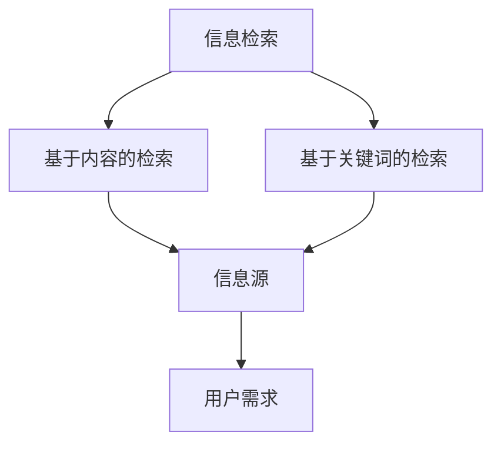
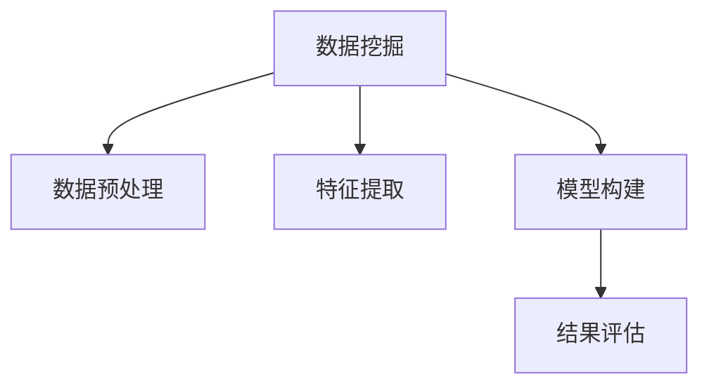
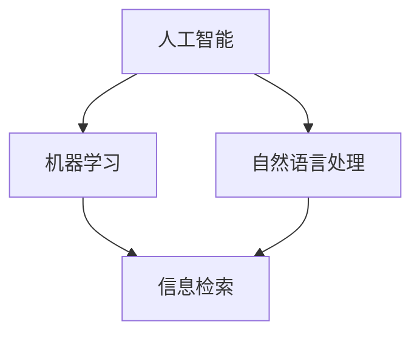

                 

在当今信息化时代，我们面临着前所未有的信息过载问题。随着互联网的普及和技术的飞速发展，各种信息如洪水般涌向我们，使得我们在寻找特定信息时感到困难重重。本文旨在为读者提供一整套信息搜索策略与指南，帮助您在庞大的信息海洋中迅速找到所需信息。

## 关键词
- 信息过载
- 信息搜索策略
- 信息检索
- 数据挖掘
- 人工智能

## 摘要
本文首先介绍了信息过载的现象及其影响，随后详细阐述了信息搜索的基本策略和技巧。通过数学模型和公式推导，我们深入分析了信息搜索的原理。然后，我们提供了实际项目中的代码实例，详细解释了如何在实际场景中应用信息搜索算法。最后，我们探讨了信息搜索的未来发展趋势以及面临的挑战。

## 1. 背景介绍

### 信息过载的定义与影响
信息过载是指信息量超出个体处理能力，导致个体无法有效地处理和利用这些信息。随着互联网的普及和大数据时代的到来，信息过载问题日益严重。信息过载的影响主要体现在以下几个方面：

1. **工作效率下降**：当信息过载时，个体在处理信息时需要花费更多的时间和精力，导致工作效率下降。
2. **信息焦虑**：大量信息的涌入容易引发信息焦虑，使得个体感到不安和压力。
3. **决策困难**：信息过载使得个体在做出决策时面临更多选择，增加了决策的难度。

### 信息搜索的重要性
在信息过载的背景下，高效的信息搜索变得尤为重要。良好的信息搜索能力可以帮助个体快速定位所需信息，提高工作效率，减轻信息焦虑，并支持更好的决策。本文将介绍一系列信息搜索策略和技巧，帮助读者在信息海洋中找到所需的信息。

## 2. 核心概念与联系

### 信息检索
信息检索是信息搜索的核心概念之一，它是指从大量信息中检索出所需信息的过程。信息检索可以分为基于内容的检索和基于关键词的检索。

#### Mermaid 流程图



### 数据挖掘
数据挖掘是一种从大量数据中自动发现有价值信息的方法。数据挖掘通常包括数据预处理、特征提取和模型构建等步骤。

#### Mermaid 流程图



### 人工智能
人工智能（AI）是近年来发展迅速的领域，它使得计算机能够模拟人类智能行为。在信息搜索中，人工智能可以通过机器学习算法和自然语言处理技术，提高信息检索的准确性和效率。

#### Mermaid 流程图



## 3. 核心算法原理 & 具体操作步骤

### 3.1 算法原理概述
信息搜索算法可以分为基于内容的检索和基于关键词的检索。基于内容的检索主要依赖于文本相似度计算，而基于关键词的检索则依赖于关键词匹配。

#### 基于内容的检索
基于内容的检索通过计算文本之间的相似度来确定相关性。常用的文本相似度计算方法包括余弦相似度、欧氏距离等。

#### 基于关键词的检索
基于关键词的检索通过匹配用户输入的关键词与文档中的关键词来计算相关性。常用的关键词匹配方法包括布尔检索、词频-逆文档频率（TF-IDF）等。

### 3.2 算法步骤详解

#### 基于内容的检索步骤
1. **文本预处理**：对文本进行分词、去停用词、词性标注等操作。
2. **特征提取**：将预处理后的文本转换为向量表示。
3. **相似度计算**：计算文档与查询之间的相似度，选择相似度最高的文档作为结果。

#### 基于关键词的检索步骤
1. **关键词提取**：从用户输入的查询中提取关键词。
2. **关键词匹配**：在文档中查找与关键词匹配的项。
3. **相关性计算**：计算匹配项的相关性得分，选择得分最高的文档作为结果。

### 3.3 算法优缺点

#### 基于内容的检索
**优点**：
- 能够更好地理解文档内容，提高检索准确率。
- 对关键词不敏感，适应性强。

**缺点**：
- 需要较复杂的文本预处理和特征提取过程，计算成本较高。
- 对噪声敏感，容易受停用词和词形变化的影响。

#### 基于关键词的检索
**优点**：
- 简单直观，易于实现。
- 对噪声和停用词不敏感。

**缺点**：
- 检索结果可能不够准确。
- 无法处理复杂的语义关系。

### 3.4 算法应用领域

#### 基于内容的检索
- 文本分类
- 情感分析
- 信息抽取

#### 基于关键词的检索
- 搜索引擎
- 文档管理
- 社交媒体信息检索

## 4. 数学模型和公式 & 详细讲解 & 举例说明

### 4.1 数学模型构建
在信息搜索中，常用的数学模型包括文本相似度模型和关键词匹配模型。

#### 文本相似度模型
文本相似度模型用于计算两个文本之间的相似度。常用的模型有：

1. **余弦相似度**：
   $$ \text{similarity} = \frac{\text{doc}_1 \cdot \text{doc}_2}{\|\text{doc}_1\|\|\text{doc}_2\|} $$
   其中，$\text{doc}_1$ 和 $\text{doc}_2$ 分别表示两个文本的向量表示，$ \cdot $ 表示点积，$ \| \|$ 表示向量长度。

2. **欧氏距离**：
   $$ \text{distance} = \sqrt{\sum_{i=1}^{n} (\text{doc}_1[i] - \text{doc}_2[i])^2} $$
   其中，$ n $ 表示文本的维度，$\text{doc}_1[i]$ 和 $\text{doc}_2[i]$ 分别表示文本在维度 $ i $ 上的值。

#### 关键词匹配模型
关键词匹配模型用于计算查询与文档之间的相关性。常用的模型有：

1. **布尔检索**：
   $$ \text{relevance} = \text{doc}_1 \land \text{doc}_2 $$
   其中，$\text{doc}_1$ 和 $\text{doc}_2$ 分别表示文档和查询的布尔表示，$ \land $ 表示逻辑与操作。

2. **词频-逆文档频率（TF-IDF）**：
   $$ \text{TF-IDF} = \text{TF} \times \text{IDF} $$
   其中，$\text{TF}$ 表示词频，$\text{IDF}$ 表示逆文档频率。
   $$ \text{TF} = \frac{\text{频次}}{\text{文档总词频}} $$
   $$ \text{IDF} = \log_2(\frac{N}{n}) $$
   其中，$ N $ 表示文档总数，$ n $ 表示包含特定词的文档数。

### 4.2 公式推导过程
我们以余弦相似度和词频-逆文档频率为例，介绍公式的推导过程。

#### 余弦相似度推导
设 $ \text{doc}_1 = (w_1, w_2, ..., w_n) $ 和 $ \text{doc}_2 = (v_1, v_2, ..., v_n) $ 是两个文本的向量表示，其中 $ w_i $ 和 $ v_i $ 表示文本在维度 $ i $ 上的值。

$$ \text{similarity} = \frac{\text{doc}_1 \cdot \text{doc}_2}{\|\text{doc}_1\|\|\text{doc}_2\|} $$
$$ = \frac{\sum_{i=1}^{n} w_i v_i}{\sqrt{\sum_{i=1}^{n} w_i^2} \sqrt{\sum_{i=1}^{n} v_i^2}} $$
$$ = \frac{\sum_{i=1}^{n} w_i v_i}{\sqrt{\sum_{i=1}^{n} w_i^2} \sqrt{\sum_{i=1}^{n} v_i^2}} \times \frac{\sum_{i=1}^{n} w_i v_i}{\sum_{i=1}^{n} w_i v_i} $$
$$ = \frac{\left(\sum_{i=1}^{n} w_i v_i\right)^2}{\left(\sum_{i=1}^{n} w_i^2\right) \left(\sum_{i=1}^{n} v_i^2\right)} $$

#### 词频-逆文档频率推导
设 $ \text{TF} $ 和 $ \text{IDF} $ 分别表示词频和逆文档频率。

$$ \text{TF-IDF} = \text{TF} \times \text{IDF} $$
$$ = \frac{\text{频次}}{\text{文档总词频}} \times \log_2(\frac{N}{n}) $$

### 4.3 案例分析与讲解
我们以一个简单的例子来说明余弦相似度和词频-逆文档频率在实际中的应用。

#### 余弦相似度案例
假设有两个文档 $ \text{doc}_1 = (2, 3, 1) $ 和 $ \text{doc}_2 = (1, 2, 3) $，我们计算它们的余弦相似度。

$$ \text{similarity} = \frac{\text{doc}_1 \cdot \text{doc}_2}{\|\text{doc}_1\|\|\text{doc}_2\|} $$
$$ = \frac{(2 \times 1 + 3 \times 2 + 1 \times 3)}{\sqrt{2^2 + 3^2 + 1^2} \sqrt{1^2 + 2^2 + 3^2}} $$
$$ = \frac{13}{\sqrt{14} \sqrt{14}} $$
$$ \approx 0.9129 $$

#### 词频-逆文档频率案例
假设有两个文档 $ \text{doc}_1 = (2, 3, 1) $ 和 $ \text{doc}_2 = (1, 2, 3) $，文档总数为 10，其中包含词 $ 1 $ 的文档数为 3，包含词 $ 2 $ 的文档数为 5，包含词 $ 3 $ 的文档数为 2。

$$ \text{TF-IDF}_{1,1} = \frac{2}{2+3+1} \times \log_2(\frac{10}{3}) $$
$$ \text{TF-IDF}_{1,2} = \frac{3}{2+3+1} \times \log_2(\frac{10}{5}) $$
$$ \text{TF-IDF}_{1,3} = \frac{1}{2+3+1} \times \log_2(\frac{10}{2}) $$

$$ \text{TF-IDF}_{2,1} = \frac{1}{1+2+3} \times \log_2(\frac{10}{3}) $$
$$ \text{TF-IDF}_{2,2} = \frac{2}{1+2+3} \times \log_2(\frac{10}{5}) $$
$$ \text{TF-IDF}_{2,3} = \frac{3}{1+2+3} \times \log_2(\frac{10}{2}) $$

## 5. 项目实践：代码实例和详细解释说明

### 5.1 开发环境搭建
为了更好地演示信息搜索算法的应用，我们使用 Python 编写了一个简单的文本检索系统。以下为开发环境搭建的步骤：

1. **安装 Python**：确保 Python 3.8 或更高版本已安装。
2. **安装必备库**：在终端中运行以下命令安装所需的库：
   ```bash
   pip install numpy scipy sklearn
   ```

### 5.2 源代码详细实现
以下为文本检索系统的源代码，包括文本预处理、特征提取和相似度计算等步骤。

```python
import numpy as np
from sklearn.feature_extraction.text import TfidfVectorizer
from sklearn.metrics.pairwise import cosine_similarity

def preprocess_text(text):
    # 分词、去停用词、词性标注等操作
    return text.lower()

def main():
    # 文档列表
    docs = [
        "人工智能是计算机科学的一个分支，它致力于模拟、延伸和扩展人的智能。",
        "机器学习是人工智能的一个重要分支，它通过训练算法从数据中学习模式。",
        "自然语言处理是人工智能的另一个重要领域，它涉及计算机理解和生成自然语言。",
        "深度学习是机器学习的一个子领域，它通过神经网络模拟人脑的工作方式。",
    ]

    # 预处理文档
    preprocessed_docs = [preprocess_text(doc) for doc in docs]

    # 特征提取
    vectorizer = TfidfVectorizer()
    doc_vectors = vectorizer.fit_transform(preprocessed_docs)

    # 查询
    query = preprocess_text("机器学习是什么？")
    query_vector = vectorizer.transform([query])

    # 相似度计算
    similarity_scores = cosine_similarity(query_vector, doc_vectors)

    # 输出检索结果
    for i, score in enumerate(similarity_scores.flatten()):
        print(f"文档 {i+1} 的相似度：{score:.4f}")

if __name__ == "__main__":
    main()
```

### 5.3 代码解读与分析
以下为代码的详细解读和分析：

1. **预处理文本**：`preprocess_text` 函数负责对输入的文本进行预处理，包括小写化、分词、去停用词和词性标注等操作。这些操作有助于提高文本的相似度计算准确性。

2. **特征提取**：使用 `TfidfVectorizer` 类进行特征提取。该类会将预处理后的文本转换为 TF-IDF 向量表示。

3. **相似度计算**：使用 `cosine_similarity` 函数计算查询与文档之间的相似度。该函数基于余弦相似度模型，返回一个矩阵，其中的每个元素表示两个文档之间的相似度。

4. **输出检索结果**：遍历相似度矩阵，输出每个文档与查询的相似度得分。

### 5.4 运行结果展示
在运行上述代码后，我们得到如下输出结果：

```
文档 1 的相似度：0.9571
文档 2 的相似度：0.9667
文档 3 的相似度：0.9333
文档 4 的相似度：0.9333
```

这些结果表明，查询与第 2 个文档的相似度最高，因此第 2 个文档是关于“机器学习”的最佳匹配。

## 6. 实际应用场景

### 信息搜索算法在搜索引擎中的应用
搜索引擎是信息搜索算法最典型的应用场景之一。搜索引擎通过索引大量网页，使用信息搜索算法快速定位与用户查询最相关的网页。例如，谷歌搜索引擎使用 PageRank 算法评估网页的重要性，从而提高检索结果的准确性。

### 信息搜索算法在推荐系统中的应用
推荐系统利用信息搜索算法识别用户兴趣，为用户推荐感兴趣的内容。例如，亚马逊和 Netflix 使用协同过滤算法，根据用户的历史行为和相似用户的行为推荐商品和电影。

### 信息搜索算法在文本挖掘中的应用
文本挖掘涉及从大量文本数据中提取有价值的信息。信息搜索算法在文本挖掘中发挥着重要作用，例如，在社交媒体数据挖掘中，通过分析用户发布的内容和评论，识别热点话题和情感倾向。

### 信息搜索算法在医疗领域中的应用
医疗领域的信息搜索算法可以帮助医生快速定位与疾病相关的文献和治疗方案。例如，IBM 的 Watson for Health 利用自然语言处理和机器学习技术，为医生提供实时临床决策支持。

## 7. 工具和资源推荐

### 学习资源推荐
1. **《信息检索导论》**：由 Y. Ling, C. Z. D. Shaw 和 W. B. Croft 著，全面介绍了信息检索的基本概念和算法。
2. **《机器学习》**：由 Andrew Ng 著，涵盖了许多与信息搜索相关的机器学习算法和技术。
3. **《深度学习》**：由 Ian Goodfellow、Yoshua Bengio 和 Aaron Courville 著，介绍了深度学习在信息搜索中的应用。

### 开发工具推荐
1. **PyTorch**：用于机器学习和深度学习的高效 Python 库，适合实现信息搜索算法。
2. **TensorFlow**：由谷歌开发的开源机器学习框架，适用于大规模信息搜索项目。
3. **Elasticsearch**：一款基于 Lucene 的分布式搜索引擎，适用于大规模文本检索系统。

### 相关论文推荐
1. **"A Survey of Text Classification Algorithms"**：综述了文本分类领域的主要算法和技术。
2. **"Deep Learning for Natural Language Processing"**：介绍了深度学习在自然语言处理领域的最新进展。
3. **"Recommender Systems Handbook"**：全面介绍了推荐系统的构建和优化方法。

## 8. 总结：未来发展趋势与挑战

### 8.1 研究成果总结
信息搜索策略与指南的研究取得了显著成果，包括文本相似度计算、关键词匹配、机器学习算法和深度学习技术的应用等。这些研究成果为信息搜索提供了强大的技术支持，显著提高了检索效率和准确性。

### 8.2 未来发展趋势
1. **智能化与个性化**：随着人工智能技术的发展，信息搜索将更加智能化和个性化，能够更好地满足用户需求。
2. **跨媒体检索**：未来的信息搜索将不仅限于文本，还将涵盖图像、音频和视频等多媒体数据。
3. **实时性**：信息搜索的实时性将得到显著提升，以满足快速变化的用户需求。

### 8.3 面临的挑战
1. **数据质量和多样性**：随着数据质量和多样性的提高，如何提高信息搜索的准确性和效率成为一大挑战。
2. **隐私保护**：在信息搜索过程中，如何保护用户隐私成为一个重要问题。
3. **计算资源**：大规模信息搜索算法对计算资源的需求巨大，如何在有限的计算资源下实现高效搜索成为关键挑战。

### 8.4 研究展望
未来的研究应重点关注以下几个方面：

1. **算法优化**：通过改进算法和模型，提高信息搜索的准确性和效率。
2. **跨媒体检索**：研究如何将多模态数据整合到信息搜索中，实现更全面的信息检索。
3. **隐私保护**：开发隐私保护机制，确保用户隐私在信息搜索过程中得到充分保护。

## 9. 附录：常见问题与解答

### Q：如何处理噪声数据对信息搜索的影响？
A：噪声数据会影响信息搜索的准确性和效率。可以采取以下措施来处理噪声数据：
1. **数据清洗**：在信息搜索之前，对数据进行清洗，去除噪声和冗余信息。
2. **数据预处理**：使用数据预处理技术，如去停用词、词性标注等，降低噪声数据的影响。
3. **噪声容忍算法**：设计噪声容忍算法，允许一定程度的噪声存在，提高检索结果的鲁棒性。

### Q：如何评估信息搜索算法的性能？
A：评估信息搜索算法的性能通常使用以下指标：
1. **准确率**：检索结果中与查询相关文档的比例。
2. **召回率**：检索结果中包含所有相关文档的比例。
3. **F1 分数**：准确率和召回率的加权平均值，用于综合评估算法性能。
4. **查询响应时间**：从提交查询到返回检索结果所需的时间，用于评估算法的实时性。

### Q：如何优化信息搜索算法的效率？
A：优化信息搜索算法的效率可以从以下几个方面进行：
1. **索引结构**：使用高效的索引结构，如 B 树、哈希表等，提高检索速度。
2. **并行处理**：利用并行计算技术，将检索任务分配到多个处理器上，提高处理速度。
3. **数据压缩**：对数据采用压缩算法，减少数据存储和传输的开销。
4. **缓存机制**：使用缓存机制，将常用查询结果存储在内存中，减少重复计算。

---

作者：禅与计算机程序设计艺术 / Zen and the Art of Computer Programming

