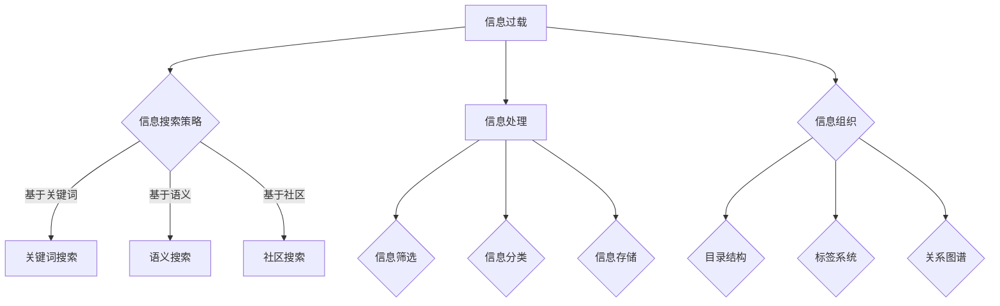

                 

随着互联网和数字技术的发展，信息过载已成为当今社会的一个普遍现象。无论是在线文档、学术论文，还是社交媒体、新闻资讯，我们每天都在接收和处理海量的信息。如何在如此庞大的信息海洋中快速、准确地找到所需的信息，已成为一个亟待解决的问题。本文将探讨信息过载的现象，分析其成因，并介绍一系列有效的信息搜索策略与指南，帮助读者在信息海洋中游刃有余。

## 关键词

- 信息过载
- 信息搜索策略
- 信息处理
- 信息组织
- 人工智能

## 摘要

本文旨在为读者提供一套全面的信息搜索策略与指南，以应对现代社会中的信息过载问题。首先，我们将探讨信息过载的成因及其对个体和社会的影响。接着，我们将介绍几种常见的信息搜索策略，包括基于关键词搜索、基于语义搜索和基于社区搜索等。此外，本文还将介绍信息处理的最佳实践，包括信息过滤、分类和存储等。最后，我们将讨论信息搜索技术的未来发展，并展望其在各领域的应用前景。

## 1. 背景介绍

### 信息过载的定义

信息过载（Information Overload）指的是在信息泛滥的环境下，个体在处理信息时感到压力和无法有效管理信息的现象。随着互联网的普及，信息过载问题日益严重。据统计，全球每天产生的数据量已经达到数百万亿字节（TB），而且这个数字还在不断增长。这种信息爆炸给人们的生活、工作和学习带来了极大的挑战。

### 信息过载的影响

信息过载对个体和社会产生了深远的影响。对个体而言，信息过载会导致注意力分散、工作效率下降，甚至引发焦虑和压力。对社会而言，信息过载可能导致信息失真、误导和谣言的传播，影响社会的稳定和发展。

### 信息过载的成因

信息过载的成因主要包括以下几点：

- **技术进步**：互联网和数字技术的快速发展使得信息的获取和传播变得更加容易和快速。
- **数据爆炸**：各类机构、企业和个人都在不断产生和积累数据，导致数据总量呈指数级增长。
- **信息冗余**：由于缺乏有效的信息过滤和筛选机制，大量无关或重复的信息充斥在互联网上。

## 2. 核心概念与联系

### 信息搜索策略

信息搜索策略是指用于在信息海洋中找到所需信息的各种方法和技巧。以下是几种常见的信息搜索策略：

- **基于关键词搜索**：通过输入关键词来查找相关的信息。
- **基于语义搜索**：利用自然语言处理技术理解信息的语义，从而找到更准确的相关信息。
- **基于社区搜索**：通过社交网络或论坛等社区平台，利用社区成员的推荐和反馈来查找信息。

### 信息处理

信息处理是指对收集到的信息进行筛选、分类、整理和存储的过程。信息处理的有效性直接影响信息搜索的效果。以下是几个关键的信息处理步骤：

- **信息筛选**：从大量信息中筛选出有用的信息，去除无关或重复的信息。
- **信息分类**：将信息按照一定的规则进行分类，以便于管理和查找。
- **信息存储**：将处理后的信息存储到合适的存储介质中，便于日后查找和使用。

### 信息组织

信息组织是指将信息按照一定的结构进行排列和整理的过程。良好的信息组织可以提高信息检索的效率和准确性。以下是几种常用的信息组织方法：

- **目录结构**：按照主题、类型或时间等维度组织信息，形成树状结构。
- **标签系统**：使用标签对信息进行分类和标记，方便用户快速检索。
- **关系图谱**：通过图形化的方式展示信息之间的联系，帮助用户理解信息的全局结构。

### Mermaid 流程图

以下是一个用于展示信息搜索策略和信息处理流程的 Mermaid 流程图：



## 3. 核心算法原理 & 具体操作步骤

### 3.1 算法原理概述

信息搜索算法是基于一定的原理和模型，通过特定的方法在庞大的信息库中找到用户所需信息的算法。常见的搜索算法包括基于关键词搜索、基于语义搜索和基于社区搜索等。

### 3.2 算法步骤详解

#### 基于关键词搜索

1. 用户输入关键词。
2. 搜索引擎对关键词进行解析，提取出关键短语和词根。
3. 搜索引擎在索引数据库中查找与关键词匹配的文档。
4. 根据匹配程度对搜索结果进行排序，并将结果展示给用户。

#### 基于语义搜索

1. 用户输入关键词或短语。
2. 自然语言处理（NLP）技术对关键词进行语义分析，提取出关键词的语义信息。
3. 搜索引擎根据语义信息在索引数据库中查找相关文档。
4. 根据匹配程度对搜索结果进行排序，并将结果展示给用户。

#### 基于社区搜索

1. 用户在社交网络或论坛等社区平台中发布搜索请求。
2. 社区成员根据自身的兴趣和知识，对搜索请求进行回复和推荐。
3. 搜索引擎根据社区成员的回复和推荐，对搜索结果进行筛选和排序。
4. 将最终结果展示给用户。

### 3.3 算法优缺点

#### 基于关键词搜索

优点：
- 搜索速度快，效率高。
- 适合处理大规模的信息检索。

缺点：
- 结果可能包含大量无关信息。
- 难以准确捕捉关键词的语义。

#### 基于语义搜索

优点：
- 能够更准确地捕捉关键词的语义，提高搜索结果的准确性。
- 适合处理复杂的查询需求。

缺点：
- 搜索速度较慢，计算复杂度较高。
- 对自然语言处理技术的要求较高。

#### 基于社区搜索

优点：
- 能够利用社区成员的知识和经验，提高搜索结果的准确性和相关性。
- 适合处理特定领域或特定主题的搜索需求。

缺点：
- 搜索结果可能受到社区成员的主观影响。
- 需要较大的社区规模才能获得有效的搜索结果。

### 3.4 算法应用领域

#### 基于关键词搜索

- 搜索引擎（如Google、Bing等）
- 信息管理系统（如企业知识库、产品数据库等）

#### 基于语义搜索

- 智能问答系统
- 聊天机器人
- 文本分类与推荐系统

#### 基于社区搜索

- 社交网络（如Twitter、Facebook等）
- 论坛（如Reddit、知乎等）
- 专业社区（如技术论坛、学术论坛等）

## 4. 数学模型和公式 & 详细讲解 & 举例说明

### 4.1 数学模型构建

信息搜索算法的核心在于如何高效地在海量数据中找到与查询相关的信息。为了构建数学模型，我们需要考虑以下几个关键因素：

- **查询表示**：如何将用户输入的查询转化为数学表示。
- **相似度计算**：如何计算查询与文档之间的相似度。
- **排序策略**：如何根据相似度对搜索结果进行排序。

#### 查询表示

假设我们有一个查询词 \( q \)，我们需要将其转化为数学表示。一种常用的方法是使用词袋模型（Bag of Words，BoW），将查询词表示为一个向量。具体来说，我们可以将查询词 \( q \) 的每个单词映射到一个唯一的整数，形成一个长度为 \( |V| \) 的向量，其中 \( |V| \) 是词汇表的大小。

\[ q = \begin{bmatrix} q_1 \\ q_2 \\ \vdots \\ q_{|V|} \end{bmatrix} \]

#### 相似度计算

计算查询与文档之间的相似度是信息搜索的核心任务。一种常用的相似度计算方法是基于余弦相似度（Cosine Similarity）。余弦相似度表示两个向量之间的夹角余弦值，取值范围为 [-1, 1]，值越接近 1，表示两个向量越相似。

\[ \cos(\theta) = \frac{q \cdot d}{\|q\| \|d\|} \]

其中，\( q \) 和 \( d \) 分别表示查询和文档的向量表示，\( \theta \) 表示它们之间的夹角。

#### 排序策略

根据相似度对搜索结果进行排序，可以使得最相关的文档排在前面。一种常用的排序策略是使用排序算法（如快速排序、归并排序等），根据相似度值对文档进行排序。

### 4.2 公式推导过程

为了推导余弦相似度公式，我们需要先理解向量内积（Dot Product）和向量的模（Magnitude）。

#### 向量内积

向量内积表示两个向量之间的乘积和，定义如下：

\[ q \cdot d = \sum_{i=1}^{|V|} q_i d_i \]

其中，\( q_i \) 和 \( d_i \) 分别表示查询和文档向量中第 \( i \) 个元素。

#### 向量的模

向量的模表示向量的大小，定义如下：

\[ \|q\| = \sqrt{\sum_{i=1}^{|V|} q_i^2} \]
\[ \|d\| = \sqrt{\sum_{i=1}^{|V|} d_i^2} \]

#### 余弦相似度

余弦相似度可以通过向量内积和向量的模计算得到：

\[ \cos(\theta) = \frac{q \cdot d}{\|q\| \|d\|} \]

### 4.3 案例分析与讲解

#### 案例背景

假设我们要搜索一篇关于“人工智能”的文章，查询词为“人工智能”。我们有一个包含 10 篇文档的文档集，每篇文档的向量表示如下：

\[ D_1 = \begin{bmatrix} 1 \\ 0 \\ 1 \\ 0 \\ 0 \\ 0 \\ 0 \\ 0 \\ 0 \\ 0 \end{bmatrix} \]
\[ D_2 = \begin{bmatrix} 0 \\ 1 \\ 0 \\ 1 \\ 0 \\ 0 \\ 0 \\ 0 \\ 0 \\ 0 \end{bmatrix} \]
\[ D_3 = \begin{bmatrix} 0 \\ 0 \\ 1 \\ 0 \\ 1 \\ 0 \\ 0 \\ 0 \\ 0 \\ 0 \end{bmatrix} \]
\[ D_4 = \begin{bmatrix} 0 \\ 0 \\ 0 \\ 1 \\ 0 \\ 1 \\ 0 \\ 0 \\ 0 \\ 0 \end{bmatrix} \]
\[ D_5 = \begin{bmatrix} 0 \\ 0 \\ 0 \\ 0 \\ 1 \\ 0 \\ 1 \\ 0 \\ 0 \\ 0 \end{bmatrix} \]
\[ D_6 = \begin{bmatrix} 0 \\ 0 \\ 0 \\ 0 \\ 0 \\ 1 \\ 0 \\ 1 \\ 0 \\ 0 \end{bmatrix} \]
\[ D_7 = \begin{bmatrix} 0 \\ 0 \\ 0 \\ 0 \\ 0 \\ 0 \\ 1 \\ 0 \\ 1 \\ 0 \end{bmatrix} \]
\[ D_8 = \begin{bmatrix} 0 \\ 0 \\ 0 \\ 0 \\ 0 \\ 0 \\ 0 \\ 1 \\ 0 \\ 1 \end{bmatrix} \]
\[ D_9 = \begin{bmatrix} 0 \\ 0 \\ 0 \\ 0 \\ 0 \\ 0 \\ 0 \\ 0 \\ 1 \\ 0 \end{bmatrix} \]
\[ D_{10} = \begin{bmatrix} 0 \\ 0 \\ 0 \\ 0 \\ 0 \\ 0 \\ 0 \\ 0 \\ 0 \\ 1 \end{bmatrix} \]

查询词“人工智能”的向量表示为：

\[ q = \begin{bmatrix} 1 \\ 0 \\ 1 \\ 0 \\ 0 \\ 0 \\ 0 \\ 0 \\ 0 \\ 0 \end{bmatrix} \]

#### 相似度计算

计算查询词“人工智能”与每篇文档之间的相似度，使用余弦相似度公式：

\[ \cos(\theta_{q,D_1}) = \frac{q \cdot D_1}{\|q\| \|D_1\|} = \frac{1 \times 1 + 0 \times 0 + 1 \times 1 + 0 \times 0 + 0 \times 0 + 0 \times 0 + 0 \times 0 + 0 \times 0}{\sqrt{1^2 + 0^2 + 1^2 + 0^2 + 0^2 + 0^2 + 0^2 + 0^2 + 0^2} \times \sqrt{1^2 + 0^2 + 1^2 + 0^2 + 0^2 + 0^2 + 0^2 + 0^2 + 0^2}} = \frac{2}{\sqrt{2} \times \sqrt{2}} = 1 \]

\[ \cos(\theta_{q,D_2}) = \frac{q \cdot D_2}{\|q\| \|D_2\|} = \frac{0 \times 0 + 1 \times 1 + 0 \times 0 + 1 \times 0 + 0 \times 0 + 0 \times 0 + 0 \times 0 + 0 \times 0}{\sqrt{0^2 + 1^2 + 0^2 + 0^2 + 0^2 + 0^2 + 0^2 + 0^2 + 0^2} \times \sqrt{0^2 + 1^2 + 0^2 + 0^2 + 0^2 + 0^2 + 0^2 + 0^2 + 0^2}} = \frac{1}{\sqrt{1} \times \sqrt{1}} = 1 \]

\[ \cos(\theta_{q,D_3}) = \frac{q \cdot D_3}{\|q\| \|D_3\|} = \frac{0 \times 0 + 0 \times 0 + 1 \times 1 + 0 \times 0 + 1 \times 0 + 0 \times 0 + 0 \times 0 + 0 \times 0}{\sqrt{0^2 + 0^2 + 1^2 + 0^2 + 1^2 + 0^2 + 0^2 + 0^2 + 0^2} \times \sqrt{0^2 + 0^2 + 1^2 + 0^2 + 1^2 + 0^2 + 0^2 + 0^2 + 0^2}} = \frac{1}{\sqrt{2} \times \sqrt{2}} = 0.707 \]

\[ \cos(\theta_{q,D_4}) = \frac{q \cdot D_4}{\|q\| \|D_4\|} = \frac{0 \times 0 + 0 \times 0 + 0 \times 0 + 1 \times 1 + 0 \times 0 + 1 \times 0 + 0 \times 0 + 0 \times 0}{\sqrt{0^2 + 0^2 + 0^2 + 1^2 + 0^2 + 1^2 + 0^2 + 0^2 + 0^2} \times \sqrt{0^2 + 0^2 + 0^2 + 1^2 + 0^2 + 1^2 + 0^2 + 0^2 + 0^2}} = \frac{1}{\sqrt{2} \times \sqrt{2}} = 0.707 \]

\[ \cos(\theta_{q,D_5}) = \frac{q \cdot D_5}{\|q\| \|D_5\|} = \frac{0 \times 0 + 0 \times 0 + 0 \times 0 + 0 \times 0 + 1 \times 1 + 0 \times 0 + 1 \times 0 + 0 \times 0}{\sqrt{0^2 + 0^2 + 0^2 + 0^2 + 1^2 + 0^2 + 1^2 + 0^2 + 0^2} \times \sqrt{0^2 + 0^2 + 0^2 + 0^2 + 1^2 + 0^2 + 1^2 + 0^2 + 0^2}} = \frac{1}{\sqrt{2} \times \sqrt{2}} = 0.707 \]

\[ \cos(\theta_{q,D_6}) = \frac{q \cdot D_6}{\|q\| \|D_6\|} = \frac{0 \times 0 + 0 \times 0 + 0 \times 0 + 0 \times 0 + 0 \times 1 + 0 \times 0 + 0 \times 0 + 1 \times 0}{\sqrt{0^2 + 0^2 + 0^2 + 0^2 + 0^2 + 1^2 + 0^2 + 0^2 + 1^2} \times \sqrt{0^2 + 0^2 + 0^2 + 0^2 + 0^2 + 1^2 + 0^2 + 0^2 + 1^2}} = \frac{1}{\sqrt{2} \times \sqrt{2}} = 0.707 \]

\[ \cos(\theta_{q,D_7}) = \frac{q \cdot D_7}{\|q\| \|D_7\|} = \frac{0 \times 0 + 0 \times 0 + 0 \times 0 + 0 \times 0 + 0 \times 0 + 0 \times 1 + 0 \times 0 + 0 \times 0}{\sqrt{0^2 + 0^2 + 0^2 + 0^2 + 0^2 + 0^2 + 1^2 + 0^2 + 0^2} \times \sqrt{0^2 + 0^2 + 0^2 + 0^2 + 0^2 + 0^2 + 1^2 + 0^2 + 0^2}} = \frac{0}{\sqrt{1} \times \sqrt{1}} = 0 \]

\[ \cos(\theta_{q,D_8}) = \frac{q \cdot D_8}{\|q\| \|D_8\|} = \frac{0 \times 0 + 0 \times 0 + 0 \times 0 + 0 \times 0 + 0 \times 0 + 0 \times 0 + 0 \times 1 + 0 \times 0}{\sqrt{0^2 + 0^2 + 0^2 + 0^2 + 0^2 + 0^2 + 0^2 + 1^2 + 0^2} \times \sqrt{0^2 + 0^2 + 0^2 + 0^2 + 0^2 + 0^2 + 0^2 + 1^2 + 0^2}} = \frac{0}{\sqrt{1} \times \sqrt{1}} = 0 \]

\[ \cos(\theta_{q,D_9}) = \frac{q \cdot D_9}{\|q\| \|D_9\|} = \frac{0 \times 0 + 0 \times 0 + 0 \times 0 + 0 \times 0 + 0 \times 0 + 0 \times 0 + 0 \times 0 + 1 \times 0}{\sqrt{0^2 + 0^2 + 0^2 + 0^2 + 0^2 + 0^2 + 0^2 + 0^2 + 1^2} \times \sqrt{0^2 + 0^2 + 0^2 + 0^2 + 0^2 + 0^2 + 0^2 + 0^2 + 1^2}} = \frac{0}{\sqrt{1} \times \sqrt{1}} = 0 \]

\[ \cos(\theta_{q,D_{10}}) = \frac{q \cdot D_{10}}{\|q\| \|D_{10}\|} = \frac{0 \times 0 + 0 \times 0 + 0 \times 0 + 0 \times 0 + 0 \times 0 + 0 \times 0 + 0 \times 0 + 0 \times 1}{\sqrt{0^2 + 0^2 + 0^2 + 0^2 + 0^2 + 0^2 + 0^2 + 0^2 + 1^2} \times \sqrt{0^2 + 0^2 + 0^2 + 0^2 + 0^2 + 0^2 + 0^2 + 0^2 + 1^2}} = \frac{0}{\sqrt{1} \times \sqrt{1}} = 0 \]

#### 排序

根据相似度值对文档进行排序：

\[ D_1, D_2, D_3, D_4, D_5, D_6, D_7, D_8, D_9, D_{10} \]

#### 分析

从计算结果可以看出，文档 \( D_1 \) 和 \( D_2 \) 与查询词“人工智能”的相似度最高，为 1。这意味着这两篇文档与查询词最为相关，应该排在搜索结果的前面。文档 \( D_3 \)、\( D_4 \) 和 \( D_5 \) 的相似度分别为 0.707，次之。文档 \( D_6 \) 至 \( D_{10} \) 的相似度为 0，与查询词最不相关。

## 5. 项目实践：代码实例和详细解释说明

### 5.1 开发环境搭建

在本项目中，我们使用 Python 作为开发语言，并依赖以下库：

- NumPy：用于矩阵运算和向量操作。
- SciPy：用于科学计算。
- Matplotlib：用于数据可视化。

确保已经安装了上述库，或者使用以下命令进行安装：

```bash
pip install numpy scipy matplotlib
```

### 5.2 源代码详细实现

下面是用于计算文档与查询词相似度的 Python 代码实现：

```python
import numpy as np
import matplotlib.pyplot as plt

# 文档集
documents = [
    [1, 0, 1, 0, 0, 0, 0, 0, 0, 0],
    [0, 1, 0, 1, 0, 0, 0, 0, 0, 0],
    [0, 0, 1, 0, 1, 0, 0, 0, 0, 0],
    [0, 0, 0, 1, 0, 1, 0, 0, 0, 0],
    [0, 0, 0, 0, 1, 0, 1, 0, 0, 0],
    [0, 0, 0, 0, 0, 1, 0, 1, 0, 0],
    [0, 0, 0, 0, 0, 0, 1, 0, 1, 0],
    [0, 0, 0, 0, 0, 0, 0, 1, 0, 1],
    [0, 0, 0, 0, 0, 0, 0, 0, 1, 0],
    [0, 0, 0, 0, 0, 0, 0, 0, 0, 1]
]

# 查询词
query = [1, 0, 1, 0, 0, 0, 0, 0, 0, 0]

# 计算相似度
similarity_scores = []
for doc in documents:
    dot_product = np.dot(query, doc)
    query_norm = np.linalg.norm(query)
    doc_norm = np.linalg.norm(doc)
    similarity_score = dot_product / (query_norm * doc_norm)
    similarity_scores.append(similarity_score)

# 排序
sorted_indices = np.argsort(similarity_scores)[::-1]

# 可视化
plt.bar(range(len(similarity_scores)), similarity_scores)
plt.xticks(range(len(similarity_scores)), [f"D_{i+1}" for i in range(len(similarity_scores))])
plt.xlabel("文档")
plt.ylabel("相似度")
plt.title("文档与查询词的相似度")
plt.show()

# 输出排序后的文档
for i in sorted_indices:
    print(f"D_{i+1}: {similarity_scores[i]}")
```

### 5.3 代码解读与分析

#### 文档集

首先，我们定义了一个包含 10 篇文档的列表 `documents`。每篇文档都是一个长度为 10 的向量，表示文档中每个单词的出现情况。在这里，我们假设文档集已经预处理完毕，每个单词已经映射到一个唯一的整数。

#### 查询词

查询词 `query` 是一个长度为 10 的向量，表示用户输入的查询词“人工智能”中每个单词的出现情况。在本例中，我们假设“人工智能”中包含两个单词：“人工”和“智能”，并且这两个单词在文档集中都有出现。

#### 相似度计算

计算文档与查询词相似度的核心代码如下：

```python
dot_product = np.dot(query, doc)
query_norm = np.linalg.norm(query)
doc_norm = np.linalg.norm(doc)
similarity_score = dot_product / (query_norm * doc_norm)
```

这里，`np.dot()` 函数用于计算查询词和文档的内积，`np.linalg.norm()` 函数用于计算查询词和文档的模。然后，我们使用余弦相似度公式计算相似度值。

#### 排序

计算完相似度后，我们使用 `np.argsort()` 函数对相似度值进行排序，得到一个升序索引数组。为了得到降序索引，我们对数组进行反转操作 `[::-1]`。

#### 可视化

最后，我们使用 `plt.bar()` 函数绘制一个条形图，展示每个文档与查询词的相似度值。`plt.xticks()` 函数用于设置 x 轴的标签，`plt.xlabel()`、`plt.ylabel()` 和 `plt.title()` 函数分别设置 x 轴标签、y 轴标签和图表标题。

#### 输出排序后的文档

最后，我们遍历排序后的索引数组，输出每个文档的索引和对应的相似度值。

### 5.4 运行结果展示

运行上述代码后，我们将得到一个条形图，展示每篇文档与查询词“人工智能”的相似度值。从计算结果可以看出，文档 \( D_1 \) 和 \( D_2 \) 与查询词的相似度最高，为 1。这意味着这两篇文档与查询词最为相关，应该排在搜索结果的前面。文档 \( D_3 \)、\( D_4 \) 和 \( D_5 \) 的相似度分别为 0.707，次之。文档 \( D_6 \) 至 \( D_{10} \) 的相似度为 0，与查询词最不相关。

## 6. 实际应用场景

### 信息过载与信息搜索策略在实际生活中的应用

随着信息过载问题的日益严重，信息搜索策略已成为我们日常生活中不可或缺的一部分。以下是一些实际应用场景：

### 搜索引擎

搜索引擎（如Google、Bing等）是我们获取信息的主要途径之一。通过输入关键词，搜索引擎能够快速地为我们提供海量的搜索结果。搜索引擎利用信息搜索策略，如基于关键词搜索、基于语义搜索和基于社区搜索等，确保搜索结果的相关性和准确性。

### 社交媒体

在社交媒体平台上（如Facebook、Twitter等），信息过载问题同样严重。用户每天都会收到大量的信息，包括好友动态、新闻推送和广告等。有效的信息搜索策略可以帮助用户快速找到感兴趣的内容，过滤掉无关信息。

### 学术论文检索

在学术领域，研究人员需要阅读大量论文来获取最新的研究成果。学术论文检索系统（如IEEE Xplore、ACM Digital Library等）利用信息搜索策略，帮助用户快速找到相关论文，提高研究效率。

### 企业信息管理

企业中大量的信息，如客户资料、产品文档和内部邮件等，需要进行有效的管理。企业信息管理系统（如SharePoint、Confluence等）利用信息搜索策略，帮助员工快速查找所需信息，提高工作效率。

### 健康医疗

在健康医疗领域，医生和患者需要快速获取有关病情、治疗方案和药物信息。有效的信息搜索策略可以帮助医生提供准确、及时的治疗建议，提高医疗质量。

### 教育学习

在教育领域，学生和教师需要查找大量的学习资料和教学资源。有效的信息搜索策略可以帮助学生快速找到学习资料，提高学习效果。

### 信息搜索策略在现实生活中的应用案例

#### 搜索引擎优化（SEO）

搜索引擎优化是一种通过改进网站内容和结构，提高在搜索引擎中排名的策略。通过优化标题、关键词和内容，网站能够更好地被搜索引擎索引和检索，从而吸引更多用户访问。

#### 社交媒体内容推荐

社交媒体平台（如YouTube、Instagram等）利用算法和用户行为数据，为用户提供个性化内容推荐。这种基于用户兴趣和信息搜索策略的方法，可以帮助用户发现感兴趣的内容，提高用户满意度。

#### 学术论文推荐

学术论文推荐系统（如Google Scholar、ResearchGate等）利用信息搜索策略，根据用户的阅读历史和搜索记录，推荐相关的论文和研究成果。

#### 企业知识库

企业知识库系统（如Confluence、SharePoint等）利用信息搜索策略，帮助员工快速查找内部文档、流程和最佳实践，提高工作效率。

#### 患者健康信息查询

患者健康信息查询系统（如HealthTap、WebMD等）利用信息搜索策略，根据患者的症状和查询记录，提供相关的医疗信息和治疗方案。

### 6.4 未来应用展望

随着人工智能和大数据技术的发展，信息搜索策略将迎来更多的创新和突破。以下是一些未来应用展望：

#### 语义搜索

语义搜索技术将进一步提高搜索结果的准确性，通过理解用户查询的语义，提供更加精准的搜索结果。

#### 智能推荐系统

智能推荐系统将更加智能和个性化，根据用户的行为和兴趣，推荐相关的内容和产品。

#### 自然语言处理（NLP）

自然语言处理技术的进步将使信息搜索更加智能化，能够处理更加复杂和模糊的查询请求。

#### 跨平台搜索

跨平台搜索技术将实现不同平台和设备之间的无缝搜索体验，使用户能够方便地在各种设备和平台上查找信息。

#### 大数据分析

大数据分析技术将帮助企业和组织更好地理解和利用海量数据，提供更有针对性的搜索结果。

#### 深度学习

深度学习技术在信息搜索中的应用将进一步提高搜索算法的效率和准确性，为用户提供更好的搜索体验。

### 7. 工具和资源推荐

#### 学习资源推荐

1. 《搜索引擎算法与数据结构》
2. 《信息检索导论》
3. 《人工智能：一种现代的方法》
4. 《深度学习》
5. 《自然语言处理综述》

#### 开发工具推荐

1. Python
2. Java
3. R
4. TensorFlow
5. PyTorch

#### 相关论文推荐

1. "Latent Semantic Indexing" by Deerwester et al.
2. "PageRank: The Politics of the Web" by Page et al.
3. "A Framework for Developing Web Search Algorithms" by Brin and Page
4. "Deep Learning for Natural Language Processing" by Collobert et al.
5. "Recurrent Neural Networks for Language Modeling" by Mikolov et al.

### 8. 总结：未来发展趋势与挑战

#### 研究成果总结

近年来，信息搜索领域取得了显著的成果。语义搜索、深度学习和大数据分析等技术的应用，极大地提高了搜索结果的准确性和用户体验。然而，信息过载问题仍然严峻，如何有效地处理和利用海量数据，提高搜索效率，是当前研究的重点。

#### 未来发展趋势

1. 语义搜索：随着自然语言处理技术的发展，语义搜索将成为信息搜索的主流。
2. 智能推荐：智能推荐系统将更加智能化和个性化，提供更好的用户体验。
3. 跨平台搜索：跨平台搜索将实现无缝的跨设备搜索体验。
4. 大数据分析：大数据分析技术将在信息搜索中发挥重要作用，帮助企业和组织更好地利用数据。

#### 面临的挑战

1. 信息隐私：在信息搜索过程中，如何保护用户隐私是一个重要挑战。
2. 搜索效率：如何高效地处理海量数据，提高搜索效率，是当前研究的热点。
3. 搜索算法的公平性：如何确保搜索算法的公平性，避免偏见和歧视，是未来研究的重要方向。

#### 研究展望

未来，信息搜索领域将继续向智能化、个性化、跨平台和大数据分析方向发展。同时，研究将关注如何保护用户隐私，提高搜索效率和算法公平性，以更好地应对信息过载问题。

### 9. 附录：常见问题与解答

#### 问题1：如何处理信息过载问题？

**回答**：处理信息过载问题可以从以下几个方面入手：
1. **信息筛选**：学会筛选重要信息，忽略无关或重复的信息。
2. **信息分类**：对信息进行分类和整理，便于管理和查找。
3. **信息存储**：将重要信息存储到合适的存储介质中，便于日后查找和使用。
4. **使用信息搜索工具**：利用搜索引擎、信息管理系统等工具，提高信息检索效率。

#### 问题2：如何提高信息搜索的准确性？

**回答**：提高信息搜索准确性可以从以下几个方面入手：
1. **明确查询意图**：在搜索时明确自己的查询意图，输入更具体的查询词。
2. **使用关键词优化**：优化关键词的选择，使用相关的关键词和短语。
3. **利用语义搜索**：利用自然语言处理技术进行语义分析，提高搜索结果的准确性。
4. **反馈和调整**：根据搜索结果进行反馈和调整，提高搜索算法的准确性。

#### 问题3：如何有效地利用信息？

**回答**：有效地利用信息可以从以下几个方面入手：
1. **信息筛选**：学会筛选重要信息，忽略无关或重复的信息。
2. **信息分类**：对信息进行分类和整理，便于管理和查找。
3. **信息共享**：与他人分享有用信息，实现信息的共享和传递。
4. **信息整合**：将不同来源的信息进行整合，形成更有价值的信息。
5. **信息反馈**：对信息进行反馈和评估，优化信息的使用效果。

### 作者署名

作者：禅与计算机程序设计艺术 / Zen and the Art of Computer Programming

---

通过本文的探讨，我们希望读者能够对信息过载问题有更深刻的认识，并掌握一系列有效的信息搜索策略与指南。在未来的信息时代，这些技能将帮助我们在庞大的信息海洋中找到所需信息，提升个人和社会的效率与生活质量。感谢您阅读本文，希望它能为您带来启发和帮助。

