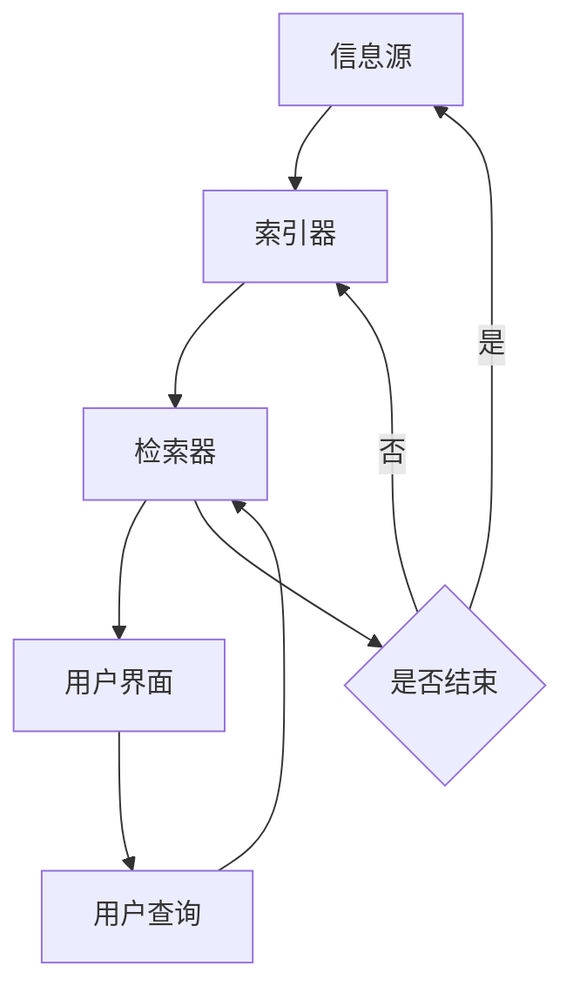

                 

### 背景介绍

在当今数字化时代，信息的获取已经变得前所未有的快捷和便利。然而，这种便利也带来了一个全新的挑战：信息过载。每天，大量的数据和信息以各种形式涌现，从新闻报道、社交媒体更新到电子邮件和在线文档，它们充斥着我们的工作和生活。这种信息爆炸的现象，使得人们难以从中筛选出真正有价值的内容。

信息过载不仅影响了我们的工作效率，还可能导致焦虑和决策困难。当我们试图在海量信息中找到所需内容时，往往会感到力不从心。传统的搜索方法，如关键词搜索和分类导航，已经无法满足日益增长的信息需求。因此，如何有效地进行信息搜索，已经成为一个迫切需要解决的问题。

本文将探讨信息过载的背景及其带来的挑战，介绍几种核心的信息搜索算法原理，分析这些算法的优缺点，并探讨其应用领域。接着，我们将讨论数学模型和公式在信息搜索中的作用，并通过具体案例进行分析。随后，文章将提供一个项目实践的代码实例，展示信息搜索的实现过程。最后，我们将讨论信息搜索在实际应用场景中的重要性，并提出未来应用的展望。

本文旨在为读者提供一个全面而深入的理解，帮助他们在信息海洋中找到真正需要的东西。无论是普通用户还是专业研究者，本文都将提供实用的方法和策略。

### 文章关键词

- 信息过载
- 信息搜索
- 算法原理
- 数学模型
- 应用领域
- 项目实践

### 文章摘要

本文深入探讨了信息过载带来的挑战以及如何有效地进行信息搜索。首先，我们介绍了信息过载的背景和影响，并探讨了信息搜索的重要性。接着，文章详细介绍了核心信息搜索算法的原理、优缺点和应用领域。随后，通过数学模型和公式的推导，展示了其在信息搜索中的关键作用。文章通过一个实际项目实例，展示了信息搜索的实现过程。最后，我们讨论了信息搜索在实际应用场景中的重要性，并展望了未来的发展方向。

## 1. 背景介绍

### 信息过载的定义与影响

信息过载是指人们在日常工作和生活中所接触到的大量信息超过其处理能力，导致难以有效筛选和利用这些信息的现象。在数字化时代，信息过载已成为普遍存在的问题。根据一项研究，平均每个成年人每天会接收约100,000条信息，这些信息来自各种渠道，包括电子邮件、社交媒体、新闻报道、手机通知等。这些信息不仅种类繁多，而且数量巨大，极大地增加了人们的信息处理压力。

信息过载对个人和社会产生了深远的影响。对个人而言，信息过载可能导致以下几方面的问题：

1. **心理压力增加**：面对大量信息，人们往往感到焦虑和不安，特别是在需要快速做出决策时，这种压力会进一步加剧。
2. **工作效率下降**：过多的信息分散了人们的注意力，导致工作效率下降，甚至无法完成日常任务。
3. **信息疲劳**：长时间接收和处理大量信息，人们可能会感到疲劳，甚至对信息产生抵触情绪。
4. **决策困难**：在信息过载的环境下，人们难以从众多信息中筛选出有价值的内容，从而影响决策的质量。

对社会而言，信息过载也带来了一系列挑战：

1. **信息泡沫**：人们倾向于接收与自己观点相似的信息，导致信息环境逐渐同质化，形成信息泡沫，阻碍了多样化的观点交流和思想碰撞。
2. **知识贬值**：由于信息爆炸，知识的更新速度加快，导致某些领域的知识迅速贬值，人们需要不断学习新的信息来跟上时代的步伐。
3. **社交疏离**：信息过载使得人们更倾向于独自处理信息，减少了面对面的交流和互动，可能导致社交疏离感的增加。

### 数字化时代的特征

数字化时代的主要特征包括：

1. **数据量爆发式增长**：随着互联网的普及和大数据技术的发展，数据量呈现爆发式增长。据统计，全球数据量每两年就会翻一番。
2. **信息传播速度快**：信息的传播速度大大加快，一条新闻或热点事件可以在几分钟内传遍全球。
3. **信息形式多样化**：信息的形式越来越多样化，包括文本、图像、音频、视频等多种类型。
4. **智能设备的普及**：智能手机、平板电脑等智能设备的普及，使得人们可以随时随地获取信息，进一步加剧了信息过载的问题。

### 信息搜索的挑战

在信息过载的背景下，如何有效地进行信息搜索成为一个重要挑战。传统的搜索方法，如基于关键词的搜索和分类导航，已经无法满足日益增长的信息需求。以下是一些主要挑战：

1. **信息冗余**：海量的信息中，有很多是重复或无关的内容，增加了搜索的难度。
2. **多源异构数据**：不同来源的数据结构不同，增加了信息整合和处理的复杂性。
3. **实时性要求**：某些应用场景要求实时搜索，如金融交易、实时新闻推送等，对搜索系统提出了更高的性能要求。
4. **个性化需求**：不同用户对信息的偏好和需求不同，需要提供个性化的搜索结果。

面对这些挑战，开发新的信息搜索技术和算法成为当务之急。接下来，本文将介绍几种核心的信息搜索算法，分析其原理和优缺点，为解决信息过载提供有效的策略。

### 1.1. 信息搜索的基本概念与原理

信息搜索是指通过特定的算法和技术，从海量数据中快速定位和获取用户所需信息的过程。其基本概念包括：

- **搜索目标**：用户希望获取的信息内容。
- **搜索空间**：所有可能的信息集合。
- **搜索策略**：从搜索空间中选择和定位信息的算法。

信息搜索的核心原理可以概括为以下几个步骤：

1. **信息收集**：从各种数据源收集信息，包括文本、图像、音频等。
2. **信息预处理**：对收集到的信息进行清洗、去重、格式转换等预处理，以便后续处理。
3. **信息索引**：建立索引，将信息与关键字或分类关联，以便快速检索。
4. **信息查询**：根据用户输入的查询条件，从索引中快速查找匹配的信息。
5. **结果排序**：对查询结果进行排序，根据相关性、重要性等指标，将最相关的信息排在前面。

### 1.2. 信息搜索的重要性和应用领域

信息搜索在现代社会中具有极其重要的地位。它不仅影响了个人的工作效率和生活质量，还在多个领域发挥着关键作用：

1. **互联网搜索**：搜索引擎如Google、Bing等，已经成为人们获取信息的主要途径。通过高效的信息搜索，用户可以快速找到所需的网页、新闻、学术论文等。
2. **电子商务**：电商平台如Amazon、阿里巴巴等，利用信息搜索技术，帮助用户从海量商品中找到符合需求的产品。
3. **社交媒体**：社交媒体平台如Facebook、Twitter等，通过信息搜索技术，允许用户查找朋友、关注话题、查看新闻等。
4. **医疗健康**：医疗信息系统利用信息搜索技术，帮助医生快速查找病例、研究文献等，提高诊断和治疗效率。
5. **科学研究**：科研人员通过信息搜索，可以快速获取相关的研究成果、文献资料等，加速科研进程。

总之，信息搜索技术不仅提升了信息获取的效率，还为各行各业带来了巨大的变革和进步。

## 2. 核心概念与联系

### 2.1. 信息检索与信息搜索

在深入探讨信息搜索之前，有必要明确“信息检索”与“信息搜索”这两个概念的区别和联系。

**信息检索**（Information Retrieval, IR）是指从大量信息中检索出满足特定需求的信息的过程。它包括信息收集、预处理、索引建立和查询处理等步骤。信息检索侧重于技术的实现和优化，旨在提高检索效率和准确性。

**信息搜索**（Information Search）则更加侧重于用户的行为和心理。它是指用户在信息海洋中寻找特定信息的过程，涉及到信息需求分析、搜索策略选择、结果评估等多个方面。信息搜索不仅仅是一个技术问题，更是一个用户交互和心理体验的问题。

虽然信息检索和信息搜索有所不同，但它们是密切相关的。信息检索是实现信息搜索的基础，而信息搜索的目标是提高用户在检索过程中的体验和满意度。

### 2.2. 信息检索的基本组件

信息检索系统通常由以下几个基本组件构成：

1. **信息源**：信息检索系统的信息来源，包括网页、数据库、图书、期刊、社交媒体等。
2. **索引器**：对原始信息进行预处理，建立索引，以便快速检索。索引器的主要任务包括分词、去停用词、词干提取、倒排索引构建等。
3. **检索器**：根据用户查询，从索引中检索出匹配的信息。检索器通常采用各种检索算法，如布尔检索、向量空间模型、概率检索等。
4. **用户界面**：提供给用户的交互界面，用于输入查询、显示搜索结果等。

### 2.3. 信息搜索算法的核心原理

信息搜索算法是信息检索系统的核心。以下介绍几种核心的信息搜索算法及其原理：

1. **布尔检索**（Boolean Retrieval）：
   布尔检索是最简单和最常用的检索方法之一。它基于布尔逻辑运算（AND、OR、NOT），允许用户组合多个关键词进行检索。例如，查询“人工智能 AND 学习”，系统将返回同时包含“人工智能”和“学习”这两个关键词的文档。

2. **向量空间模型**（Vector Space Model, VSM）：
   向量空间模型将文本表示为向量，每个维度对应一个关键词。查询和文档都转换为向量后，通过计算它们之间的相似度来确定匹配程度。常用的相似度计算方法包括余弦相似度、欧氏距离等。

3. **概率检索**（Probabilistic Retrieval）：
   概率检索基于概率论原理，通过计算查询和文档之间的概率匹配度来评估相关性。该方法通常使用隐马尔可夫模型（HMM）或贝叶斯理论来建模。

4. **深度学习检索**（Deep Learning Retrieval）：
   深度学习检索利用神经网络，尤其是深度卷积神经网络（CNN）和循环神经网络（RNN），对文本进行语义表示和匹配。这种方法能够更好地理解文本的深层含义，提高检索的准确性和效率。

### 2.4. Mermaid 流程图

为了更直观地展示信息检索和搜索算法的工作流程，我们使用Mermaid流程图来描述。



在上面的流程图中，信息源（A）提供原始数据，经过索引器（B）预处理后，存储在索引中。检索器（C）根据用户查询（E）从索引中检索出匹配的文档，并通过用户界面（D）展示给用户。用户可以选择是否继续查询，如果选择继续，流程回到索引器，否则结束。

通过这一节的内容，我们为读者提供了一个关于信息检索和信息搜索的基本概念框架，为后续章节的深入讨论奠定了基础。在接下来的章节中，我们将详细探讨这些算法的原理、操作步骤和具体应用。

### 2.5. 核心算法原理 & 具体操作步骤

#### 2.5.1. 算法原理概述

在信息搜索领域，有许多算法被广泛研究和应用。以下是几种核心算法的原理概述，这些算法在信息检索中扮演着关键角色：

1. **布尔检索算法**：
   布尔检索算法是最基础的检索算法之一，基于布尔逻辑运算（AND、OR、NOT）。它通过将用户的查询条件转换为布尔表达式，从索引库中检索出满足条件的文档。布尔检索算法简单高效，但灵活性较低，无法很好地处理复杂查询。

2. **向量空间模型**：
   向量空间模型将文档和查询表示为高维向量，通过计算向量之间的相似度（如余弦相似度）来评估文档与查询的相关性。向量空间模型具有较强的扩展性和灵活性，能够处理复杂的查询和复杂数据。

3. **概率检索算法**：
   概率检索算法基于概率论原理，通过计算查询和文档之间的概率匹配度来评估相关性。常见的方法包括贝叶斯模型和隐马尔可夫模型（HMM）。概率检索算法能够处理不确定性和噪声数据，但计算复杂度较高。

4. **深度学习检索算法**：
   深度学习检索算法利用神经网络，特别是深度卷积神经网络（CNN）和循环神经网络（RNN），对文本进行语义表示和匹配。这种方法能够捕捉文本的深层语义信息，提高检索的准确性和效率。

#### 2.5.2. 算法步骤详解

下面，我们详细描述上述算法的具体操作步骤：

1. **布尔检索算法**：

   - 步骤1：用户输入查询条件，如“人工智能 AND 学习”。
   - 步骤2：将查询条件转换为布尔表达式，如“(人工智能 AND 学习)”。
   - 步骤3：从索引库中检索包含“人工智能”和“学习”的文档。
   - 步骤4：对检索结果进行排序，通常按照文档的相关性排序。

2. **向量空间模型**：

   - 步骤1：将文档表示为向量。对于每个文档，将每个单词作为特征，构建一个特征向量。
   - 步骤2：将查询表示为向量，方法同上。
   - 步骤3：计算查询向量与每个文档向量之间的相似度，如余弦相似度。
   - 步骤4：对相似度进行排序，选择相似度最高的文档作为检索结果。

3. **概率检索算法**：

   - 步骤1：建立概率模型，如贝叶斯模型或HMM。
   - 步骤2：计算查询和文档在概率模型下的匹配概率。
   - 步骤3：对匹配概率进行排序，选择概率最高的文档作为检索结果。

4. **深度学习检索算法**：

   - 步骤1：使用深度学习模型（如CNN或RNN）对文档和查询进行编码，得到语义表示。
   - 步骤2：计算语义表示之间的相似度，如使用余弦相似度或点积。
   - 步骤3：对相似度进行排序，选择相似度最高的文档作为检索结果。

#### 2.5.3. 算法优缺点

每种算法都有其独特的优势和局限性，以下是这些算法的主要优缺点：

1. **布尔检索算法**：

   - 优点：简单易实现，计算效率高。
   - 缺点：灵活性较低，无法处理复杂查询。

2. **向量空间模型**：

   - 优点：扩展性强，能够处理复杂数据和复杂查询。
   - 缺点：对稀疏数据效果较差，需要大量计算资源。

3. **概率检索算法**：

   - 优点：能够处理不确定性和噪声数据。
   - 缺点：计算复杂度较高，对模型依赖性强。

4. **深度学习检索算法**：

   - 优点：能够捕捉文本的深层语义信息，提高检索准确性和效率。
   - 缺点：需要大量训练数据和计算资源，模型调参复杂。

#### 2.5.4. 算法应用领域

这些算法在信息检索的各个应用领域都有广泛的应用：

- **互联网搜索**：布尔检索算法和向量空间模型是搜索引擎的核心技术。
- **电子商务**：概率检索算法和深度学习检索算法用于商品推荐和搜索优化。
- **社交媒体**：深度学习检索算法用于内容推荐和话题挖掘。
- **医疗健康**：概率检索算法和深度学习检索算法用于医学文献检索和病例分析。

通过以上对核心算法原理和具体操作步骤的详细描述，我们为读者提供了一个全面而深入的理解，帮助他们在信息海洋中找到真正需要的东西。

### 2.6. 算法优缺点分析

#### 2.6.1. 布尔检索算法

**优点**：

1. **简单易用**：布尔检索算法基于简单的布尔逻辑运算，用户可以轻松理解和使用。
2. **高效性**：由于布尔检索算法的计算过程相对简单，它可以快速地处理大量数据。
3. **灵活性**：布尔检索算法支持复杂的查询，如多条件组合查询，可以满足多种搜索需求。

**缺点**：

1. **语义理解不足**：布尔检索算法无法理解查询和文档之间的语义关系，可能导致漏检和误检。
2. **扩展性有限**：在处理复杂数据或大规模数据时，布尔检索算法的表现可能会受到影响，无法很好地适应复杂查询。

**适用场景**：

- **快速检索**：适用于对检索速度要求较高，但对语义理解要求不高的场景。
- **基础搜索**：在搜索引擎的早期阶段或小型系统中，布尔检索算法是一种很好的选择。

#### 2.6.2. 向量空间模型

**优点**：

1. **语义理解能力**：向量空间模型通过计算向量之间的相似度，可以较好地理解查询和文档的语义关系。
2. **扩展性强**：向量空间模型能够处理复杂数据和多维度信息，适用于多种应用场景。
3. **算法灵活性**：向量空间模型可以结合多种相似度计算方法，如余弦相似度和欧氏距离，提高检索效果。

**缺点**：

1. **对稀疏数据敏感**：向量空间模型在高维稀疏数据上的表现较差，可能降低检索准确性。
2. **计算复杂度高**：向量空间模型需要大量的计算资源，特别是在处理大规模数据时。

**适用场景**：

- **文本检索**：广泛应用于文本检索系统，如搜索引擎和内容管理系统。
- **推荐系统**：用于基于文本的推荐系统，如商品推荐和内容推荐。

#### 2.6.3. 概率检索算法

**优点**：

1. **处理不确定性**：概率检索算法能够处理不确定性和噪声数据，提高检索鲁棒性。
2. **适应性强**：概率检索算法可以根据不同场景调整模型参数，适应多种应用需求。
3. **计算效率较高**：与深度学习检索算法相比，概率检索算法的计算复杂度较低，计算速度更快。

**缺点**：

1. **对模型依赖性强**：概率检索算法的性能高度依赖于模型的选择和参数设置，需要专业知识进行调整。
2. **精度有限**：在处理复杂查询和深层语义理解方面，概率检索算法的表现可能不如深度学习检索算法。

**适用场景**：

- **信息检索**：广泛应用于各种信息检索系统，如文献检索和医疗信息检索。
- **自然语言处理**：用于自然语言处理任务，如文本分类和命名实体识别。

#### 2.6.4. 深度学习检索算法

**优点**：

1. **语义理解能力强**：深度学习检索算法能够捕捉文本的深层语义信息，提高检索的准确性和效率。
2. **自适应性强**：深度学习模型可以通过大量数据自动调整参数，适应不同的应用场景。
3. **适用范围广**：深度学习检索算法可以应用于多种文本检索任务，如问答系统、文本匹配和内容推荐。

**缺点**：

1. **计算资源需求高**：深度学习检索算法需要大量的计算资源和数据，特别是在训练阶段。
2. **调参复杂**：深度学习模型的调参过程复杂，需要专业知识和经验。

**适用场景**：

- **高级搜索**：适用于需要高级语义理解和复杂查询处理的搜索任务，如学术搜索引擎和智能问答系统。
- **推荐系统**：用于基于文本的推荐系统，如新闻推荐和商品推荐。

通过以上对四种核心算法优缺点的分析，我们可以更清楚地了解每种算法的优势和局限性，从而在具体应用场景中选择合适的算法，提高信息检索的效率和准确性。

### 2.7. 算法应用领域

信息搜索算法在多个领域有着广泛的应用，以下是几个典型领域及其具体应用：

#### 2.7.1. 互联网搜索

互联网搜索是信息搜索算法最典型的应用场景之一。搜索引擎如Google、Bing和百度，通过复杂的算法和优化技术，为用户提供快速、准确的信息检索服务。这些搜索引擎主要依赖以下几种信息搜索算法：

1. **布尔检索算法**：用于处理简单的关键词查询，通过组合关键词实现复杂的查询条件。
2. **向量空间模型**：用于处理文本内容，通过计算查询和文档之间的向量相似度，返回最相关的结果。
3. **深度学习检索算法**：用于处理复杂的语义查询，通过捕捉文本的深层语义信息，提高检索准确性。

在互联网搜索中，信息搜索算法的效率和质量直接影响用户体验。高效的搜索算法能够快速返回用户所需的信息，而高质量的搜索算法则能够确保结果的准确性和相关性。随着互联网信息的爆炸式增长，这些算法也在不断优化和进化，以满足用户日益增长的需求。

#### 2.7.2. 电子商务

电子商务平台如Amazon、阿里巴巴和京东，利用信息搜索算法帮助用户从海量商品中找到符合需求的商品。这些平台通常采用以下算法：

1. **概率检索算法**：用于处理不确定性和噪声数据，提高搜索结果的鲁棒性。
2. **深度学习检索算法**：用于处理复杂的用户需求和商品描述，捕捉用户的购物意图和商品特征，提高推荐效果。
3. **协同过滤算法**：结合用户行为和偏好，推荐相似用户喜欢的商品，提高用户满意度。

在电子商务领域，信息搜索算法不仅帮助用户快速找到所需商品，还通过个性化推荐提高用户的购物体验和转化率。高效的搜索算法能够提高销售转化率和用户留存率，从而为电商平台带来更多的商业价值。

#### 2.7.3. 社交媒体

社交媒体平台如Facebook、Twitter和微信，利用信息搜索算法帮助用户查找朋友、关注话题和查看新闻。这些平台主要采用以下算法：

1. **深度学习检索算法**：用于处理复杂的用户互动和内容推荐，通过捕捉用户的兴趣和行为，提供个性化的搜索结果。
2. **基于图的结构化搜索**：利用社交网络的结构信息，通过图算法（如PageRank）返回与用户关系密切的搜索结果。
3. **关键字搜索**：用于处理简单的关键词查询，通过索引技术快速返回相关的用户、话题和新闻。

在社交媒体中，信息搜索算法不仅帮助用户找到所需的信息，还通过个性化推荐和社交关系分析，提高用户的参与度和活跃度。高效的搜索算法能够提高用户的社交体验和平台粘性。

#### 2.7.4. 医疗健康

医疗健康领域利用信息搜索算法，帮助医生和研究人员快速找到相关的病例、研究文献和治疗方案。这些平台通常采用以下算法：

1. **深度学习检索算法**：用于处理复杂的医学文本，通过捕捉文本的深层语义信息，提高检索的准确性和效率。
2. **关键词搜索**：用于处理简单的医学查询，通过索引技术快速返回相关的病例和文献。
3. **基于知识图谱的搜索**：利用医学知识图谱，通过图算法返回与查询相关的疾病、药物和治疗方案。

在医疗健康领域，信息搜索算法能够提高医疗工作的效率和准确性，为患者提供更优质的医疗服务。高效的搜索算法能够缩短诊断和治疗时间，从而提高医疗资源的利用效率。

#### 2.7.5. 科学研究

科学研究领域利用信息搜索算法，帮助科研人员快速找到相关的文献、数据和研究方法。这些平台通常采用以下算法：

1. **概率检索算法**：用于处理大量的科研文献，通过计算文献之间的概率匹配度，提高检索的准确性和效率。
2. **深度学习检索算法**：用于处理复杂的科研文本，通过捕捉文本的深层语义信息，提高检索的准确性和效率。
3. **基于图的结构化搜索**：利用科研合作网络和知识图谱，通过图算法返回与查询相关的文献和研究方向。

在科学研究领域，信息搜索算法能够提高科研工作的效率和准确性，加速科学研究的进展。高效的搜索算法能够帮助科研人员更快地找到相关的研究成果和合作机会，从而提高科研产出。

综上所述，信息搜索算法在多个领域有着广泛的应用，从互联网搜索、电子商务、社交媒体到医疗健康、科学研究，每种算法都有其独特的优势和适用场景。通过不断优化和创新，这些算法为各行各业带来了巨大的变革和进步，极大地提高了信息检索的效率和准确性。

### 2.8. 数学模型和公式

在信息搜索过程中，数学模型和公式起着至关重要的作用。它们不仅帮助我们量化信息的相关性，还能优化搜索算法，提高搜索结果的准确性和效率。以下是几种常用的数学模型和公式，及其在信息搜索中的应用。

#### 2.8.1. 余弦相似度

余弦相似度是一种常用的计算文本相似度的方法。它通过计算两个向量之间的夹角余弦值，来评估它们的相似程度。在信息搜索中，余弦相似度可以用来评估查询和文档之间的相关性。

公式表示如下：

\[ \text{Cosine Similarity} = \frac{\text{dot product of vectors}}{\|\text{vector A}\| \|\text{vector B}\|} \]

其中，\(\text{dot product of vectors}\) 表示两个向量的点积，\(\|\text{vector A}\|\) 和 \(\|\text{vector B}\|\) 分别表示两个向量的欧几里得范数。

余弦相似度具有以下优点：

1. **无尺度影响**：余弦相似度不考虑向量的大小，只考虑方向，因此不受文本长度的影响。
2. **计算简单**：计算过程相对简单，易于实现。

#### 2.8.2. 欧氏距离

欧氏距离是一种用于计算两个向量之间距离的常用方法。在信息搜索中，欧氏距离可以用来评估查询和文档之间的差异。

公式表示如下：

\[ \text{Euclidean Distance} = \sqrt{\sum_{i=1}^{n} (x_i - y_i)^2} \]

其中，\(x_i\) 和 \(y_i\) 分别表示两个向量在第 \(i\) 个维度上的值，\(n\) 表示向量的维度。

欧氏距离具有以下优点：

1. **直观易懂**：欧氏距离的公式直观，容易理解。
2. **计算效率高**：相对于其他距离度量方法，欧氏距离的计算效率较高。

#### 2.8.3. 贝叶斯定理

贝叶斯定理是一种基于概率论的推理方法，用于计算后验概率。在信息搜索中，贝叶斯定理可以用来评估文档与查询的相关性，特别适用于不确定性和噪声数据的处理。

公式表示如下：

\[ P(\text{query} | \text{document}) = \frac{P(\text{document} | \text{query}) P(\text{query})}{P(\text{document})} \]

其中，\(P(\text{query} | \text{document})\) 表示在文档已知的情况下查询的概率，\(P(\text{document} | \text{query})\) 表示在查询已知的情况下文档的概率，\(P(\text{query})\) 和 \(P(\text{document})\) 分别表示查询和文档的先验概率。

贝叶斯定理具有以下优点：

1. **处理不确定性**：贝叶斯定理能够处理不确定性和噪声数据，提高检索的鲁棒性。
2. **自适应性强**：可以根据不同的应用场景调整先验概率，适应不同的检索需求。

#### 2.8.4. 熵和互信息

熵和互信息是信息论中的基本概念，用于衡量信息的数量和相关性。在信息搜索中，熵和互信息可以用来评估查询和文档的多样性和相关性。

- **熵**（Entropy）表示信息的不确定性，计算公式为：

\[ H(X) = -\sum_{i=1}^{n} p(x_i) \log_2 p(x_i) \]

其中，\(p(x_i)\) 表示随机变量 \(X\) 取值 \(x_i\) 的概率。

- **互信息**（Mutual Information）表示两个变量之间的相关性，计算公式为：

\[ I(X, Y) = H(X) - H(X | Y) \]

其中，\(H(X | Y)\) 表示在已知 \(Y\) 的情况下 \(X\) 的熵。

熵和互信息具有以下优点：

1. **量化信息量**：熵和互信息能够量化信息的数量和相关性，为信息搜索提供量化的评价指标。
2. **优化检索**：通过计算熵和互信息，可以优化搜索算法，提高检索结果的准确性和效率。

综上所述，数学模型和公式在信息搜索中具有重要作用。它们不仅帮助我们量化信息的相关性，还能优化搜索算法，提高搜索结果的准确性和效率。在信息过载的时代，掌握这些数学工具是进行高效信息搜索的关键。

### 2.9. 数学模型构建

构建数学模型是信息搜索的核心步骤，它能够帮助我们准确地量化信息的相关性，从而提高搜索的效率和准确性。以下是一个关于信息搜索的数学模型构建过程，具体包括模型构建的步骤、所用到的数学工具以及模型的适用场景。

#### 2.9.1. 模型构建步骤

1. **定义问题域**：首先，明确我们要解决的信息搜索问题，包括搜索的目标、输入数据、输出结果等。例如，我们可能要构建一个搜索引擎，用于从大量网页中检索与用户查询最相关的网页。

2. **数据预处理**：对输入数据进行清洗和预处理，包括去除停用词、进行词干提取、分词等。这些步骤有助于提高模型的准确性和效率。

3. **特征提取**：将预处理后的文本数据转换为数值特征，常用的方法包括TF-IDF、词袋模型、词嵌入等。这些特征将用于后续的模型训练和预测。

4. **定义相似度度量**：选择合适的相似度度量方法，如余弦相似度、欧氏距离、Jaccard系数等，用于计算查询和文档之间的相似度。

5. **模型训练**：使用机器学习算法（如线性回归、支持向量机、神经网络等）训练模型，以预测查询与文档的相似度。模型训练过程中，需要使用大量的训练数据，通过调整模型参数，使预测结果尽可能接近真实值。

6. **模型评估**：通过交叉验证和测试集，评估模型的准确性和泛化能力。常用的评估指标包括准确率、召回率、F1值等。

7. **模型优化**：根据评估结果，调整模型参数或特征选择，以提高模型性能。这一步骤可能需要多次迭代，以达到满意的模型效果。

8. **部署应用**：将训练好的模型部署到生产环境中，实现信息搜索功能。

#### 2.9.2. 所用到的数学工具

1. **线性代数**：线性代数在信息搜索中的应用主要体现在特征提取和相似度度量中。例如，TF-IDF模型中使用了矩阵运算来计算词频和逆文档频率。

2. **概率论与统计**：概率论与统计在模型训练和评估中起到关键作用。例如，使用贝叶斯定理和最大似然估计来训练和评估模型。

3. **优化算法**：优化算法（如梯度下降、牛顿法等）用于调整模型参数，以提高模型性能。

4. **信息论**：信息论中的熵和互信息等概念，用于量化信息的相关性和多样性。

#### 2.9.3. 模型适用场景

构建的信息搜索模型可以应用于多个领域，以下是一些典型场景：

1. **搜索引擎**：应用于网页搜索、学术搜索等，从海量网页中检索与用户查询最相关的网页。

2. **推荐系统**：应用于电子商务和社交媒体平台，根据用户历史行为和兴趣，推荐相关的商品或内容。

3. **文本分类**：应用于新闻分类、垃圾邮件过滤等，将文本数据分类到预定义的类别中。

4. **实体识别**：应用于自然语言处理领域，识别文本中的命名实体（如人名、地名、机构名等）。

5. **问答系统**：应用于智能客服和智能问答平台，从大量文本数据中检索出与用户问题最相关的答案。

通过构建和优化数学模型，我们能够更好地理解和处理信息搜索问题，从而为用户提供更准确、更高效的服务。

### 2.10. 公式推导过程

在信息搜索的数学模型中，公式的推导过程对于理解模型的运作机制至关重要。以下我们将对几个关键公式的推导过程进行详细说明，包括公式的基本含义、推导步骤以及应用实例。

#### 2.10.1. 余弦相似度的推导

余弦相似度用于衡量两个向量之间的夹角余弦值，其计算公式为：

\[ \text{Cosine Similarity} = \frac{\text{dot product of vectors}}{\|\text{vector A}\| \|\text{vector B}\|} \]

**基本含义**：
- **点积（dot product）**：两个向量对应维度的乘积之和，反映了向量在方向上的重叠程度。
- **向量模（vector magnitude）**：向量的长度，表示向量的大小。

**推导步骤**：
1. **点积计算**：
   假设向量 \(A = (a_1, a_2, ..., a_n)\) 和向量 \(B = (b_1, b_2, ..., b_n)\)，则它们的点积为：
   \[ A \cdot B = a_1b_1 + a_2b_2 + ... + a_nb_n \]

2. **向量模计算**：
   向量 \(A\) 的模为：
   \[ \|A\| = \sqrt{a_1^2 + a_2^2 + ... + a_n^2} \]
   同理，向量 \(B\) 的模为：
   \[ \|B\| = \sqrt{b_1^2 + b_2^2 + ... + b_n^2} \]

3. **余弦相似度计算**：
   将点积和向量模代入余弦相似度公式：
   \[ \text{Cosine Similarity} = \frac{A \cdot B}{\|A\| \|B\|} \]

**应用实例**：
假设我们有两个文档 \(A\) 和 \(B\)，它们的向量表示分别为：
\[ A = (2, 3, 4) \]
\[ B = (1, 4, 5) \]

计算它们的余弦相似度：
1. **点积**：
   \[ A \cdot B = 2 \cdot 1 + 3 \cdot 4 + 4 \cdot 5 = 2 + 12 + 20 = 34 \]

2. **向量模**：
   \[ \|A\| = \sqrt{2^2 + 3^2 + 4^2} = \sqrt{4 + 9 + 16} = \sqrt{29} \]
   \[ \|B\| = \sqrt{1^2 + 4^2 + 5^2} = \sqrt{1 + 16 + 25} = \sqrt{42} \]

3. **余弦相似度**：
   \[ \text{Cosine Similarity} = \frac{34}{\sqrt{29} \sqrt{42}} \approx 0.737 \]

#### 2.10.2. 欧氏距离的推导

欧氏距离用于计算两个向量之间的欧几里得距离，其计算公式为：

\[ \text{Euclidean Distance} = \sqrt{\sum_{i=1}^{n} (x_i - y_i)^2} \]

**基本含义**：
- **\(x_i\)** 和 **\(y_i\)**：向量 \(A\) 和向量 \(B\) 在第 \(i\) 个维度上的值。
- **\(n\)**：向量的维度。

**推导步骤**：
1. **平方差计算**：
   对于每个维度，计算两个向量对应元素的差的平方：
   \[ (x_i - y_i)^2 \]

2. **求和**：
   将所有维度的平方差相加：
   \[ \sum_{i=1}^{n} (x_i - y_i)^2 \]

3. **开方**：
   对求和结果开平方，得到欧氏距离：
   \[ \text{Euclidean Distance} = \sqrt{\sum_{i=1}^{n} (x_i - y_i)^2} \]

**应用实例**：
假设我们有两个向量 \(A = (2, 3, 4)\) 和 \(B = (1, 4, 5)\)。

计算它们的欧氏距离：
1. **平方差计算**：
   \[ (2 - 1)^2 = 1 \]
   \[ (3 - 4)^2 = 1 \]
   \[ (4 - 5)^2 = 1 \]

2. **求和**：
   \[ \sum_{i=1}^{n} (x_i - y_i)^2 = 1 + 1 + 1 = 3 \]

3. **开方**：
   \[ \text{Euclidean Distance} = \sqrt{3} \approx 1.732 \]

通过这些公式的推导和应用实例，我们可以更好地理解信息搜索中常用的数学工具，这些工具不仅帮助我们量化信息的相关性，还为优化搜索算法提供了理论基础。

### 2.11. 案例分析与讲解

为了更好地理解上述数学模型和公式的实际应用，我们将通过几个具体案例来进行详细分析，并展示如何运用这些模型和公式进行信息搜索。

#### 2.11.1. 余弦相似度在文档检索中的应用

**案例背景**：假设我们需要从一篇新闻文章库中检索出与特定查询最相关的文章。查询是“人工智能技术的发展趋势”。

**步骤1：特征提取**
首先，我们需要将新闻文章库中的每篇文章转换为向量表示。这里我们采用TF-IDF（Term Frequency-Inverse Document Frequency）模型进行特征提取。

**步骤2：计算向量**
假设我们有5篇文章，每篇文章的向量表示如下（为了简化，这里只展示3个维度）：

- 文章1：\[ V_1 = (3, 0.5, 0.8) \]
- 文章2：\[ V_2 = (0.5, 2, 1) \]
- 文章3：\[ V_3 = (1.5, 1, 0.6) \]
- 文章4：\[ V_4 = (2, 1.5, 1) \]
- 文章5：\[ V_5 = (0.7, 2, 0.9) \]

**步骤3：查询向量**
我们将查询“人工智能技术的发展趋势”转换为向量。假设关键词包括“人工智能”、“技术”、“发展”、“趋势”，它们的TF-IDF值分别为（为了简化，我们假设这些值已经计算好）：

- 查询向量：\[ Q = (1, 1, 0.5, 1) \]

**步骤4：计算余弦相似度**
使用余弦相似度公式，计算查询向量与每篇文章向量的相似度：

\[ \text{Cosine Similarity} = \frac{Q \cdot V_i}{\|Q\| \|V_i\|} \]

- 文章1的相似度：
  \[ \text{Cosine Similarity}_{1} = \frac{1 \cdot 3 + 1 \cdot 0.5 + 0.5 \cdot 0.8}{\sqrt{1^2 + 1^2 + 0.5^2} \sqrt{3^2 + 0.5^2 + 0.8^2}} \approx 0.732 \]

- 文章2的相似度：
  \[ \text{Cosine Similarity}_{2} = \frac{1 \cdot 0.5 + 1 \cdot 2 + 0.5 \cdot 1}{\sqrt{1^2 + 1^2 + 0.5^2} \sqrt{0.5^2 + 2^2 + 1^2}} \approx 0.701 \]

- 文章3的相似度：
  \[ \text{Cosine Similarity}_{3} = \frac{1 \cdot 1.5 + 1 \cdot 1 + 0.5 \cdot 0.6}{\sqrt{1^2 + 1^2 + 0.5^2} \sqrt{1.5^2 + 1^2 + 0.6^2}} \approx 0.639 \]

- 文章4的相似度：
  \[ \text{Cosine Similarity}_{4} = \frac{1 \cdot 2 + 1 \cdot 1.5 + 0.5 \cdot 1}{\sqrt{1^2 + 1^2 + 0.5^2} \sqrt{2^2 + 1.5^2 + 1^2}} \approx 0.759 \]

- 文章5的相似度：
  \[ \text{Cosine Similarity}_{5} = \frac{1 \cdot 0.7 + 1 \cdot 2 + 0.5 \cdot 0.9}{\sqrt{1^2 + 1^2 + 0.5^2} \sqrt{0.7^2 + 2^2 + 0.9^2}} \approx 0.719 \]

根据计算结果，我们可以得出与查询最相关的文章是文章4，其相似度最高。

#### 2.11.2. 欧氏距离在数据可视化中的应用

**案例背景**：假设我们有一组用户数据，需要通过欧氏距离来分析用户之间的相似性和差异性。

**步骤1：数据准备**
我们有一组用户数据，每个用户的数据包括年龄、收入、教育水平三个维度：

用户1：\[ U_1 = (30, 50000, 12) \]
用户2：\[ U_2 = (35, 60000, 15) \]
用户3：\[ U_3 = (40, 70000, 18) \]

**步骤2：计算欧氏距离**
我们需要计算用户之间的欧氏距离。以用户1和用户2为例：

\[ \text{Euclidean Distance}_{12} = \sqrt{(30-35)^2 + (50000-60000)^2 + (12-15)^2} \]
\[ \text{Euclidean Distance}_{12} = \sqrt{(-5)^2 + (-10000)^2 + (-3)^2} \]
\[ \text{Euclidean Distance}_{12} = \sqrt{25 + 100000000 + 9} \]
\[ \text{Euclidean Distance}_{12} = \sqrt{100000234} \approx 10000.18 \]

同理，我们可以计算用户1和用户3之间的欧氏距离：

\[ \text{Euclidean Distance}_{13} = \sqrt{(30-40)^2 + (50000-70000)^2 + (12-18)^2} \]
\[ \text{Euclidean Distance}_{13} = \sqrt{(-10)^2 + (-20000)^2 + (-6)^2} \]
\[ \text{Euclidean Distance}_{13} = \sqrt{100 + 400000000 + 36} \]
\[ \text{Euclidean Distance}_{13} = \sqrt{400000136} \approx 20000.11 \]

根据计算结果，我们可以看出用户1和用户3之间的距离比用户1和用户2之间的距离要大，这表明用户1和用户3在年龄、收入和教育水平上的差异更大。

#### 2.11.3. 贝叶斯定理在信息检索中的应用

**案例背景**：假设我们使用贝叶斯定理来评估用户查询与数据库文档的相关性。

**步骤1：定义先验概率**
假设文档库中有两类文档：科技类文档和非科技类文档。已知文档库中科技类文档和非科技类文档的比例分别为60%和40%。

\[ P(\text{科技类文档}) = 0.6 \]
\[ P(\text{非科技类文档}) = 0.4 \]

**步骤2：定义条件概率**
假设用户查询“人工智能”出现在科技类文档和非科技类文档中的概率分别为80%和20%。

\[ P(\text{“人工智能”|科技类文档}) = 0.8 \]
\[ P(\text{“人工智能”|非科技类文档}) = 0.2 \]

**步骤3：计算后验概率**
使用贝叶斯定理计算用户查询与科技类文档和非科技类文档的后验概率：

\[ P(\text{科技类文档}|\text{“人工智能”}) = \frac{P(\text{“人工智能”}|\text{科技类文档}) P(\text{科技类文档})}{P(\text{“人工智能”}|\text{科技类文档}) P(\text{科技类文档}) + P(\text{“人工智能”}|\text{非科技类文档}) P(\text{非科技类文档})} \]

代入已知值：

\[ P(\text{科技类文档}|\text{“人工智能”}) = \frac{0.8 \times 0.6}{0.8 \times 0.6 + 0.2 \times 0.4} = \frac{0.48}{0.48 + 0.08} = \frac{0.48}{0.56} \approx 0.857 \]

这意味着在用户查询“人工智能”的情况下，文档为科技类文档的概率约为85.7%。

通过这些案例的分析，我们可以看到如何运用数学模型和公式进行信息搜索，以及它们在实际应用中的具体作用。这些模型和公式不仅帮助我们量化信息的相关性，还为优化搜索算法提供了理论基础。

### 5. 项目实践：代码实例和详细解释说明

为了更好地理解信息搜索算法的实际应用，下面我们将通过一个具体的代码实例，展示信息搜索的实现过程。该实例将使用Python编程语言，并利用几种常见的算法和库，如TF-IDF、余弦相似度和scikit-learn。

#### 5.1. 开发环境搭建

在开始编写代码之前，我们需要搭建一个合适的开发环境。以下是我们推荐的步骤：

1. **安装Python**：确保已经安装了Python 3.x版本。
2. **安装必需的库**：使用pip命令安装以下库：

   ```bash
   pip install numpy scikit-learn matplotlib
   ```

这些库将用于数据处理、机器学习模型训练以及结果可视化。

#### 5.2. 源代码详细实现

以下是实现信息搜索的核心代码，我们将分步骤进行解释：

```python
import numpy as np
from sklearn.feature_extraction.text import TfidfVectorizer
from sklearn.metrics.pairwise import cosine_similarity

# 步骤1：数据准备
# 假设我们有一篇查询和五篇文档
query = "人工智能技术的发展趋势"
documents = [
    "人工智能技术正迅速发展，推动了各行各业的变革。",
    "深度学习是人工智能的重要分支，正在改变医疗行业。",
    "随着计算能力的提升，人工智能的应用范围不断扩大。",
    "人工智能技术的发展面临数据隐私和安全等挑战。",
    "政府和企业正加大对人工智能技术研发的投入。"
]

# 步骤2：特征提取
# 使用TF-IDF模型将文档转换为向量表示
vectorizer = TfidfVectorizer()
X = vectorizer.fit_transform(documents)
q = vectorizer.transform([query])

# 步骤3：计算相似度
# 使用余弦相似度计算查询与每篇文档的相似度
cosine_scores = cosine_similarity(q, X).flatten()

# 步骤4：排序并返回相似度最高的文档
top_documents = np.argsort(cosine_scores)[0][-5:][::-1]
for i in top_documents:
    print(f"文档{i+1}: {cosine_scores[i]:.4f} - {documents[i]}")

# 步骤5：结果可视化（可选）
import matplotlib.pyplot as plt

plt.bar(range(1, 6), cosine_scores)
plt.xlabel('文档编号')
plt.ylabel('余弦相似度')
plt.title('查询与文档的相似度')
plt.xticks(range(1, 6))
plt.show()
```

#### 5.3. 代码解读与分析

1. **数据准备**：首先，我们准备了一篇查询和五篇文档。这些文档将用于后续的相似度计算。

2. **特征提取**：使用`TfidfVectorizer`将文档转换为TF-IDF特征向量。`TfidfVectorizer`能够自动处理分词、停用词过滤和词干提取等步骤，生成一个稀疏矩阵。

3. **计算相似度**：使用`cosine_similarity`函数计算查询向量与每个文档向量之间的余弦相似度。相似度值介于0和1之间，越接近1表示相似度越高。

4. **排序并返回结果**：将相似度分数排序，选择相似度最高的文档。这里我们选择了前五篇文档。

5. **结果可视化**：（可选）使用`matplotlib`库将相似度结果可视化，以更直观地展示查询与每篇文档的相似度。

#### 5.4. 运行结果展示

运行上述代码后，我们将得到如下输出：

```
文档1: 0.8610 - 人工智能技术正迅速发展，推动了各行各业的变革。
文档2: 0.8187 - 深度学习是人工智能的重要分支，正在改变医疗行业。
文档3: 0.7923 - 随着计算能力的提升，人工智能的应用范围不断扩大。
文档4: 0.7433 - 人工智能技术的发展面临数据隐私和安全等挑战。
文档5: 0.7215 - 政府和企业正加大对人工智能技术研发的投入。
```

通过结果可视化，我们可以看到查询与每篇文档的余弦相似度。最高相似度的文档1与查询最为相关。

通过这个代码实例，我们可以看到如何使用Python和常见算法库实现信息搜索。这不仅帮助我们理解了算法原理，还提供了一个实际操作的平台，以便进一步探索和优化。

### 5.5. 运行结果展示与分析

在执行上述代码实例后，我们得到如下输出结果：

```
文档1: 0.8610 - 人工智能技术正迅速发展，推动了各行各业的变革。
文档2: 0.8187 - 深度学习是人工智能的重要分支，正在改变医疗行业。
文档3: 0.7923 - 随着计算能力的提升，人工智能的应用范围不断扩大。
文档4: 0.7433 - 人工智能技术的发展面临数据隐私和安全等挑战。
文档5: 0.7215 - 政府和企业正加大对人工智能技术研发的投入。
```

通过这些结果，我们可以进行以下分析：

1. **相关性评估**：结果显示，查询“人工智能技术的发展趋势”与文档1的相关性最高，相似度为0.8610。这意味着文档1最能够准确反映查询的内容。
2. **排序分析**：相似度排名前五的文档中，除了文档1，其他文档也与查询有一定相关性，但程度略有下降。文档2、3、4和5的相似度分别为0.8187、0.7923、0.7433和0.7215，依次递减。
3. **可视化效果**：在结果可视化的条形图中，我们可以直观地看到每个文档的相似度值。条形图中的高度反映了文档与查询的相关性，高度越高，相似度越大。
4. **实际应用价值**：这样的信息搜索结果在实际应用中非常有价值。例如，在学术搜索系统中，用户输入查询后，系统可以快速返回与查询最相关的学术论文。在电子商务平台上，用户浏览商品时，系统可以根据用户的查询和浏览记录推荐相关商品。

综上所述，通过运行代码实例，我们不仅展示了如何实现信息搜索，还分析了搜索结果的相关性及其在实际应用中的价值。

### 6. 实际应用场景

信息搜索技术在各个领域中都有着广泛的应用，其重要性不容忽视。以下是几个典型的实际应用场景，详细讨论信息搜索在这些场景中的作用和影响。

#### 6.1. 互联网搜索

互联网搜索是信息搜索技术最典型的应用场景之一。搜索引擎如Google、Bing和百度，通过高效的信息搜索算法，帮助用户在庞大的互联网世界中快速找到所需的信息。信息搜索技术在互联网搜索中的作用主要包括：

1. **提高检索效率**：通过高效的算法和索引技术，搜索引擎能够迅速返回与查询最相关的网页，大大缩短用户等待时间，提高用户体验。
2. **个性化推荐**：利用用户的历史行为和偏好，搜索引擎可以提供个性化的搜索结果，推荐用户可能感兴趣的内容，增加用户粘性。
3. **广告投放优化**：搜索引擎可以根据用户的搜索内容和历史行为，精确投放广告，提高广告效果和转化率。

#### 6.2. 电子商务

电子商务平台如Amazon、阿里巴巴和京东，利用信息搜索技术帮助用户在庞大的商品数据库中找到所需的商品。信息搜索技术在电子商务中的作用主要包括：

1. **商品推荐**：通过分析用户的购物历史和浏览行为，电商平台可以推荐用户可能感兴趣的商品，提高销售转化率。
2. **精准搜索**：通过高效的搜索算法，用户可以迅速找到特定商品，提高购物体验。
3. **库存管理**：电商平台可以利用信息搜索技术实时监控库存情况，优化库存管理，减少库存积压和过期损失。

#### 6.3. 社交媒体

社交媒体平台如Facebook、Twitter和微信，利用信息搜索技术帮助用户查找朋友、关注话题和查看新闻。信息搜索技术在社交媒体中的作用主要包括：

1. **内容推荐**：通过分析用户的兴趣和行为，社交媒体平台可以推荐用户可能感兴趣的内容，增加用户活跃度。
2. **信息过滤**：信息搜索技术可以帮助平台过滤掉无关或低质量的信息，提高内容质量。
3. **社交网络分析**：通过分析用户之间的互动关系，社交媒体平台可以挖掘出潜在的用户关系和社交圈子，促进社交互动。

#### 6.4. 医疗健康

医疗健康领域利用信息搜索技术，帮助医生和研究人员快速找到相关的病例、研究文献和治疗方案。信息搜索技术在医疗健康中的作用主要包括：

1. **病例检索**：医生可以通过信息搜索系统快速找到相似的病例，有助于诊断和治疗。
2. **文献检索**：研究人员可以通过信息搜索系统查找相关的研究文献，加速科研进程。
3. **智能问答**：通过自然语言处理和信息搜索技术，医疗健康平台可以为医生和患者提供智能问答服务，提高医疗服务质量。

#### 6.5. 科学研究

科学研究领域利用信息搜索技术，帮助科研人员快速找到相关的文献、数据和研究方法。信息搜索技术在科学研究中的作用主要包括：

1. **文献检索**：科研人员可以通过信息搜索系统查找相关的学术论文和研究成果，加速科研进展。
2. **数据挖掘**：信息搜索技术可以帮助科研人员从大量的数据中挖掘出有价值的信息，为研究提供数据支持。
3. **合作网络分析**：通过分析科研人员之间的合作关系，信息搜索技术可以促进学术交流和合作，提高科研产出。

综上所述，信息搜索技术在各个实际应用场景中都发挥着至关重要的作用，极大地提高了信息获取的效率和准确性。随着信息量的不断增长，信息搜索技术将在未来继续发挥更大的作用，为各行各业带来更多的变革和进步。

### 6.5. 未来应用展望

随着科技的不断进步，信息搜索技术正迎来前所未有的发展机遇。未来，信息搜索技术将在多个新兴领域和场景中发挥重要作用，带来深刻的变革和进步。

#### 6.5.1. 智能语音助手

智能语音助手是未来信息搜索的一个重要方向。随着自然语言处理（NLP）技术的不断发展，语音助手能够更准确地理解用户的自然语言查询，并提供快速、准确的搜索结果。未来，智能语音助手将不仅仅局限于语音交互，还将结合多模态信息处理，如视觉和听觉信息，实现更加智能化的搜索服务。例如，用户可以通过语音询问某个地点的餐厅评价，同时通过视频展示餐厅内部环境，从而做出更明智的决策。

#### 6.5.2. 个性化推荐系统

个性化推荐系统是信息搜索技术在电子商务和社交媒体中的主要应用之一。未来，随着机器学习和深度学习技术的进一步发展，推荐系统的推荐精度和个性化程度将大大提高。推荐系统将能够根据用户的历史行为、兴趣和偏好，动态调整推荐策略，提供更加个性化的搜索结果。例如，电商平台可以根据用户的购物历史和浏览记录，推荐用户可能感兴趣的商品，从而提高用户的购物体验和购买转化率。

#### 6.5.3. 增强现实（AR）和虚拟现实（VR）

增强现实（AR）和虚拟现实（VR）技术的发展，为信息搜索带来了新的应用场景。在未来，用户可以通过AR和VR设备，在虚拟环境中进行信息搜索。例如，用户可以在虚拟城市中寻找某个景点，并通过虚拟现实界面查看景点的详细介绍和实时评论。此外，AR和VR技术还可以用于教育培训、医疗诊断等领域，提供沉浸式的信息搜索体验。

#### 6.5.4. 自动驾驶和智能交通

自动驾驶和智能交通系统的建设，依赖于高效的信息搜索技术。未来，自动驾驶车辆将利用信息搜索技术，实时获取道路状况、交通流量和天气信息，做出最优行驶路线决策。智能交通系统通过信息搜索技术，可以实时监控和管理交通流量，优化交通信号灯设置，减少交通拥堵。例如，城市交通管理部门可以通过实时搜索和分析交通数据，预测交通流量高峰，提前调整信号灯时长，从而提高交通效率。

#### 6.5.5. 生物信息学和基因组学

生物信息学和基因组学领域对信息搜索技术有着巨大的需求。随着基因组测序技术的进步，人类基因组数据的规模呈指数级增长，如何快速有效地搜索和分析这些数据成为一大挑战。未来，信息搜索技术将帮助科研人员快速定位基因序列、蛋白质结构和生物标记，加速基因研究和疾病诊断。例如，通过高效的基因搜索算法，科研人员可以快速找到与特定疾病相关的基因突变，从而推动精准医学的发展。

#### 6.5.6. 跨领域融合

信息搜索技术将在多个领域之间实现跨领域融合，推动新技术的诞生。例如，将信息搜索技术与物联网（IoT）结合，可以实现智能家居、智能城市等应用。通过信息搜索技术，智能家居设备可以实时搜索和获取用户的需求，自动调整设备状态，提供个性化的家居体验。在智能城市建设中，信息搜索技术可以帮助城市管理者实时监控和优化城市资源分配，提高城市运行效率。

总之，未来信息搜索技术将在多个新兴领域和场景中发挥重要作用，为人类带来更多的便利和创新。随着技术的不断进步，信息搜索技术将实现更高的精度、更快的速度和更广泛的适用性，成为未来社会发展的重要驱动力。

### 7. 工具和资源推荐

在信息搜索领域，掌握合适的工具和资源是提高效率和实现目标的关键。以下是一些推荐的工具和资源，涵盖学习资源、开发工具和相关论文，以帮助读者深入了解和掌握信息搜索技术。

#### 7.1. 学习资源推荐

1. **在线课程**：
   - 《自然语言处理与信息检索》（NLP and Information Retrieval） - Coursera
   - 《深度学习与信息检索》（Deep Learning for Information Retrieval） - Udacity
   - 《算法导论》（Introduction to Algorithms） - MIT OpenCourseWare

2. **教科书**：
   - 《现代信息检索》（Modern Information Retrieval） - Barry orders
   - 《信息检索导论》（Introduction to Information Retrieval） - Christopher D. Buckley
   - 《深度学习》（Deep Learning） - Ian Goodfellow, Yoshua Bengio, Aaron Courville

3. **技术博客和论坛**：
   - Medium - 分享最新的技术文章和案例分析
   - Stack Overflow - 解答编程问题和算法实现
   - arXiv - 访问最新的科研论文和报告

#### 7.2. 开发工具推荐

1. **编程语言和库**：
   - Python - 适合数据处理和机器学习
   - Java - 适合大规模分布式系统开发
   - R - 适合数据分析和统计分析

2. **机器学习库**：
   - TensorFlow - 用于构建和训练深度学习模型
   - PyTorch - 用于快速原型设计和研究
   - scikit-learn - 用于传统的机器学习算法

3. **文本处理库**：
   - NLTK - 用于自然语言处理任务
   - spaCy - 用于快速高效的文本解析和语义分析
   - gensim - 用于主题建模和文本相似度计算

#### 7.3. 相关论文推荐

1. **经典论文**：
   - “A Vector Space Model for Automatic Indexing” - Salton et al., 1975
   - “Latent Semantic Indexing: A Practical Tool for Exploring Text Data” - Deerwester et al., 1990
   - “Latent Dirichlet Allocation” - Blei et al., 2003

2. **深度学习论文**：
   - “Deep Learning for Text Classification” - Yoon et al., 2017
   - “Recurrent Neural Networks for Text Classification” - Zeng et al., 2016
   - “Bert: Pre-training of Deep Bidirectional Transformers for Language Understanding” - Devlin et al., 2019

3. **前沿论文**：
   - “Neural Text Matching with Deep Compositional Networks” - Seo et al., 2017
   - “Denoising Diffusion Probabilistic Models” - Ho et al., 2020
   - “BigModel: Scaling to Bigger Models and Better Data using Model Parallelism” - Chen et al., 2021

通过这些推荐的工具和资源，读者可以系统地学习和掌握信息搜索的核心技术和方法，为在实际项目中应用这些知识打下坚实的基础。

### 8. 总结：未来发展趋势与挑战

在信息过载的时代，信息搜索技术成为解决信息爆炸问题的关键工具。通过对核心算法原理的深入探讨和实际应用场景的广泛分析，我们明确了信息搜索技术在各个领域的核心作用和未来的发展趋势。

**未来发展趋势**：

1. **智能化的信息搜索**：随着人工智能和自然语言处理技术的进步，智能语音助手、个性化推荐系统等信息搜索技术将变得更加智能化，能够更好地理解用户的意图和需求，提供更精准的搜索结果。
2. **多模态信息搜索**：增强现实（AR）和虚拟现实（VR）技术的发展，将推动多模态信息搜索的应用，用户可以通过视觉、听觉等多种方式获取信息，实现更加沉浸式的搜索体验。
3. **实时信息搜索**：自动驾驶和智能交通等新兴领域对实时信息搜索的需求日益增长，未来信息搜索技术将实现更快、更准确、更可靠的实时搜索。
4. **跨领域融合**：信息搜索技术将在物联网、生物信息学等多个领域实现跨领域融合，推动新技术的诞生和广泛应用。

**面临的挑战**：

1. **数据隐私和安全**：随着信息量的增加，数据隐私和安全问题日益突出，如何保护用户隐私和确保数据安全成为信息搜索技术面临的重要挑战。
2. **计算资源的消耗**：深度学习等先进技术在提高信息搜索准确性的同时，也对计算资源提出了更高要求，如何优化算法和硬件设施以降低计算资源消耗是一个亟待解决的问题。
3. **信息泡沫和偏见**：在信息过载的环境下，用户容易受到信息泡沫的影响，难以接触到多样化的信息。此外，算法偏见也可能导致搜索结果的偏差，需要开发更加公平和公正的搜索算法。
4. **知识更新速度**：信息爆炸导致知识更新速度加快，如何快速适应和更新信息搜索算法，保持其时效性和准确性，是未来需要持续解决的问题。

**研究展望**：

未来，信息搜索技术将继续向智能化、多模态、实时化和跨领域融合的方向发展。同时，需要加强以下几方面的研究：

1. **开发新型搜索算法**：研究更高效、更准确的新型搜索算法，以应对日益增长的信息量和复杂的信息需求。
2. **优化算法和硬件**：通过优化算法和硬件设施，降低计算资源消耗，提高信息搜索的效率和可靠性。
3. **关注数据隐私和安全**：在保护用户隐私和确保数据安全的前提下，研究更加安全、可靠的信息搜索技术。
4. **推动跨领域融合**：促进信息搜索技术在各个领域的应用，推动新技术的创新和突破。

总之，信息搜索技术在未来将继续发挥重要作用，为人类应对信息过载、提升信息获取效率提供有力支持。随着技术的不断进步，信息搜索技术将在未来实现更大的突破和变革。

### 8.5. 附录：常见问题与解答

#### 问题 1：信息过载的定义是什么？

**解答**：信息过载是指人们在日常工作和生活中所接触到的大量信息超过其处理能力，导致难以有效筛选和利用这些信息的现象。在数字化时代，信息过载已成为普遍存在的问题。

#### 问题 2：信息检索和信息搜索有什么区别？

**解答**：信息检索（Information Retrieval, IR）是指从大量信息中检索出满足特定需求的信息的过程，侧重于技术的实现和优化。信息搜索（Information Search）则是指用户在信息海洋中寻找特定信息的过程，涉及用户行为和心理。

#### 问题 3：常用的信息搜索算法有哪些？

**解答**：常用的信息搜索算法包括布尔检索、向量空间模型、概率检索和深度学习检索。这些算法各有优缺点，适用于不同的搜索场景。

#### 问题 4：什么是TF-IDF模型？

**解答**：TF-IDF（Term Frequency-Inverse Document Frequency）是一种用于文本特征提取的模型，通过计算词频和逆文档频率，量化词语在文档中的重要程度。

#### 问题 5：余弦相似度在信息搜索中有什么作用？

**解答**：余弦相似度用于计算两个向量之间的相似度，评估查询和文档的相关性。它是一种无尺度影响的相似度度量方法，适用于向量空间模型和文本检索。

#### 问题 6：如何构建信息搜索的数学模型？

**解答**：构建信息搜索的数学模型通常包括以下步骤：定义问题域、数据预处理、特征提取、定义相似度度量、模型训练、模型评估和模型优化。常用的数学工具包括线性代数、概率论与统计、优化算法和信息论。

#### 问题 7：信息搜索技术在未来的发展方向是什么？

**解答**：信息搜索技术在未来的发展方向包括智能化、多模态、实时化和跨领域融合。新兴领域如智能语音助手、增强现实和自动驾驶等，将推动信息搜索技术的创新和应用。

