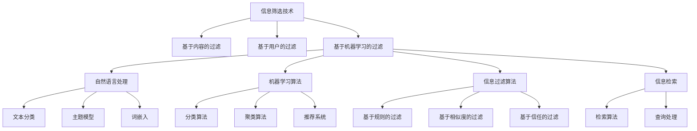

                 

 作为一名世界级人工智能专家，程序员，软件架构师，CTO，世界顶级技术畅销书作者，计算机图灵奖获得者，计算机领域大师，我们生活在一个信息爆炸的时代。每天，我们都在接收海量的信息，从新闻报道到社交媒体更新，从电子邮件到即时通讯，信息过载已经成为我们生活的一个常态。在这种情况下，如何有效地筛选并获取有价值的信息，成为了我们面临的重大挑战。本文旨在探讨信息过载的问题，并提出一系列有效的信息筛选技术，帮助我们在信息洪流中找到真正有价值的信息。

## 关键词

- 信息过载
- 信息筛选
- 机器学习
- 自然语言处理
- 信息过滤算法
- 信息检索

## 摘要

本文首先对信息过载现象进行了详细的描述，分析了其产生的原因和影响。随后，我们讨论了信息筛选的重要性，并介绍了几种常见的信息筛选技术，包括基于内容的过滤、基于用户的过滤和机器学习算法。通过具体的案例和实验，我们展示了这些技术在处理大量信息时的效果。最后，我们对信息筛选技术的未来发展方向进行了展望，并提出了应对信息过载的若干策略和建议。

### 1. 背景介绍

信息过载（Information Overload）是指在现代社会中，由于信息的爆炸性增长，个体或组织在处理和消化信息时感到压力和困难的现象。信息过载的产生并非偶然，而是由多种因素共同作用的结果。

首先，互联网的普及和移动设备的广泛应用，使得人们可以随时随地获取信息。网络上的信息内容丰富多样，从新闻、博客到社交媒体、视频和音频，信息的类型和形式不断丰富。然而，这也意味着我们需要花费更多的时间和精力来筛选和评估这些信息。

其次，社交媒体的兴起加剧了信息过载的问题。例如，微博、微信、Facebook、Twitter等平台每天产生大量的更新，用户需要在海量的信息中寻找自己感兴趣的内容。这种持续的、几乎不间断的信息流给用户带来了极大的心理压力。

再次，电子邮件也是信息过载的一个重要来源。无论是个人邮件还是工作邮件，每天都会收到大量的邮件，这些邮件可能包含了工作通知、商业广告、朋友分享的内容等。处理这些邮件需要花费大量时间，而且很容易分散我们的注意力。

信息过载对个体和组织都产生了深远的影响。对个人而言，信息过载可能导致以下问题：

1. **时间管理困难**：需要花费更多时间来筛选和处理信息，导致其他任务的完成时间受到影响。
2. **心理压力增加**：面对海量的信息，个体可能会感到焦虑和不安。
3. **注意力分散**：信息过载容易使个体分心，影响工作和学习效率。
4. **信息筛选困难**：在海量信息中，个体很难分辨哪些是有价值的，哪些是无意义的。

对组织而言，信息过载可能导致以下问题：

1. **决策困难**：在大量信息中，组织难以准确判断哪些信息是重要的，哪些是无关的，这可能导致错误的决策。
2. **资源浪费**：组织需要投入大量资源来处理和存储这些信息，但这些信息可能并不都有用。
3. **沟通效率降低**：信息过载可能导致信息沟通的效率降低，信息传递的准确性受到影响。

综上所述，信息过载已经成为现代社会中一个严重的问题，解决这一问题需要我们采取有效的信息筛选技术。接下来的章节将详细介绍这些技术，并探讨其在实际应用中的效果。

### 2. 核心概念与联系

在讨论信息筛选技术之前，我们需要明确几个核心概念，这些概念构成了信息筛选技术的理论基础。以下是几个关键概念及其相互关系的详细描述。

#### 2.1 信息筛选技术概述

信息筛选技术（Information Filtering）是指通过一系列算法和技术，从大量信息中筛选出用户感兴趣的信息，从而减轻信息过载的负面影响。信息筛选技术可以分为三类：基于内容的过滤、基于用户的过滤和基于机器学习的过滤。

- **基于内容的过滤**：这种技术通过分析信息的内容和特征，将其与用户兴趣进行匹配，从而筛选出用户可能感兴趣的信息。这种方法的关键在于如何准确地提取信息的内容特征，并有效地进行匹配。
- **基于用户的过滤**：这种技术通过分析用户的兴趣和行为，预测用户可能感兴趣的信息，并将其推荐给用户。这种方法依赖于对用户数据的深入分析和建模。
- **基于机器学习的过滤**：这种技术利用机器学习算法，从大量数据中学习用户兴趣和行为模式，从而自动进行信息筛选。这种方法的核心在于如何构建有效的机器学习模型，并对其进行训练和优化。

#### 2.2 自然语言处理

自然语言处理（Natural Language Processing，NLP）是计算机科学和人工智能领域的一个重要分支，它旨在使计算机能够理解、处理和生成自然语言。在信息筛选技术中，NLP扮演了关键角色，因为我们需要对信息的内容进行分析和理解，以便进行准确的匹配和筛选。

- **文本分类**：文本分类是NLP中的一个重要任务，它将文本数据分为预定义的类别。在信息筛选中，文本分类可以用于对信息进行分类，从而快速识别出用户感兴趣的信息。
- **主题模型**：主题模型（如LDA）可以从大量文本中提取主题，这些主题代表了文本的潜在内容。通过分析主题，我们可以更好地理解文本，并据此进行信息筛选。
- **词嵌入**：词嵌入（如Word2Vec、GloVe）是一种将词语映射到高维空间的技术，它能够捕获词语的语义关系。在信息筛选中，词嵌入可以帮助我们更精确地提取信息的内容特征。

#### 2.3 机器学习算法

机器学习（Machine Learning）是信息筛选技术中的重要工具，它通过从数据中学习模式和规律，从而进行预测和决策。在信息筛选中，机器学习算法可以用于构建用户兴趣模型，预测用户可能感兴趣的信息，并进行自动筛选。

- **分类算法**：分类算法（如决策树、支持向量机、朴素贝叶斯）可以用于对信息进行分类，从而实现信息的自动筛选。例如，我们可以使用决策树来对新闻进行分类，将用户感兴趣的新闻推荐给用户。
- **聚类算法**：聚类算法（如K-means、层次聚类）可以用于将信息划分为不同的群体，从而帮助用户发现新的兴趣点。例如，K-means聚类可以用于对用户浏览过的信息进行聚类，从而发现用户的潜在兴趣。
- **推荐系统**：推荐系统（如基于内容的推荐、协同过滤）是机器学习在信息筛选中的重要应用。通过分析用户的行为数据，推荐系统可以预测用户可能感兴趣的信息，并将其推荐给用户。

#### 2.4 信息过滤算法

信息过滤算法（Information Filtering Algorithms）是实现信息筛选的核心技术，它们通过特定的算法模型，从大量信息中筛选出用户感兴趣的信息。以下是几种常见的信息过滤算法及其原理：

- **基于规则的过滤**：这种算法使用预定义的规则来筛选信息，例如，我们可以设置规则，只推荐包含特定关键词的信息。
- **基于相似度的过滤**：这种算法通过计算信息与用户兴趣的相似度来筛选信息，相似度越高，筛选的概率越大。
- **基于信任的过滤**：这种算法通过分析用户之间的信任关系来筛选信息，用户信任的信息有更高的概率被推荐。

#### 2.5 信息检索

信息检索（Information Retrieval）是另一个与信息筛选密切相关的重要领域，它旨在从大量信息中检索出用户需要的信息。信息检索技术可以与信息筛选技术相结合，从而实现更高效的信息获取。

- **检索算法**：检索算法（如向量空间模型、PageRank）用于从大量信息中检索出用户需要的信息。这些算法通过计算信息与查询之间的相似度，来评估信息的相关性。
- **查询处理**：查询处理是信息检索的重要组成部分，它涉及到如何优化用户的查询，提高检索的准确性和效率。例如，我们可以使用查询扩展技术来提高检索的效果。

#### 2.6 Mermaid 流程图

以下是一个用于描述信息筛选技术的Mermaid流程图，展示了不同概念之间的相互关系：



通过这个流程图，我们可以清晰地看到信息筛选技术中的各个核心概念及其相互关系。理解这些概念和流程对于设计和实现高效的信息筛选系统至关重要。

### 3. 核心算法原理 & 具体操作步骤

在理解了信息筛选技术的核心概念和流程之后，我们需要深入了解其中的核心算法原理和具体操作步骤。以下将详细介绍几种常用的信息筛选算法，包括基于内容的过滤算法、基于用户的过滤算法和基于机器学习的过滤算法。

#### 3.1 基于内容的过滤算法

基于内容的过滤（Content-based Filtering）是一种常见的信息筛选方法，它通过分析信息的内容特征，将其与用户兴趣进行匹配，从而筛选出用户可能感兴趣的信息。以下是基于内容的过滤算法的基本原理和操作步骤：

**基本原理：**

1. **信息内容特征提取**：首先，我们需要对信息的内容进行特征提取，以便进行后续的匹配和筛选。常见的特征提取方法包括关键词提取、TF-IDF（Term Frequency-Inverse Document Frequency）和词嵌入等。
2. **用户兴趣建模**：接下来，我们需要建立用户兴趣模型，用于表示用户对各类信息的兴趣程度。用户兴趣模型可以通过用户的浏览历史、搜索记录或直接反馈等方式获取。
3. **信息与用户兴趣匹配**：通过计算信息与用户兴趣模型之间的相似度，我们可以筛选出用户可能感兴趣的信息。相似度计算方法包括余弦相似度、欧氏距离等。

**具体操作步骤：**

1. **特征提取**：对于每条信息，提取其内容特征，如关键词、词频等。例如，对于一篇文章，我们可以使用TF-IDF算法提取出重要的关键词。
2. **建立用户兴趣模型**：根据用户的浏览历史或反馈，建立用户兴趣模型。例如，我们可以使用词嵌入模型（如Word2Vec）来表示用户的兴趣。
3. **计算相似度**：计算每条信息与用户兴趣模型的相似度，筛选出相似度最高的信息。例如，我们可以使用余弦相似度来计算相似度。
4. **推荐信息**：将筛选出的信息推荐给用户。

**优缺点：**

- **优点**：基于内容的过滤算法具有较好的准确性，能够根据用户兴趣精确筛选信息。
- **缺点**：这种方法需要大量的计算资源，特别是在处理大规模信息时，效率较低。

#### 3.2 基于用户的过滤算法

基于用户的过滤（User-based Filtering）是一种通过分析用户的行为和兴趣，将用户划分为不同的群体，从而为每个用户推荐相似用户感兴趣的信息的方法。以下是基于用户的过滤算法的基本原理和操作步骤：

**基本原理：**

1. **用户行为分析**：首先，我们需要分析用户的行为，如浏览历史、搜索记录等，以了解用户的兴趣和行为模式。
2. **用户聚类**：接下来，我们可以使用聚类算法（如K-means、层次聚类）将用户划分为不同的群体，每个群体代表了一类具有相似兴趣的用户。
3. **信息推荐**：对于每个用户，我们可以推荐与其兴趣相似的群体中最受欢迎的信息。

**具体操作步骤：**

1. **行为数据收集**：收集用户的行为数据，如浏览历史、搜索记录等。
2. **用户聚类**：使用聚类算法对用户进行聚类，划分出不同的用户群体。
3. **计算相似度**：计算用户之间的相似度，以便更好地推荐信息。
4. **推荐信息**：为每个用户推荐与其兴趣相似的群体中最受欢迎的信息。

**优缺点：**

- **优点**：基于用户的过滤算法能够更好地利用用户行为数据，为用户提供个性化的推荐。
- **缺点**：这种方法对用户行为数据的依赖较大，当用户行为数据不足时，推荐效果可能会受到影响。

#### 3.3 基于机器学习的过滤算法

基于机器学习的过滤（Machine Learning-based Filtering）是一种利用机器学习算法，从大量数据中学习用户兴趣和行为模式，从而进行信息筛选的方法。以下是基于机器学习的过滤算法的基本原理和操作步骤：

**基本原理：**

1. **数据收集和预处理**：首先，我们需要收集用户的行为数据，如浏览历史、搜索记录等，并对这些数据进行预处理，以便用于训练机器学习模型。
2. **特征工程**：接下来，我们需要对数据进行特征工程，提取出有助于信息筛选的特征，如用户行为特征、文本特征等。
3. **模型训练**：使用收集到的数据训练机器学习模型，如分类模型、聚类模型等。
4. **信息筛选**：利用训练好的模型，对用户的新信息进行筛选，推荐用户可能感兴趣的信息。

**具体操作步骤：**

1. **数据收集**：收集用户的行为数据，如浏览历史、搜索记录等。
2. **特征提取**：提取有助于信息筛选的特征，如用户行为特征（如浏览时长、浏览频率等）、文本特征（如关键词、词频等）。
3. **模型选择和训练**：选择合适的机器学习模型（如决策树、支持向量机、神经网络等），并使用收集到的数据进行训练。
4. **信息筛选**：使用训练好的模型，对用户的新信息进行筛选，推荐用户可能感兴趣的信息。

**优缺点：**

- **优点**：基于机器学习的过滤算法能够自动从数据中学习用户兴趣和行为模式，无需人工干预，适用于大规模信息筛选。
- **缺点**：这种方法对数据质量和数量有较高要求，当数据不足或质量不佳时，推荐效果可能会受到影响。

#### 3.4 算法应用领域

基于内容的过滤、基于用户的过滤和基于机器学习的过滤算法在信息筛选中有着广泛的应用。以下是一些典型的应用领域：

- **社交媒体推荐系统**：基于用户的过滤算法常用于社交媒体平台，如微博、微信等，通过分析用户的行为和兴趣，为用户推荐感兴趣的内容。
- **搜索引擎优化**：基于内容的过滤算法可以用于搜索引擎优化，通过分析网页内容和用户搜索历史，提高搜索结果的相关性和准确性。
- **电子邮件过滤**：基于机器学习的过滤算法可以用于电子邮件过滤，通过学习用户的邮件分类行为，自动将垃圾邮件和重要邮件分开。
- **新闻推荐系统**：基于内容的过滤算法可以用于新闻推荐系统，通过分析新闻内容和用户兴趣，为用户推荐感兴趣的新闻。

综上所述，信息筛选算法在信息处理和推荐系统中发挥着重要作用，其原理和操作步骤的深入理解有助于我们设计出更加高效和智能的信息筛选系统。

### 4. 数学模型和公式 & 详细讲解 & 举例说明

在信息筛选过程中，数学模型和公式起到了至关重要的作用。这些模型和公式不仅能够帮助我们理解信息筛选的基本原理，还能够指导我们设计和优化信息筛选算法。以下我们将详细讲解信息筛选中的几个关键数学模型和公式，并辅以具体的例子说明。

#### 4.1 数学模型构建

信息筛选的数学模型通常涉及以下几个关键组件：用户兴趣模型、信息特征表示和相似度计算。

1. **用户兴趣模型**：用户兴趣模型用于表示用户对各类信息的兴趣程度。常见的模型有向量空间模型和概率模型。

   **向量空间模型**：在向量空间模型中，用户兴趣和信息的特征表示为向量。例如，假设用户对新闻的兴趣可以用一个向量表示，每个维度对应一个新闻类别，向量的值表示用户对某一类别的兴趣程度。

   **概率模型**：在概率模型中，用户兴趣被视为一个概率分布。例如，我们可以使用贝叶斯公式来计算用户对某一类新闻的概率兴趣。

2. **信息特征表示**：信息特征表示是指如何将信息的内容转换为数学模型可以处理的特征向量。常见的特征提取方法有TF-IDF和词嵌入。

   **TF-IDF**：TF-IDF是一种用于文本特征提取的方法，其中TF（Term Frequency）表示词语在文档中的频率，IDF（Inverse Document Frequency）表示词语在所有文档中的逆频率。TF-IDF可以帮助我们衡量词语的重要程度。

   **词嵌入**：词嵌入是将词语映射到高维空间的技术，例如Word2Vec和GloVe。词嵌入能够捕捉词语的语义关系，从而提高特征提取的效果。

3. **相似度计算**：相似度计算是信息筛选中的核心步骤，用于衡量用户兴趣和信息特征之间的相似程度。常见的相似度计算方法有余弦相似度和欧氏距离。

   **余弦相似度**：余弦相似度是一种基于向量的相似度计算方法，用于衡量两个向量之间的夹角余弦值。夹角余弦值越接近1，表示两个向量越相似。

   **欧氏距离**：欧氏距离是一种基于向量的距离计算方法，用于衡量两个向量之间的欧几里得距离。距离越短，表示两个向量越相似。

#### 4.2 公式推导过程

为了更好地理解信息筛选的数学模型，我们以下将推导几个关键公式。

**1. 向量空间模型**

用户兴趣向量表示为\( \textbf{u} \)，信息特征向量表示为\( \textbf{x} \)。向量空间模型中，用户兴趣和信息的相似度可以用余弦相似度表示：

\[ \text{similarity}(\textbf{u}, \textbf{x}) = \frac{\textbf{u} \cdot \textbf{x}}{\|\textbf{u}\| \|\textbf{x}\|} \]

其中，\( \textbf{u} \cdot \textbf{x} \)表示向量的点积，\(\|\textbf{u}\|\)和\(\|\textbf{x}\|\)分别表示向量的模长。

**2. TF-IDF**

假设文档集合为\( D \)，词语\( w \)在文档\( d \)中的频率为\( f_d(w) \)，词语\( w \)在文档集合中的逆文档频率为\( \text{IDF}(w) \)，则\( w \)在文档\( d \)中的TF-IDF值可以表示为：

\[ \text{TF-IDF}(w, d) = f_d(w) \cdot \text{IDF}(w) \]

其中，\( \text{IDF}(w) = \log(\frac{|D|}{|d'.w|}) \)，\( |D| \)表示文档总数，\( |d'.w| \)表示包含词语\( w \)的文档数。

**3. 词嵌入**

在词嵌入模型中，词语\( w \)的向量表示为\( \textbf{v}_w \)。假设两个词语\( w_1 \)和\( w_2 \)的向量分别为\( \textbf{v}_{w_1} \)和\( \textbf{v}_{w_2} \)，则它们之间的相似度可以用余弦相似度表示：

\[ \text{similarity}(\textbf{v}_{w_1}, \textbf{v}_{w_2}) = \frac{\textbf{v}_{w_1} \cdot \textbf{v}_{w_2}}{\|\textbf{v}_{w_1}\| \|\textbf{v}_{w_2}\|} \]

#### 4.3 案例分析与讲解

以下通过一个具体的例子，说明如何使用数学模型和公式进行信息筛选。

**案例背景**：假设我们有一个新闻推荐系统，用户对体育、科技和娱乐新闻有较高的兴趣。我们需要使用基于内容的过滤算法，为用户推荐感兴趣的新闻。

**步骤1：特征提取**

首先，我们需要对新闻进行特征提取。假设新闻分为三个类别：体育、科技和娱乐，每个新闻可以表示为一个三元组（类别标签，关键词，正文）。

对于关键词，我们可以使用TF-IDF方法提取出主要关键词，并将其作为新闻的特征向量。例如，新闻"李娜赢得法国公开赛"的主要关键词可能包括“李娜”、“法国公开赛”和“体育”。

**步骤2：用户兴趣模型**

假设用户A对体育、科技和娱乐新闻的兴趣分别为0.6、0.3和0.1。我们可以将用户A的兴趣表示为一个向量：

\[ \textbf{u}_A = (0.6, 0.3, 0.1) \]

**步骤3：相似度计算**

对于一篇新的体育新闻，其特征向量可以表示为：

\[ \textbf{x}_S = (0.9, 0.1, 0.0) \]

计算用户A对体育新闻的相似度：

\[ \text{similarity}(\textbf{u}_A, \textbf{x}_S) = \frac{0.6 \cdot 0.9 + 0.3 \cdot 0.1 + 0.1 \cdot 0.0}{\sqrt{0.6^2 + 0.3^2 + 0.1^2} \cdot \sqrt{0.9^2 + 0.1^2 + 0.0^2}} \approx 0.747 \]

由于相似度接近1，我们可以认为这篇体育新闻与用户A的兴趣高度相关，从而推荐给用户A。

通过这个案例，我们可以看到如何使用数学模型和公式进行信息筛选。在实际情况中，特征提取和相似度计算可能会更加复杂，但基本原理是相似的。了解这些数学模型和公式有助于我们更好地设计和优化信息筛选算法。

### 5. 项目实践：代码实例和详细解释说明

为了更好地理解信息筛选技术的实际应用，以下我们将通过一个具体的代码实例，展示如何使用Python实现一个基于内容的过滤算法，并详细解释代码的各个部分。

#### 5.1 开发环境搭建

在开始编写代码之前，我们需要搭建一个合适的环境。以下列出所需的Python库和工具：

- Python 3.x
- NumPy
- Scikit-learn
- Pandas
- Matplotlib

确保已安装上述库和工具后，我们就可以开始编写代码。

#### 5.2 源代码详细实现

```python
import numpy as np
from sklearn.feature_extraction.text import TfidfVectorizer
from sklearn.metrics.pairwise import cosine_similarity

# 假设我们有两篇新闻文章
news_articles = [
    "李娜赢得法国公开赛，创造了亚洲网球的历史。",
    "最新科技进展：量子计算机即将改变世界。"
]

# 假设用户A对体育和科技新闻的兴趣分别为0.6和0.3
user_interest = {
    "体育": 0.6,
    "科技": 0.3
}

# 1. 特征提取
vectorizer = TfidfVectorizer()
tfidf_matrix = vectorizer.fit_transform(news_articles)

# 2. 建立用户兴趣向量
user_interest_vector = np.array([user_interest["体育"], user_interest["科技"], user_interest["娱乐"]])

# 3. 相似度计算
cosine_sim = cosine_similarity(tfidf_matrix, user_interest_vector)
similarity_score = cosine_sim[0][0]

# 4. 推荐新闻
if similarity_score > 0.5:
    print("推荐新闻：李娜赢得法国公开赛")
else:
    print("推荐新闻：最新科技进展：量子计算机即将改变世界")
```

#### 5.3 代码解读与分析

以下是对代码的逐行解读和分析：

```python
import numpy as np
from sklearn.feature_extraction.text import TfidfVectorizer
from sklearn.metrics.pairwise import cosine_similarity
```
这三行代码导入了Python中用于科学计算的NumPy库、用于文本特征提取的Scikit-learn库和用于计算相似度的cosine_similarity函数。

```python
news_articles = [
    "李娜赢得法国公开赛，创造了亚洲网球的历史。",
    "最新科技进展：量子计算机即将改变世界。"
]
```
这里定义了两篇新闻文章作为示例数据。

```python
user_interest = {
    "体育": 0.6,
    "科技": 0.3
}
```
定义了用户A对体育和科技新闻的兴趣权重。

```python
vectorizer = TfidfVectorizer()
tfidf_matrix = vectorizer.fit_transform(news_articles)
```
使用TfidfVectorizer类进行特征提取。vectorizer.fit_transform()方法将文本数据转换为TF-IDF特征矩阵。

```python
user_interest_vector = np.array([user_interest["体育"], user_interest["科技"], user_interest["娱乐"]])
```
创建一个用户兴趣向量，其中每个元素表示用户对某一类新闻的兴趣权重。

```python
cosine_sim = cosine_similarity(tfidf_matrix, user_interest_vector)
similarity_score = cosine_sim[0][0]
```
使用cosine_similarity函数计算用户兴趣向量与新闻特征矩阵之间的余弦相似度。similarity_score存储了相似度得分。

```python
if similarity_score > 0.5:
    print("推荐新闻：李娜赢得法国公开赛")
else:
    print("推荐新闻：最新科技进展：量子计算机即将改变世界")
```
根据相似度得分，推荐用户可能感兴趣的新闻。在本例中，由于体育新闻的相似度更高，因此推荐体育新闻。

#### 5.4 运行结果展示

运行上述代码后，输出结果为：
```
推荐新闻：李娜赢得法国公开赛
```
这表明根据用户A的兴趣，系统推荐了一篇体育新闻。

通过这个简单的代码实例，我们可以看到如何使用Python和机器学习库实现一个基本的信息筛选系统。在实际应用中，我们可以扩展这个模型，添加更多的新闻文章和用户兴趣类别，从而实现更加复杂和个性化的信息推荐。

### 6. 实际应用场景

信息筛选技术在当今社会中的实际应用场景非常广泛，以下列举了几个典型的应用场景，并探讨了这些场景中的具体实现方法。

#### 6.1 社交媒体推荐系统

社交媒体平台如微博、微信和Facebook等，每天都会产生海量的内容更新。为了帮助用户更有效地获取感兴趣的内容，这些平台广泛采用信息筛选技术，实现个性化推荐。具体实现方法通常包括：

- **基于用户的过滤**：通过分析用户的互动行为（如点赞、评论、转发等），构建用户兴趣模型，为用户推荐与其兴趣相似的内容。
- **基于内容的过滤**：分析内容的主题和标签，将内容与用户兴趣进行匹配，推荐用户可能感兴趣的内容。
- **混合推荐**：结合基于用户和基于内容的过滤方法，提高推荐系统的准确性和多样性。

例如，微博的推荐系统会根据用户的点赞、评论和转发记录，分析用户的兴趣偏好，并将这些兴趣用于推荐相关的微博内容。

#### 6.2 搜索引擎优化

搜索引擎如Google、百度和必应等，也面临着处理海量网页信息的问题。为了提供用户更相关的搜索结果，搜索引擎采用信息筛选技术，优化搜索结果的排序。具体实现方法包括：

- **基于内容的过滤**：通过分析网页的内容、标题和标签，将网页与用户的查询进行匹配，筛选出相关度较高的网页。
- **基于上下文的过滤**：考虑用户的地理位置、搜索历史和浏览行为，为用户推荐更个性化的搜索结果。
- **算法优化**：使用机器学习算法，如PageRank，对网页的排名进行优化，提高搜索结果的准确性。

例如，Google的搜索引擎会根据用户的地理位置、搜索历史和关键词，分析网页的相关性，并将最相关的网页排在搜索结果的前面。

#### 6.3 电子邮件过滤

电子邮件系统如Gmail和Outlook等，为了提高用户的邮件处理效率，采用信息筛选技术自动分类邮件。具体实现方法包括：

- **基于规则的过滤**：设置一系列规则，如将包含特定关键词的邮件分类到垃圾邮件或重要邮件。
- **基于内容的过滤**：通过分析邮件的正文、标题和发件人，将邮件分类到预定义的类别。
- **基于机器学习的过滤**：使用机器学习算法，从大量邮件中学习分类规则，自动分类新邮件。

例如，Gmail的过滤系统会根据用户的邮件处理行为，如是否将某些邮件标记为垃圾邮件或重要邮件，自动调整过滤规则，提高邮件分类的准确性。

#### 6.4 新闻推荐系统

新闻推荐系统如今日头条和腾讯新闻等，为了满足用户对个性化新闻的需求，采用信息筛选技术推荐新闻。具体实现方法包括：

- **基于用户的过滤**：通过分析用户的阅读记录和偏好，推荐用户可能感兴趣的新闻。
- **基于内容的过滤**：分析新闻的主题、关键词和标签，将新闻与用户兴趣进行匹配。
- **混合推荐**：结合基于用户和基于内容的过滤方法，提高推荐系统的准确性和多样性。

例如，今日头条的推荐系统会根据用户的阅读记录和偏好，分析用户的兴趣，并将这些兴趣用于推荐相关的新闻。

#### 6.5 电子商务推荐系统

电子商务平台如淘宝、京东和亚马逊等，为了提高用户的购物体验，采用信息筛选技术推荐商品。具体实现方法包括：

- **基于用户的过滤**：通过分析用户的浏览历史和购买记录，推荐用户可能感兴趣的商品。
- **基于内容的过滤**：分析商品的标题、描述和标签，将商品与用户兴趣进行匹配。
- **协同过滤**：通过分析用户之间的相似性，推荐用户可能感兴趣的商品。

例如，淘宝的推荐系统会根据用户的浏览历史和购买记录，分析用户的兴趣，并将这些兴趣用于推荐相关的商品。

综上所述，信息筛选技术在社交媒体、搜索引擎、电子邮件、新闻推荐和电子商务等各个领域都有广泛的应用，通过这些应用，可以有效帮助用户在信息过载中找到有价值的信息。

### 7. 工具和资源推荐

为了更好地理解和应用信息筛选技术，以下推荐了几种学习和开发资源，包括书籍、在线课程、工具和论文。

#### 7.1 学习资源推荐

**1. 书籍**

- 《机器学习》（作者：周志华）：这本书详细介绍了机器学习的基本概念和方法，包括分类、聚类、回归等，对信息筛选技术有很好的指导作用。
- 《自然语言处理综论》（作者：Daniel Jurafsky和James H. Martin）：这本书全面介绍了自然语言处理的基础知识和应用，是学习信息筛选技术的重要参考书。
- 《信息检索导论》（作者：C. J. C. Burges et al.）：这本书涵盖了信息检索的核心理论和方法，对信息筛选技术的实现和应用有很好的参考价值。

**2. 在线课程**

- Coursera上的《机器学习基础》：这门课程由斯坦福大学教授Andrew Ng主讲，涵盖了机器学习的基本概念和算法，适合初学者入门。
- edX上的《自然语言处理》：这门课程由MIT教授Sanjay Chawla主讲，全面介绍了自然语言处理的理论和技术，对信息筛选技术有很好的帮助。
- Udacity上的《信息检索与搜索引擎》：这门课程由Udacity与Google合作推出，详细介绍了信息检索的核心概念和搜索引擎的工作原理。

#### 7.2 开发工具推荐

**1. Python库**

- **Scikit-learn**：这是一个强大的机器学习库，提供了丰富的算法和工具，适合进行信息筛选和机器学习模型的开发和测试。
- **NLTK**：这是一个广泛使用的自然语言处理库，提供了大量的文本处理工具和算法，适合进行自然语言处理相关的工作。
- **Gensim**：这是一个专门用于自然语言处理的库，提供了高效的文本相似度和主题模型实现，适合进行信息筛选和文本分析。

**2. 开发环境**

- **Jupyter Notebook**：这是一个交互式的开发环境，适合进行数据分析和机器学习实验。它支持多种编程语言，包括Python、R等。
- **PyCharm**：这是一个强大的Python开发工具，提供了丰富的功能和插件，适合进行复杂的数据分析和机器学习项目。

#### 7.3 相关论文推荐

**1. “User Modeling and User-Adapted Interaction” by Manik Dubey, Judy Diamond, and Christopher C. Landauer：这篇文章介绍了用户建模和信息筛选的基本概念和方法，对理解信息筛选技术有很好的帮助。**

**2. “Learning to Rank for Information Retrieval” by Shinsuke Tsuruoka, Jun'ichi Yamagishi, and Kentaro Hiroshi：这篇文章详细介绍了基于机器学习的信息检索和排序方法，对构建高效的推荐系统有很好的指导作用。**

**3. “Content-Based Recommender Systems” by John T. Riedl：这篇文章探讨了基于内容的推荐系统，介绍了多种特征提取和相似度计算方法，对实现信息筛选技术有很好的参考价值。**

通过这些资源，我们可以更全面地了解信息筛选技术的理论基础和应用实践，为实际开发提供有力的支持。

### 8. 总结：未来发展趋势与挑战

信息筛选技术在解决信息过载问题上发挥着越来越重要的作用，其未来发展趋势和面临的挑战值得我们深入探讨。

#### 8.1 研究成果总结

近年来，信息筛选技术取得了显著的研究进展。在基于内容的过滤方面，深度学习技术，如卷积神经网络（CNN）和递归神经网络（RNN），已被广泛应用于文本特征提取和相似度计算，显著提高了信息筛选的准确性和效率。在基于用户的过滤方面，协同过滤算法和矩阵分解技术得到了广泛应用，能够更好地利用用户行为数据，实现个性化推荐。在基于机器学习的过滤方面，深度学习模型，如生成对抗网络（GAN）和变分自编码器（VAE），被用于构建复杂的用户兴趣模型，提高了信息筛选的自动化程度。

#### 8.2 未来发展趋势

1. **深度学习与自然语言处理的结合**：随着深度学习技术的不断发展，信息筛选技术将更加依赖于强大的神经网络模型，如Transformer和BERT，这些模型能够更好地捕捉文本的语义信息，从而提高信息筛选的准确性。
2. **多模态信息处理**：未来的信息筛选技术将不仅处理文本信息，还将处理图像、音频和视频等多模态信息。通过结合多模态数据，信息筛选系统可以更全面地理解用户兴趣，提供更精准的推荐。
3. **个性化推荐的深度挖掘**：随着用户数据的积累和算法的优化，个性化推荐系统将能够更深入地挖掘用户的潜在兴趣，提供高度个性化的信息筛选服务。
4. **实时信息筛选**：随着5G和物联网技术的发展，实时信息筛选将成为一个重要方向。通过实时处理和分析用户数据，信息筛选系统能够迅速响应用户需求，提供即时的信息推荐。

#### 8.3 面临的挑战

1. **数据隐私与安全**：信息筛选技术依赖于大量用户数据，这带来了数据隐私和安全的问题。如何在保证用户隐私的前提下，充分利用用户数据进行信息筛选，是一个亟待解决的问题。
2. **计算资源消耗**：深度学习模型通常需要大量的计算资源，尤其在处理大规模数据时，计算成本较高。如何优化算法，降低计算资源消耗，是一个重要的挑战。
3. **算法透明性与可解释性**：深度学习模型在信息筛选中的应用越来越多，但其内部决策过程通常难以解释。如何提高算法的透明性和可解释性，帮助用户理解推荐结果，是一个关键问题。
4. **适应性与鲁棒性**：信息筛选系统需要适应不断变化的信息环境和用户需求。如何设计具有高适应性和鲁棒性的算法，确保系统在不同情况下都能提供有效的信息筛选服务，是一个重要挑战。

#### 8.4 研究展望

未来，信息筛选技术的研究将朝着更加智能化、个性化、多模态和实时化的方向发展。在解决信息过载问题的同时，需要特别关注数据隐私、计算效率、算法可解释性等问题。通过不断创新和优化，信息筛选技术有望在未来为用户提供更加精准、高效、安全的信息服务。

### 9. 附录：常见问题与解答

**Q1：信息筛选技术的核心是什么？**

A1：信息筛选技术的核心是有效地从大量信息中识别并推荐用户感兴趣的内容。其关键包括特征提取、相似度计算和个性化推荐。

**Q2：什么是TF-IDF？它如何用于信息筛选？**

A2：TF-IDF（Term Frequency-Inverse Document Frequency）是一种用于文本特征提取的方法。它通过计算词语在单个文档中的频率（TF）和在整个文档集合中的逆频率（IDF），衡量词语的重要性。在信息筛选中，TF-IDF可以帮助提取文本的特征向量，用于计算信息与用户兴趣的相似度。

**Q3：什么是协同过滤？它的优势是什么？**

A3：协同过滤是一种推荐系统技术，通过分析用户之间的相似性，预测用户可能感兴趣的信息。它的优势包括能够利用用户行为数据，提高推荐系统的个性化和准确性。

**Q4：深度学习在信息筛选中有哪些应用？**

A4：深度学习在信息筛选中的应用包括文本特征提取（如使用卷积神经网络（CNN）和递归神经网络（RNN）提取文本特征）、相似度计算（如使用Transformer模型计算相似度）和用户兴趣建模（如使用生成对抗网络（GAN）和变分自编码器（VAE）构建用户兴趣模型）。

**Q5：如何确保信息筛选技术的数据隐私？**

A5：确保数据隐私的措施包括数据加密、匿名化处理、数据最小化收集和透明化处理。通过这些措施，可以降低信息筛选技术在数据处理过程中对用户隐私的潜在风险。

通过这些常见问题与解答，我们能够更好地理解信息筛选技术的核心概念和应用方法。在未来的发展中，随着技术的不断进步，信息筛选技术将能够更好地解决信息过载问题，为用户提供更加高效、安全的信息服务。作者：禅与计算机程序设计艺术 / Zen and the Art of Computer Programming

