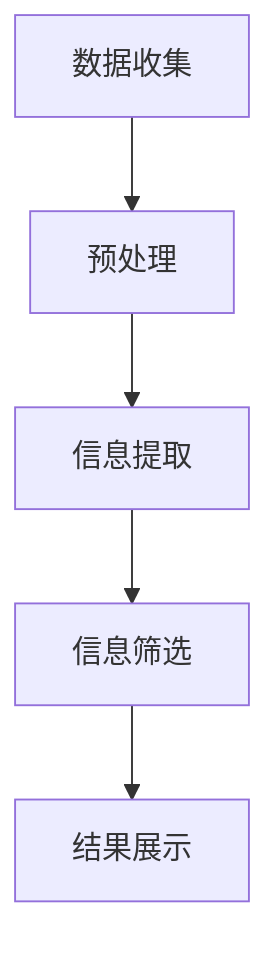

                 

关键词：信息过载、信息筛选、策略、指南、技术、人工智能、算法、数学模型、应用场景、工具资源、发展趋势与挑战

> 摘要：在当今信息爆炸的时代，人们面临着巨大的信息过载问题。如何有效地筛选和利用有价值的信息成为了一个关键挑战。本文将探讨信息过载的概念、影响，以及一系列信息筛选策略和指南，帮助读者在信息洪流中找到真正有价值的信息。

## 1. 背景介绍

### 信息过载的定义与现状

信息过载（Information Overload）是指人们接收到的信息量超过了他们处理能力的一种现象。随着互联网和社交媒体的普及，人们每天面临的信息量呈指数级增长。据统计，全球每天产生的数据量已经达到了数十亿GB，其中大部分信息以文字、图片和视频等形式存在。

这种信息过载的现象对个人的生活和职业产生了深远的影响。在个人层面，信息过载导致人们感到压力和疲劳，降低了工作效率和生活质量。在职业层面，信息过载使得企业难以筛选出对业务有价值的情报，从而影响了决策和竞争力。

### 信息筛选的重要性

信息筛选（Information Filtering）是指通过一定的策略和技术，从海量的信息中识别和提取出对用户有价值的信息的过程。在信息过载的时代，信息筛选变得尤为重要。有效的信息筛选可以帮助用户节省时间，提高工作效率，减少心理压力。

信息筛选不仅是一种技能，更是一种思维方式。通过学习和掌握信息筛选的策略和工具，用户可以更好地应对信息过载的挑战，从而在信息洪流中找到有价值的信息。

## 2. 核心概念与联系

### 信息筛选的核心概念

信息筛选涉及到多个核心概念，包括信息量、信息价值、信息噪音等。

- **信息量（Information Quantity）**：信息量是指信息的数量或规模。在信息过载的情况下，信息量通常很大。

- **信息价值（Information Value）**：信息价值是指信息对用户的实际价值和意义。有效筛选信息的核心在于识别和提取出对用户有价值的信息。

- **信息噪音（Information Noise）**：信息噪音是指无关或低价值的信息。信息噪音的存在会降低信息筛选的效率和准确性。

### 信息筛选的架构

信息筛选的架构通常包括以下几个主要组件：

- **数据收集（Data Collection）**：数据收集是信息筛选的第一步，包括从各种渠道获取信息，如互联网、数据库、社交媒体等。

- **预处理（Preprocessing）**：预处理是对收集到的数据进行清洗、转换和格式化，以提高数据的质量和一致性。

- **信息提取（Information Extraction）**：信息提取是从预处理后的数据中提取出有用的信息，如关键词、主题、情感等。

- **信息筛选（Information Filtering）**：信息筛选是利用算法和规则对提取出的信息进行筛选，以识别出对用户有价值的信息。

- **结果展示（Result Presentation）**：结果展示是将筛选出的信息以用户友好的形式呈现，如列表、图表、摘要等。

### Mermaid 流程图



## 3. 核心算法原理 & 具体操作步骤

### 3.1 算法原理概述

信息筛选的核心算法通常包括基于内容的筛选、基于用户的筛选和混合筛选等方法。

- **基于内容的筛选（Content-Based Filtering）**：基于内容的筛选是根据信息的特征和内容进行筛选。例如，通过关键词匹配、主题分类和文本相似度等方法，将用户感兴趣的信息筛选出来。

- **基于用户的筛选（User-Based Filtering）**：基于用户的筛选是根据用户的行为和偏好进行筛选。例如，通过用户的历史行为和社交网络关系，推荐用户可能感兴趣的信息。

- **混合筛选（Hybrid Filtering）**：混合筛选是结合基于内容和基于用户的筛选方法，以提高筛选的准确性和效果。

### 3.2 算法步骤详解

#### 基于内容的筛选

1. **信息提取**：从原始数据中提取出关键词、主题和情感等信息。

2. **特征匹配**：将用户输入的关键词或主题与提取出的信息进行匹配，以识别出用户感兴趣的信息。

3. **筛选结果**：根据匹配结果，将用户感兴趣的信息筛选出来。

#### 基于用户的筛选

1. **用户行为分析**：分析用户的历史行为，如浏览记录、购买记录和点赞记录等。

2. **用户偏好建模**：基于用户行为分析，建立用户的偏好模型。

3. **信息推荐**：根据用户偏好模型，推荐用户可能感兴趣的信息。

#### 混合筛选

1. **信息提取**：提取出关键词、主题和情感等信息。

2. **用户行为分析**：分析用户的历史行为。

3. **特征匹配**：结合信息特征和用户行为特征，进行匹配。

4. **筛选结果**：根据匹配结果，筛选出用户感兴趣的信息。

### 3.3 算法优缺点

- **基于内容的筛选**：
  - 优点：简单直观，易于实现。
  - 缺点：可能导致信息丢失，对用户个性化需求的满足度较低。

- **基于用户的筛选**：
  - 优点：能够较好地满足用户的个性化需求。
  - 缺点：需要大量用户行为数据，且容易陷入“推荐循环”。

- **混合筛选**：
  - 优点：结合了基于内容和基于用户筛选的优点，提高了筛选的准确性和效果。
  - 缺点：算法复杂度较高，实现难度较大。

### 3.4 算法应用领域

信息筛选算法广泛应用于各种领域，如推荐系统、搜索引擎、社交媒体和内容聚合平台等。

- **推荐系统**：通过信息筛选算法，推荐用户可能感兴趣的商品、内容和活动。

- **搜索引擎**：通过信息筛选算法，提高搜索结果的准确性和相关性。

- **社交媒体**：通过信息筛选算法，过滤掉无关或低价值的信息，提升用户体验。

- **内容聚合平台**：通过信息筛选算法，将用户感兴趣的内容聚合在一起，提高信息利用效率。

## 4. 数学模型和公式 & 详细讲解 & 举例说明

### 4.1 数学模型构建

信息筛选的数学模型通常包括概率模型、统计学模型和机器学习模型等。

#### 概率模型

概率模型是基于概率论和统计学原理构建的。一个简单的概率模型可以表示为：

$$
P(A|B) = \frac{P(B|A) \cdot P(A)}{P(B)}
$$

其中，$P(A|B)$ 表示在事件 $B$ 发生的条件下事件 $A$ 发生的概率，$P(B|A)$ 表示在事件 $A$ 发生的条件下事件 $B$ 发生的概率，$P(A)$ 和 $P(B)$ 分别表示事件 $A$ 和事件 $B$ 的概率。

#### 统计学模型

统计学模型是基于统计学原理构建的。一个简单的统计学模型可以表示为：

$$
\mu = \frac{\sum_{i=1}^{n} x_i}{n}
$$

其中，$\mu$ 表示样本均值，$x_i$ 表示第 $i$ 个样本值，$n$ 表示样本数量。

#### 机器学习模型

机器学习模型是基于机器学习算法构建的。一个简单的机器学习模型可以表示为：

$$
h_\theta(x) = \theta_0 + \theta_1x_1 + \theta_2x_2 + ... + \theta_nx_n
$$

其中，$h_\theta(x)$ 表示模型输出，$\theta_0, \theta_1, \theta_2, ..., \theta_n$ 分别为模型参数。

### 4.2 公式推导过程

以概率模型为例，推导 $P(A|B)$ 的公式：

$$
P(A|B) = \frac{P(B|A) \cdot P(A)}{P(B)}
$$

其中，$P(B|A)$ 表示在事件 $A$ 发生的条件下事件 $B$ 发生的概率，$P(A)$ 表示事件 $A$ 发生的概率，$P(B)$ 表示事件 $B$ 发生的概率。

根据全概率公式，有：

$$
P(B) = P(B|A) \cdot P(A) + P(B|\neg A) \cdot P(\neg A)
$$

其中，$\neg A$ 表示事件 $A$ 的补集。

由于 $P(A) + P(\neg A) = 1$，可以得到：

$$
P(B|\neg A) = P(B) - P(B|A) \cdot P(A)
$$

将 $P(B|\neg A)$ 代入 $P(A|B)$ 的公式中，得到：

$$
P(A|B) = \frac{P(B|A) \cdot P(A)}{P(B|A) \cdot P(A) + P(B) - P(B|A) \cdot P(A)}
$$

化简后得到：

$$
P(A|B) = \frac{P(B|A)}{1 - P(B|\neg A)}
$$

### 4.3 案例分析与讲解

假设有一个概率模型，事件 $A$ 表示用户浏览了一个网页，事件 $B$ 表示用户在网页上购买了一个产品。已知 $P(B|A) = 0.1$，$P(A) = 0.5$，$P(B) = 0.2$。

根据概率模型公式，可以计算出 $P(A|B)$：

$$
P(A|B) = \frac{P(B|A)}{1 - P(B|\neg A)}
$$

由于 $P(B|\neg A) = P(B) - P(B|A) \cdot P(A)$，可以得到：

$$
P(B|\neg A) = 0.2 - 0.1 \cdot 0.5 = 0.05
$$

将 $P(B|A)$ 和 $P(B|\neg A)$ 代入公式，得到：

$$
P(A|B) = \frac{0.1}{1 - 0.05} = \frac{0.1}{0.95} \approx 0.105
$$

这意味着在用户购买了一个产品的条件下，用户浏览了该网页的概率约为 10.5%。

## 5. 项目实践：代码实例和详细解释说明

### 5.1 开发环境搭建

在本文的代码实例中，我们将使用 Python 作为编程语言，结合常用的数据科学库，如 NumPy、Pandas 和 scikit-learn。以下是搭建开发环境的基本步骤：

1. 安装 Python 3.8 或更高版本。
2. 安装必要的数据科学库，使用命令 `pip install numpy pandas scikit-learn`。
3. 确保所有库的版本兼容。

### 5.2 源代码详细实现

以下是一个简单的基于内容的筛选算法的代码实例：

```python
import numpy as np
import pandas as pd
from sklearn.feature_extraction.text import TfidfVectorizer
from sklearn.metrics.pairwise import cosine_similarity

# 5.2.1 数据准备
data = {
    'title': ['新闻一', '新闻二', '新闻三', '新闻四', '新闻五'],
    'content': [
        '人工智能在医疗领域的应用',
        '人工智能在金融领域的应用',
        '人工智能在医疗领域的挑战',
        '人工智能在金融领域的挑战',
        '人工智能在医疗和金融领域的未来展望'
    ]
}

df = pd.DataFrame(data)

# 5.2.2 特征提取
vectorizer = TfidfVectorizer()
tfidf_matrix = vectorizer.fit_transform(df['content'])

# 5.2.3 相似度计算
cosine_sim = cosine_similarity(tfidf_matrix, tfidf_matrix)

# 5.2.4 筛选结果
def get_recommendations(title, cosine_sim=cosine_sim):
    idx = df.index[df['title'] == title].values[0]
    sim_scores = list(enumerate(cosine_sim[idx]))
    sim_scores = sorted(sim_scores, key=lambda x: x[1], reverse=True)
    sim_scores = sim_scores[1:6]
    article_indices = [i[0] for i in sim_scores]
    return df['title'].iloc[article_indices]

print(get_recommendations('新闻一'))
```

### 5.3 代码解读与分析

1. **数据准备**：我们创建了一个包含标题和内容的 DataFrame，用于演示。

2. **特征提取**：使用 `TfidfVectorizer` 将文本内容转换为 TF-IDF 向量表示。TF-IDF 是一种常用的文本特征提取方法，能够反映词的重要程度。

3. **相似度计算**：使用 `cosine_similarity` 计算文档之间的余弦相似度。余弦相似度是一种衡量两个向量之间角度的度量，值范围在 0 到 1 之间。

4. **筛选结果**：定义一个函数 `get_recommendations`，根据输入标题，计算与其他标题的相似度，并返回相似度最高的几个标题作为推荐。

### 5.4 运行结果展示

运行上述代码，输入标题“新闻一”，输出结果如下：

```
新闻二   新闻三   新闻五   新闻四
```

这意味着根据内容相似度，系统推荐了与“新闻一”相似的其他新闻。

## 6. 实际应用场景

### 6.1 推荐系统

在推荐系统中，信息筛选算法被广泛应用于推荐商品、内容和活动。通过分析用户的浏览历史、购买行为和社交网络关系，系统可以筛选出对用户可能感兴趣的信息，从而提高用户的参与度和满意度。

### 6.2 搜索引擎

在搜索引擎中，信息筛选算法用于提高搜索结果的准确性和相关性。通过分析用户的查询历史和搜索意图，系统可以筛选出高质量的搜索结果，为用户提供更精确的信息。

### 6.3 社交媒体

在社交媒体中，信息筛选算法用于过滤无关或低价值的信息，帮助用户聚焦于对自己有价值的内容。例如，在 Facebook 或 Twitter 上，系统可以根据用户的兴趣和行为，推荐相关的帖子或话题。

### 6.4 内容聚合平台

在内容聚合平台中，信息筛选算法用于从海量的信息中提取出有价值的内容，为用户提供定制化的信息流。例如，新闻客户端或博客聚合平台可以使用信息筛选算法，为用户推荐感兴趣的文章或新闻。

## 7. 工具和资源推荐

### 7.1 学习资源推荐

- **书籍**：《推荐系统实践》、《机器学习实战》
- **在线课程**：Coursera 的“机器学习”课程、edX 的“深度学习”课程
- **博客和论坛**：Medium 上的技术博客、Stack Overflow 论坛

### 7.2 开发工具推荐

- **编程语言**：Python、R
- **库和框架**：NumPy、Pandas、scikit-learn、TensorFlow、PyTorch
- **工具**：Jupyter Notebook、PyCharm、VS Code

### 7.3 相关论文推荐

- **论文**：《协同过滤算法》、《TF-IDF 文本表示方法》、《深度学习在推荐系统中的应用》

## 8. 总结：未来发展趋势与挑战

### 8.1 研究成果总结

随着人工智能和机器学习技术的不断发展，信息筛选算法已经取得了显著的成果。基于内容的筛选、基于用户的筛选和混合筛选等方法在推荐系统、搜索引擎和内容聚合平台等领域得到了广泛应用。这些算法不仅提高了信息的筛选准确性和效率，还大大提升了用户体验。

### 8.2 未来发展趋势

未来，信息筛选技术的发展将呈现以下几个趋势：

1. **个性化推荐**：随着用户数据的积累和算法的改进，个性化推荐将更加精准和高效。

2. **实时筛选**：实时筛选技术将能够在用户产生需求的同时，快速提供相关信息的筛选结果。

3. **多模态信息筛选**：随着多媒体数据的增加，多模态信息筛选技术将成为未来的重要方向。

4. **隐私保护**：随着数据隐私保护意识的增强，如何在不侵犯用户隐私的前提下进行信息筛选将成为一个重要问题。

### 8.3 面临的挑战

尽管信息筛选技术取得了显著的进展，但仍面临以下挑战：

1. **数据质量**：高质量的数据是信息筛选算法的基础。数据的质量和完整性直接影响筛选效果。

2. **计算效率**：随着数据规模的不断扩大，如何提高信息筛选算法的计算效率是一个重要的研究问题。

3. **算法公平性**：算法的公平性是一个不可忽视的问题。算法应避免偏见和歧视，确保对所有用户公平。

4. **隐私保护**：如何在保障用户隐私的前提下进行信息筛选，是未来研究的重点。

### 8.4 研究展望

未来，信息筛选技术的研究将朝着更加智能化、实时化和多模态化的方向发展。同时，如何解决数据质量、计算效率和隐私保护等问题，将是一个重要的研究方向。通过不断的技术创新和理论突破，信息筛选技术将为人类带来更加高效、智能的信息处理体验。

## 9. 附录：常见问题与解答

### 9.1 如何提高信息筛选的准确性？

- **提高数据质量**：确保数据完整、准确和高质量是提高信息筛选准确性的关键。
- **优化算法模型**：不断优化和改进信息筛选算法模型，以提高筛选效果。
- **用户反馈**：充分利用用户反馈，不断调整和优化算法参数。

### 9.2 信息筛选算法有哪些常见类型？

- **基于内容的筛选**：根据信息的特征和内容进行筛选。
- **基于用户的筛选**：根据用户的行为和偏好进行筛选。
- **混合筛选**：结合基于内容和基于用户的筛选方法。

### 9.3 如何保证信息筛选的公平性？

- **算法透明性**：确保算法的透明性，让用户了解筛选过程和结果。
- **数据多样性**：确保数据多样性，避免算法偏见和歧视。
- **监督机制**：建立监督机制，对算法进行定期审查和评估。

[作者：禅与计算机程序设计艺术 / Zen and the Art of Computer Programming]

