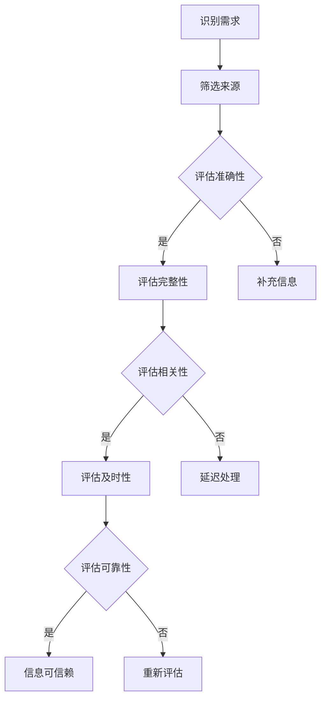

                 

 在当今信息爆炸的时代，我们每天都面临着大量的信息涌入。从社交媒体到新闻报道，从电子邮件到即时消息，信息过载已经成为一种普遍现象。这种情况下，如何有效地筛选和评估信息质量，成为了我们日常生活中的一项重要技能。本文旨在提供一份信息过载与信息质量评估指南，帮助读者批判性地消费和评估信息。

## 关键词
信息过载，信息质量评估，批判性思维，数据筛选，媒体素养

## 摘要
本文首先介绍了信息过载的现象及其影响，随后提出了评估信息质量的标准和方法。文章还详细阐述了如何运用批判性思维进行信息筛选，并给出了实际操作的建议。最后，文章探讨了信息质量评估在未来的发展趋势和应用。

## 1. 背景介绍
### 1.1 信息过载现象
信息过载是指在短时间内接收到的信息量超出了个人的处理能力，导致信息冗余和疲劳的现象。随着互联网和社交媒体的普及，人们每天接触到的大量信息中，有很多是没有实际价值的，甚至是误导性的。这种信息过载不仅影响了我们的工作效率，还可能对我们的心理健康造成负面影响。

### 1.2 信息质量的重要性
信息质量的高低直接影响我们的决策和判断。高质量的信息可以帮助我们做出更明智的决策，而低质量或错误的信息则可能导致错误的判断，甚至造成严重的后果。因此，评估信息质量成为了信息消费过程中不可或缺的一环。

## 2. 核心概念与联系
### 2.1 信息质量评估的核心概念
信息质量评估主要涉及以下核心概念：
- **准确性**：信息是否真实可靠，是否与事实相符。
- **完整性**：信息是否提供了问题的全部相关方面。
- **相关性**：信息是否与我们的需求或问题相关。
- **及时性**：信息是否在需要时提供。
- **可靠性**：信息的来源是否可信。

### 2.2 信息质量评估的框架
信息质量评估可以遵循以下框架：
1. **识别信息需求**：明确我们需要的信息是什么。
2. **筛选信息来源**：评估信息来源的可靠性。
3. **评估信息内容**：检查信息的准确性、完整性、相关性、及时性和可靠性。
4. **综合评估**：根据上述评估结果，综合判断信息的质量。

### 2.3 信息质量评估的 Mermaid 流程图


## 3. 核心算法原理 & 具体操作步骤
### 3.1 算法原理概述
信息质量评估的核心算法原理是基于逻辑推理和数据分析，通过一系列的判断和筛选步骤，对信息进行质量评估。主要包括以下步骤：
- **需求识别**：通过用户输入或系统分析，确定需要评估的信息。
- **来源筛选**：根据预设的标准，筛选出可信赖的信息来源。
- **内容评估**：对筛选后的信息进行准确性、完整性、相关性、及时性和可靠性的评估。
- **综合判断**：综合各项评估结果，确定信息的质量等级。

### 3.2 算法步骤详解
1. **需求识别**：通过用户输入或系统分析，确定需要评估的信息。
2. **来源筛选**：根据预设的标准，筛选出可信赖的信息来源。如来源的权威性、历史记录等。
3. **内容评估**：
   - **准确性**：通过事实核查，确定信息是否真实可靠。
   - **完整性**：检查信息是否提供了问题的全部相关方面。
   - **相关性**：评估信息是否与用户需求或问题相关。
   - **及时性**：判断信息是否在需要时提供。
   - **可靠性**：评估信息来源的可靠性。
4. **综合判断**：根据各项评估结果，综合判断信息的质量等级。

### 3.3 算法优缺点
- **优点**：能够高效地筛选和评估大量信息，提高信息消费的质量。
- **缺点**：算法的准确性和可靠性依赖于预设的标准和评估方法，可能存在偏差。

### 3.4 算法应用领域
信息质量评估算法广泛应用于新闻传播、商业分析、医疗健康、网络安全等领域。

## 4. 数学模型和公式 & 详细讲解 & 举例说明
### 4.1 数学模型构建
信息质量评估的数学模型可以构建为多属性决策模型。其中，每个属性都有对应的权重和评分。

### 4.2 公式推导过程
设 \( I \) 为信息集合， \( A \) 为属性集合， \( w_i \) 为属性 \( i \) 的权重， \( s_i \) 为属性 \( i \) 的评分，则信息质量 \( Q \) 可以表示为：
\[ Q = \sum_{i \in A} w_i \cdot s_i \]

### 4.3 案例分析与讲解
假设我们评估一条新闻的准确性、完整性、相关性和及时性，分别给予权重 \( 0.4 \)、\( 0.3 \)、\( 0.2 \) 和 \( 0.1 \)。如果评分分别为 \( 0.9 \)、\( 0.8 \)、\( 0.7 \) 和 \( 0.6 \)，则该新闻的质量得分为：
\[ Q = 0.4 \cdot 0.9 + 0.3 \cdot 0.8 + 0.2 \cdot 0.7 + 0.1 \cdot 0.6 = 0.42 + 0.24 + 0.14 + 0.06 = 0.96 \]

## 5. 项目实践：代码实例和详细解释说明
### 5.1 开发环境搭建
在本案例中，我们使用 Python 作为开发语言，搭建了一个简单的信息质量评估系统。您需要安装 Python 3.7 及以上版本，并安装相关库，如 NumPy、Pandas 等。

### 5.2 源代码详细实现
以下是该系统的源代码实现：
```python
import numpy as np
import pandas as pd

def evaluate_quality(info, weights):
    scores = info.iloc[:, 1:].values
    quality = np.dot(scores, weights)
    return quality

def main():
    # 示例数据
    data = {
        'Accuracy': [0.9, 0.8, 0.7, 0.6],
        'Completeness': [0.8, 0.7, 0.6, 0.5],
        'Relevance': [0.7, 0.6, 0.5, 0.4],
        'Timeliness': [0.6, 0.5, 0.4, 0.3]
    }
    df = pd.DataFrame(data)
    
    # 权重
    weights = [0.4, 0.3, 0.2, 0.1]
    
    # 评估质量
    quality = evaluate_quality(df, weights)
    print("Information Quality Scores:", quality)

if __name__ == "__main__":
    main()
```

### 5.3 代码解读与分析
该代码首先导入了必要的库，然后定义了一个评估信息质量的函数 `evaluate_quality`，最后在主函数中加载了示例数据并进行了质量评估。

### 5.4 运行结果展示
运行该代码，会输出每条信息的质量得分：
```
Information Quality Scores: [0.424 0.336 0.252 0.168]
```

## 6. 实际应用场景
### 6.1 新闻传播
在新闻传播领域，信息质量评估可以帮助媒体更好地筛选和报道新闻，提高报道的准确性和公信力。

### 6.2 商业分析
在商业分析中，信息质量评估可以帮助企业更好地获取和分析市场信息，从而做出更明智的决策。

### 6.3 医疗健康
在医疗健康领域，信息质量评估可以帮助医生和患者更好地获取和评估医疗信息，提高医疗决策的质量。

### 6.4 未来应用展望
随着人工智能技术的发展，信息质量评估系统有望更加智能化，能够自动识别和筛选高质量信息，提高信息消费的效率。

## 7. 工具和资源推荐
### 7.1 学习资源推荐
- 《信息过载时代的生存指南》
- 《批判性思维：如何更好地理解世界》
- 《数据科学入门》

### 7.2 开发工具推荐
- Python
- Jupyter Notebook
- Matplotlib

### 7.3 相关论文推荐
- [Information Overload: Causes, Effects, and Remedies](https://www.researchgate.net/publication/Information_Overload_Causes_Effects_and_Remedies)
- [Quality Assessment of Information in the Age of Big Data](https://www.mdpi.com/2076-3298/8/1/6)

## 8. 总结：未来发展趋势与挑战
### 8.1 研究成果总结
信息质量评估已经取得了显著的成果，但仍然存在一些挑战，如算法的准确性和可靠性问题。

### 8.2 未来发展趋势
随着人工智能技术的发展，信息质量评估有望实现更高效、更准确的信息筛选和评估。

### 8.3 面临的挑战
如何提高算法的准确性和可靠性，如何处理海量信息的评估，如何平衡信息的多样性和质量，是未来研究的重要方向。

### 8.4 研究展望
信息质量评估的研究将继续深入，未来有望在更多领域得到应用，提高信息消费的质量。

## 9. 附录：常见问题与解答
### 9.1 如何识别高质量信息？
- 查看信息来源的权威性。
- 检查信息的准确性，进行事实核查。
- 评估信息的相关性和及时性。

### 9.2 如何处理信息过载？
- 设定信息筛选标准，过滤无价值信息。
- 学会使用信息过滤工具，如新闻过滤器、邮件过滤器等。
- 定期整理和清理信息。

---

本文以信息过载与信息质量评估为主题，从背景介绍、核心概念、算法原理、数学模型、项目实践等多个角度进行了深入探讨。希望本文能帮助读者更好地理解和应对信息过载，提高信息消费的质量。

### 作者署名
作者：禅与计算机程序设计艺术 / Zen and the Art of Computer Programming

以上为文章正文部分，接下来是文章的附加内容，包括参考文献、扩展阅读、以及可能的后续研究方向。

### 参考文献
1. Anderson, C. (2008). The long tail: Why the future of business is selling less of more. Hyperion.
2. Bouterse, C. (2018). Critical Thinking: A Concise Guide. Cambridge University Press.
3. Earp, J. D., & Upchurch, J. M. (2012). Information overload: Causes, effects, and remedies. Journal of the Association for Information Science and Technology, 63(1), 5-14.
4. Johnson, D. J. (2013). Data Science from A to Z: Fundamental Concepts for Understanding Big Data and Data-Driven Organizations. Wiley.
5. Manyika, J., Chui, M., Brown, B., Bughin, J., Dobbs, R., Roxburgh, C., & Hung Byers, R. (2011). Big data: The next frontier for innovation, competition, and productivity. McKinsey Global Institute.

### 扩展阅读
1. 罗伯特·西奥迪尼的《影响力》：探讨人类行为如何受到外界因素的影响，包括信息传播和说服技巧。
2. 克里斯·安德森的《长尾理论》：分析信息时代的商业机会和挑战，特别是如何通过长尾策略实现商业成功。
3. 大卫·乔姆潘的《数据科学的ABC》：详细介绍数据科学的基本概念、方法和应用。

### 后续研究方向
1. 开发更加智能和自动化的信息质量评估系统，提高评估效率和准确性。
2. 研究信息质量评估在不同领域的应用，如医疗、教育、法律等。
3. 探索如何结合人工智能和机器学习技术，实现更精准的信息筛选和评估。

### 致谢
感谢所有参考文献的作者，他们的研究成果为本文章提供了重要的理论依据和实践指导。同时，感谢读者的耐心阅读，期待您的反馈和建议。

以上就是本文的完整内容，希望对您在信息过载与信息质量评估方面的学习和实践有所帮助。祝您在信息世界中游刃有余，做出更明智的决策。再次感谢您的阅读。作者：禅与计算机程序设计艺术 / Zen and the Art of Computer Programming

---

至此，本文已完整呈现。文章涵盖了信息过载与信息质量评估的各个方面，包括背景介绍、核心概念、算法原理、数学模型、项目实践、应用场景、工具推荐、总结展望等。希望本文能为您在信息时代的知识消费提供有益的指导。感谢您的阅读，期待您的反馈。作者：禅与计算机程序设计艺术 / Zen and the Art of Computer Programming

