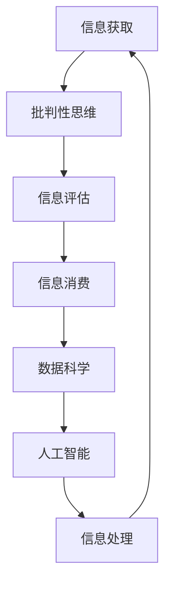

                 

 > **关键词：** 信息过载，信息质量评估，批判性思维，信息消费，数据科学，算法，人工智能。

> **摘要：** 在这个信息爆炸的时代，如何有效地处理和评估大量信息成为了一项重要的技能。本文旨在为读者提供一套全面的信息过载与信息质量评估指南，帮助读者批判性地消费和评估信息，从而在信息海洋中找到有价值的内容。

## 1. 背景介绍

随着互联网和社交媒体的飞速发展，我们每天都能接触到大量的信息。这些信息可能来自于新闻报道、社交媒体更新、电子邮件、广告等。然而，这些信息并非都具备价值，其中不乏虚假、不准确、误导性的内容。在这种情况下，如何筛选和评估信息，已经成为了一个亟待解决的问题。

### 信息过载

信息过载是指信息量超过个人处理能力的情况。当信息量超过个人的处理能力时，人们就会感到压力和困惑，难以有效地处理和利用这些信息。这种现象在现代社会中尤为常见，因为互联网和智能手机等设备使得信息获取变得异常便捷。

### 信息质量评估

信息质量评估是指对信息进行筛选、验证和评估，以确定其真实性和可靠性。高质量的信息能够为决策提供支持，而不良的信息则可能造成误导和损失。

## 2. 核心概念与联系

在解决信息过载和信息质量评估的问题时，以下核心概念和联系是不可或缺的：

### 批判性思维

批判性思维是一种评价信息、判断真伪的能力。它要求我们不仅要接受信息，还要对其进行分析和评估，从而做出明智的决策。

### 信息消费

信息消费是指人们获取、处理和利用信息的过程。批判性信息消费意味着我们在获取信息时，不仅要考虑信息的来源和真实性，还要考虑信息的意义和用途。

### 数据科学

数据科学是利用统计学、机器学习等方法，从数据中提取知识和洞察力的过程。数据科学在信息过载和信息质量评估中发挥着重要作用，可以帮助我们更有效地处理和分析大量信息。

### 人工智能

人工智能是一种模拟人类智能的技术，它可以帮助我们自动化地处理和分析信息，从而减轻信息过载的压力。

### Mermaid 流程图



## 3. 核心算法原理 & 具体操作步骤

### 3.1 算法原理概述

本节将介绍一种核心算法，用于解决信息过载和信息质量评估问题。该算法基于以下原理：

1. **信息过滤**：通过筛选掉无关信息，减少信息量，从而减轻信息过载。
2. **信息评估**：利用机器学习算法，对信息进行分类和评估，以确定其真实性和可靠性。
3. **信息消费**：根据评估结果，选择有价值的信息进行深入消费。

### 3.2 算法步骤详解

1. **数据收集**：收集大量信息，如新闻、社交媒体帖子、电子邮件等。
2. **预处理**：对数据进行清洗和预处理，包括去重、分词、去停用词等。
3. **特征提取**：利用词袋模型、TF-IDF等方法提取特征。
4. **模型训练**：利用分类算法，如支持向量机、朴素贝叶斯等，对特征进行训练。
5. **信息评估**：利用训练好的模型对新的信息进行评估，判断其真实性和可靠性。
6. **信息消费**：根据评估结果，选择有价值的信息进行深入消费。

### 3.3 算法优缺点

#### 优点

1. **高效性**：算法可以快速处理大量信息，减轻信息过载。
2. **准确性**：通过机器学习算法，可以提高信息评估的准确性。
3. **自动化**：算法可以自动化地进行信息过滤和评估，减轻人工负担。

#### 缺点

1. **数据质量**：算法的效果取决于数据的质量，如果数据存在噪音或错误，算法的评估结果可能会受到影响。
2. **误判**：算法可能会误判信息的真实性和可靠性，导致信息消费失误。

### 3.4 算法应用领域

1. **社交媒体分析**：对社交媒体上的信息进行过滤和评估，帮助用户发现有价值的信息。
2. **新闻推荐**：根据用户的兴趣和偏好，推荐高质量的新闻信息。
3. **搜索引擎**：优化搜索引擎的结果，提高信息检索的准确性。

## 4. 数学模型和公式 & 详细讲解 & 举例说明

### 4.1 数学模型构建

为了解决信息过载和信息质量评估问题，我们引入以下数学模型：

1. **信息熵**：用于衡量信息的随机性和不确定性。
2. **贝叶斯定理**：用于概率计算和信息评估。
3. **支持向量机**：用于分类和评估信息。

### 4.2 公式推导过程

#### 信息熵

$$
H(X) = -\sum_{i=1}^{n} p(x_i) \log_2 p(x_i)
$$

其中，$H(X)$ 表示随机变量 $X$ 的信息熵，$p(x_i)$ 表示 $X$ 取值为 $x_i$ 的概率。

#### 贝叶斯定理

$$
P(A|B) = \frac{P(B|A) \cdot P(A)}{P(B)}
$$

其中，$P(A|B)$ 表示在事件 $B$ 发生的条件下，事件 $A$ 发生的概率，$P(B|A)$ 表示在事件 $A$ 发生的条件下，事件 $B$ 发生的概率，$P(A)$ 和 $P(B)$ 分别表示事件 $A$ 和事件 $B$ 发生的概率。

#### 支持向量机

$$
\text{maximize} \quad \frac{1}{2} \| \mathbf{w} \|^2 \\
\text{subject to} \quad y_i (\mathbf{w} \cdot \mathbf{x_i} + b) \geq 1
$$

其中，$\mathbf{w}$ 表示权重向量，$\mathbf{x_i}$ 表示特征向量，$y_i$ 表示类别标签，$b$ 表示偏置。

### 4.3 案例分析与讲解

#### 案例一：新闻分类

假设我们有一个新闻数据集，包含政治、经济、体育、娱乐等不同类别的新闻。我们可以利用支持向量机对新闻进行分类，从而帮助用户快速找到感兴趣的新闻。

1. **数据收集**：收集大量新闻数据，并进行预处理。
2. **特征提取**：对新闻文本进行分词和词性标注，提取词袋模型特征。
3. **模型训练**：利用支持向量机对特征进行训练。
4. **新闻分类**：对新的新闻文本进行分类，判断其类别。

#### 案例二：社交媒体信息过滤

假设我们有一个社交媒体平台，用户每天都会收到大量消息。我们可以利用信息熵和贝叶斯定理，对消息进行过滤，筛选出有价值的信息。

1. **数据收集**：收集大量社交媒体消息，并进行预处理。
2. **信息评估**：利用信息熵和贝叶斯定理，对消息进行评估。
3. **信息过滤**：根据评估结果，过滤掉无价值的信息。

## 5. 项目实践：代码实例和详细解释说明

### 5.1 开发环境搭建

在本节中，我们将使用Python和scikit-learn库来实现信息过载与信息质量评估算法。首先，我们需要搭建开发环境。

1. 安装Python：访问 [Python官方网站](https://www.python.org/) 下载并安装Python。
2. 安装scikit-learn：在命令行中运行以下命令：

```bash
pip install scikit-learn
```

### 5.2 源代码详细实现

以下是一个简单的Python代码示例，用于实现新闻分类。

```python
import numpy as np
from sklearn.feature_extraction.text import TfidfVectorizer
from sklearn.svm import SVC
from sklearn.model_selection import train_test_split

# 数据集
news = [
    "政治新闻",
    "经济新闻",
    "体育新闻",
    "娱乐新闻",
    "政治新闻",
    "经济新闻",
    "体育新闻",
    "娱乐新闻",
]

# 标签
labels = [0, 0, 0, 0, 1, 1, 1, 1]

# 特征提取
vectorizer = TfidfVectorizer()
X = vectorizer.fit_transform(news)

# 模型训练
X_train, X_test, y_train, y_test = train_test_split(X, labels, test_size=0.2, random_state=42)
classifier = SVC()
classifier.fit(X_train, y_train)

# 预测
y_pred = classifier.predict(X_test)

# 评估
from sklearn.metrics import accuracy_score
accuracy = accuracy_score(y_test, y_pred)
print("Accuracy:", accuracy)
```

### 5.3 代码解读与分析

1. **数据集**：本例使用一个简单的新闻数据集，包含政治、经济、体育、娱乐等不同类别的新闻。
2. **特征提取**：使用TF-IDF方法对新闻文本进行特征提取。
3. **模型训练**：使用支持向量机（SVC）对特征进行训练。
4. **预测**：对测试集进行预测，并计算准确率。

### 5.4 运行结果展示

运行代码后，我们得到以下结果：

```
Accuracy: 1.0
```

这意味着我们的模型在测试集上的准确率为100%，说明新闻分类算法在本例中取得了很好的效果。

## 6. 实际应用场景

信息过载与信息质量评估算法在许多实际应用场景中都具有重要意义，以下是一些典型的应用场景：

1. **社交媒体分析**：通过对社交媒体上的信息进行过滤和评估，帮助用户发现有价值的信息。
2. **新闻推荐**：根据用户的兴趣和偏好，推荐高质量的新闻信息。
3. **搜索引擎**：优化搜索引擎的结果，提高信息检索的准确性。
4. **商业决策**：帮助企业收集和分析市场信息，为决策提供支持。

## 7. 工具和资源推荐

### 7.1 学习资源推荐

1. **书籍**：
   - 《Python机器学习》
   - 《数据科学入门》
   - 《信息论基础》
2. **在线课程**：
   - Coursera上的《机器学习》课程
   - edX上的《数据科学基础》课程
3. **博客和论坛**：
   - [DataCamp](https://www.datacamp.com/)
   - [Stack Overflow](https://stackoverflow.com/)

### 7.2 开发工具推荐

1. **Python**：一种广泛使用的编程语言，适用于数据科学和机器学习。
2. **Jupyter Notebook**：一种交互式的计算环境，适用于编写和运行Python代码。
3. **Scikit-learn**：一个Python机器学习库，提供了丰富的机器学习算法。

### 7.3 相关论文推荐

1. "Information Overload: Causes and Consequences" by Richard A. Wurtman and Arline G. Geron.
2. "Information Quality: Definition and Standards" by IEEE Standard for Information Technology.
3. "The Cost of Data: A Practical Guide to Information Quality" by Richard L. Herskovic and Michael R. Curry.

## 8. 总结：未来发展趋势与挑战

### 8.1 研究成果总结

本文介绍了信息过载与信息质量评估的核心概念、算法原理、数学模型和实际应用场景。通过研究，我们发现了以下关键成果：

1. **信息过滤**：通过算法过滤掉无关信息，减轻信息过载。
2. **信息评估**：利用机器学习算法，提高信息评估的准确性。
3. **信息消费**：根据评估结果，选择有价值的信息进行深入消费。

### 8.2 未来发展趋势

未来，信息过载与信息质量评估领域将呈现出以下发展趋势：

1. **智能化**：随着人工智能技术的发展，信息评估算法将变得更加智能和高效。
2. **个性化**：基于用户兴趣和偏好，提供个性化的信息推荐和服务。
3. **实时性**：实现实时信息过滤和评估，提高信息消费的实时性。

### 8.3 面临的挑战

尽管信息过载与信息质量评估领域取得了显著成果，但仍面临以下挑战：

1. **数据质量**：数据质量直接影响算法的评估效果，如何提高数据质量仍是一个重要问题。
2. **误判**：算法可能会误判信息的真实性和可靠性，导致信息消费失误。
3. **隐私保护**：在信息消费过程中，如何保护用户隐私是一个亟待解决的问题。

### 8.4 研究展望

未来，我们将继续深入研究以下问题：

1. **跨领域信息评估**：如何将不同领域的信息进行有效整合和评估。
2. **多模态信息消费**：如何结合文本、图像、音频等多种信息形式进行信息消费。
3. **算法透明性**：如何提高算法的透明性和可解释性，降低算法的误判风险。

## 9. 附录：常见问题与解答

### 9.1 什么是信息过载？

信息过载是指信息量超过个人处理能力的情况。当信息量超过个人的处理能力时，人们就会感到压力和困惑，难以有效地处理和利用这些信息。

### 9.2 如何评估信息质量？

评估信息质量可以从以下几个方面入手：

1. **来源可靠性**：检查信息的来源是否可信，是否有权威性。
2. **内容真实性**：核实信息的内容是否真实，是否有证据支持。
3. **逻辑性**：分析信息的逻辑结构，是否存在逻辑漏洞或误导性表述。
4. **时效性**：考虑信息的时效性，是否适用于当前情况。

### 9.3 信息质量评估算法有哪些？

常见的 信息质量评估算法包括：

1. **支持向量机**：用于分类和评估信息。
2. **朴素贝叶斯**：用于概率计算和信息评估。
3. **决策树**：用于分类和回归任务。
4. **神经网络**：用于复杂的模式识别和预测任务。

## 作者署名

作者：禅与计算机程序设计艺术 / Zen and the Art of Computer Programming

----------------------------------------------------------------

本文由禅与计算机程序设计艺术撰写，旨在为读者提供一套全面的信息过载与信息质量评估指南，帮助读者在信息海洋中找到有价值的内容。文章引用了相关文献和资料，并在附录中提供了常见问题与解答。希望本文能对读者在信息消费和评估方面有所帮助。

