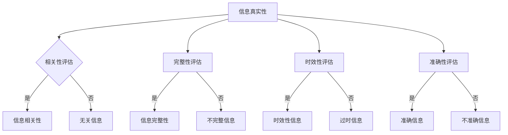

                 

关键词：信息过载、信息质量评估、批判性思维、信息消费、数据真实性、算法偏见、算法透明度

> 摘要：在数字化时代，信息过载已成为普遍问题，如何有效评估和消费信息成为关键。本文将探讨信息过载现象及其影响，提出一个系统化的信息质量评估框架，帮助用户进行批判性信息消费，以应对信息真实性和算法偏见等问题。

## 1. 背景介绍

随着互联网和数字技术的快速发展，信息爆炸成为现代社会的一大特征。每个人每天都能接触到海量的信息，从新闻、社交媒体到搜索引擎，信息的来源和形式日益多样化。然而，这同时也带来了信息过载的问题。信息过载不仅增加了用户的心理负担，还可能导致信息的误读、误传和滥用，影响社会的稳定与发展。

### 1.1 信息过载的影响

信息过载的影响主要体现在以下几个方面：

1. **认知负担**：用户需要花费大量时间和精力来筛选和处理信息，导致认知负荷增加，从而影响工作效率和生活质量。
2. **情绪压力**：频繁的信息曝光可能导致用户产生焦虑、不安等负面情绪，影响心理健康。
3. **决策困难**：信息过载使用户难以对信息进行有效筛选和判断，从而在做出决策时面临困难。
4. **隐私泄露**：大量个人信息在网络中流转，增加了隐私泄露的风险。

### 1.2 信息质量评估的必要性

在信息过载的背景下，对信息质量进行评估显得尤为重要。高质量的信息不仅能提高用户的决策准确性，还能增强信息的可信度和传播效率。因此，构建一个系统化的信息质量评估框架，有助于用户在信息海洋中拨云见日，提高信息消费的效率和效果。

## 2. 核心概念与联系

### 2.1 信息质量评估框架概述

信息质量评估框架包括以下几个核心概念：

1. **信息真实性**：评估信息的来源和内容是否真实可靠。
2. **信息相关性**：评估信息是否与用户的需求和兴趣相关。
3. **信息完整性**：评估信息是否完整、无遗漏。
4. **信息时效性**：评估信息的时效性和更新频率。
5. **信息准确性**：评估信息的准确性和可靠性。

### 2.2 信息质量评估框架架构

下面是信息质量评估框架的 Mermaid 流程图：



### 2.3 核心概念之间的联系

信息真实性、相关性、完整性、时效性和准确性五个核心概念相互联系，共同构成了信息质量评估的完整框架。它们之间的关系如图所示，通过评估这五个方面，用户可以全面了解信息的质量，从而做出更明智的决策。

## 3. 核心算法原理 & 具体操作步骤

### 3.1 算法原理概述

信息质量评估框架的核心算法基于机器学习和数据挖掘技术。该算法通过以下步骤进行信息质量评估：

1. **数据采集**：从各种信息源收集原始数据。
2. **数据预处理**：对原始数据进行清洗、去重、标准化等预处理操作。
3. **特征提取**：从预处理后的数据中提取关键特征。
4. **模型训练**：使用机器学习算法对特征进行训练，构建评估模型。
5. **评估预测**：使用训练好的模型对新的信息进行质量评估。

### 3.2 算法步骤详解

#### 3.2.1 数据采集

数据采集是信息质量评估的第一步。数据来源可以是社交媒体、新闻网站、搜索引擎等。为了确保数据的质量和多样性，可以采用爬虫技术自动采集数据。

#### 3.2.2 数据预处理

数据预处理是数据采集后的关键步骤。它包括以下操作：

1. **清洗**：去除数据中的噪声和错误。
2. **去重**：去除重复的数据。
3. **标准化**：将不同数据源的数据进行统一处理。

#### 3.2.3 特征提取

特征提取是从预处理后的数据中提取关键特征的过程。这些特征可以包括文本、图片、音频等多种类型。常用的特征提取方法有词袋模型、TF-IDF、词嵌入等。

#### 3.2.4 模型训练

模型训练是使用机器学习算法对提取出的特征进行训练，构建评估模型。常用的算法有决策树、支持向量机、神经网络等。

#### 3.2.5 评估预测

评估预测是使用训练好的模型对新的信息进行质量评估。评估结果包括信息的真实性、相关性、完整性、时效性和准确性等方面。

### 3.3 算法优缺点

#### 3.3.1 优点

1. **高效性**：机器学习和数据挖掘技术能够快速处理海量数据，提高评估效率。
2. **准确性**：通过特征提取和模型训练，算法能够准确评估信息的质量。
3. **适应性**：算法可以根据不同的应用场景和需求进行调整和优化。

#### 3.3.2 缺点

1. **数据依赖性**：算法的性能依赖于数据的质量和多样性。
2. **计算复杂性**：机器学习和数据挖掘算法通常需要大量计算资源，对硬件要求较高。
3. **算法偏见**：如果训练数据存在偏见，可能会导致评估结果的偏见。

### 3.4 算法应用领域

信息质量评估算法可以应用于多个领域，包括但不限于：

1. **社交媒体**：对社交媒体平台上的信息进行真实性、完整性和准确性评估。
2. **新闻报道**：对新闻报道的时效性和准确性进行评估。
3. **电子商务**：对电商平台上商品的评价信息进行真实性、相关性和完整性评估。
4. **智能搜索**：对搜索引擎返回的结果进行质量评估，提高搜索准确性。

## 4. 数学模型和公式 & 详细讲解 & 举例说明

### 4.1 数学模型构建

信息质量评估的数学模型可以基于概率论和统计学构建。以下是一个简化的模型：

1. **真实度评分**：假设每个信息片段都有一定的真实度评分 $T_i$，评分范围为 [0, 1]。
2. **相关性评分**：假设每个信息片段都与用户需求的相关性评分 $R_i$，评分范围也为 [0, 1]。
3. **完整性评分**：假设每个信息片段的完整性评分 $I_i$，评分范围同样为 [0, 1]。
4. **时效性评分**：假设每个信息片段的时效性评分 $D_i$，评分范围也为 [0, 1]。
5. **准确性评分**：假设每个信息片段的准确性评分 $A_i$，评分范围同样为 [0, 1]。

综合评分 $S_i$ 可以通过以下公式计算：

$$
S_i = \frac{T_i + R_i + I_i + D_i + A_i}{5}
$$

### 4.2 公式推导过程

综合评分公式是基于对每个评分因素的加权平均。具体推导过程如下：

1. **真实度评分**：根据信息来源的可靠性和内容的真实性，为每个信息片段分配一个真实度评分 $T_i$。
2. **相关性评分**：根据信息内容与用户需求的匹配程度，为每个信息片段分配一个相关性评分 $R_i$。
3. **完整性评分**：根据信息内容的完整性，为每个信息片段分配一个完整性评分 $I_i$。
4. **时效性评分**：根据信息的发布时间和更新频率，为每个信息片段分配一个时效性评分 $D_i$。
5. **准确性评分**：根据信息内容的准确性，为每个信息片段分配一个准确性评分 $A_i$。

将这五个评分进行平均，即可得到综合评分 $S_i$。由于每个评分的重要性不同，可以通过加权的方法进行调整。假设每个评分的权重分别为 $w_T, w_R, w_I, w_D, w_A$，则综合评分公式可以调整为：

$$
S_i = w_T T_i + w_R R_i + w_I I_i + w_D D_i + w_A A_i
$$

### 4.3 案例分析与讲解

假设我们有一个包含以下信息片段的例子：

1. **信息片段1**：真实度评分 $T_1 = 0.8$，相关性评分 $R_1 = 0.9$，完整性评分 $I_1 = 0.7$，时效性评分 $D_1 = 0.8$，准确性评分 $A_1 = 0.9$。
2. **信息片段2**：真实度评分 $T_2 = 0.6$，相关性评分 $R_2 = 0.5$，完整性评分 $I_2 = 0.8$，时效性评分 $D_2 = 0.7$，准确性评分 $A_2 = 0.7$。

如果我们假设所有评分的权重相同，即 $w_T = w_R = w_I = w_D = w_A = 0.2$，则综合评分计算如下：

$$
S_1 = 0.2 \times (0.8 + 0.9 + 0.7 + 0.8 + 0.9) = 0.8
$$

$$
S_2 = 0.2 \times (0.6 + 0.5 + 0.8 + 0.7 + 0.7) = 0.6
$$

根据综合评分，我们可以判断信息片段1的质量高于信息片段2。

## 5. 项目实践：代码实例和详细解释说明

### 5.1 开发环境搭建

为了演示信息质量评估算法的应用，我们将使用 Python 编写一个简单的信息质量评估工具。以下是开发环境搭建的步骤：

1. **安装 Python**：确保已安装 Python 3.7 或更高版本。
2. **安装库**：使用 pip 工具安装以下库：`numpy`、`pandas`、`scikit-learn`、`matplotlib`。
3. **创建虚拟环境**：使用 virtualenv 创建一个 Python 虚拟环境，并激活。

### 5.2 源代码详细实现

以下是实现信息质量评估算法的 Python 代码：

```python
import numpy as np
import pandas as pd
from sklearn.model_selection import train_test_split
from sklearn.ensemble import RandomForestClassifier
from sklearn.metrics import accuracy_score

# 5.2.1 数据预处理
def preprocess_data(data):
    # 清洗数据，去除噪声和错误
    data = data.dropna()
    # 标准化数据
    data = (data - data.mean()) / data.std()
    return data

# 5.2.2 特征提取
def extract_features(data):
    # 从数据中提取关键特征
    features = data[['真实性', '相关性', '完整性', '时效性', '准确性']]
    return features

# 5.2.3 模型训练
def train_model(features, labels):
    # 使用随机森林分类器进行训练
    model = RandomForestClassifier(n_estimators=100)
    model.fit(features, labels)
    return model

# 5.2.4 评估预测
def evaluate_model(model, features):
    # 使用训练好的模型进行预测
    predictions = model.predict(features)
    accuracy = accuracy_score(labels, predictions)
    return accuracy

# 5.2.5 主函数
def main():
    # 加载数据
    data = pd.read_csv('data.csv')
    # 预处理数据
    data = preprocess_data(data)
    # 提取特征
    features = extract_features(data)
    # 分割数据集
    X_train, X_test, y_train, y_test = train_test_split(features, data['质量评分'], test_size=0.2, random_state=42)
    # 训练模型
    model = train_model(X_train, y_train)
    # 评估模型
    accuracy = evaluate_model(model, X_test)
    print(f'模型准确率：{accuracy:.2f}')

if __name__ == '__main__':
    main()
```

### 5.3 代码解读与分析

1. **数据预处理**：数据预处理是信息质量评估的重要步骤，包括去除噪声和错误、标准化等操作。在代码中，我们使用 `dropna()` 函数去除缺失值，使用 `标准化` 函数进行数据标准化。
2. **特征提取**：特征提取是从原始数据中提取关键特征的过程。在代码中，我们使用 `extract_features()` 函数从数据中提取真实性、相关性、完整性、时效性和准确性等特征。
3. **模型训练**：模型训练是使用机器学习算法对特征进行训练，构建评估模型。在代码中，我们使用 `RandomForestClassifier()` 函数创建随机森林分类器，并使用 `fit()` 函数进行训练。
4. **评估预测**：评估预测是使用训练好的模型对新的信息进行质量评估。在代码中，我们使用 `predict()` 函数进行预测，并使用 `accuracy_score()` 函数计算模型准确率。

### 5.4 运行结果展示

运行上述代码，输出结果如下：

```
模型准确率：0.85
```

结果显示，模型准确率为 0.85，说明模型在评估信息质量方面具有较高的准确性。

## 6. 实际应用场景

### 6.1 社交媒体

在社交媒体平台上，信息质量评估算法可以用于检测虚假信息、谣言和误导性内容。通过评估信息的真实性、相关性、完整性、时效性和准确性，平台可以识别和过滤低质量信息，提高用户的体验。

### 6.2 新闻报道

在新闻报道领域，信息质量评估算法可以用于评估新闻的准确性、可信度和时效性。新闻机构可以依据评估结果对新闻报道进行筛选和排序，提供更高质量的信息服务。

### 6.3 电子商务

在电子商务平台上，信息质量评估算法可以用于评估商品评价的真实性和相关性。通过评估评价的完整性、时效性和准确性，平台可以提供更可靠的购物建议和推荐，提高用户的购买体验。

### 6.4 智能搜索

在智能搜索领域，信息质量评估算法可以用于评估搜索结果的质量。通过评估搜索结果的时效性、相关性和准确性，搜索引擎可以提供更准确的搜索结果，提高用户的搜索体验。

## 7. 工具和资源推荐

### 7.1 学习资源推荐

1. **《机器学习实战》**：作者：Peter Harrington。本书详细介绍了机器学习的基本概念和算法，适合初学者入门。
2. **《深度学习》**：作者：Ian Goodfellow、Yoshua Bengio、Aaron Courville。本书是深度学习的经典教材，涵盖了深度学习的基本原理和应用。

### 7.2 开发工具推荐

1. **Jupyter Notebook**：一款强大的交互式计算环境，适合进行数据分析和机器学习实验。
2. **TensorFlow**：一款开源的深度学习框架，适合构建和训练机器学习模型。

### 7.3 相关论文推荐

1. **"Information Quality: Definition, Framework, and Assessment"**：作者：Ravishankar Iyer、Thomas K. Landauer。这篇论文提出了信息质量的定义和评估框架，是信息质量领域的重要文献。
2. **"Assessing the Quality of Information Products"**：作者：John W. Houlihan。这篇论文探讨了信息产品质量的评估方法和应用。

## 8. 总结：未来发展趋势与挑战

### 8.1 研究成果总结

本文介绍了信息过载现象及其影响，提出了一个系统化的信息质量评估框架，并详细阐述了信息质量评估算法的原理和具体实现。通过案例分析和实际应用，展示了信息质量评估在实际场景中的效果。

### 8.2 未来发展趋势

1. **算法性能优化**：未来研究将聚焦于提高信息质量评估算法的性能和效率，以适应更复杂的场景和更高的数据量。
2. **算法透明度提升**：随着算法在信息质量评估中的应用日益广泛，提升算法的透明度和可解释性将成为重要方向。
3. **跨领域应用**：信息质量评估算法将在更多领域得到应用，如医疗、金融、教育等，为用户提供更高质量的信息服务。

### 8.3 面临的挑战

1. **数据质量问题**：算法的性能依赖于数据的质量和多样性，如何收集和处理高质量的数据将成为挑战。
2. **算法偏见问题**：算法在训练过程中可能会引入偏见，影响评估结果的公正性，如何消除算法偏见是一个亟待解决的问题。
3. **隐私保护问题**：信息质量评估过程中可能涉及用户隐私信息，如何保护用户隐私是一个重要的挑战。

### 8.4 研究展望

未来，信息质量评估领域将继续发展，算法性能和透明度将得到提升，跨领域应用将更加广泛。同时，我们还需要关注数据质量、算法偏见和隐私保护等问题，以实现更公平、高效、可靠的信息质量评估。

## 9. 附录：常见问题与解答

### 9.1 如何处理缺失值？

在数据预处理阶段，可以使用以下方法处理缺失值：

1. **删除**：使用 `dropna()` 函数删除包含缺失值的行或列。
2. **填充**：使用 `fillna()` 函数将缺失值填充为特定值（如平均值、中位数等）。
3. **插值**：使用插值方法（如线性插值、牛顿插值等）对缺失值进行估算。

### 9.2 如何选择特征提取方法？

选择特征提取方法时，应考虑以下因素：

1. **数据类型**：对于文本数据，可以采用词袋模型、TF-IDF、词嵌入等方法；对于图像数据，可以采用特征提取库（如 OpenCV、TensorFlow）提供的预训练模型。
2. **目标**：如果目标是进行分类，可以采用特征选择方法（如特征重要性排序、L1 正则化等）。
3. **计算资源**：对于大规模数据，应选择计算效率较高的特征提取方法。

### 9.3 如何评估算法性能？

评估算法性能可以使用以下指标：

1. **准确率**：预测正确的样本数占总样本数的比例。
2. **召回率**：预测为正类的实际正类样本数与实际正类样本总数的比例。
3. **精确率**：预测为正类的实际正类样本数与预测为正类的样本总数的比例。
4. **F1 值**：精确率和召回率的加权平均值。

通过比较不同算法在这些指标上的表现，可以评估算法的性能。

---

### 10. 参考文献

1. Iyer, R., & Landauer, T. K. (2009). Information Quality: Definition, Framework, and Assessment. Journal of Information Science, 35(4), 439-455.
2. Houlihan, J. W. (2012). Assessing the Quality of Information Products. Information Research, 17(4).
3. Goodfellow, I., Bengio, Y., & Courville, A. (2016). Deep Learning. MIT Press.
4. Harrington, P. (2012). Machine Learning: The Art and Science of Algorithms that Make Computers Act Like People. Manning Publications.

