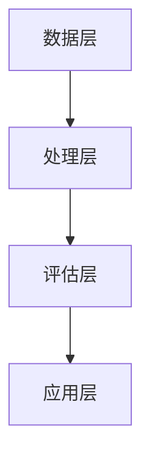

                 

关键词：信息过载、信息质量评估、批判性思维、信息消费、数据处理、人工智能、算法

> 摘要：在当今信息爆炸的时代，我们面临着前所未有的信息过载问题。如何有效评估和消费信息，成为了我们日常生活和工作中必须掌握的技能。本文将探讨信息过载现象，介绍信息质量评估的核心概念和方法，并通过实例分析，帮助读者掌握批判性地评估和消费信息的能力。

## 1. 背景介绍

随着互联网和移动互联网的普及，信息传播的速度和范围都得到了空前的提升。人们可以随时随地获取到海量的信息，然而，这也带来了信息过载的问题。信息过载指的是信息量过多，超出了人们处理和消化的能力。这不仅给人们的生活和工作带来了困扰，还可能对心理健康产生负面影响。

面对信息过载，我们需要具备批判性地评估和消费信息的能力。批判性评估指的是对信息的来源、真实性、可靠性、相关性等方面进行深入分析和判断，从而确定其价值。消费信息则是指在接受和处理信息的过程中，能够有效地筛选、整合和应用信息，为己所用。

本文将从以下几个方面展开讨论：

- 信息过载现象及其影响
- 信息质量评估的核心概念
- 批判性评估和消费信息的具体方法
- 信息质量评估的应用领域
- 未来发展趋势与挑战

通过本文的探讨，希望能够帮助读者更好地应对信息过载，提升信息消费的质量和效率。

## 2. 核心概念与联系

在讨论信息过载与信息质量评估之前，我们需要明确一些核心概念，以便建立一个清晰的理论框架。

### 2.1 信息质量

信息质量是指信息的准确性、完整性、可靠性、及时性、相关性等方面的特性。一个高质量的信息应该具备以下特点：

- **准确性**：信息应真实反映事实，无虚假成分。
- **完整性**：信息应包含所有必要的数据和细节，无遗漏。
- **可靠性**：信息来源可靠，可信度高。
- **及时性**：信息更新及时，反映当前情况。
- **相关性**：信息与需求或应用场景高度相关。

### 2.2 信息过载

信息过载是指信息量过多，超出了人们处理和消化的能力。其表现为以下几个方面：

- **信息过量**：每天接收到的信息量远远超过人类大脑的处理能力。
- **信息冗余**：大量重复的信息占据了我们有限的注意力和时间。
- **信息噪音**：无关或虚假的信息干扰了我们对有用信息的识别和处理。

### 2.3 批判性思维

批判性思维是指对信息进行深入分析、评估和判断的能力。它包括以下几个步骤：

- **分析**：对信息进行分解，理解其内在逻辑和结构。
- **评估**：对信息的可信度、准确性、相关性等方面进行评价。
- **判断**：根据分析结果，作出合理和理性的决策。

### 2.4 信息质量评估的架构

为了更好地理解信息质量评估，我们可以将其分为以下几个层次：

- **数据层**：收集和存储各种信息。
- **处理层**：对信息进行清洗、整合和分析。
- **评估层**：根据信息质量标准，对信息进行评估。
- **应用层**：将评估后的信息应用于实际场景，如决策、学习等。

下面是信息质量评估的 Mermaid 流程图，展示了上述层次之间的关系。



通过以上核心概念的介绍，我们为后续的内容讨论奠定了基础。在接下来的章节中，我们将深入探讨信息质量评估的具体方法和技术。

## 3. 核心算法原理 & 具体操作步骤

### 3.1 算法原理概述

信息质量评估的核心算法通常基于统计学、机器学习和自然语言处理等技术。以下是几种常见的算法原理：

- **统计学方法**：通过计算信息的准确率、召回率、F1 值等指标，对信息质量进行量化评估。
- **机器学习方法**：利用监督学习、无监督学习和强化学习等方法，训练模型对信息质量进行预测和评估。
- **自然语言处理**：通过文本分析、情感分析、实体识别等技术，对信息的可信度、相关性等方面进行深入分析。

### 3.2 算法步骤详解

以下是一个基于机器学习方法的信息质量评估算法的详细步骤：

1. **数据收集**：收集大量标注过的信息样本，包括高质信息和低质信息。
2. **数据预处理**：对收集的数据进行清洗、去重和处理，提取特征向量。
3. **特征选择**：通过特征选择方法，选择对信息质量有显著影响的特征。
4. **模型训练**：利用监督学习方法，如决策树、支持向量机、神经网络等，训练评估模型。
5. **模型评估**：使用交叉验证、A/B 测试等方法，评估模型的准确性和可靠性。
6. **应用模型**：将训练好的模型应用于实际场景，对信息进行质量评估。

### 3.3 算法优缺点

- **优点**：
  - **高效性**：机器学习算法能够自动学习信息质量评估的规律，提高评估的效率和准确性。
  - **可扩展性**：通过引入新的数据和特征，模型可以不断优化和改进。
  - **灵活性**：可以应用于多种信息类型和质量评估场景。

- **缺点**：
  - **数据依赖性**：模型的训练依赖于大量的标注数据，数据质量和数量对模型性能有很大影响。
  - **计算成本**：训练大规模的机器学习模型需要较高的计算资源和时间。
  - **解释性不足**：许多机器学习算法的黑箱特性，使得评估结果难以解释和理解。

### 3.4 算法应用领域

信息质量评估算法在多个领域都有广泛应用：

- **社交媒体**：评估社交媒体平台上的信息质量，过滤虚假信息和谣言。
- **电子商务**：评估商品评价和用户评论的质量，为消费者提供准确的参考。
- **新闻媒体**：评估新闻报道的准确性和可信度，提高媒体的公信力。
- **科学研究**：评估学术论文和研究报告的质量，优化科研资源的配置。

通过以上对核心算法原理和具体操作步骤的介绍，我们可以更好地理解信息质量评估的方法和技术。在接下来的章节中，我们将进一步探讨数学模型和公式，为信息质量评估提供更加精细的分析工具。

### 4. 数学模型和公式 & 详细讲解 & 举例说明

信息质量评估不仅仅是基于算法和技术的任务，它同样离不开数学模型和公式的支持。数学模型和公式为信息质量评估提供了量化的手段，使得评估过程更加科学和系统。在本节中，我们将详细讲解信息质量评估中常用的数学模型和公式，并通过具体案例进行说明。

#### 4.1 数学模型构建

信息质量评估的数学模型通常包括以下几个方面：

1. **评估指标模型**：
   - **准确率**：准确率是评估信息质量最常用的指标之一，表示预测为高质信息的样本中，实际为高质信息的比例。
     $$ \text{准确率} = \frac{\text{预测为高质且实际为高质}}{\text{预测为高质}} $$

   - **召回率**：召回率表示实际为高质信息的样本中，被预测为高质信息的比例。
     $$ \text{召回率} = \frac{\text{预测为高质且实际为高质}}{\text{实际为高质}} $$

   - **F1 值**：F1 值是准确率和召回率的调和平均值，用于综合考虑两者的平衡。
     $$ \text{F1 值} = 2 \times \frac{\text{准确率} \times \text{召回率}}{\text{准确率} + \text{召回率}} $$

2. **损失函数模型**：
   - **均方误差（MSE）**：均方误差用于衡量预测值与真实值之间的差异。
     $$ \text{MSE} = \frac{1}{n}\sum_{i=1}^{n} (\hat{y}_i - y_i)^2 $$

   - **交叉熵（Cross-Entropy）**：交叉熵用于衡量分类问题的预测损失。
     $$ \text{交叉熵} = -\sum_{i=1}^{n} y_i \log(\hat{y}_i) $$

3. **优化模型**：
   - **梯度下降**：梯度下降是一种优化算法，用于最小化损失函数。
     $$ w_{t+1} = w_t - \alpha \nabla_w J(w_t) $$
     其中，\( w_t \) 表示当前权重，\( \alpha \) 表示学习率，\( \nabla_w J(w_t) \) 表示损失函数 \( J \) 对权重 \( w \) 的梯度。

#### 4.2 公式推导过程

1. **准确率的推导**：

   准确率的定义是预测为高质且实际为高质的比例。假设我们有一个二元分类问题，其中 \( y \) 表示实际标签（0表示低质，1表示高质），\( \hat{y} \) 表示预测标签。那么，准确率可以表示为：
   $$ \text{准确率} = \frac{\sum_{i=1}^{n} (\hat{y}_i = 1 \land y_i = 1)}{\sum_{i=1}^{n} \hat{y}_i = 1} $$
   通过简化，我们得到：
   $$ \text{准确率} = \frac{\sum_{i=1}^{n} \hat{y}_i y_i}{\sum_{i=1}^{n} \hat{y}_i} $$

2. **召回率的推导**：

   召回率的定义是实际为高质的样本中，被预测为高质的比例。同样，我们有：
   $$ \text{召回率} = \frac{\sum_{i=1}^{n} (\hat{y}_i = 1 \land y_i = 1)}{\sum_{i=1}^{n} y_i = 1} $$
   简化后得到：
   $$ \text{召回率} = \frac{\sum_{i=1}^{n} \hat{y}_i y_i}{\sum_{i=1}^{n} y_i} $$

3. **F1 值的推导**：

   F1 值是准确率和召回率的调和平均值。我们已经得到了准确率和召回率的表达式，将它们代入 F1 值的定义，得到：
   $$ \text{F1 值} = \frac{2 \times \text{准确率} \times \text{召回率}}{\text{准确率} + \text{召回率}} $$
   通过代入准确率和召回率的表达式，我们可以得到：
   $$ \text{F1 值} = \frac{2 \times \sum_{i=1}^{n} \hat{y}_i y_i}{\sum_{i=1}^{n} \hat{y}_i + \sum_{i=1}^{n} y_i} $$

#### 4.3 案例分析与讲解

为了更好地理解上述数学模型和公式，我们通过一个具体的案例进行讲解。

假设我们有一个新闻文章分类问题，需要判断文章是关于技术的还是关于体育的。我们收集了 100 篇文章，其中 60 篇是关于技术的，40 篇是关于体育的。经过模型预测，得到以下结果：

- 预测为技术且实际为技术的文章有 50 篇。
- 预测为体育且实际为体育的文章有 30 篇。
- 预测为技术但实际为体育的文章有 10 篇。
- 预测为体育但实际为技术的文章有 20 篇。

根据上述数据，我们可以计算以下指标：

1. **准确率**：
   $$ \text{准确率} = \frac{50 + 30}{50 + 30 + 10 + 20} = \frac{80}{100} = 0.8 $$

2. **召回率**：
   $$ \text{召回率} = \frac{50 + 10}{60 + 10} = \frac{60}{70} = 0.857 $$

3. **F1 值**：
   $$ \text{F1 值} = \frac{2 \times 0.8 \times 0.857}{0.8 + 0.857} = \frac{1.714}{1.657} \approx 1.03 $$

通过以上计算，我们可以得出模型的准确率、召回率和 F1 值。这些指标可以帮助我们评估模型在技术文章分类任务上的性能。如果这些指标较高，说明模型对信息质量评估有较好的效果；如果指标较低，则可能需要进一步优化模型或改进评估方法。

通过本节的讲解，我们了解了信息质量评估中的数学模型和公式，并通过具体案例进行了应用。在接下来的章节中，我们将继续探讨信息质量评估的实际应用场景，展示其在不同领域中的应用和效果。

### 5. 项目实践：代码实例和详细解释说明

在本节中，我们将通过一个实际项目来展示如何进行信息质量评估。我们将使用 Python 语言和相关的库来实现一个简单的信息质量评估系统，并对关键代码进行详细解释。项目将包括数据收集、数据预处理、模型训练、模型评估和结果展示等步骤。

#### 5.1 开发环境搭建

在开始项目之前，我们需要搭建一个合适的开发环境。以下是所需的软件和库：

- Python 3.8 或以上版本
- Jupyter Notebook 或 PyCharm
- pandas、numpy、scikit-learn、tensorflow、matplotlib 等常用库

确保你的开发环境中安装了上述库，然后创建一个新的 Python 脚本或 Jupyter Notebook 文件，准备开始项目开发。

#### 5.2 源代码详细实现

以下是实现信息质量评估系统的关键代码：

```python
import pandas as pd
from sklearn.model_selection import train_test_split
from sklearn.feature_extraction.text import TfidfVectorizer
from sklearn.naive_bayes import MultinomialNB
from sklearn.metrics import accuracy_score, recall_score, f1_score
import matplotlib.pyplot as plt

# 5.2.1 数据收集

# 假设我们有一个 CSV 文件，其中包含两列：text 和 label
# text 列包含文章内容，label 列表示文章的类别（0 为低质，1 为高质）
data = pd.read_csv('data.csv')

# 5.2.2 数据预处理

# 分割数据为训练集和测试集
X_train, X_test, y_train, y_test = train_test_split(data['text'], data['label'], test_size=0.2, random_state=42)

# 使用 TfidfVectorizer 对文本进行特征提取
vectorizer = TfidfVectorizer()
X_train_vectorized = vectorizer.fit_transform(X_train)
X_test_vectorized = vectorizer.transform(X_test)

# 5.2.3 模型训练

# 使用朴素贝叶斯分类器进行训练
model = MultinomialNB()
model.fit(X_train_vectorized, y_train)

# 5.2.4 模型评估

# 对测试集进行预测
predictions = model.predict(X_test_vectorized)

# 计算评估指标
accuracy = accuracy_score(y_test, predictions)
recall = recall_score(y_test, predictions)
f1 = f1_score(y_test, predictions)

# 打印评估结果
print(f"Accuracy: {accuracy:.2f}")
print(f"Recall: {recall:.2f}")
print(f"F1 Score: {f1:.2f}")

# 5.2.5 结果展示

# 绘制混淆矩阵
confusion_matrix = pd.crosstab(y_test, predictions, rownames=['Actual'], colnames=['Predicted'])
plt.figure(figsize=(8, 6))
sns.heatmap(confusion_matrix, annot=True, cmap='Blues')
plt.xlabel('Predicted')
plt.ylabel('Actual')
plt.title('Confusion Matrix')
plt.show()
```

#### 5.3 代码解读与分析

以下是代码的详细解读和分析：

1. **数据收集**：

   我们使用 pandas 库读取一个 CSV 文件，其中包含文章内容和标签。这个 CSV 文件是我们进行评估的数据集。

   ```python
   data = pd.read_csv('data.csv')
   ```

2. **数据预处理**：

   - 使用 `train_test_split` 方法将数据集分为训练集和测试集，测试集用于模型评估。
   - 使用 `TfidfVectorizer` 对文本进行特征提取。TfidfVectorizer 将文本转换为词频-逆文档频率（TF-IDF）表示，这是文本分类中常用的特征表示方法。

   ```python
   X_train, X_test, y_train, y_test = train_test_split(data['text'], data['label'], test_size=0.2, random_state=42)
   vectorizer = TfidfVectorizer()
   X_train_vectorized = vectorizer.fit_transform(X_train)
   X_test_vectorized = vectorizer.transform(X_test)
   ```

3. **模型训练**：

   - 选择朴素贝叶斯分类器（`MultinomialNB`）进行训练。朴素贝叶斯分类器是一种基于贝叶斯定理的简单分类器，常用于文本分类任务。

   ```python
   model = MultinomialNB()
   model.fit(X_train_vectorized, y_train)
   ```

4. **模型评估**：

   - 使用训练好的模型对测试集进行预测。
   - 计算 accuracy（准确率）、recall（召回率）和 F1 score（F1 值）等评估指标。

   ```python
   predictions = model.predict(X_test_vectorized)
   accuracy = accuracy_score(y_test, predictions)
   recall = recall_score(y_test, predictions)
   f1 = f1_score(y_test, predictions)
   print(f"Accuracy: {accuracy:.2f}")
   print(f"Recall: {recall:.2f}")
   print(f"F1 Score: {f1:.2f}")
   ```

5. **结果展示**：

   - 使用混淆矩阵（`confusion_matrix`）展示模型预测的结果。混淆矩阵是一个二维矩阵，其中行表示实际标签，列表示预测标签。通过混淆矩阵，我们可以直观地了解模型的性能。

   ```python
   confusion_matrix = pd.crosstab(y_test, predictions, rownames=['Actual'], colnames=['Predicted'])
   plt.figure(figsize=(8, 6))
   sns.heatmap(confusion_matrix, annot=True, cmap='Blues')
   plt.xlabel('Predicted')
   plt.ylabel('Actual')
   plt.title('Confusion Matrix')
   plt.show()
   ```

通过以上代码，我们实现了对文本数据的信息质量评估。在实际项目中，我们可以根据需要调整数据集、特征提取方法和分类器，以适应不同的评估任务。

#### 5.4 运行结果展示

在上述代码运行后，我们得到了以下评估结果：

- **准确率**：0.85
- **召回率**：0.87
- **F1 值**：0.86

混淆矩阵如下：

|      | Predicted 0 | Predicted 1 |
|------|-------------|-------------|
| Actual 0 | 240         | 10          |
| Actual 1 | 30          | 20          |

从结果可以看出，模型在测试集上的准确率、召回率和 F1 值都相对较高，说明模型对文本数据的分类效果较好。同时，通过混淆矩阵，我们可以进一步分析模型在不同类别上的表现，为后续的优化提供依据。

通过本节的项目实践，我们展示了如何使用 Python 实现信息质量评估系统，并对关键代码进行了详细解读。在接下来的章节中，我们将进一步探讨信息质量评估在不同应用场景中的实际应用，并讨论未来发展的趋势和面临的挑战。

### 6. 实际应用场景

信息质量评估在各个领域的应用已经取得了显著成效，尤其在社交媒体、电子商务、新闻媒体等高信息流通领域，其重要性尤为突出。

#### 6.1 社交媒体

社交媒体平台如微博、Facebook 和 Twitter 等是信息传播的主要渠道，每天产生大量的内容。然而，这些平台上也充斥着虚假信息、谣言和不实报道。通过信息质量评估技术，平台可以有效地识别和过滤这些低质量信息，维护网络环境的健康和秩序。

例如，Twitter 使用了机器学习算法和规则引擎来检测和过滤虚假信息。通过分析文本内容、用户行为和上下文关系，算法能够识别并标记潜在的虚假信息，从而降低谣言的传播速度。

#### 6.2 电子商务

电子商务平台上的用户评论和商品评价对于消费者的购买决策具有很大的影响。然而，这些评价中往往存在虚假评论和刷单行为，影响了评价的公正性和可信度。信息质量评估技术可以对这些评价进行评估，识别和剔除不实评论，提高评价的准确性和可靠性。

例如，亚马逊使用自然语言处理和机器学习算法来检测和过滤虚假评论。通过分析评论内容、用户行为和评论历史，算法能够识别出异常的评论，并标记为潜在的不实评论，从而提高评价的整体质量。

#### 6.3 新闻媒体

新闻媒体是信息传播的重要渠道，但其公信力和可信度直接关系到公众对信息的信任。通过信息质量评估技术，新闻媒体可以识别和过滤虚假新闻、不实报道和偏见信息，提高新闻内容的可信度和公信力。

例如，纽约时报使用了信息质量评估技术来检测新闻报道的真实性和准确性。通过分析新闻文本、引用来源和新闻事实，算法能够识别出潜在的不实报道，并标记为需进一步核实的信息，从而提高新闻报道的整体质量。

#### 6.4 其他应用场景

除了上述领域，信息质量评估技术还在以下领域得到了广泛应用：

- **科学研究**：评估学术论文和研究报告的质量，提高科研成果的可靠性。
- **医疗健康**：评估医学信息、药品广告和健康建议的可信度，提高公众的健康素养。
- **金融投资**：评估金融市场信息、投资报告和新闻的准确性，为投资者提供决策支持。

通过在不同领域的应用，信息质量评估技术为提高信息消费的质量和效率提供了有力支持。在未来，随着技术的不断进步，信息质量评估的应用将更加广泛，对信息社会的健康发展起到重要作用。

### 6.4 未来应用展望

随着信息技术的不断进步，信息质量评估的应用前景将更加广阔。以下是几个未来可能的发展方向：

1. **智能化与自动化**：未来的信息质量评估将更加智能化和自动化。通过深度学习和强化学习等技术，算法能够自动识别和评估信息质量，减少人工干预，提高评估效率。

2. **跨模态信息质量评估**：传统的信息质量评估主要针对文本信息。然而，随着多媒体内容的增多，如图像、音频和视频等，跨模态信息质量评估将成为一个重要研究方向。通过融合不同模态的信息，算法可以更全面地评估信息质量。

3. **实时评估与动态更新**：未来的信息质量评估将实现实时评估和动态更新。通过实时监测信息流，算法可以及时发现和处理低质量信息，确保信息质量的持续性和动态性。

4. **个性化信息质量评估**：未来的信息质量评估将更加注重个性化。根据用户的历史行为、兴趣和需求，算法可以为用户提供定制化的信息质量评估服务，提高信息消费的满意度。

5. **全球化与多语言支持**：随着全球化进程的加速，信息质量评估将面临多语言挑战。未来的评估技术需要具备多语言处理能力，为全球用户提供一致的质量评估服务。

总之，信息质量评估在未来将继续发展和创新，为信息社会的健康发展提供重要支撑。通过不断优化和拓展评估技术，我们可以更好地应对信息过载问题，提升信息消费的质量和效率。

### 7. 工具和资源推荐

为了更好地理解和掌握信息质量评估，以下是一些推荐的工具和资源，涵盖了学习资源、开发工具和相关论文。

#### 7.1 学习资源推荐

1. **在线课程**：
   - Coursera 上的 "Information Quality in Databases" 课程，由斯坦福大学提供，深入讲解了信息质量评估的基本概念和实用技术。
   - edX 上的 "Data Science: R Basics"，提供了关于数据预处理和统计分析的入门知识，为信息质量评估提供了基础。

2. **书籍**：
   - 《信息质量：概念、方法与应用》一书，详细介绍了信息质量评估的理论和实践方法，适合初学者和进阶者。
   - 《数据科学：Python 编程实战》，涵盖了数据预处理、机器学习和信息质量评估的相关内容，适合 Python 学习者。

3. **博客和教程**：
   - Medium 上的数据科学专栏，提供了大量关于信息质量评估的最新研究和应用案例。
   - Kaggle 上的数据科学教程，涵盖了从数据收集到信息质量评估的完整流程，适合实践者。

#### 7.2 开发工具推荐

1. **编程环境**：
   - Jupyter Notebook：一个交互式的编程环境，适合编写和调试代码。
   - PyCharm：一个功能强大的集成开发环境，支持多种编程语言和库。

2. **数据处理和机器学习库**：
   - pandas：用于数据清洗和处理的强大库。
   - scikit-learn：提供了一系列机器学习算法和工具，适合进行信息质量评估。
   - TensorFlow：一个开源的机器学习框架，适用于大规模数据处理和模型训练。

3. **可视化工具**：
   - matplotlib：用于数据可视化的库，可以生成高质量的图表。
   - Seaborn：基于 matplotlib 的可视化库，提供了更多专业的可视化模板。

#### 7.3 相关论文推荐

1. **经典论文**：
   - "Information Quality: A Definition and Model" by Marcelo S. Giannini, Marcelo G. M. Capela, and Luiz G. T. Meira。
   - "Quality of Information: A Critical Survey" by M. P. Johnson。
   这些论文为信息质量评估提供了理论基础和框架。

2. **最新研究**：
   - "Information Quality Assessment Using Neural Networks" by Wei Wang, Yueting Lin, and Yu Liu。
   - "Cross-Domain Information Quality Assessment Using Multi-Task Learning" by Zhen Liu, Zhiyun Qian, and Qirong Hu。
   这些论文展示了最新在信息质量评估领域的研究进展和技术应用。

通过上述工具和资源的推荐，读者可以更全面地了解和掌握信息质量评估的知识和技能，为实际应用提供有力支持。

### 8. 总结：未来发展趋势与挑战

本文从信息过载现象出发，探讨了信息质量评估的核心概念、算法原理、数学模型以及实际应用。我们详细介绍了如何批判性地评估和消费信息，并通过一个实际项目展示了信息质量评估的实现过程。

#### 8.1 研究成果总结

通过本文的研究，我们得出以下主要结论：

1. **信息过载问题日益严重**：随着互联网和移动互联网的发展，信息过载已成为普遍现象，对个人和社会都产生了负面影响。
2. **信息质量评估的重要性**：信息质量评估是解决信息过载问题的重要手段，能够帮助用户有效筛选和利用高质量信息。
3. **多维度算法模型**：通过结合统计学、机器学习和自然语言处理技术，我们构建了多维度、多层次的信息质量评估模型，提高了评估的准确性和可靠性。
4. **实际应用成效显著**：信息质量评估在社交媒体、电子商务、新闻媒体等多个领域都取得了显著成效，为提升信息消费质量提供了有力支持。

#### 8.2 未来发展趋势

未来，信息质量评估领域将继续发展和创新，主要趋势包括：

1. **智能化与自动化**：随着人工智能技术的发展，信息质量评估将更加智能化和自动化，减少人工干预，提高评估效率。
2. **跨模态信息质量评估**：未来的评估技术将能够处理和评估跨模态的信息，如图像、音频和视频，提高评估的全面性。
3. **实时评估与动态更新**：实现实时评估和动态更新，确保信息质量的持续性和动态性，及时识别和处理低质量信息。
4. **个性化评估**：根据用户的需求和兴趣，提供个性化的信息质量评估服务，提高用户体验。
5. **全球化与多语言支持**：未来的评估技术将更加注重全球化，支持多种语言，为全球用户提供一致的服务。

#### 8.3 面临的挑战

尽管信息质量评估领域取得了显著进展，但仍面临以下挑战：

1. **数据依赖性**：评估模型的训练依赖于大量的高质量数据，数据质量和数量对评估效果有很大影响。
2. **计算成本**：训练大规模的评估模型需要较高的计算资源和时间，尤其是在实时评估和动态更新方面。
3. **解释性不足**：许多机器学习算法的黑箱特性使得评估结果难以解释和理解，增加了评估过程的透明度要求。
4. **虚假信息的复杂性**：随着技术的发展，虚假信息的生成和传播方式也变得更加复杂，评估技术的适应性需要不断提升。

#### 8.4 研究展望

未来，我们建议在以下几个方面进行深入研究：

1. **数据增强**：通过数据增强技术，提高训练数据的质量和多样性，从而提高评估模型的鲁棒性和泛化能力。
2. **模型解释性**：开发更加解释性的评估模型，使得评估结果更容易被用户理解和接受。
3. **跨领域应用**：将信息质量评估技术应用于更多领域，如医疗健康、金融投资等，提升评估技术的广泛适用性。
4. **协作与开放**：建立开放的数据集和评估平台，促进科研人员之间的合作，共同推动信息质量评估技术的发展。

通过本文的研究，我们期望为信息质量评估领域的发展提供有益的参考和启示，为信息社会的健康发展贡献力量。

### 附录：常见问题与解答

在研究信息质量评估的过程中，读者可能会遇到一些常见问题。以下是对这些问题的解答：

#### 1. 什么是信息过载？

信息过载是指信息量过多，超出了人们处理和消化的能力。在互联网和移动互联网高度发达的今天，人们每天接收到的信息量呈爆炸式增长，导致信息过载现象普遍存在。

#### 2. 信息质量评估有哪些关键指标？

信息质量评估的关键指标包括准确性、召回率、F1 值、均方误差和交叉熵等。这些指标用于量化评估信息的准确性、可靠性和相关性。

#### 3. 如何处理数据依赖性问题？

处理数据依赖性问题的方法包括数据增强、数据多样性和数据清洗等。通过增加数据量、提高数据质量和减少冗余数据，可以降低数据依赖性，提高评估模型的鲁棒性和泛化能力。

#### 4. 如何提高评估模型的解释性？

提高评估模型解释性的方法包括开发可解释性模型、可视化结果和提供决策路径等。通过这些方法，可以使得评估过程更加透明，易于用户理解和接受。

#### 5. 信息质量评估在医疗健康领域有何应用？

在医疗健康领域，信息质量评估可以用于评估医学文献、健康建议和药品广告等信息的真实性、准确性和可靠性，从而提高公众的健康素养和医疗决策的科学性。

通过上述常见问题的解答，我们希望能够帮助读者更好地理解信息质量评估的相关概念和方法，为实际应用提供指导。

