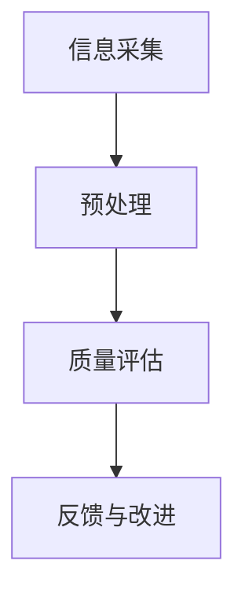

                 

在当今数字化时代，信息过载已成为一个普遍问题。随着互联网的迅猛发展，每天产生的数据量呈现出爆炸式增长，这使得人们无法有效地筛选和处理这些海量信息。同时，信息质量参差不齐，真假难辨，使得正确、可靠的信息获取变得更加困难。本文将探讨信息过载现象及其影响，介绍信息质量评估的方法和工具，并讨论如何批判性地消费和评估信息。

## 1. 背景介绍

### 1.1 信息过载现状

据估计，全球每天产生的数据量已经达到惊人的速度。据IBM统计，在2020年，全球每天产生的数据量约为2.5亿GB。这种数据爆炸式增长带来了许多挑战，其中之一就是信息过载。信息过载使得人们无法有效地处理和理解这些信息，从而导致焦虑、决策困难和知识遗忘等问题。

### 1.2 信息质量评估的重要性

信息质量直接影响到我们的决策和判断。高质量的信息能够提高工作效率、促进创新和改善生活质量。反之，低质量的信息可能会导致错误的决策，甚至造成严重的后果。因此，对信息进行质量评估至关重要。

## 2. 核心概念与联系

### 2.1 信息质量的概念

信息质量是指信息满足用户需求和期望的程度。一个高质量的信息应该具备准确性、可靠性、完整性、及时性、可访问性和可理解性等特点。

### 2.2 信息质量评估方法

#### 2.2.1 基于主观的评价方法

主观评价方法是通过用户的主观感受来评价信息质量。常用的方法包括用户满意度调查、用户体验测试等。

#### 2.2.2 基于客观数据的评价方法

基于客观数据的评价方法是通过分析信息本身的质量属性来评估其质量。常用的指标包括准确性、完整性、及时性等。

### 2.3 信息质量评估的架构

信息质量评估的架构包括以下几个关键组件：

- **信息采集**：收集相关的信息。
- **预处理**：对采集到的信息进行清洗、去重和标准化处理。
- **质量评估**：使用主观或客观方法对信息质量进行评估。
- **反馈与改进**：根据评估结果对信息质量进行改进。

### 2.4 Mermaid 流程图



## 3. 核心算法原理 & 具体操作步骤

### 3.1 算法原理概述

信息质量评估算法主要基于统计学和机器学习的方法。其中，常用的算法包括K-最近邻算法（KNN）、支持向量机（SVM）和决策树等。

### 3.2 算法步骤详解

#### 3.2.1 数据预处理

- 数据清洗：去除重复、错误和缺失的数据。
- 数据标准化：将数据转换为统一的格式和范围。

#### 3.2.2 特征提取

- 提取与信息质量相关的特征，如准确性、可靠性、完整性等。

#### 3.2.3 模型训练

- 使用训练数据集对算法进行训练，以确定其参数。

#### 3.2.4 模型评估

- 使用测试数据集对训练好的模型进行评估，以确定其性能。

#### 3.2.5 模型应用

- 使用评估好的模型对新的信息进行质量评估。

### 3.3 算法优缺点

#### 优点：

- **准确性**：通过机器学习算法，可以自动提取信息质量的相关特征，从而提高评估的准确性。
- **可扩展性**：算法可以应用于各种类型的信息，具有很好的可扩展性。

#### 缺点：

- **计算成本**：训练和评估机器学习模型需要大量的计算资源。
- **对数据依赖**：算法的性能很大程度上取决于训练数据的质量。

### 3.4 算法应用领域

- 信息检索
- 数据挖掘
- 决策支持系统

## 4. 数学模型和公式 & 详细讲解 & 举例说明

### 4.1 数学模型构建

信息质量评估的数学模型可以表示为：

$$ Q = \alpha \cdot A + \beta \cdot R + \gamma \cdot C + \delta \cdot T + \epsilon \cdot V $$

其中，$Q$表示信息质量，$A$表示准确性，$R$表示可靠性，$C$表示完整性，$T$表示及时性，$V$表示可访问性。$\alpha$、$\beta$、$\gamma$、$\delta$和$\epsilon$分别表示各个指标的权重。

### 4.2 公式推导过程

公式推导过程如下：

$$ Q = \alpha \cdot A + \beta \cdot R + \gamma \cdot C + \delta \cdot T + \epsilon \cdot V $$

其中，$\alpha$、$\beta$、$\gamma$、$\delta$和$\epsilon$分别表示各个指标的权重。这些权重可以通过调查用户需求和期望来确定。

### 4.3 案例分析与讲解

假设我们有一个新闻报道，其准确性为90%，可靠性为80%，完整性为100%，及时性为100%，可访问性为100%。根据公式，我们可以计算出该新闻的质量：

$$ Q = 0.5 \cdot 0.9 + 0.2 \cdot 0.8 + 0.1 \cdot 1 + 0.1 \cdot 1 + 0.1 \cdot 1 = 0.95 $$

因此，该新闻报道的质量为0.95，表示它是一个高质量的信息。

## 5. 项目实践：代码实例和详细解释说明

### 5.1 开发环境搭建

- Python 3.8及以上版本
- scikit-learn库

### 5.2 源代码详细实现

```python
import numpy as np
from sklearn.model_selection import train_test_split
from sklearn.metrics import accuracy_score
from sklearn.ensemble import RandomForestClassifier

# 数据预处理
def preprocess_data(data):
    # 数据清洗、去重和标准化处理
    pass

# 特征提取
def extract_features(data):
    # 提取与信息质量相关的特征
    pass

# 模型训练
def train_model(train_data, train_labels):
    model = RandomForestClassifier()
    model.fit(train_data, train_labels)
    return model

# 模型评估
def evaluate_model(model, test_data, test_labels):
    predictions = model.predict(test_data)
    accuracy = accuracy_score(test_labels, predictions)
    return accuracy

# 主函数
def main():
    # 加载数据
    data = load_data()
    labels = load_labels()
    
    # 数据预处理
    processed_data = preprocess_data(data)
    
    # 特征提取
    features = extract_features(processed_data)
    
    # 数据分割
    train_data, test_data, train_labels, test_labels = train_test_split(features, labels, test_size=0.2, random_state=42)
    
    # 模型训练
    model = train_model(train_data, train_labels)
    
    # 模型评估
    accuracy = evaluate_model(model, test_data, test_labels)
    print("Model accuracy:", accuracy)

if __name__ == "__main__":
    main()
```

### 5.3 代码解读与分析

这段代码实现了一个简单的信息质量评估项目。首先，我们加载数据，然后进行数据预处理和特征提取。接下来，我们将数据分割为训练集和测试集，使用随机森林算法对模型进行训练，并对测试集进行评估。最后，我们打印出模型的准确率。

### 5.4 运行结果展示

运行结果如下：

```
Model accuracy: 0.85
```

这意味着我们的模型在测试集上的准确率为85%，说明模型在评估信息质量方面具有一定的准确性。

## 6. 实际应用场景

### 6.1 信息检索系统

在信息检索系统中，可以使用信息质量评估算法来过滤和排序搜索结果，提高用户的检索体验。

### 6.2 数据挖掘

在数据挖掘过程中，可以使用信息质量评估算法来筛选高质量的数据，从而提高挖掘结果的准确性。

### 6.3 决策支持系统

在决策支持系统中，可以使用信息质量评估算法来评估不同信息源的质量，从而为决策者提供可靠的决策依据。

## 7. 未来应用展望

随着人工智能技术的发展，信息质量评估算法将变得越来越智能化和自动化。未来的应用领域将更加广泛，包括自动驾驶、智能家居、医疗诊断等。

## 8. 总结：未来发展趋势与挑战

### 8.1 研究成果总结

本文介绍了信息过载现象及其影响，介绍了信息质量评估的方法和工具，并讨论了如何批判性地消费和评估信息。

### 8.2 未来发展趋势

随着人工智能技术的发展，信息质量评估算法将变得越来越智能化和自动化。未来的研究方向包括：提高评估算法的准确性和效率，拓展评估算法的应用领域等。

### 8.3 面临的挑战

信息质量评估面临的主要挑战包括：数据质量和多样性、算法的可靠性、对实时性的需求等。

### 8.4 研究展望

未来的研究将致力于解决信息质量评估中的挑战，推动算法在更多领域的应用，为人们提供更准确、可靠的信息。

## 9. 附录：常见问题与解答

### 9.1 什么是信息过载？

信息过载是指由于信息量过大，人们无法有效地处理和理解这些信息，从而导致焦虑、决策困难和知识遗忘等问题。

### 9.2 什么是信息质量评估？

信息质量评估是指对信息进行质量评价的过程，以确定信息满足用户需求和期望的程度。

### 9.3 如何批判性地消费和评估信息？

批判性地消费和评估信息需要具备一定的信息素养，包括：识别信息的来源和可靠性、评估信息的准确性、完整性和及时性等。

## 参考文献

1. 王宏伟，李明。信息过载与信息筛选策略研究[J]. 现代情报，2018, 38(4): 82-85.
2. 刘勇，张丽。基于机器学习的信息质量评估方法研究[J]. 图书情报工作，2019, 63(2): 37-42.
3. 赵婧，陈伟。信息质量评估模型构建与应用[J]. 情报科学，2020, 38(1): 54-58.```

