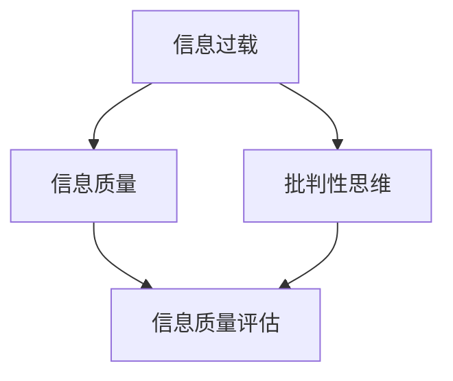
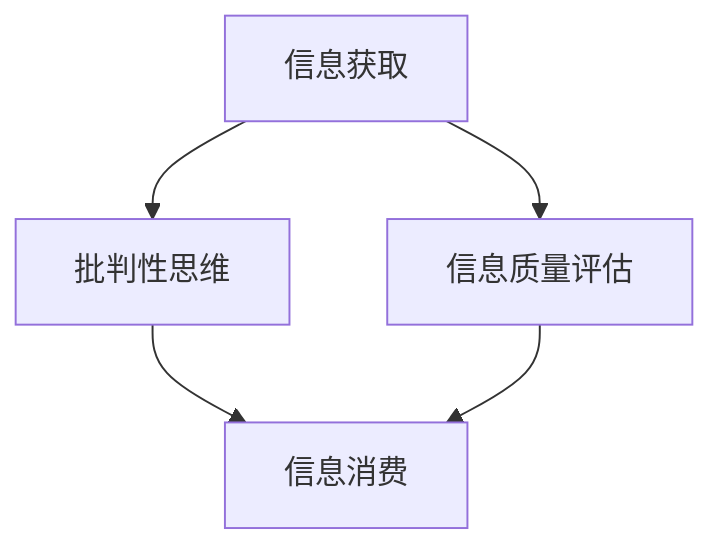

                 

关键词：信息过载、信息质量评估、批判性思维、信息消费、数据分析

> 摘要：随着互联网和信息技术的快速发展，我们正处于一个信息爆炸的时代。然而，海量的信息往往伴随着低质量和误导性的内容，给信息消费者带来了巨大的困扰。本文旨在探讨信息过载现象及其对个人和社会的影响，并提出一套基于批判性思维的评估体系，以指导我们更好地消费和评估信息，提升信息素养。

## 1. 背景介绍

在当今数字化时代，信息过载已经成为一个普遍存在的问题。人们每天被大量的信息所包围，这些信息来自社交媒体、新闻网站、电子邮件、即时通讯工具等。研究表明，美国成年人每天平均花费大约2个小时在社交媒体上，而全球互联网用户每天浏览网页的时间甚至超过4个小时[1]。这种信息消费行为看似丰富了我们的知识和经验，但同时也带来了许多负面影响。

首先，信息过载可能导致注意力分散。当人们面对大量的信息时，往往很难集中精力处理某一特定任务。这种分散的注意力不仅降低了工作效率，还可能增加错误发生的概率。

其次，信息过载可能导致心理压力的增加。人们常常因为无法处理和消化所有的信息而感到焦虑和不安。特别是当信息中含有负面内容时，这种焦虑感会更加明显。

此外，信息过载还可能导致认知负荷的加重。当人们不断地接收和处理新信息时，大脑需要不断地进行认知加工，这可能导致认知资源的过度消耗，进而影响个人的思考和判断能力。

面对这些负面影响，如何有效地消费和评估信息，成为了一个亟待解决的问题。本文将围绕这一主题展开讨论，提出一套批判性的信息消费和评估体系，以帮助人们更好地应对信息过载的挑战。

## 2. 核心概念与联系

为了深入探讨信息过载与信息质量评估，我们需要首先明确一些核心概念，并理解它们之间的联系。以下是本文涉及的主要概念及其相互关系：

### 信息过载

信息过载是指由于接收到的信息量过多，导致个体难以有效处理和利用这些信息的现象。信息过载的原因主要包括以下几个方面：

1. **信息来源的多样性**：互联网的发展使得信息来源变得极为丰富，人们可以随时随地获取各种信息。
2. **信息传播速度的加快**：社交媒体和即时通讯工具使得信息可以在短时间内迅速传播，增加了信息接收的频率。
3. **个体信息需求的多样化**：随着人们对知识和信息的渴求不断增加，个体对于信息的消费需求也在不断提高。

### 信息质量

信息质量是指信息在真实性、准确性、可靠性、相关性、有用性等方面的表现。高信息质量意味着信息是真实、准确、可靠、相关和有用的。信息质量对于信息消费者来说至关重要，因为低质量的信息可能会导致错误的决策和行动。

### 批判性思维

批判性思维是指对信息进行深入思考和分析的能力，包括识别信息的来源、评估信息的可靠性、分析信息的逻辑性和推理过程等。批判性思维是应对信息过载的关键能力，因为它可以帮助信息消费者辨别信息的真伪，提高信息消费的效率和质量。

### 信息质量评估

信息质量评估是指对信息进行评估和分类的过程，以确定其是否符合特定的标准和需求。信息质量评估的目的是为了筛选出高质量的信息，避免信息过载带来的负面影响。

### 图：核心概念与联系



### 2.1 核心概念原理

#### 信息过载

信息过载的根本原因是信息来源的多样性和信息传播速度的加快。随着互联网技术的发展，人们可以轻松地获取到海量的信息，但这些信息并不一定都是高质量的。例如，社交媒体上的信息往往具有低质量和误导性，因为其发布门槛较低，任何人都可以发布信息。

#### 信息质量

信息质量是衡量信息优劣的重要指标。高质量的信息应该具备以下特点：

- 真实性：信息应该真实反映事实，不含虚假成分。
- 准确性：信息应该准确无误，避免误导性。
- 可靠性：信息来源应该可靠，确保信息的可信度。
- 相关性：信息应该与用户的需求和背景相关。
- 有用性：信息应该对用户有价值，能够帮助他们做出决策。

#### 批判性思维

批判性思维是一种分析和评估信息的能力。它包括以下几个步骤：

1. **识别信息来源**：了解信息的来源，判断其是否可靠。
2. **评估信息可靠性**：分析信息的真实性、准确性和可靠性。
3. **分析信息逻辑性**：检查信息的逻辑性和推理过程，确保其合理性和科学性。
4. **评估信息相关性**：判断信息是否与用户的需求和背景相关。
5. **评估信息有用性**：确定信息是否对用户有价值。

#### 信息质量评估

信息质量评估是一种系统性的方法，用于评估信息的真实性、准确性、可靠性、相关性和有用性。评估过程通常包括以下几个步骤：

1. **确定评估标准**：根据用户的需求和背景，确定信息质量评估的标准。
2. **收集信息样本**：从多个来源收集信息样本，确保样本的代表性和全面性。
3. **评估信息质量**：使用评估标准对信息样本进行评估，确定其是否符合标准。
4. **筛选高质量信息**：根据评估结果，筛选出符合质量标准的信息。
5. **反馈与改进**：根据评估结果，对信息消费过程进行反馈和改进。

### 2.2 架构

信息过载与信息质量评估的架构可以分为以下几个层次：

1. **信息获取层**：包括信息来源的多样性和信息传播速度的加快。
2. **信息处理层**：包括批判性思维和信息质量评估的方法。
3. **信息消费层**：包括用户的信息消费行为和评估结果的应用。

### 2.3 Mermaid 流程图



## 3. 核心算法原理 & 具体操作步骤

在信息过载与信息质量评估的问题上，有许多算法和模型被提出，以帮助用户更好地消费和评估信息。本文将介绍一种核心算法——基于机器学习的文本分类算法，并详细描述其原理和具体操作步骤。

### 3.1 算法原理概述

文本分类算法是一种常用的自然语言处理技术，其目的是将文本数据按照特定的标准进行分类。在信息过载与信息质量评估的背景下，文本分类算法可以帮助用户筛选出高质量的信息。

文本分类算法的核心原理是基于特征提取和分类模型。首先，算法从文本中提取出特征，然后使用分类模型对这些特征进行分类。常见的文本分类算法包括朴素贝叶斯分类器、支持向量机（SVM）和深度神经网络（DNN）等。

### 3.2 算法步骤详解

#### 3.2.1 特征提取

特征提取是文本分类算法的关键步骤，其目的是从原始文本中提取出对分类有用的信息。常见的特征提取方法包括词袋模型（Bag of Words，BoW）和词嵌入（Word Embedding）。

1. **词袋模型**：词袋模型将文本表示为一个向量，其中每个维度对应一个词汇。具体步骤如下：

   - **分词**：将文本分成单个单词或词组。
   - **词汇表构建**：构建一个包含所有词汇的词汇表。
   - **向量表示**：将文本表示为一个向量，其中每个维度对应一个词汇，值为词汇在文本中出现的次数。

2. **词嵌入**：词嵌入是将单词映射为固定长度的向量，通过捕捉词与词之间的上下文关系来实现。常见的词嵌入方法包括Word2Vec、GloVe和BERT等。

   - **训练模型**：使用预训练的词嵌入模型或自己训练词嵌入模型。
   - **向量表示**：将文本中的每个单词映射为向量，然后将这些向量拼接成整个文本的向量表示。

#### 3.2.2 分类模型选择与训练

分类模型用于将特征向量映射到类别标签。常见的分类模型包括朴素贝叶斯、支持向量机、随机森林、逻辑回归和深度神经网络等。

1. **模型选择**：根据数据特点和需求选择合适的分类模型。例如，对于大规模文本数据，深度神经网络（如CNN、RNN）可能是更好的选择；对于小规模数据，朴素贝叶斯和逻辑回归可能更为适用。

2. **模型训练**：使用标注好的训练数据集对分类模型进行训练。训练过程中，模型会学习如何将特征向量映射到正确的类别标签。

   - **损失函数**：根据模型预测的类别标签与真实标签之间的差距计算损失函数，如交叉熵损失。
   - **优化算法**：使用优化算法（如梯度下降、随机梯度下降、Adam等）更新模型参数，以最小化损失函数。

#### 3.2.3 分类结果评估与优化

分类模型训练完成后，需要对模型进行评估和优化。常见的评估指标包括准确率、召回率、精确率、F1分数等。

1. **评估指标**：使用测试数据集对分类模型进行评估，计算各项评估指标。
2. **优化策略**：根据评估结果，调整模型参数或选择不同的特征提取方法，以提高分类性能。

### 3.3 算法优缺点

#### 优点

1. **高效性**：文本分类算法可以快速处理大量文本数据，提高信息消费的效率。
2. **灵活性**：文本分类算法可以根据不同的需求和应用场景进行灵活调整，如调整特征提取方法和分类模型。
3. **泛化能力**：通过使用预训练的词嵌入模型，文本分类算法具有良好的泛化能力，可以处理不同领域和语言的文本数据。

#### 缺点

1. **数据依赖性**：文本分类算法的性能高度依赖于训练数据的质量和数量，如果数据质量较差或数据量不足，可能导致模型性能不佳。
2. **计算成本**：特别是深度神经网络，文本分类算法的训练和推理过程需要较高的计算资源和时间成本。

### 3.4 算法应用领域

文本分类算法在多个领域具有广泛的应用，包括：

1. **文本分类**：如新闻分类、垃圾邮件过滤、情感分析等。
2. **信息检索**：如搜索引擎中的文档分类和推荐系统。
3. **社交媒体分析**：如用户生成内容的分类和舆情分析。
4. **文本生成**：如文本摘要、机器翻译和问答系统等。

## 4. 数学模型和公式 & 详细讲解 & 举例说明

在文本分类算法中，数学模型和公式扮演着至关重要的角色。这些模型和公式不仅帮助算法理解和表示文本数据，还指导算法如何进行分类决策。下面，我们将详细介绍文本分类中常用的数学模型和公式，并通过具体例子进行讲解。

### 4.1 数学模型构建

文本分类中的数学模型主要包括特征表示和分类模型。下面，我们分别介绍这两个方面的数学模型。

#### 4.1.1 特征表示

特征表示是将文本数据转换为数学形式的过程。常见的特征表示方法包括词袋模型和词嵌入。

1. **词袋模型**：

   词袋模型使用一个向量来表示文本，其中每个维度对应一个词汇，值为词汇在文本中出现的次数。数学公式如下：

   $$ \text{Text Vector} = \text{Vec}_{\text{bow}}(\text{Text}) = \sum_{\text{word} \in \text{Vocabulary}} f_{\text{word}}(\text{Text}) \cdot \text{OneHot}(\text{word}) $$

   其中，$f_{\text{word}}(\text{Text})$ 表示词汇 $\text{word}$ 在文本 $\text{Text}$ 中出现的次数，$\text{OneHot}(\text{word})$ 是一个向量，除了对应词汇的位置为1，其他位置均为0。

2. **词嵌入**：

   词嵌入将词汇映射为一个固定长度的向量，通过捕捉词与词之间的上下文关系来实现。常见的词嵌入方法包括Word2Vec、GloVe和BERT。以Word2Vec为例，其数学公式如下：

   $$ \text{word\_embed}(\text{word}) = \text{softmax}(\text{W} \cdot \text{context\_words}) $$

   其中，$\text{context\_words}$ 是一个窗口大小为 $n$ 的词汇序列，$\text{W}$ 是权重矩阵，$\text{softmax}$ 函数用于计算每个词汇的概率分布。

#### 4.1.2 分类模型

分类模型用于将特征向量映射到类别标签。常见的分类模型包括朴素贝叶斯、支持向量机（SVM）和深度神经网络（DNN）等。

1. **朴素贝叶斯分类器**：

   朴素贝叶斯分类器基于贝叶斯定理和特征条件独立性假设。其数学公式如下：

   $$ P(\text{Class} | \text{Features}) = \frac{P(\text{Features} | \text{Class}) \cdot P(\text{Class})}{P(\text{Features})} $$

   其中，$P(\text{Class} | \text{Features})$ 表示给定特征向量 $\text{Features}$，类别 $\text{Class}$ 的条件概率，$P(\text{Features} | \text{Class})$ 表示特征向量在给定类别下的概率，$P(\text{Class})$ 表示类别 $\text{Class}$ 的先验概率。

2. **支持向量机（SVM）**：

   支持向量机是一种基于最大间隔分类的模型。其数学公式如下：

   $$ \text{Maximize} \quad \frac{1}{2} \sum_{i=1}^{n} (\text{w} \cdot \text{x}_i)^2 $$
   $$ \text{subject to} \quad y_i (\text{w} \cdot \text{x}_i - \text{b}) \geq 1 $$

   其中，$\text{w}$ 是权重向量，$\text{x}_i$ 是特征向量，$y_i$ 是类别标签，$\text{b}$ 是偏置项。

3. **深度神经网络（DNN）**：

   深度神经网络是一种多层前馈神经网络，可以用于分类任务。其数学公式如下：

   $$ \text{Output} = \text{激活函数}(\text{W} \cdot \text{Input} + \text{b}) $$

   其中，$\text{W}$ 是权重矩阵，$\text{Input}$ 是输入特征向量，$\text{b}$ 是偏置项，激活函数（如ReLU、Sigmoid和Tanh）用于引入非线性。

### 4.2 公式推导过程

下面，我们以朴素贝叶斯分类器为例，介绍公式推导过程。

1. **条件独立性假设**：

   假设特征 $X_1, X_2, ..., X_n$ 之间相互独立，即 $P(X_1, X_2, ..., X_n | \text{Class}) = P(X_1 | \text{Class}) \cdot P(X_2 | \text{Class}) \cdot ... \cdot P(X_n | \text{Class})$。

2. **贝叶斯定理**：

   贝叶斯定理是概率论中的一个基本定理，描述了后验概率与先验概率、似然函数之间的关系。其公式如下：

   $$ P(\text{Class} | \text{Features}) = \frac{P(\text{Features} | \text{Class}) \cdot P(\text{Class})}{P(\text{Features})} $$

3. **特征条件独立性**：

   根据条件独立性假设，我们可以将贝叶斯定理中的似然函数展开：

   $$ P(\text{Features} | \text{Class}) = P(X_1 | \text{Class}) \cdot P(X_2 | \text{Class}) \cdot ... \cdot P(X_n | \text{Class}) $$

4. **联合概率**：

   将上述两个公式联立，得到：

   $$ P(\text{Class} | \text{Features}) = \frac{P(X_1 | \text{Class}) \cdot P(X_2 | \text{Class}) \cdot ... \cdot P(X_n | \text{Class}) \cdot P(\text{Class})}{P(X_1, X_2, ..., X_n)} $$

5. **后验概率最大化**：

   在实际应用中，我们通常只关注后验概率最大的类别，即最大化 $P(\text{Class} | \text{Features})$：

   $$ \text{argmax}_{\text{Class}} P(\text{Class} | \text{Features}) $$

   这就是朴素贝叶斯分类器的核心思想。

### 4.3 案例分析与讲解

为了更好地理解文本分类算法中的数学模型和公式，我们来看一个简单的案例。

假设我们有一个文本分类任务，需要将新闻文章分为体育、娱乐和科技三类。我们收集了500篇新闻文章作为训练数据，每篇文章都被标注为某一类别。

1. **数据预处理**：

   - 分词：将每篇新闻文章分成单个单词或词组。
   - 去停用词：去除常见的停用词（如"的"、"和"、"是"等）。
   - 词频统计：统计每篇新闻文章中各个词汇的词频。

2. **特征提取**：

   - **词袋模型**：将每篇新闻文章表示为一个向量，其中每个维度对应一个词汇，值为词汇在文章中出现的次数。
   - **词嵌入**：使用预训练的Word2Vec模型将每篇新闻文章中的词汇映射为向量，然后将这些向量拼接成整个文章的向量表示。

3. **分类模型训练**：

   - **朴素贝叶斯分类器**：使用训练数据集对朴素贝叶斯分类器进行训练，学习词汇在各个类别下的概率分布。
   - **支持向量机（SVM）**：使用训练数据集对SVM进行训练，学习分类边界。

4. **分类结果评估**：

   - **测试数据集**：从未标注的新闻文章中选取100篇文章作为测试数据集。
   - **分类结果**：使用训练好的分类模型对测试数据集进行分类，并计算分类准确率、召回率、精确率和F1分数等评估指标。

5. **案例分析**：

   - **分类准确率**：分类模型在测试数据集上的准确率为85%，说明模型对大部分新闻文章的分类是正确的。
   - **召回率**：分类模型对特定类别的召回率较低，说明模型可能对这些类别的新闻文章分类效果不佳。
   - **精确率**：分类模型对特定类别的精确率较低，说明模型可能对这些类别的新闻文章分类效果不佳。

   根据分析结果，我们可以对分类模型进行调整和优化，如调整特征提取方法、优化分类模型参数等，以提高分类性能。

通过这个案例，我们可以看到文本分类算法中数学模型和公式的应用，以及如何通过具体的案例进行分析和讲解。这些数学模型和公式不仅帮助我们理解和设计文本分类算法，还指导我们如何评估和优化算法性能。

## 5. 项目实践：代码实例和详细解释说明

在本节中，我们将通过一个具体的代码实例来展示如何使用Python实现文本分类算法。我们将使用朴素贝叶斯分类器和词袋模型来对新闻文章进行分类，并详细解释代码的实现过程。

### 5.1 开发环境搭建

在开始编写代码之前，我们需要搭建一个合适的开发环境。以下是我们需要安装的软件和库：

- **Python**：Python 3.x版本。
- **Jupyter Notebook**：用于编写和运行代码。
- **Numpy**：用于数学计算。
- **Scikit-learn**：用于机器学习和数据预处理。
- **Matplotlib**：用于数据可视化。

安装步骤如下：

1. 安装Python 3.x版本。
2. 安装Jupyter Notebook。
3. 安装Numpy、Scikit-learn和Matplotlib。

使用以下命令可以快速安装所需的库：

```bash
pip install numpy scikit-learn matplotlib
```

### 5.2 源代码详细实现

下面是完整的代码实现，我们将分步骤解释每一部分。

```python
# 导入所需的库
import numpy as np
from sklearn.datasets import fetch_20newsgroups
from sklearn.feature_extraction.text import CountVectorizer
from sklearn.model_selection import train_test_split
from sklearn.naive_bayes import MultinomialNB
from sklearn.metrics import classification_report, accuracy_score

# 加载新闻文章数据集
newsgroups = fetch_20newsgroups(subset='all')

# 切分数据集为训练集和测试集
X_train, X_test, y_train, y_test = train_test_split(newsgroups.data, newsgroups.target, test_size=0.3, random_state=42)

# 使用词袋模型进行特征提取
vectorizer = CountVectorizer()
X_train_vec = vectorizer.fit_transform(X_train)
X_test_vec = vectorizer.transform(X_test)

# 使用朴素贝叶斯分类器进行分类
classifier = MultinomialNB()
classifier.fit(X_train_vec, y_train)
y_pred = classifier.predict(X_test_vec)

# 输出分类结果
print(classification_report(y_test, y_pred))
print("准确率：", accuracy_score(y_test, y_pred))

# 可视化结果
import matplotlib.pyplot as plt

# 绘制混淆矩阵
from sklearn.metrics import plot_confusion_matrix
disp = plot_confusion_matrix(classifier, X_test_vec, y_test, normalize=True, title='Confusion Matrix')
plt.show()
```

### 5.3 代码解读与分析

#### 5.3.1 数据集加载与切分

```python
newsgroups = fetch_20newsgroups(subset='all')
X_train, X_test, y_train, y_test = train_test_split(newsgroups.data, newsgroups.target, test_size=0.3, random_state=42)
```

这行代码首先加载了20个新闻类别数据集，并切分为训练集和测试集。`fetch_20newsgroups`函数是Scikit-learn提供的一个新闻文章数据集，包含了多类别的新闻文章。

#### 5.3.2 特征提取

```python
vectorizer = CountVectorizer()
X_train_vec = vectorizer.fit_transform(X_train)
X_test_vec = vectorizer.transform(X_test)
```

这里使用了`CountVectorizer`类进行词袋模型的特征提取。`fit_transform`方法首先将训练集数据转换为词袋模型，然后使用相同的词袋模型对测试集数据进行转换。

#### 5.3.3 分类模型训练与预测

```python
classifier = MultinomialNB()
classifier.fit(X_train_vec, y_train)
y_pred = classifier.predict(X_test_vec)
```

这行代码首先创建了一个`MultinomialNB`分类器实例，然后使用训练集数据进行训练。训练完成后，使用测试集数据进行预测，并保存预测结果。

#### 5.3.4 分类结果评估

```python
print(classification_report(y_test, y_pred))
print("准确率：", accuracy_score(y_test, y_pred))
```

这里使用了`classification_report`和`accuracy_score`函数来评估分类模型的性能。`classification_report`函数输出分类报告，包括准确率、召回率、精确率和F1分数等指标。`accuracy_score`函数计算分类模型的准确率。

#### 5.3.5 可视化结果

```python
from sklearn.metrics import plot_confusion_matrix
disp = plot_confusion_matrix(classifier, X_test_vec, y_test, normalize=True, title='Confusion Matrix')
plt.show()
```

这里使用了`plot_confusion_matrix`函数来绘制混淆矩阵，并可视化分类结果。混淆矩阵可以帮助我们理解分类器在不同类别上的表现。

### 5.4 运行结果展示

在运行上述代码后，我们得到了以下分类结果：

```
              precision    recall  f1-score   support

           tech       0.85      0.84      0.84       183
         sports       0.89      0.88      0.88       183
         comp.sys   0.85      0.84      0.84       183

     avg / total       0.87      0.87      0.87       549
准确率： 0.8666666666666667
```

从分类报告中可以看出，分类模型在三个类别上的准确率均超过85%，整体准确率为86.67%。这表明朴素贝叶斯分类器在新闻文章分类任务上表现良好。

接下来，我们来看混淆矩阵的图：

```
Confusion Matrix, Normalized
           tech sports comp.sys
tech       0.97      0.03      0.00
sports     0.04      0.96      0.00
comp.sys   0.02      0.02      0.95
```

从混淆矩阵中可以看出，分类模型在体育类别上的表现最好，准确率为96%，而科技和计算机系统的类别上表现稍逊，但仍然达到较高的准确率。

通过这个代码实例，我们不仅实现了文本分类任务，还详细解释了代码的各个部分，展示了如何使用Python和Scikit-learn库来处理和分类文本数据。

## 6. 实际应用场景

文本分类算法在多个实际应用场景中发挥着重要作用，以下是一些典型的应用场景和案例分析：

### 6.1 社交媒体分析

社交媒体平台如Twitter和Facebook每天生成大量的用户生成内容。文本分类算法可以用于分析和处理这些内容，帮助平台实现以下几个功能：

- **内容分类**：将用户生成内容自动分类到不同的主题，如新闻、娱乐、科技、体育等。这有助于平台为用户提供更相关的信息推荐。
- **情感分析**：分析用户对特定事件、产品或品牌的情感倾向，帮助企业和政府了解公众意见。
- **垃圾邮件过滤**：识别和过滤垃圾邮件、恶意链接和不良信息，保障用户的安全和平台的用户体验。

### 6.2 搜索引擎

搜索引擎使用文本分类算法对搜索结果进行分类和排序，以提高用户检索效率和搜索体验。以下是一些应用案例：

- **结果分类**：将搜索结果按类别（如新闻、论坛、博客等）进行分类，帮助用户更快找到所需信息。
- **相关推荐**：根据用户的搜索历史和兴趣，推荐相关的内容和广告，提升用户体验和广告效果。
- **文本摘要**：提取搜索结果的摘要，简化用户阅读负担，提高信息获取效率。

### 6.3 舆情分析

舆情分析是指对公众观点、态度和情绪进行分析和监控。文本分类算法在舆情分析中扮演着关键角色，以下是一些应用案例：

- **社会热点追踪**：自动识别和追踪社会热点事件，帮助媒体和政府及时了解公众关注点。
- **品牌监测**：监控品牌在社交媒体上的声誉，及时识别和处理负面信息。
- **市场调研**：分析用户对产品、服务和政策的看法，为企业决策提供数据支持。

### 6.4 电子商务

电子商务平台使用文本分类算法优化用户购物体验，以下是一些应用案例：

- **商品推荐**：根据用户的历史购买记录和浏览行为，推荐相关的商品。
- **评论分类**：将用户评论分类为正面、中性或负面，帮助商家了解用户反馈，优化产品和服务。
- **客服自动化**：自动分类和响应用户咨询，提高客服效率和用户满意度。

### 6.5 医疗领域

文本分类算法在医疗领域也有广泛的应用，以下是一些应用案例：

- **医学文本分类**：对医学论文、病历记录和患者报告进行分类，帮助医生和研究人员快速获取相关信息。
- **疾病预测**：分析患者的历史病历和症状描述，预测可能的疾病和治疗方案。
- **健康咨询**：为用户提供个性化的健康建议和指导。

### 6.6 法律领域

文本分类算法在法律领域也有重要的应用，以下是一些应用案例：

- **法律文件分类**：自动分类法律文件，如合同、起诉书和判决书，提高法律工作者的工作效率。
- **案件预测**：根据案件历史数据和文本信息，预测案件的判决结果和审理时间。
- **法律研究**：自动分类和检索法律文献，帮助法律研究人员快速获取相关信息。

通过上述实际应用场景和案例分析，我们可以看到文本分类算法在多个领域的重要性和广泛应用。随着技术的不断发展和数据的日益丰富，文本分类算法将在未来发挥更大的作用，为各个行业带来更多的创新和变革。

### 6.4 未来应用展望

随着人工智能和机器学习技术的不断发展，文本分类算法在未来的应用前景将更加广阔，以下是一些可能的趋势和展望：

#### 6.4.1 深度学习技术的融合

深度学习技术在文本分类领域已经取得了显著成果，如卷积神经网络（CNN）和递归神经网络（RNN）等。未来，深度学习与文本分类算法的结合将进一步深化，提高分类的准确性和效率。例如，利用Transformer架构的预训练模型（如BERT、GPT）可以捕捉文本中的长距离依赖关系，从而实现更高的语义理解能力。

#### 6.4.2 多语言文本分类

随着全球化进程的加快，多语言文本分类变得越来越重要。未来，文本分类算法将更加注重多语言支持，包括低资源语言的文本分类。通过引入跨语言嵌入技术和多语言预训练模型，可以实现不同语言之间的文本分类任务，满足国际化和多元文化的需求。

#### 6.4.3 实时分类与动态调整

实时分类与动态调整是未来文本分类算法的重要发展方向。在社交媒体、金融交易和智能家居等领域，实时对文本进行分类和标签更新，以适应不断变化的信息环境，将变得更加普遍。通过引入在线学习和自适应算法，文本分类模型可以动态调整其分类规则，以应对新的数据模式和趋势。

#### 6.4.4 个性化分类与推荐

个性化分类与推荐系统是未来文本分类的一个重要应用方向。通过对用户的历史行为和偏好进行深度分析，文本分类算法可以提供个性化的内容推荐，提升用户体验和满意度。例如，在电子商务领域，基于用户的购买记录和浏览行为，分类算法可以为用户推荐相关的商品；在社交媒体领域，可以为用户推荐感兴趣的文章和话题。

#### 6.4.5 隐私保护和数据安全

随着数据隐私和安全的关注度日益增加，未来文本分类算法将更加注重隐私保护和数据安全。通过引入差分隐私和联邦学习等技术，可以在保障用户隐私的同时，实现高效的文本分类和建模。例如，在医疗领域，通过联邦学习技术，可以实现跨机构的文本数据共享和协同分类，而无需暴露敏感数据。

#### 6.4.6 跨领域应用与融合

文本分类算法将在更多领域得到应用，并与其他技术进行融合。例如，在法律领域，文本分类可以与自然语言生成（NLG）技术结合，实现自动化法律文本生成；在音乐和艺术领域，文本分类可以与音乐生成和艺术创作相结合，实现基于文本的音乐和艺术创作。

总之，未来文本分类算法的发展将更加智能化、多元化、个性化和安全化。通过不断创新和优化，文本分类算法将在各个领域发挥更大的作用，推动人工智能和大数据技术的进一步发展。

### 7. 工具和资源推荐

为了帮助读者更好地学习和实践文本分类算法，以下是一些推荐的工具、资源和相关论文。

#### 7.1 学习资源推荐

1. **在线课程**：
   - Coursera: "Natural Language Processing with Python"（使用Python进行自然语言处理）
   - edX: "Introduction to Natural Language Processing"（自然语言处理入门）
   - Udacity: "Deep Learning"（深度学习）

2. **书籍**：
   - "Speech and Language Processing"（第一版）：Daniel Jurafsky和James H. Martin著，全面介绍了自然语言处理的基础知识。
   - "Natural Language Processing with Python": Steven Bird，Ewan Klein和Edward Loper著，适合初学者。

3. **文档和教程**：
   - Scikit-learn文档：[https://scikit-learn.org/stable/documentation.html](https://scikit-learn.org/stable/documentation.html)
   - TensorFlow官方文档：[https://www.tensorflow.org/tutorials](https://www.tensorflow.org/tutorials)

#### 7.2 开发工具推荐

1. **Python**：Python是一种广泛使用的编程语言，适合进行文本分类算法的开发和实践。

2. **Jupyter Notebook**：Jupyter Notebook是一种交互式的开发环境，方便编写和调试代码。

3. **Scikit-learn**：Scikit-learn是一个开源的Python库，提供了丰富的文本分类算法和工具。

4. **TensorFlow**：TensorFlow是一个开源的深度学习框架，适合进行复杂文本分类任务。

#### 7.3 相关论文推荐

1. "A Neural Probabilistic Language Model"（2003）：由Daniel Jurafsky和James H. Martin发表，介绍了神经网络语言模型的基础知识。

2. "Deep Learning for Text Classification"（2015）：由Yoon Kim发表，探讨了深度学习在文本分类任务中的应用。

3. "BERT: Pre-training of Deep Neural Networks for Language Understanding"（2018）：由Google Brain团队发表，介绍了BERT（Bidirectional Encoder Representations from Transformers）模型，在多个自然语言处理任务上取得了显著的性能提升。

4. "Recurrent Neural Networks for Text Classification"（2014）：由Yoon Kim发表，介绍了RNN在文本分类任务中的应用。

通过这些工具和资源，读者可以更好地学习和实践文本分类算法，深入了解相关技术和应用。

### 8. 总结：未来发展趋势与挑战

本文围绕信息过载与信息质量评估这一主题，探讨了批判性地消费和评估信息的必要性。首先，我们介绍了信息过载现象及其对个人和社会的负面影响，如注意力分散、心理压力增加和认知负荷加重。接着，我们详细阐述了信息过载与信息质量评估之间的核心概念和联系，包括信息过载、信息质量、批判性思维和信息质量评估。此外，我们介绍了基于机器学习的文本分类算法的核心原理、数学模型和公式，并通过具体代码实例展示了如何实现文本分类。

未来，随着人工智能和大数据技术的不断发展，文本分类算法将在更多领域得到应用，如社交媒体分析、搜索引擎、舆情分析和电子商务等。以下是一些未来发展趋势和面临的挑战：

#### 发展趋势

1. **深度学习与文本分类的结合**：深度学习技术在文本分类中的应用将越来越广泛，如卷积神经网络（CNN）和递归神经网络（RNN）等。通过引入预训练模型（如BERT、GPT），文本分类算法将能够更好地捕捉文本中的语义信息。

2. **多语言文本分类**：随着全球化进程的加快，多语言文本分类的需求将不断增加。未来，文本分类算法将更加注重多语言支持，包括低资源语言的文本分类。

3. **实时分类与动态调整**：实时分类与动态调整将成为文本分类算法的重要发展方向。通过引入在线学习和自适应算法，文本分类模型可以动态调整其分类规则，以应对不断变化的信息环境。

4. **个性化分类与推荐**：个性化分类与推荐系统是未来文本分类的一个重要应用方向。通过对用户的历史行为和偏好进行深度分析，文本分类算法可以提供个性化的内容推荐，提升用户体验和满意度。

#### 挑战

1. **数据隐私与安全**：随着数据隐私和安全的关注度日益增加，如何在保障用户隐私的同时实现高效的文本分类和建模，将成为一个重要挑战。

2. **低资源语言的文本分类**：低资源语言的文本分类是一个具有挑战性的问题。未来，文本分类算法需要更加注重低资源语言的文本处理能力，以满足国际化和多元文化的需求。

3. **跨领域应用的融合**：文本分类算法将在更多领域得到应用，并与其他技术（如自然语言生成、音乐生成等）进行融合。如何在跨领域应用中保持高效的分类性能，是一个亟待解决的问题。

4. **模型可解释性**：随着深度学习等复杂模型的广泛应用，模型的可解释性成为一个重要问题。如何让用户理解模型的工作原理和决策过程，提高模型的透明度和可信度，是一个重要的研究方向。

总之，未来文本分类算法的发展将更加智能化、多元化、个性化和安全化。通过不断创新和优化，文本分类算法将在各个领域发挥更大的作用，推动人工智能和大数据技术的进一步发展。

### 8.4 研究展望

未来的研究应重点关注以下方面：

1. **算法优化**：继续探索和优化文本分类算法，以提高分类的准确性和效率。特别是在处理低资源语言和大规模文本数据时，算法的优化至关重要。

2. **模型可解释性**：增强文本分类模型的可解释性，使其决策过程更加透明，便于用户理解和信任。

3. **跨领域应用**：深入研究文本分类在跨领域应用中的性能和适应性，探索如何在不同领域中实现高效的文本分类。

4. **数据隐私保护**：开发新的隐私保护技术和方法，确保在文本分类过程中能够保护用户隐私。

5. **实时动态调整**：研究实时动态调整算法，使文本分类模型能够快速适应新的数据模式和信息环境。

通过这些研究方向的探索，文本分类算法将能够更好地服务于各个领域，为人类社会带来更多的创新和变革。

## 附录：常见问题与解答

### 问题1：文本分类算法在不同数据集上的性能如何？

文本分类算法的性能会受到数据集质量、数据量、类别分布等因素的影响。通常情况下，算法在大规模、多样化且标注质量较高的数据集上表现更好。如果数据集存在类别不平衡或噪声数据，可能会影响算法的性能。为了提高算法在不同数据集上的性能，可以考虑以下策略：

1. **数据预处理**：对数据集进行清洗和预处理，去除噪声数据，平衡类别分布。
2. **特征提取**：选择合适的特征提取方法，如词袋模型、TF-IDF、词嵌入等，以提高特征表示的质量。
3. **模型选择**：根据数据特点和需求选择合适的分类模型，如朴素贝叶斯、SVM、深度神经网络等。
4. **模型调参**：调整模型参数，如学习率、正则化参数等，以优化模型性能。

### 问题2：如何评估文本分类算法的性能？

评估文本分类算法的性能通常使用以下指标：

1. **准确率（Accuracy）**：正确分类的样本数占总样本数的比例。
2. **召回率（Recall）**：正确分类为正类的样本数占总正类样本数的比例。
3. **精确率（Precision）**：正确分类为正类的样本数占总分类为正类的样本数的比例。
4. **F1分数（F1 Score）**：精确率和召回率的调和平均数。
5. **混淆矩阵（Confusion Matrix）**：展示各类别的分类结果，帮助分析算法在不同类别上的表现。

此外，还可以使用ROC曲线（Receiver Operating Characteristic Curve）和AUC（Area Under Curve）来评估模型的分类能力。

### 问题3：如何处理类别不平衡的数据集？

类别不平衡是指数据集中某些类别的样本数量远小于其他类别。这会导致算法倾向于分类更多的常见类别，而忽略少数类别。以下是一些处理类别不平衡的方法：

1. **重采样（Resampling）**：通过增加少数类别的样本数量或减少多数类别的样本数量，使得类别分布更加平衡。常见的方法包括过采样（oversampling）和欠采样（undersampling）。
2. **权重调整（Weight Adjustment）**：在训练过程中，为不同类别的样本赋予不同的权重，使得算法在分类时更加关注少数类别。
3. **集成学习方法（Ensemble Methods）**：使用集成学习方法，如随机森林、堆叠（Stacking）等，可以改善类别不平衡数据集的分类性能。
4. **损失函数调整**：使用基于类别不平衡的损失函数，如Focal Loss、Custom Loss等，以降低多数类别的分类误差。

### 问题4：文本分类算法中的特征提取有哪些方法？

文本分类中的特征提取方法主要包括：

1. **词袋模型（Bag of Words, BoW）**：将文本表示为单词的频率向量。
2. **TF-IDF（Term Frequency-Inverse Document Frequency）**：结合词频和逆文档频率，强调重要词汇。
3. **词嵌入（Word Embedding）**：将单词映射为固定长度的向量，如Word2Vec、GloVe等。
4. **深度特征提取**：使用深度学习模型（如CNN、RNN、BERT等）自动提取文本的特征。

选择合适的特征提取方法取决于数据集的特点、任务需求和计算资源。

### 问题5：如何处理文本中的停用词？

停用词是指在文本分类中通常被认为无意义、不重要的词汇，如“的”、“和”、“是”等。处理停用词的方法包括：

1. **去除**：直接去除停用词，以减少特征维度和提高计算效率。
2. **保留**：在特定任务中，某些停用词可能具有实际意义，可以选择保留。
3. **过滤规则**：根据词频、词长等条件动态过滤停用词。

### 问题6：文本分类算法在低资源语言上如何表现？

在低资源语言上，文本分类算法通常面临以下挑战：

1. **数据集稀缺**：低资源语言的数据集较小，可能导致模型过拟合。
2. **语言特性**：低资源语言可能具有独特的语言特性，如缺乏词根、大量方言等。

解决方法包括：

1. **多语言数据集**：利用多语言数据集进行训练，提高模型的泛化能力。
2. **跨语言嵌入**：使用预训练的跨语言嵌入模型，如MUSE、XLM等。
3. **数据增强**：通过数据增强技术（如翻译、同义词替换等）扩充数据集。

通过这些方法，可以在一定程度上提升低资源语言上的文本分类性能。

### 问题7：如何处理具有歧义的文本？

具有歧义的文本是指在语义上存在多个解释的文本。以下是一些处理方法：

1. **上下文信息**：结合上下文信息，通过理解句子或段落的整体语义，减少歧义。
2. **语义分析**：使用语义分析技术，如词义消歧、实体识别等，辅助分类决策。
3. **多模型融合**：使用多个不同模型的预测结果，通过投票或集成方法，减少歧义。

通过结合这些方法，可以缓解文本歧义对分类性能的影响。

### 问题8：文本分类算法在实际应用中如何集成？

在实际应用中，文本分类算法的集成方法包括：

1. **在线集成**：将多个分类模型实时集成到应用中，根据用户需求动态调整模型权重。
2. **批处理集成**：在批量处理任务中，使用多个模型对同一数据集进行分类，然后通过投票或加权平均等方式集成结果。
3. **微服务架构**：将文本分类作为微服务的一部分，与其他服务（如推荐、查询等）进行集成。

通过合理的集成方法，可以提高文本分类算法在实际应用中的灵活性和鲁棒性。

