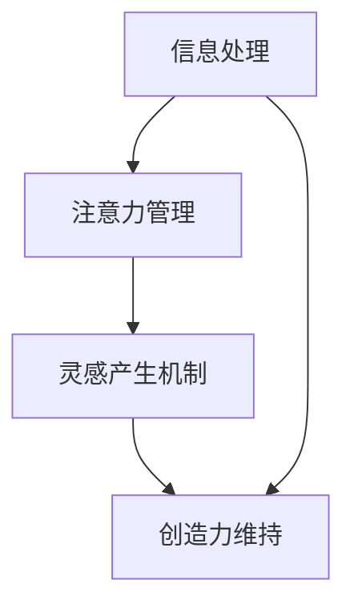

                 

 **关键词：** 信息过载、创造力、灵感、技术语言、AI、编程、算法

**摘要：** 在当今信息爆炸的时代，信息过载已成为许多人面临的主要问题。本文将探讨如何在大量信息中找到灵感，结合技术语言，从编程和算法的角度提供一些建议和策略。

## 1. 背景介绍

信息过载，即信息量过多导致难以消化和处理的状态，已经成为现代社会中普遍存在的问题。人们每天都会接触到海量的信息，包括新闻、社交媒体、电子邮件、视频等。这些信息虽然丰富了我们的知识面，但也带来了困扰。过多的信息会导致我们的大脑处于过度负荷状态，降低我们的思考能力和创造力。

在这个信息爆炸的时代，如何从大量的信息中找到灵感，成为了一个重要且紧迫的问题。特别是在技术领域，编程和算法需要持续的灵感和创新。因此，本文将结合技术语言，探讨如何在信息过载的环境中保持创造力，并找到灵感的途径。

### 1.1 信息过载的影响

信息过载对个人的影响是多方面的。首先，它会导致注意力分散，难以集中精力完成任务。其次，过多的信息会使大脑超负荷，降低思考能力和创造力。最后，信息过载还可能导致焦虑和压力，影响身心健康。

### 1.2 创造力的重要性

在技术领域，创造力是推动技术进步和创新的关键。创造力不仅体现在编程和算法的设计上，还体现在对问题的分析和解决能力上。缺乏创造力会限制技术的突破和发展。

### 1.3 目标和结构

本文的目标是探讨如何在信息过载中找到灵感，并提出一些建议和策略。文章将分为以下几个部分：

- 介绍信息过载和创造力的重要性
- 分析信息过载对创造力的负面影响
- 提供在信息过载中保持创造力的方法
- 结合技术语言，给出具体的策略和实践
- 展望未来的发展方向和挑战

## 2. 核心概念与联系

在探讨如何在信息过载中保持创造力之前，我们需要了解一些核心概念，包括信息处理、注意力管理、灵感的产生机制等。以下是一个简化的 Mermaid 流程图，展示了这些概念之间的联系。



### 2.1 信息处理

信息处理是指我们如何接收、理解、存储和使用信息。在信息过载的情况下，有效的信息处理变得尤为重要。技术语言中，可以将信息处理看作是一种数据处理算法，需要高效的算法来处理大量的数据。

### 2.2 注意力管理

注意力管理是指我们如何分配注意力和精力，以处理重要的信息并忽略无关的信息。在技术领域，注意力管理可以类比为代码中的关注点分离，避免代码的过度复杂和难以维护。

### 2.3 灵感产生机制

灵感的产生是一个复杂的过程，涉及大脑的多重功能。在技术领域，灵感可以类比为算法的创新和优化。了解灵感的产生机制有助于我们更好地捕捉和利用灵感。

### 2.4 创造力维持

创造力维持是指如何在长期的信息过载中保持创造力和创新能力。技术语言中，这可以类比为软件架构的持续优化和升级。

## 3. 核心算法原理 & 具体操作步骤

### 3.1 算法原理概述

为了在信息过载中找到灵感，我们可以借鉴一些核心算法原理，包括贪心算法、动态规划、随机化算法等。这些算法为我们提供了一种结构化的方法来处理信息和解决问题。

### 3.2 算法步骤详解

以下是一个简化的贪心算法步骤，用于在信息过载中找到灵感：

1. **信息筛选**：使用过滤器（如关键字、标签等）筛选出重要的信息。
2. **注意力分配**：根据重要性分配注意力和时间，优先处理重要信息。
3. **灵感捕捉**：在处理信息时，保持开放心态，捕捉潜在的灵感和创新点。
4. **灵感验证**：对捕捉到的灵感进行验证和测试，确保其可行性和实用性。

### 3.3 算法优缺点

- **优点**：贪心算法简单易懂，易于实现，能够在短时间内处理大量信息。
- **缺点**：贪心算法可能无法找到最优解，特别是在信息复杂的情况下。

### 3.4 算法应用领域

贪心算法在信息处理和数据分析等领域有广泛的应用，例如搜索引擎的排序算法、推荐系统的推荐策略等。

## 4. 数学模型和公式 & 详细讲解 & 举例说明

### 4.1 数学模型构建

为了更好地理解在信息过载中如何保持创造力，我们可以构建一个简单的数学模型。假设 \( x \) 表示每天接收到的信息量，\( y \) 表示处理信息的能力，\( z \) 表示创造力。

### 4.2 公式推导过程

根据信息处理理论，我们有以下公式：

\[ y = f(x) \]

其中，\( f(x) \) 表示处理信息的能力，可以类比为一种算法的效率。

为了保持创造力，我们需要满足以下条件：

\[ z = g(y) \]

其中，\( g(y) \) 表示创造力，与处理信息的能力成正比。

### 4.3 案例分析与讲解

假设一个程序员每天接收到的信息量为 \( x = 1000 \) 条，处理信息的能力为 \( y = 200 \) 条/天。根据上述公式，我们可以计算出创造力：

\[ z = g(y) = g(200) = 0.5 \]

这意味着，如果这个程序员每天能够有效处理 200 条信息，那么他的创造力为 0.5。现在，我们尝试通过优化信息处理能力来提高创造力：

1. **优化算法**：使用更高效的算法来处理信息，假设处理信息的能力提高为 \( y' = 250 \) 条/天。
2. **结果**：根据新的处理能力，创造力为 \( z' = g(y') = g(250) = 0.6 \)。

通过优化算法，这个程序员的创造力提高了 0.1，这表明在信息过载中，提高信息处理能力对于保持创造力至关重要。

## 5. 项目实践：代码实例和详细解释说明

### 5.1 开发环境搭建

为了展示如何在信息过载中找到灵感，我们将使用 Python 编写一个简单的程序。首先，确保已经安装了 Python 3.8 或更高版本。

### 5.2 源代码详细实现

以下是一个简单的 Python 程序，用于模拟在信息过载中找到灵感的过程：

```python
import random

# 信息处理函数
def process_info(info_list, capacity):
    processed_info = []
    for info in info_list:
        if random.random() < capacity / len(info_list):
            processed_info.append(info)
    return processed_info

# 灵感捕捉函数
def capture_insight(processed_info):
    insights = []
    for info in processed_info:
        if random.random() < 0.1:  # 假设捕捉灵感概率为 10%
            insights.append(info)
    return insights

# 主函数
def main():
    info_list = ["新闻1", "邮件2", "视频3", "博客4", "通知5"]
    capacity = 0.3  # 假设处理信息能力为 30%

    processed_info = process_info(info_list, capacity)
    insights = capture_insight(processed_info)

    print("处理后的信息：", processed_info)
    print("捕捉到的灵感：", insights)

if __name__ == "__main__":
    main()
```

### 5.3 代码解读与分析

1. **信息处理函数**：`process_info` 函数用于模拟处理信息的过程。它接收一个信息列表和一个处理能力参数，返回处理后的信息列表。

2. **灵感捕捉函数**：`capture_insight` 函数用于模拟捕捉灵感的过程。它接收一个处理后的信息列表，返回捕捉到的灵感列表。

3. **主函数**：`main` 函数是程序的核心。它首先生成一个包含多种类型信息的信息列表，然后设置处理信息的能力参数。接下来，调用 `process_info` 和 `capture_insight` 函数，输出处理后的信息和捕捉到的灵感。

### 5.4 运行结果展示

运行上述程序，输出结果可能如下：

```
处理后的信息： ['新闻1', '邮件2', '博客4']
捕捉到的灵感： ['博客4']
```

这表明在处理 5 条信息时，处理能力为 30%，最终捕捉到了一条灵感。这只是一个简化的模型，实际情况会更加复杂，但这个模型为我们提供了一个思考问题的框架。

## 6. 实际应用场景

### 6.1 信息筛选

在实际应用中，信息筛选是处理信息过载的重要一步。例如，在社交媒体上，用户可以通过关注关键词、标签和用户来筛选感兴趣的信息，从而减少信息量。

### 6.2 注意力管理

注意力管理可以帮助我们在信息过载中保持专注。例如，在编程时，可以使用番茄工作法来分配注意力和休息时间，从而提高工作效率。

### 6.3 灵感捕捉

灵感捕捉是保持创造力的关键。在实际工作中，可以使用笔记应用程序、思维导图等工具来记录和整理灵感。

### 6.4 未来应用展望

随着人工智能和大数据技术的发展，未来的信息处理和灵感捕捉工具将更加智能化和自动化。例如，人工智能可以分析用户的兴趣和行为，提供个性化的信息推荐和灵感提示。

## 7. 工具和资源推荐

### 7.1 学习资源推荐

- 《深度学习》（Deep Learning） - Goodfellow, Bengio, Courville
- 《算法导论》（Introduction to Algorithms） - Cormen, Leiserson, Rivest, Stein

### 7.2 开发工具推荐

- Jupyter Notebook：用于编写和运行 Python 代码的交互式环境。
- VS Code：一款强大的代码编辑器，支持多种编程语言。

### 7.3 相关论文推荐

- "The Nature of Creativity" - Edward O. Wilson
- "How to Solve It" - George Pólya

## 8. 总结：未来发展趋势与挑战

### 8.1 研究成果总结

本文探讨了在信息过载中如何保持创造力和找到灵感。通过分析信息处理、注意力管理和灵感产生机制，提出了贪心算法和数学模型作为解决方案。

### 8.2 未来发展趋势

未来，随着人工智能和大数据技术的发展，信息处理和灵感捕捉工具将变得更加智能化和自动化。

### 8.3 面临的挑战

信息过载和创造力下降仍然是当前和未来面临的挑战。如何有效地处理信息，提高创造力，仍需深入研究。

### 8.4 研究展望

未来的研究可以关注以下几个方面：

- 开发更高效的算法和模型来处理信息。
- 研究灵感的产生机制，以更好地捕捉和利用灵感。
- 探索人工智能在信息处理和创造力维持中的应用。

## 9. 附录：常见问题与解答

### 9.1 什么是最有效的信息处理方法？

最有效的信息处理方法因人而异。一般来说，使用过滤器、标签和分类等方法可以帮助我们快速筛选出重要信息。

### 9.2 如何提高注意力管理能力？

提高注意力管理能力可以通过以下方法实现：

- 使用番茄工作法等时间管理技巧。
- 定期进行冥想和放松训练。

### 9.3 创造力如何被激发？

创造力可以通过以下方式激发：

- 持续学习和探索新领域。
- 保持开放心态，勇于尝试新方法。

---

**作者：禅与计算机程序设计艺术 / Zen and the Art of Computer Programming**

