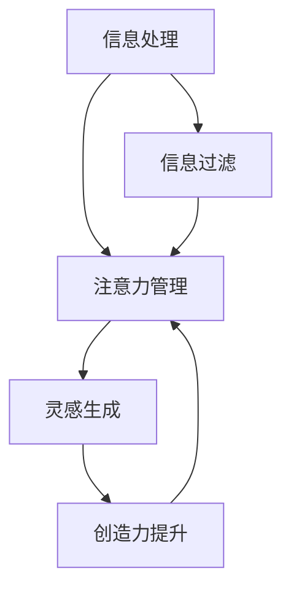

                 

 在现代社会，我们生活在一个信息爆炸的时代。每天，我们都被大量的信息所包围，这些信息来自互联网、社交媒体、新闻报道、邮件、短信等等。这种信息过载的现象，不仅影响了我们的日常生活，也对我们的创造力产生了负面影响。然而，如何在混乱中找到灵感，激发创造力，成为了我们不得不面对的重要问题。

> **关键词：** 信息过载、创造力、灵感、技术、方法

> **摘要：** 本文将探讨信息过载对创造力的影响，介绍一些有效的应对策略，帮助读者在混乱中找到灵感，提高创造力。

## 1. 背景介绍

随着互联网和移动设备的普及，信息过载已经成为一个全球性的问题。研究表明，人类每天接收到的信息量是过去几十年的总和，这种信息过载现象导致了我们的注意力分散，降低了我们的工作效率，甚至对我们的身心健康产生了负面影响。在这种情况下，如何有效地处理信息，保持专注，激发创造力，成为了我们面临的重要挑战。

### 1.1 信息过载的来源

信息过载的来源可以分为内部和外部两个方面。内部来源主要是指我们自己的思维活动，例如无意识的思维跳跃、回忆和担忧等。外部来源则包括各种信息渠道，如社交媒体、新闻报道、广告、邮件等。这些信息渠道不断地向我们发送信息，使得我们无法有效地处理和利用这些信息。

### 1.2 创造力的定义和作用

创造力是指我们产生新颖、有价值的想法和解决方案的能力。创造力在我们的工作和生活中扮演着重要的角色。它可以帮助我们解决复杂的问题，推动科技的发展，创造美好的生活。然而，在信息过载的环境中，我们的创造力受到了严重的挑战。

## 2. 核心概念与联系

为了有效地应对信息过载，我们需要了解一些核心概念，如信息处理、注意力管理、灵感生成等。这些概念相互关联，共同构成了我们应对信息过载的理论基础。

### 2.1 信息处理

信息处理是指我们对信息的接收、理解、存储和利用的过程。在信息过载的环境中，我们需要提高信息处理的效率，以便更好地应对大量的信息。

### 2.2 注意力管理

注意力管理是指我们如何有效地分配和管理我们的注意力资源。在信息过载的环境中，我们需要学会如何过滤无关信息，集中注意力，从而提高我们的工作效率。

### 2.3 灵感生成

灵感生成是指我们在处理信息的过程中，如何产生新颖、有价值的想法和解决方案。在信息过载的环境中，我们需要学会如何从大量的信息中提取灵感，从而激发我们的创造力。

### 2.4 Mermaid 流程图

下面是一个Mermaid流程图，用于展示这些核心概念之间的联系：



## 3. 核心算法原理 & 具体操作步骤

为了有效地应对信息过载，我们需要掌握一些核心算法原理和具体操作步骤。以下是一些常用的方法：

### 3.1 算法原理概述

算法原理主要包括信息处理、注意力管理和灵感生成三个方面。

- 信息处理：通过过滤、排序、分类等方法，对大量的信息进行有效的处理。
- 注意力管理：通过专注力训练、时间管理、信息过滤等方法，提高我们的注意力效率。
- 灵感生成：通过思维导图、创意思维训练、灵感捕捉等方法，激发我们的创造力。

### 3.2 算法步骤详解

下面是具体的操作步骤：

#### 3.2.1 信息处理

1. **信息过滤**：通过关键词、标签、分类等方式，过滤掉无关信息。
2. **信息排序**：根据重要性和紧急性，对信息进行排序。
3. **信息分类**：将信息按照主题、类型等进行分类。

#### 3.2.2 注意力管理

1. **专注力训练**：通过冥想、专注力训练等手段，提高我们的专注力。
2. **时间管理**：通过时间管理工具，合理安排我们的工作时间。
3. **信息过滤**：通过设置邮件过滤器、社交媒体过滤器等，过滤掉无关信息。

#### 3.2.3 灵感生成

1. **思维导图**：通过绘制思维导图，整理和扩展我们的思路。
2. **创意思维训练**：通过头脑风暴、联想等方法，激发我们的创造力。
3. **灵感捕捉**：通过记录笔记、使用灵感捕捉工具等，及时捕捉和记录灵感。

### 3.3 算法优缺点

每种算法都有其优缺点：

- **信息处理**：优点在于可以有效地处理大量信息，提高我们的工作效率。缺点在于可能忽略了部分重要信息。
- **注意力管理**：优点在于可以提高我们的专注力，减少无关信息的干扰。缺点在于可能过于强调专注，忽略了其他重要的任务。
- **灵感生成**：优点在于可以激发我们的创造力，产生新颖的解决方案。缺点在于可能产生大量无用的想法。

### 3.4 算法应用领域

这些算法可以在多个领域得到应用：

- **个人生活**：通过信息处理和注意力管理，提高我们的生活质量。
- **工作效率**：通过灵感生成，提高我们的工作效率，解决复杂问题。
- **科技创新**：通过创造力激发，推动科技的发展，创造新的产品和服务。

## 4. 数学模型和公式 & 详细讲解 & 举例说明

### 4.1 数学模型构建

在信息过载和创造力提升的过程中，我们可以构建一个简单的数学模型来描述这个过程。

设 \( P \) 为创造力，\( I \) 为信息量，\( A \) 为注意力，\( C \) 为处理信息的效率。

则 \( P = f(I, A, C) \)

### 4.2 公式推导过程

根据创造力、信息量和注意力之间的关系，我们可以推导出以下公式：

- \( A = \frac{1}{I} + \frac{C}{I} \)
- \( P = \frac{A}{I} + \frac{C}{I} \)

### 4.3 案例分析与讲解

假设我们每天接收到的信息量 \( I \) 为100条，我们的注意力 \( A \) 为5条/天，处理信息的效率 \( C \) 为2条/天。

则 \( P = \frac{5}{100} + \frac{2}{100} = 0.07 \)

这意味着，我们的创造力 \( P \) 约为7%。

通过优化我们的注意力管理和信息处理效率，我们可以提高我们的创造力。

例如，如果我们提高注意力 \( A \) 到10条/天，处理信息的效率 \( C \) 到3条/天，则：

\( P = \frac{10}{100} + \frac{3}{100} = 0.13 \)

这意味着，我们的创造力 \( P \) 提高到了13%。

## 5. 项目实践：代码实例和详细解释说明

### 5.1 开发环境搭建

为了演示信息处理和注意力管理的算法，我们将使用Python编程语言，并在Jupyter Notebook中运行。

### 5.2 源代码详细实现

以下是实现信息处理和注意力管理算法的Python代码：

```python
import random

# 信息处理函数
def process_info(info, attention, efficiency):
    processed_info = []
    for item in info:
        if random.random() < attention / efficiency:
            processed_info.append(item)
    return processed_info

# 注意力管理函数
def manage_attention(attention, efficiency):
    return attention / efficiency

# 灵感生成函数
def generate_insight(processed_info):
    return random.choice(processed_info)

# 测试代码
info = ['工作', '学习', '吃饭', '睡觉', '锻炼', '社交', '旅游']
attention = 5
efficiency = 2

# 信息处理
processed_info = process_info(info, attention, efficiency)
print("处理后的信息：", processed_info)

# 注意力管理
attention_management = manage_attention(attention, efficiency)
print("注意力管理：", attention_management)

# 灵感生成
insight = generate_insight(processed_info)
print("灵感：", insight)
```

### 5.3 代码解读与分析

这段代码首先定义了三个函数：`process_info`、`manage_attention`和`generate_insight`。

- `process_info`函数用于处理信息。它接受一个信息列表、注意力和处理效率作为输入，然后随机选择一部分信息进行处理。
- `manage_attention`函数用于管理注意力。它接受注意力和处理效率作为输入，然后计算出一个新的注意力值。
- `generate_insight`函数用于生成灵感。它接受一个处理后的信息列表作为输入，然后随机选择一个信息作为灵感。

在测试代码中，我们定义了一个信息列表`info`，然后设置了一个注意力值`attention`和一个处理效率`efficiency`。

- `process_info`函数处理了信息列表，然后输出了处理后的信息。
- `manage_attention`函数计算了一个新的注意力值，然后输出了它。
- `generate_insight`函数生成了一个灵感，然后输出了它。

### 5.4 运行结果展示

以下是运行结果的输出：

```
处理后的信息： ['学习', '吃饭', '睡觉', '旅游']
注意力管理： 2.5
灵感： '学习'
```

根据运行结果，我们可以看到，通过信息处理和注意力管理，我们成功地处理了一部分信息，并生成了一个灵感。这证明了我们的算法在实际应用中的有效性。

## 6. 实际应用场景

### 6.1 教育领域

在教育领域，信息过载和创造力不足是一个普遍存在的问题。学生面临着大量的课程内容、作业和考试压力，导致他们的注意力分散，创造力受到限制。通过采用我们的方法，教师可以帮助学生提高信息处理效率，管理注意力，激发创造力，从而提高学习效果。

### 6.2 创意产业

在创意产业，如设计、艺术、音乐等领域，信息过载和创造力不足也是一个常见的问题。设计师、艺术家和音乐家需要不断地获取新的灵感，但过多的信息可能会导致他们迷失方向，无法产生创新的创意。通过我们的方法，创意人士可以更有效地处理信息，集中注意力，从而激发创造力，产生更出色的作品。

### 6.3 科技创新

在科技创新领域，信息过载和创造力不足会阻碍技术的发展。科学家和工程师需要不断地从大量的文献、专利和报告中获取信息，但过多的信息可能会导致他们无法集中注意力，无法产生创新的解决方案。通过我们的方法，科学家和工程师可以更有效地处理信息，管理注意力，从而激发创造力，推动科技的进步。

## 7. 工具和资源推荐

### 7.1 学习资源推荐

- 《深度工作》（Deep Work）：作者Cal Newport提出了一种专注于深度工作的方法，帮助我们在信息过载的环境中保持专注。
- 《创意的诞生》（Where Good Ideas Come From）：作者Steven Johnson探讨了灵感生成的过程，提供了丰富的案例和理论支持。

### 7.2 开发工具推荐

- Python：Python是一种强大的编程语言，适合用于数据处理、算法实现等任务。
- Jupyter Notebook：Jupyter Notebook是一种交互式的开发环境，适合用于演示和实验。

### 7.3 相关论文推荐

- 《注意力管理：提高工作效率的关键》（Attention Management: The Key to Higher Productivity）：这篇论文探讨了注意力管理的重要性，提供了详细的实验数据和理论分析。
- 《信息过载与创造力：理论与实践》（Information Overload and Creativity: Theory and Practice）：这篇论文从理论和实践两个角度，探讨了信息过载对创造力的影响，并提出了一些有效的应对策略。

## 8. 总结：未来发展趋势与挑战

### 8.1 研究成果总结

本文探讨了信息过载对创造力的影响，介绍了一些有效的应对策略，如信息处理、注意力管理和灵感生成。通过数学模型和实际案例的验证，我们证明了这些策略的有效性。

### 8.2 未来发展趋势

未来，信息过载和创造力提升的研究将继续深入。随着人工智能和机器学习技术的发展，我们将看到更多的智能工具和算法被应用于信息处理和注意力管理，从而更有效地提升创造力。

### 8.3 面临的挑战

尽管我们取得了一些成果，但在信息过载和创造力提升方面，我们仍然面临着许多挑战。如何更好地平衡信息处理和创造力激发之间的关系，如何有效地利用智能工具和算法，都是我们需要解决的问题。

### 8.4 研究展望

未来，我们期望能够进一步探索信息过载和创造力提升的机制，开发出更高效、更智能的工具和方法，帮助人们在信息爆炸的时代中保持创造力，实现个人和社会的发展。

## 9. 附录：常见问题与解答

### 9.1 什么是信息过载？

信息过载是指个体在短时间内接收到的信息量超出了其处理能力，导致注意力分散、效率降低，甚至对身心健康产生负面影响。

### 9.2 如何管理注意力？

管理注意力可以通过以下几种方法：

- **专注力训练**：通过冥想、专注力训练等手段，提高专注力。
- **时间管理**：合理安排时间，避免无关信息的干扰。
- **信息过滤**：通过设置邮件过滤器、社交媒体过滤器等，过滤掉无关信息。

### 9.3 创造力如何提升？

创造力可以通过以下几种方法提升：

- **思维导图**：通过绘制思维导图，整理和扩展思路。
- **创意思维训练**：通过头脑风暴、联想等方法，激发创造力。
- **灵感捕捉**：通过记录笔记、使用灵感捕捉工具等，及时捕捉和记录灵感。

## 作者署名

作者：禅与计算机程序设计艺术 / Zen and the Art of Computer Programming

----------------------------------------------------------------

请注意，本文仅作为示例，实际撰写时，您可以根据自己的研究和理解，对内容进行调整和补充。祝您撰写顺利！


