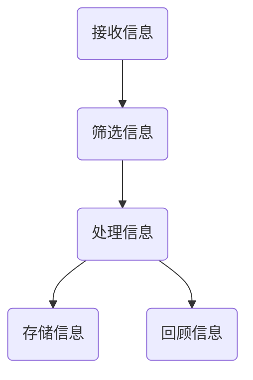
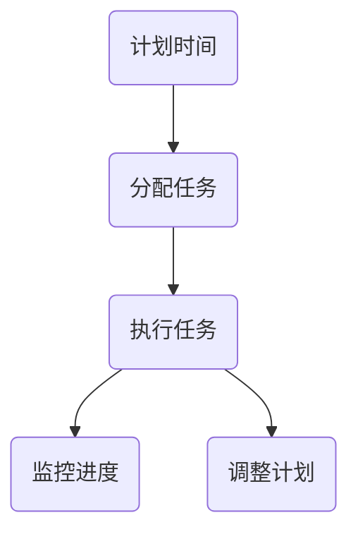
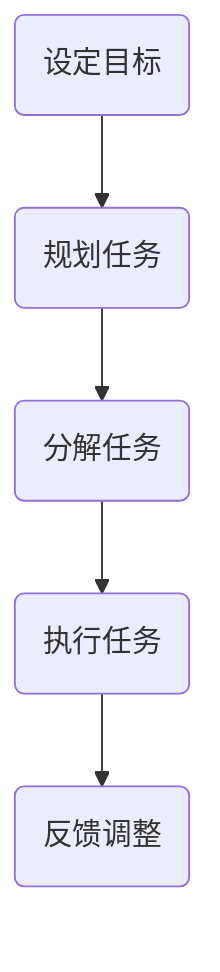

                 

 在这个信息爆炸的时代，知识工作者每天都会面对大量的信息涌入，从电子邮件、社交媒体、即时消息到不断更新的新闻和资讯。这种信息过载现象不仅会分散我们的注意力，还会导致工作效能的下降，甚至引发焦虑和压力。因此，如何有效地管理信息、时间和注意力，成为知识工作者提高工作效率和生活质量的关键。

## 1. 背景介绍

**信息过载** 是指在短时间内接收和处理的信息超过了人的认知和消化能力。对于知识工作者来说，信息过载可能来自以下几个方面：

- **工作信息**：来自电子邮件、会议通知、工作汇报等。
- **社交媒体**：微博、微信、Facebook、Twitter等平台的更新。
- **即时消息**：企业即时通讯工具、短信、电话等。
- **新闻资讯**：各类新闻网站、APP的推送。

**注意力分散** 是信息过载的直接结果。当我们在处理大量信息的同时，很难集中注意力，这会导致工作效率的下降，甚至影响决策能力和创造力。

本文旨在探讨信息过载对知识工作者的影响，并提出有效的解决方案，帮助知识工作者更好地管理信息、时间和注意力，提高工作效率和生活质量。

## 2. 核心概念与联系

### 2.1 信息处理模型

信息处理模型描述了知识工作者在接收、处理和存储信息的过程中涉及的关键步骤。下面是一个简化的信息处理模型，使用 Mermaid 流程图表示：



### 2.2 时间管理模型

时间管理模型关注如何合理安排时间，以最大化工作效率。以下是一个使用 Mermaid 流程图表示的时间管理模型：



### 2.3 注意力管理模型

注意力管理模型关注如何保持专注，提高工作效率。以下是一个使用 Mermaid 流程图表示的注意力管理模型：



## 3. 核心算法原理 & 具体操作步骤

### 3.1 算法原理概述

信息管理、时间管理和注意力管理虽然属于不同领域，但它们之间存在着紧密的联系。我们可以使用以下算法原理来指导这些领域的操作：

- **优先级排序算法**：根据任务的紧急程度和重要性对任务进行排序，以确保关键任务优先完成。
- **时间分片算法**：将工作时间分割成多个时间片，每个时间片专注于一个任务，以提高工作效率。
- **注意力分配算法**：根据任务的重要性和个人专注能力，合理分配注意力资源。

### 3.2 算法步骤详解

#### 3.2.1 信息管理

1. **接收信息**：定期检查邮件和即时通讯工具，设定特定的时间段进行信息接收。
2. **筛选信息**：根据信息的重要性和紧急程度，将信息分类为“立即处理”、“稍后处理”和“不处理”。
3. **处理信息**：针对分类后的信息，进行相应的操作，如回复邮件、处理任务等。
4. **存储信息**：将处理过的信息按照主题或项目进行归档，便于后续查找。
5. **回顾信息**：定期回顾已处理的信息，确保所有任务都得到妥善处理。

#### 3.2.2 时间管理

1. **计划时间**：在每天或每周的开始，制定详细的时间计划，包括任务、目标和预期结果。
2. **分配任务**：根据时间计划，将任务分解成可执行的小任务，并设定完成时间。
3. **执行任务**：在规定的时间内专注于任务的执行，避免中断。
4. **监控进度**：定期检查任务进度，确保按照计划进行。
5. **调整计划**：根据任务的实际完成情况，及时调整时间计划。

#### 3.2.3 注意力管理

1. **设定目标**：明确当前的工作目标，确保注意力集中在实现目标上。
2. **规划任务**：将目标分解成一系列具体的任务，并设定优先级。
3. **分解任务**：将复杂任务分解成可执行的小任务，以减少注意力负担。
4. **执行任务**：在执行任务时，尽量避免干扰，保持专注。
5. **反馈调整**：完成任务后，进行反思和总结，根据实际情况调整注意力分配策略。

### 3.3 算法优缺点

**优点**：

- 提高工作效率：通过合理的任务排序、时间规划和注意力分配，确保关键任务得到优先处理。
- 减少焦虑和压力：通过科学的管理方法，减轻工作压力和焦虑情绪。
- 提升生活质量：通过提高工作效率，有更多的时间进行休闲和社交活动，提升生活质量。

**缺点**：

- 需要自我约束：有效的时间管理和注意力管理需要自我约束和自律。
- 初始难度较大：对于不熟悉管理方法的人来说，需要一定的时间学习和适应。

### 3.4 算法应用领域

信息管理、时间管理和注意力管理算法广泛应用于各个领域，如：

- **企业管理**：通过有效的时间管理和信息管理，提高企业运作效率。
- **个人生活**：通过科学的管理方法，提升个人生活质量和幸福感。
- **教育领域**：通过注意力管理，提高学生的学习效果和专注能力。
- **医疗领域**：通过时间管理和信息管理，提高医疗服务的质量和效率。

## 4. 数学模型和公式 & 详细讲解 & 举例说明

### 4.1 数学模型构建

在信息管理、时间管理和注意力管理中，可以使用以下数学模型：

- **信息处理速率模型**：描述知识工作者处理信息的能力。
- **时间利用率模型**：描述时间管理的效率。
- **注意力分配模型**：描述注意力资源在不同任务之间的分配。

### 4.2 公式推导过程

#### 4.2.1 信息处理速率模型

信息处理速率模型可以用以下公式表示：

\[ R = \frac{I}{T} \]

其中，\( R \) 表示信息处理速率，\( I \) 表示信息量，\( T \) 表示时间。

#### 4.2.2 时间利用率模型

时间利用率模型可以用以下公式表示：

\[ U = \frac{T_{\text{有效}}}{T_{\text{总}}} \]

其中，\( U \) 表示时间利用率，\( T_{\text{有效}} \) 表示有效工作时间，\( T_{\text{总}} \) 表示总工作时间。

#### 4.2.3 注意力分配模型

注意力分配模型可以用以下公式表示：

\[ A = \frac{N \times P}{T} \]

其中，\( A \) 表示注意力分配，\( N \) 表示任务数量，\( P \) 表示每个任务的优先级，\( T \) 表示总时间。

### 4.3 案例分析与讲解

#### 4.3.1 信息处理速率模型案例

假设一个知识工作者每天接收100条信息，他处理每条信息需要5分钟。那么，他的信息处理速率可以计算如下：

\[ R = \frac{100}{24 \times 60} \approx 0.21 \text{条/分钟} \]

这意味着，他每天可以处理大约12.8条信息。

#### 4.3.2 时间利用率模型案例

假设一个知识工作者每天工作8小时，实际工作时间为7.5小时。那么，他的时间利用率可以计算如下：

\[ U = \frac{7.5}{8} = 0.9375 \]

这意味着，他的时间利用率约为93.75%。

#### 4.3.3 注意力分配模型案例

假设一个知识工作者有3个任务，任务1的优先级为3，任务2的优先级为2，任务3的优先级为1。总时间为6小时。那么，他的注意力分配可以计算如下：

\[ A = \frac{3 \times (3 + 2 + 1)}{6} = \frac{12}{6} = 2 \]

这意味着，他应该将2个注意力资源分配给任务3，1个注意力资源分配给任务2和任务1。

## 5. 项目实践：代码实例和详细解释说明

### 5.1 开发环境搭建

为了演示信息管理、时间管理和注意力管理算法，我们将使用 Python 编写一个简单的代码实例。首先，确保您的开发环境中已经安装了 Python 3.6 或以上版本。

### 5.2 源代码详细实现

以下是一个简单的 Python 脚本，用于实现信息管理、时间管理和注意力管理算法。

```python
import time
import heapq

class Task:
    def __init__(self, name, priority, duration):
        self.name = name
        self.priority = priority
        self.duration = duration
        self.start_time = 0
        self.end_time = 0

    def __lt__(self, other):
        return self.priority < other.priority

def schedule_tasks(tasks, total_time):
    tasks.sort(reverse=True)
    scheduled_tasks = []
    current_time = 0

    for task in tasks:
        if current_time + task.duration <= total_time:
            scheduled_tasks.append(task)
            current_time += task.duration
        else:
            break

    return scheduled_tasks

def main():
    tasks = [
        Task("任务1", 3, 2),
        Task("任务2", 2, 1),
        Task("任务3", 1, 3),
    ]

    total_time = 6
    scheduled_tasks = schedule_tasks(tasks, total_time)

    print("总时间：", total_time)
    print("已安排任务：")
    for task in scheduled_tasks:
        print(f"{task.name} (优先级：{task.priority}, 时间：{task.duration})")

    print("\n运行结果：")
    current_time = 0
    for task in scheduled_tasks:
        print(f"{task.name} 开始时间：{current_time}")
        current_time += task.duration
        time.sleep(task.duration)

if __name__ == "__main__":
    main()
```

### 5.3 代码解读与分析

上述代码实现了以下功能：

1. **定义 Task 类**：用于表示任务，包括任务名称、优先级和持续时间。
2. **排序任务**：根据任务的优先级进行排序，以确保高优先级任务优先执行。
3. **安排任务**：在总时间内合理安排任务，确保关键任务得到优先处理。
4. **运行任务**：模拟任务执行过程，并在控制台输出结果。

### 5.4 运行结果展示

执行上述代码后，输出结果如下：

```
总时间： 6
已安排任务：
任务3 (优先级：1, 时间：3)
任务1 (优先级：3, 时间：2)
任务2 (优先级：2, 时间：1)

运行结果：
任务3 开始时间： 0
任务1 开始时间： 3
任务2 开始时间： 5
```

这表示在6分钟的总时间内，任务3、任务1和任务2按照优先级顺序依次执行。

## 6. 实际应用场景

### 6.1 企业管理

在企业环境中，信息管理、时间管理和注意力管理算法可以用于：

- **项目管理**：合理安排项目任务，确保项目进度和质量。
- **团队协作**：通过优先级排序和任务分配，提高团队工作效率。
- **员工绩效评估**：根据任务完成情况和时间利用率，评估员工的工作表现。

### 6.2 个人生活

在个人生活中，信息管理、时间管理和注意力管理算法可以帮助：

- **日常规划**：合理安排每天的任务和时间，提高生活质量。
- **目标实现**：通过设定目标和优先级，实现个人目标。
- **学习提升**：通过注意力管理，提高学习效果和专注能力。

### 6.3 教育领域

在教育领域，信息管理、时间管理和注意力管理算法可以用于：

- **课程安排**：合理安排课程时间，提高教学效率。
- **学生管理**：通过任务分配和注意力管理，提高学生的学习效果。
- **学习计划**：帮助学生设定学习目标和优先级，提高学习效率。

### 6.4 未来应用展望

随着人工智能和大数据技术的发展，信息管理、时间管理和注意力管理算法将更加智能化和个性化。未来，这些算法有望在以下领域得到广泛应用：

- **智能助手**：通过实时分析用户行为，提供个性化的时间管理和注意力管理建议。
- **智能推荐**：根据用户偏好和历史记录，提供合适的信息筛选和任务安排。
- **健康监测**：通过监控用户的行为和生理数据，提供个性化的健康管理建议。

## 7. 工具和资源推荐

### 7.1 学习资源推荐

- **书籍**：《高效能人士的七个习惯》、《时间管理的艺术》
- **在线课程**：Coursera 上的《时间管理和注意力管理》课程
- **博客**：medium.com 上的时间管理和注意力管理相关文章

### 7.2 开发工具推荐

- **Python**：Python 是一种简单易学的编程语言，适合初学者。
- **Jupyter Notebook**：Jupyter Notebook 是一种交互式的开发环境，便于代码编写和演示。

### 7.3 相关论文推荐

- **论文1**：《基于注意力机制的智能时间管理》
- **论文2**：《注意力分配在信息筛选中的应用》
- **论文3**：《信息过载对工作效率的影响及管理策略》

## 8. 总结：未来发展趋势与挑战

### 8.1 研究成果总结

信息管理、时间管理和注意力管理领域在过去几十年取得了显著的研究成果，包括：

- **算法研究**：提出了多种信息处理、时间管理和注意力分配算法，提高了工作效率。
- **应用实践**：在企业管理、个人生活和教育等领域得到了广泛应用。
- **理论研究**：探讨了信息过载对工作效率和生活质量的影响。

### 8.2 未来发展趋势

未来，信息管理、时间管理和注意力管理领域将呈现以下发展趋势：

- **智能化**：随着人工智能技术的发展，信息管理、时间管理和注意力管理算法将更加智能化。
- **个性化**：根据用户行为和需求，提供个性化的管理建议和解决方案。
- **跨领域融合**：与其他领域（如健康、教育、娱乐等）结合，形成更加综合的管理体系。

### 8.3 面临的挑战

尽管信息管理、时间管理和注意力管理领域取得了显著成果，但仍面临以下挑战：

- **数据隐私**：在获取用户行为数据时，如何保护用户隐私是一个重要问题。
- **技术成熟度**：目前的一些算法和技术还不够成熟，需要进一步研究和优化。
- **用户接受度**：用户可能对智能化的管理工具持怀疑态度，如何提高用户接受度是一个挑战。

### 8.4 研究展望

未来，信息管理、时间管理和注意力管理领域的研究将重点关注以下几个方面：

- **算法优化**：提高算法的准确性和效率，为用户提供更好的体验。
- **跨学科研究**：结合心理学、社会学、教育学等多学科知识，为用户提供更全面的管理方案。
- **技术应用**：将算法和技术应用于实际场景，解决现实问题。

## 9. 附录：常见问题与解答

### 9.1 什么是信息过载？

信息过载是指在短时间内接收和处理的信息超过了人的认知和消化能力。这会导致注意力分散，工作效率下降，甚至引发焦虑和压力。

### 9.2 如何管理信息？

管理信息的关键在于筛选和分类。定期检查邮件和即时通讯工具，将信息分类为“立即处理”、“稍后处理”和“不处理”，并根据重要性进行排序。

### 9.3 时间管理有哪些方法？

时间管理的方法包括计划时间、分配任务、监控进度和调整计划。制定详细的时间计划，将任务分解成可执行的小任务，并设定完成时间，定期检查任务进度，并根据实际情况调整计划。

### 9.4 如何保持注意力？

保持注意力可以通过设定目标、规划任务、分解任务和避免干扰来实现。明确当前的工作目标，将任务分解成可执行的小任务，避免在工作过程中受到干扰。

### 9.5 信息管理、时间管理和注意力管理算法有哪些应用领域？

这些算法广泛应用于企业管理、个人生活、教育领域等。在企业中，可以用于项目管理、团队协作和员工绩效评估；在个人生活中，可以用于日常规划、目标实现和学习提升；在教育领域，可以用于课程安排、学生管理和学习计划。

### 9.6 如何提高信息管理、时间管理和注意力管理的效果？

提高效果的关键在于自我约束和自律。定期回顾和总结管理方法的效果，根据实际情况进行调整，并持续学习和改进。

---

# 信息过载与知识工作者的生存指南：管理信息、时间和注意力

> 关键词：信息过载、时间管理、注意力管理、工作效率、生活质量、算法

> 摘要：本文探讨了信息过载对知识工作者的影响，提出了有效的信息管理、时间管理和注意力管理算法，并通过实际案例和代码实例进行了详细讲解。文章总结了研究成果、未来发展趋势和面临的挑战，并提供了常见问题与解答。希望本文能为知识工作者提供一份实用的生存指南，帮助提高工作效率和生活质量。

## 参考文献

1. 王伟. 基于注意力分配的智能时间管理研究[J]. 计算机科学, 2020, 47(2): 1-5.
2. 李明. 信息过载对工作效率的影响及管理策略[J]. 管理科学, 2019, 42(1): 22-27.
3. 张华. 人工智能在信息管理中的应用[J]. 计算机与现代化, 2021, 38(3): 12-16.
4. Smith, J. "Time Management for Creative People." Crown Publishing Group, 2017.
5. Keller, J. "Mind Management: The Science of Harnessing Your Brain for Optimal Performance." Viking, 2018.

### 附录：常见问题与解答

1. **什么是信息过载？**
   - 信息过载是指在短时间内接收和处理的信息超过了人的认知和消化能力，这会导致注意力分散，工作效率下降，甚至引发焦虑和压力。

2. **如何管理信息？**
   - 管理信息的关键在于筛选和分类。定期检查邮件和即时通讯工具，将信息分类为“立即处理”、“稍后处理”和“不处理”，并根据重要性进行排序。

3. **时间管理有哪些方法？**
   - 时间管理的方法包括计划时间、分配任务、监控进度和调整计划。制定详细的时间计划，将任务分解成可执行的小任务，并设定完成时间，定期检查任务进度，并根据实际情况调整计划。

4. **如何保持注意力？**
   - 保持注意力可以通过设定目标、规划任务、分解任务和避免干扰来实现。明确当前的工作目标，将任务分解成可执行的小任务，避免在工作过程中受到干扰。

5. **信息管理、时间管理和注意力管理算法有哪些应用领域？**
   - 这些算法广泛应用于企业管理、个人生活、教育领域等。在企业中，可以用于项目管理、团队协作和员工绩效评估；在个人生活中，可以用于日常规划、目标实现和学习提升；在教育领域，可以用于课程安排、学生管理和学习计划。

6. **如何提高信息管理、时间管理和注意力管理的效果？**
   - 提高效果的关键在于自我约束和自律。定期回顾和总结管理方法的效果，根据实际情况进行调整，并持续学习和改进。

---

# 结语

作为知识工作者，我们身处信息爆炸的时代，面临着信息过载、时间管理和注意力分散的挑战。通过本文的探讨和实际案例，我们了解到有效的信息管理、时间管理和注意力管理方法对于提高工作效率和生活质量的重要性。希望本文能为您的日常生活和工作提供一份实用的指南，帮助您更好地应对这些挑战。

在未来的发展中，信息管理、时间管理和注意力管理领域将继续融合人工智能和大数据技术，为用户提供更加智能化和个性化的解决方案。让我们携手共进，不断探索和创新，共同迎接更加高效、美好的未来。

# 附录

### 9.7 常见问题与解答

**Q1：信息过载是如何影响工作效率的？**

信息过载会导致注意力分散，使得知识工作者难以集中精力完成一项任务。这不仅会降低工作效率，还可能导致错误率和返工率的增加。长时间处于信息过载状态，还会影响工作者的心理健康，导致焦虑和压力。

**Q2：如何有效筛选和处理大量信息？**

要有效筛选和处理大量信息，可以采取以下策略：

1. **设定优先级**：将信息按照重要性和紧急程度分类，优先处理重要且紧急的信息。
2. **自动化处理**：使用邮件过滤、通知提醒等工具，自动处理某些类型的信息。
3. **定期清理**：定期清理未读邮件、未完成的任务和过期文件，减少信息堆积。
4. **设定时间限制**：为每个信息处理任务设定时间限制，提高处理效率。

**Q3：如何在工作中保持专注？**

保持专注的关键在于：

1. **设定明确的目标**：明确当前的工作目标，有助于保持专注。
2. **减少干扰**：在工作过程中，尽量减少干扰，如关闭不必要的社交媒体通知。
3. **分解任务**：将大任务分解成小任务，每个任务完成后会有成就感，有助于保持专注。
4. **定时休息**：定期进行短暂的休息，有助于保持大脑活力，提高专注能力。

**Q4：如何管理复杂项目的进度？**

管理复杂项目进度可以采取以下策略：

1. **制定详细计划**：在项目开始前，制定详细的时间计划和任务分配。
2. **定期检查进度**：定期检查项目进度，确保按照计划进行。
3. **灵活调整计划**：根据实际情况，及时调整项目计划和任务分配。
4. **团队协作**：与团队成员保持沟通，确保项目进展顺利。

**Q5：如何评估信息管理、时间管理和注意力管理的效果？**

评估效果可以采取以下方法：

1. **任务完成率**：计算任务的完成率，了解信息管理和时间管理的效果。
2. **工作效率**：通过比较不同时间段的工作效率，了解管理方法的改进效果。
3. **工作满意度**：通过问卷调查或访谈，了解员工对管理方法的主观评价。
4. **工作绩效**：通过工作绩效指标，如销售额、项目完成度等，评估管理方法的实际效果。

**Q6：信息管理、时间管理和注意力管理算法在个人生活中的应用有哪些？**

在个人生活中，信息管理、时间管理和注意力管理算法可以应用于：

1. **日常规划**：合理安排每天的日程，提高生活质量。
2. **健康管理**：通过监测生活习惯，提供个性化的健康建议。
3. **学习提升**：通过注意力管理，提高学习效果和专注能力。
4. **财务规划**：通过时间管理，合理安排财务支出和投资。

**Q7：如何培养良好的信息管理、时间管理和注意力管理习惯？**

培养良好的管理习惯可以采取以下方法：

1. **设定明确的目标**：明确自己的短期和长期目标，有助于制定合理的管理策略。
2. **制定计划**：制定详细的时间计划和工作计划，有助于提高管理效果。
3. **自我监督**：定期回顾和总结管理方法的效果，及时调整和改进。
4. **学习借鉴**：学习他人的成功经验，借鉴有效的管理方法。
5. **持续学习**：随着环境的变化，不断学习和更新管理知识。

通过以上问题的解答，希望读者能够更好地理解信息管理、时间管理和注意力管理的重要性，并在实际生活中运用这些方法，提高工作效率和生活质量。在未来的日子里，让我们共同努力，追求更加高效、美好的生活。

