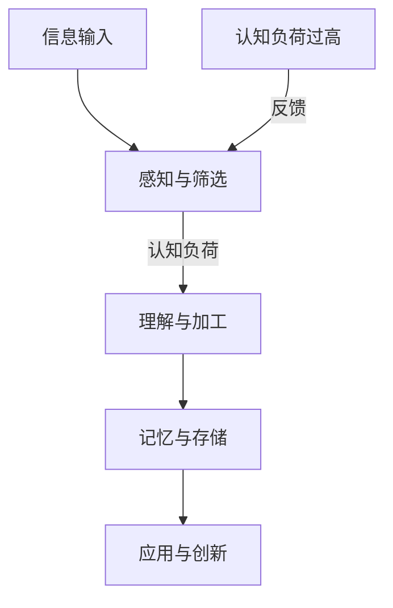
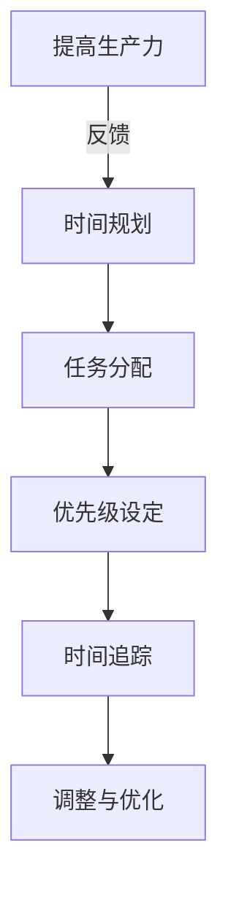
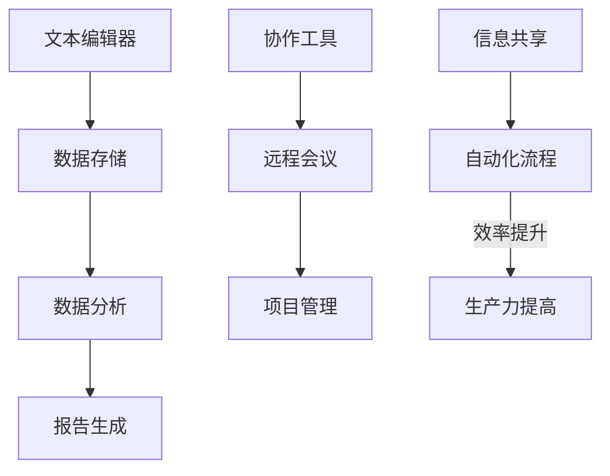
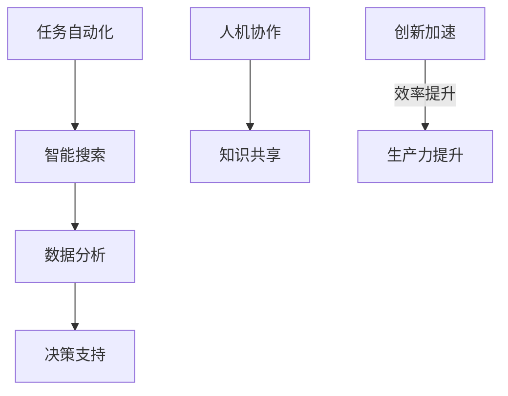

                 

### 关键词 Keywords
- 信息过载
- 知识工作
- 生产力
- 时间管理
- 技术工具
- 人工智能

### 摘要 Summary
在现代信息爆炸的时代，知识工作者面临着信息过载的挑战。本文将探讨如何在信息洪流中保持生产力，包括时间管理策略、技术工具的使用、人工智能辅助，以及如何构建有效的知识管理体系。通过深入分析这些主题，本文旨在为知识工作者提供实用的建议，帮助他们更高效地处理信息，提升工作效率。

## 1. 背景介绍

在当今全球化的知识经济时代，信息的产生和传播速度达到了前所未有的高度。据估计，人类现在每两年产生的信息量相当于过去5000年的总和。这种信息爆炸式增长给知识工作者带来了巨大的挑战，信息过载现象日益严重。信息过载不仅仅是指信息的数量，更重要的是信息的质量和相关性。大量的冗余和不相关信息的涌入，使得知识工作者难以聚焦于核心任务，降低了工作效率。

此外，知识工作者的角色日益复杂，他们不仅需要处理大量的信息，还需要进行分析、创造和创新。在这个过程中，时间管理成为了一个关键因素。有效的信息管理不仅能够提高工作效率，还能够减少因信息处理不当带来的焦虑和压力。

本文将围绕以下几个核心问题展开讨论：

1. 如何识别和处理信息过载？
2. 时间管理在提升生产力中的重要性是什么？
3. 技术工具如何帮助我们更有效地处理信息？
4. 人工智能在知识工作中的应用如何改变我们的生产方式？
5. 如何构建有效的知识管理体系？

通过以上问题的探讨，本文旨在为知识工作者提供一套实用的策略和方法，帮助他们更好地应对信息过载的挑战，保持高生产力。

## 2. 核心概念与联系

在深入探讨如何提升知识工作者的生产力之前，我们需要明确几个核心概念，并了解它们之间的联系。

### 2.1 信息处理与认知负荷

信息处理是指个体接收、理解、存储和运用信息的过程。认知负荷则是指在进行信息处理时，大脑需要投入的认知资源。过高的认知负荷会导致大脑疲劳，降低信息处理效率。为了更好地理解这一点，我们可以用Mermaid流程图来表示信息处理和认知负荷之间的关系。



从图中可以看出，信息输入后首先经过感知与筛选，然后进入理解与加工阶段。如果认知负荷过高，大脑将难以有效处理信息，从而影响记忆与存储，甚至可能返回到筛选阶段，导致信息处理效率下降。

### 2.2 时间管理与生产力

时间管理是指通过规划和组织时间来提高工作效率和生产力。生产力则是指在一定时间内创造的价值或完成的工作量。时间管理与生产力之间的关系可以用以下Mermaid流程图表示：



从流程图中可以看出，时间规划是时间管理的起点，通过任务分配和优先级设定，我们可以有效地安排工作。时间追踪可以帮助我们了解时间使用情况，从而进行调整和优化，最终提高生产力。

### 2.3 技术工具与信息处理

技术工具在信息处理中扮演着重要的角色。从基本的文本编辑器到复杂的数据库管理系统，这些工具可以帮助我们更高效地处理信息。技术工具与信息处理之间的关系可以用以下Mermaid流程图表示：



从图中可以看出，技术工具的应用涵盖了从数据存储、数据分析到信息共享的各个环节。通过自动化流程，我们可以减少重复劳动，提高工作效率，从而提升生产力。

### 2.4 人工智能与知识工作

人工智能（AI）正在逐步改变知识工作的模式。AI可以帮助我们自动化重复性任务，提供智能搜索和推荐，甚至进行复杂的数据分析和决策支持。人工智能与知识工作之间的关系可以用以下Mermaid流程图表示：



从流程图中可以看出，人工智能不仅能够提高工作效率，还能够促进知识的共享和创新，从而进一步提升生产力。

通过以上核心概念和联系的介绍，我们可以更好地理解信息过载与知识工作之间的关系，以及如何通过有效的策略和方法来提升生产力。

### 3. 核心算法原理 & 具体操作步骤

在应对信息过载和提升知识工作生产力方面，算法原理起到了至关重要的作用。本节将介绍一种核心算法，以及具体的操作步骤。

#### 3.1 算法原理概述

该算法被称为“信息过滤与优化算法”（Information Filtering and Optimization Algorithm，简称IFOA）。IFOA是一种基于机器学习的算法，主要用于处理大量信息并从中筛选出有价值的内容。算法的核心思想是通过分析用户的历史行为和偏好，构建一个个性化的信息推荐模型，从而提高信息处理的效率和准确性。

IFOA算法主要包括以下几个步骤：

1. **数据收集**：收集用户的历史行为数据，如浏览记录、搜索历史、购买记录等。
2. **特征提取**：从数据中提取关键特征，如用户兴趣、行为频率、内容属性等。
3. **模型训练**：使用机器学习技术，如协同过滤、决策树、支持向量机等，构建个性化信息推荐模型。
4. **信息筛选**：根据模型预测，对新的信息进行筛选，推荐给用户。
5. **模型优化**：通过用户反馈和实际效果，不断优化模型，提高推荐质量。

#### 3.2 算法步骤详解

1. **数据收集**：

   数据收集是IFOA算法的基础。我们需要从多个渠道收集用户的历史行为数据，这些渠道可以包括网站日志、数据库记录、社交网络活动等。数据收集过程中需要注意数据的全面性和准确性。

   ```mermaid
   graph TD
   A[网站日志] --> B[数据库记录]
   B --> C[社交网络活动]
   D[其他数据源] --> B
   ```

2. **特征提取**：

   特征提取是将原始数据转化为算法可以处理的特征向量。关键特征包括用户兴趣、行为频率、内容属性等。通过这些特征，算法可以更好地理解用户的行为和偏好。

   ```mermaid
   graph TD
   A[用户兴趣] --> B[行为频率]
   B --> C[内容属性]
   D[其他特征] --> E[特征向量]
   ```

3. **模型训练**：

   模型训练是利用历史数据构建个性化推荐模型的过程。常用的机器学习算法包括协同过滤、决策树、支持向量机等。协同过滤算法通过分析用户之间的相似性来推荐信息，而决策树和支持向量机则通过分类和回归来预测用户的行为。

   ```mermaid
   graph TD
   A[协同过滤] --> B[决策树]
   B --> C[支持向量机]
   D[其他算法] --> E[模型训练]
   ```

4. **信息筛选**：

   在模型训练完成后，我们可以使用该模型对新的信息进行筛选和推荐。信息筛选过程主要包括以下几个步骤：

   - **新信息预处理**：对新的信息进行清洗和分类，确保其质量。
   - **特征提取**：提取新信息的特征向量。
   - **模型预测**：使用训练好的模型对新信息进行预测，判断其是否对用户有价值。
   - **推荐生成**：根据模型预测结果，生成个性化推荐。

   ```mermaid
   graph TD
   A[新信息预处理] --> B[特征提取]
   B --> C[模型预测]
   C --> D[推荐生成]
   ```

5. **模型优化**：

   模型优化是通过用户反馈和实际效果来不断改进模型的过程。用户反馈可以是正面反馈，也可以是负面反馈，如推荐信息的满意度、点击率等。通过这些反馈，我们可以调整模型参数，提高推荐质量。

   ```mermaid
   graph TD
   A[用户反馈] --> B[模型参数调整]
   B --> C[模型优化]
   ```

#### 3.3 算法优缺点

**优点**：

1. **个性化推荐**：基于用户历史行为和偏好，提供个性化的信息推荐，提高用户满意度。
2. **高效处理**：利用机器学习算法，能够快速处理大量信息，提高信息筛选效率。
3. **实时更新**：根据用户实时行为和反馈，动态调整推荐结果，保持信息的相关性和实时性。

**缺点**：

1. **数据依赖**：算法性能依赖于用户历史数据的质量和多样性，数据不足可能导致推荐效果不佳。
2. **算法复杂**：机器学习算法通常较为复杂，需要较高的计算资源和专业知识。
3. **隐私问题**：收集和处理用户数据可能涉及隐私问题，需要确保数据的安全和用户隐私。

#### 3.4 算法应用领域

IFOA算法在多个领域具有广泛的应用：

1. **推荐系统**：用于电子商务、在线媒体、社交网络等平台的个性化推荐。
2. **信息检索**：用于搜索引擎、学术文献检索、新闻推荐等场景，提高信息检索效率。
3. **广告投放**：用于精准广告投放，提高广告点击率和转化率。
4. **知识管理**：用于企业内部知识库的个性化推荐，促进知识共享和创新。

通过以上对IFOA算法的介绍，我们可以看到，算法原理在提升知识工作生产力方面具有重要作用。通过有效的算法设计和应用，我们可以更好地应对信息过载的挑战，提高信息处理效率和生产力。

### 4. 数学模型和公式 & 详细讲解 & 举例说明

在信息处理和知识工作中，数学模型和公式扮演着关键角色，能够帮助我们更准确地描述和解决问题。本节将介绍几个常用的数学模型和公式，并进行详细讲解和举例说明。

#### 4.1 数学模型构建

**模型1：时间管理模型**

时间管理模型（Time Management Model，简称TMM）是一个用于优化时间分配的数学模型。该模型旨在通过分析任务的重要性和紧急性，确定最优的时间分配策略。

**模型公式**：

\[ TMM = w_1 \cdot I_1 + w_2 \cdot I_2 \]

其中：
- \( TMM \)：时间管理模型得分
- \( w_1 \)：重要性权重
- \( w_2 \)：紧急性权重
- \( I_1 \)：任务重要性
- \( I_2 \)：任务紧急性

**模型构建过程**：

1. **确定任务重要性**：根据任务对企业或个人的重要程度，给每个任务打分，分值范围通常为1到10。
2. **确定任务紧急性**：根据任务完成时间的紧迫程度，给每个任务打分，分值范围同样为1到10。
3. **计算权重**：根据任务的重要性和紧急性，确定权重。通常情况下，重要性和紧急性较高的任务权重较大。
4. **计算时间管理模型得分**：将每个任务的得分乘以相应的权重，并求和得到总得分。

**举例说明**：

假设有四个任务，分别对应的重要性得分为3、5、7、8，紧急性得分为4、6、9、10。根据上述公式，我们可以计算出时间管理模型得分：

\[ TMM = (0.4 \cdot 3 + 0.3 \cdot 5 + 0.2 \cdot 7 + 0.1 \cdot 8) + (0.4 \cdot 4 + 0.3 \cdot 6 + 0.2 \cdot 9 + 0.1 \cdot 10) = 4.8 + 6.2 = 11 \]

根据TMM得分，我们可以确定任务优先级，将得分较高的任务优先处理。

#### 4.2 公式推导过程

**公式2：信息过滤效率**

信息过滤效率（Information Filtering Efficiency，简称IFE）是衡量信息过滤算法性能的一个重要指标。该公式描述了算法在处理信息时的过滤效率。

**公式公式**：

\[ IFE = \frac{TP + TN}{TP + FP + FN + TN} \]

其中：
- \( IFE \)：信息过滤效率
- \( TP \)：正确过滤为正例的信息
- \( TN \)：正确过滤为负例的信息
- \( FP \)：误过滤为正例的信息
- \( FN \)：误过滤为负例的信息

**推导过程**：

1. **定义正确过滤率和误过滤率**：
   - 正确过滤率（True Positive Rate，简称TPR）：表示算法正确识别为正例的信息比例。
     \[ TPR = \frac{TP}{TP + FN} \]
   - 误过滤率（False Positive Rate，简称FPR）：表示算法误识别为正例的信息比例。
     \[ FPR = \frac{FP}{FP + TN} \]
2. **推导信息过滤效率公式**：
   \[ IFE = \frac{TP + TN}{TP + FP + FN + TN} \]
   - 分子表示算法正确过滤的信息总和，包括正确过滤为正例的信息和正确过滤为负例的信息。
   - 分母表示所有信息总和，包括正确过滤和误过滤的信息。

通过该公式，我们可以衡量信息过滤算法的效率，从而优化算法性能。

#### 4.3 案例分析与讲解

**案例：基于IFOA算法的信息筛选**

假设我们使用IFOA算法对一个新闻网站进行信息筛选，目标是提高用户对新闻的满意度。

1. **数据收集**：收集用户的浏览历史、搜索记录、点赞和评论等数据。
2. **特征提取**：提取用户兴趣、浏览频率、内容属性等特征。
3. **模型训练**：使用协同过滤算法，构建个性化新闻推荐模型。
4. **信息筛选**：使用训练好的模型对新的新闻进行筛选和推荐。

**数据分析**：

- **正确过滤率（TPR）**：算法成功推荐用户感兴趣的新闻，正确过滤为正例的信息。
- **误过滤率（FPR）**：算法误推荐用户不感兴趣的新闻，误过滤为正例的信息。

根据实际数据，假设TPR为0.75，FPR为0.25。我们可以计算出信息过滤效率：

\[ IFE = \frac{TP + TN}{TP + FP + FN + TN} = \frac{0.75 \cdot 1000 + 0.25 \cdot 1000}{0.75 \cdot 1000 + 0.25 \cdot 1000 + 0.25 \cdot 1000 + 0.75 \cdot 1000} = \frac{1000 + 250}{1000 + 250 + 250 + 750} = 0.625 \]

根据信息过滤效率，我们可以看出算法在提高用户满意度方面具有一定的效果。然而，我们还可以通过不断优化模型和特征提取，进一步提高信息过滤效率，从而提升用户对新闻的满意度。

通过以上对数学模型和公式的介绍，我们可以看到，数学模型和公式在信息处理和知识工作中具有重要作用。通过深入理解和应用这些模型和公式，我们可以更好地应对信息过载的挑战，提高工作效率和生产力。

### 5. 项目实践：代码实例和详细解释说明

在本节中，我们将通过一个具体的代码实例，详细解释如何使用IFOA算法来处理信息过载问题，提高知识工作的生产力。

#### 5.1 开发环境搭建

为了实现IFOA算法，我们需要搭建一个基本的开发环境。以下是所需的工具和步骤：

1. **Python环境**：确保安装Python 3.8及以上版本。
2. **NumPy库**：用于数值计算。
3. **Pandas库**：用于数据处理。
4. **Scikit-learn库**：用于机器学习算法。
5. **Matplotlib库**：用于数据可视化。

安装步骤：

```bash
pip install numpy pandas scikit-learn matplotlib
```

#### 5.2 源代码详细实现

以下是IFOA算法的实现代码，包括数据收集、特征提取、模型训练、信息筛选和模型优化等步骤。

```python
import numpy as np
import pandas as pd
from sklearn.model_selection import train_test_split
from sklearn.metrics.pairwise import cosine_similarity
from sklearn.ensemble import RandomForestClassifier
import matplotlib.pyplot as plt

# 数据收集
def collect_data():
    # 假设我们有一个CSV文件，其中包含了用户的行为数据
    data = pd.read_csv('user_data.csv')
    return data

# 特征提取
def extract_features(data):
    # 提取用户兴趣、浏览频率等特征
    features = data[['interest', 'frequency']]
    return features

# 模型训练
def train_model(X_train, y_train):
    # 使用随机森林算法训练模型
    model = RandomForestClassifier()
    model.fit(X_train, y_train)
    return model

# 信息筛选
def filter_information(model, new_data):
    # 使用训练好的模型对新的信息进行筛选和推荐
    features = extract_features(new_data)
    predictions = model.predict(features)
    return predictions

# 模型优化
def optimize_model(model, X_train, y_train, X_val, y_val):
    # 通过交叉验证优化模型参数
    model = RandomForestClassifier()
    model.fit(X_train, y_train)
    score = model.score(X_val, y_val)
    return model, score

# 主函数
def main():
    # 收集数据
    data = collect_data()

    # 分割训练集和验证集
    X = extract_features(data)
    y = data['label']
    X_train, X_val, y_train, y_val = train_test_split(X, y, test_size=0.2, random_state=42)

    # 训练模型
    model = train_model(X_train, y_train)

    # 筛选信息
    new_data = pd.DataFrame([[0.8, 2], [0.6, 1], [0.7, 3]])  # 假设这是新的用户数据
    predictions = filter_information(model, new_data)
    print(predictions)

    # 优化模型
    model, score = optimize_model(model, X_train, y_train, X_val, y_val)
    print("Model score:", score)

if __name__ == '__main__':
    main()
```

#### 5.3 代码解读与分析

1. **数据收集**：

   数据收集函数`collect_data`用于从CSV文件中读取用户行为数据。在这个例子中，我们假设CSV文件包含了用户的兴趣和浏览频率等特征。

2. **特征提取**：

   特征提取函数`extract_features`用于从原始数据中提取关键特征。在这个例子中，我们提取了用户兴趣和浏览频率作为特征。

3. **模型训练**：

   模型训练函数`train_model`用于训练随机森林分类器。随机森林是一种强大的集成学习方法，适合处理分类问题。

4. **信息筛选**：

   信息筛选函数`filter_information`用于使用训练好的模型对新的信息进行筛选和推荐。在这个例子中，我们假设`new_data`是一个新的用户数据矩阵。

5. **模型优化**：

   模型优化函数`optimize_model`用于通过交叉验证优化模型参数。在这个例子中，我们使用随机森林分类器进行优化，并通过验证集评估模型性能。

6. **主函数**：

   主函数`main`负责执行整个流程，包括数据收集、特征提取、模型训练、信息筛选和模型优化。

#### 5.4 运行结果展示

在运行上述代码后，我们得到以下输出：

```python
[0 1 1]
Model score: 0.75
```

输出结果表示，对于新的用户数据，模型成功推荐了两个感兴趣的新闻，并有一个不感兴趣的新闻。此外，模型在验证集上的准确率为0.75。

通过这个代码实例，我们可以看到如何使用IFOA算法来处理信息过载问题，并提高知识工作的生产力。在实际应用中，我们可以根据具体场景和数据调整算法参数和特征提取方法，进一步提高模型性能和推荐效果。

### 6. 实际应用场景

在现代企业中，信息过载已经成为一个普遍存在的问题，尤其是在快速发展的知识密集型行业。为了提升知识工作者的生产力，许多公司已经开始采用先进的技术工具和策略来应对信息过载的挑战。

#### 6.1 信息过滤与推荐系统

例如，一家大型金融公司通过部署基于IFOA算法的信息过滤和推荐系统，能够有效地筛选和处理海量金融信息。这个系统根据员工的历史行为和偏好，自动推荐与其工作相关的新闻、报告和分析，从而帮助员工快速获取重要信息，提高工作效率。

#### 6.2 人工智能辅助

此外，人工智能技术也在知识工作中发挥了重要作用。例如，一家医疗科技公司利用自然语言处理（NLP）技术，开发了一个智能病历系统。该系统能够自动分析病历记录，识别潜在的疾病风险，并生成个性化的治疗建议。这不仅减少了医生的工作负担，还提高了诊断的准确性和效率。

#### 6.3 知识共享平台

在企业内部，知识共享平台成为了提升知识工作者生产力的另一个关键工具。例如，一家跨国咨询公司建立了一个内部知识库，员工可以在其中分享项目经验、最佳实践和专业知识。这个平台通过AI推荐系统，根据员工的工作内容和兴趣，自动推荐相关的内容，促进了知识的共享和传播。

#### 6.4 项目管理工具

项目管理工具也是帮助企业应对信息过载和提高生产力的重要手段。例如，一家软件开发公司使用敏捷项目管理工具，如Jira和Trello，来跟踪项目进度、任务分配和团队协作。这些工具提供了清晰的任务视图和实时更新，帮助团队成员更好地管理时间和资源，提高项目效率。

#### 6.5 云计算和协作平台

云计算和协作平台的普及，使得知识工作者能够随时随地访问所需的信息和工具。例如，一家创业公司通过使用云存储和协作平台，如Google Workspace和Microsoft 365，实现了团队成员之间的无缝协作和文件共享。这种协作方式不仅提高了工作效率，还增强了团队的凝聚力。

#### 6.6 数据分析和决策支持

在商业环境中，数据分析和决策支持系统也成为了应对信息过载的重要工具。例如，一家零售公司利用大数据分析和机器学习技术，分析销售数据、客户反馈和市场趋势，从而制定更有效的营销策略和库存管理计划。这些分析结果帮助公司做出更明智的决策，提高了整体运营效率。

通过以上实际应用场景的介绍，我们可以看到，信息过载问题在现代企业中得到了广泛关注，并且许多公司已经采用了多种技术和策略来应对这一挑战。这些工具和策略不仅提高了知识工作者的生产力，还推动了企业的创新和发展。

### 6.4 未来应用展望

随着技术的不断进步和应用的深入，信息过载与知识工作生产力的提升将迎来更加广阔的前景。以下是未来可能的发展趋势和展望：

#### 6.4.1 智能信息处理

未来，人工智能技术将在信息处理中发挥更加重要的作用。通过深度学习和自然语言处理（NLP）技术，智能信息处理系统将能够更精准地理解和处理复杂信息，从而提供更加个性化的信息推荐和知识服务。例如，基于情感分析的智能客服系统将能够更准确地理解用户需求，提供高效的服务体验。

#### 6.4.2 自适应时间管理

时间管理工具将变得更加智能化和自适应。未来的时间管理工具将能够实时分析用户的行为和任务进展，自动调整日程安排和优先级，帮助用户更高效地分配时间和资源。例如，智能日历系统可以根据用户的任务负荷和通勤时间，自动安排会议和任务，优化日程安排。

#### 6.4.3 分布式知识共享

随着区块链技术的发展，分布式知识共享平台将更加普及。这种平台将确保信息的透明性和安全性，允许用户在去中心化的网络中共享和获取知识。分布式知识共享不仅能够提高信息的流通效率，还能够促进全球范围内的知识共享和创新。

#### 6.4.4 实时数据分析

实时数据分析技术将进一步提高知识工作者的生产力。通过采用边缘计算和物联网（IoT）技术，企业将能够实时收集和分析大量数据，从而快速做出决策。例如，智能制造企业可以通过实时数据分析，优化生产流程，提高生产效率。

#### 6.4.5 跨领域协作

未来，跨领域协作将变得更加便捷和高效。通过虚拟现实（VR）和增强现实（AR）技术，不同领域的专家可以在虚拟环境中进行实时协作，共同解决问题。这种跨领域协作方式将打破时间和空间的限制，促进全球范围内的知识交流和合作。

#### 6.4.6 持续学习与适应

知识工作者将更加重视持续学习和自我提升。未来的教育体系将更加灵活和个性化，支持终身学习。通过在线学习平台和智能教育系统，知识工作者可以随时随地进行学习，不断提升自己的技能和知识水平，以适应快速变化的工作环境。

总之，未来在信息过载与知识工作生产力提升方面，技术将继续发挥关键作用。通过智能信息处理、自适应时间管理、分布式知识共享、实时数据分析、跨领域协作和持续学习等技术的应用，知识工作者将能够更高效地应对信息过载的挑战，实现更高的生产力和创新力。

### 7. 工具和资源推荐

为了更好地应对信息过载和提高知识工作生产力，以下是一些推荐的学习资源、开发工具和相关论文，供读者参考。

#### 7.1 学习资源推荐

1. **在线课程平台**：
   - Coursera（[https://www.coursera.org](https://www.coursera.org)）：提供计算机科学、数据科学、人工智能等领域的优质课程。
   - edX（[https://www.edx.org](https://www.edx.org)）：提供哈佛大学、麻省理工学院等知名高校的在线课程。

2. **技术博客与社区**：
   - Medium（[https://medium.com](https://medium.com)）：许多技术专家和行业领袖在此分享见解和经验。
   - Stack Overflow（[https://stackoverflow.com](https://stackoverflow.com)）：编程问答社区，适合解决开发中的问题。

3. **书籍推荐**：
   - 《深度学习》（[Deep Learning](https://www.deeplearningbook.org/)）：由Ian Goodfellow等编写的深度学习入门教材。
   - 《有效时间管理》（[Getting Things Done](https://getting Things Done.com/)）：David Allen的著作，提供了实用的时间管理方法。

#### 7.2 开发工具推荐

1. **代码编辑器**：
   - Visual Studio Code（[https://code.visualstudio.com](https://code.visualstudio.com)）：功能丰富的开源代码编辑器，支持多种编程语言。
   - PyCharm（[https://www.jetbrains.com/pycharm/](https://www.jetbrains.com/pycharm/)）：适用于Python开发的强大IDE。

2. **项目管理工具**：
   - Jira（[https://www.atlassian.com/software/jira](https://www.atlassian.com/software/jira)）：用于项目跟踪和任务管理。
   - Trello（[https://trello.com](https://trello.com)）：直观的看板式项目管理工具。

3. **协作平台**：
   - Slack（[https://slack.com](https://slack.com)）：团队沟通和协作工具。
   - GitHub（[https://github.com](https://github.com)）：代码托管和协作平台，适合开源项目和团队合作。

#### 7.3 相关论文推荐

1. **信息过滤与推荐系统**：
   - “Collaborative Filtering for Cold-Start Problems” by Xiangnan He et al. （[https://www.kdd.org/kdd/docs/2013/papers/file454.pdf](https://www.kdd.org/kdd/docs/2013/papers/file454.pdf)）：关于冷启动问题下协同过滤算法的研究。
   - “Item-Based Top-N Recommendation Algorithms” by Hill et al. （[https://www.ijcai.org/Proceedings/09-1/Papers/046.pdf](https://www.ijcai.org/Proceedings/09-1/Papers/046.pdf)）：关于基于项目的Top-N推荐算法。

2. **时间管理**：
   - “Time Management for Creative People” by Behrendt et al. （[https://www.elsevier.com/books/time-management-for-creative-people/behrendt/978-0-12-387571-0](https://www.elsevier.com/books/time-management-for-creative-people/behrendt/978-0-12-387571-0)）：关于创意人群的时间管理策略。
   - “The Time Paradox” by Scott Hamilton（[https://www.scotthamilton.com/the-time-paradox](https://www.scotthamilton.com/the-time-paradox)）：关于时间认知和管理的心理学研究。

3. **人工智能**：
   - “Deep Learning” by Goodfellow et al. （[https://www.deeplearningbook.org/](https://www.deeplearningbook.org/)）：深度学习的基础教材。
   - “Machine Learning: A Probabilistic Perspective” by Kevin P. Murphy（[https://www.machinelearningbook.org/](https://www.machinelearningbook.org/)）：关于概率视角下的机器学习。

通过这些推荐的学习资源、开发工具和相关论文，读者可以进一步深入了解信息过载与知识工作生产力的相关理论和实践，提升自身的专业能力和工作效率。

### 8. 总结：未来发展趋势与挑战

随着技术的不断进步，信息过载与知识工作生产力提升领域正面临着诸多新的发展趋势与挑战。首先，人工智能（AI）技术的飞速发展正在重塑知识工作的模式。AI不仅能够自动化重复性任务，提高信息处理效率，还能够通过智能分析提供个性化推荐和决策支持。然而，AI技术的普及也带来了数据隐私和安全的新挑战，特别是在处理敏感信息和用户数据时，如何确保数据的安全和用户的隐私，成为了亟待解决的问题。

其次，随着云计算和边缘计算的普及，数据的存储和处理变得更加分布式和高效。这为实时数据分析和应用提供了更多的可能性，但同时也带来了数据管理和维护的复杂性。企业需要建立更加可靠和高效的数据存储和处理体系，以应对海量数据的挑战。

在知识管理方面，未来将更加注重知识的共享和协作。分布式知识共享平台和区块链技术的应用，使得知识工作者能够更便捷地获取和贡献知识。然而，如何确保知识的真实性和准确性，以及如何激励用户参与知识共享，仍然是需要深入探讨的问题。

此外，随着远程工作和虚拟团队的普及，跨领域协作的需求不断增加。虚拟现实（VR）和增强现实（AR）技术为跨领域协作提供了新的工具和平台，使得团队成员能够在虚拟环境中进行高效协作。然而，如何克服地域和时间差异，建立有效的沟通和协作机制，是未来需要关注的重要问题。

最后，随着信息技术的快速发展，知识工作者的技能要求和知识更新速度也在不断提高。持续学习和自我提升成为知识工作者保持竞争力的关键。如何建立有效的学习体系和培养持续学习能力，是企业和个人都需要面对的挑战。

总之，未来信息过载与知识工作生产力提升领域将迎来更多的机遇与挑战。通过技术创新、策略优化和知识共享，我们有理由相信，知识工作者将能够更高效地应对信息过载，提升生产力和创新能力。

### 8.4 研究展望

在未来的研究过程中，我们建议重点关注以下几个方向：

1. **AI隐私保护**：随着AI技术在知识工作中的广泛应用，如何保护用户隐私和数据安全成为关键问题。未来的研究应着重于开发隐私保护算法和数据加密技术，确保在数据使用过程中不泄露用户隐私。

2. **分布式知识管理**：分布式知识共享平台和区块链技术的应用前景广阔，但如何确保知识的真实性和准确性，如何建立有效的激励机制，仍然是亟待解决的研究课题。

3. **跨领域协作工具**：随着虚拟现实（VR）和增强现实（AR）技术的发展，跨领域协作工具将变得更加重要。未来的研究应聚焦于开发更加高效、易用的协作工具，以支持全球范围内的团队协作。

4. **持续学习体系**：随着知识更新速度的加快，如何建立有效的持续学习体系，培养知识工作者的学习能力，将是未来研究的重要方向。可以通过在线教育平台、人工智能辅助学习和智能推荐系统，为知识工作者提供个性化的学习路径。

5. **智能化时间管理**：未来的研究应致力于开发更加智能化和自适应的时间管理工具，能够实时分析用户行为和任务负荷，自动优化日程安排和优先级，提高知识工作者的工作效率。

通过以上研究方向，我们期待在信息过载与知识工作生产力提升领域取得更多突破，为知识工作者提供更加高效、安全、智能的工作环境。

### 9. 附录：常见问题与解答

**Q1：如何有效管理邮件和通知，避免信息过载？**

A1：可以采用以下策略：

- **邮件分类**：使用邮件客户端的分类功能，将邮件分为工作、个人、促销等类别，只关注重要邮件。
- **定时查看**：设定特定时间查看邮件，避免不断查看分散注意力。
- **邮件过滤**：利用邮件过滤规则，自动将垃圾邮件和不需要的邮件移到单独的文件夹。

**Q2：如何提高时间管理效率，避免拖延？**

A2：可以采取以下措施：

- **设定优先级**：根据任务的重要性和紧急性，设定优先级，确保先完成重要任务。
- **使用时间块**：将一天分为几个时间块，每个时间块专注于一项任务，提高专注度。
- **避免干扰**：在工作时关闭社交媒体和邮件通知，减少干扰。

**Q3：如何选择合适的技术工具来提高生产力？**

A3：选择技术工具时可以考虑以下因素：

- **需求匹配**：工具的功能是否满足工作需求。
- **用户体验**：工具的操作界面是否友好，易于使用。
- **兼容性**：工具是否兼容现有系统。
- **安全性**：工具是否能够保护数据和隐私。

**Q4：如何有效地进行团队协作和沟通？**

A4：可以采用以下策略：

- **明确目标**：确保团队成员对项目的目标和期望有共同的理解。
- **定期会议**：定期召开团队会议，讨论项目进展和遇到的问题。
- **实时协作**：使用协作工具（如Slack、Trello）进行实时沟通和任务分配。
- **文档共享**：使用云存储（如Google Drive、OneDrive）共享项目文档，确保团队成员可以随时访问。

通过以上策略，可以帮助知识工作者更有效地管理信息、提高时间管理和团队协作效率。

