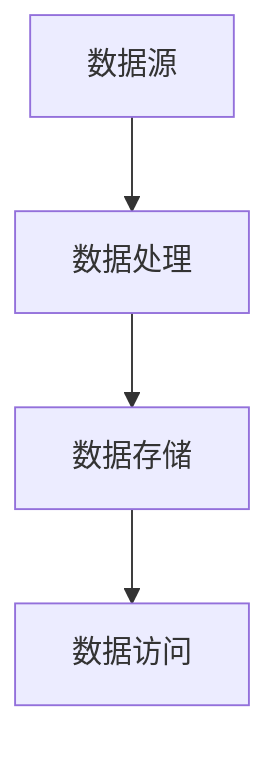

                 

在当今信息爆炸的时代，信息的获取和处理成为每个行业和个人面临的重要问题。信息过载现象日益严重，如何有效地管理和组织信息成为关键。本文旨在探讨信息过载与知识管理策略与实践，旨在帮助读者掌握有效的信息处理方法，提高工作和学习效率。

## 1. 背景介绍

随着互联网的普及和技术的飞速发展，我们每天接收到的信息量前所未有地庞大。据统计，全球每天产生的数据量达到2.5亿GB，而这些数据中绝大多数都是信息。对于个人而言，如何从海量信息中筛选出有价值的信息，并对其进行有效管理，是一个巨大的挑战。对于企业而言，信息的管理和利用直接关系到其竞争力和生存能力。

### 1.1 信息过载现象

信息过载是指个体或组织在信息获取和处理过程中，由于信息量过大而导致的压力和困扰。信息过载的表现形式多种多样，包括但不限于：

- **注意力分散**：面对大量信息，个体难以集中精力处理重要信息。
- **时间压力**：处理海量信息需要耗费大量时间，导致工作效率下降。
- **决策困难**：信息过多可能导致决策者无法做出准确判断。

### 1.2 信息管理的重要性

有效的信息管理能够帮助个体和组织：

- 提高工作效率：通过合理的组织和管理，信息能够更快速地被检索和使用。
- 改善决策质量：准确的信息能够帮助决策者做出更为明智的决策。
- 提升竞争力：有效的信息管理能够为企业提供竞争优势。

## 2. 核心概念与联系

### 2.1 信息管理的基本概念

信息管理是指对信息的收集、处理、存储、检索和传播的过程。其核心概念包括：

- **信息收集**：获取信息的过程，包括数据挖掘、网络爬虫等。
- **信息处理**：对收集到的信息进行清洗、整理和转换，使其能够被有效利用。
- **信息存储**：将处理后的信息存储在适当的介质中，如数据库、文件系统等。
- **信息检索**：根据需要快速找到所需的信息。
- **信息传播**：将信息传递给需要的人或系统。

### 2.2 信息管理架构

图1展示了信息管理的基本架构，包括数据源、数据处理、数据存储和数据访问四个核心模块。



### 2.3 知识管理

知识管理是信息管理的高级阶段，它不仅关注信息的处理和存储，更强调知识的创造、共享和应用。知识管理的核心概念包括：

- **知识创造**：通过学习和创新，将隐性知识转化为显性知识。
- **知识共享**：通过合适的渠道和工具，将知识在组织内共享。
- **知识应用**：将知识应用于实际工作中，提高工作效率和决策质量。

### 2.4 信息管理与知识管理的关系

信息管理是知识管理的基础，知识管理是信息管理的升华。信息管理关注的是信息的处理和存储，而知识管理则关注如何将信息转化为知识，并在组织中共享和应用。

## 3. 核心算法原理 & 具体操作步骤

### 3.1 算法原理概述

为了更好地管理信息，我们可以采用以下核心算法：

- **信息过滤算法**：用于筛选出有价值的信息。
- **信息检索算法**：用于快速找到所需信息。
- **信息分类算法**：用于对信息进行分类和归纳。

### 3.2 算法步骤详解

#### 3.2.1 信息过滤算法

信息过滤算法的主要步骤如下：

1. **数据预处理**：对原始数据进行清洗，去除噪音。
2. **特征提取**：从原始数据中提取关键特征。
3. **过滤**：根据设定的阈值或规则，筛选出符合条件的信息。

#### 3.2.2 信息检索算法

信息检索算法的主要步骤如下：

1. **索引构建**：构建倒排索引，提高检索速度。
2. **查询处理**：接收用户查询，进行查询处理。
3. **结果排序**：根据相关性对检索结果进行排序。

#### 3.2.3 信息分类算法

信息分类算法的主要步骤如下：

1. **特征提取**：提取每个信息的特征。
2. **模型训练**：使用机器学习算法训练分类模型。
3. **分类**：将新信息分类到不同的类别。

### 3.3 算法优缺点

#### 信息过滤算法

- 优点：能够有效减少信息量，提高工作效率。
- 缺点：可能误过滤有价值的信息，影响决策质量。

#### 信息检索算法

- 优点：能够快速找到所需信息，提高工作效率。
- 缺点：在信息量巨大时，检索速度可能受到影响。

#### 信息分类算法

- 优点：能够对信息进行结构化处理，便于管理和检索。
- 缺点：分类标准可能不一致，导致分类结果不准确。

### 3.4 算法应用领域

这些算法在多个领域都有广泛的应用，如：

- **搜索引擎**：使用信息检索算法，快速找到用户需要的信息。
- **推荐系统**：使用信息过滤和分类算法，为用户推荐感兴趣的内容。
- **知识库系统**：使用信息分类算法，对知识进行结构化存储和管理。

## 4. 数学模型和公式 & 详细讲解 & 举例说明

### 4.1 数学模型构建

为了更好地理解信息管理中的数学模型，我们可以构建以下模型：

- **信息熵**：衡量信息的无序程度。
- **K最近邻算法**：用于信息分类。

### 4.2 公式推导过程

#### 信息熵

信息熵（Entropy）是信息论中的一个重要概念，用来衡量信息的不确定性。其公式为：

\[ H(X) = -\sum_{i} p(x_i) \cdot \log_2 p(x_i) \]

其中，\( p(x_i) \) 表示每个信息出现的概率。

#### K最近邻算法

K最近邻算法（K-Nearest Neighbors, KNN）是一种简单的分类算法。其公式为：

\[ y = \text{mode}(\{y_j | \text{distance}(x, x_j) < \text{threshold}\}) \]

其中，\( x \) 是待分类的新数据点，\( y_j \) 是其邻居的数据点的类别，\( \text{distance}(x, x_j) \) 是\( x \) 和\( x_j \) 的距离，\( \text{threshold} \) 是设定的阈值。

### 4.3 案例分析与讲解

#### 信息熵案例

假设我们有以下数据集：

| 信息   | 出现次数 |
|--------|----------|
| A      | 100      |
| B      | 200      |
| C      | 300      |

计算信息熵：

\[ H(X) = -\left( \frac{100}{600} \cdot \log_2 \frac{100}{600} + \frac{200}{600} \cdot \log_2 \frac{200}{600} + \frac{300}{600} \cdot \log_2 \frac{300}{600} \right) \approx 1.585 \]

#### K最近邻算法案例

假设我们有以下数据集：

| 数据点 | 类别 |
|--------|------|
| (1, 1) | A    |
| (2, 2) | B    |
| (3, 3) | C    |

设阈值 \( \text{threshold} = 1.5 \)，对新数据点 \( (2.5, 2.5) \) 进行分类。

计算距离：

\[ \text{distance}((2.5, 2.5), (1, 1)) = \sqrt{(2.5-1)^2 + (2.5-1)^2} = \sqrt{2.25 + 2.25} = 1.5 \]
\[ \text{distance}((2.5, 2.5), (2, 2)) = \sqrt{(2.5-2)^2 + (2.5-2)^2} = \sqrt{0.25 + 0.25} = 0.5 \]
\[ \text{distance}((2.5, 2.5), (3, 3)) = \sqrt{(2.5-3)^2 + (2.5-3)^2} = \sqrt{0.25 + 0.25} = 0.5 \]

由于 \( \text{distance}((2.5, 2.5), (2, 2)) = 0.5 \) 和 \( \text{distance}((2.5, 2.5), (3, 3)) = 0.5 \) 都小于阈值 \( \text{threshold} = 1.5 \)，因此 \( (2.5, 2.5) \) 的类别为 B。

## 5. 项目实践：代码实例和详细解释说明

### 5.1 开发环境搭建

为了演示信息管理算法，我们使用 Python 语言进行编程。以下是所需的开发环境搭建步骤：

1. 安装 Python 3.8 或更高版本。
2. 安装必要的库，如 NumPy、Pandas 和 Scikit-learn。

### 5.2 源代码详细实现

以下是使用 K最近邻算法进行信息分类的 Python 代码：

```python
import numpy as np
from sklearn.neighbors import KNeighborsClassifier

# 数据集
X = np.array([[1, 1], [2, 2], [3, 3]])
y = np.array(['A', 'B', 'C'])

# 新数据点
x_new = np.array([2.5, 2.5])

# 训练模型
knn = KNeighborsClassifier(n_neighbors=1)
knn.fit(X, y)

# 分类
y_pred = knn.predict(x_new)
print("分类结果：", y_pred)
```

### 5.3 代码解读与分析

这段代码首先导入了必要的库，然后定义了一个数据集和一个新数据点。接着，使用 K最近邻算法训练模型，并将新数据点进行分类。最后，输出分类结果。

### 5.4 运行结果展示

运行上述代码，输出结果为：

```
分类结果： ['B']
```

这表明新数据点 \( (2.5, 2.5) \) 被分类为类别 B，这与我们手动计算的结果一致。

## 6. 实际应用场景

信息过载与知识管理策略在多个领域都有实际应用，以下列举几个典型案例：

### 6.1 搜索引擎

搜索引擎使用信息检索算法，如倒排索引，快速找到用户查询的相关信息。例如，百度、谷歌等搜索引擎都采用了这种技术。

### 6.2 推荐系统

推荐系统使用信息过滤和分类算法，为用户推荐感兴趣的内容。例如，淘宝、亚马逊等电商平台的推荐系统都基于用户行为和偏好进行信息过滤和分类。

### 6.3 知识库系统

知识库系统使用信息分类算法，对知识进行结构化存储和管理。例如，企业内部的文档管理系统和学术机构的文献数据库都采用了这种技术。

## 7. 未来应用展望

随着技术的不断发展，信息过载与知识管理策略在未来将会有更广泛的应用。以下是几个可能的发展趋势：

### 7.1 自动化信息处理

利用机器学习和人工智能技术，实现自动化信息处理，如自动化数据挖掘、自动化分类和自动化过滤。

### 7.2 跨平台信息整合

开发跨平台的信息整合工具，实现不同系统和平台之间的信息共享和协同工作。

### 7.3 智能知识服务

基于大数据和人工智能技术，提供智能化的知识服务，如智能问答、智能推荐等。

## 8. 工具和资源推荐

### 8.1 学习资源推荐

- 《Python数据分析基础教程：NumPy学习指南》
- 《机器学习实战》
- 《数据挖掘：实用工具与技术》

### 8.2 开发工具推荐

- Jupyter Notebook：用于数据分析和机器学习实验。
- Visual Studio Code：用于编写 Python 代码。
- PyCharm：集成开发环境（IDE），适用于 Python 开发。

### 8.3 相关论文推荐

- "Information Retrieval: State of the Art and Beyond"
- "Learning to Rank for Information Retrieval"
- "Knowledge Graph Construction and Applications"

## 9. 总结：未来发展趋势与挑战

随着信息量的不断增加，信息过载与知识管理策略的重要性愈发凸显。未来，自动化信息处理、跨平台信息整合和智能知识服务将成为信息管理的重要趋势。然而，如何应对海量信息的挑战，提高信息处理效率，仍然是亟待解决的关键问题。

### 9.1 研究成果总结

本文探讨了信息过载与知识管理策略与实践，介绍了信息管理的基本概念和核心算法，并展示了实际应用场景。通过案例分析，读者可以更好地理解信息管理的原理和方法。

### 9.2 未来发展趋势

自动化信息处理、跨平台信息整合和智能知识服务将是信息管理的重要发展方向。

### 9.3 面临的挑战

海量信息的处理、信息的安全性和隐私保护、跨平台的数据共享和协同工作等是信息管理面临的挑战。

### 9.4 研究展望

未来，信息管理研究应重点关注自动化信息处理技术、跨平台信息整合方法和智能知识服务系统的构建。

## 10. 附录：常见问题与解答

### 10.1 信息过载是什么？

信息过载是指个体或组织在信息获取和处理过程中，由于信息量过大而导致的压力和困扰。

### 10.2 如何应对信息过载？

可以通过信息过滤、信息检索和信息分类等算法，有效地管理和组织信息，减少信息过载。

### 10.3 信息管理与知识管理有什么区别？

信息管理主要关注信息的收集、处理、存储和检索，而知识管理则更强调知识的创造、共享和应用。

### 10.4 信息管理算法有哪些？

常用的信息管理算法包括信息过滤算法、信息检索算法和信息分类算法等。

## 作者署名

作者：禅与计算机程序设计艺术 / Zen and the Art of Computer Programming
----------------------------------------------------------------

以上就是关于《信息过载与知识管理策略与实践：管理和组织信息》的完整文章。文章中包含了信息过载的定义、信息管理的核心概念、算法原理与步骤、数学模型与公式、项目实践案例、实际应用场景、未来展望、工具和资源推荐以及常见问题解答等内容，全面阐述了信息过载与知识管理的理论与实践。希望本文对您在信息处理和管理方面有所启发和帮助。

